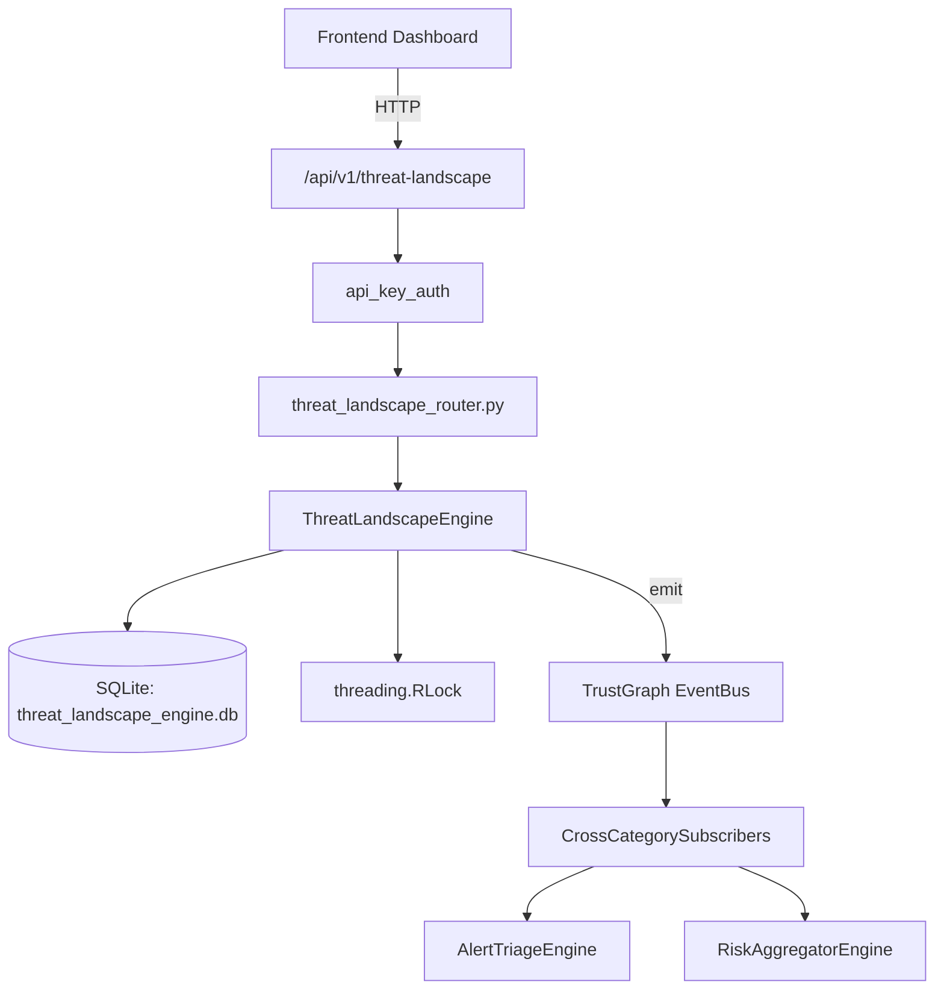

# US-0298: Threat Landscape

## Sub-Epic: AI Intelligence
**Master Goal**: ALDECI — $35/mo enterprise security intelligence platform replacing $50K-500K/yr tools

## User Story
As a **Sarah Chen (CISO)**, I need to assess the threat landscape
so that the platform delivers enterprise-grade ai intelligence capabilities at 1/1000th the cost of legacy tools.

## Why This Matters
Threat Landscape replaces functionality found in enterprise tools like CrowdStrike, Wiz, Snyk, and Rapid7.
By building this into ALDECI's $35/mo stack, customers save $50K+/yr on standalone AI Intelligence tooling.

## Architecture

## Current State: 95% Complete
- ✅ `add_threat_actor()` — Add a threat actor; confidence clamped to [0, 1]. (line 162)
- ✅ `update_actor_activity()` — Update actor active status and last_seen timestamp. (line 212)
- ✅ `get_active_actors()` — List active threat actors, optionally filtered by actor_type. (line 234)
- ✅ `add_emerging_threat()` — Add an emerging threat with status=active. (line 254)
- ✅ `resolve_threat()` — Mark a threat as resolved. (line 302)
- ✅ `get_active_threats()` — List active threats, optionally filtered by severity. (line 318)
- ❌ TrustGraph event emission — not yet verified

## Key Functions (from `suite-core/core/threat_landscape_engine.py` — 485 lines)
- `ThreatLandscapeEngine.add_threat_actor()` — Add a threat actor; confidence clamped to [0, 1]. (line 162)
- `ThreatLandscapeEngine.update_actor_activity()` — Update actor active status and last_seen timestamp. (line 212)
- `ThreatLandscapeEngine.get_active_actors()` — List active threat actors, optionally filtered by actor_type. (line 234)
- `ThreatLandscapeEngine.add_emerging_threat()` — Add an emerging threat with status=active. (line 254)
- `ThreatLandscapeEngine.resolve_threat()` — Mark a threat as resolved. (line 302)
- `ThreatLandscapeEngine.get_active_threats()` — List active threats, optionally filtered by severity. (line 318)
- `ThreatLandscapeEngine.create_assessment()` — Create a landscape assessment with auto-computed risk and counts. (line 362)
- `ThreatLandscapeEngine.get_assessment()` — Get a single assessment by ID. (line 410)

## Dependencies
- **Depends on**: standalone
- **Depended by**: Routers, TrustGraph EventBus, CrossCategorySubscribers
- **TrustGraph**: Event emission wired via ResponseInterceptorMiddleware
- **Source file**: `suite-core/core/threat_landscape_engine.py` (485 lines)
- **Router file**: `suite-api/apps/api/threat_landscape_router.py`

## API Endpoints
| Method | Path | Description |
|--------|------|-------------|
| POST | `/api/v1/threat-landscape/actors` | add threat actor |
| PATCH | `/api/v1/threat-landscape/actors/{actor_id}/activity` | update actor activity |
| GET | `/api/v1/threat-landscape/actors` | get active actors |
| POST | `/api/v1/threat-landscape/threats` | add emerging threat |
| POST | `/api/v1/threat-landscape/threats/{threat_id}/resolve` | resolve threat |
| GET | `/api/v1/threat-landscape/threats` | get active threats |
| POST | `/api/v1/threat-landscape/assessments` | create assessment |
| GET | `/api/v1/threat-landscape/assessments` | list assessments |
| GET | `/api/v1/threat-landscape/assessments/{assessment_id}` | get assessment |
| GET | `/api/v1/threat-landscape/summary` | get landscape summary |

## Tasks Remaining
1. Verify TrustGraph event emission works end-to-end (2h)
2. Add integration test with real persona workflow (2h)
3. Wire CrossCategorySubscriber consumer chain (1h)
4. Validate with 30-persona walkthrough (1h)
5. Optimize query performance for large datasets (2h)
6. Expand test coverage to edge cases (2h)

## Definition of Done
- [ ] Sarah Chen (CISO) can access /api/v1/threat-landscape and get meaningful data
- [ ] All CRUD operations return correct HTTP status codes
- [ ] TrustGraph receives events from this engine
- [ ] 47+ tests passing in `tests/test_threat_landscape_engine.py`
- [ ] 30-persona walkthrough includes this endpoint at 100%
- [ ] No hardcoded org_id — all queries are org-scoped

## Sprint: Wave 51 (est. April 27-29, 2026)

## Test Coverage
- **Test file**: `tests/test_threat_landscape_engine.py`
- **Tests**: 47 tests
- **Status**: Passing
