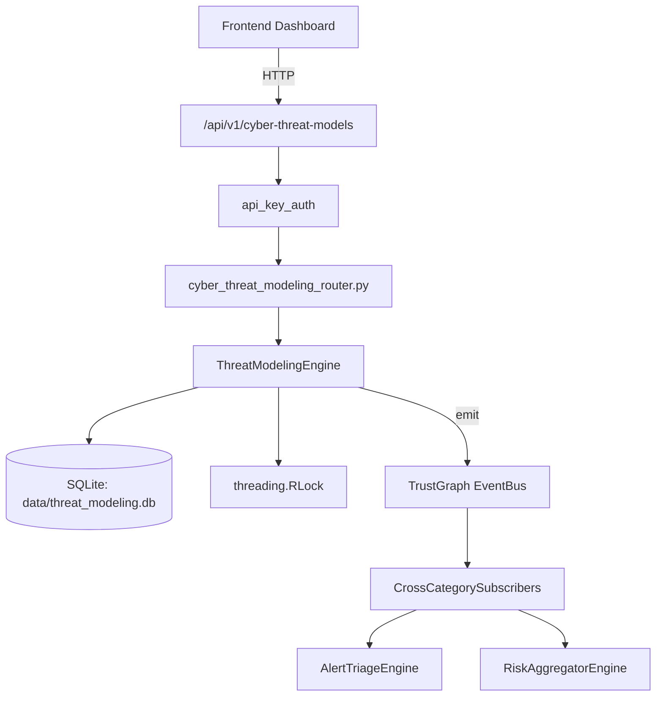

# US-0299: Threat Modeling

## Sub-Epic: Advanced
**Master Goal**: ALDECI — $35/mo enterprise security intelligence platform replacing $50K-500K/yr tools

## User Story
As a **Richard Adams (Security Architect)**, I need to generate STRIDE threat models
so that the platform delivers enterprise-grade advanced capabilities at 1/1000th the cost of legacy tools.

## Why This Matters
Threat Modeling replaces functionality found in enterprise tools like CrowdStrike, Wiz, Snyk, and Rapid7.
By building this into ALDECI's $35/mo stack, customers save $50K+/yr on standalone Advanced tooling.

## Architecture

## Current State: 95% Complete
- ✅ `create_model()` — Create a threat model. Returns {model_id, name, state: 'draft', ...} (line 146)
- ✅ `add_component()` — Add a component to the model. (line 173)
- ✅ `add_data_flow()` — Add a data flow between components. Returns {flow_id, ...} (line 209)
- ✅ `analyze_threats()` — Run STRIDE analysis on a model. (line 247)
- ✅ `add_mitigation()` — Record a mitigation for a threat. Returns {mitigation_id, ...} (line 473)
- ✅ `get_model()` — implemented (line 500)
- ❌ TrustGraph event emission — not yet verified

## Key Functions (from `suite-core/core/threat_modeling_engine.py` — 657 lines)
- `ThreatModelingEngine.create_model()` — Create a threat model. Returns {model_id, name, state: 'draft', ...} (line 146)
- `ThreatModelingEngine.add_component()` — Add a component to the model. (line 173)
- `ThreatModelingEngine.add_data_flow()` — Add a data flow between components. Returns {flow_id, ...} (line 209)
- `ThreatModelingEngine.analyze_threats()` — Run STRIDE analysis on a model. (line 247)
- `ThreatModelingEngine.add_mitigation()` — Record a mitigation for a threat. Returns {mitigation_id, ...} (line 473)
- `ThreatModelingEngine.get_model()` — Handle get model (line 500)
- `ThreatModelingEngine.list_models()` — Handle list models (line 509)
- `ThreatModelingEngine.get_model_report()` — Full model report: components, data flows, threats, mitigations, risk summary. (line 517)

## Dependencies
- **Depends on**: standalone
- **Depended by**: Routers, TrustGraph EventBus, CrossCategorySubscribers
- **TrustGraph**: Event emission wired via ResponseInterceptorMiddleware
- **Source file**: `suite-core/core/threat_modeling_engine.py` (657 lines)
- **Router file**: `suite-api/apps/api/cyber_threat_modeling_router.py`

## API Endpoints
| Method | Path | Description |
|--------|------|-------------|
| POST | `/api/v1/cyber-threat-models/models` | create model |
| POST | `/api/v1/cyber-threat-models/models/{model_id}/trees` | add attack tree |
| PUT | `/api/v1/cyber-threat-models/trees/{tree_id}/mitigate` | mitigate tree |
| POST | `/api/v1/cyber-threat-models/models/{model_id}/actors` | add threat actor |
| PUT | `/api/v1/cyber-threat-models/models/{model_id}/finalize` | finalize model |
| GET | `/api/v1/cyber-threat-models/models/{model_id}` | get model detail |
| GET | `/api/v1/cyber-threat-models/unmitigated` | get unmitigated threats |
| GET | `/api/v1/cyber-threat-models/summary` | get model summary |

## Tasks Remaining
1. Verify TrustGraph event emission works end-to-end (2h)
2. Add integration test with real persona workflow (2h)
3. Wire CrossCategorySubscriber consumer chain (1h)
4. Validate with 30-persona walkthrough (1h)
5. Optimize query performance for large datasets (2h)
6. Expand test coverage to edge cases (2h)

## Definition of Done
- [ ] Richard Adams (Security Architect) can access /api/v1/cyber-threat-models and get meaningful data
- [ ] All CRUD operations return correct HTTP status codes
- [ ] TrustGraph receives events from this engine
- [ ] 33+ tests passing in `tests/test_threat_modeling_engine.py`
- [ ] 30-persona walkthrough includes this endpoint at 100%
- [ ] No hardcoded org_id — all queries are org-scoped

## Sprint: Wave 51 (est. April 27-29, 2026)

## Test Coverage
- **Test file**: `tests/test_threat_modeling_engine.py`
- **Tests**: 33 tests
- **Status**: Passing
