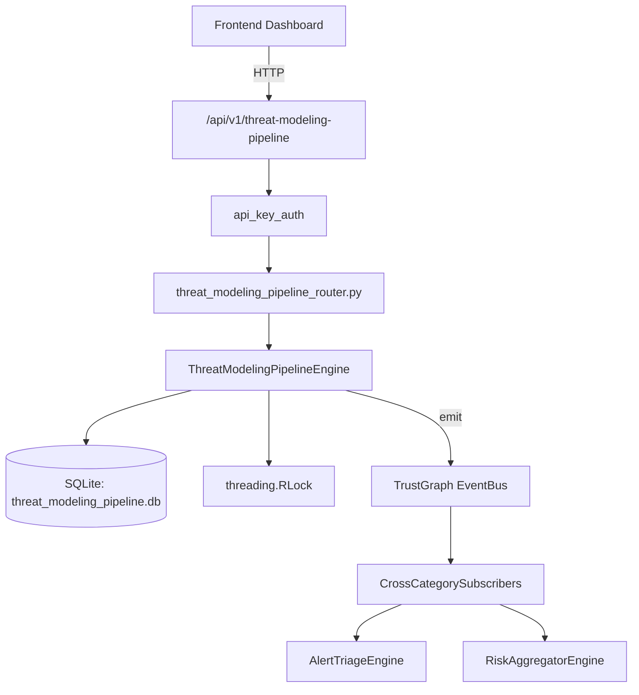

# US-0300: Threat Modeling Pipeline

## Sub-Epic: Advanced
**Master Goal**: ALDECI — $35/mo enterprise security intelligence platform replacing $50K-500K/yr tools

## User Story
As a **Richard Adams (Security Architect)**, I need to generate STRIDE threat models
so that the platform delivers enterprise-grade advanced capabilities at 1/1000th the cost of legacy tools.

## Why This Matters
Threat Modeling Pipeline replaces functionality found in enterprise tools like CrowdStrike, Wiz, Snyk, and Rapid7.
By building this into ALDECI's $35/mo stack, customers save $50K+/yr on standalone Advanced tooling.

## Architecture

## Current State: 95% Complete
- ✅ `create_model()` — Create a new threat model in draft status. (line 192)
- ✅ `add_component()` — Add a component to a threat model. (line 234)
- ✅ `add_threat()` — Add a threat to a model. Auto-computes risk_level; updates model counters. (line 281)
- ✅ `mitigate_threat()` — Mark a threat as mitigated; recompute model risk_score from unmitigated only. (line 344)
- ✅ `finalize_model()` — Transition model status to finalized. (line 384)
- ✅ `get_model()` — Return model with its components and threats. (line 406)
- ❌ TrustGraph event emission — not yet verified

## Key Functions (from `suite-core/core/threat_modeling_pipeline_engine.py` — 513 lines)
- `ThreatModelingPipelineEngine.create_model()` — Create a new threat model in draft status. (line 192)
- `ThreatModelingPipelineEngine.add_component()` — Add a component to a threat model. (line 234)
- `ThreatModelingPipelineEngine.add_threat()` — Add a threat to a model. Auto-computes risk_level; updates model counters. (line 281)
- `ThreatModelingPipelineEngine.mitigate_threat()` — Mark a threat as mitigated; recompute model risk_score from unmitigated only. (line 344)
- `ThreatModelingPipelineEngine.finalize_model()` — Transition model status to finalized. (line 384)
- `ThreatModelingPipelineEngine.get_model()` — Return model with its components and threats. (line 406)
- `ThreatModelingPipelineEngine.list_models()` — List models with optional status/methodology filters. (line 436)
- `ThreatModelingPipelineEngine.get_stride_summary()` — Return per-STRIDE-category counts, mitigated count, and risk_level distribution. (line 457)

## Dependencies
- **Depends on**: standalone
- **Depended by**: Routers, TrustGraph EventBus, CrossCategorySubscribers
- **TrustGraph**: Event emission wired via ResponseInterceptorMiddleware
- **Source file**: `suite-core/core/threat_modeling_pipeline_engine.py` (513 lines)
- **Router file**: `suite-api/apps/api/threat_modeling_pipeline_router.py`

## API Endpoints
| Method | Path | Description |
|--------|------|-------------|
| POST | `/api/v1/threat-modeling-pipeline/models` | create model |
| POST | `/api/v1/threat-modeling-pipeline/models/{model_id}/components` | add component |
| POST | `/api/v1/threat-modeling-pipeline/models/{model_id}/threats` | add threat |
| POST | `/api/v1/threat-modeling-pipeline/models/{model_id}/threats/{threat_id}/mitigate` | mitigate threat |
| POST | `/api/v1/threat-modeling-pipeline/models/{model_id}/finalize` | finalize model |
| GET | `/api/v1/threat-modeling-pipeline/models/{model_id}` | get model |
| GET | `/api/v1/threat-modeling-pipeline/models` | list models |
| GET | `/api/v1/threat-modeling-pipeline/models/{model_id}/stride-summary` | get stride summary |
| GET | `/api/v1/threat-modeling-pipeline/unmitigated` | get unmitigated threats |

## Tasks Remaining
1. Verify TrustGraph event emission works end-to-end (2h)
2. Add integration test with real persona workflow (2h)
3. Wire CrossCategorySubscriber consumer chain (1h)
4. Validate with 30-persona walkthrough (1h)
5. Optimize query performance for large datasets (2h)
6. Expand test coverage to edge cases (2h)

## Definition of Done
- [ ] Richard Adams (Security Architect) can access /api/v1/threat-modeling-pipeline and get meaningful data
- [ ] All CRUD operations return correct HTTP status codes
- [ ] TrustGraph receives events from this engine
- [ ] 60+ tests passing in `tests/test_threat_modeling_pipeline_engine.py`
- [ ] 30-persona walkthrough includes this endpoint at 100%
- [ ] No hardcoded org_id — all queries are org-scoped

## Sprint: Wave 52 (est. April 28-30, 2026)

## Test Coverage
- **Test file**: `tests/test_threat_modeling_pipeline_engine.py`
- **Tests**: 60 tests
- **Status**: Passing
