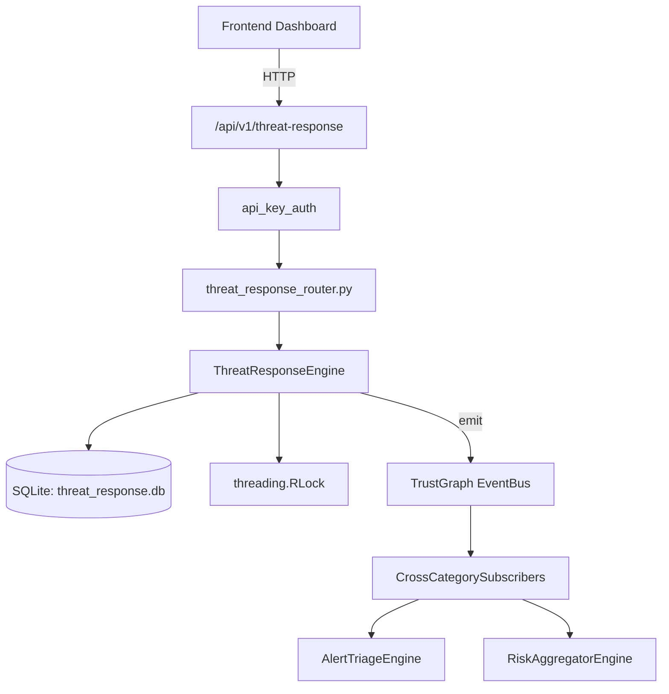

# US-0301: Threat Response

## Sub-Epic: Advanced
**Master Goal**: ALDECI — $35/mo enterprise security intelligence platform replacing $50K-500K/yr tools

## User Story
As a **Karen Taylor (IR Lead)**, I need to orchestrate threat response
so that the platform delivers enterprise-grade advanced capabilities at 1/1000th the cost of legacy tools.

## Why This Matters
Threat Response replaces functionality found in enterprise tools like CrowdStrike, Wiz, Snyk, and Rapid7.
By building this into ALDECI's $35/mo stack, customers save $50K+/yr on standalone Advanced tooling.

## Architecture

## Current State: 95% Complete
- ✅ `create_playbook()` — Create a new response playbook. (line 162)
- ✅ `add_action()` — Add an action to a playbook. step_number = MAX(existing)+1. (line 211)
- ✅ `trigger_incident()` — Trigger a new incident, linking it to a playbook. (line 274)
- ✅ `log_action()` — Log the start of an action on an incident (status=in_progress). (line 321)
- ✅ `complete_action()` — Complete or fail a logged action. (line 356)
- ✅ `resolve_incident()` — Resolve an incident and update playbook avg_resolution_mins. (line 389)
- ❌ TrustGraph event emission — not yet verified

## Key Functions (from `suite-core/core/threat_response_engine.py` — 541 lines)
- `ThreatResponseEngine.create_playbook()` — Create a new response playbook. (line 162)
- `ThreatResponseEngine.add_action()` — Add an action to a playbook. step_number = MAX(existing)+1. (line 211)
- `ThreatResponseEngine.trigger_incident()` — Trigger a new incident, linking it to a playbook. (line 274)
- `ThreatResponseEngine.log_action()` — Log the start of an action on an incident (status=in_progress). (line 321)
- `ThreatResponseEngine.complete_action()` — Complete or fail a logged action. (line 356)
- `ThreatResponseEngine.resolve_incident()` — Resolve an incident and update playbook avg_resolution_mins. (line 389)
- `ThreatResponseEngine.get_active_incidents()` — Return all active incidents with their action logs. (line 448)
- `ThreatResponseEngine.get_playbook_performance()` — Return playbooks with execution_count, avg_resolution_mins, step_count. (line 465)

## Dependencies
- **Depends on**: standalone
- **Depended by**: Routers, TrustGraph EventBus, CrossCategorySubscribers
- **TrustGraph**: Event emission wired via ResponseInterceptorMiddleware
- **Source file**: `suite-core/core/threat_response_engine.py` (541 lines)
- **Router file**: `suite-api/apps/api/threat_response_router.py`

## API Endpoints
| Method | Path | Description |
|--------|------|-------------|
| POST | `/api/v1/threat-response/playbooks` | create playbook |
| POST | `/api/v1/threat-response/playbooks/{playbook_id}/actions` | add action |
| GET | `/api/v1/threat-response/playbooks/performance` | get playbook performance |
| POST | `/api/v1/threat-response/incidents` | trigger incident |
| POST | `/api/v1/threat-response/incidents/{incident_id}/log-action` | log action |
| PUT | `/api/v1/threat-response/incidents/{incident_id}/resolve` | resolve incident |
| GET | `/api/v1/threat-response/incidents/active` | get active incidents |
| GET | `/api/v1/threat-response/incidents/{incident_id}/timeline` | get incident timeline |
| PUT | `/api/v1/threat-response/action-logs/{log_id}/complete` | complete action |
| GET | `/api/v1/threat-response/summary` | get response summary |

## Tasks Remaining
1. Verify TrustGraph event emission works end-to-end (2h)
2. Add integration test with real persona workflow (2h)
3. Wire CrossCategorySubscriber consumer chain (1h)
4. Validate with 30-persona walkthrough (1h)
5. Optimize query performance for large datasets (2h)
6. Expand test coverage to edge cases (2h)

## Definition of Done
- [ ] Karen Taylor (IR Lead) can access /api/v1/threat-response and get meaningful data
- [ ] All CRUD operations return correct HTTP status codes
- [ ] TrustGraph receives events from this engine
- [ ] 41+ tests passing in `tests/test_threat_response_engine.py`
- [ ] 30-persona walkthrough includes this endpoint at 100%
- [ ] No hardcoded org_id — all queries are org-scoped

## Sprint: Wave 52 (est. April 28-30, 2026)

## Test Coverage
- **Test file**: `tests/test_threat_response_engine.py`
- **Tests**: 41 tests
- **Status**: Passing
