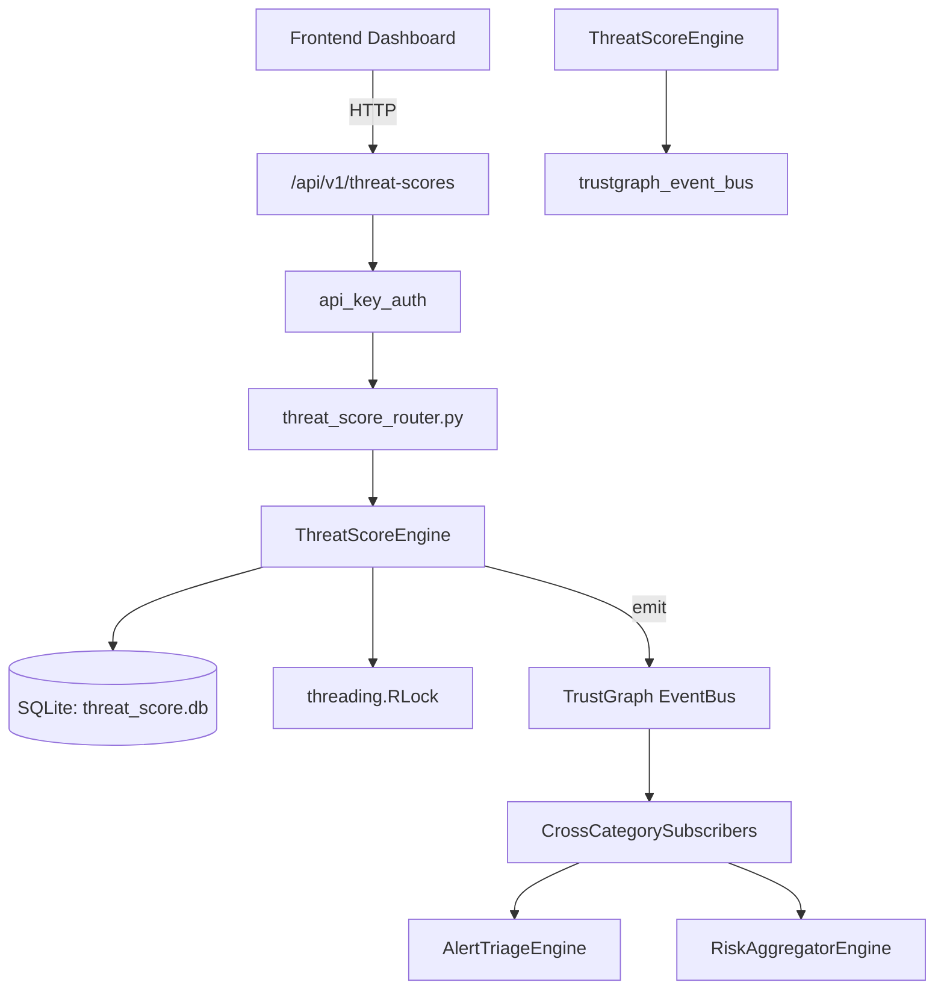

# US-0302: Threat Score

## Sub-Epic: AI Intelligence
**Master Goal**: ALDECI — $35/mo enterprise security intelligence platform replacing $50K-500K/yr tools

## User Story
As a **David Park (Risk Manager)**, I need to compute weighted threat scores
so that the platform delivers enterprise-grade ai intelligence capabilities at 1/1000th the cost of legacy tools.

## Why This Matters
Threat Score replaces functionality found in enterprise tools like CrowdStrike, Wiz, Snyk, and Rapid7.
By building this into ALDECI's $35/mo stack, customers save $50K+/yr on standalone AI Intelligence tooling.

## Architecture

## Current State: 95% Complete
- ✅ `ingest_signal()` — Ingest a security signal for an asset. (line 132)
- ✅ `calculate_score()` — Calculate weighted composite threat score from last 30 signals. (line 190)
- ✅ `get_score()` — Return latest score record or None if not yet calculated. (line 280)
- ✅ `list_scores()` — List all scores with optional filters. (line 289)
- ✅ `get_score_history()` — Return score history ordered by most recent first. (line 309)
- ✅ `get_top_threats()` — Return top-scoring assets ordered by score descending. (line 328)
- ❌ TrustGraph event emission — not yet verified

## Key Functions (from `suite-core/core/threat_score_engine.py` — 387 lines)
- `ThreatScoreEngine.ingest_signal()` — Ingest a security signal for an asset. (line 132)
- `ThreatScoreEngine.calculate_score()` — Calculate weighted composite threat score from last 30 signals. (line 190)
- `ThreatScoreEngine.get_score()` — Return latest score record or None if not yet calculated. (line 280)
- `ThreatScoreEngine.list_scores()` — List all scores with optional filters. (line 289)
- `ThreatScoreEngine.get_score_history()` — Return score history ordered by most recent first. (line 309)
- `ThreatScoreEngine.get_top_threats()` — Return top-scoring assets ordered by score descending. (line 328)
- `ThreatScoreEngine.get_threat_stats()` — Return aggregated threat score statistics for an org. (line 342)

## Dependencies
- **Depends on**: trustgraph_event_bus
- **Depended by**: Routers, TrustGraph EventBus, CrossCategorySubscribers
- **TrustGraph**: Event emission wired via ResponseInterceptorMiddleware
- **Source file**: `suite-core/core/threat_score_engine.py` (387 lines)
- **Router file**: `suite-api/apps/api/threat_score_router.py`

## API Endpoints
| Method | Path | Description |
|--------|------|-------------|
| POST | `/api/v1/threat-scores/signals` | ingest signal |
| POST | `/api/v1/threat-scores/scores/{asset_id}/calculate` | calculate score |
| GET | `/api/v1/threat-scores/scores` | list scores |
| GET | `/api/v1/threat-scores/scores/{asset_id}` | get score |
| GET | `/api/v1/threat-scores/scores/{asset_id}/history` | get score history |
| GET | `/api/v1/threat-scores/top-threats` | get top threats |
| GET | `/api/v1/threat-scores/stats` | get threat stats |

## Tasks Remaining
1. Verify TrustGraph event emission works end-to-end (2h)
2. Add integration test with real persona workflow (2h)
3. Wire CrossCategorySubscriber consumer chain (1h)
4. Validate with 30-persona walkthrough (1h)
5. Optimize query performance for large datasets (2h)
6. Expand test coverage to edge cases (2h)

## Definition of Done
- [ ] David Park (Risk Manager) can access /api/v1/threat-scores and get meaningful data
- [ ] All CRUD operations return correct HTTP status codes
- [ ] TrustGraph receives events from this engine
- [ ] 34+ tests passing in `tests/test_threat_score_engine.py`
- [ ] 30-persona walkthrough includes this endpoint at 100%
- [ ] No hardcoded org_id — all queries are org-scoped

## Sprint: Wave 52 (est. April 28-30, 2026)

## Test Coverage
- **Test file**: `tests/test_threat_score_engine.py`
- **Tests**: 34 tests
- **Status**: Passing
