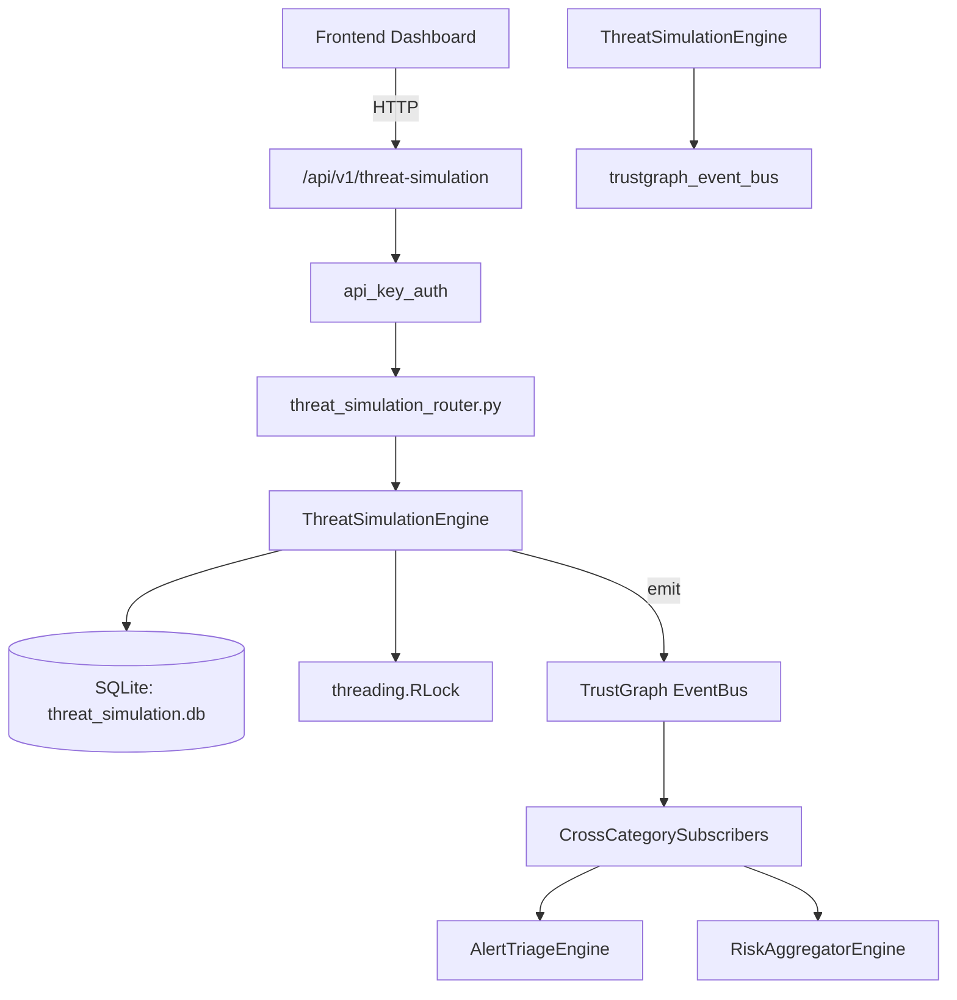

# US-0303: Threat Simulation

## Sub-Epic: Advanced
**Master Goal**: ALDECI — $35/mo enterprise security intelligence platform replacing $50K-500K/yr tools

## User Story
As a **Lisa Zhang (Pentester)**, I need to simulate red/blue team exercises
so that the platform delivers enterprise-grade advanced capabilities at 1/1000th the cost of legacy tools.

## Why This Matters
Threat Simulation replaces functionality found in enterprise tools like CrowdStrike, Wiz, Snyk, and Rapid7.
By building this into ALDECI's $35/mo stack, customers save $50K+/yr on standalone Advanced tooling.

## Architecture

## Current State: 95% Complete
- ✅ `create_scenario()` — Create a new threat simulation scenario. (line 146)
- ✅ `list_scenarios()` — List scenarios with optional filters. (line 204)
- ✅ `get_scenario()` — Retrieve a single scenario by ID. Returns None if not found. (line 224)
- ✅ `start_simulation()` — Start a new simulation run from a scenario. (line 239)
- ✅ `record_detection()` — Record a technique detection within a running simulation. (line 287)
- ✅ `complete_simulation()` — Mark a simulation as completed and compute detection metrics. (line 332)
- ❌ TrustGraph event emission — not yet verified

## Key Functions (from `suite-core/core/threat_simulation_engine.py` — 453 lines)
- `ThreatSimulationEngine.create_scenario()` — Create a new threat simulation scenario. (line 146)
- `ThreatSimulationEngine.list_scenarios()` — List scenarios with optional filters. (line 204)
- `ThreatSimulationEngine.get_scenario()` — Retrieve a single scenario by ID. Returns None if not found. (line 224)
- `ThreatSimulationEngine.start_simulation()` — Start a new simulation run from a scenario. (line 239)
- `ThreatSimulationEngine.record_detection()` — Record a technique detection within a running simulation. (line 287)
- `ThreatSimulationEngine.complete_simulation()` — Mark a simulation as completed and compute detection metrics. (line 332)
- `ThreatSimulationEngine.list_simulations()` — List simulations with optional filters. (line 382)
- `ThreatSimulationEngine.get_simulation_stats()` — Return aggregated simulation statistics for an org. (line 406)

## Dependencies
- **Depends on**: trustgraph_event_bus
- **Depended by**: Routers, TrustGraph EventBus, CrossCategorySubscribers
- **TrustGraph**: Event emission wired via ResponseInterceptorMiddleware
- **Source file**: `suite-core/core/threat_simulation_engine.py` (453 lines)
- **Router file**: `suite-api/apps/api/threat_simulation_router.py`

## API Endpoints
| Method | Path | Description |
|--------|------|-------------|
| POST | `/api/v1/threat-simulation/scenarios` | create scenario |
| GET | `/api/v1/threat-simulation/scenarios` | list scenarios |
| GET | `/api/v1/threat-simulation/scenarios/{scenario_id}` | get scenario |
| POST | `/api/v1/threat-simulation/simulations` | start simulation |
| POST | `/api/v1/threat-simulation/simulations/{sim_id}/detections` | record detection |
| PUT | `/api/v1/threat-simulation/simulations/{sim_id}/complete` | complete simulation |
| GET | `/api/v1/threat-simulation/simulations` | list simulations |
| GET | `/api/v1/threat-simulation/stats` | get simulation stats |

## Tasks Remaining
1. Verify TrustGraph event emission works end-to-end (2h)
2. Add integration test with real persona workflow (2h)
3. Wire CrossCategorySubscriber consumer chain (1h)
4. Validate with 30-persona walkthrough (1h)
5. Optimize query performance for large datasets (2h)
6. Expand test coverage to edge cases (2h)

## Definition of Done
- [ ] Lisa Zhang (Pentester) can access /api/v1/threat-simulation and get meaningful data
- [ ] All CRUD operations return correct HTTP status codes
- [ ] TrustGraph receives events from this engine
- [ ] 37+ tests passing in `tests/test_threat_simulation_engine.py`
- [ ] 30-persona walkthrough includes this endpoint at 100%
- [ ] No hardcoded org_id — all queries are org-scoped

## Sprint: Wave 52 (est. April 28-30, 2026)

## Test Coverage
- **Test file**: `tests/test_threat_simulation_engine.py`
- **Tests**: 37 tests
- **Status**: Passing
