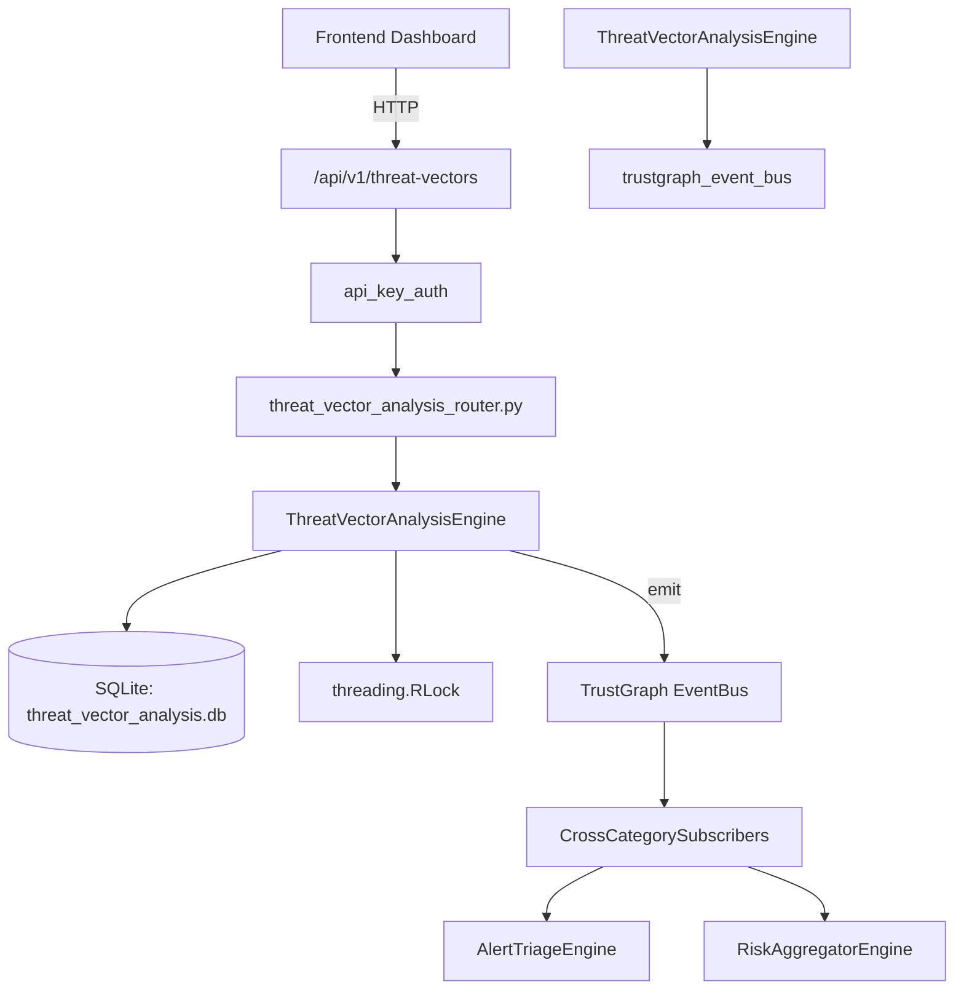

# US-0304: Threat Vector Analysis

## Sub-Epic: Advanced
**Master Goal**: ALDECI — $35/mo enterprise security intelligence platform replacing $50K-500K/yr tools

## User Story
As a **David Park (Risk Manager)**, I need to analyze threat attack vectors
so that the platform delivers enterprise-grade advanced capabilities at 1/1000th the cost of legacy tools.

## Why This Matters
Threat Vector Analysis replaces functionality found in enterprise tools like CrowdStrike, Wiz, Snyk, and Rapid7.
By building this into ALDECI's $35/mo stack, customers save $50K+/yr on standalone Advanced tooling.

## Architecture

## Current State: 95% Complete
- ✅ `record_vector()` — Record a new threat vector. (line 140)
- ✅ `list_vectors()` — List threat vectors with optional filters, newest first. (line 210)
- ✅ `get_vector()` — Retrieve a single threat vector by ID (org-scoped). (line 233)
- ✅ `add_indicator()` — Add an indicator to a threat vector. (line 246)
- ✅ `list_indicators()` — List indicators with optional filters. (line 304)
- ✅ `create_mitigation()` — Create a mitigation plan for a threat vector. (line 331)
- ❌ TrustGraph event emission — not yet verified

## Key Functions (from `suite-core/core/threat_vector_analysis_engine.py` — 471 lines)
- `ThreatVectorAnalysisEngine.record_vector()` — Record a new threat vector. (line 140)
- `ThreatVectorAnalysisEngine.list_vectors()` — List threat vectors with optional filters, newest first. (line 210)
- `ThreatVectorAnalysisEngine.get_vector()` — Retrieve a single threat vector by ID (org-scoped). (line 233)
- `ThreatVectorAnalysisEngine.add_indicator()` — Add an indicator to a threat vector. (line 246)
- `ThreatVectorAnalysisEngine.list_indicators()` — List indicators with optional filters. (line 304)
- `ThreatVectorAnalysisEngine.create_mitigation()` — Create a mitigation plan for a threat vector. (line 331)
- `ThreatVectorAnalysisEngine.list_mitigations()` — List mitigations with optional filters. (line 391)
- `ThreatVectorAnalysisEngine.get_vector_stats()` — Return aggregate stats for the org. (line 418)

## Dependencies
- **Depends on**: trustgraph_event_bus
- **Depended by**: Routers, TrustGraph EventBus, CrossCategorySubscribers
- **TrustGraph**: Event emission wired via ResponseInterceptorMiddleware
- **Source file**: `suite-core/core/threat_vector_analysis_engine.py` (471 lines)
- **Router file**: `suite-api/apps/api/threat_vector_analysis_router.py`

## API Endpoints
| Method | Path | Description |
|--------|------|-------------|
| POST | `/api/v1/threat-vectors/vectors` | record vector |
| GET | `/api/v1/threat-vectors/vectors` | list vectors |
| GET | `/api/v1/threat-vectors/vectors/{vector_id}` | get vector |
| POST | `/api/v1/threat-vectors/vectors/{vector_id}/indicators` | add indicator |
| GET | `/api/v1/threat-vectors/indicators` | list indicators |
| POST | `/api/v1/threat-vectors/vectors/{vector_id}/mitigations` | create mitigation |
| GET | `/api/v1/threat-vectors/mitigations` | list mitigations |
| GET | `/api/v1/threat-vectors/stats` | get vector stats |

## Tasks Remaining
1. Verify TrustGraph event emission works end-to-end (2h)
2. Add integration test with real persona workflow (2h)
3. Wire CrossCategorySubscriber consumer chain (1h)
4. Validate with 30-persona walkthrough (1h)
5. Optimize query performance for large datasets (2h)
6. Expand test coverage to edge cases (2h)

## Definition of Done
- [ ] David Park (Risk Manager) can access /api/v1/threat-vectors and get meaningful data
- [ ] All CRUD operations return correct HTTP status codes
- [ ] TrustGraph receives events from this engine
- [ ] 36+ tests passing in `tests/test_threat_vector_analysis_engine.py`
- [ ] 30-persona walkthrough includes this endpoint at 100%
- [ ] No hardcoded org_id — all queries are org-scoped

## Sprint: Wave 52 (est. April 28-30, 2026)

## Test Coverage
- **Test file**: `tests/test_threat_vector_analysis_engine.py`
- **Tests**: 36 tests
- **Status**: Passing
