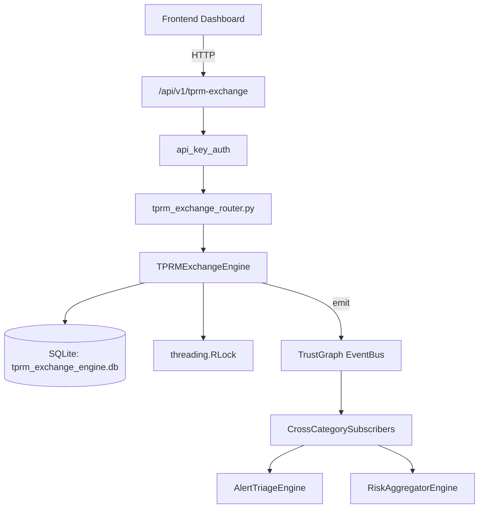

# US-0305: Tprm Exchange

## Sub-Epic: Advanced
**Master Goal**: ALDECI — $35/mo enterprise security intelligence platform replacing $50K-500K/yr tools

## User Story
As a **David Park (Risk Manager)**, I need to manage third-party risk exchange
so that the platform delivers enterprise-grade advanced capabilities at 1/1000th the cost of legacy tools.

## Why This Matters
Tprm Exchange replaces functionality found in enterprise tools like CrowdStrike, Wiz, Snyk, and Rapid7.
By building this into ALDECI's $35/mo stack, customers save $50K+/yr on standalone Advanced tooling.

## Architecture

## Current State: 95% Complete
- ✅ `register_vendor()` — Register a new vendor with criticality-based risk_tier. (line 155)
- ✅ `create_assessment()` — Create a new assessment for a vendor (status=in_progress). (line 214)
- ✅ `complete_assessment()` — Complete an assessment, update vendor risk_score and risk_tier. (line 257)
- ✅ `report_incident()` — Report a vendor incident. (line 311)
- ✅ `resolve_incident()` — Resolve a vendor incident. (line 356)
- ✅ `get_vendor_detail()` — Return vendor profile with all its assessments and incidents. (line 377)
- ❌ TrustGraph event emission — not yet verified

## Key Functions (from `suite-core/core/tprm_exchange_engine.py` — 482 lines)
- `TPRMExchangeEngine.register_vendor()` — Register a new vendor with criticality-based risk_tier. (line 155)
- `TPRMExchangeEngine.create_assessment()` — Create a new assessment for a vendor (status=in_progress). (line 214)
- `TPRMExchangeEngine.complete_assessment()` — Complete an assessment, update vendor risk_score and risk_tier. (line 257)
- `TPRMExchangeEngine.report_incident()` — Report a vendor incident. (line 311)
- `TPRMExchangeEngine.resolve_incident()` — Resolve a vendor incident. (line 356)
- `TPRMExchangeEngine.get_vendor_detail()` — Return vendor profile with all its assessments and incidents. (line 377)
- `TPRMExchangeEngine.get_tprm_summary()` — Return TPRM summary: totals, tier breakdown, category breakdown, overdue, incide (line 399)
- `TPRMExchangeEngine.get_overdue_assessments()` — Return assessments past due_date that are still in_progress. (line 456)

## Dependencies
- **Depends on**: standalone
- **Depended by**: Routers, TrustGraph EventBus, CrossCategorySubscribers
- **TrustGraph**: Event emission wired via ResponseInterceptorMiddleware
- **Source file**: `suite-core/core/tprm_exchange_engine.py` (482 lines)
- **Router file**: `suite-api/apps/api/tprm_exchange_router.py`

## API Endpoints
| Method | Path | Description |
|--------|------|-------------|
| POST | `/api/v1/tprm-exchange/vendors` | register vendor |
| GET | `/api/v1/tprm-exchange/vendors/{vendor_id}` | get vendor detail |
| POST | `/api/v1/tprm-exchange/vendors/{vendor_id}/assessments` | create assessment |
| PUT | `/api/v1/tprm-exchange/assessments/{assessment_id}/complete` | complete assessment |
| POST | `/api/v1/tprm-exchange/vendors/{vendor_id}/incidents` | report incident |
| PUT | `/api/v1/tprm-exchange/incidents/{incident_id}/resolve` | resolve incident |
| GET | `/api/v1/tprm-exchange/summary` | get tprm summary |
| GET | `/api/v1/tprm-exchange/overdue` | get overdue assessments |
| GET | `/api/v1/tprm-exchange/high-risk` | get high risk vendors |

## Tasks Remaining
1. Verify TrustGraph event emission works end-to-end (2h)
2. Add integration test with real persona workflow (2h)
3. Wire CrossCategorySubscriber consumer chain (1h)
4. Validate with 30-persona walkthrough (1h)
5. Optimize query performance for large datasets (2h)
6. Expand test coverage to edge cases (2h)

## Definition of Done
- [ ] David Park (Risk Manager) can access /api/v1/tprm-exchange and get meaningful data
- [ ] All CRUD operations return correct HTTP status codes
- [ ] TrustGraph receives events from this engine
- [ ] 45+ tests passing in `tests/test_tprm_exchange_engine.py`
- [ ] 30-persona walkthrough includes this endpoint at 100%
- [ ] No hardcoded org_id — all queries are org-scoped

## Sprint: Wave 52 (est. April 28-30, 2026)

## Test Coverage
- **Test file**: `tests/test_tprm_exchange_engine.py`
- **Tests**: 45 tests
- **Status**: Passing
