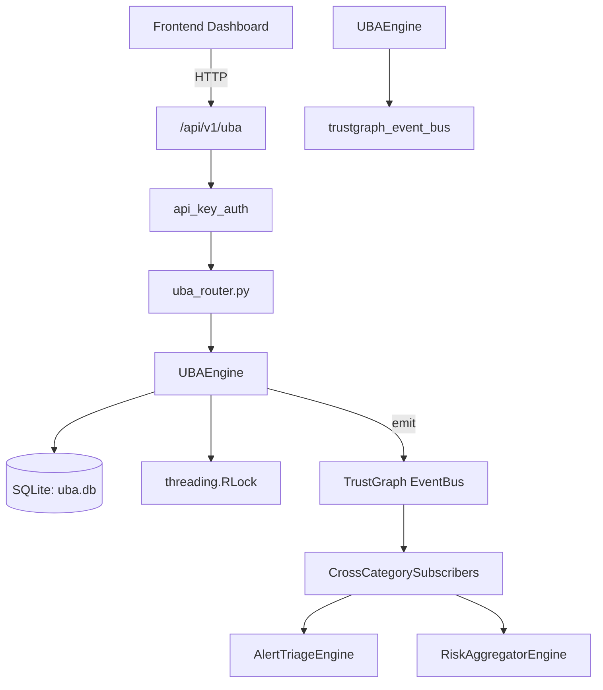

# US-0306: Uba

## Sub-Epic: Advanced
**Master Goal**: ALDECI — $35/mo enterprise security intelligence platform replacing $50K-500K/yr tools

## User Story
As a **Priya Sharma (SOC T2 Analyst)**, I need to analyze user behavior for anomalies
so that the platform delivers enterprise-grade advanced capabilities at 1/1000th the cost of legacy tools.

## Why This Matters
Uba replaces functionality found in enterprise tools like CrowdStrike, Wiz, Snyk, and Rapid7.
By building this into ALDECI's $35/mo stack, customers save $50K+/yr on standalone Advanced tooling.

## Architecture

## Current State: 95% Complete
- ✅ `register_user()` — Register a new user profile. Returns the full profile dict. (line 154)
- ✅ `list_users()` — List user profiles for an org with optional filters. (line 208)
- ✅ `get_user()` — Fetch a single user profile scoped to org. (line 231)
- ✅ `ingest_event()` — Ingest a user behavior event. Returns the stored event dict. (line 244)
- ✅ `list_events()` — List events for an org with optional filters. (line 305)
- ✅ `analyze_user()` — Compute risk indicators for a user, update their risk_score, persist score histo (line 336)
- ❌ TrustGraph event emission — not yet verified

## Key Functions (from `suite-core/core/uba_engine.py` — 564 lines)
- `UBAEngine.register_user()` — Register a new user profile. Returns the full profile dict. (line 154)
- `UBAEngine.list_users()` — List user profiles for an org with optional filters. (line 208)
- `UBAEngine.get_user()` — Fetch a single user profile scoped to org. (line 231)
- `UBAEngine.ingest_event()` — Ingest a user behavior event. Returns the stored event dict. (line 244)
- `UBAEngine.list_events()` — List events for an org with optional filters. (line 305)
- `UBAEngine.analyze_user()` — Compute risk indicators for a user, update their risk_score, persist score histo (line 336)
- `UBAEngine.create_alert()` — Create a UBA alert. Returns the alert dict. (line 436)
- `UBAEngine.list_alerts()` — List alerts for an org, optionally filtered by status. (line 478)

## Dependencies
- **Depends on**: trustgraph_event_bus
- **Depended by**: Routers, TrustGraph EventBus, CrossCategorySubscribers
- **TrustGraph**: Event emission wired via ResponseInterceptorMiddleware
- **Source file**: `suite-core/core/uba_engine.py` (564 lines)
- **Router file**: `suite-api/apps/api/uba_router.py`

## API Endpoints
| Method | Path | Description |
|--------|------|-------------|
| POST | `/api/v1/uba/users` | register user |
| GET | `/api/v1/uba/users` | list users |
| GET | `/api/v1/uba/users/{user_id}` | get user |
| POST | `/api/v1/uba/users/{user_id}/analyze` | analyze user |
| POST | `/api/v1/uba/events` | ingest event |
| GET | `/api/v1/uba/events` | list events |
| POST | `/api/v1/uba/alerts` | create alert |
| GET | `/api/v1/uba/alerts` | list alerts |
| PATCH | `/api/v1/uba/alerts/{alert_id}/status` | update alert status |
| GET | `/api/v1/uba/stats` | get uba stats |

## Tasks Remaining
1. Verify TrustGraph event emission works end-to-end (2h)
2. Add integration test with real persona workflow (2h)
3. Wire CrossCategorySubscriber consumer chain (1h)
4. Validate with 30-persona walkthrough (1h)
5. Optimize query performance for large datasets (2h)
6. Expand test coverage to edge cases (2h)

## Definition of Done
- [ ] Priya Sharma (SOC T2 Analyst) can access /api/v1/uba and get meaningful data
- [ ] All CRUD operations return correct HTTP status codes
- [ ] TrustGraph receives events from this engine
- [ ] 29+ tests passing in `tests/test_uba_engine.py`
- [ ] 30-persona walkthrough includes this endpoint at 100%
- [ ] No hardcoded org_id — all queries are org-scoped

## Sprint: Wave 52 (est. April 28-30, 2026)

## Test Coverage
- **Test file**: `tests/test_uba_engine.py`
- **Tests**: 29 tests
- **Status**: Passing
