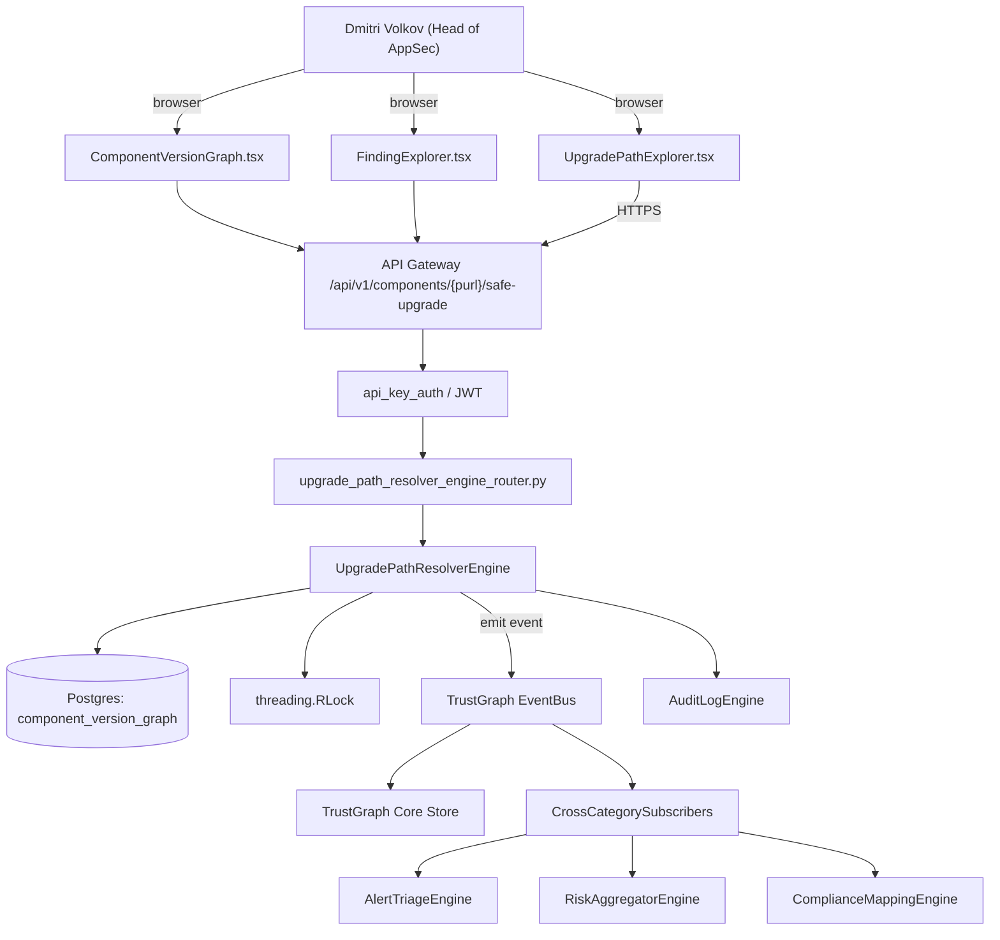

# US-0007: Add upgrade-path resolver: Next-no-violation and Safest-no-change per OSS component

## Sub-Epic: SCA/Supply-chain
**Master Goal**: ALDECI — tiered $199-$1,499/mo enterprise security intelligence platform replacing $50K-$500K/yr tools

## User Story
As a **Dmitri Volkov (Head of AppSec)**, I need to add upgrade-path resolver: Next-no-violation and Safest-no-change per OSS component so that Fixops delivers Sonatype-class supply-chain coverage while keeping the ALDECI price point.

## Why This Matters
Per competitor-sonatype.md §8, developers expect per-component 'Next-no-violation' (smallest version bump that clears policy) and 'Safest-no-change' (smallest patch-level that stays within current major/minor but clears CVEs). This is the remediation lever Sonatype lists first. Build a resolver that consumes the OSS component graph + policy constraints.

This work is called out as a P1 gap in `competitor-sonatype.md`. Shipping it is load-bearing for ALDECI's tiered $199-$1,499/mo positioning against $50K-$500K/yr incumbents: every delayed gap becomes a displacement deal we lose.

## Architecture

## Current State: 0% — MISSING (new engine)
- [ ] Engine module `suite-core/core/upgrade_path_resolver_engine.py` does not exist yet
- [ ] Router `suite-api/apps/api/upgrade_path_resolver_engine_router.py` does not exist yet
- [ ] DB tables listed under Data Model do not exist yet
- [ ] Frontend screens listed under Key Functions do not exist yet
- [ ] No TrustGraph events emitted yet

## Key Functions
**Backend (engine methods):**
- `get_safe_upgrade()` — backs `GET /api/v1/components/{purl}/safe-upgrade`
- `create_remediation()` — backs `POST /api/v1/components/remediation`

**Frontend screens:**
- `UpgradePathExplorer.tsx` — operator-facing UI surface for this gap
- `ComponentVersionGraph.tsx` — operator-facing UI surface for this gap
- `FindingExplorer.tsx` — operator-facing UI surface for this gap

## API Endpoints
| Method | Path | Auth | Purpose |
|--------|------|------|---------|
| GET | `/api/v1/components/{purl}/safe-upgrade` | api_key_auth | {purl} safe upgrade |
| POST | `/api/v1/components/remediation` | api_key_auth | components remediation |

## Data Model
- add component_version_graph table (purl, version, release_ts, vulns JSONB, licenses JSONB)

## Dependencies
**Depends on**: none explicit
**Depended by**: Router layer, TrustGraph EventBus, CrossCategorySubscribers, CrossCategoryEvidenceBuilder, AuditLogEngine
**New engine module**: `suite-core/core/upgrade_path_resolver_engine.py`
**New router module**: `suite-api/apps/api/upgrade_path_resolver_engine_router.py`
**Master gap id**: `GAP-007` (priority P1, effort M)

## Tasks Remaining
1. Schema migration: add component_version_graph table (purl, version, release_ts, vulns JSONB, licen (4h)
2. Implement endpoint GET /api/v1/components/{purl}/safe-upgrade (6h)
3. Implement endpoint POST /api/v1/components/remediation (6h)
4. Wire frontend screen UpgradePathExplorer.tsx (5h)
5. Wire frontend screen ComponentVersionGraph.tsx (5h)
6. Wire frontend screen FindingExplorer.tsx (5h)
7. Write 4 pytest cases: test_next_no_violation_picks_smallest_clean_version, test_safest_no_change_respects_semver_minor… (6h)
8. Wire TrustGraph event emission + CrossCategorySubscriber consumers (4h)
9. Persona walkthrough + integration test (3h)
10. Docs + API reference update (2h)

## Definition of Done
- [ ] Given a component foo@1.2.3 with a HIGH CVE fixed in 1.2.5 and a breaking API change in 2.0.0, When the resolver runs, Then Next-no-violation=1.2.5 and Safest-no-change=1.2.5.
- [ ] Given a component where the only CVE fix is in a major bump, When the resolver runs, Then Next-no-violation=<major> and Safest-no-change=null with reason='no patch-level fix available'.
- [ ] Given UpgradePathExplorer.tsx, When a user selects a finding, Then the recommendations are shown with one-click copy of the new coordinate and a diff of CVEs/licenses between versions.
- [ ] Given a policy that considers license-threat-group, When the upgrade candidate introduces a Copyleft license, Then that candidate is excluded from Next-no-violation.
- [ ] Given the resolver API GET /api/v1/components/{purl}/safe-upgrade, When called with a valid purl, Then the response includes next_no_violation, safest_no_change, chain_of_evidence (violations cleared/introduced).
- [ ] All endpoints are org-scoped (no hardcoded org_id) and gated by `api_key_auth`.
- [ ] TrustGraph emits at least one event type for this engine and a CrossCategorySubscriber consumes it.
- [ ] `Dmitri Volkov (Head of AppSec)` can execute the full workflow in the 30-persona walkthrough.

## Tests Required
- `test_next_no_violation_picks_smallest_clean_version`
- `test_safest_no_change_respects_semver_minor`
- `test_copyleft_excluded_when_policy_forbids`
- `test_resolver_returns_null_when_no_fix_exists`

## Sprint: Wave 48 (est. May 27-Jun 02, 2026)

## Citation
Source research: `competitor-sonatype.md` (gap `GAP-007`, priority `P1`, effort `M`)
