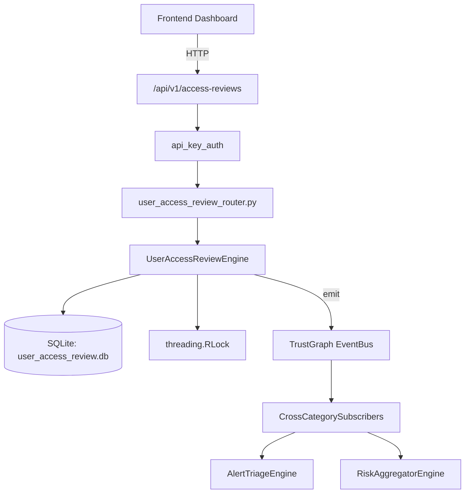

# US-0307: User Access Review

## Sub-Epic: Identity
**Master Goal**: ALDECI — $35/mo enterprise security intelligence platform replacing $50K-500K/yr tools

## User Story
As a **Robert Kim (Compliance Officer)**, I need to review user access periodically
so that the platform delivers enterprise-grade identity capabilities at 1/1000th the cost of legacy tools.

## Why This Matters
User Access Review replaces functionality found in enterprise tools like CrowdStrike, Wiz, Snyk, and Rapid7.
By building this into ALDECI's $35/mo stack, customers save $50K+/yr on standalone Identity tooling.

## Architecture

## Current State: 95% Complete
- ✅ `create_review()` — Create a new access review. (line 122)
- ✅ `add_review_item()` — Add an item to an existing review. (line 161)
- ✅ `make_decision()` — Record a decision on a review item; auto-completes review if all decided. (line 203)
- ✅ `get_review()` — Get a review with all its items. (line 250)
- ✅ `list_reviews()` — List reviews, optionally filtered by status. (line 269)
- ✅ `get_overdue_reviews()` — Return reviews past due_date that are not completed. (line 289)
- ❌ TrustGraph event emission — not yet verified

## Key Functions (from `suite-core/core/user_access_review_engine.py` — 398 lines)
- `UserAccessReviewEngine.create_review()` — Create a new access review. (line 122)
- `UserAccessReviewEngine.add_review_item()` — Add an item to an existing review. (line 161)
- `UserAccessReviewEngine.make_decision()` — Record a decision on a review item; auto-completes review if all decided. (line 203)
- `UserAccessReviewEngine.get_review()` — Get a review with all its items. (line 250)
- `UserAccessReviewEngine.list_reviews()` — List reviews, optionally filtered by status. (line 269)
- `UserAccessReviewEngine.get_overdue_reviews()` — Return reviews past due_date that are not completed. (line 289)
- `UserAccessReviewEngine.create_campaign()` — Create a review campaign. (line 307)
- `UserAccessReviewEngine.get_campaign_stats()` — Return aggregated campaign stats: avg completion_rate, total overdue_count. (line 344)

## Dependencies
- **Depends on**: standalone
- **Depended by**: Routers, TrustGraph EventBus, CrossCategorySubscribers
- **TrustGraph**: Event emission wired via ResponseInterceptorMiddleware
- **Source file**: `suite-core/core/user_access_review_engine.py` (398 lines)
- **Router file**: `suite-api/apps/api/user_access_review_router.py`

## API Endpoints
| Method | Path | Description |
|--------|------|-------------|
| POST | `/api/v1/access-reviews/reviews` | create review |
| GET | `/api/v1/access-reviews/reviews` | list reviews |
| GET | `/api/v1/access-reviews/reviews/{review_id}` | get review |
| POST | `/api/v1/access-reviews/reviews/{review_id}/items` | add review item |
| POST | `/api/v1/access-reviews/reviews/{review_id}/items/{item_id}/decide` | make decision |
| GET | `/api/v1/access-reviews/overdue` | get overdue reviews |
| POST | `/api/v1/access-reviews/campaigns` | create campaign |
| GET | `/api/v1/access-reviews/campaigns/stats` | get campaign stats |
| GET | `/api/v1/access-reviews/summary` | get review summary |

## Tasks Remaining
1. Verify TrustGraph event emission works end-to-end (2h)
2. Add integration test with real persona workflow (2h)
3. Wire CrossCategorySubscriber consumer chain (1h)
4. Validate with 30-persona walkthrough (1h)
5. Optimize query performance for large datasets (2h)
6. Expand test coverage to edge cases (2h)

## Definition of Done
- [ ] Robert Kim (Compliance Officer) can access /api/v1/access-reviews and get meaningful data
- [ ] All CRUD operations return correct HTTP status codes
- [ ] TrustGraph receives events from this engine
- [ ] 38+ tests passing in `tests/test_user_access_review_engine.py`
- [ ] 30-persona walkthrough includes this endpoint at 100%
- [ ] No hardcoded org_id — all queries are org-scoped

## Sprint: Wave 52 (est. April 28-30, 2026)

## Test Coverage
- **Test file**: `tests/test_user_access_review_engine.py`
- **Tests**: 38 tests
- **Status**: Passing
