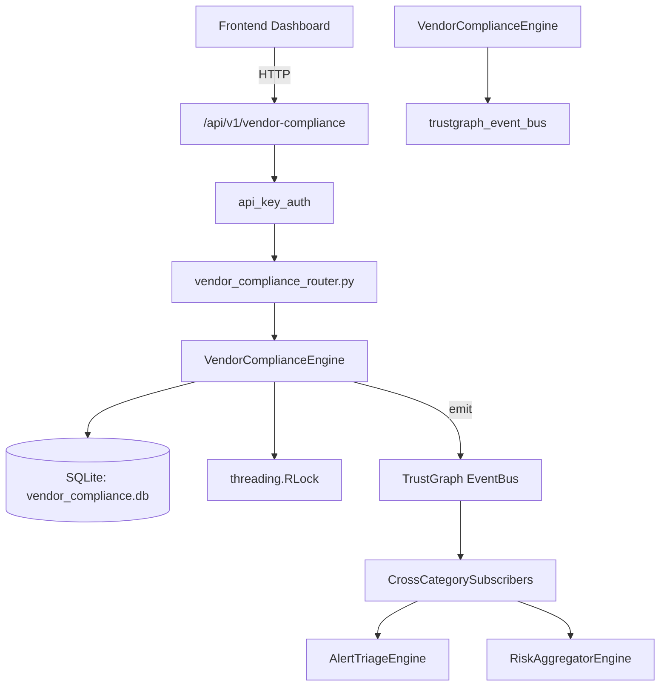

# US-0308: Vendor Compliance

## Sub-Epic: Advanced
**Master Goal**: ALDECI — $35/mo enterprise security intelligence platform replacing $50K-500K/yr tools

## User Story
As a **David Park (Risk Manager)**, I need to assess vendor compliance and risk
so that the platform delivers enterprise-grade advanced capabilities at 1/1000th the cost of legacy tools.

## Why This Matters
Vendor Compliance replaces functionality found in enterprise tools like CrowdStrike, Wiz, Snyk, and Rapid7.
By building this into ALDECI's $35/mo stack, customers save $50K+/yr on standalone Advanced tooling.

## Architecture

## Current State: 95% Complete
- ✅ `register_vendor()` — Register a new vendor. Validates name, vendor_category, and contract_type. (line 110)
- ✅ `list_vendors()` — List vendors for an org with optional category/status filters. (line 183)
- ✅ `get_vendor()` — Return a single vendor or None if not found. (line 204)
- ✅ `run_compliance_check()` — Run a 6-item compliance check against a vendor. (line 213)
- ✅ `create_compliance_requirement()` — Create a compliance requirement for a vendor. (line 265)
- ✅ `update_requirement_status()` — Update the status of a compliance requirement. (line 321)
- ❌ TrustGraph event emission — not yet verified

## Key Functions (from `suite-core/core/vendor_compliance_engine.py` — 431 lines)
- `VendorComplianceEngine.register_vendor()` — Register a new vendor. Validates name, vendor_category, and contract_type. (line 110)
- `VendorComplianceEngine.list_vendors()` — List vendors for an org with optional category/status filters. (line 183)
- `VendorComplianceEngine.get_vendor()` — Return a single vendor or None if not found. (line 204)
- `VendorComplianceEngine.run_compliance_check()` — Run a 6-item compliance check against a vendor. (line 213)
- `VendorComplianceEngine.create_compliance_requirement()` — Create a compliance requirement for a vendor. (line 265)
- `VendorComplianceEngine.update_requirement_status()` — Update the status of a compliance requirement. (line 321)
- `VendorComplianceEngine.list_requirements()` — List compliance requirements with optional filters. (line 353)
- `VendorComplianceEngine.get_vendor_compliance_stats()` — Return aggregate vendor compliance stats for an org. (line 378)

## Dependencies
- **Depends on**: trustgraph_event_bus
- **Depended by**: Routers, TrustGraph EventBus, CrossCategorySubscribers
- **TrustGraph**: Event emission wired via ResponseInterceptorMiddleware
- **Source file**: `suite-core/core/vendor_compliance_engine.py` (431 lines)
- **Router file**: `suite-api/apps/api/vendor_compliance_router.py`

## API Endpoints
| Method | Path | Description |
|--------|------|-------------|
| POST | `/api/v1/vendor-compliance/vendors` | register vendor |
| GET | `/api/v1/vendor-compliance/vendors` | list vendors |
| GET | `/api/v1/vendor-compliance/vendors/{vendor_id}` | get vendor |
| POST | `/api/v1/vendor-compliance/vendors/{vendor_id}/compliance-check` | run compliance check |
| POST | `/api/v1/vendor-compliance/requirements` | create requirement |
| PUT | `/api/v1/vendor-compliance/requirements/{req_id}/status` | update requirement status |
| GET | `/api/v1/vendor-compliance/requirements` | list requirements |
| GET | `/api/v1/vendor-compliance/stats` | get stats |

## Tasks Remaining
1. Verify TrustGraph event emission works end-to-end (2h)
2. Add integration test with real persona workflow (2h)
3. Wire CrossCategorySubscriber consumer chain (1h)
4. Validate with 30-persona walkthrough (1h)
5. Optimize query performance for large datasets (2h)
6. Expand test coverage to edge cases (2h)

## Definition of Done
- [ ] David Park (Risk Manager) can access /api/v1/vendor-compliance and get meaningful data
- [ ] All CRUD operations return correct HTTP status codes
- [ ] TrustGraph receives events from this engine
- [ ] 36+ tests passing in `tests/test_vendor_compliance_engine.py`
- [ ] 30-persona walkthrough includes this endpoint at 100%
- [ ] No hardcoded org_id — all queries are org-scoped

## Sprint: Wave 52 (est. April 28-30, 2026)

## Test Coverage
- **Test file**: `tests/test_vendor_compliance_engine.py`
- **Tests**: 36 tests
- **Status**: Passing
