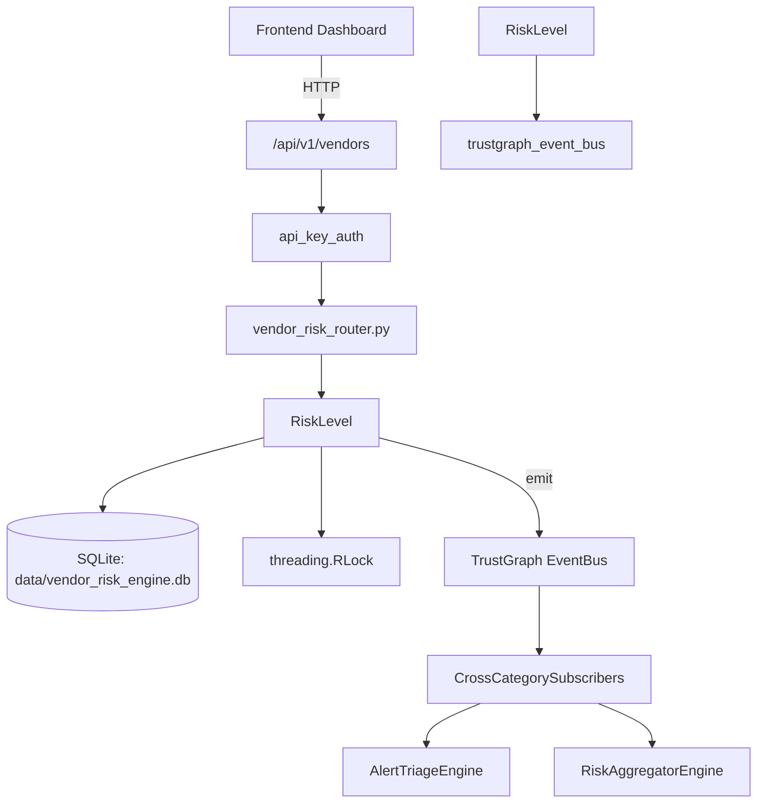

# US-0309: Vendor Risk

## Sub-Epic: Advanced
**Master Goal**: ALDECI — $35/mo enterprise security intelligence platform replacing $50K-500K/yr tools

## User Story
As a **David Park (Risk Manager)**, I need to assess vendor compliance and risk
so that the platform delivers enterprise-grade advanced capabilities at 1/1000th the cost of legacy tools.

## Why This Matters
Vendor Risk replaces functionality found in enterprise tools like CrowdStrike, Wiz, Snyk, and Rapid7.
By building this into ALDECI's $35/mo stack, customers save $50K+/yr on standalone Advanced tooling.

## Architecture

## Current State: 95% Complete
- ✅ `to_dict()` — implemented (line 157)
- ✅ `to_dict()` — implemented (line 194)
- ✅ `to_dict()` — implemented (line 244)
- ✅ `upsert_assessment()` — implemented (line 441)
- ✅ `get_assessment()` — implemented (line 466)
- ✅ `list_assessments()` — implemented (line 474)
- ❌ TrustGraph event emission — not yet verified

## Key Functions (from `suite-core/core/vendor_risk_engine.py` — 1618 lines)
- `VendorRiskFinding.to_dict()` — Handle to dict (line 157)
- `VendorRiskAssessment.to_dict()` — Handle to dict (line 194)
- `VendorScorecard.to_dict()` — Handle to dict (line 244)
- `_EngineDB.upsert_assessment()` — Handle upsert assessment (line 441)
- `_EngineDB.get_assessment()` — Handle get assessment (line 466)
- `_EngineDB.list_assessments()` — Handle list assessments (line 474)
- `_EngineDB.insert_questionnaire()` — Handle insert questionnaire (line 482)
- `_EngineDB.get_questionnaire()` — Handle get questionnaire (line 500)

## Dependencies
- **Depends on**: trustgraph_event_bus
- **Depended by**: Routers, TrustGraph EventBus, CrossCategorySubscribers
- **TrustGraph**: Event emission wired via ResponseInterceptorMiddleware
- **Source file**: `suite-core/core/vendor_risk_engine.py` (1618 lines)
- **Router file**: `suite-api/apps/api/vendor_risk_router.py`

## API Endpoints
| Method | Path | Description |
|--------|------|-------------|
| GET | `/api/v1/vendors/tiering` | get tiering overview |
| GET | `/api/v1/vendors/fourth-party` | get fourth party map |
| GET | `/api/v1/vendors` | list vendors |
| POST | `/api/v1/vendors` | create vendor |
| GET | `/api/v1/vendors/{vendor_id}/assessment` | get assessment |
| POST | `/api/v1/vendors/{vendor_id}/questionnaire` | submit questionnaire |
| GET | `/api/v1/vendors/{vendor_id}/monitoring` | get monitoring |
| POST | `/api/v1/vendors/{vendor_id}/monitoring/signals` | record signal |
| GET | `/api/v1/vendors/{vendor_id}/scorecard` | get scorecard |
| GET | `/api/v1/vendors/{vendor_id}/contract-risks` | get contract risks |
| GET | `/api/v1/vendors/{vendor_id}` | get vendor |
| POST | `/api/v1/vendors/assess` | auto assess vendor |

## Tasks Remaining
1. Verify TrustGraph event emission works end-to-end (2h)
2. Add integration test with real persona workflow (2h)
3. Wire CrossCategorySubscriber consumer chain (1h)
4. Validate with 30-persona walkthrough (1h)
5. Optimize query performance for large datasets (2h)
6. Expand test coverage to edge cases (2h)

## Definition of Done
- [ ] David Park (Risk Manager) can access /api/v1/vendors and get meaningful data
- [ ] All CRUD operations return correct HTTP status codes
- [ ] TrustGraph receives events from this engine
- [ ] 25+ tests passing in `tests/test_vendor_risk_engine.py`
- [ ] 30-persona walkthrough includes this endpoint at 100%
- [ ] No hardcoded org_id — all queries are org-scoped

## Sprint: Wave 52 (est. April 28-30, 2026)

## Test Coverage
- **Test file**: `tests/test_vendor_risk_engine.py`
- **Tests**: 25 tests
- **Status**: Passing
