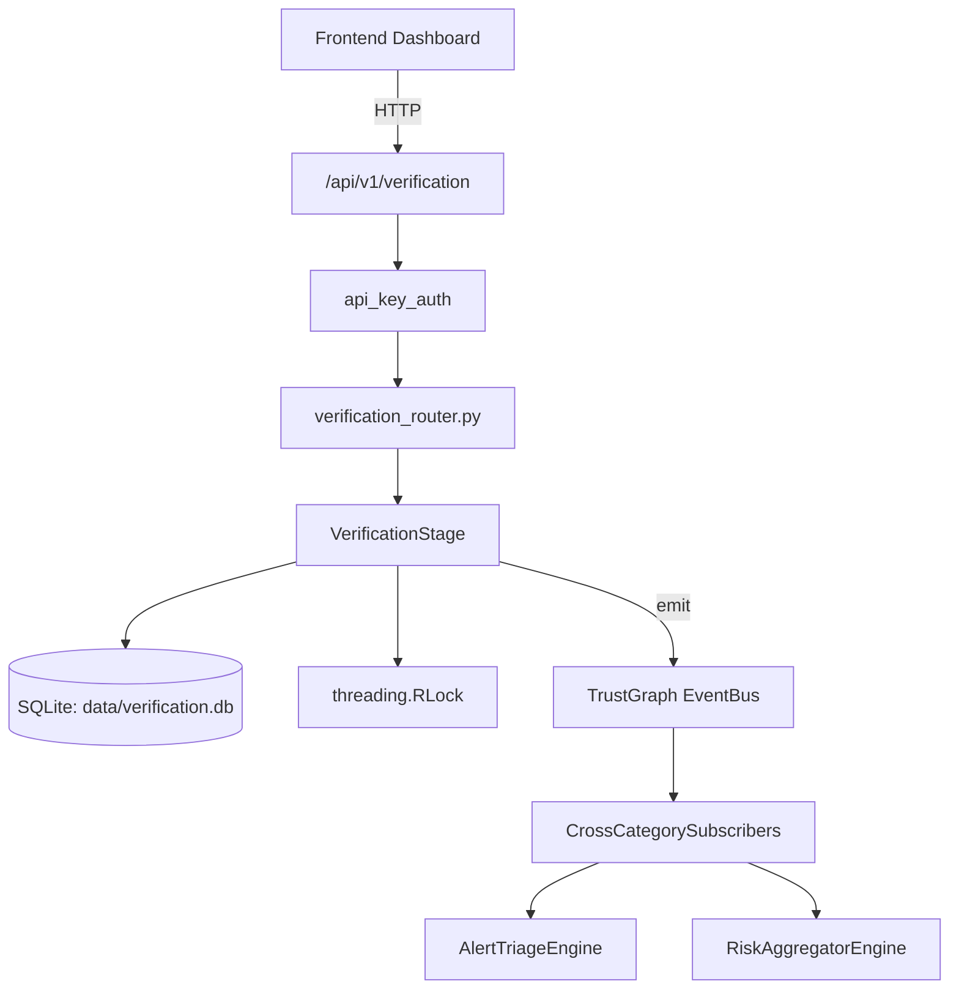

# US-0310: Verification

## Sub-Epic: Advanced
**Master Goal**: ALDECI — $35/mo enterprise security intelligence platform replacing $50K-500K/yr tools

## User Story
As a **Brian Hall (QA Security Tester)**, I need to verify security controls
so that the platform delivers enterprise-grade advanced capabilities at 1/1000th the cost of legacy tools.

## Why This Matters
Verification replaces functionality found in enterprise tools like CrowdStrike, Wiz, Snyk, and Rapid7.
By building this into ALDECI's $35/mo stack, customers save $50K+/yr on standalone Advanced tooling.

## Architecture

## Current State: 70% Complete
- ✅ `summary()` — implemented (line 62)
- ✅ `run_stage_1_product_detection()` — Stage 1: Detect if target runs the vulnerable product. (line 319)
- ✅ `run_stage_2_version_fingerprint()` — Stage 2: Fingerprint the product version and check if it's in vulnerable range. (line 402)
- ✅ `run_stage_3_exploit_verification()` — Stage 3: Send actual exploit payloads and verify they trigger the vulnerability. (line 507)
- ✅ `run_stage_4_differential_confirmation()` — Stage 4: Compare responses between benign and malicious requests. (line 610)
- ✅ `finalize()` — Aggregate all stage results into final verdict. (line 715)
- ❌ No dedicated router — endpoint may be in gap_router.py
- ❌ No test file found — needs test coverage
- ❌ TrustGraph event emission — not yet verified

## Key Functions (from `suite-core/core/verification_engine.py` — 758 lines)
- `VerificationResult.summary()` — Handle summary (line 62)
- `VerificationEngine.run_stage_1_product_detection()` — Stage 1: Detect if target runs the vulnerable product. (line 319)
- `VerificationEngine.run_stage_2_version_fingerprint()` — Stage 2: Fingerprint the product version and check if it's in vulnerable range. (line 402)
- `VerificationEngine.run_stage_3_exploit_verification()` — Stage 3: Send actual exploit payloads and verify they trigger the vulnerability. (line 507)
- `VerificationEngine.run_stage_4_differential_confirmation()` — Stage 4: Compare responses between benign and malicious requests. (line 610)
- `VerificationEngine.finalize()` — Aggregate all stage results into final verdict. (line 715)

## Dependencies
- **Depends on**: standalone
- **Depended by**: Routers, TrustGraph EventBus, CrossCategorySubscribers
- **TrustGraph**: Event emission wired via ResponseInterceptorMiddleware
- **Source file**: `suite-core/core/verification_engine.py` (758 lines)
- **Router file**: `suite-api/apps/api/N/A`

## API Endpoints
| Method | Path | Description |
|--------|------|-------------|
| GET | `/api/v1/verification` | List resources |

## Tasks Remaining
1. Verify TrustGraph event emission works end-to-end (2h)
2. Add integration test with real persona workflow (2h)
3. Wire CrossCategorySubscriber consumer chain (1h)
4. Validate with 30-persona walkthrough (1h)
5. Create dedicated router (needs wiring in app.py) (3h)
6. Write unit tests (4h)

## Definition of Done
- [ ] Brian Hall (QA Security Tester) can access /api/v1/verification and get meaningful data
- [ ] All CRUD operations return correct HTTP status codes
- [ ] TrustGraph receives events from this engine
- [ ] 20+ tests passing in `tests/test_verification_engine.py`
- [ ] 30-persona walkthrough includes this endpoint at 100%
- [ ] No hardcoded org_id — all queries are org-scoped

## Sprint: Wave 52 (est. April 28-30, 2026)

## Test Coverage
- **Test file**: `tests/test_verification_engine.py`
- **Tests**: 0 tests
- **Status**: Needs coverage
