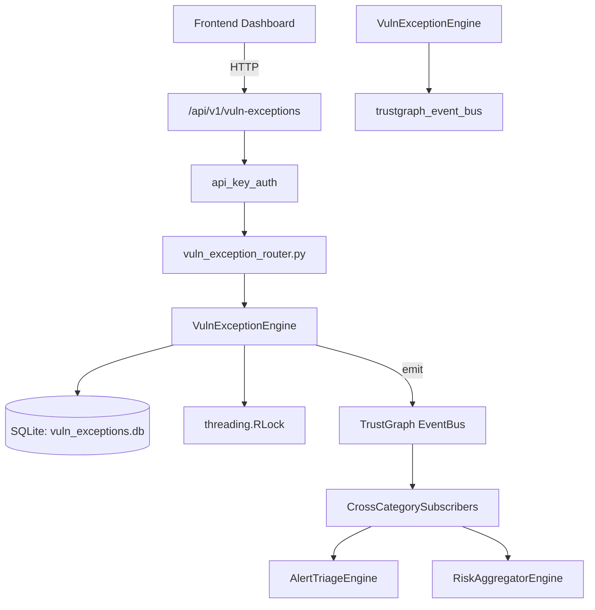

# US-0311: Vuln Exception

## Sub-Epic: CTEM
**Master Goal**: ALDECI — $35/mo enterprise security intelligence platform replacing $50K-500K/yr tools

## User Story
As a **David Park (Risk Manager)**, I need to manage vulnerability exceptions
so that the platform delivers enterprise-grade ctem capabilities at 1/1000th the cost of legacy tools.

## Why This Matters
Vuln Exception replaces functionality found in enterprise tools like CrowdStrike, Wiz, Snyk, and Rapid7.
By building this into ALDECI's $35/mo stack, customers save $50K+/yr on standalone CTEM tooling.

## Architecture

## Current State: 95% Complete
- ✅ `create_exception()` — Create a new vulnerability exception request. (line 132)
- ✅ `list_exceptions()` — List exceptions for an org with optional filters. (line 207)
- ✅ `get_exception()` — Retrieve a single exception by ID. (line 232)
- ✅ `approve_exception()` — Approve a pending exception. (line 249)
- ✅ `reject_exception()` — Reject a pending exception. (line 288)
- ✅ `expire_exceptions()` — Expire approved exceptions whose expiry_date has passed. (line 327)
- ❌ TrustGraph event emission — not yet verified

## Key Functions (from `suite-core/core/vuln_exception_engine.py` — 391 lines)
- `VulnExceptionEngine.create_exception()` — Create a new vulnerability exception request. (line 132)
- `VulnExceptionEngine.list_exceptions()` — List exceptions for an org with optional filters. (line 207)
- `VulnExceptionEngine.get_exception()` — Retrieve a single exception by ID. (line 232)
- `VulnExceptionEngine.approve_exception()` — Approve a pending exception. (line 249)
- `VulnExceptionEngine.reject_exception()` — Reject a pending exception. (line 288)
- `VulnExceptionEngine.expire_exceptions()` — Expire approved exceptions whose expiry_date has passed. (line 327)
- `VulnExceptionEngine.get_exception_stats()` — Return aggregated exception statistics for the org. (line 352)

## Dependencies
- **Depends on**: trustgraph_event_bus
- **Depended by**: Routers, TrustGraph EventBus, CrossCategorySubscribers
- **TrustGraph**: Event emission wired via ResponseInterceptorMiddleware
- **Source file**: `suite-core/core/vuln_exception_engine.py` (391 lines)
- **Router file**: `suite-api/apps/api/vuln_exception_router.py`

## API Endpoints
| Method | Path | Description |
|--------|------|-------------|
| POST | `/api/v1/vuln-exceptions/exceptions` | create exception |
| GET | `/api/v1/vuln-exceptions/exceptions` | list exceptions |
| POST | `/api/v1/vuln-exceptions/exceptions/expire` | expire exceptions |
| GET | `/api/v1/vuln-exceptions/exceptions/{exception_id}` | get exception |
| POST | `/api/v1/vuln-exceptions/exceptions/{exception_id}/approve` | approve exception |
| POST | `/api/v1/vuln-exceptions/exceptions/{exception_id}/reject` | reject exception |
| GET | `/api/v1/vuln-exceptions/stats` | get exception stats |

## Tasks Remaining
1. Verify TrustGraph event emission works end-to-end (2h)
2. Add integration test with real persona workflow (2h)
3. Wire CrossCategorySubscriber consumer chain (1h)
4. Validate with 30-persona walkthrough (1h)
5. Optimize query performance for large datasets (2h)
6. Expand test coverage to edge cases (2h)

## Definition of Done
- [ ] David Park (Risk Manager) can access /api/v1/vuln-exceptions and get meaningful data
- [ ] All CRUD operations return correct HTTP status codes
- [ ] TrustGraph receives events from this engine
- [ ] 51+ tests passing in `tests/test_vuln_exception_engine.py`
- [ ] 30-persona walkthrough includes this endpoint at 100%
- [ ] No hardcoded org_id — all queries are org-scoped

## Sprint: Wave 52 (est. April 28-30, 2026)

## Test Coverage
- **Test file**: `tests/test_vuln_exception_engine.py`
- **Tests**: 51 tests
- **Status**: Passing
