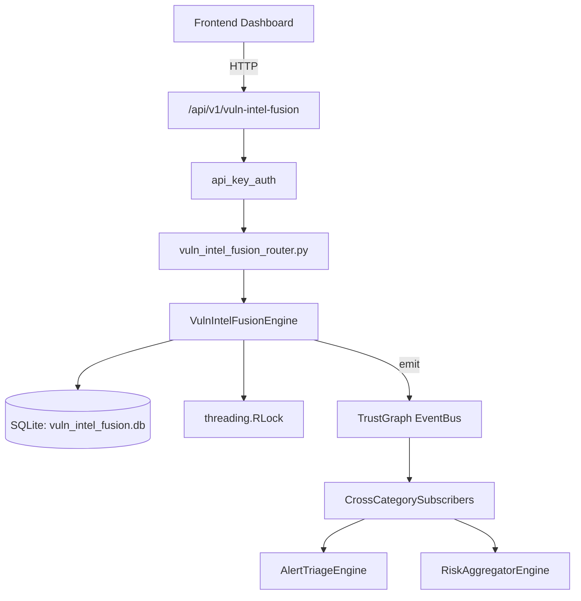

# US-0312: Vuln Intel Fusion

## Sub-Epic: CTEM
**Master Goal**: ALDECI — $35/mo enterprise security intelligence platform replacing $50K-500K/yr tools

## User Story
As a **Nina Patel (Threat Intel Analyst)**, I need to fuse vulnerability intelligence
so that the platform delivers enterprise-grade ctem capabilities at 1/1000th the cost of legacy tools.

## Why This Matters
Vuln Intel Fusion replaces functionality found in enterprise tools like CrowdStrike, Wiz, Snyk, and Rapid7.
By building this into ALDECI's $35/mo stack, customers save $50K+/yr on standalone CTEM tooling.

## Architecture

## Current State: 95% Complete
- ✅ `ingest_from_source()` — Ingest CVE data from a source feed. (line 201)
- ✅ `mark_patch_available()` — Mark patch as available for a CVE. (line 322)
- ✅ `add_asset_impact()` — Add asset impact. INSERT OR IGNORE on (org_id, cve_id, asset_id). (line 347)
- ✅ `get_fusion_summary()` — Org-level summary of fused vulnerability intelligence. (line 394)
- ✅ `get_priority_queue()` — Return fused vulns ordered by consensus_priority ASC, fusion_score DESC. (line 444)
- ✅ `get_vuln_detail()` — Return fused_vuln + source_feeds + asset_impacts for a CVE. (line 455)
- ❌ TrustGraph event emission — not yet verified

## Key Functions (from `suite-core/core/vuln_intel_fusion_engine.py` — 489 lines)
- `VulnIntelFusionEngine.ingest_from_source()` — Ingest CVE data from a source feed. (line 201)
- `VulnIntelFusionEngine.mark_patch_available()` — Mark patch as available for a CVE. (line 322)
- `VulnIntelFusionEngine.add_asset_impact()` — Add asset impact. INSERT OR IGNORE on (org_id, cve_id, asset_id). (line 347)
- `VulnIntelFusionEngine.get_fusion_summary()` — Org-level summary of fused vulnerability intelligence. (line 394)
- `VulnIntelFusionEngine.get_priority_queue()` — Return fused vulns ordered by consensus_priority ASC, fusion_score DESC. (line 444)
- `VulnIntelFusionEngine.get_vuln_detail()` — Return fused_vuln + source_feeds + asset_impacts for a CVE. (line 455)
- `VulnIntelFusionEngine.get_kev_vulns()` — Return vulns where kev_listed=1, ordered by fusion_score DESC. (line 480)

## Dependencies
- **Depends on**: standalone
- **Depended by**: Routers, TrustGraph EventBus, CrossCategorySubscribers
- **TrustGraph**: Event emission wired via ResponseInterceptorMiddleware
- **Source file**: `suite-core/core/vuln_intel_fusion_engine.py` (489 lines)
- **Router file**: `suite-api/apps/api/vuln_intel_fusion_router.py`

## API Endpoints
| Method | Path | Description |
|--------|------|-------------|
| POST | `/api/v1/vuln-intel-fusion/ingest` | ingest from source |
| PUT | `/api/v1/vuln-intel-fusion/vulns/{cve_id}/patch` | mark patch available |
| POST | `/api/v1/vuln-intel-fusion/asset-impacts` | add asset impact |
| GET | `/api/v1/vuln-intel-fusion/summary` | get fusion summary |
| GET | `/api/v1/vuln-intel-fusion/priority-queue` | get priority queue |
| GET | `/api/v1/vuln-intel-fusion/kev` | get kev vulns |
| GET | `/api/v1/vuln-intel-fusion/vulns/{cve_id}` | get vuln detail |

## Tasks Remaining
1. Verify TrustGraph event emission works end-to-end (2h)
2. Add integration test with real persona workflow (2h)
3. Wire CrossCategorySubscriber consumer chain (1h)
4. Validate with 30-persona walkthrough (1h)
5. Optimize query performance for large datasets (2h)
6. Expand test coverage to edge cases (2h)

## Definition of Done
- [ ] Nina Patel (Threat Intel Analyst) can access /api/v1/vuln-intel-fusion and get meaningful data
- [ ] All CRUD operations return correct HTTP status codes
- [ ] TrustGraph receives events from this engine
- [ ] 55+ tests passing in `tests/test_vuln_intel_fusion_engine.py`
- [ ] 30-persona walkthrough includes this endpoint at 100%
- [ ] No hardcoded org_id — all queries are org-scoped

## Sprint: Wave 52 (est. April 28-30, 2026)

## Test Coverage
- **Test file**: `tests/test_vuln_intel_fusion_engine.py`
- **Tests**: 55 tests
- **Status**: Passing
