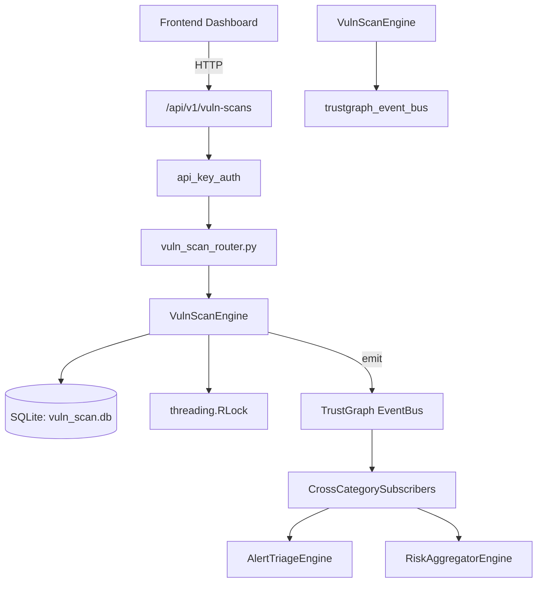

# US-0315: Vuln Scan

## Sub-Epic: CTEM
**Master Goal**: ALDECI — $35/mo enterprise security intelligence platform replacing $50K-500K/yr tools

## User Story
As a **Brian Hall (QA Security Tester)**, I need to manage vulnerability scans
so that the platform delivers enterprise-grade ctem capabilities at 1/1000th the cost of legacy tools.

## Why This Matters
Vuln Scan replaces functionality found in enterprise tools like CrowdStrike, Wiz, Snyk, and Rapid7.
By building this into ALDECI's $35/mo stack, customers save $50K+/yr on standalone CTEM tooling.

## Architecture

## Current State: 95% Complete
- ✅ `create_scan()` — Create a new vulnerability scan. (line 117)
- ✅ `list_scans()` — List scans with optional filters. (line 187)
- ✅ `get_scan()` — Get a single scan by ID. (line 210)
- ✅ `update_scan_status()` — Update scan_status; optionally set completed_at. (line 219)
- ✅ `add_finding()` — Add a finding to a scan. (line 274)
- ✅ `list_findings()` — List findings with optional filters. (line 355)
- ❌ TrustGraph event emission — not yet verified

## Key Functions (from `suite-core/core/vuln_scan_engine.py` — 490 lines)
- `VulnScanEngine.create_scan()` — Create a new vulnerability scan. (line 117)
- `VulnScanEngine.list_scans()` — List scans with optional filters. (line 187)
- `VulnScanEngine.get_scan()` — Get a single scan by ID. (line 210)
- `VulnScanEngine.update_scan_status()` — Update scan_status; optionally set completed_at. (line 219)
- `VulnScanEngine.add_finding()` — Add a finding to a scan. (line 274)
- `VulnScanEngine.list_findings()` — List findings with optional filters. (line 355)
- `VulnScanEngine.update_finding_status()` — Update finding_status; sets resolved_at if transitioning to 'resolved'. (line 382)
- `VulnScanEngine.get_scan_stats()` — Return aggregate scan and finding statistics. (line 425)

## Dependencies
- **Depends on**: trustgraph_event_bus
- **Depended by**: Routers, TrustGraph EventBus, CrossCategorySubscribers
- **TrustGraph**: Event emission wired via ResponseInterceptorMiddleware
- **Source file**: `suite-core/core/vuln_scan_engine.py` (490 lines)
- **Router file**: `suite-api/apps/api/vuln_scan_router.py`

## API Endpoints
| Method | Path | Description |
|--------|------|-------------|
| POST | `/api/v1/vuln-scans/scans` | create scan |
| GET | `/api/v1/vuln-scans/scans` | list scans |
| GET | `/api/v1/vuln-scans/scans/{scan_id}` | get scan |
| PATCH | `/api/v1/vuln-scans/scans/{scan_id}/status` | update scan status |
| POST | `/api/v1/vuln-scans/scans/{scan_id}/findings` | add finding |
| GET | `/api/v1/vuln-scans/findings` | list findings |
| PATCH | `/api/v1/vuln-scans/findings/{finding_id}/status` | update finding status |
| GET | `/api/v1/vuln-scans/stats` | get scan stats |

## Tasks Remaining
1. Verify TrustGraph event emission works end-to-end (2h)
2. Add integration test with real persona workflow (2h)
3. Wire CrossCategorySubscriber consumer chain (1h)
4. Validate with 30-persona walkthrough (1h)
5. Optimize query performance for large datasets (2h)
6. Expand test coverage to edge cases (2h)

## Definition of Done
- [ ] Brian Hall (QA Security Tester) can access /api/v1/vuln-scans and get meaningful data
- [ ] All CRUD operations return correct HTTP status codes
- [ ] TrustGraph receives events from this engine
- [ ] 50+ tests passing in `tests/test_vuln_scan_engine.py`
- [ ] 30-persona walkthrough includes this endpoint at 100%
- [ ] No hardcoded org_id — all queries are org-scoped

## Sprint: Wave 52 (est. April 28-30, 2026)

## Test Coverage
- **Test file**: `tests/test_vuln_scan_engine.py`
- **Tests**: 50 tests
- **Status**: Passing
