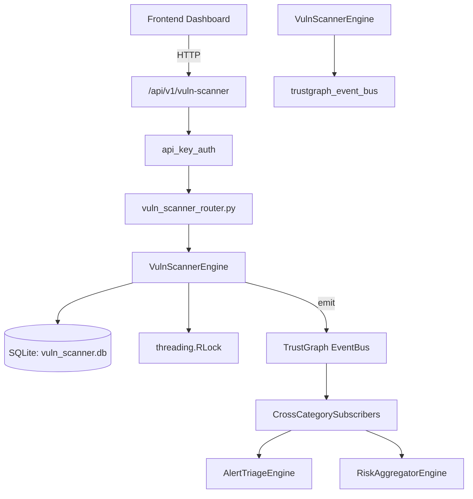

# US-0316: Vuln Scanner

## Sub-Epic: CTEM
**Master Goal**: ALDECI — $35/mo enterprise security intelligence platform replacing $50K-500K/yr tools

## User Story
As a **Brian Hall (QA Security Tester)**, I need to manage vulnerability scans
so that the platform delivers enterprise-grade ctem capabilities at 1/1000th the cost of legacy tools.

## Why This Matters
Vuln Scanner replaces functionality found in enterprise tools like CrowdStrike, Wiz, Snyk, and Rapid7.
By building this into ALDECI's $35/mo stack, customers save $50K+/yr on standalone CTEM tooling.

## Architecture

## Current State: 95% Complete
- ✅ `add_scanner()` — Register a new scanner. Returns the created scanner record. (line 164)
- ✅ `list_scanners()` — List all scanners for an org. (line 219)
- ✅ `create_schedule()` — Create a scan schedule. Returns the created schedule record. (line 232)
- ✅ `list_schedules()` — List scan schedules for an org, optionally filtered by enabled flag. (line 289)
- ✅ `create_scan_result()` — Record a scan result. Returns the created result record. (line 315)
- ✅ `list_scan_results()` — List scan results for an org, optionally filtered by schedule. (line 361)
- ❌ TrustGraph event emission — not yet verified

## Key Functions (from `suite-core/core/vuln_scanner_engine.py` — 527 lines)
- `VulnScannerEngine.add_scanner()` — Register a new scanner. Returns the created scanner record. (line 164)
- `VulnScannerEngine.list_scanners()` — List all scanners for an org. (line 219)
- `VulnScannerEngine.create_schedule()` — Create a scan schedule. Returns the created schedule record. (line 232)
- `VulnScannerEngine.list_schedules()` — List scan schedules for an org, optionally filtered by enabled flag. (line 289)
- `VulnScannerEngine.create_scan_result()` — Record a scan result. Returns the created result record. (line 315)
- `VulnScannerEngine.list_scan_results()` — List scan results for an org, optionally filtered by schedule. (line 361)
- `VulnScannerEngine.create_finding()` — Record a vulnerability finding. Returns the created finding record. (line 383)
- `VulnScannerEngine.list_findings()` — List vulnerability findings for an org with optional filters. (line 434)

## Dependencies
- **Depends on**: trustgraph_event_bus
- **Depended by**: Routers, TrustGraph EventBus, CrossCategorySubscribers
- **TrustGraph**: Event emission wired via ResponseInterceptorMiddleware
- **Source file**: `suite-core/core/vuln_scanner_engine.py` (527 lines)
- **Router file**: `suite-api/apps/api/vuln_scanner_router.py`

## API Endpoints
| Method | Path | Description |
|--------|------|-------------|
| GET | `/api/v1/vuln-scanner/scanners` | list scanners |
| POST | `/api/v1/vuln-scanner/scanners` | add scanner |
| GET | `/api/v1/vuln-scanner/schedules` | list schedules |
| POST | `/api/v1/vuln-scanner/schedules` | create schedule |
| GET | `/api/v1/vuln-scanner/results` | list results |
| POST | `/api/v1/vuln-scanner/results` | create result |
| GET | `/api/v1/vuln-scanner/findings` | list findings |
| POST | `/api/v1/vuln-scanner/findings` | create finding |
| PATCH | `/api/v1/vuln-scanner/findings/{finding_id}/status` | update finding status |
| GET | `/api/v1/vuln-scanner/stats` | get stats |

## Tasks Remaining
1. Verify TrustGraph event emission works end-to-end (2h)
2. Add integration test with real persona workflow (2h)
3. Wire CrossCategorySubscriber consumer chain (1h)
4. Validate with 30-persona walkthrough (1h)
5. Optimize query performance for large datasets (2h)
6. Expand test coverage to edge cases (2h)

## Definition of Done
- [ ] Brian Hall (QA Security Tester) can access /api/v1/vuln-scanner and get meaningful data
- [ ] All CRUD operations return correct HTTP status codes
- [ ] TrustGraph receives events from this engine
- [ ] 24+ tests passing in `tests/test_vuln_scanner_engine.py`
- [ ] 30-persona walkthrough includes this endpoint at 100%
- [ ] No hardcoded org_id — all queries are org-scoped

## Sprint: Wave 52 (est. April 28-30, 2026)

## Test Coverage
- **Test file**: `tests/test_vuln_scanner_engine.py`
- **Tests**: 24 tests
- **Status**: Passing
