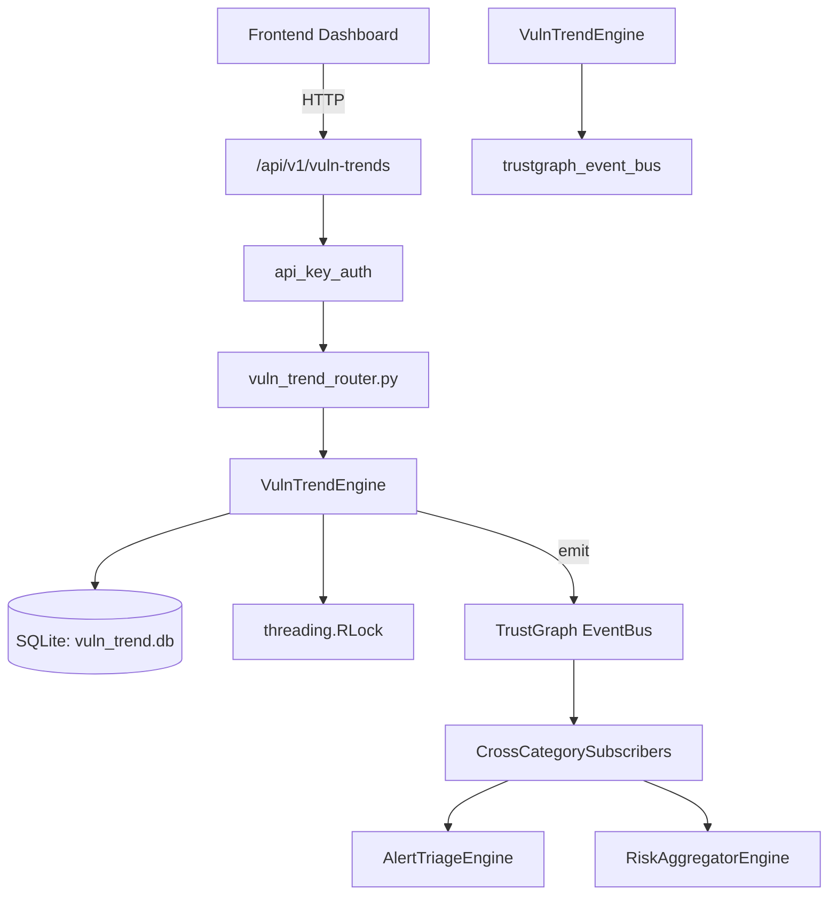

# US-0317: Vuln Trend

## Sub-Epic: CTEM
**Master Goal**: ALDECI — $35/mo enterprise security intelligence platform replacing $50K-500K/yr tools

## User Story
As a **David Park (Risk Manager)**, I need to analyze vulnerability trends
so that the platform delivers enterprise-grade ctem capabilities at 1/1000th the cost of legacy tools.

## Why This Matters
Vuln Trend replaces functionality found in enterprise tools like CrowdStrike, Wiz, Snyk, and Rapid7.
By building this into ALDECI's $35/mo stack, customers save $50K+/yr on standalone CTEM tooling.

## Architecture

## Current State: 95% Complete
- ✅ `record_snapshot()` — Validate and save a daily vulnerability snapshot. (line 141)
- ✅ `list_snapshots()` — Return the most recent N snapshots for an org. (line 189)
- ✅ `get_trend_analysis()` — Compare last 2 snapshots, compute pct_change per severity, save trend. (line 202)
- ✅ `track_sla()` — Add a vulnerability to SLA tracking. (line 280)
- ✅ `check_sla_breaches()` — Return all SLAs where due date has passed and vuln is unresolved. (line 318)
- ✅ `resolve_sla()` — Mark an SLA entry as resolved; flag breached if past due. (line 334)
- ❌ TrustGraph event emission — not yet verified

## Key Functions (from `suite-core/core/vuln_trend_engine.py` — 465 lines)
- `VulnTrendEngine.record_snapshot()` — Validate and save a daily vulnerability snapshot. (line 141)
- `VulnTrendEngine.list_snapshots()` — Return the most recent N snapshots for an org. (line 189)
- `VulnTrendEngine.get_trend_analysis()` — Compare last 2 snapshots, compute pct_change per severity, save trend. (line 202)
- `VulnTrendEngine.track_sla()` — Add a vulnerability to SLA tracking. (line 280)
- `VulnTrendEngine.check_sla_breaches()` — Return all SLAs where due date has passed and vuln is unresolved. (line 318)
- `VulnTrendEngine.resolve_sla()` — Mark an SLA entry as resolved; flag breached if past due. (line 334)
- `VulnTrendEngine.create_cohort()` — Create a vulnerability cohort grouping. (line 368)
- `VulnTrendEngine.list_cohorts()` — Return all cohorts for an org with deserialized vuln_ids. (line 402)

## Dependencies
- **Depends on**: trustgraph_event_bus
- **Depended by**: Routers, TrustGraph EventBus, CrossCategorySubscribers
- **TrustGraph**: Event emission wired via ResponseInterceptorMiddleware
- **Source file**: `suite-core/core/vuln_trend_engine.py` (465 lines)
- **Router file**: `suite-api/apps/api/vuln_trend_router.py`

## API Endpoints
| Method | Path | Description |
|--------|------|-------------|
| POST | `/api/v1/vuln-trends/snapshots` | record snapshot |
| GET | `/api/v1/vuln-trends/snapshots` | list snapshots |
| GET | `/api/v1/vuln-trends/analysis` | get trend analysis |
| POST | `/api/v1/vuln-trends/sla` | track sla |
| GET | `/api/v1/vuln-trends/sla/breaches` | check sla breaches |
| POST | `/api/v1/vuln-trends/sla/{sla_id}/resolve` | resolve sla |
| POST | `/api/v1/vuln-trends/cohorts` | create cohort |
| GET | `/api/v1/vuln-trends/cohorts` | list cohorts |
| GET | `/api/v1/vuln-trends/stats` | get trend stats |

## Tasks Remaining
1. Verify TrustGraph event emission works end-to-end (2h)
2. Add integration test with real persona workflow (2h)
3. Wire CrossCategorySubscriber consumer chain (1h)
4. Validate with 30-persona walkthrough (1h)
5. Optimize query performance for large datasets (2h)
6. Expand test coverage to edge cases (2h)

## Definition of Done
- [ ] David Park (Risk Manager) can access /api/v1/vuln-trends and get meaningful data
- [ ] All CRUD operations return correct HTTP status codes
- [ ] TrustGraph receives events from this engine
- [ ] 27+ tests passing in `tests/test_vuln_trend_engine.py`
- [ ] 30-persona walkthrough includes this endpoint at 100%
- [ ] No hardcoded org_id — all queries are org-scoped

## Sprint: Wave 52 (est. April 28-30, 2026)

## Test Coverage
- **Test file**: `tests/test_vuln_trend_engine.py`
- **Tests**: 27 tests
- **Status**: Passing
