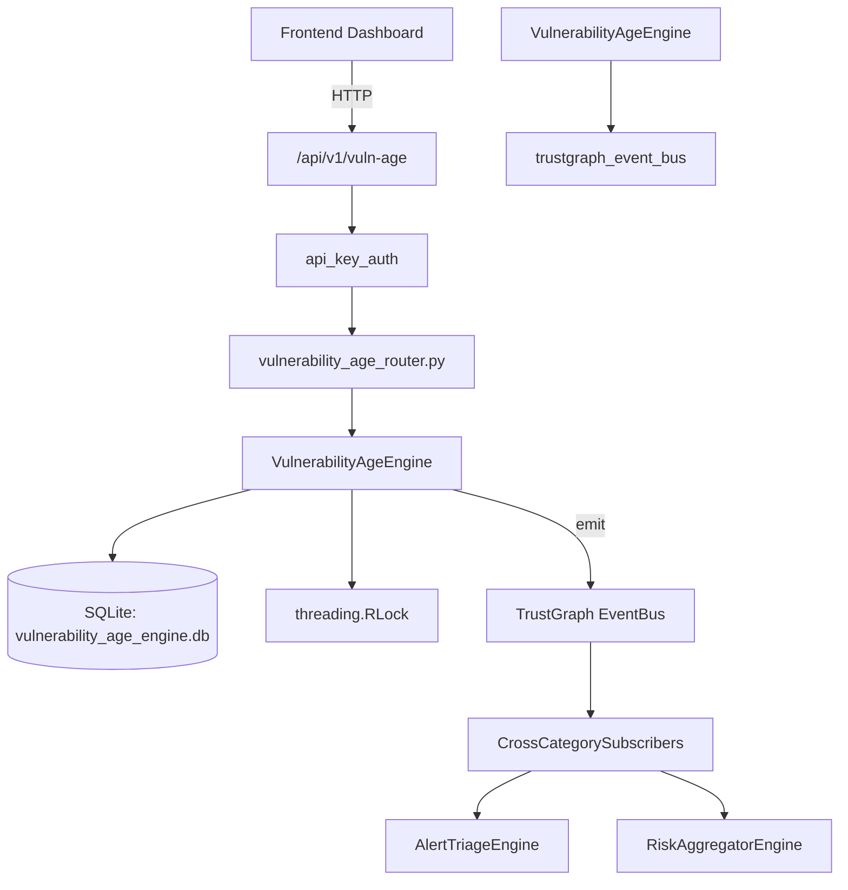

# US-0319: Vulnerability Age

## Sub-Epic: CTEM
**Master Goal**: ALDECI — $35/mo enterprise security intelligence platform replacing $50K-500K/yr tools

## User Story
As a **James Wilson (Security Engineer)**, I need to track vulnerability lifecycle
so that the platform delivers enterprise-grade ctem capabilities at 1/1000th the cost of legacy tools.

## Why This Matters
Vulnerability Age replaces functionality found in enterprise tools like CrowdStrike, Wiz, Snyk, and Rapid7.
By building this into ALDECI's $35/mo stack, customers save $50K+/yr on standalone CTEM tooling.

## Architecture

## Current State: 95% Complete
- ✅ `set_sla_policy()` — INSERT OR REPLACE SLA policy for (org_id, severity). (line 149)
- ✅ `track_vuln()` — Track a new vulnerability. Computes sla_due_at, age_days, sla_breached. (line 191)
- ✅ `resolve_vuln()` — Resolve a vulnerability. Recomputes sla_breached based on resolved_at vs sla_due (line 244)
- ✅ `refresh_ages()` — Bulk-update age_days and sla_breached for all open vulns. Returns count updated. (line 279)
- ✅ `take_snapshot()` — Compute and INSERT OR REPLACE a snapshot for today. (line 313)
- ✅ `get_age_distribution()` — Return cohort counts for open vulns: 0-7d / 8-30d / 31-90d / 91-180d / 180+d. (line 369)
- ❌ TrustGraph event emission — not yet verified

## Key Functions (from `suite-core/core/vulnerability_age_engine.py` — 450 lines)
- `VulnerabilityAgeEngine.set_sla_policy()` — INSERT OR REPLACE SLA policy for (org_id, severity). (line 149)
- `VulnerabilityAgeEngine.track_vuln()` — Track a new vulnerability. Computes sla_due_at, age_days, sla_breached. (line 191)
- `VulnerabilityAgeEngine.resolve_vuln()` — Resolve a vulnerability. Recomputes sla_breached based on resolved_at vs sla_due (line 244)
- `VulnerabilityAgeEngine.refresh_ages()` — Bulk-update age_days and sla_breached for all open vulns. Returns count updated. (line 279)
- `VulnerabilityAgeEngine.take_snapshot()` — Compute and INSERT OR REPLACE a snapshot for today. (line 313)
- `VulnerabilityAgeEngine.get_age_distribution()` — Return cohort counts for open vulns: 0-7d / 8-30d / 31-90d / 91-180d / 180+d. (line 369)
- `VulnerabilityAgeEngine.get_sla_compliance()` — Return per-severity SLA compliance: total, breached, compliant, breach_rate%. (line 398)
- `VulnerabilityAgeEngine.get_oldest_vulns()` — Return open vulns ordered by age_days DESC. (line 428)

## Dependencies
- **Depends on**: trustgraph_event_bus
- **Depended by**: Routers, TrustGraph EventBus, CrossCategorySubscribers
- **TrustGraph**: Event emission wired via ResponseInterceptorMiddleware
- **Source file**: `suite-core/core/vulnerability_age_engine.py` (450 lines)
- **Router file**: `suite-api/apps/api/vulnerability_age_router.py`

## API Endpoints
| Method | Path | Description |
|--------|------|-------------|
| PUT | `/api/v1/vuln-age/sla-policies` | set sla policy |
| POST | `/api/v1/vuln-age/vulns` | track vuln |
| PUT | `/api/v1/vuln-age/vulns/{vuln_id}/resolve` | resolve vuln |
| POST | `/api/v1/vuln-age/refresh` | refresh ages |
| POST | `/api/v1/vuln-age/snapshots` | take snapshot |
| GET | `/api/v1/vuln-age/distribution` | get age distribution |
| GET | `/api/v1/vuln-age/sla-compliance` | get sla compliance |
| GET | `/api/v1/vuln-age/oldest` | get oldest vulns |
| GET | `/api/v1/vuln-age/history` | get snapshot history |

## Tasks Remaining
1. Verify TrustGraph event emission works end-to-end (2h)
2. Add integration test with real persona workflow (2h)
3. Wire CrossCategorySubscriber consumer chain (1h)
4. Validate with 30-persona walkthrough (1h)
5. Optimize query performance for large datasets (2h)
6. Expand test coverage to edge cases (2h)

## Definition of Done
- [ ] James Wilson (Security Engineer) can access /api/v1/vuln-age and get meaningful data
- [ ] All CRUD operations return correct HTTP status codes
- [ ] TrustGraph receives events from this engine
- [ ] 39+ tests passing in `tests/test_vulnerability_age_engine.py`
- [ ] 30-persona walkthrough includes this endpoint at 100%
- [ ] No hardcoded org_id — all queries are org-scoped

## Sprint: Wave 52 (est. April 28-30, 2026)

## Test Coverage
- **Test file**: `tests/test_vulnerability_age_engine.py`
- **Tests**: 39 tests
- **Status**: Passing
