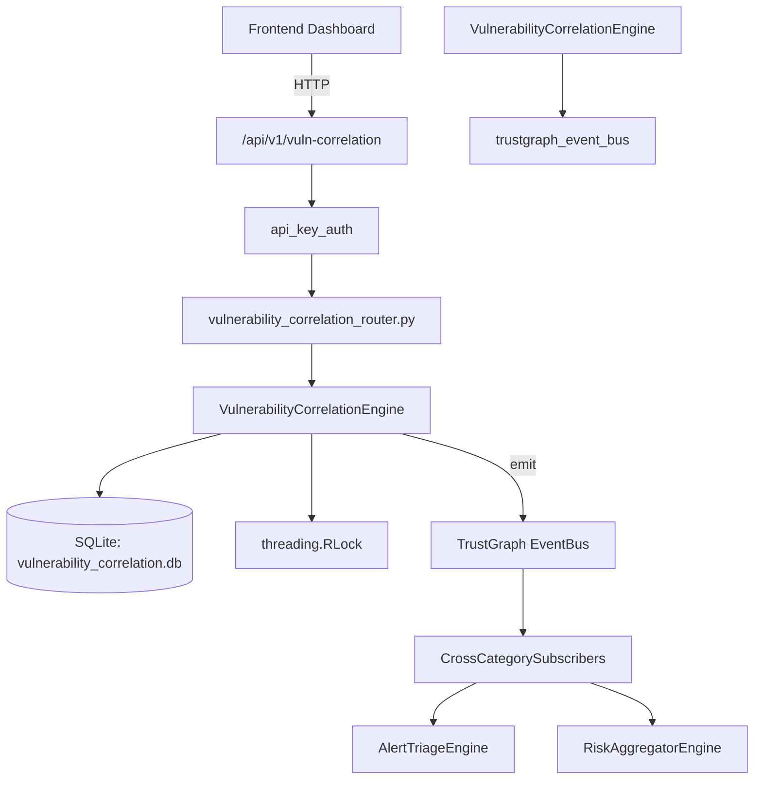

# US-0320: Vulnerability Correlation

## Sub-Epic: CTEM
**Master Goal**: ALDECI — $35/mo enterprise security intelligence platform replacing $50K-500K/yr tools

## User Story
As a **James Wilson (Security Engineer)**, I need to track vulnerability lifecycle
so that the platform delivers enterprise-grade ctem capabilities at 1/1000th the cost of legacy tools.

## Why This Matters
Vulnerability Correlation replaces functionality found in enterprise tools like CrowdStrike, Wiz, Snyk, and Rapid7.
By building this into ALDECI's $35/mo stack, customers save $50K+/yr on standalone CTEM tooling.

## Architecture

## Current State: 95% Complete
- ✅ `register_asset()` — implemented (line 133)
- ✅ `list_assets()` — implemented (line 186)
- ✅ `get_asset()` — implemented (line 207)
- ✅ `assign_vuln_to_asset()` — implemented (line 220)
- ✅ `list_asset_vulns()` — implemented (line 283)
- ✅ `create_correlation()` — implemented (line 312)
- ❌ TrustGraph event emission — not yet verified

## Key Functions (from `suite-core/core/vulnerability_correlation_engine.py` — 493 lines)
- `VulnerabilityCorrelationEngine.register_asset()` — Handle register asset (line 133)
- `VulnerabilityCorrelationEngine.list_assets()` — Handle list assets (line 186)
- `VulnerabilityCorrelationEngine.get_asset()` — Handle get asset (line 207)
- `VulnerabilityCorrelationEngine.assign_vuln_to_asset()` — Handle assign vuln to asset (line 220)
- `VulnerabilityCorrelationEngine.list_asset_vulns()` — Handle list asset vulns (line 283)
- `VulnerabilityCorrelationEngine.create_correlation()` — Handle create correlation (line 312)
- `VulnerabilityCorrelationEngine.list_correlations()` — Handle list correlations (line 385)
- `VulnerabilityCorrelationEngine.get_correlation()` — Handle get correlation (line 406)

## Dependencies
- **Depends on**: trustgraph_event_bus
- **Depended by**: Routers, TrustGraph EventBus, CrossCategorySubscribers
- **TrustGraph**: Event emission wired via ResponseInterceptorMiddleware
- **Source file**: `suite-core/core/vulnerability_correlation_engine.py` (493 lines)
- **Router file**: `suite-api/apps/api/vulnerability_correlation_router.py`

## API Endpoints
| Method | Path | Description |
|--------|------|-------------|
| POST | `/api/v1/vuln-correlation/assets` | register asset |
| GET | `/api/v1/vuln-correlation/assets` | list assets |
| GET | `/api/v1/vuln-correlation/assets/{asset_id}` | get asset |
| POST | `/api/v1/vuln-correlation/asset-vulns` | assign vuln to asset |
| GET | `/api/v1/vuln-correlation/asset-vulns` | list asset vulns |
| POST | `/api/v1/vuln-correlation/correlations` | create correlation |
| GET | `/api/v1/vuln-correlation/correlations` | list correlations |
| GET | `/api/v1/vuln-correlation/correlations/{correlation_id}` | get correlation |
| PUT | `/api/v1/vuln-correlation/correlations/{correlation_id}/status` | update correlation status |
| GET | `/api/v1/vuln-correlation/stats` | get correlation stats |

## Tasks Remaining
1. Verify TrustGraph event emission works end-to-end (2h)
2. Add integration test with real persona workflow (2h)
3. Wire CrossCategorySubscriber consumer chain (1h)
4. Validate with 30-persona walkthrough (1h)
5. Optimize query performance for large datasets (2h)
6. Expand test coverage to edge cases (2h)

## Definition of Done
- [ ] James Wilson (Security Engineer) can access /api/v1/vuln-correlation and get meaningful data
- [ ] All CRUD operations return correct HTTP status codes
- [ ] TrustGraph receives events from this engine
- [ ] 39+ tests passing in `tests/test_vulnerability_correlation_engine.py`
- [ ] 30-persona walkthrough includes this endpoint at 100%
- [ ] No hardcoded org_id — all queries are org-scoped

## Sprint: Wave 52 (est. April 28-30, 2026)

## Test Coverage
- **Test file**: `tests/test_vulnerability_correlation_engine.py`
- **Tests**: 39 tests
- **Status**: Passing
