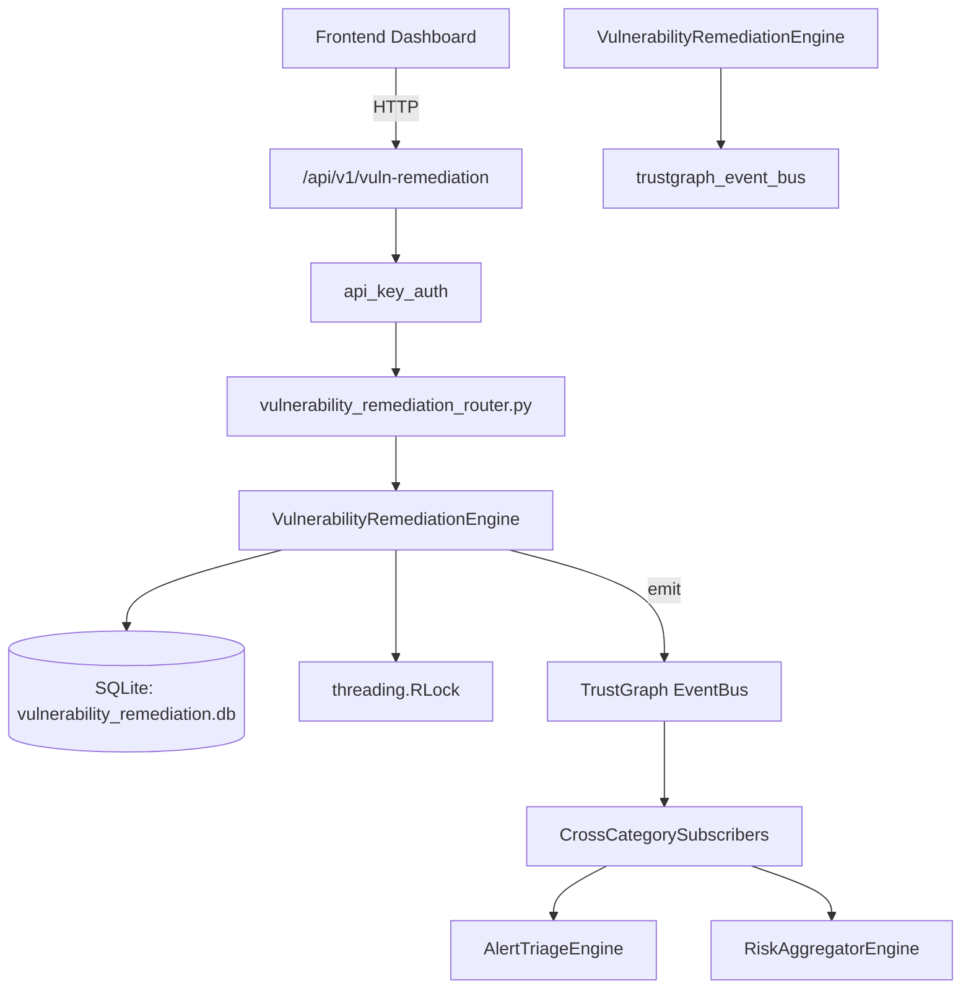

# US-0322: Vulnerability Remediation

## Sub-Epic: CTEM
**Master Goal**: ALDECI — $35/mo enterprise security intelligence platform replacing $50K-500K/yr tools

## User Story
As a **James Wilson (Security Engineer)**, I need to track vulnerability lifecycle
so that the platform delivers enterprise-grade ctem capabilities at 1/1000th the cost of legacy tools.

## Why This Matters
Vulnerability Remediation replaces functionality found in enterprise tools like CrowdStrike, Wiz, Snyk, and Rapid7.
By building this into ALDECI's $35/mo stack, customers save $50K+/yr on standalone CTEM tooling.

## Architecture

## Current State: 95% Complete
- ✅ `create_remediation_task()` — Create a new remediation task for a vulnerability. (line 124)
- ✅ `list_tasks()` — List remediation tasks with optional filters. (line 181)
- ✅ `get_task()` — Retrieve a single remediation task. (line 206)
- ✅ `update_task_status()` — Update task status with optional notes entry. (line 215)
- ✅ `add_note()` — Add a note/comment to a remediation task. (line 262)
- ✅ `get_task_notes()` — Return all notes for a task ordered chronologically. (line 292)
- ❌ TrustGraph event emission — not yet verified

## Key Functions (from `suite-core/core/vulnerability_remediation_engine.py` — 392 lines)
- `VulnerabilityRemediationEngine.create_remediation_task()` — Create a new remediation task for a vulnerability. (line 124)
- `VulnerabilityRemediationEngine.list_tasks()` — List remediation tasks with optional filters. (line 181)
- `VulnerabilityRemediationEngine.get_task()` — Retrieve a single remediation task. (line 206)
- `VulnerabilityRemediationEngine.update_task_status()` — Update task status with optional notes entry. (line 215)
- `VulnerabilityRemediationEngine.add_note()` — Add a note/comment to a remediation task. (line 262)
- `VulnerabilityRemediationEngine.get_task_notes()` — Return all notes for a task ordered chronologically. (line 292)
- `VulnerabilityRemediationEngine.get_overdue_tasks()` — Return tasks past their due_date that are not resolved/closed. (line 307)
- `VulnerabilityRemediationEngine.get_remediation_metrics()` — Return MTTR and counts by status/severity for org. (line 321)

## Dependencies
- **Depends on**: trustgraph_event_bus
- **Depended by**: Routers, TrustGraph EventBus, CrossCategorySubscribers
- **TrustGraph**: Event emission wired via ResponseInterceptorMiddleware
- **Source file**: `suite-core/core/vulnerability_remediation_engine.py` (392 lines)
- **Router file**: `suite-api/apps/api/vulnerability_remediation_router.py`

## API Endpoints
| Method | Path | Description |
|--------|------|-------------|
| POST | `/api/v1/vuln-remediation/tasks` | create remediation task |
| GET | `/api/v1/vuln-remediation/tasks/overdue` | get overdue tasks |
| GET | `/api/v1/vuln-remediation/tasks` | list tasks |
| GET | `/api/v1/vuln-remediation/tasks/{task_id}` | get task |
| PATCH | `/api/v1/vuln-remediation/tasks/{task_id}/status` | update task status |
| POST | `/api/v1/vuln-remediation/tasks/{task_id}/notes` | add note |
| GET | `/api/v1/vuln-remediation/tasks/{task_id}/notes` | get task notes |
| GET | `/api/v1/vuln-remediation/metrics` | get remediation metrics |

## Tasks Remaining
1. Verify TrustGraph event emission works end-to-end (2h)
2. Add integration test with real persona workflow (2h)
3. Wire CrossCategorySubscriber consumer chain (1h)
4. Validate with 30-persona walkthrough (1h)
5. Optimize query performance for large datasets (2h)
6. Expand test coverage to edge cases (2h)

## Definition of Done
- [ ] James Wilson (Security Engineer) can access /api/v1/vuln-remediation and get meaningful data
- [ ] All CRUD operations return correct HTTP status codes
- [ ] TrustGraph receives events from this engine
- [ ] 34+ tests passing in `tests/test_vulnerability_remediation_engine.py`
- [ ] 30-persona walkthrough includes this endpoint at 100%
- [ ] No hardcoded org_id — all queries are org-scoped

## Sprint: Wave 52 (est. April 28-30, 2026)

## Test Coverage
- **Test file**: `tests/test_vulnerability_remediation_engine.py`
- **Tests**: 34 tests
- **Status**: Passing
