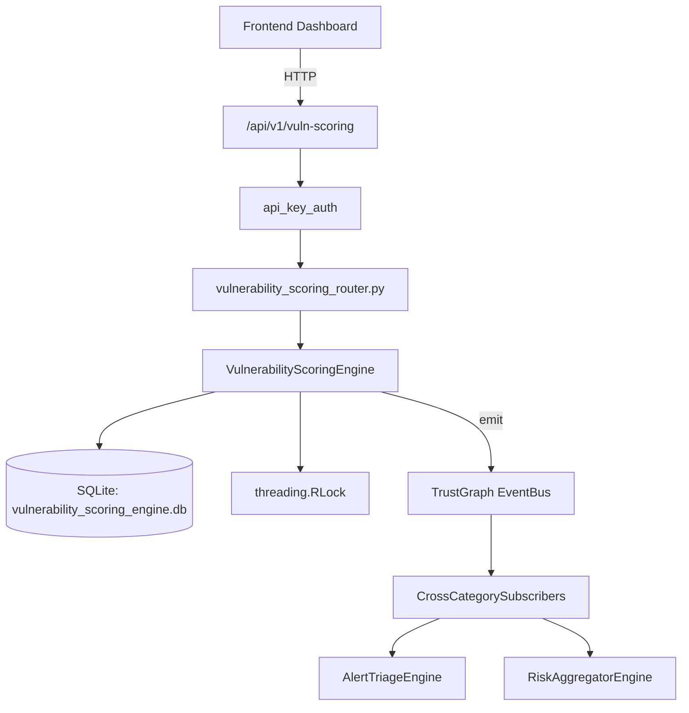

# US-0323: Vulnerability Scoring

## Sub-Epic: CTEM
**Master Goal**: ALDECI — $35/mo enterprise security intelligence platform replacing $50K-500K/yr tools

## User Story
As a **James Wilson (Security Engineer)**, I need to track vulnerability lifecycle
so that the platform delivers enterprise-grade ctem capabilities at 1/1000th the cost of legacy tools.

## Why This Matters
Vulnerability Scoring replaces functionality found in enterprise tools like CrowdStrike, Wiz, Snyk, and Rapid7.
By building this into ALDECI's $35/mo stack, customers save $50K+/yr on standalone CTEM tooling.

## Architecture

## Current State: 95% Complete
- ✅ `create_scoring_model()` — Create a scoring model and set it as the active model for the org. (line 144)
- ✅ `score_vulnerability()` — Compute composite score using the org's active scoring model and persist result. (line 194)
- ✅ `override_score()` — Create a score override and update the vuln_scores record. (line 267)
- ✅ `get_score()` — Get a vuln score, including any override information. (line 318)
- ✅ `list_scores()` — List vulnerability scores with optional filters. (line 336)
- ✅ `get_top_vulns()` — Return top vulnerabilities ordered by composite_score DESC. (line 357)
- ❌ TrustGraph event emission — not yet verified

## Key Functions (from `suite-core/core/vulnerability_scoring_engine.py` — 423 lines)
- `VulnerabilityScoringEngine.create_scoring_model()` — Create a scoring model and set it as the active model for the org. (line 144)
- `VulnerabilityScoringEngine.score_vulnerability()` — Compute composite score using the org's active scoring model and persist result. (line 194)
- `VulnerabilityScoringEngine.override_score()` — Create a score override and update the vuln_scores record. (line 267)
- `VulnerabilityScoringEngine.get_score()` — Get a vuln score, including any override information. (line 318)
- `VulnerabilityScoringEngine.list_scores()` — List vulnerability scores with optional filters. (line 336)
- `VulnerabilityScoringEngine.get_top_vulns()` — Return top vulnerabilities ordered by composite_score DESC. (line 357)
- `VulnerabilityScoringEngine.get_scoring_distribution()` — Return counts by priority_tier, avg composite_score, kev_listed count, and overr (line 366)
- `VulnerabilityScoringEngine.get_asset_risk_score()` — Return aggregated risk for an asset: avg composite_score, highest priority_tier, (line 395)

## Dependencies
- **Depends on**: standalone
- **Depended by**: Routers, TrustGraph EventBus, CrossCategorySubscribers
- **TrustGraph**: Event emission wired via ResponseInterceptorMiddleware
- **Source file**: `suite-core/core/vulnerability_scoring_engine.py` (423 lines)
- **Router file**: `suite-api/apps/api/vulnerability_scoring_router.py`

## API Endpoints
| Method | Path | Description |
|--------|------|-------------|
| POST | `/api/v1/vuln-scoring/models` | create scoring model |
| POST | `/api/v1/vuln-scoring/scores` | score vulnerability |
| POST | `/api/v1/vuln-scoring/scores/{score_id}/override` | override score |
| GET | `/api/v1/vuln-scoring/scores/{score_id}` | get score |
| GET | `/api/v1/vuln-scoring/scores` | list scores |
| GET | `/api/v1/vuln-scoring/top` | get top vulns |
| GET | `/api/v1/vuln-scoring/distribution` | get scoring distribution |
| GET | `/api/v1/vuln-scoring/assets/{asset_id}/risk` | get asset risk score |

## Tasks Remaining
1. Verify TrustGraph event emission works end-to-end (2h)
2. Add integration test with real persona workflow (2h)
3. Wire CrossCategorySubscriber consumer chain (1h)
4. Validate with 30-persona walkthrough (1h)
5. Optimize query performance for large datasets (2h)
6. Expand test coverage to edge cases (2h)

## Definition of Done
- [ ] James Wilson (Security Engineer) can access /api/v1/vuln-scoring and get meaningful data
- [ ] All CRUD operations return correct HTTP status codes
- [ ] TrustGraph receives events from this engine
- [ ] 46+ tests passing in `tests/test_vulnerability_scoring_engine.py`
- [ ] 30-persona walkthrough includes this endpoint at 100%
- [ ] No hardcoded org_id — all queries are org-scoped

## Sprint: Wave 52 (est. April 28-30, 2026)

## Test Coverage
- **Test file**: `tests/test_vulnerability_scoring_engine.py`
- **Tests**: 46 tests
- **Status**: Passing
