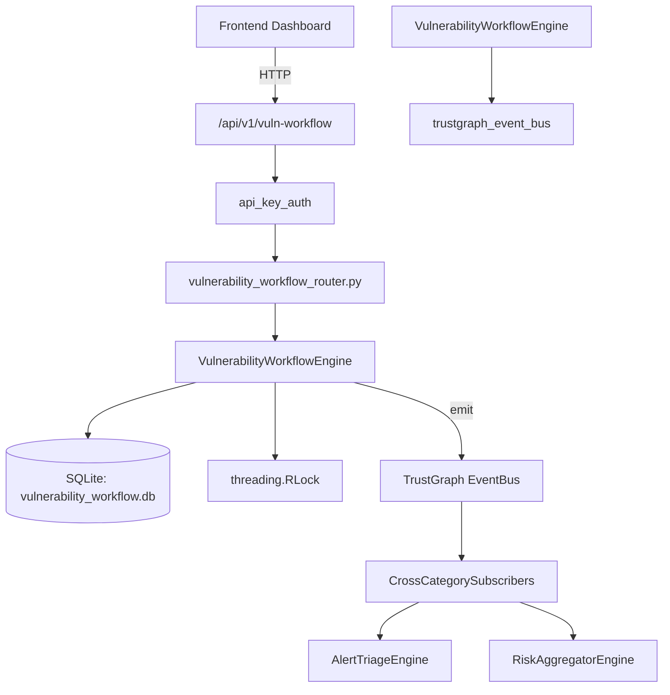

# US-0324: Vulnerability Workflow

## Sub-Epic: CTEM
**Master Goal**: ALDECI — $35/mo enterprise security intelligence platform replacing $50K-500K/yr tools

## User Story
As a **James Wilson (Security Engineer)**, I need to track vulnerability lifecycle
so that the platform delivers enterprise-grade ctem capabilities at 1/1000th the cost of legacy tools.

## Why This Matters
Vulnerability Workflow replaces functionality found in enterprise tools like CrowdStrike, Wiz, Snyk, and Rapid7.
By building this into ALDECI's $35/mo stack, customers save $50K+/yr on standalone CTEM tooling.

## Architecture

## Current State: 95% Complete
- ✅ `create_workflow()` — Create a remediation workflow. (line 124)
- ✅ `list_workflows()` — List workflows for an org with optional filters. (line 189)
- ✅ `get_workflow()` — Fetch a single workflow or None if not found. (line 217)
- ✅ `update_workflow_status()` — Update the status of a workflow. (line 226)
- ✅ `add_workflow_comment()` — Add a comment to a workflow. (line 262)
- ✅ `list_comments()` — List all comments for a workflow ordered by created_at. (line 286)
- ❌ TrustGraph event emission — not yet verified

## Key Functions (from `suite-core/core/vulnerability_workflow_engine.py` — 381 lines)
- `VulnerabilityWorkflowEngine.create_workflow()` — Create a remediation workflow. (line 124)
- `VulnerabilityWorkflowEngine.list_workflows()` — List workflows for an org with optional filters. (line 189)
- `VulnerabilityWorkflowEngine.get_workflow()` — Fetch a single workflow or None if not found. (line 217)
- `VulnerabilityWorkflowEngine.update_workflow_status()` — Update the status of a workflow. (line 226)
- `VulnerabilityWorkflowEngine.add_workflow_comment()` — Add a comment to a workflow. (line 262)
- `VulnerabilityWorkflowEngine.list_comments()` — List all comments for a workflow ordered by created_at. (line 286)
- `VulnerabilityWorkflowEngine.get_workflow_stats()` — Return aggregated workflow statistics for the org. (line 303)

## Dependencies
- **Depends on**: trustgraph_event_bus
- **Depended by**: Routers, TrustGraph EventBus, CrossCategorySubscribers
- **TrustGraph**: Event emission wired via ResponseInterceptorMiddleware
- **Source file**: `suite-core/core/vulnerability_workflow_engine.py` (381 lines)
- **Router file**: `suite-api/apps/api/vulnerability_workflow_router.py`

## API Endpoints
| Method | Path | Description |
|--------|------|-------------|
| POST | `/api/v1/vuln-workflow/workflows` | create workflow |
| GET | `/api/v1/vuln-workflow/workflows` | list workflows |
| GET | `/api/v1/vuln-workflow/workflows/{workflow_id}` | get workflow |
| PATCH | `/api/v1/vuln-workflow/workflows/{workflow_id}/status` | update workflow status |
| POST | `/api/v1/vuln-workflow/workflows/{workflow_id}/comments` | add workflow comment |
| GET | `/api/v1/vuln-workflow/workflows/{workflow_id}/comments` | list comments |
| GET | `/api/v1/vuln-workflow/stats` | get workflow stats |

## Tasks Remaining
1. Verify TrustGraph event emission works end-to-end (2h)
2. Add integration test with real persona workflow (2h)
3. Wire CrossCategorySubscriber consumer chain (1h)
4. Validate with 30-persona walkthrough (1h)
5. Optimize query performance for large datasets (2h)
6. Expand test coverage to edge cases (2h)

## Definition of Done
- [ ] James Wilson (Security Engineer) can access /api/v1/vuln-workflow and get meaningful data
- [ ] All CRUD operations return correct HTTP status codes
- [ ] TrustGraph receives events from this engine
- [ ] 42+ tests passing in `tests/test_vulnerability_workflow_engine.py`
- [ ] 30-persona walkthrough includes this endpoint at 100%
- [ ] No hardcoded org_id — all queries are org-scoped

## Sprint: Wave 52 (est. April 28-30, 2026)

## Test Coverage
- **Test file**: `tests/test_vulnerability_workflow_engine.py`
- **Tests**: 42 tests
- **Status**: Passing
