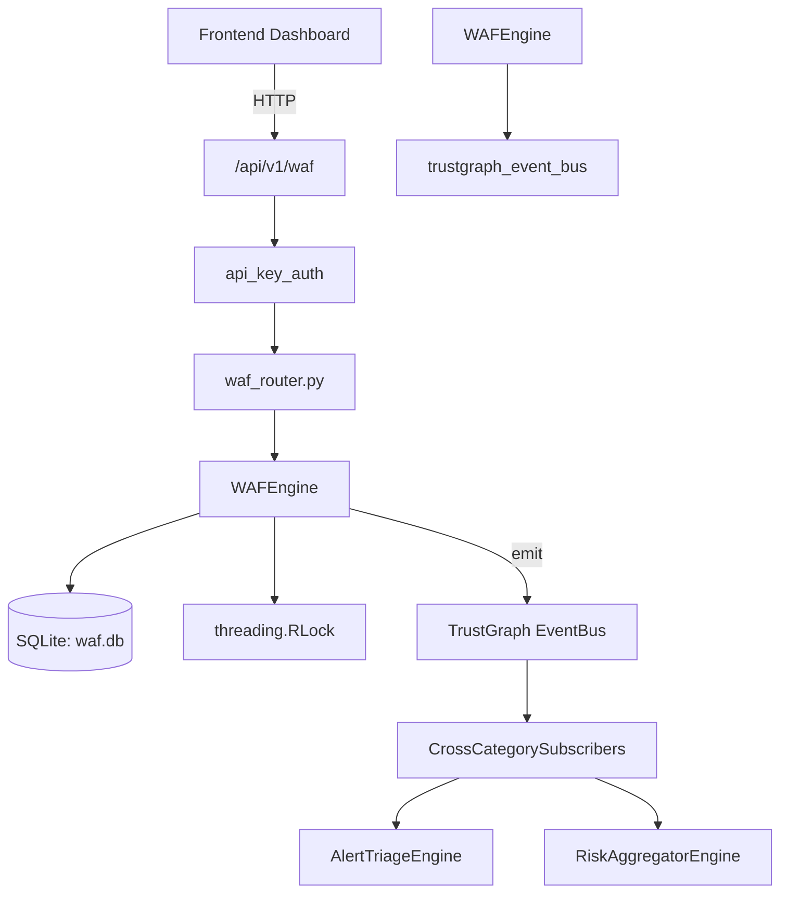

# US-0325: Waf

## Sub-Epic: Network
**Master Goal**: ALDECI — $35/mo enterprise security intelligence platform replacing $50K-500K/yr tools

## User Story
As a **James Wilson (Security Engineer)**, I need to manage WAF rules and policies
so that the platform delivers enterprise-grade network capabilities at 1/1000th the cost of legacy tools.

## Why This Matters
Waf replaces functionality found in enterprise tools like CrowdStrike, Wiz, Snyk, and Rapid7.
By building this into ALDECI's $35/mo stack, customers save $50K+/yr on standalone Network tooling.

## Architecture

## Current State: 95% Complete
- ✅ `create_rule()` — Create a WAF rule for the given org. (line 152)
- ✅ `list_rules()` — List WAF rules for the org, optionally filtered by rule_type and enabled. (line 202)
- ✅ `update_rule()` — Update fields of an existing WAF rule. Returns updated rule or None. (line 222)
- ✅ `delete_rule()` — Delete a WAF rule. Returns True if deleted, False if not found. (line 260)
- ✅ `record_blocked_request()` — Record a blocked request event. (line 288)
- ✅ `list_blocked_requests()` — List blocked requests within the past `hours`, optionally filtered. (line 323)
- ❌ TrustGraph event emission — not yet verified

## Key Functions (from `suite-core/core/waf_engine.py` — 544 lines)
- `WAFEngine.create_rule()` — Create a WAF rule for the given org. (line 152)
- `WAFEngine.list_rules()` — List WAF rules for the org, optionally filtered by rule_type and enabled. (line 202)
- `WAFEngine.update_rule()` — Update fields of an existing WAF rule. Returns updated rule or None. (line 222)
- `WAFEngine.delete_rule()` — Delete a WAF rule. Returns True if deleted, False if not found. (line 260)
- `WAFEngine.record_blocked_request()` — Record a blocked request event. (line 288)
- `WAFEngine.list_blocked_requests()` — List blocked requests within the past `hours`, optionally filtered. (line 323)
- `WAFEngine.add_virtual_patch()` — Create a virtual patch (temporary CVE mitigation rule). (line 372)
- `WAFEngine.list_virtual_patches()` — List virtual patches for the org. (line 400)

## Dependencies
- **Depends on**: trustgraph_event_bus
- **Depended by**: Routers, TrustGraph EventBus, CrossCategorySubscribers
- **TrustGraph**: Event emission wired via ResponseInterceptorMiddleware
- **Source file**: `suite-core/core/waf_engine.py` (544 lines)
- **Router file**: `suite-api/apps/api/waf_router.py`

## API Endpoints
| Method | Path | Description |
|--------|------|-------------|
| POST | `/api/v1/waf/generate` | generate rules |
| POST | `/api/v1/waf/virtual-patch` | virtual patch |
| GET | `/api/v1/waf/rules` | list rules |
| GET | `/api/v1/waf/rules/{rule_id}` | get rule |
| PATCH | `/api/v1/waf/rules/{rule_id}/status` | update rule status |
| POST | `/api/v1/waf/rules/{rule_id}/test` | test rule |
| POST | `/api/v1/waf/export` | export rules |
| GET | `/api/v1/waf/templates` | list templates |

## Tasks Remaining
1. Verify TrustGraph event emission works end-to-end (2h)
2. Add integration test with real persona workflow (2h)
3. Wire CrossCategorySubscriber consumer chain (1h)
4. Validate with 30-persona walkthrough (1h)
5. Optimize query performance for large datasets (2h)
6. Expand test coverage to edge cases (2h)

## Definition of Done
- [ ] James Wilson (Security Engineer) can access /api/v1/waf and get meaningful data
- [ ] All CRUD operations return correct HTTP status codes
- [ ] TrustGraph receives events from this engine
- [ ] 40+ tests passing in `tests/test_waf_engine.py`
- [ ] 30-persona walkthrough includes this endpoint at 100%
- [ ] No hardcoded org_id — all queries are org-scoped

## Sprint: Wave 52 (est. April 28-30, 2026)

## Test Coverage
- **Test file**: `tests/test_waf_engine.py`
- **Tests**: 40 tests
- **Status**: Passing
