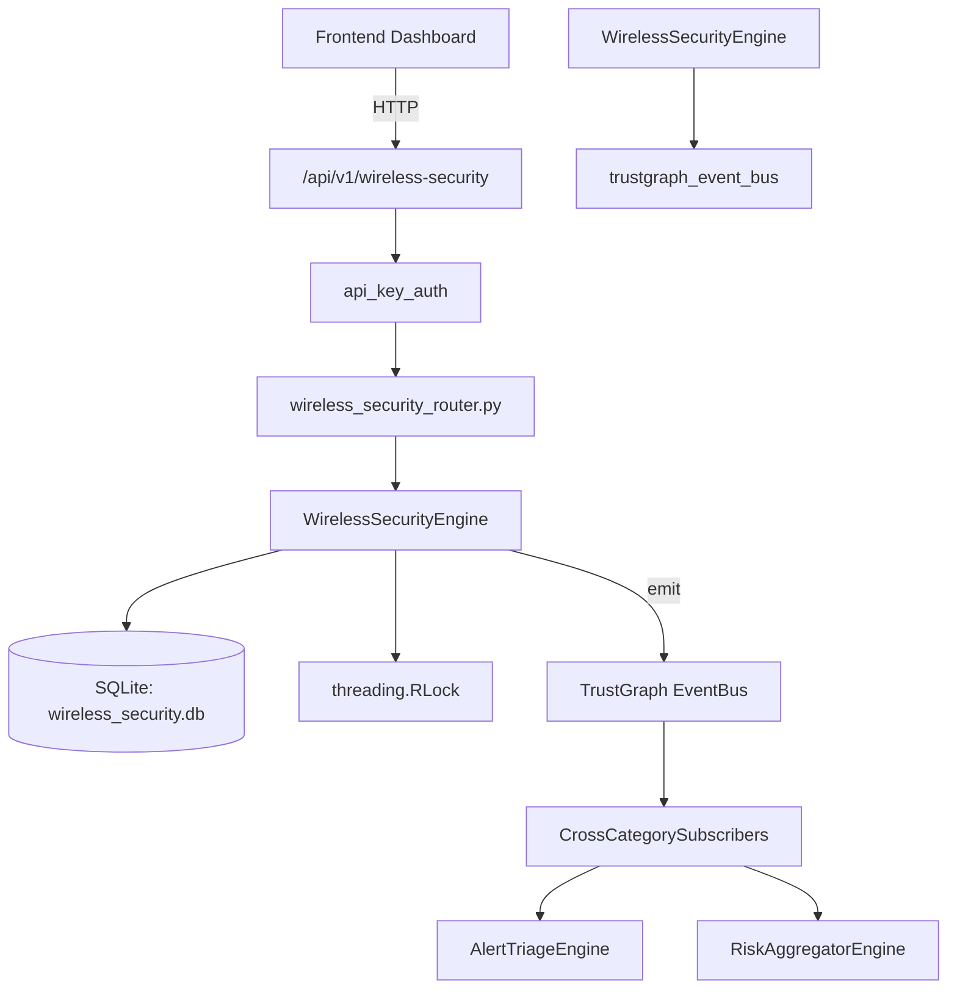

# US-0326: Wireless Security

## Sub-Epic: Network
**Master Goal**: ALDECI — $35/mo enterprise security intelligence platform replacing $50K-500K/yr tools

## User Story
As a **James Wilson (Security Engineer)**, I need to secure wireless networks
so that the platform delivers enterprise-grade network capabilities at 1/1000th the cost of legacy tools.

## Why This Matters
Wireless Security replaces functionality found in enterprise tools like CrowdStrike, Wiz, Snyk, and Rapid7.
By building this into ALDECI's $35/mo stack, customers save $50K+/yr on standalone Network tooling.

## Architecture

## Current State: 95% Complete
- ✅ `register_access_point()` — Register a new wireless access point. Returns the AP record. (line 113)
- ✅ `list_access_points()` — List access points for org, optionally filtered by band or security_protocol. (line 155)
- ✅ `get_access_point()` — Fetch a single AP scoped to org_id. (line 175)
- ✅ `record_wireless_threat()` — Record a wireless threat event. Returns the threat record. (line 190)
- ✅ `list_wireless_threats()` — List threats for org, optionally filtered by threat_type or status. (line 222)
- ✅ `resolve_threat()` — Mark a threat as resolved with resolution text. (line 242)
- ❌ TrustGraph event emission — not yet verified

## Key Functions (from `suite-core/core/wireless_security_engine.py` — 317 lines)
- `WirelessSecurityEngine.register_access_point()` — Register a new wireless access point. Returns the AP record. (line 113)
- `WirelessSecurityEngine.list_access_points()` — List access points for org, optionally filtered by band or security_protocol. (line 155)
- `WirelessSecurityEngine.get_access_point()` — Fetch a single AP scoped to org_id. (line 175)
- `WirelessSecurityEngine.record_wireless_threat()` — Record a wireless threat event. Returns the threat record. (line 190)
- `WirelessSecurityEngine.list_wireless_threats()` — List threats for org, optionally filtered by threat_type or status. (line 222)
- `WirelessSecurityEngine.resolve_threat()` — Mark a threat as resolved with resolution text. (line 242)
- `WirelessSecurityEngine.get_wireless_stats()` — Return wireless security overview stats for org_id. (line 276)

## Dependencies
- **Depends on**: trustgraph_event_bus
- **Depended by**: Routers, TrustGraph EventBus, CrossCategorySubscribers
- **TrustGraph**: Event emission wired via ResponseInterceptorMiddleware
- **Source file**: `suite-core/core/wireless_security_engine.py` (317 lines)
- **Router file**: `suite-api/apps/api/wireless_security_router.py`

## API Endpoints
| Method | Path | Description |
|--------|------|-------------|
| POST | `/api/v1/wireless-security/access-points` | register access point |
| GET | `/api/v1/wireless-security/access-points` | list access points |
| GET | `/api/v1/wireless-security/access-points/{ap_id}` | get access point |
| POST | `/api/v1/wireless-security/threats` | record wireless threat |
| GET | `/api/v1/wireless-security/threats` | list wireless threats |
| PUT | `/api/v1/wireless-security/threats/{threat_id}/resolve` | resolve threat |
| GET | `/api/v1/wireless-security/stats` | get wireless stats |

## Tasks Remaining
1. Verify TrustGraph event emission works end-to-end (2h)
2. Add integration test with real persona workflow (2h)
3. Wire CrossCategorySubscriber consumer chain (1h)
4. Validate with 30-persona walkthrough (1h)
5. Optimize query performance for large datasets (2h)
6. Expand test coverage to edge cases (2h)

## Definition of Done
- [ ] James Wilson (Security Engineer) can access /api/v1/wireless-security and get meaningful data
- [ ] All CRUD operations return correct HTTP status codes
- [ ] TrustGraph receives events from this engine
- [ ] 45+ tests passing in `tests/test_wireless_security_engine.py`
- [ ] 30-persona walkthrough includes this endpoint at 100%
- [ ] No hardcoded org_id — all queries are org-scoped

## Sprint: Wave 52 (est. April 28-30, 2026)

## Test Coverage
- **Test file**: `tests/test_wireless_security_engine.py`
- **Tests**: 45 tests
- **Status**: Passing
