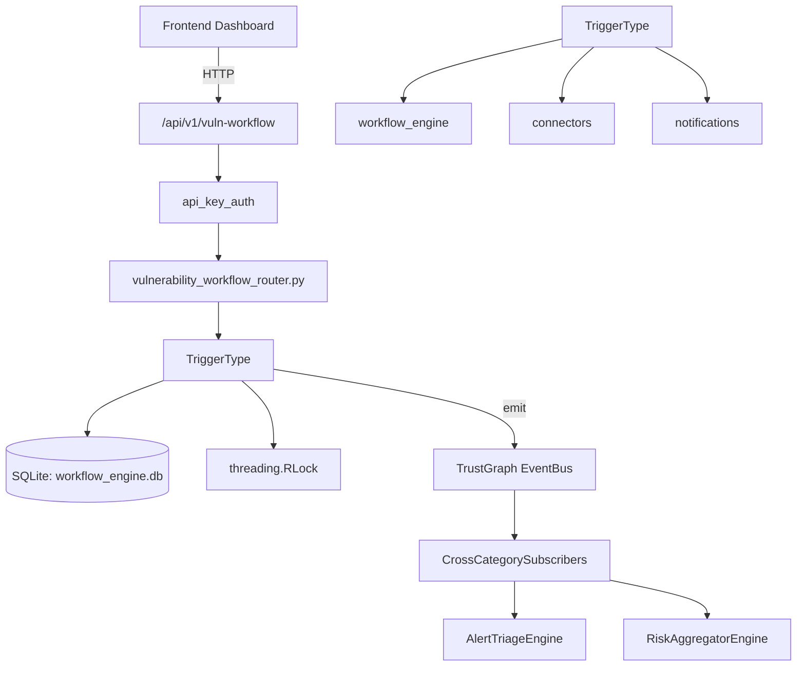

# US-0327: Workflow

## Sub-Epic: Advanced
**Master Goal**: ALDECI — $35/mo enterprise security intelligence platform replacing $50K-500K/yr tools

## User Story
As a **Daniel Thompson (SecOps Manager)**, I need to automate security workflows
so that the platform delivers enterprise-grade advanced capabilities at 1/1000th the cost of legacy tools.

## Why This Matters
Workflow replaces functionality found in enterprise tools like CrowdStrike, Wiz, Snyk, and Rapid7.
By building this into ALDECI's $35/mo stack, customers save $50K+/yr on standalone Advanced tooling.

## Architecture

## Current State: 95% Complete
- ✅ `create_workflow()` — Persist a new workflow. Returns the workflow with assigned id. (line 343)
- ✅ `update_workflow()` — Update fields on an existing workflow. Raises KeyError if not found. (line 374)
- ✅ `delete_workflow()` — Remove a workflow by id. Returns True if deleted, False if not found. (line 409)
- ✅ `get_workflow()` — Return a single workflow by id, or None. (line 424)
- ✅ `list_workflows()` — Return workflows, optionally filtered by org_id and trigger type. (line 434)
- ✅ `evaluate_event()` — Match event against all enabled workflows, execute matching ones. (line 466)
- ❌ TrustGraph event emission — not yet verified

## Key Functions (from `suite-core/core/workflow_engine.py` — 875 lines)
- `WorkflowEngine.create_workflow()` — Persist a new workflow. Returns the workflow with assigned id. (line 343)
- `WorkflowEngine.update_workflow()` — Update fields on an existing workflow. Raises KeyError if not found. (line 374)
- `WorkflowEngine.delete_workflow()` — Remove a workflow by id. Returns True if deleted, False if not found. (line 409)
- `WorkflowEngine.get_workflow()` — Return a single workflow by id, or None. (line 424)
- `WorkflowEngine.list_workflows()` — Return workflows, optionally filtered by org_id and trigger type. (line 434)
- `WorkflowEngine.evaluate_event()` — Match event against all enabled workflows, execute matching ones. (line 466)
- `WorkflowEngine.get_execution_history()` — Return execution history, optionally filtered by org and workflow. (line 728)
- `WorkflowEngine.get_templates()` — Return built-in workflow templates. (line 801)

## Dependencies
- **Depends on**: workflow_engine, connectors, notifications
- **Depended by**: Routers, TrustGraph EventBus, CrossCategorySubscribers
- **TrustGraph**: Event emission wired via ResponseInterceptorMiddleware
- **Source file**: `suite-core/core/workflow_engine.py` (875 lines)
- **Router file**: `suite-api/apps/api/vulnerability_workflow_router.py`

## API Endpoints
| Method | Path | Description |
|--------|------|-------------|
| POST | `/api/v1/vuln-workflow/workflows` | create workflow |
| GET | `/api/v1/vuln-workflow/workflows` | list workflows |
| GET | `/api/v1/vuln-workflow/workflows/{workflow_id}` | get workflow |
| PATCH | `/api/v1/vuln-workflow/workflows/{workflow_id}/status` | update workflow status |
| POST | `/api/v1/vuln-workflow/workflows/{workflow_id}/comments` | add workflow comment |
| GET | `/api/v1/vuln-workflow/workflows/{workflow_id}/comments` | list comments |
| GET | `/api/v1/vuln-workflow/stats` | get workflow stats |

## Tasks Remaining
1. Verify TrustGraph event emission works end-to-end (2h)
2. Add integration test with real persona workflow (2h)
3. Wire CrossCategorySubscriber consumer chain (1h)
4. Validate with 30-persona walkthrough (1h)
5. Optimize query performance for large datasets (2h)
6. Expand test coverage to edge cases (2h)

## Definition of Done
- [ ] Daniel Thompson (SecOps Manager) can access /api/v1/vuln-workflow and get meaningful data
- [ ] All CRUD operations return correct HTTP status codes
- [ ] TrustGraph receives events from this engine
- [ ] 68+ tests passing in `tests/test_workflow_engine.py`
- [ ] 30-persona walkthrough includes this endpoint at 100%
- [ ] No hardcoded org_id — all queries are org-scoped

## Sprint: Wave 52 (est. April 28-30, 2026)

## Test Coverage
- **Test file**: `tests/test_workflow_engine.py`
- **Tests**: 68 tests
- **Status**: Passing
