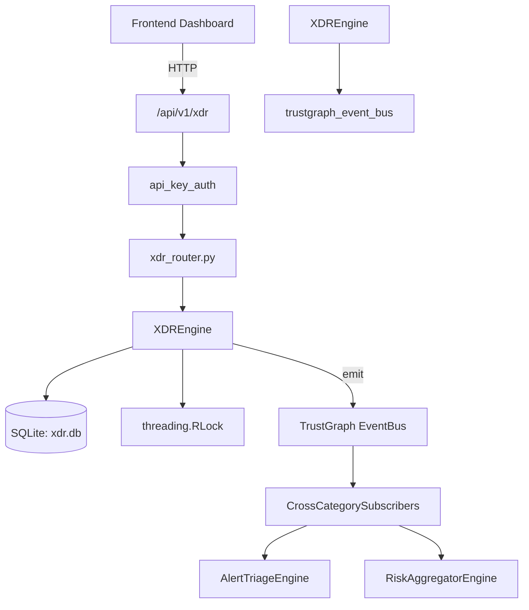

# US-0328: Xdr

## Sub-Epic: SOC
**Master Goal**: ALDECI — $35/mo enterprise security intelligence platform replacing $50K-500K/yr tools

## User Story
As a **Alex Rivera (SOC T1 Analyst)**, I need to correlate XDR telemetry
so that the platform delivers enterprise-grade soc capabilities at 1/1000th the cost of legacy tools.

## Why This Matters
Xdr replaces functionality found in enterprise tools like CrowdStrike, Wiz, Snyk, and Rapid7.
By building this into ALDECI's $35/mo stack, customers save $50K+/yr on standalone SOC tooling.

## Architecture

## Current State: 95% Complete
- ✅ `ingest_signal()` — Ingest a signal, persist it, then run auto-correlation. (line 236)
- ✅ `list_signals()` — implemented (line 296)
- ✅ `create_incident()` — implemented (line 328)
- ✅ `link_signal_to_incident()` — Link a signal to an incident, update signal_count, last_seen, affected_entities. (line 376)
- ✅ `list_incidents()` — implemented (line 434)
- ✅ `get_incident()` — Return incident dict with linked signals list. (line 464)
- ❌ TrustGraph event emission — not yet verified

## Key Functions (from `suite-core/core/xdr_engine.py` — 649 lines)
- `XDREngine.ingest_signal()` — Ingest a signal, persist it, then run auto-correlation. (line 236)
- `XDREngine.list_signals()` — Handle list signals (line 296)
- `XDREngine.create_incident()` — Handle create incident (line 328)
- `XDREngine.link_signal_to_incident()` — Link a signal to an incident, update signal_count, last_seen, affected_entities. (line 376)
- `XDREngine.list_incidents()` — Handle list incidents (line 434)
- `XDREngine.get_incident()` — Return incident dict with linked signals list. (line 464)
- `XDREngine.update_incident_status()` — Handle update incident status (line 496)
- `XDREngine.create_rule()` — Handle create rule (line 527)

## Dependencies
- **Depends on**: trustgraph_event_bus
- **Depended by**: Routers, TrustGraph EventBus, CrossCategorySubscribers
- **TrustGraph**: Event emission wired via ResponseInterceptorMiddleware
- **Source file**: `suite-core/core/xdr_engine.py` (649 lines)
- **Router file**: `suite-api/apps/api/xdr_router.py`

## API Endpoints
| Method | Path | Description |
|--------|------|-------------|
| POST | `/api/v1/xdr/signals` | ingest signal |
| GET | `/api/v1/xdr/signals` | list signals |
| POST | `/api/v1/xdr/incidents` | create incident |
| GET | `/api/v1/xdr/incidents` | list incidents |
| GET | `/api/v1/xdr/incidents/{incident_id}` | get incident |
| PATCH | `/api/v1/xdr/incidents/{incident_id}/status` | update incident status |
| POST | `/api/v1/xdr/incidents/{incident_id}/signals` | link signal to incident |
| POST | `/api/v1/xdr/rules` | create rule |
| GET | `/api/v1/xdr/rules` | list rules |
| GET | `/api/v1/xdr/stats` | get xdr stats |

## Tasks Remaining
1. Verify TrustGraph event emission works end-to-end (2h)
2. Add integration test with real persona workflow (2h)
3. Wire CrossCategorySubscriber consumer chain (1h)
4. Validate with 30-persona walkthrough (1h)
5. Optimize query performance for large datasets (2h)
6. Expand test coverage to edge cases (2h)

## Definition of Done
- [ ] Alex Rivera (SOC T1 Analyst) can access /api/v1/xdr and get meaningful data
- [ ] All CRUD operations return correct HTTP status codes
- [ ] TrustGraph receives events from this engine
- [ ] 36+ tests passing in `tests/test_xdr_engine.py`
- [ ] 30-persona walkthrough includes this endpoint at 100%
- [ ] No hardcoded org_id — all queries are org-scoped

## Sprint: Wave 52 (est. April 28-30, 2026)

## Test Coverage
- **Test file**: `tests/test_xdr_engine.py`
- **Tests**: 36 tests
- **Status**: Passing
