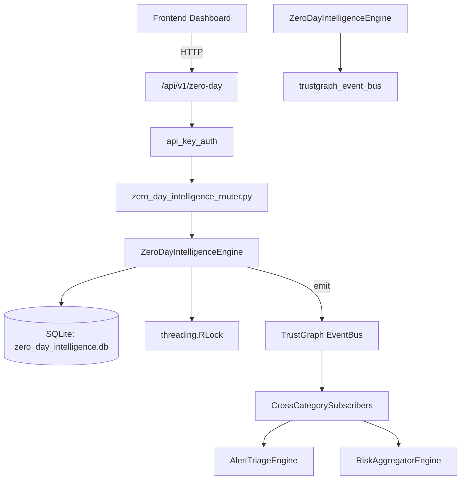

# US-0329: Zero Day Intelligence

## Sub-Epic: Advanced
**Master Goal**: ALDECI — $35/mo enterprise security intelligence platform replacing $50K-500K/yr tools

## User Story
As a **Nina Patel (Threat Intel Analyst)**, I need to track zero-day vulnerabilities
so that the platform delivers enterprise-grade advanced capabilities at 1/1000th the cost of legacy tools.

## Why This Matters
Zero Day Intelligence replaces functionality found in enterprise tools like CrowdStrike, Wiz, Snyk, and Rapid7.
By building this into ALDECI's $35/mo stack, customers save $50K+/yr on standalone Advanced tooling.

## Architecture

## Current State: 95% Complete
- ✅ `register_vulnerability()` — Register a new zero-day vulnerability. (line 164)
- ✅ `list_vulnerabilities()` — List vulnerabilities with optional filters. (line 250)
- ✅ `get_vulnerability()` — Retrieve a single vulnerability by ID with org isolation. (line 274)
- ✅ `update_patch_status()` — Update the patch status of a vulnerability. (line 283)
- ✅ `record_threat_actor()` — Record a threat actor associated with a vulnerability. (line 315)
- ✅ `list_threat_actors()` — List threat actors with optional vulnerability filter. (line 358)
- ❌ TrustGraph event emission — not yet verified

## Key Functions (from `suite-core/core/zero_day_intelligence_engine.py` — 498 lines)
- `ZeroDayIntelligenceEngine.register_vulnerability()` — Register a new zero-day vulnerability. (line 164)
- `ZeroDayIntelligenceEngine.list_vulnerabilities()` — List vulnerabilities with optional filters. (line 250)
- `ZeroDayIntelligenceEngine.get_vulnerability()` — Retrieve a single vulnerability by ID with org isolation. (line 274)
- `ZeroDayIntelligenceEngine.update_patch_status()` — Update the patch status of a vulnerability. (line 283)
- `ZeroDayIntelligenceEngine.record_threat_actor()` — Record a threat actor associated with a vulnerability. (line 315)
- `ZeroDayIntelligenceEngine.list_threat_actors()` — List threat actors with optional vulnerability filter. (line 358)
- `ZeroDayIntelligenceEngine.record_mitigation()` — Record a mitigation for a vulnerability. (line 378)
- `ZeroDayIntelligenceEngine.list_mitigations()` — List mitigations with optional filters. (line 422)

## Dependencies
- **Depends on**: trustgraph_event_bus
- **Depended by**: Routers, TrustGraph EventBus, CrossCategorySubscribers
- **TrustGraph**: Event emission wired via ResponseInterceptorMiddleware
- **Source file**: `suite-core/core/zero_day_intelligence_engine.py` (498 lines)
- **Router file**: `suite-api/apps/api/zero_day_intelligence_router.py`

## API Endpoints
| Method | Path | Description |
|--------|------|-------------|
| POST | `/api/v1/zero-day/vulns` | register vulnerability |
| GET | `/api/v1/zero-day/vulns` | list vulnerabilities |
| GET | `/api/v1/zero-day/vulns/{vuln_id}` | get vulnerability |
| PUT | `/api/v1/zero-day/vulns/{vuln_id}/patch-status` | update patch status |
| POST | `/api/v1/zero-day/threat-actors` | record threat actor |
| GET | `/api/v1/zero-day/threat-actors` | list threat actors |
| POST | `/api/v1/zero-day/mitigations` | record mitigation |
| GET | `/api/v1/zero-day/mitigations` | list mitigations |
| GET | `/api/v1/zero-day/stats` | get zero day stats |

## Tasks Remaining
1. Verify TrustGraph event emission works end-to-end (2h)
2. Add integration test with real persona workflow (2h)
3. Wire CrossCategorySubscriber consumer chain (1h)
4. Validate with 30-persona walkthrough (1h)
5. Optimize query performance for large datasets (2h)
6. Expand test coverage to edge cases (2h)

## Definition of Done
- [ ] Nina Patel (Threat Intel Analyst) can access /api/v1/zero-day and get meaningful data
- [ ] All CRUD operations return correct HTTP status codes
- [ ] TrustGraph receives events from this engine
- [ ] 37+ tests passing in `tests/test_zero_day_intelligence_engine.py`
- [ ] 30-persona walkthrough includes this endpoint at 100%
- [ ] No hardcoded org_id — all queries are org-scoped

## Sprint: Wave 52 (est. April 28-30, 2026)

## Test Coverage
- **Test file**: `tests/test_zero_day_intelligence_engine.py`
- **Tests**: 37 tests
- **Status**: Passing
