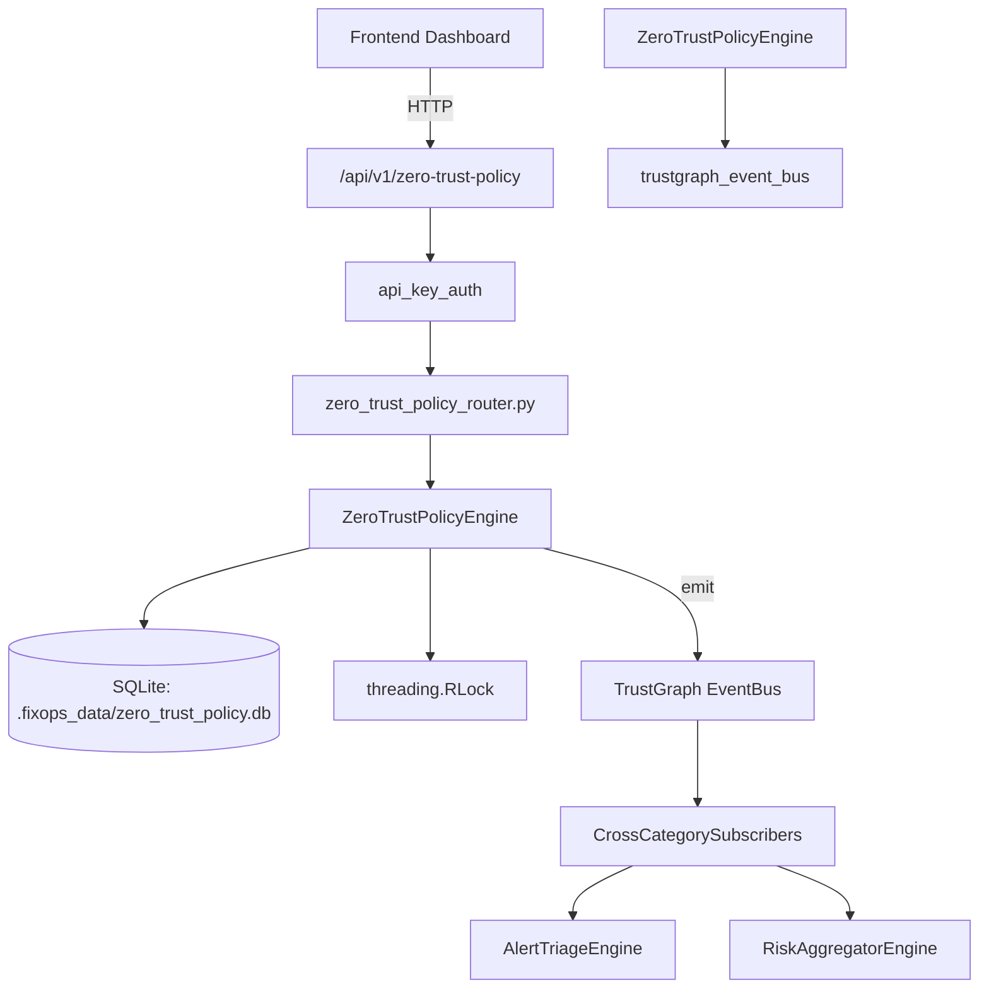

# US-0332: Zero Trust Policy

## Sub-Epic: Advanced
**Master Goal**: ALDECI — $35/mo enterprise security intelligence platform replacing $50K-500K/yr tools

## User Story
As a **Richard Adams (Security Architect)**, I need to enforce zero trust policies
so that the platform delivers enterprise-grade advanced capabilities at 1/1000th the cost of legacy tools.

## Why This Matters
Zero Trust Policy replaces functionality found in enterprise tools like CrowdStrike, Wiz, Snyk, and Rapid7.
By building this into ALDECI's $35/mo stack, customers save $50K+/yr on standalone Advanced tooling.

## Architecture

## Current State: 95% Complete
- ✅ `create_policy()` — Create a Zero Trust policy. (line 139)
- ✅ `list_policies()` — List policies for an org, optionally filtered by type and enabled state. (line 198)
- ✅ `get_policy()` — implemented (line 227)
- ✅ `update_policy()` — Update allowed fields on a policy. Returns updated policy. (line 239)
- ✅ `delete_policy()` — implemented (line 287)
- ✅ `evaluate_access()` — Evaluate an access request against active policies. (line 304)
- ❌ TrustGraph event emission — not yet verified

## Key Functions (from `suite-core/core/zero_trust_policy_engine.py` — 613 lines)
- `ZeroTrustPolicyEngine.create_policy()` — Create a Zero Trust policy. (line 139)
- `ZeroTrustPolicyEngine.list_policies()` — List policies for an org, optionally filtered by type and enabled state. (line 198)
- `ZeroTrustPolicyEngine.get_policy()` — Handle get policy (line 227)
- `ZeroTrustPolicyEngine.update_policy()` — Update allowed fields on a policy. Returns updated policy. (line 239)
- `ZeroTrustPolicyEngine.delete_policy()` — Handle delete policy (line 287)
- `ZeroTrustPolicyEngine.evaluate_access()` — Evaluate an access request against active policies. (line 304)
- `ZeroTrustPolicyEngine.record_access_event()` — Log an access decision event. (line 388)
- `ZeroTrustPolicyEngine.list_access_events()` — Handle list access events (line 427)

## Dependencies
- **Depends on**: trustgraph_event_bus
- **Depended by**: Routers, TrustGraph EventBus, CrossCategorySubscribers
- **TrustGraph**: Event emission wired via ResponseInterceptorMiddleware
- **Source file**: `suite-core/core/zero_trust_policy_engine.py` (613 lines)
- **Router file**: `suite-api/apps/api/zero_trust_policy_router.py`

## API Endpoints
| Method | Path | Description |
|--------|------|-------------|
| GET | `/api/v1/zero-trust-policy/policies` | list policies |
| POST | `/api/v1/zero-trust-policy/policies` | create policy |
| GET | `/api/v1/zero-trust-policy/policies/{policy_id}` | get policy |
| PUT | `/api/v1/zero-trust-policy/policies/{policy_id}` | update policy |
| DELETE | `/api/v1/zero-trust-policy/policies/{policy_id}` | delete policy |
| POST | `/api/v1/zero-trust-policy/evaluate` | evaluate access |
| GET | `/api/v1/zero-trust-policy/access-events` | list access events |
| POST | `/api/v1/zero-trust-policy/access-events` | record access event |
| GET | `/api/v1/zero-trust-policy/stats` | get policy stats |
| GET | `/api/v1/zero-trust-policy/compliance` | get compliance posture |

## Tasks Remaining
1. Verify TrustGraph event emission works end-to-end (2h)
2. Add integration test with real persona workflow (2h)
3. Wire CrossCategorySubscriber consumer chain (1h)
4. Validate with 30-persona walkthrough (1h)
5. Optimize query performance for large datasets (2h)
6. Expand test coverage to edge cases (2h)

## Definition of Done
- [ ] Richard Adams (Security Architect) can access /api/v1/zero-trust-policy and get meaningful data
- [ ] All CRUD operations return correct HTTP status codes
- [ ] TrustGraph receives events from this engine
- [ ] 44+ tests passing in `tests/test_zero_trust_policy_engine.py`
- [ ] 30-persona walkthrough includes this endpoint at 100%
- [ ] No hardcoded org_id — all queries are org-scoped

## Sprint: Wave 53 (est. April 29-31, 2026)

## Test Coverage
- **Test file**: `tests/test_zero_trust_policy_engine.py`
- **Tests**: 44 tests
- **Status**: Passing
