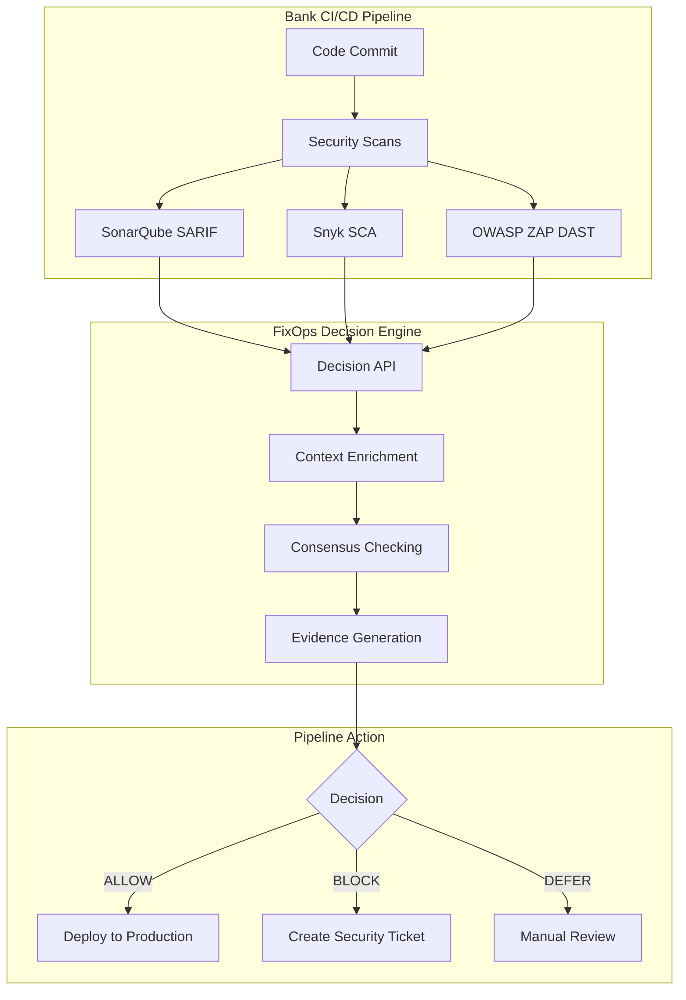

# FixOps Decision Engine

## Overview

FixOps is a bank-grade **Decision & Verification Engine** designed for CI/CD pipeline integration. It processes security scan data from existing tools (SonarQube, Snyk, OWASP ZAP) and makes intelligent ALLOW/BLOCK/DEFER decisions with confidence scoring.

## 🎯 What FixOps Does

**NOT a Fix Engine** - FixOps is a **Decision Engine** that:
- ✅ Analyzes security findings from your existing tools
- ✅ Makes ALLOW/BLOCK/DEFER decisions with 85% consensus threshold
- ✅ Provides evidence-based audit trails for compliance
- ✅ Integrates directly into CI/CD pipelines with exit codes

## 🏗️ Architecture



## 🚀 Quick Start

### 1. Deploy via Backstage

1. **Create New Component**: Use "Deploy FixOps Decision Engine" template
2. **Configure**: Set environment, cluster, and integration options
3. **Deploy**: Backstage triggers Terraform deployment
4. **Access**: UI available at https://fixops.bank.internal

### 2. Integrate with CI/CD

```bash
# Add to your bank's CI/CD pipeline:
curl -X POST "https://fixops-api.bank.internal/api/v1/cicd/decision" \
  -H "Content-Type: application/json" \
  --data '{
    "service_name": "payment-processor",
    "environment": "production",
    "sarif_results": {...},  # Your SonarQube results
    "sca_results": {...},    # Your Snyk results
    "business_criticality": "critical",
    "compliance_requirements": ["pci_dss", "sox"]
  }'

# Response:
# {"decision": "ALLOW", "confidence_score": 0.92, "exit_code": 0}
```

## 📊 Decision Process

### Stage-by-Stage Analysis

FixOps analyzes your deployment through each SSDLC stage:

1. **📋 PLAN**: Business context from Jira tickets and Confluence
2. **🔍 CODE**: SAST findings from SonarQube, CodeQL via SARIF
3. **📦 BUILD**: SCA dependencies from Snyk via SBOM
4. **🧪 TEST**: DAST runtime vulnerabilities from OWASP ZAP
5. **🚀 RELEASE**: Policy compliance via OPA/Rego
6. **🏗️ DEPLOY**: Infrastructure validation via IBOM
7. **⚙️ OPERATE**: Runtime correlation and monitoring

### Consensus Algorithm

**85% Consensus Threshold** with weighted scoring:
- **Vector DB (25%)**: Pattern matching against 2,847+ security patterns
- **Golden Regression (30%)**: Validation against 1,247+ test cases
- **Policy Engine (25%)**: OPA/Rego compliance checking
- **Criticality Assessment (20%)**: SBOM-based business impact

## 🏦 Bank Integration

### Compliance Features

- **PCI DSS**: Payment card industry compliance tracking
- **SOX**: Financial control audit trails
- **FFIEC**: Federal financial institution cybersecurity
- **Evidence Lake**: 7-year immutable audit record retention

### Testing

Complete Postman collections included for bank validation:
```bash
./test-bank-api.sh
```
