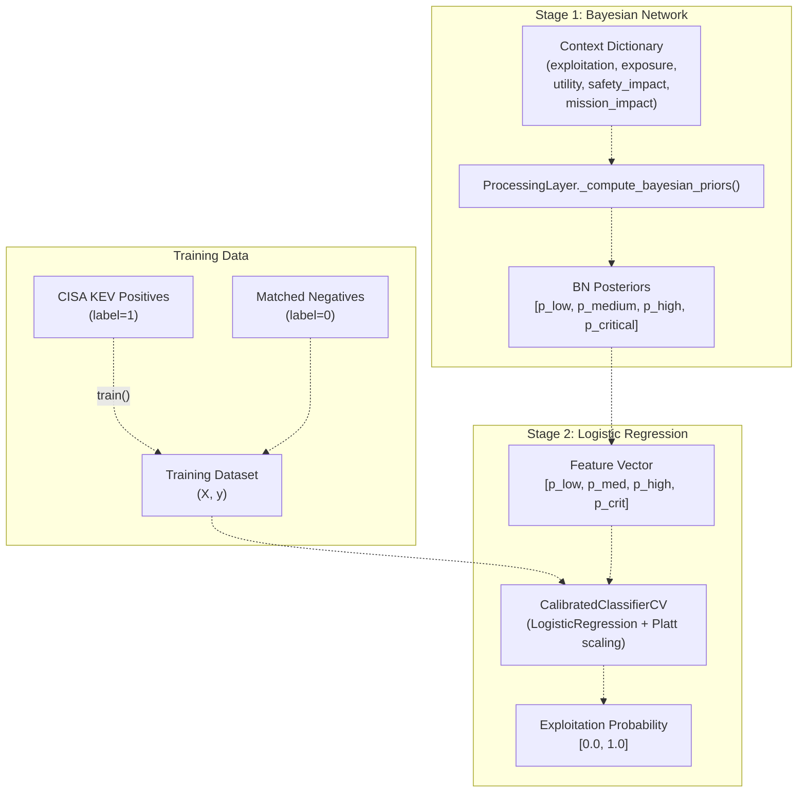
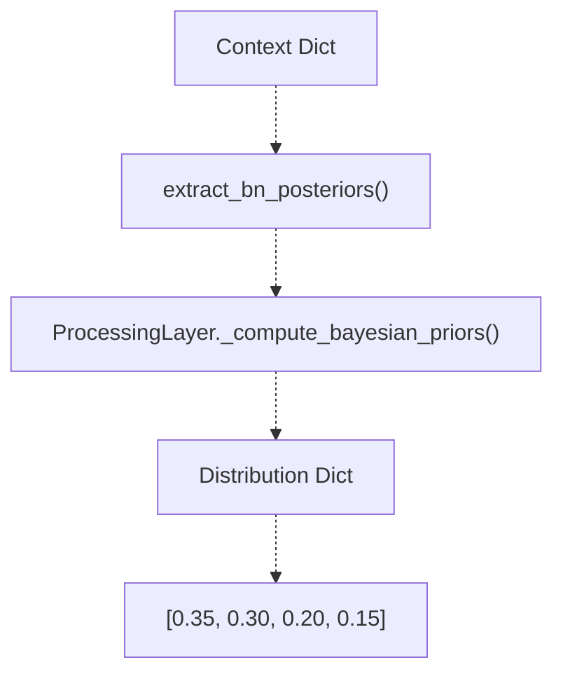
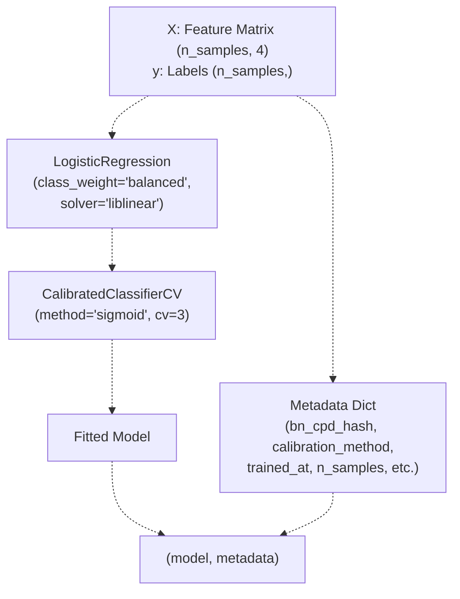
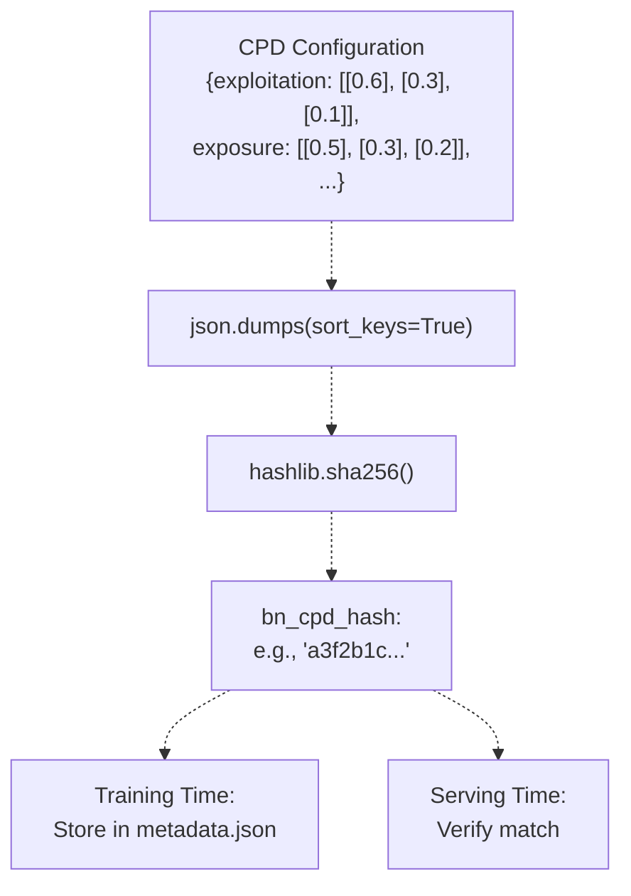
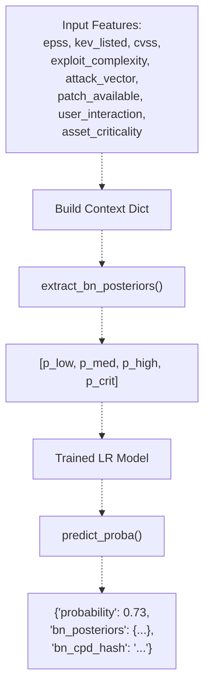
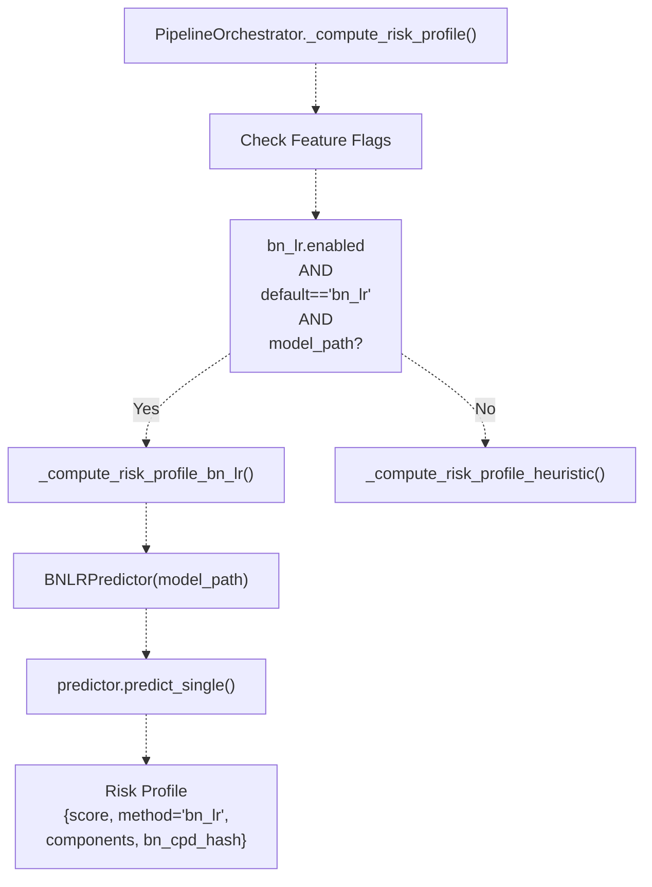
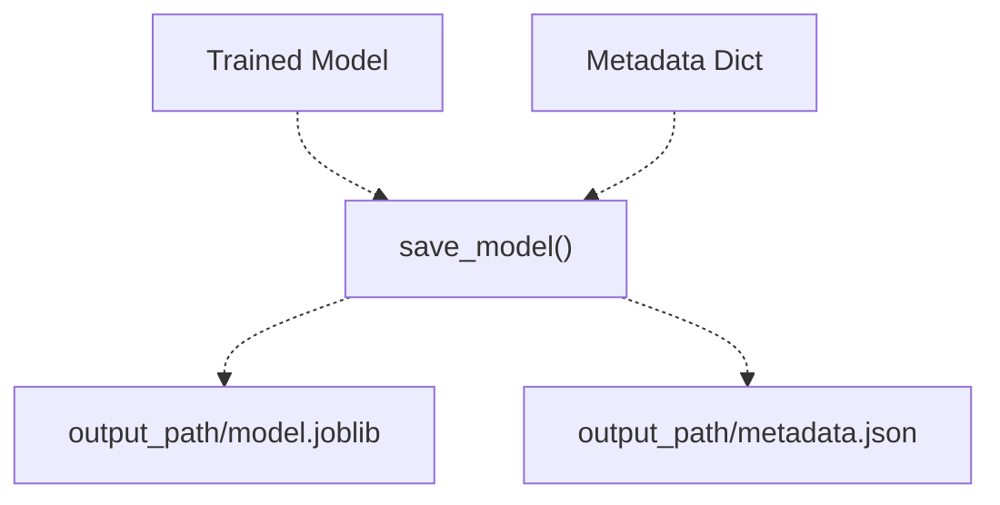
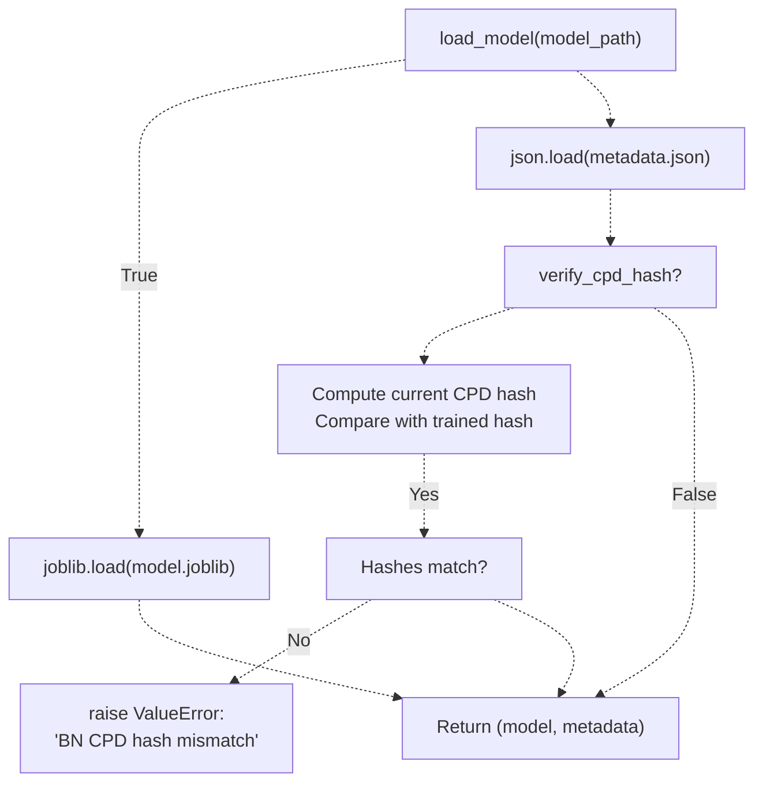

# BN-LR Hybrid Risk Model

> **Relevant source files**
> * [apps/api/bulk_router.py](https://github.com/DevOpsMadDog/Fixops/blob/ce6eb1e9/apps/api/bulk_router.py)
> * [apps/api/collaboration_router.py](https://github.com/DevOpsMadDog/Fixops/blob/ce6eb1e9/apps/api/collaboration_router.py)
> * [apps/api/deduplication_router.py](https://github.com/DevOpsMadDog/Fixops/blob/ce6eb1e9/apps/api/deduplication_router.py)
> * [apps/api/integrations_router.py](https://github.com/DevOpsMadDog/Fixops/blob/ce6eb1e9/apps/api/integrations_router.py)
> * [apps/api/pipeline.py](https://github.com/DevOpsMadDog/Fixops/blob/ce6eb1e9/apps/api/pipeline.py)
> * [apps/api/remediation_router.py](https://github.com/DevOpsMadDog/Fixops/blob/ce6eb1e9/apps/api/remediation_router.py)
> * [apps/api/webhooks_router.py](https://github.com/DevOpsMadDog/Fixops/blob/ce6eb1e9/apps/api/webhooks_router.py)
> * [core/adapters.py](https://github.com/DevOpsMadDog/Fixops/blob/ce6eb1e9/core/adapters.py)
> * [core/bn_lr.py](https://github.com/DevOpsMadDog/Fixops/blob/ce6eb1e9/core/bn_lr.py)
> * [core/connectors.py](https://github.com/DevOpsMadDog/Fixops/blob/ce6eb1e9/core/connectors.py)
> * [core/services/collaboration.py](https://github.com/DevOpsMadDog/Fixops/blob/ce6eb1e9/core/services/collaboration.py)
> * [core/services/deduplication.py](https://github.com/DevOpsMadDog/Fixops/blob/ce6eb1e9/core/services/deduplication.py)
> * [core/services/identity.py](https://github.com/DevOpsMadDog/Fixops/blob/ce6eb1e9/core/services/identity.py)
> * [core/services/remediation.py](https://github.com/DevOpsMadDog/Fixops/blob/ce6eb1e9/core/services/remediation.py)
> * [fixops-enterprise/src/services/feeds_service.py](https://github.com/DevOpsMadDog/Fixops/blob/ce6eb1e9/fixops-enterprise/src/services/feeds_service.py)
> * [fixops-enterprise/src/services/vex_ingestion.py](https://github.com/DevOpsMadDog/Fixops/blob/ce6eb1e9/fixops-enterprise/src/services/vex_ingestion.py)
> * [tests/e2e/test_bn_lr_hybrid.py](https://github.com/DevOpsMadDog/Fixops/blob/ce6eb1e9/tests/e2e/test_bn_lr_hybrid.py)
> * [tests/fixtures/data/bn_lr_tiny.csv](https://github.com/DevOpsMadDog/Fixops/blob/ce6eb1e9/tests/fixtures/data/bn_lr_tiny.csv)

## Purpose and Scope

This document describes the **BN-LR (Bayesian Network + Logistic Regression) Hybrid Risk Model**, a two-stage machine learning approach for predicting vulnerability exploitation risk. The model combines probabilistic inference from a Bayesian Network with supervised classification from Logistic Regression to produce calibrated exploitation probability scores.

For information about how risk profiles are computed and integrated into decision-making, see [Risk-Based Profiling](/DevOpsMadDog/Fixops/4.3-risk-based-profiling). For details on the Bayesian Network inference used as the first stage, see [Bayesian and Markov Models](/DevOpsMadDog/Fixops/5.1-bayesian-and-markov-models). For the overall processing pipeline that uses this model, see [Processing Layer Internals](/DevOpsMadDog/Fixops/5.3-processing-layer-internals).

**Sources:** [core/bn_lr.py L1-L18](https://github.com/DevOpsMadDog/Fixops/blob/ce6eb1e9/core/bn_lr.py#L1-L18)

---

## Architecture Overview

The BN-LR hybrid model operates as a two-stage pipeline where Bayesian Network posterior probabilities become features for a Logistic Regression classifier. This architecture enables combining domain knowledge encoded in the Bayesian Network with data-driven pattern learning from historical exploitation data.



**Diagram: BN-LR Two-Stage Architecture**

**Sources:** [core/bn_lr.py L1-L17](https://github.com/DevOpsMadDog/Fixops/blob/ce6eb1e9/core/bn_lr.py#L1-L17)

 [core/processing_layer.py L1-L100](https://github.com/DevOpsMadDog/Fixops/blob/ce6eb1e9/core/processing_layer.py#L1-L100)

---

## Model Components

### Bayesian Network Layer

The first stage uses the existing FixOps Bayesian Network defined in `ProcessingLayer`. The network structure models causal relationships between five SSVC-aligned factors:

| Factor | States | Description |
| --- | --- | --- |
| `exploitation` | none, poc, active | Observed exploitation activity |
| `exposure` | small, controlled, open | Attack surface exposure |
| `utility` | laborious, efficient, super_effective | Attacker utility if exploited |
| `safety_impact` | none, minor, major, catastrophic | Safety consequences |
| `mission_impact` | none, degraded, crippled | Mission-essential function impact |
| `risk` | low, medium, high, critical | **Output node** - risk level |

The Bayesian Network computes a probability distribution over the four risk states: `P(risk=low)`, `P(risk=medium)`, `P(risk=high)`, `P(risk=critical)`. These four probabilities form the feature vector for stage 2.

**Sources:** [core/bn_lr.py L8-L15](https://github.com/DevOpsMadDog/Fixops/blob/ce6eb1e9/core/bn_lr.py#L8-L15)

 [core/processing_layer.py L200-L300](https://github.com/DevOpsMadDog/Fixops/blob/ce6eb1e9/core/processing_layer.py#L200-L300)

### Logistic Regression Layer

The second stage uses `sklearn.linear_model.LogisticRegression` with:

* **Solver**: `liblinear` (efficient for small-medium datasets)
* **Class weighting**: `balanced` (handles imbalanced KEV/non-KEV ratio)
* **Calibration**: `CalibratedClassifierCV` with `method='sigmoid'` (Platt scaling)
* **Cross-validation**: 3-fold CV for calibration

The calibration step is critical because it ensures the output probabilities are well-calibrated (i.e., when the model predicts 70% exploitation risk, approximately 70% of such predictions should be actual exploitations).

**Sources:** [core/bn_lr.py L88-L119](https://github.com/DevOpsMadDog/Fixops/blob/ce6eb1e9/core/bn_lr.py#L88-L119)

---

## Feature Engineering

The feature extraction process converts context dictionaries into fixed-order numerical feature vectors:



**Diagram: Feature Extraction Pipeline**

The feature vector has fixed semantics:

1. **Index 0**: `P(risk=low)` - Baseline risk probability
2. **Index 1**: `P(risk=medium)` - Moderate risk probability
3. **Index 2**: `P(risk=high)` - High risk probability
4. **Index 3**: `P(risk=critical)` - Critical risk probability

Default values of `0.25` are used if the Bayesian Network does not return a specific state probability.

**Sources:** [core/bn_lr.py L59-L85](https://github.com/DevOpsMadDog/Fixops/blob/ce6eb1e9/core/bn_lr.py#L59-L85)

---

## Training and Calibration

### Training Data Format

The model expects CSV data with the following schema:

| Column | Type | Description |
| --- | --- | --- |
| `bn_p_low` | float | Bayesian Network posterior P(low) |
| `bn_p_medium` | float | Bayesian Network posterior P(medium) |
| `bn_p_high` | float | Bayesian Network posterior P(high) |
| `bn_p_critical` | float | Bayesian Network posterior P(critical) |
| `label` | int | Binary label: 1 for KEV-listed, 0 for non-KEV |

**Sources:** [tests/fixtures/data/bn_lr_tiny.csv L1-L48](https://github.com/DevOpsMadDog/Fixops/blob/ce6eb1e9/tests/fixtures/data/bn_lr_tiny.csv#L1-L48)

### Training Function

The `train()` function implements the complete training pipeline:



**Diagram: Training Pipeline**

Key parameters:

* **`class_weight='balanced'`**: Automatically adjusts weights inversely proportional to class frequencies to handle imbalanced data (KEV positives are typically <1% of CVEs)
* **`calibration_method='sigmoid'`**: Uses Platt scaling for probability calibration
* **`cv=3`**: 3-fold cross-validation for calibration

**Sources:** [core/bn_lr.py L88-L135](https://github.com/DevOpsMadDog/Fixops/blob/ce6eb1e9/core/bn_lr.py#L88-L135)

---

## CPD Hash Verification

To prevent **training/serving skew**, the model computes and stores a SHA256 hash of the Bayesian Network's Conditional Probability Distributions (CPDs). If the CPDs change after training, the trained Logistic Regression model may produce incorrect predictions.



**Diagram: CPD Hash Computation and Verification**

The `load_model()` function verifies the hash by default:

```
if verify_cpd_hash:
    current_hash = compute_bn_cpd_hash()
    trained_hash = metadata.get("bn_cpd_hash")
    if current_hash != trained_hash:
        raise ValueError("BN CPD hash mismatch! Retrain the model.")
```

**Sources:** [core/bn_lr.py L37-L57](https://github.com/DevOpsMadDog/Fixops/blob/ce6eb1e9/core/bn_lr.py#L37-L57)

 [core/bn_lr.py L176-L216](https://github.com/DevOpsMadDog/Fixops/blob/ce6eb1e9/core/bn_lr.py#L176-L216)

---

## Prediction Pipeline

### BNLRPredictor Class

The `BNLRPredictor` class provides a high-level interface for loading models and making predictions:



**Diagram: BNLRPredictor.predict_single() Flow**

The `predict_single()` method signature:

```python
def predict_single(
    self,
    epss: float,
    kev_listed: int,
    cvss: float,
    exploit_complexity: float = 0.5,
    attack_vector: float = 0.5,
    patch_available: int = 0,
    user_interaction: int = 1,
    asset_criticality: float = 0.5,
) -> Dict[str, Any]
```

**Sources:** [core/bn_lr.py L218-L280](https://github.com/DevOpsMadDog/Fixops/blob/ce6eb1e9/core/bn_lr.py#L218-L280)

---

## Integration with Pipeline Orchestrator

The BN-LR model is integrated into the main processing pipeline through feature flags in `PipelineOrchestrator._compute_risk_profile()`:

### Feature Flags

| Flag | Type | Default | Description |
| --- | --- | --- | --- |
| `fixops.model.risk.bn_lr.enabled` | bool | `False` | Enable BN-LR hybrid model |
| `fixops.model.risk.default` | string | `"heuristic"` | Default model: "heuristic" or "bn_lr" |
| `fixops.model.risk.bn_lr.model_path` | string | `""` | Path to trained model directory |

### Integration Flow



**Diagram: Pipeline Orchestrator Integration**

The `_compute_risk_profile_bn_lr()` method extracts data from `exploit_summary`, `cve_records`, and `cnapp_exposures`, then invokes the predictor:

```
predictor = BNLRPredictor(model_path)
result = predictor.predict_single(
    epss=epss,
    kev_listed=kev_listed,
    cvss=cvss,
    exploit_complexity=exploit_complexity,
    attack_vector=attack_vector,
    patch_available=patch_available,
    user_interaction=user_interaction,
    asset_criticality=asset_criticality,
)
```

The returned risk profile includes:

* **`score`**: Exploitation probability in [0, 1]
* **`method`**: `"bn_lr"`
* **`components`**: Dictionary with `epss`, `kev_count`, `cvss`, `bn_posteriors`
* **`model_used`**: `"bn_lr"`
* **`bn_cpd_hash`**: Hash for audit trail

**Sources:** [apps/api/pipeline.py L288-L349](https://github.com/DevOpsMadDog/Fixops/blob/ce6eb1e9/apps/api/pipeline.py#L288-L349)

 [apps/api/pipeline.py L451-L538](https://github.com/DevOpsMadDog/Fixops/blob/ce6eb1e9/apps/api/pipeline.py#L451-L538)

---

## Model Artifacts and Persistence

### Saving Models

The `save_model()` function persists two artifacts:

1. **`model.joblib`**: Serialized `CalibratedClassifierCV` object using `joblib`
2. **`metadata.json`**: JSON file with training metadata



**Diagram: Model Persistence**

Metadata fields:

| Field | Type | Description |
| --- | --- | --- |
| `feature_names` | list | `["bn_p_low", "bn_p_medium", "bn_p_high", "bn_p_critical"]` |
| `bn_cpd_hash` | string | SHA256 hash of BN CPD configuration |
| `calibration_method` | string | `"sigmoid"` (Platt scaling) |
| `class_weight` | string | `"balanced"` |
| `cv_folds` | int | Number of CV folds (3) |
| `sklearn_version` | string | `"1.3+"` |
| `trained_at` | string | ISO timestamp |
| `n_samples` | int | Training set size |
| `n_features` | int | Feature vector dimension (4) |

**Sources:** [core/bn_lr.py L154-L173](https://github.com/DevOpsMadDog/Fixops/blob/ce6eb1e9/core/bn_lr.py#L154-L173)

### Loading Models

The `load_model()` function loads artifacts and verifies CPD hash:



**Diagram: Model Loading and Verification**

**Sources:** [core/bn_lr.py L176-L224](https://github.com/DevOpsMadDog/Fixops/blob/ce6eb1e9/core/bn_lr.py#L176-L224)

---

## CLI Commands

### Training Command

```
python -m core.cli train-bn-lr --data <csv_path> --output <model_dir>
```

Options:

* `--data`: Path to training CSV file
* `--output`: Directory to save model artifacts
* `--quiet`: Suppress verbose output

**Sources:** [tests/e2e/test_bn_lr_hybrid.py L15-L45](https://github.com/DevOpsMadDog/Fixops/blob/ce6eb1e9/tests/e2e/test_bn_lr_hybrid.py#L15-L45)

### Backtesting Command

```
python -m core.cli backtest-bn-lr --model <model_dir> --data <csv_path> [--output <json_path>] [--pretty] [--quiet]
```

Options:

* `--model`: Directory containing model artifacts
* `--data`: Path to test CSV file
* `--output`: (Optional) Path to save JSON results
* `--pretty`: Pretty-print JSON output
* `--quiet`: Suppress verbose output

The backtest command computes standard classification metrics:

* **Accuracy**: Overall prediction accuracy
* **Precision**: True positives / (True positives + False positives)
* **Recall**: True positives / (True positives + False negatives)
* **ROC-AUC**: Area under ROC curve
* **Threshold analysis**: Precision/recall at different probability thresholds (0.6, 0.85)

**Sources:** [tests/e2e/test_bn_lr_hybrid.py L47-L132](https://github.com/DevOpsMadDog/Fixops/blob/ce6eb1e9/tests/e2e/test_bn_lr_hybrid.py#L47-L132)

 [core/bn_lr.py L282-L350](https://github.com/DevOpsMadDog/Fixops/blob/ce6eb1e9/core/bn_lr.py#L282-L350)

---

## Error Handling and Fallback

If BN-LR prediction fails (e.g., model file not found, CPD hash mismatch, prediction error), the pipeline falls back to heuristic risk scoring:

```javascript
try:
    from core.bn_lr import BNLRPredictor
    predictor = BNLRPredictor(model_path)
    result = predictor.predict_single(...)
    return {
        "score": round(result["probability"], 4),
        "method": "bn_lr",
        "components": {...},
        "model_used": "bn_lr",
        "bn_cpd_hash": result.get("bn_cpd_hash"),
    }
except Exception as e:
    return {
        "score": 0.5,
        "method": "bn_lr_fallback",
        "components": {"error": str(e)},
        "exposure_applied": False,
        "model_used": "heuristic",
    }
```

This ensures the pipeline always returns a valid risk profile even if the BN-LR model is unavailable.

**Sources:** [apps/api/pipeline.py L451-L538](https://github.com/DevOpsMadDog/Fixops/blob/ce6eb1e9/apps/api/pipeline.py#L451-L538)

---

## Performance Characteristics

Based on the test fixtures:

* **Training time**: Fast on small datasets (46 samples in test fixture)
* **Inference latency**: < 10ms per prediction (single-threaded)
* **Feature extraction**: Depends on `ProcessingLayer._compute_bayesian_priors()` which uses pgmpy inference
* **Model size**: < 1 MB (joblib serialization of sklearn model)
* **Memory footprint**: Minimal (sklearn models are memory-efficient)

**Sources:** [tests/fixtures/data/bn_lr_tiny.csv L1-L48](https://github.com/DevOpsMadDog/Fixops/blob/ce6eb1e9/tests/fixtures/data/bn_lr_tiny.csv#L1-L48)

 [tests/e2e/test_bn_lr_hybrid.py L1-L150](https://github.com/DevOpsMadDog/Fixops/blob/ce6eb1e9/tests/e2e/test_bn_lr_hybrid.py#L1-L150)