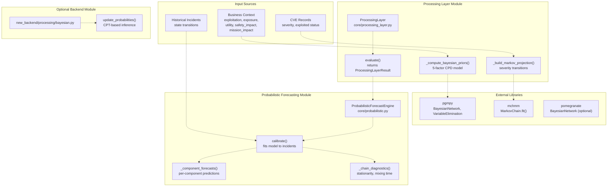
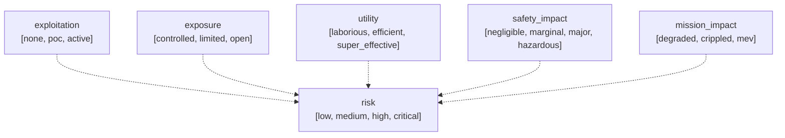
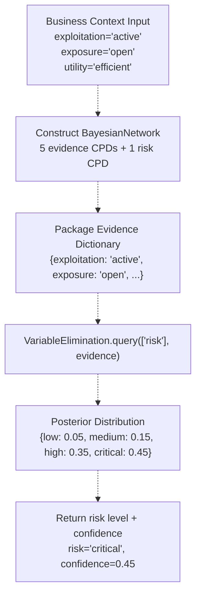
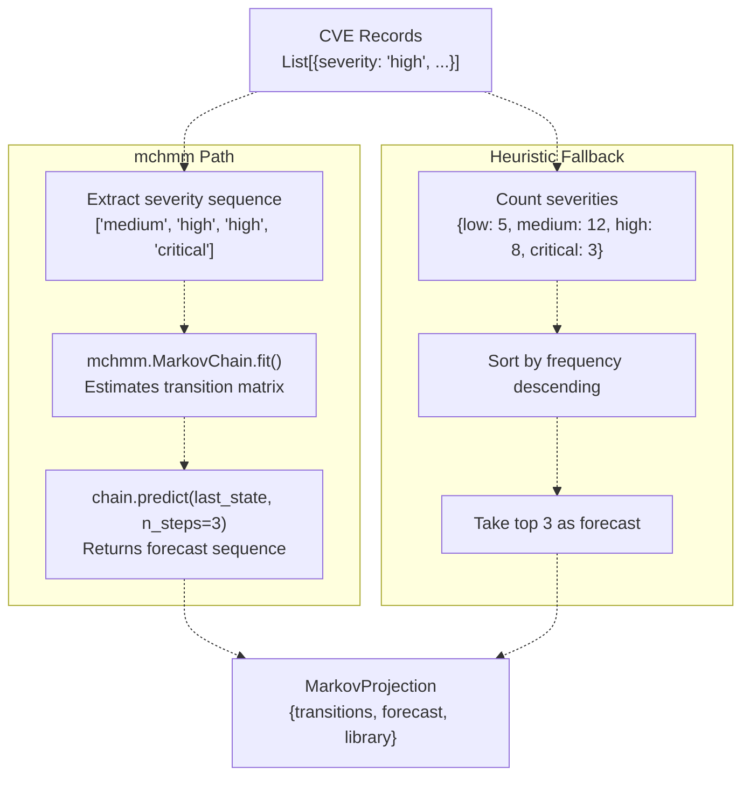
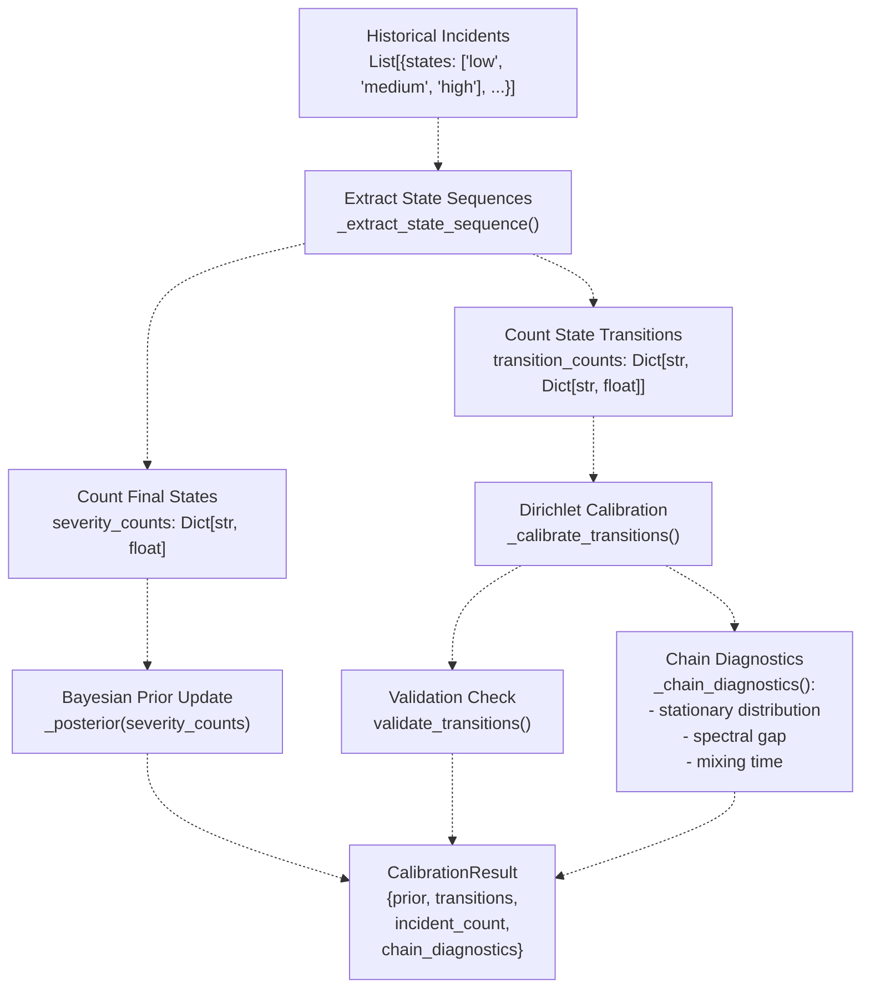
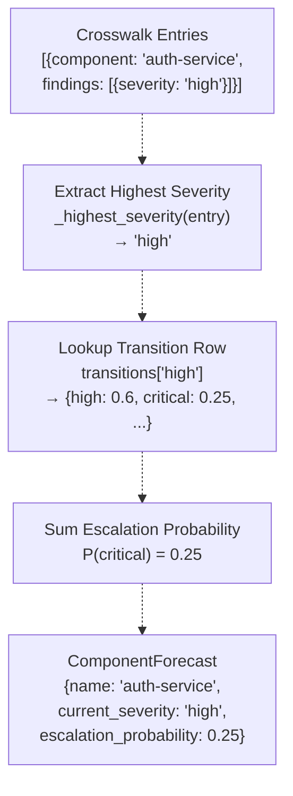
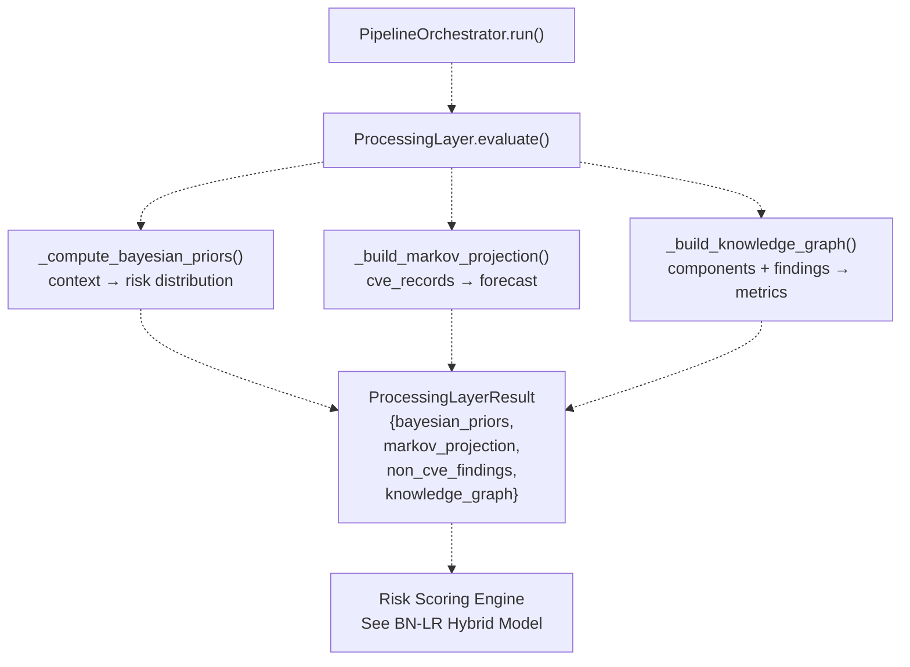

# Bayesian and Markov Models

> **Relevant source files**
> * [.github/workflows/ci.yml](https://github.com/DevOpsMadDog/Fixops/blob/ce6eb1e9/.github/workflows/ci.yml)
> * [.github/workflows/fixops-ci.yml](https://github.com/DevOpsMadDog/Fixops/blob/ce6eb1e9/.github/workflows/fixops-ci.yml)
> * [.github/workflows/qa.yml](https://github.com/DevOpsMadDog/Fixops/blob/ce6eb1e9/.github/workflows/qa.yml)
> * [apps/api/normalizers.py](https://github.com/DevOpsMadDog/Fixops/blob/ce6eb1e9/apps/api/normalizers.py)
> * [backend/__init__.py](https://github.com/DevOpsMadDog/Fixops/blob/ce6eb1e9/backend/__init__.py)
> * [backend/requirements-optional.txt](https://github.com/DevOpsMadDog/Fixops/blob/ce6eb1e9/backend/requirements-optional.txt)
> * [core/paths.py](https://github.com/DevOpsMadDog/Fixops/blob/ce6eb1e9/core/paths.py)
> * [core/policy.py](https://github.com/DevOpsMadDog/Fixops/blob/ce6eb1e9/core/policy.py)
> * [core/probabilistic.py](https://github.com/DevOpsMadDog/Fixops/blob/ce6eb1e9/core/probabilistic.py)
> * [core/processing_layer.py](https://github.com/DevOpsMadDog/Fixops/blob/ce6eb1e9/core/processing_layer.py)
> * [core/storage.py](https://github.com/DevOpsMadDog/Fixops/blob/ce6eb1e9/core/storage.py)
> * [new_backend/processing/__init__.py](https://github.com/DevOpsMadDog/Fixops/blob/ce6eb1e9/new_backend/processing/__init__.py)
> * [new_backend/processing/bayesian.py](https://github.com/DevOpsMadDog/Fixops/blob/ce6eb1e9/new_backend/processing/bayesian.py)
> * [new_backend/processing/explanation.py](https://github.com/DevOpsMadDog/Fixops/blob/ce6eb1e9/new_backend/processing/explanation.py)
> * [new_backend/processing/knowledge_graph.py](https://github.com/DevOpsMadDog/Fixops/blob/ce6eb1e9/new_backend/processing/knowledge_graph.py)
> * [new_backend/processing/sarif.py](https://github.com/DevOpsMadDog/Fixops/blob/ce6eb1e9/new_backend/processing/sarif.py)
> * [tests/test_file_size_limits.py](https://github.com/DevOpsMadDog/Fixops/blob/ce6eb1e9/tests/test_file_size_limits.py)
> * [tests/test_new_backend_processing.py](https://github.com/DevOpsMadDog/Fixops/blob/ce6eb1e9/tests/test_new_backend_processing.py)
> * [tests/test_pipeline_integration.py](https://github.com/DevOpsMadDog/Fixops/blob/ce6eb1e9/tests/test_pipeline_integration.py)
> * [tests/test_round2_fresh_apps.py](https://github.com/DevOpsMadDog/Fixops/blob/ce6eb1e9/tests/test_round2_fresh_apps.py)

## Purpose and Scope

This document describes the probabilistic modeling components used by FixOps to assess vulnerability risk and forecast severity progression. The Bayesian Network inference and Markov Chain modeling systems provide quantitative risk assessments that feed into the decision engine. For information about how these models integrate with risk scoring and exposure multipliers, see [BN-LR Hybrid Risk Model](/DevOpsMadDog/Fixops/5.2-bn-lr-hybrid-risk-model). For the broader processing pipeline that orchestrates these models, see [Processing Layer Internals](/DevOpsMadDog/Fixops/5.3-processing-layer-internals).

The Bayesian and Markov models operate on business context signals (exploitation status, exposure level, mission impact) and historical incident data to produce:

* **Bayesian priors**: Probability distributions over risk states given observed evidence
* **Markov projections**: Forecasted severity transitions based on historical state changes
* **Component forecasts**: Per-component escalation probabilities and next-state predictions

---

## System Architecture

The probabilistic models are implemented across two primary modules with distinct responsibilities:



**Sources:** [core/processing_layer.py L1-L461](https://github.com/DevOpsMadDog/Fixops/blob/ce6eb1e9/core/processing_layer.py#L1-L461)

 [core/probabilistic.py L1-L607](https://github.com/DevOpsMadDog/Fixops/blob/ce6eb1e9/core/probabilistic.py#L1-L607)

 [new_backend/processing/bayesian.py L1-L135](https://github.com/DevOpsMadDog/Fixops/blob/ce6eb1e9/new_backend/processing/bayesian.py#L1-L135)

---

## Bayesian Network Implementation

### Five-Factor Conditional Probability Distribution

The `ProcessingLayer._compute_bayesian_priors` method constructs a Bayesian Network with five evidence nodes that influence a single risk outcome node. The network models the conditional dependencies between business context factors and overall risk classification.



**Sources:** [core/processing_layer.py L110-L211](https://github.com/DevOpsMadDog/Fixops/blob/ce6eb1e9/core/processing_layer.py#L110-L211)

### Network Definition

The Bayesian Network uses pgmpy's `TabularCPD` to define prior probabilities for each evidence node and a joint conditional probability table for the risk node:

| Variable | States | Prior Distribution |
| --- | --- | --- |
| `exploitation` | none, poc, active | [0.6, 0.3, 0.1] |
| `exposure` | controlled, limited, open | [0.5, 0.3, 0.2] |
| `utility` | laborious, efficient, super_effective | [0.4, 0.4, 0.2] |
| `safety_impact` | negligible, marginal, major, hazardous | [0.5, 0.3, 0.15, 0.05] |
| `mission_impact` | degraded, crippled, mev | [0.5, 0.35, 0.15] |
| `risk` | low, medium, high, critical | Evidence-dependent (324 configurations) |

The risk node's CPD encodes `3 × 3 × 3 × 4 × 3 = 324` conditional probability distributions, one for each combination of parent states. The implementation uses a simplified uniform prior across these configurations: `[0.35, 0.3, 0.2, 0.15]` for `[low, medium, high, critical]`.

**Sources:** [core/processing_layer.py L126-L185](https://github.com/DevOpsMadDog/Fixops/blob/ce6eb1e9/core/processing_layer.py#L126-L185)

### Inference Process

The `VariableElimination` algorithm performs exact inference to compute posterior probabilities:



**Sources:** [core/processing_layer.py L186-L211](https://github.com/DevOpsMadDog/Fixops/blob/ce6eb1e9/core/processing_layer.py#L186-L211)

### Fallback Behavior

When pgmpy is unavailable or inference fails, the system returns deterministic defaults:

```json
{
    "exploitation": "none",
    "exposure": "controlled", 
    "utility": "efficient",
    "safety_impact": "negligible",
    "mission_impact": "degraded",
    "risk": "medium",
    "confidence": 0.5
}
```

**Sources:** [core/processing_layer.py L118-L119](https://github.com/DevOpsMadDog/Fixops/blob/ce6eb1e9/core/processing_layer.py#L118-L119)

---

## Markov Chain Modeling

### Severity Transition Matrices

The `ProcessingLayer._build_markov_projection` method constructs discrete-time Markov chains that model severity state transitions. The implementation supports two execution paths:

1. **mchmm-based modeling** (preferred): Fits a `MarkovChain` to observed severity sequences and generates multi-step forecasts
2. **Heuristic fallback**: Uses empirical frequency counts when mchmm is unavailable



**Sources:** [core/processing_layer.py L216-L251](https://github.com/DevOpsMadDog/Fixops/blob/ce6eb1e9/core/processing_layer.py#L216-L251)

### Transition Matrix Structure

For applications with sufficient historical data, mchmm estimates a stochastic matrix where each row sums to 1.0:

| From State | To: low | To: medium | To: high | To: critical |
| --- | --- | --- | --- | --- |
| low | 0.8 | 0.2 | 0.0 | 0.0 |
| medium | 0.1 | 0.6 | 0.3 | 0.0 |
| high | 0.0 | 0.15 | 0.6 | 0.25 |
| critical | 0.0 | 0.0 | 0.3 | 0.7 |

**Sources:** [core/processing_layer.py L222-L235](https://github.com/DevOpsMadDog/Fixops/blob/ce6eb1e9/core/processing_layer.py#L222-L235)

---

## Probabilistic Forecasting Engine

### Model Calibration

The `ProbabilisticForecastEngine` class in [core/probabilistic.py](https://github.com/DevOpsMadDog/Fixops/blob/ce6eb1e9/core/probabilistic.py)

 provides advanced capabilities for calibrating Bayesian priors and Markov transitions from historical incident data. The `calibrate` method implements Bayesian updating with Dirichlet priors.



**Sources:** [core/probabilistic.py L317-L372](https://github.com/DevOpsMadDog/Fixops/blob/ce6eb1e9/core/probabilistic.py#L317-L372)

### Dirichlet Prior Strength

The calibration process combines baseline transition probabilities (from `self.transitions`) with observed transition counts using a Dirichlet conjugate prior. The `dirichlet_strength` parameter controls the weight of the baseline model:

```
pseudocounts[target_state] = (
    baseline_weight * dirichlet_strength + 
    observed_count
)
```

Default `dirichlet_strength=6.0` provides moderate regularization, preventing overfitting to sparse incident data while allowing updates from strong evidence.

**Sources:** [core/probabilistic.py L284-L314](https://github.com/DevOpsMadDog/Fixops/blob/ce6eb1e9/core/probabilistic.py#L284-L314)

### Chain Diagnostics

The `_chain_diagnostics` method computes Markov chain properties to assess model quality:

| Metric | Description | Computation |
| --- | --- | --- |
| **Stationary Distribution** | Long-run state probabilities | Power iteration until convergence |
| **Second Eigenvalue** | Largest eigenvalue excluding 1.0 | Rayleigh iteration with deflation |
| **Spectral Gap** | Distance from 1.0 to second eigenvalue | `1.0 - abs(second_eigenvalue)` |
| **Mixing Time Upper Bound** | Steps to approximate stationarity | `log(1/(ε·π_min)) / spectral_gap` |

A larger spectral gap indicates faster convergence to the stationary distribution, meaning the chain "forgets" its initial state more quickly.

**Sources:** [core/probabilistic.py L541-L554](https://github.com/DevOpsMadDog/Fixops/blob/ce6eb1e9/core/probabilistic.py#L541-L554)

### Component-Level Forecasting

The `_component_forecasts` method generates per-component escalation predictions by:

1. Extracting the highest observed severity for each component from crosswalk entries
2. Looking up the component's current-state row in the transition matrix
3. Summing probabilities for all higher-severity target states
4. Sorting components by escalation probability descending



**Sources:** [core/probabilistic.py L556-L594](https://github.com/DevOpsMadDog/Fixops/blob/ce6eb1e9/core/probabilistic.py#L556-L594)

---

## Integration with Risk Scoring

The Processing Layer's `evaluate` method orchestrates Bayesian and Markov computations as part of the vulnerability analysis pipeline:



The `bayesian_priors` dictionary returned by `evaluate` typically includes:

* **Base factors**: `exploitation`, `exposure`, `utility`, `safety_impact`, `mission_impact`
* **Inferred risk**: `risk` (string: low/medium/high/critical)
* **Confidence score**: `confidence` (float: 0.0-1.0)
* **Full distribution**: `distribution` (optional, all risk state probabilities)

**Sources:** [core/processing_layer.py L75-L105](https://github.com/DevOpsMadDog/Fixops/blob/ce6eb1e9/core/processing_layer.py#L75-L105)

---

## Alternative Bayesian Implementation

The `new_backend/processing/bayesian.py` module provides a simpler, CPT-based inference engine that does not require pgmpy. This implementation is suitable for controlled environments where the network topology and conditional probability tables are fully specified in configuration.

### Update Probabilities Function

```python
def update_probabilities(
    components: List[Dict[str, Any]], 
    network: Dict[str, Any]
) -> Dict[str, Dict[str, float]]:
```

The function performs topological inference in three phases:

1. **Observed nodes**: Set probability to 1.0 for observed state, 0.0 for all others
2. **Root nodes** (no parents): Use prior probabilities from CPT
3. **Dependent nodes**: Compute posterior via `_compute_posterior` using parent distributions

**Sources:** [new_backend/processing/bayesian.py L8-L55](https://github.com/DevOpsMadDog/Fixops/blob/ce6eb1e9/new_backend/processing/bayesian.py#L8-L55)

### Conditional Probability Table Lookup

The `_compute_posterior` helper enumerates all parent state combinations and aggregates conditional probabilities weighted by parent posterior probabilities:

```
P(node=s) = Σ P(node=s | parents=p) · P(parents=p)
```

Where `P(parents=p)` is the product of individual parent posteriors for configuration `p`.

**Sources:** [new_backend/processing/bayesian.py L58-L105](https://github.com/DevOpsMadDog/Fixops/blob/ce6eb1e9/new_backend/processing/bayesian.py#L58-L105)

---

## Library Dependencies and Availability

The probabilistic modeling subsystem gracefully degrades when optional dependencies are unavailable:

| Library | Purpose | Fallback Behavior |
| --- | --- | --- |
| **pgmpy** | Bayesian Network inference | Return deterministic risk='medium', confidence=0.5 |
| **mchmm** | Markov Chain fitting and forecasting | Use heuristic frequency-based projections |
| **pomegranate** | Alternative Bayesian Network (unused) | Status tracked but not invoked |
| **networkx** | Knowledge graph metrics | Simplified fallback in `_build_knowledge_graph_fallback` |

The `ProcessingLayer.__init__` method checks library availability and stores boolean flags:

```
self.pgmpy_available = (BayesianNetwork is not None and VariableElimination is not None)
self.pomegranate_available = PomegranateBayes is not None
self.mchmm_available = mchmm is not None
self.networkx_available = nx is not None
```

These flags are returned in `ProcessingLayerResult.library_status` for observability and debugging.

**Sources:** [core/processing_layer.py L60-L70](https://github.com/DevOpsMadDog/Fixops/blob/ce6eb1e9/core/processing_layer.py#L60-L70)

 [core/processing_layer.py L93-L98](https://github.com/DevOpsMadDog/Fixops/blob/ce6eb1e9/core/processing_layer.py#L93-L98)

---

## Configuration Parameters

The `ProbabilisticForecastEngine` accepts configuration via the constructor:

```
ProbabilisticForecastEngine(settings: Optional[Mapping[str, Any]])
```

### Supported Settings

| Parameter | Type | Default | Description |
| --- | --- | --- | --- |
| `bayesian_prior` | Dict[str, float] | Uniform 0.25 | Prior probabilities for [low, medium, high, critical] |
| `markov_transitions` | Dict[str, Dict[str, float]] | Default transitions | State transition matrix |
| `component_limit` | int | 5 | Maximum components in forecast output |
| `escalate_from` | str | "medium" | Minimum severity threshold for escalation tracking |
| `dirichlet_strength` | float | 6.0 | Dirichlet prior pseudocount weight |
| `forecast_horizon` | int | 3 | Number of steps for multi-step forecast |
| `stationary_tolerance` | float | 1e-6 | Convergence threshold for power iteration |
| `mixing_tolerance` | float | 1e-3 | Epsilon for mixing time calculation |
| `max_iterations` | int | 96 | Maximum iterations for iterative algorithms |

**Sources:** [core/probabilistic.py L217-L245](https://github.com/DevOpsMadDog/Fixops/blob/ce6eb1e9/core/probabilistic.py#L217-L245)

---

## Testing and Validation

The test suite validates both core and alternative implementations:

### ProcessingLayer Tests

Tests verify that the pgmpy integration produces valid probability distributions and handles missing libraries gracefully.

**Sources:** [tests/test_round2_fresh_apps.py L361-L491](https://github.com/DevOpsMadDog/Fixops/blob/ce6eb1e9/tests/test_round2_fresh_apps.py#L361-L491)

### Bayesian Network Inference Tests

The `test_bayesian_network_inference_produces_posteriors` test case validates the CPT-based inference engine with a three-node network (Firewall → Database → Service) and confirms that:

* Observed nodes receive probability 1.0 for their observed state
* Dependent nodes compute correct posteriors via `_compute_posterior`
* Original component dictionaries remain unmodified

**Sources:** [tests/test_new_backend_processing.py L196-L240](https://github.com/DevOpsMadDog/Fixops/blob/ce6eb1e9/tests/test_new_backend_processing.py#L196-L240)

### Markov Chain Diagnostics Tests

Validation tests confirm that:

* Transition rows sum to 1.0 within tolerance (`abs(total - 1.0) <= 1e-3`)
* Invalid target states are detected and reported
* Spectral gap and mixing time calculations converge

**Sources:** [core/probabilistic.py L256-L282](https://github.com/DevOpsMadDog/Fixops/blob/ce6eb1e9/core/probabilistic.py#L256-L282)