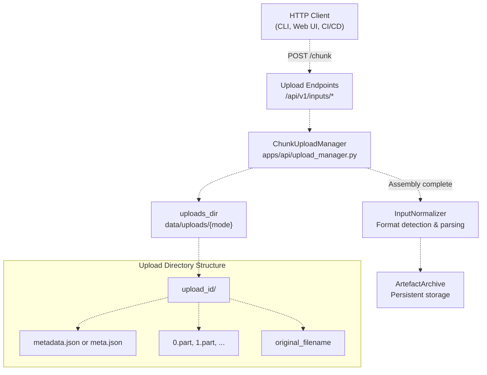
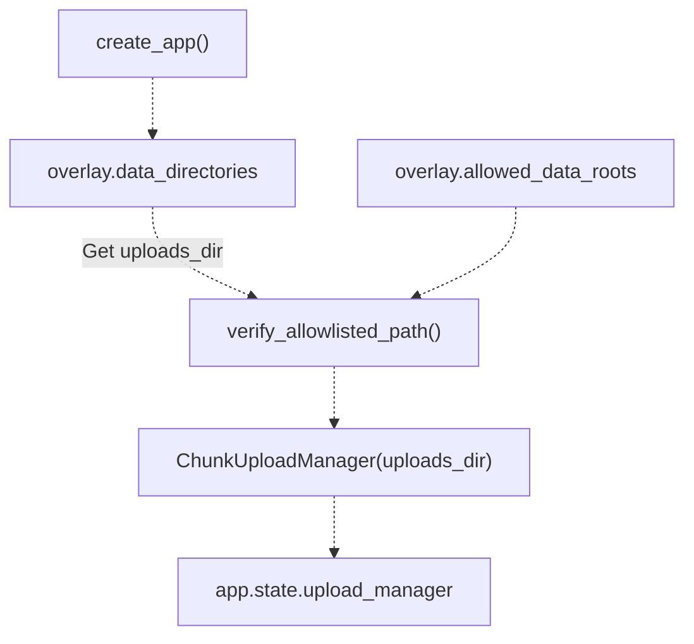
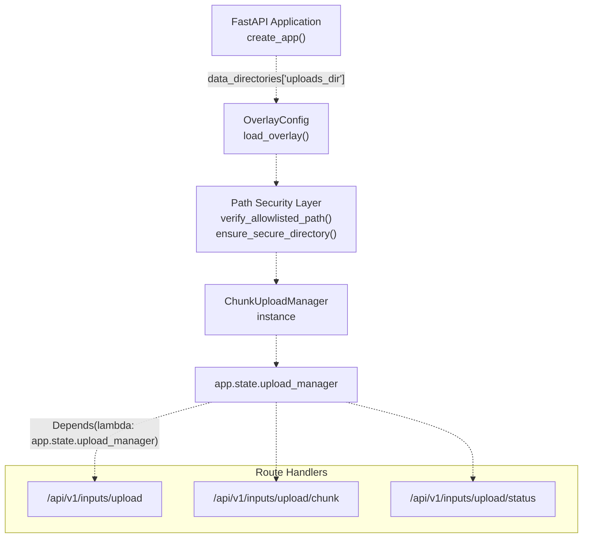
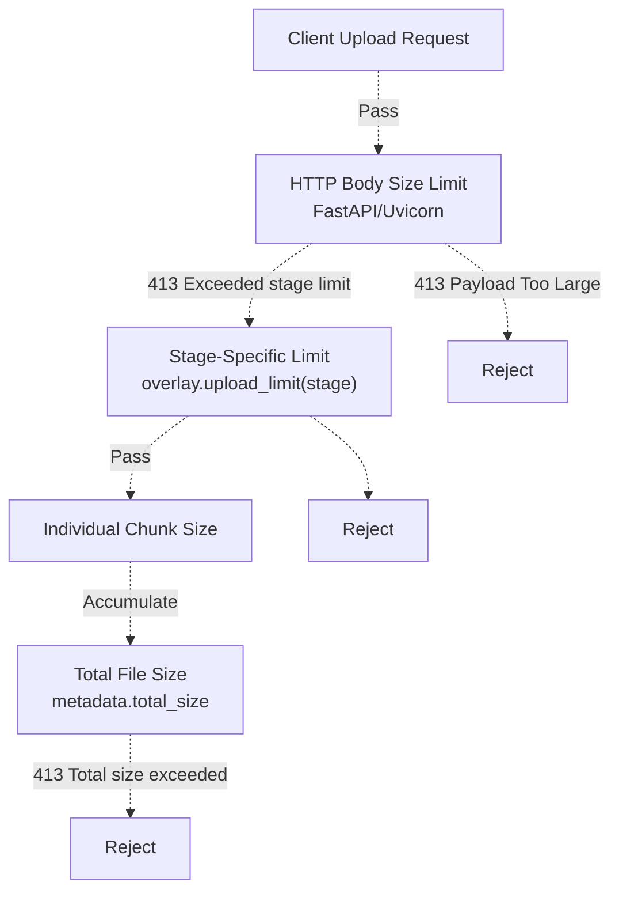
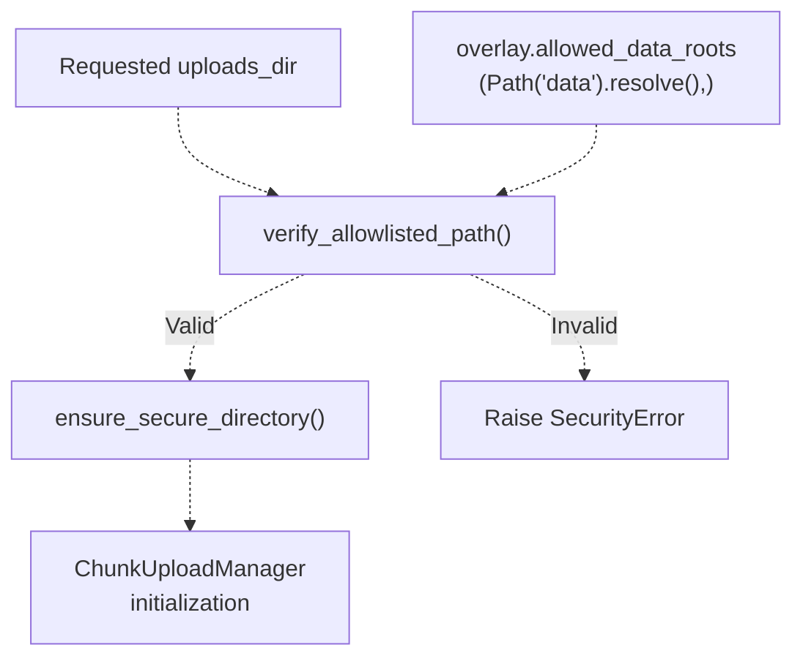
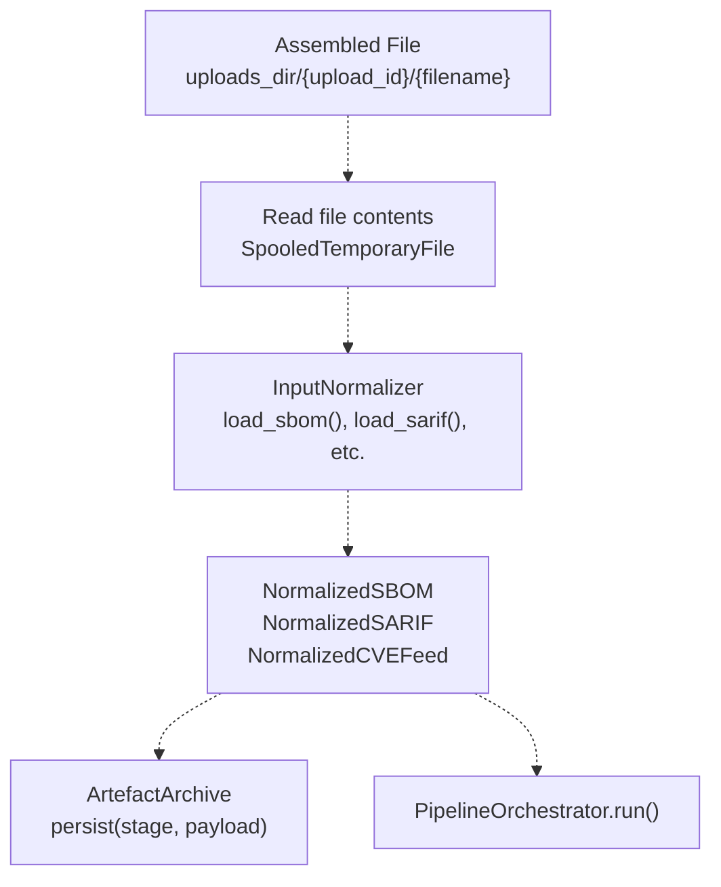

# Chunked Upload System

> **Relevant source files**
> * [apps/api/app.py](https://github.com/DevOpsMadDog/Fixops/blob/ce6eb1e9/apps/api/app.py)
> * [apps/api/ingestion.py](https://github.com/DevOpsMadDog/Fixops/blob/ce6eb1e9/apps/api/ingestion.py)
> * [config/normalizers/registry.yaml](https://github.com/DevOpsMadDog/Fixops/blob/ce6eb1e9/config/normalizers/registry.yaml)
> * [core/cli.py](https://github.com/DevOpsMadDog/Fixops/blob/ce6eb1e9/core/cli.py)
> * [core/micro_pentest.py](https://github.com/DevOpsMadDog/Fixops/blob/ce6eb1e9/core/micro_pentest.py)
> * [data/uploads/6c94680a-4934-447c-91bf-22ac1356a9e7/0.part](https://github.com/DevOpsMadDog/Fixops/blob/ce6eb1e9/data/uploads/6c94680a-4934-447c-91bf-22ac1356a9e7/0.part)
> * [data/uploads/6c94680a-4934-447c-91bf-22ac1356a9e7/meta.json](https://github.com/DevOpsMadDog/Fixops/blob/ce6eb1e9/data/uploads/6c94680a-4934-447c-91bf-22ac1356a9e7/meta.json)
> * [data/uploads/6c94680a-4934-447c-91bf-22ac1356a9e7/sample.json](https://github.com/DevOpsMadDog/Fixops/blob/ce6eb1e9/data/uploads/6c94680a-4934-447c-91bf-22ac1356a9e7/sample.json)
> * [data/uploads/upload_1759388274014/metadata.json](https://github.com/DevOpsMadDog/Fixops/blob/ce6eb1e9/data/uploads/upload_1759388274014/metadata.json)
> * [data/uploads/upload_1759388360124/metadata.json](https://github.com/DevOpsMadDog/Fixops/blob/ce6eb1e9/data/uploads/upload_1759388360124/metadata.json)
> * [tests/test_enterprise_services.py](https://github.com/DevOpsMadDog/Fixops/blob/ce6eb1e9/tests/test_enterprise_services.py)
> * [tests/test_ingestion.py](https://github.com/DevOpsMadDog/Fixops/blob/ce6eb1e9/tests/test_ingestion.py)
> * [tests/test_micro_pentest_cli.py](https://github.com/DevOpsMadDog/Fixops/blob/ce6eb1e9/tests/test_micro_pentest_cli.py)
> * [tests/test_micro_pentest_core.py](https://github.com/DevOpsMadDog/Fixops/blob/ce6eb1e9/tests/test_micro_pentest_core.py)
> * [tests/test_micro_pentest_router.py](https://github.com/DevOpsMadDog/Fixops/blob/ce6eb1e9/tests/test_micro_pentest_router.py)

## Purpose and Scope

The Chunked Upload System provides resumable, large-file upload capabilities for the FixOps data ingestion layer. It allows security artifacts (SBOM, SARIF, CVE feeds, VEX documents) to be uploaded in multiple chunks rather than as monolithic payloads, enabling reliable transmission of files exceeding standard HTTP request size limits.

This document covers the `ChunkUploadManager` class and its supporting infrastructure. For information about the HTTP endpoints that accept upload requests, see [Upload Endpoints](/DevOpsMadDog/Fixops/3.2-upload-endpoints). For information about how uploaded files are normalized after assembly, see [Input Normalization](/DevOpsMadDog/Fixops/3.4-input-normalization).

**Sources:** [apps/api/app.py L1-L20](https://github.com/DevOpsMadDog/Fixops/blob/ce6eb1e9/apps/api/app.py#L1-L20)

 [apps/api/app.py L461-L467](https://github.com/DevOpsMadDog/Fixops/blob/ce6eb1e9/apps/api/app.py#L461-L467)

---

## Architecture Overview

The chunked upload system operates as middleware between the FastAPI upload endpoints and the artifact storage layer. It manages upload sessions, assembles file chunks, and ensures data integrity through metadata tracking.



**Diagram: Chunked Upload System Architecture**

The system maintains upload state on disk, allowing interrupted uploads to resume without retransmitting previously received chunks. Each upload is assigned a unique identifier (UUID or timestamp-based) and receives its own isolated directory.

**Sources:** [apps/api/app.py L461-L467](https://github.com/DevOpsMadDog/Fixops/blob/ce6eb1e9/apps/api/app.py#L461-L467)

 [data/uploads/6c94680a-4934-447c-91bf-22ac1356a9e7/meta.json L1](https://github.com/DevOpsMadDog/Fixops/blob/ce6eb1e9/data/uploads/6c94680a-4934-447c-91bf-22ac1356a9e7/meta.json#L1-L1)

---

## ChunkUploadManager

The `ChunkUploadManager` class is the primary interface for chunk upload operations. It is instantiated during FastAPI application startup and stored in `app.state.upload_manager` for access by route handlers.

### Initialization



**Diagram: ChunkUploadManager Initialization Flow**

The manager is initialized with a base uploads directory that is validated against the configured `allowed_data_roots` allowlist. If no explicit `uploads_dir` is configured in the overlay, it defaults to `{root}/uploads/{mode}` where `mode` is either `demo` or `enterprise`.

**Sources:** [apps/api/app.py L461-L467](https://github.com/DevOpsMadDog/Fixops/blob/ce6eb1e9/apps/api/app.py#L461-L467)

 [apps/api/app.py L370-L373](https://github.com/DevOpsMadDog/Fixops/blob/ce6eb1e9/apps/api/app.py#L370-L373)

### Key Responsibilities

The `ChunkUploadManager` handles:

| Responsibility | Description |
| --- | --- |
| **Session Management** | Create and track upload sessions with unique identifiers |
| **Chunk Reception** | Accept and store individual file chunks with ordering |
| **Metadata Tracking** | Maintain upload state including expected size, chunks received |
| **Assembly** | Concatenate chunks into complete files when all parts received |
| **Cleanup** | Remove temporary chunks after successful assembly |
| **Resumability** | Enable clients to query upload status and resume interrupted uploads |

**Sources:** [data/uploads/upload_1759388360124/metadata.json L1](https://github.com/DevOpsMadDog/Fixops/blob/ce6eb1e9/data/uploads/upload_1759388360124/metadata.json#L1-L1)

---

## Upload Lifecycle

A chunked upload progresses through several distinct phases from initiation to completion.

```css
#mermaid-tyvs6qq2ks{font-family:ui-sans-serif,-apple-system,system-ui,Segoe UI,Helvetica;font-size:16px;fill:#333;}@keyframes edge-animation-frame{from{stroke-dashoffset:0;}}@keyframes dash{to{stroke-dashoffset:0;}}#mermaid-tyvs6qq2ks .edge-animation-slow{stroke-dasharray:9,5!important;stroke-dashoffset:900;animation:dash 50s linear infinite;stroke-linecap:round;}#mermaid-tyvs6qq2ks .edge-animation-fast{stroke-dasharray:9,5!important;stroke-dashoffset:900;animation:dash 20s linear infinite;stroke-linecap:round;}#mermaid-tyvs6qq2ks .error-icon{fill:#dddddd;}#mermaid-tyvs6qq2ks .error-text{fill:#222222;stroke:#222222;}#mermaid-tyvs6qq2ks .edge-thickness-normal{stroke-width:1px;}#mermaid-tyvs6qq2ks .edge-thickness-thick{stroke-width:3.5px;}#mermaid-tyvs6qq2ks .edge-pattern-solid{stroke-dasharray:0;}#mermaid-tyvs6qq2ks .edge-thickness-invisible{stroke-width:0;fill:none;}#mermaid-tyvs6qq2ks .edge-pattern-dashed{stroke-dasharray:3;}#mermaid-tyvs6qq2ks .edge-pattern-dotted{stroke-dasharray:2;}#mermaid-tyvs6qq2ks .marker{fill:#999;stroke:#999;}#mermaid-tyvs6qq2ks .marker.cross{stroke:#999;}#mermaid-tyvs6qq2ks svg{font-family:ui-sans-serif,-apple-system,system-ui,Segoe UI,Helvetica;font-size:16px;}#mermaid-tyvs6qq2ks p{margin:0;}#mermaid-tyvs6qq2ks defs #statediagram-barbEnd{fill:#999;stroke:#999;}#mermaid-tyvs6qq2ks g.stateGroup text{fill:#dddddd;stroke:none;font-size:10px;}#mermaid-tyvs6qq2ks g.stateGroup text{fill:#333;stroke:none;font-size:10px;}#mermaid-tyvs6qq2ks g.stateGroup .state-title{font-weight:bolder;fill:#333;}#mermaid-tyvs6qq2ks g.stateGroup rect{fill:#ffffff;stroke:#dddddd;}#mermaid-tyvs6qq2ks g.stateGroup line{stroke:#999;stroke-width:1;}#mermaid-tyvs6qq2ks .transition{stroke:#999;stroke-width:1;fill:none;}#mermaid-tyvs6qq2ks .stateGroup .composit{fill:#f4f4f4;border-bottom:1px;}#mermaid-tyvs6qq2ks .stateGroup .alt-composit{fill:#e0e0e0;border-bottom:1px;}#mermaid-tyvs6qq2ks .state-note{stroke:#e6d280;fill:#fff5ad;}#mermaid-tyvs6qq2ks .state-note text{fill:#333;stroke:none;font-size:10px;}#mermaid-tyvs6qq2ks .stateLabel .box{stroke:none;stroke-width:0;fill:#ffffff;opacity:0.5;}#mermaid-tyvs6qq2ks .edgeLabel .label rect{fill:#ffffff;opacity:0.5;}#mermaid-tyvs6qq2ks .edgeLabel{background-color:#ffffff;text-align:center;}#mermaid-tyvs6qq2ks .edgeLabel p{background-color:#ffffff;}#mermaid-tyvs6qq2ks .edgeLabel rect{opacity:0.5;background-color:#ffffff;fill:#ffffff;}#mermaid-tyvs6qq2ks .edgeLabel .label text{fill:#333;}#mermaid-tyvs6qq2ks .label div .edgeLabel{color:#333;}#mermaid-tyvs6qq2ks .stateLabel text{fill:#333;font-size:10px;font-weight:bold;}#mermaid-tyvs6qq2ks .node circle.state-start{fill:#999;stroke:#999;}#mermaid-tyvs6qq2ks .node .fork-join{fill:#999;stroke:#999;}#mermaid-tyvs6qq2ks .node circle.state-end{fill:#dddddd;stroke:#f4f4f4;stroke-width:1.5;}#mermaid-tyvs6qq2ks .end-state-inner{fill:#f4f4f4;stroke-width:1.5;}#mermaid-tyvs6qq2ks .node rect{fill:#ffffff;stroke:#dddddd;stroke-width:1px;}#mermaid-tyvs6qq2ks .node polygon{fill:#ffffff;stroke:#dddddd;stroke-width:1px;}#mermaid-tyvs6qq2ks #statediagram-barbEnd{fill:#999;}#mermaid-tyvs6qq2ks .statediagram-cluster rect{fill:#ffffff;stroke:#dddddd;stroke-width:1px;}#mermaid-tyvs6qq2ks .cluster-label,#mermaid-tyvs6qq2ks .nodeLabel{color:#333;}#mermaid-tyvs6qq2ks .statediagram-cluster rect.outer{rx:5px;ry:5px;}#mermaid-tyvs6qq2ks .statediagram-state .divider{stroke:#dddddd;}#mermaid-tyvs6qq2ks .statediagram-state .title-state{rx:5px;ry:5px;}#mermaid-tyvs6qq2ks .statediagram-cluster.statediagram-cluster .inner{fill:#f4f4f4;}#mermaid-tyvs6qq2ks .statediagram-cluster.statediagram-cluster-alt .inner{fill:#f8f8f8;}#mermaid-tyvs6qq2ks .statediagram-cluster .inner{rx:0;ry:0;}#mermaid-tyvs6qq2ks .statediagram-state rect.basic{rx:5px;ry:5px;}#mermaid-tyvs6qq2ks .statediagram-state rect.divider{stroke-dasharray:10,10;fill:#f8f8f8;}#mermaid-tyvs6qq2ks .note-edge{stroke-dasharray:5;}#mermaid-tyvs6qq2ks .statediagram-note rect{fill:#fff5ad;stroke:#e6d280;stroke-width:1px;rx:0;ry:0;}#mermaid-tyvs6qq2ks .statediagram-note rect{fill:#fff5ad;stroke:#e6d280;stroke-width:1px;rx:0;ry:0;}#mermaid-tyvs6qq2ks .statediagram-note text{fill:#333;}#mermaid-tyvs6qq2ks .statediagram-note .nodeLabel{color:#333;}#mermaid-tyvs6qq2ks .statediagram .edgeLabel{color:red;}#mermaid-tyvs6qq2ks #dependencyStart,#mermaid-tyvs6qq2ks #dependencyEnd{fill:#999;stroke:#999;stroke-width:1;}#mermaid-tyvs6qq2ks .statediagramTitleText{text-anchor:middle;font-size:18px;fill:#333;}#mermaid-tyvs6qq2ks :root{--mermaid-font-family:"trebuchet ms",verdana,arial,sans-serif;}Client creates upload sessionFirst chunk arrivesAdditional chunksAll chunks receivedFile assembled successfullyAssembly errorInitiatedReceivingChunksAssemblingCompletedFailedmetadata.json createdupload_id assignedchunks_received = 0Chunks stored as 0.part, 1.part, etc.chunks_received incrementedResumable if interruptedChunks concatenated in orderOriginal filename restoredTemporary .part files removed
```

**Diagram: Upload Session State Machine**

### Phase Details

**Initiation Phase:**

* Client sends metadata: `file_name`, `total_size`, `scan_type`, `service_name`, `environment`
* System generates `upload_id` (UUID or timestamp-based format like `upload_1759388360124`)
* Creates upload directory: `{uploads_dir}/{upload_id}/`
* Writes `metadata.json` with initial state

**Chunk Reception Phase:**

* Client sends chunks with sequence numbers (0, 1, 2, ...)
* System writes each chunk to `{upload_id}/{sequence}.part`
* Updates `chunks_received` counter in metadata
* Validates chunk size against expected `total_size`

**Assembly Phase:**

* Triggered when `chunks_received` matches expected chunk count
* Reads chunks in sequential order
* Concatenates into single file with original `file_name`
* Verifies assembled size matches `total_size`
* Deletes `.part` files to reclaim space

**Sources:** [data/uploads/6c94680a-4934-447c-91bf-22ac1356a9e7/0.part L1](https://github.com/DevOpsMadDog/Fixops/blob/ce6eb1e9/data/uploads/6c94680a-4934-447c-91bf-22ac1356a9e7/0.part#L1-L1)

 [data/uploads/6c94680a-4934-447c-91bf-22ac1356a9e7/sample.json L1](https://github.com/DevOpsMadDog/Fixops/blob/ce6eb1e9/data/uploads/6c94680a-4934-447c-91bf-22ac1356a9e7/sample.json#L1-L1)

---

## Storage Structure

The chunked upload system organizes files on disk following a predictable hierarchy that enables both human inspection and programmatic access.

### Directory Layout

```markdown
data/
└── uploads/
    └── {mode}/                                    # demo or enterprise
        ├── upload_1759388360124/                  # Timestamp-based ID
        │   ├── metadata.json
        │   ├── 0.part
        │   ├── 1.part
        │   └── sample.json                        # Assembled file
        │
        └── 6c94680a-4934-447c-91bf-22ac1356a9e7/  # UUID-based ID
            ├── meta.json
            ├── 0.part
            └── sample.json
```

### Upload Directory Contents

Each upload directory contains:

| File | Purpose | Lifecycle |
| --- | --- | --- |
| `metadata.json` or `meta.json` | Upload session state and configuration | Created on initiation, updated during reception |
| `{N}.part` | Individual file chunks, zero-indexed | Created as chunks arrive, deleted after assembly |
| `{original_filename}` | Assembled complete file | Created after successful assembly |

The system supports both `metadata.json` (newer format) and `meta.json` (legacy format) for backward compatibility. Both contain the same essential information but may use slightly different field names.

**Sources:** [data/uploads/upload_1759388360124/metadata.json L1](https://github.com/DevOpsMadDog/Fixops/blob/ce6eb1e9/data/uploads/upload_1759388360124/metadata.json#L1-L1)

 [data/uploads/6c94680a-4934-447c-91bf-22ac1356a9e7/meta.json L1](https://github.com/DevOpsMadDog/Fixops/blob/ce6eb1e9/data/uploads/6c94680a-4934-447c-91bf-22ac1356a9e7/meta.json#L1-L1)

---

## Metadata Schema

Upload metadata tracks session state and configuration parameters needed for chunk assembly and downstream processing.

### Standard Metadata Format

```json
{
  "upload_id": "upload_1759388360124",
  "file_name": "sample.json",
  "total_size": 130,
  "scan_type": "json",
  "service_name": "svc",
  "environment": "production",
  "chunks_received": 0,
  "created_at": "2025-10-02T06:59:20.124602+00:00"
}
```

### Field Definitions

| Field | Type | Description | Required |
| --- | --- | --- | --- |
| `upload_id` | string | Unique identifier for this upload session | Yes |
| `file_name` | string | Original filename, preserved for assembly | Yes |
| `total_size` | integer | Expected final file size in bytes | Yes |
| `scan_type` | string | Format hint (json, sarif, cyclonedx, etc.) | No |
| `service_name` | string | Originating service or component name | No |
| `environment` | string | Deployment environment (production, staging, etc.) | No |
| `chunks_received` | integer | Count of successfully received chunks | Yes |
| `created_at` | string/float | ISO 8601 timestamp or Unix epoch | Yes |

### Legacy Format

The legacy `meta.json` format uses slightly different conventions:

```json
{
  "upload_id": "6c94680a-4934-447c-91bf-22ac1356a9e7",
  "file_name": "sample.json",
  "total_size": 130,
  "scan_type": "json",
  "service_name": "svc",
  "environment": "production",
  "created_at": 1759272374.7531333,
  "chunks": 1
}
```

Differences:

* `chunks` instead of `chunks_received` (indicates expected chunk count vs. received count)
* `created_at` as Unix epoch float instead of ISO 8601 string
* Omits timezone information

**Sources:** [data/uploads/upload_1759388360124/metadata.json L1](https://github.com/DevOpsMadDog/Fixops/blob/ce6eb1e9/data/uploads/upload_1759388360124/metadata.json#L1-L1)

 [data/uploads/6c94680a-4934-447c-91bf-22ac1356a9e7/meta.json L1](https://github.com/DevOpsMadDog/Fixops/blob/ce6eb1e9/data/uploads/6c94680a-4934-447c-91bf-22ac1356a9e7/meta.json#L1-L1)

---

## Integration with FastAPI Application

The chunked upload system integrates with the FastAPI application through the state management system, making the upload manager available to all route handlers.



**Diagram: FastAPI Integration Pattern**

### Application Startup Sequence

The initialization occurs in `create_app()`:

1. Load overlay configuration via `load_overlay()`
2. Extract `uploads_dir` from `overlay.data_directories` or compute default
3. Validate path against `overlay.allowed_data_roots` allowlist
4. Create `uploads_dir` if it doesn't exist with secure permissions
5. Instantiate `ChunkUploadManager(uploads_dir)`
6. Store manager in `app.state.upload_manager`

This pattern ensures the upload manager is available throughout the application lifecycle and route handlers can access it via dependency injection or direct state access.

**Sources:** [apps/api/app.py L461-L467](https://github.com/DevOpsMadDog/Fixops/blob/ce6eb1e9/apps/api/app.py#L461-L467)

 [apps/api/app.py L370-L373](https://github.com/DevOpsMadDog/Fixops/blob/ce6eb1e9/apps/api/app.py#L370-L373)

---

## Size Limits and Configuration

The system enforces configurable size limits to prevent resource exhaustion and abuse. These limits are applied at multiple layers.

### Upload Limit Hierarchy



**Diagram: Size Limit Enforcement Layers**

### Default Limits

The system defines default chunk and file size limits:

| Limit | Value | Location |
| --- | --- | --- |
| `_CHUNK_SIZE` | 1 MB (1024 × 1024) | Used for buffering during read operations |
| `_RAW_BYTES_THRESHOLD` | 4 MB | Threshold for materializing chunks in memory |
| Stage-specific limits | Configurable per input type | Retrieved via `overlay.upload_limit(stage)` |

The `_read_limited()` function enforces per-stage limits:

```python
async def _read_limited(file: UploadFile, stage: str) -> Tuple[SpooledTemporaryFile, int]:
    limit = overlay.upload_limit(stage)
    # Reads up to limit bytes, raises HTTPException 413 if exceeded
```

**Sources:** [apps/api/app.py L593-L628](https://github.com/DevOpsMadDog/Fixops/blob/ce6eb1e9/apps/api/app.py#L593-L628)

---

## Security Considerations

The chunked upload system implements multiple security controls to prevent common attack vectors.

### Path Traversal Prevention

All upload directories must be validated against the configured allowlist:



**Diagram: Path Security Validation Flow**

The system uses hardcoded trusted roots (e.g., `/var/fixops` in production) and performs three-stage validation to prevent path traversal attacks. This ensures upload directories cannot escape the allowed data roots.

### Content-Type Validation

Upload endpoints validate the `Content-Type` header:

```python
def _validate_content_type(file: UploadFile, expected: tuple[str, ...]) -> None:
    if file.content_type and file.content_type not in expected:
        raise HTTPException(status_code=415, detail={
            "message": "Unsupported content type",
            "received": file.content_type,
            "expected": list(expected),
        })
```

This prevents attackers from uploading malicious files disguised as legitimate security artifacts.

### Size-Based Protections

The multi-layer size limit enforcement prevents:

* **Resource Exhaustion:** Limits prevent disk space exhaustion
* **Memory DoS:** `SpooledTemporaryFile` with `max_size` parameter prevents unbounded memory allocation
* **Slow Upload DoS:** Timeout mechanisms (implied by FastAPI/Uvicorn configuration) limit connection duration

**Sources:** [apps/api/app.py L370-L373](https://github.com/DevOpsMadDog/Fixops/blob/ce6eb1e9/apps/api/app.py#L370-L373)

 [apps/api/app.py L596-L628](https://github.com/DevOpsMadDog/Fixops/blob/ce6eb1e9/apps/api/app.py#L596-L628)

 [apps/api/app.py L643-L652](https://github.com/DevOpsMadDog/Fixops/blob/ce6eb1e9/apps/api/app.py#L643-L652)

---

## Error Handling and Cleanup

The system implements comprehensive error handling to ensure failed uploads don't leave orphaned resources.

### Error Scenarios

| Scenario | Detection | Handling |
| --- | --- | --- |
| **Oversized chunk** | During `_read_limited()` | Raise 413, close buffer, return error response |
| **Missing chunks** | Before assembly | Keep session open for retry, track expected vs. received |
| **Assembly failure** | During concatenation | Mark upload as failed, preserve chunks for inspection |
| **Disk space exhaustion** | OS-level errors during write | Propagate exception, cleanup via context managers |
| **Invalid metadata** | JSON parse errors | Raise 400, log error details |

### Resource Cleanup Pattern

The system uses context managers and try-finally blocks to ensure cleanup:

```yaml
try:
    buffer = SpooledTemporaryFile(max_size=_CHUNK_SIZE, mode="w+b")
    # ... process upload ...
except HTTPException:
    raise
except Exception:
    buffer.close()
    raise
```

This pattern ensures that:

* Temporary buffers are closed even on exceptions
* File descriptors are not leaked
* Disk space is reclaimed promptly

### Persistence Strategy

Upload state is persisted to disk (`metadata.json`) after each chunk reception, allowing:

* Resume after server restart
* Inspection of failed uploads
* Manual recovery by operators

Failed uploads remain on disk until explicitly cleaned by operators or automated retention policies, enabling forensic analysis of upload failures.

**Sources:** [apps/api/app.py L596-L628](https://github.com/DevOpsMadDog/Fixops/blob/ce6eb1e9/apps/api/app.py#L596-L628)

---

## Interaction with Normalization Pipeline

Once chunk assembly completes, the upload system hands off to the normalization pipeline for format detection and parsing.



**Diagram: Handoff to Normalization Pipeline**

### Integration Flow

1. **Assembly Completion:** Upload manager signals that all chunks have been assembled
2. **File Reading:** Contents read into `SpooledTemporaryFile` or byte buffer
3. **Format Detection:** `InputNormalizer` examines content structure and metadata hints
4. **Parsing:** Appropriate normalizer method called based on detected format
5. **Storage:** Raw bytes and normalized payload persisted to `ArtefactArchive`
6. **Processing:** Normalized payload enters the main pipeline for correlation and analysis

The `scan_type` metadata field serves as a format hint to accelerate detection, but is not trusted as the sole source of truth. The normalizer always validates actual content structure.

**Sources:** [apps/api/app.py L342-L343](https://github.com/DevOpsMadDog/Fixops/blob/ce6eb1e9/apps/api/app.py#L342-L343)

 [apps/api/app.py L741-L812](https://github.com/DevOpsMadDog/Fixops/blob/ce6eb1e9/apps/api/app.py#L741-L812)

---

## Cleanup and Retention

The chunked upload system requires periodic cleanup to prevent disk space exhaustion from completed or abandoned uploads.

### Cleanup Strategies

**Post-Assembly Cleanup:**

* Temporary `.part` files deleted immediately after successful assembly
* Assembled file may be retained briefly for retransmission on error
* Upload directory removed after successful handoff to archive

**Abandoned Upload Cleanup:**

* Uploads with no activity for configurable period (e.g., 24 hours) marked stale
* Periodic cleanup job removes stale uploads and their metadata
* Operators notified of cleanup actions via structured logging

**Archive Integration:**
The `ArtefactArchive` system maintains long-term storage with its own retention policies, independent of the temporary upload storage. See the Archive implementation for details on retention and compliance requirements.

**Sources:** [apps/api/app.py L375-L381](https://github.com/DevOpsMadDog/Fixops/blob/ce6eb1e9/apps/api/app.py#L375-L381)

 [apps/api/app.py L654-L675](https://github.com/DevOpsMadDog/Fixops/blob/ce6eb1e9/apps/api/app.py#L654-L675)