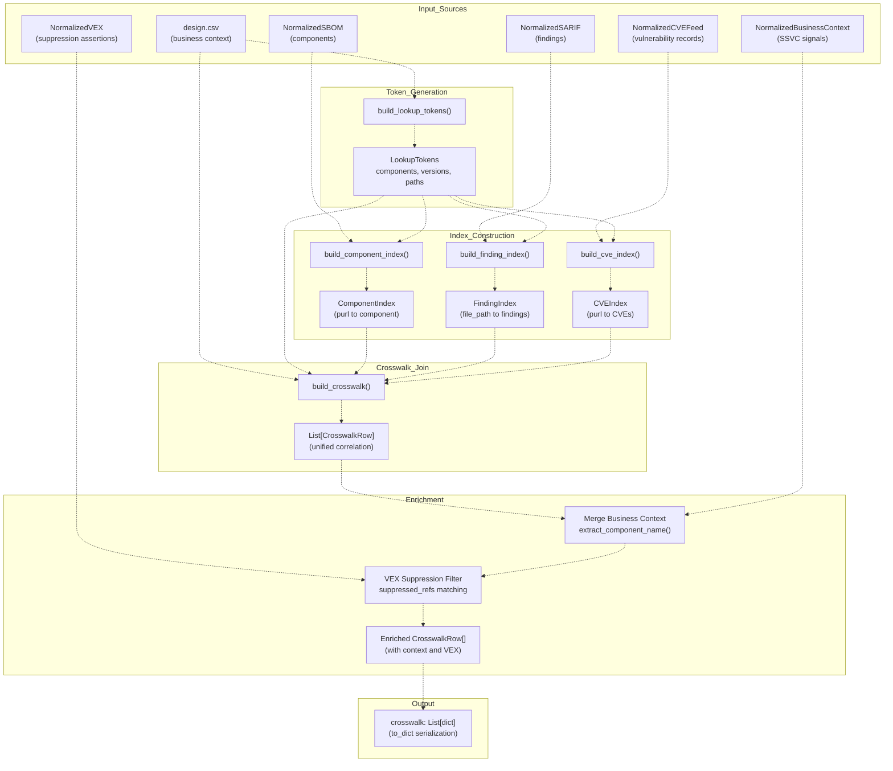
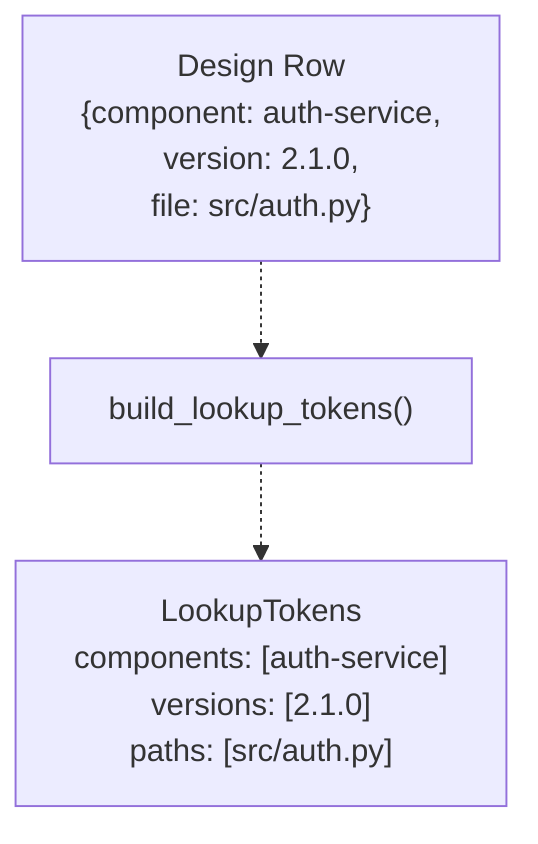
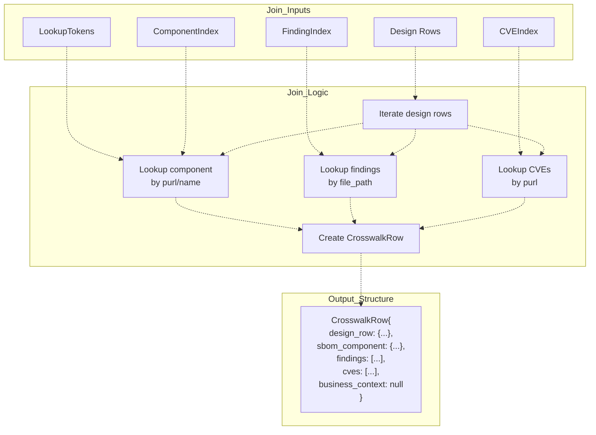
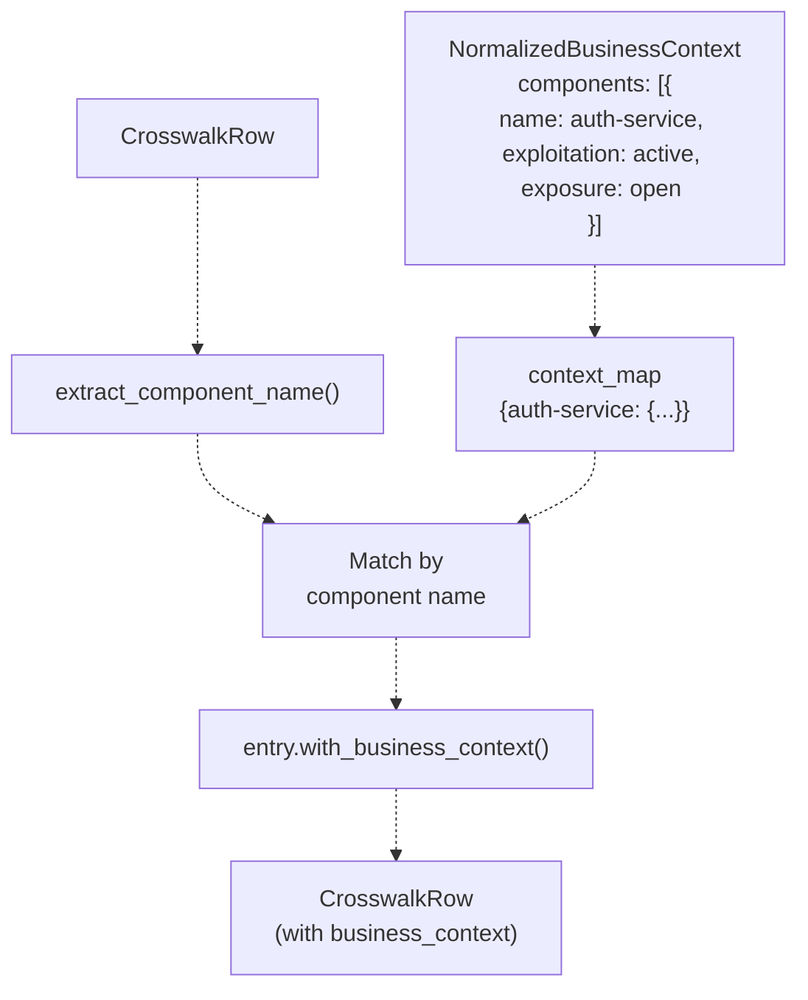
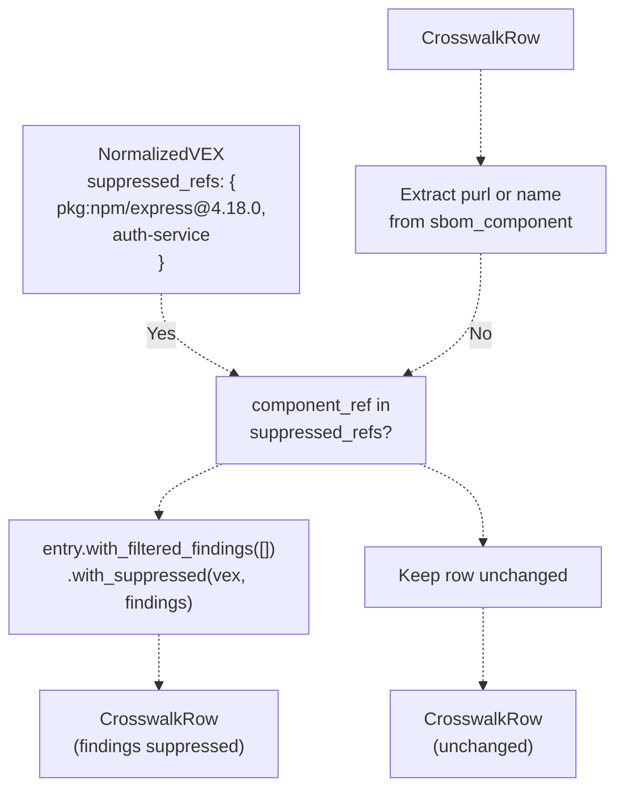
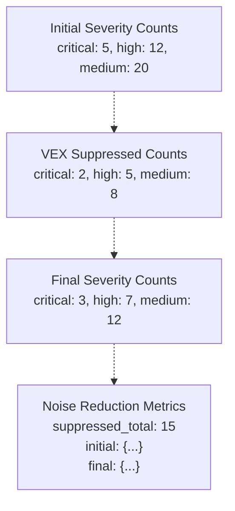
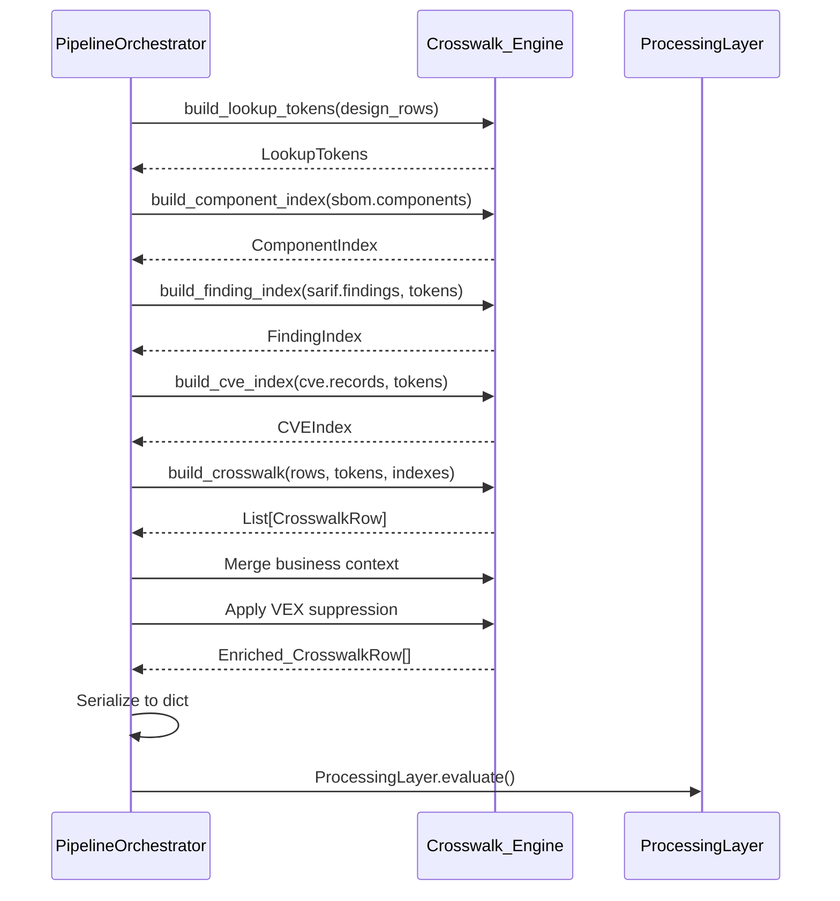

# Crosswalk Correlation Engine

> **Relevant source files**
> * [.github/workflows/ci.yml](https://github.com/DevOpsMadDog/Fixops/blob/ce6eb1e9/.github/workflows/ci.yml)
> * [.github/workflows/fixops-ci.yml](https://github.com/DevOpsMadDog/Fixops/blob/ce6eb1e9/.github/workflows/fixops-ci.yml)
> * [.github/workflows/qa.yml](https://github.com/DevOpsMadDog/Fixops/blob/ce6eb1e9/.github/workflows/qa.yml)
> * [apps/api/bulk_router.py](https://github.com/DevOpsMadDog/Fixops/blob/ce6eb1e9/apps/api/bulk_router.py)
> * [apps/api/collaboration_router.py](https://github.com/DevOpsMadDog/Fixops/blob/ce6eb1e9/apps/api/collaboration_router.py)
> * [apps/api/deduplication_router.py](https://github.com/DevOpsMadDog/Fixops/blob/ce6eb1e9/apps/api/deduplication_router.py)
> * [apps/api/integrations_router.py](https://github.com/DevOpsMadDog/Fixops/blob/ce6eb1e9/apps/api/integrations_router.py)
> * [apps/api/normalizers.py](https://github.com/DevOpsMadDog/Fixops/blob/ce6eb1e9/apps/api/normalizers.py)
> * [apps/api/pipeline.py](https://github.com/DevOpsMadDog/Fixops/blob/ce6eb1e9/apps/api/pipeline.py)
> * [apps/api/remediation_router.py](https://github.com/DevOpsMadDog/Fixops/blob/ce6eb1e9/apps/api/remediation_router.py)
> * [apps/api/webhooks_router.py](https://github.com/DevOpsMadDog/Fixops/blob/ce6eb1e9/apps/api/webhooks_router.py)
> * [core/adapters.py](https://github.com/DevOpsMadDog/Fixops/blob/ce6eb1e9/core/adapters.py)
> * [core/connectors.py](https://github.com/DevOpsMadDog/Fixops/blob/ce6eb1e9/core/connectors.py)
> * [core/paths.py](https://github.com/DevOpsMadDog/Fixops/blob/ce6eb1e9/core/paths.py)
> * [core/policy.py](https://github.com/DevOpsMadDog/Fixops/blob/ce6eb1e9/core/policy.py)
> * [core/processing_layer.py](https://github.com/DevOpsMadDog/Fixops/blob/ce6eb1e9/core/processing_layer.py)
> * [core/services/collaboration.py](https://github.com/DevOpsMadDog/Fixops/blob/ce6eb1e9/core/services/collaboration.py)
> * [core/services/deduplication.py](https://github.com/DevOpsMadDog/Fixops/blob/ce6eb1e9/core/services/deduplication.py)
> * [core/services/identity.py](https://github.com/DevOpsMadDog/Fixops/blob/ce6eb1e9/core/services/identity.py)
> * [core/services/remediation.py](https://github.com/DevOpsMadDog/Fixops/blob/ce6eb1e9/core/services/remediation.py)
> * [core/storage.py](https://github.com/DevOpsMadDog/Fixops/blob/ce6eb1e9/core/storage.py)
> * [fixops-enterprise/src/services/feeds_service.py](https://github.com/DevOpsMadDog/Fixops/blob/ce6eb1e9/fixops-enterprise/src/services/feeds_service.py)
> * [fixops-enterprise/src/services/vex_ingestion.py](https://github.com/DevOpsMadDog/Fixops/blob/ce6eb1e9/fixops-enterprise/src/services/vex_ingestion.py)
> * [tests/test_file_size_limits.py](https://github.com/DevOpsMadDog/Fixops/blob/ce6eb1e9/tests/test_file_size_limits.py)
> * [tests/test_pipeline_integration.py](https://github.com/DevOpsMadDog/Fixops/blob/ce6eb1e9/tests/test_pipeline_integration.py)
> * [tests/test_round2_fresh_apps.py](https://github.com/DevOpsMadDog/Fixops/blob/ce6eb1e9/tests/test_round2_fresh_apps.py)

## Purpose and Scope

The Crosswalk Correlation Engine correlates security findings from multiple data sources into unified `CrosswalkRow` entries. It performs many-to-many joins across:

* Design context (business-critical components from design.csv)
* SBOM components (CycloneDX/SPDX package inventories)
* SARIF findings (SAST/scanner results)
* CVE records (vulnerability data)
* VEX assertions (vendor exploitability assessments)
* CNAPP findings (cloud security posture)
* Business context (SSVC signals, exposure metadata)

This correlation enables deduplication, noise reduction via VEX suppression, and enrichment of findings with business context. The engine operates as Stage 3 in the data flow pipeline, consuming normalized inputs and producing correlated data for downstream processing.

For information about normalizing inputs before correlation, see [Input Normalization](/DevOpsMadDog/Fixops/3.4-input-normalization). For deduplication and clustering of correlated findings, see [Deduplication Service](/DevOpsMadDog/Fixops/3.5-crosswalk-correlation-engine). For decision-making that consumes crosswalk data, see [Decision Engine](/DevOpsMadDog/Fixops/4-decision-engine).

## Architecture Overview



Sources: [apps/api/pipeline.py L656-L782](https://github.com/DevOpsMadDog/Fixops/blob/ce6eb1e9/apps/api/pipeline.py#L656-L782)

## Data Flow Stages

### Stage 1: Lookup Token Generation

The engine extracts lookup tokens from design context CSV rows to create searchable indexes of component names, versions, and file paths.



The `build_lookup_tokens()` function parses each design row and extracts searchable identifiers. The `extract_component_name()` utility handles name extraction from various row formats.

Sources: [apps/api/pipeline.py L656-L657](https://github.com/DevOpsMadDog/Fixops/blob/ce6eb1e9/apps/api/pipeline.py#L656-L657)

 [services/match/utils.py L43-L44](https://github.com/DevOpsMadDog/Fixops/blob/ce6eb1e9/services/match/utils.py#L43-L44)

### Stage 2: Index Construction

Three parallel indexes enable efficient O(1) correlation lookups:

| Index Type | Function | Key | Value |
| --- | --- | --- | --- |
| ComponentIndex | `build_component_index()` | Package URL (purl) | SBOMComponent |
| FindingIndex | `build_finding_index()` | file_path | List[SarifFinding] |
| CVEIndex | `build_cve_index()` | Package URL (purl) | List[CVERecordSummary] |

**Component Index Example**:

```css
component_index = build_component_index(sbom.components)
# Creates: {"pkg:npm/express@4.18.0": SBOMComponent(...)}
```

**Finding Index Example**:

```css
finding_matches = build_finding_index(sarif.findings, lookup_tokens)
# Creates: {"src/auth.py": [SarifFinding(...), SarifFinding(...)]}
```

**CVE Index Example**:

```css
cve_matches = build_cve_index(cve.records, lookup_tokens)
# Creates: {"pkg:npm/express@4.18.0": [CVERecordSummary(...), ...]}
```

Sources: [apps/api/pipeline.py L658-L660](https://github.com/DevOpsMadDog/Fixops/blob/ce6eb1e9/apps/api/pipeline.py#L658-L660)

 [services/match/indexes.py L37-L41](https://github.com/DevOpsMadDog/Fixops/blob/ce6eb1e9/services/match/indexes.py#L37-L41)

### Stage 3: Crosswalk Join

The `build_crosswalk()` function performs a many-to-many join across all data sources:



Each `CrosswalkRow` contains correlated data from all sources. Missing data results in `None` values or empty lists rather than errors.

Sources: [apps/api/pipeline.py L661-L667](https://github.com/DevOpsMadDog/Fixops/blob/ce6eb1e9/apps/api/pipeline.py#L661-L667)

 [services/match/join.py L42](https://github.com/DevOpsMadDog/Fixops/blob/ce6eb1e9/services/match/join.py#L42-L42)

### Stage 4: Business Context Enrichment

Business context from `NormalizedBusinessContext` is merged by component name:



**Matching Logic**:

1. Build a map of component names to business context (`context_map`)
2. For each `CrosswalkRow`, extract component name from `design_row`
3. Look up component name (case-insensitive) in context map
4. Call `entry.with_business_context(context_map[key])` to attach SSVC signals

Sources: [apps/api/pipeline.py L708-L730](https://github.com/DevOpsMadDog/Fixops/blob/ce6eb1e9/apps/api/pipeline.py#L708-L730)

### Stage 5: VEX Suppression Filtering

VEX (Vulnerability Exploitability eXchange) assertions suppress findings for components marked as `not_affected`:



**Suppression Algorithm**:

1. VEX assertions with `status: not_affected` populate `suppressed_refs` set
2. For each `CrosswalkRow`, extract `purl` or `name` from `sbom_component`
3. If component ref is in `suppressed_refs`, move findings to `suppressed` field
4. Count suppressed findings by severity for noise reduction metrics

Sources: [apps/api/pipeline.py L735-L780](https://github.com/DevOpsMadDog/Fixops/blob/ce6eb1e9/apps/api/pipeline.py#L735-L780)

 [apps/api/normalizers.py L428-L434](https://github.com/DevOpsMadDog/Fixops/blob/ce6eb1e9/apps/api/normalizers.py#L428-L434)

## CrosswalkRow Domain Model

The `CrosswalkRow` data class represents a unified correlation entry:

| Field | Type | Description |
| --- | --- | --- |
| `design_row` | Mapping | Original design context row (component name, version, file paths) |
| `sbom_component` | Mapping \| None | Matched SBOM component with purl, licenses, supplier |
| `findings` | List[Mapping] | Active SARIF findings for this component |
| `cves` | List[Mapping] | CVE records affecting this component |
| `business_context` | Mapping \| None | SSVC signals (exploitation, exposure, safety_impact, mission_impact) |
| `suppressed` | List[Mapping] | VEX-suppressed findings (moved from `findings`) |

**Immutability Pattern**: The `with_*` methods return new `CrosswalkRow` instances:

```
enriched = (crosswalk_row
    .with_business_context({"exploitation": "active"})
    .with_suppressed("vex", suppressed_findings))
```

Sources: [apps/api/pipeline.py L727-L729](https://github.com/DevOpsMadDog/Fixops/blob/ce6eb1e9/apps/api/pipeline.py#L727-L729)

## Correlation Strategies

### Strategy 1: Purl-Based Correlation

Package URLs (purls) provide the primary correlation key for SBOM components and CVE records:

```yaml
pkg:npm/express@4.18.0 → SBOMComponent + CVERecords
pkg:maven/org.springframework.boot/spring-boot-starter-web@2.7.0 → ...
```

**Advantages**:

* Precise version matching
* Standard format across ecosystems (npm, maven, pypi, etc.)
* Ecosystem-aware (handles version ranges, qualifiers)

Sources: [services/match/indexes.py L37-L41](https://github.com/DevOpsMadDog/Fixops/blob/ce6eb1e9/services/match/indexes.py#L37-L41)

### Strategy 2: File Path Correlation

SARIF findings are matched to design components via file paths:

```
src/auth/login.py → SarifFindings (SQL injection, XSS)
services/payment/stripe.ts → SarifFindings (API key exposure)
```

The engine extracts file paths from design context and indexes SARIF findings by `finding.file` attribute for O(1) lookup.

Sources: [services/match/indexes.py L37-L41](https://github.com/DevOpsMadDog/Fixops/blob/ce6eb1e9/services/match/indexes.py#L37-L41)

 [apps/api/pipeline.py L659](https://github.com/DevOpsMadDog/Fixops/blob/ce6eb1e9/apps/api/pipeline.py#L659-L659)

### Strategy 3: Name-Based Fuzzy Matching

For business context enrichment, component names are matched case-insensitively:

```
name = str(component.get("name") or component.get("component") or "").strip()
key = name.lower()
```

This handles inconsistent naming conventions across data sources (design.csv vs. business context CSV):

```
"auth-service" → "Auth-Service" → "AUTH_SERVICE"
```

Sources: [apps/api/pipeline.py L710-L723](https://github.com/DevOpsMadDog/Fixops/blob/ce6eb1e9/apps/api/pipeline.py#L710-L723)

 [services/match/utils.py L43-L44](https://github.com/DevOpsMadDog/Fixops/blob/ce6eb1e9/services/match/utils.py#L43-L44)

## Noise Reduction Metrics

The crosswalk engine calculates noise reduction from VEX suppression:



**Calculation**:

```css
noise_reduction = {
    "initial": original_counts,           # Before VEX filtering
    "suppressed": dict(suppressed_counts), # VEX-suppressed by severity
    "final": dict(severity_counts),        # After VEX filtering
    "suppressed_total": sum(suppressed_counts.values()),
}
```

The noise reduction metric quantifies VEX effectiveness. A suppression rate of 35% indicates significant noise reduction.

Sources: [apps/api/pipeline.py L775-L780](https://github.com/DevOpsMadDog/Fixops/blob/ce6eb1e9/apps/api/pipeline.py#L775-L780)

## Integration with Pipeline Orchestrator

The Crosswalk Correlation Engine is invoked within `PipelineOrchestrator.run()`:



Sources: [apps/api/pipeline.py L640-L782](https://github.com/DevOpsMadDog/Fixops/blob/ce6eb1e9/apps/api/pipeline.py#L640-L782)

## Output Schema

The crosswalk data is serialized and included in pipeline output:

```json
{
  "crosswalk": [
    {
      "design_row": {
        "component": "auth-service",
        "version": "2.1.0",
        "file": "src/auth.py"
      },
      "sbom_component": {
        "name": "auth-service",
        "version": "2.1.0",
        "purl": "pkg:npm/auth-service@2.1.0",
        "licenses": ["MIT"]
      },
      "findings": [
        {
          "rule_id": "sql-injection",
          "level": "error",
          "file": "src/auth.py",
          "line": 42,
          "message": "Potential SQL injection"
        }
      ],
      "cves": [
        {
          "cve_id": "CVE-2024-1234",
          "severity": "high",
          "exploited": false
        }
      ],
      "business_context": {
        "exploitation": "active",
        "exposure": "open",
        "safety_impact": "major"
      },
      "suppressed": []
    }
  ]
}
```

Sources: [apps/api/pipeline.py L782](https://github.com/DevOpsMadDog/Fixops/blob/ce6eb1e9/apps/api/pipeline.py#L782-L782)

## Performance Considerations

### Indexing Strategy

The engine builds three in-memory indexes before correlation to optimize lookup performance:

| Operation | Without Indexes | With Indexes |
| --- | --- | --- |
| Find component by purl | O(n) scan | O(1) hash lookup |
| Find findings by file | O(n) scan | O(1) hash lookup |
| Find CVEs by purl | O(n) scan | O(1) hash lookup |

For 1,000 design rows × 10,000 SBOM components, this reduces complexity from O(n²) = 10M operations to O(n) = 11K operations.

### Memory Usage

Crosswalk construction holds all data in memory:

* Design rows: ~1KB each
* SBOM components: ~2KB each
* SARIF findings: ~1.5KB each
* CVE records: ~3KB each

For a typical scan (500 design rows, 2,000 SBOM components, 5,000 findings, 1,000 CVEs):

* Memory: ~500KB + 4MB + 7.5MB + 3MB = ~15MB
* Peak during VEX filtering: ~20MB (temporary copies)

Sources: [apps/api/pipeline.py L656-L667](https://github.com/DevOpsMadDog/Fixops/blob/ce6eb1e9/apps/api/pipeline.py#L656-L667)

## Error Handling

The crosswalk engine uses defensive type checking throughout:

```css
# Safe component extraction
component: Dict[str, Any] = dict(entry.sbom_component) if entry.sbom_component else {}
component_ref: Optional[str] = None
if isinstance(component, Mapping):
    component_ref = component.get("purl") or component.get("name")
```

**Null Safety**:

* Missing SBOM components → `sbom_component: None`
* No matching findings → `findings: []`
* No matching CVEs → `cves: []`
* Missing business context → `business_context: None`

**Invalid Data**:

* Non-mapping components are skipped with type guards
* Empty component names are filtered out
* Malformed purls default to name-based matching

Sources: [apps/api/pipeline.py L708-L780](https://github.com/DevOpsMadDog/Fixops/blob/ce6eb1e9/apps/api/pipeline.py#L708-L780)

## Extension Points

The crosswalk engine supports extension through:

### Custom Lookup Token Extractors

Implement custom `build_lookup_tokens()` to parse domain-specific design formats:

```python
def build_lookup_tokens_custom(rows: Sequence[Mapping[str, Any]]) -> LookupTokens:
    # Custom logic to extract components, versions, paths
    # from proprietary design documentation formats
    pass
```

### Additional Indexes

Add new indexes for custom correlation strategies:

```markdown
license_index = build_license_index(sbom.components)
# Maps: "MIT" → [SBOMComponent(...), ...]

policy_index = build_policy_index(cnapp.findings)
# Maps: "CIS-1.2.3" → [CNAPPFinding(...), ...]
```

### Custom Enrichment Filters

Chain additional enrichment steps after VEX filtering:

```
crosswalk_rows = apply_custom_enrichment(
    crosswalk_rows, 
    custom_data_source
)
```

Sources: [apps/api/pipeline.py L656-L782](https://github.com/DevOpsMadDog/Fixops/blob/ce6eb1e9/apps/api/pipeline.py#L656-L782)

## Related Components

* **Input Normalization** ([#3.4](/DevOpsMadDog/Fixops/3.4-input-normalization)): Normalizers convert diverse input formats (SBOM, SARIF, CVE, VEX) into unified data models consumed by the crosswalk engine
* **Deduplication Service**: Consumes crosswalk data to cluster duplicate findings across scans using correlation keys and fingerprints ([core/services/deduplication.py L140-L278](https://github.com/DevOpsMadDog/Fixops/blob/ce6eb1e9/core/services/deduplication.py#L140-L278) )
* **Processing Layer** ([#5](/DevOpsMadDog/Fixops/5-processing-layer)): Uses crosswalk components, findings, and CVEs to build knowledge graphs and compute Bayesian/Markov risk models
* **Decision Engine** ([#4](/DevOpsMadDog/Fixops/4-decision-engine)): Consumes enriched crosswalk data (with business context and risk scores) to produce Allow/Review/Block verdicts
* **Identity Resolver**: Normalizes CWE IDs and control IDs for cross-tool deduplication used in correlation key computation ([core/services/identity.py L1-L100](https://github.com/DevOpsMadDog/Fixops/blob/ce6eb1e9/core/services/identity.py#L1-L100) )

Sources: [apps/api/pipeline.py L1-L900](https://github.com/DevOpsMadDog/Fixops/blob/ce6eb1e9/apps/api/pipeline.py#L1-L900)