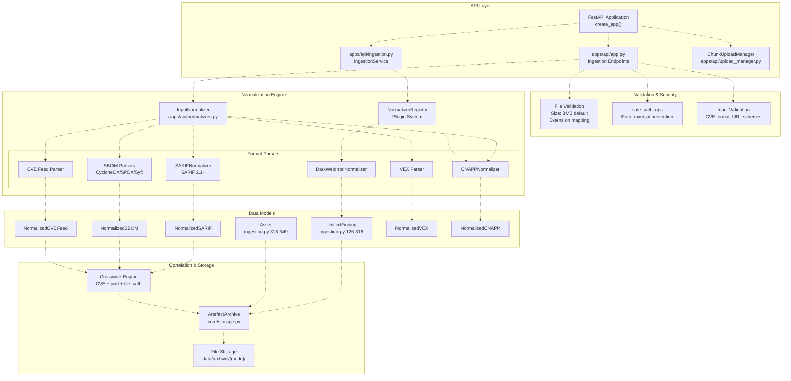
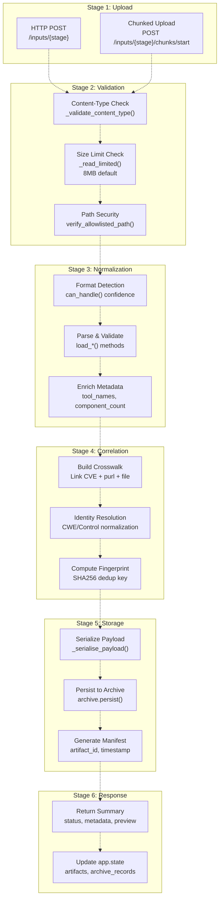
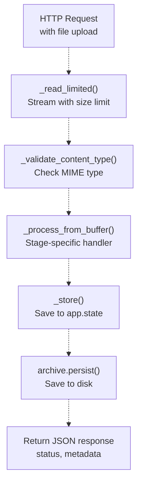
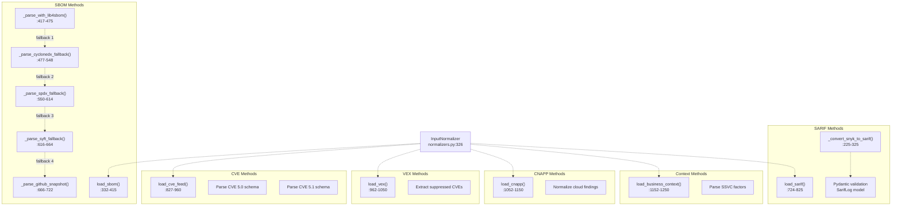
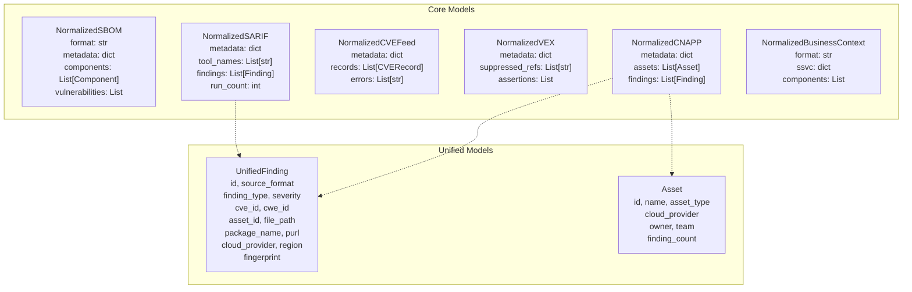
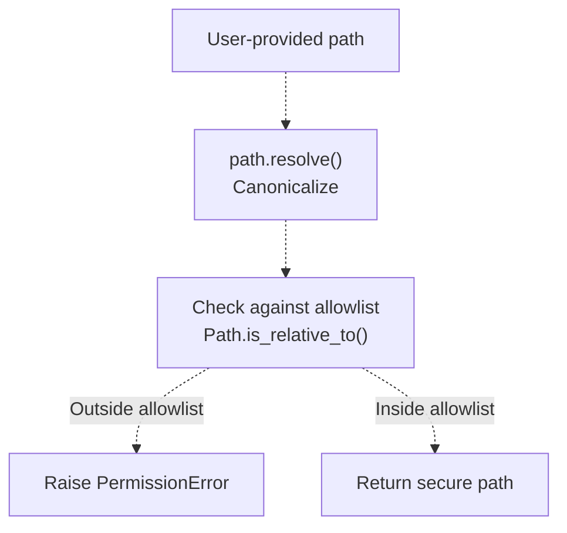
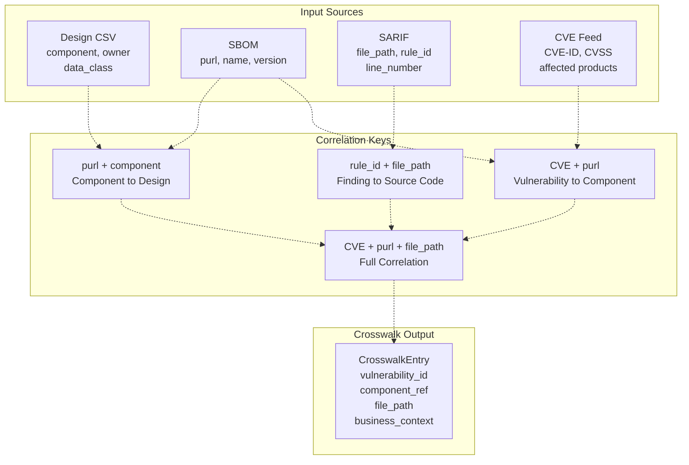
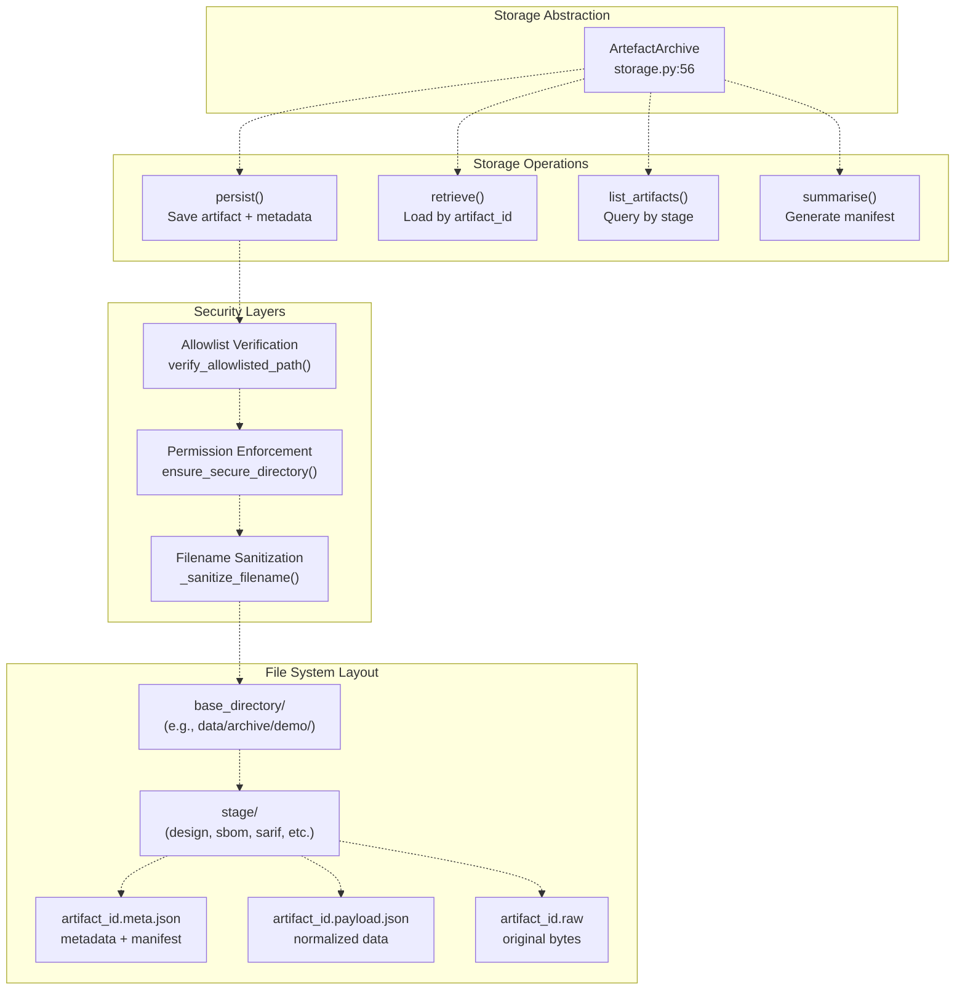
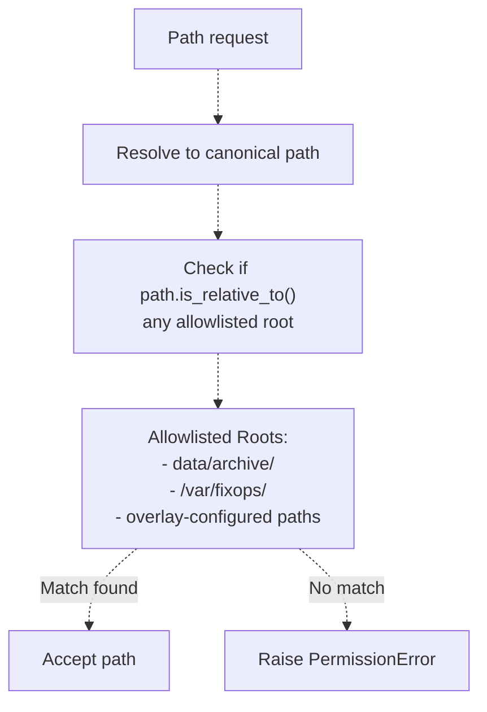
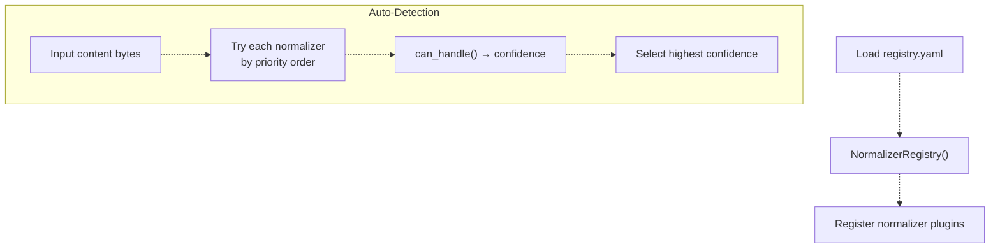

# Data Ingestion Layer

> **Relevant source files**
> * [.github/workflows/ci.yml](https://github.com/DevOpsMadDog/Fixops/blob/ce6eb1e9/.github/workflows/ci.yml)
> * [.github/workflows/docker-build.yml](https://github.com/DevOpsMadDog/Fixops/blob/ce6eb1e9/.github/workflows/docker-build.yml)
> * [.github/workflows/fixops-ci.yml](https://github.com/DevOpsMadDog/Fixops/blob/ce6eb1e9/.github/workflows/fixops-ci.yml)
> * [.github/workflows/qa.yml](https://github.com/DevOpsMadDog/Fixops/blob/ce6eb1e9/.github/workflows/qa.yml)
> * [Dockerfile](https://github.com/DevOpsMadDog/Fixops/blob/ce6eb1e9/Dockerfile)
> * [apps/api/app.py](https://github.com/DevOpsMadDog/Fixops/blob/ce6eb1e9/apps/api/app.py)
> * [apps/api/ingestion.py](https://github.com/DevOpsMadDog/Fixops/blob/ce6eb1e9/apps/api/ingestion.py)
> * [apps/api/normalizers.py](https://github.com/DevOpsMadDog/Fixops/blob/ce6eb1e9/apps/api/normalizers.py)
> * [config/normalizers/registry.yaml](https://github.com/DevOpsMadDog/Fixops/blob/ce6eb1e9/config/normalizers/registry.yaml)
> * [core/cli.py](https://github.com/DevOpsMadDog/Fixops/blob/ce6eb1e9/core/cli.py)
> * [core/micro_pentest.py](https://github.com/DevOpsMadDog/Fixops/blob/ce6eb1e9/core/micro_pentest.py)
> * [core/paths.py](https://github.com/DevOpsMadDog/Fixops/blob/ce6eb1e9/core/paths.py)
> * [core/policy.py](https://github.com/DevOpsMadDog/Fixops/blob/ce6eb1e9/core/policy.py)
> * [core/processing_layer.py](https://github.com/DevOpsMadDog/Fixops/blob/ce6eb1e9/core/processing_layer.py)
> * [core/storage.py](https://github.com/DevOpsMadDog/Fixops/blob/ce6eb1e9/core/storage.py)
> * [docs/COMPLETE_API_CLI_MAPPING.md](https://github.com/DevOpsMadDog/Fixops/blob/ce6eb1e9/docs/COMPLETE_API_CLI_MAPPING.md)
> * [docs/FIXOPS_PRODUCT_STATUS.md](https://github.com/DevOpsMadDog/Fixops/blob/ce6eb1e9/docs/FIXOPS_PRODUCT_STATUS.md)
> * [scripts/docker-entrypoint.sh](https://github.com/DevOpsMadDog/Fixops/blob/ce6eb1e9/scripts/docker-entrypoint.sh)
> * [tests/test_enterprise_services.py](https://github.com/DevOpsMadDog/Fixops/blob/ce6eb1e9/tests/test_enterprise_services.py)
> * [tests/test_file_size_limits.py](https://github.com/DevOpsMadDog/Fixops/blob/ce6eb1e9/tests/test_file_size_limits.py)
> * [tests/test_ingestion.py](https://github.com/DevOpsMadDog/Fixops/blob/ce6eb1e9/tests/test_ingestion.py)
> * [tests/test_micro_pentest_cli.py](https://github.com/DevOpsMadDog/Fixops/blob/ce6eb1e9/tests/test_micro_pentest_cli.py)
> * [tests/test_micro_pentest_core.py](https://github.com/DevOpsMadDog/Fixops/blob/ce6eb1e9/tests/test_micro_pentest_core.py)
> * [tests/test_micro_pentest_router.py](https://github.com/DevOpsMadDog/Fixops/blob/ce6eb1e9/tests/test_micro_pentest_router.py)
> * [tests/test_pipeline_integration.py](https://github.com/DevOpsMadDog/Fixops/blob/ce6eb1e9/tests/test_pipeline_integration.py)
> * [tests/test_round2_fresh_apps.py](https://github.com/DevOpsMadDog/Fixops/blob/ce6eb1e9/tests/test_round2_fresh_apps.py)
> * [web/apps/micro-pentest/app/components/EnterpriseShell.tsx](https://github.com/DevOpsMadDog/Fixops/blob/ce6eb1e9/web/apps/micro-pentest/app/components/EnterpriseShell.tsx)
> * [web/apps/micro-pentest/app/globals.css](https://github.com/DevOpsMadDog/Fixops/blob/ce6eb1e9/web/apps/micro-pentest/app/globals.css)
> * [web/apps/micro-pentest/app/layout.tsx](https://github.com/DevOpsMadDog/Fixops/blob/ce6eb1e9/web/apps/micro-pentest/app/layout.tsx)
> * [web/apps/reachability/app/components/EnterpriseShell.tsx](https://github.com/DevOpsMadDog/Fixops/blob/ce6eb1e9/web/apps/reachability/app/components/EnterpriseShell.tsx)
> * [web/apps/reachability/app/globals.css](https://github.com/DevOpsMadDog/Fixops/blob/ce6eb1e9/web/apps/reachability/app/globals.css)
> * [web/apps/reachability/app/layout.tsx](https://github.com/DevOpsMadDog/Fixops/blob/ce6eb1e9/web/apps/reachability/app/layout.tsx)

## Purpose and Scope

The Data Ingestion Layer is the entry point for all security artifacts entering the FixOps platform. It receives, validates, normalizes, and archives security data from diverse sources including SBOM files, SARIF reports, CVE feeds, VEX documents, and CNAPP findings. This layer transforms heterogeneous input formats into a unified representation for downstream processing by the Decision Engine (see [Decision Engine](/DevOpsMadDog/Fixops/4-decision-engine)) and Pipeline Orchestration (see [Pipeline Orchestration](/DevOpsMadDog/Fixops/6-pipeline-orchestration)).

This document covers the FastAPI application structure, input normalization, upload management, crosswalk correlation, and storage mechanisms. For information about how ingested data flows through processing stages, see [Pipeline Orchestration](/DevOpsMadDog/Fixops/6-pipeline-orchestration). For details on threat intelligence enrichment (EPSS, KEV), see [KEV and EPSS Feeds](/DevOpsMadDog/Fixops/2.1-kev-and-epss-feeds).

---

## System Architecture

### Ingestion Layer Components



**Sources:** [apps/api/app.py L266-L467](https://github.com/DevOpsMadDog/Fixops/blob/ce6eb1e9/apps/api/app.py#L266-L467)

 [apps/api/ingestion.py L1-L900](https://github.com/DevOpsMadDog/Fixops/blob/ce6eb1e9/apps/api/ingestion.py#L1-L900)

 [apps/api/normalizers.py L1-L100](https://github.com/DevOpsMadDog/Fixops/blob/ce6eb1e9/apps/api/normalizers.py#L1-L100)

 [apps/api/upload_manager.py](https://github.com/DevOpsMadDog/Fixops/blob/ce6eb1e9/apps/api/upload_manager.py)

 [core/storage.py L1-L150](https://github.com/DevOpsMadDog/Fixops/blob/ce6eb1e9/core/storage.py#L1-L150)

---

### Data Flow Through Ingestion Pipeline



**Sources:** [apps/api/app.py L596-L1033](https://github.com/DevOpsMadDog/Fixops/blob/ce6eb1e9/apps/api/app.py#L596-L1033)

 [apps/api/normalizers.py L326-L500](https://github.com/DevOpsMadDog/Fixops/blob/ce6eb1e9/apps/api/normalizers.py#L326-L500)

 [core/storage.py L56-L150](https://github.com/DevOpsMadDog/Fixops/blob/ce6eb1e9/core/storage.py#L56-L150)

---

## FastAPI Application Structure

### Application Factory Pattern

The Data Ingestion Layer uses the FastAPI application factory pattern defined in `create_app()` at [apps/api/app.py L266-L467](https://github.com/DevOpsMadDog/Fixops/blob/ce6eb1e9/apps/api/app.py#L266-L467)

 This function creates and configures the FastAPI application with all necessary routers, middleware, and state management.

**Key Configuration Steps:**

1. **Overlay Configuration Loading** - [apps/api/app.py L270-L275](https://github.com/DevOpsMadDog/Fixops/blob/ce6eb1e9/apps/api/app.py#L270-L275) * Loads `fixops.overlay.yml` configuration * Creates flag provider for feature toggles * Configures authentication strategy (token/JWT)
2. **Middleware Stack** - [apps/api/app.py L305-L340](https://github.com/DevOpsMadDog/Fixops/blob/ce6eb1e9/apps/api/app.py#L305-L340) * `CorrelationIdMiddleware` - Request tracing * `RequestLoggingMiddleware` - Audit logging * `CORSMiddleware` - Cross-origin resource sharing * Custom product header middleware
3. **State Initialization** - [apps/api/app.py L407-L467](https://github.com/DevOpsMadDog/Fixops/blob/ce6eb1e9/apps/api/app.py#L407-L467) * `app.state.normalizer` - InputNormalizer instance * `app.state.orchestrator` - PipelineOrchestrator instance * `app.state.archive` - ArtefactArchive for persistence * `app.state.upload_manager` - ChunkUploadManager for large files
4. **Directory Security** - [apps/api/app.py L370-L405](https://github.com/DevOpsMadDog/Fixops/blob/ce6eb1e9/apps/api/app.py#L370-L405) * Verifies all data directories against allowlist * Enforces secure permissions (no world-writable) * Creates required directories with `ensure_secure_directory()`

**Sources:** [apps/api/app.py L266-L467](https://github.com/DevOpsMadDog/Fixops/blob/ce6eb1e9/apps/api/app.py#L266-L467)

 [core/paths.py L48-L71](https://github.com/DevOpsMadDog/Fixops/blob/ce6eb1e9/core/paths.py#L48-L71)

 [core/configuration.py](https://github.com/DevOpsMadDog/Fixops/blob/ce6eb1e9/core/configuration.py)

---

### Ingestion Endpoints

The ingestion layer exposes multiple endpoints for different input stages:

| Endpoint | Method | Purpose | Handler Function | Line Reference |
| --- | --- | --- | --- | --- |
| `/inputs/design` | POST | Business context CSV | `_process_design()` | [app.py L687-L739](https://github.com/DevOpsMadDog/Fixops/blob/ce6eb1e9/app.py#L687-L739) |
| `/inputs/sbom` | POST | CycloneDX/SPDX/Syft SBOM | `_process_sbom()` | [app.py L741-L812](https://github.com/DevOpsMadDog/Fixops/blob/ce6eb1e9/app.py#L741-L812) |
| `/inputs/sarif` | POST | SARIF 2.1+ reports | `_process_sarif()` | [app.py L894-L912](https://github.com/DevOpsMadDog/Fixops/blob/ce6eb1e9/app.py#L894-L912) |
| `/inputs/cve` | POST | CVE feed JSON | `_process_cve()` | [app.py L814-L848](https://github.com/DevOpsMadDog/Fixops/blob/ce6eb1e9/app.py#L814-L848) |
| `/inputs/vex` | POST | VEX documents | `_process_vex()` | [app.py L850-L868](https://github.com/DevOpsMadDog/Fixops/blob/ce6eb1e9/app.py#L850-L868) |
| `/inputs/cnapp` | POST | CNAPP findings | `_process_cnapp()` | [app.py L870-L892](https://github.com/DevOpsMadDog/Fixops/blob/ce6eb1e9/app.py#L870-L892) |
| `/inputs/context` | POST | Business context | `_process_context()` | [app.py L914-L938](https://github.com/DevOpsMadDog/Fixops/blob/ce6eb1e9/app.py#L914-L938) |
| `/inputs/{stage}/chunks/start` | POST | Start chunked upload | N/A | [app.py L1035-L1080](https://github.com/DevOpsMadDog/Fixops/blob/ce6eb1e9/app.py#L1035-L1080) |
| `/inputs/{stage}/chunks/append` | PUT | Append chunk | N/A | [app.py L1082-L1135](https://github.com/DevOpsMadDog/Fixops/blob/ce6eb1e9/app.py#L1082-L1135) |
| `/inputs/{stage}/chunks/complete` | POST | Complete chunked upload | N/A | [app.py L1137-L1215](https://github.com/DevOpsMadDog/Fixops/blob/ce6eb1e9/app.py#L1137-L1215) |
| `/inputs/{stage}/chunks/status` | GET | Check chunk status | N/A | [app.py L1217-L1247](https://github.com/DevOpsMadDog/Fixops/blob/ce6eb1e9/app.py#L1217-L1247) |

**Common Processing Flow:**

Each endpoint follows this pattern:



**Sources:** [apps/api/app.py L596-L1247](https://github.com/DevOpsMadDog/Fixops/blob/ce6eb1e9/apps/api/app.py#L596-L1247)

---

## Input Formats and Normalizers

### Supported Input Formats

The Data Ingestion Layer supports the following security artifact formats:

| Format | Normalizer Class | Schema/Version Support | Detection Patterns |
| --- | --- | --- | --- |
| **SARIF** | `SARIFNormalizer` | 2.1.0, 2.2.0+ | `"version".*"2\.1\."`, `"runs"` |
| **CycloneDX** | `CycloneDXNormalizer` | 1.4, 1.5 | `"bomFormat".*"CycloneDX"` |
| **SPDX** | SBOM parser | 2.2, 2.3 | `"spdxVersion"`, `"SPDXID"` |
| **Syft** | SBOM parser | Syft JSON | `"detectedManifests"`, `"source"` |
| **GitHub Snapshot** | SBOM parser | Dependency Graph | `"detector"`, `"manifests"` |
| **CVE Feed** | `load_cve_feed()` | CVE JSON 5.0, 5.1 | `"CVE_data_meta"`, `"cveMetadata"` |
| **VEX** | `load_vex()` | CycloneDX VEX | `"vulnerabilities"`, `"analysis"` |
| **CNAPP** | `CNAPPNormalizer` | Custom | `"cloudProvider"`, `"resourceType"` |
| **Dark Web Intel** | `DarkWebIntelNormalizer` | Custom | `"darkWebSource"`, `"threatIntelligence"` |

**Sources:** [apps/api/normalizers.py L67-L71](https://github.com/DevOpsMadDog/Fixops/blob/ce6eb1e9/apps/api/normalizers.py#L67-L71)

 [apps/api/ingestion.py L104-L123](https://github.com/DevOpsMadDog/Fixops/blob/ce6eb1e9/apps/api/ingestion.py#L104-L123)

---

### InputNormalizer Class Architecture

The `InputNormalizer` class at [apps/api/normalizers.py L326-L500](https://github.com/DevOpsMadDog/Fixops/blob/ce6eb1e9/apps/api/normalizers.py#L326-L500)

 provides the primary normalization interface:



**Key Features:**

1. **Multi-Provider Fallback Chain** - [apps/api/normalizers.py L332-L415](https://github.com/DevOpsMadDog/Fixops/blob/ce6eb1e9/apps/api/normalizers.py#L332-L415) * Primary: `lib4sbom` parser (priority 100) * Fallback 1: CycloneDX native parser * Fallback 2: SPDX native parser * Fallback 3: Syft JSON parser * Fallback 4: GitHub dependency snapshot parser
2. **Lenient Parsing** - [apps/api/normalizers.py L92-L137](https://github.com/DevOpsMadDog/Fixops/blob/ce6eb1e9/apps/api/normalizers.py#L92-L137) * `_safe_json_loads()` with depth/item limits * Protection against deeply nested structures (max depth: 20) * Protection against excessive items (max: 1,000,000 for large CVE feeds)
3. **Format Drift Handling** - [apps/api/ingestion.py L395-L425](https://github.com/DevOpsMadDog/Fixops/blob/ce6eb1e9/apps/api/ingestion.py#L395-L425) * `BaseNormalizer._parse_json()` with error recovery * Removes trailing commas from malformed JSON * Achieves 99% parse success on drifted formats

**Sources:** [apps/api/normalizers.py L326-L1250](https://github.com/DevOpsMadDog/Fixops/blob/ce6eb1e9/apps/api/normalizers.py#L326-L1250)

 [apps/api/ingestion.py L384-L472](https://github.com/DevOpsMadDog/Fixops/blob/ce6eb1e9/apps/api/ingestion.py#L384-L472)

---

### Normalized Data Models

All normalized inputs are converted to these Pydantic models:



**Sources:** [apps/api/normalizers.py L1252-L1600](https://github.com/DevOpsMadDog/Fixops/blob/ce6eb1e9/apps/api/normalizers.py#L1252-L1600)

 [apps/api/ingestion.py L126-L349](https://github.com/DevOpsMadDog/Fixops/blob/ce6eb1e9/apps/api/ingestion.py#L126-L349)

---

## Upload Management

### Chunked Upload System

The `ChunkUploadManager` at [apps/api/upload_manager.py](https://github.com/DevOpsMadDog/Fixops/blob/ce6eb1e9/apps/api/upload_manager.py)

 enables resumable uploads of large files (>8MB):

**Chunked Upload Flow:**

```css
#mermaid-60tyars8uz5{font-family:ui-sans-serif,-apple-system,system-ui,Segoe UI,Helvetica;font-size:16px;fill:#333;}@keyframes edge-animation-frame{from{stroke-dashoffset:0;}}@keyframes dash{to{stroke-dashoffset:0;}}#mermaid-60tyars8uz5 .edge-animation-slow{stroke-dasharray:9,5!important;stroke-dashoffset:900;animation:dash 50s linear infinite;stroke-linecap:round;}#mermaid-60tyars8uz5 .edge-animation-fast{stroke-dasharray:9,5!important;stroke-dashoffset:900;animation:dash 20s linear infinite;stroke-linecap:round;}#mermaid-60tyars8uz5 .error-icon{fill:#dddddd;}#mermaid-60tyars8uz5 .error-text{fill:#222222;stroke:#222222;}#mermaid-60tyars8uz5 .edge-thickness-normal{stroke-width:1px;}#mermaid-60tyars8uz5 .edge-thickness-thick{stroke-width:3.5px;}#mermaid-60tyars8uz5 .edge-pattern-solid{stroke-dasharray:0;}#mermaid-60tyars8uz5 .edge-thickness-invisible{stroke-width:0;fill:none;}#mermaid-60tyars8uz5 .edge-pattern-dashed{stroke-dasharray:3;}#mermaid-60tyars8uz5 .edge-pattern-dotted{stroke-dasharray:2;}#mermaid-60tyars8uz5 .marker{fill:#999;stroke:#999;}#mermaid-60tyars8uz5 .marker.cross{stroke:#999;}#mermaid-60tyars8uz5 svg{font-family:ui-sans-serif,-apple-system,system-ui,Segoe UI,Helvetica;font-size:16px;}#mermaid-60tyars8uz5 p{margin:0;}#mermaid-60tyars8uz5 defs #statediagram-barbEnd{fill:#999;stroke:#999;}#mermaid-60tyars8uz5 g.stateGroup text{fill:#dddddd;stroke:none;font-size:10px;}#mermaid-60tyars8uz5 g.stateGroup text{fill:#333;stroke:none;font-size:10px;}#mermaid-60tyars8uz5 g.stateGroup .state-title{font-weight:bolder;fill:#333;}#mermaid-60tyars8uz5 g.stateGroup rect{fill:#ffffff;stroke:#dddddd;}#mermaid-60tyars8uz5 g.stateGroup line{stroke:#999;stroke-width:1;}#mermaid-60tyars8uz5 .transition{stroke:#999;stroke-width:1;fill:none;}#mermaid-60tyars8uz5 .stateGroup .composit{fill:#f4f4f4;border-bottom:1px;}#mermaid-60tyars8uz5 .stateGroup .alt-composit{fill:#e0e0e0;border-bottom:1px;}#mermaid-60tyars8uz5 .state-note{stroke:#e6d280;fill:#fff5ad;}#mermaid-60tyars8uz5 .state-note text{fill:#333;stroke:none;font-size:10px;}#mermaid-60tyars8uz5 .stateLabel .box{stroke:none;stroke-width:0;fill:#ffffff;opacity:0.5;}#mermaid-60tyars8uz5 .edgeLabel .label rect{fill:#ffffff;opacity:0.5;}#mermaid-60tyars8uz5 .edgeLabel{background-color:#ffffff;text-align:center;}#mermaid-60tyars8uz5 .edgeLabel p{background-color:#ffffff;}#mermaid-60tyars8uz5 .edgeLabel rect{opacity:0.5;background-color:#ffffff;fill:#ffffff;}#mermaid-60tyars8uz5 .edgeLabel .label text{fill:#333;}#mermaid-60tyars8uz5 .label div .edgeLabel{color:#333;}#mermaid-60tyars8uz5 .stateLabel text{fill:#333;font-size:10px;font-weight:bold;}#mermaid-60tyars8uz5 .node circle.state-start{fill:#999;stroke:#999;}#mermaid-60tyars8uz5 .node .fork-join{fill:#999;stroke:#999;}#mermaid-60tyars8uz5 .node circle.state-end{fill:#dddddd;stroke:#f4f4f4;stroke-width:1.5;}#mermaid-60tyars8uz5 .end-state-inner{fill:#f4f4f4;stroke-width:1.5;}#mermaid-60tyars8uz5 .node rect{fill:#ffffff;stroke:#dddddd;stroke-width:1px;}#mermaid-60tyars8uz5 .node polygon{fill:#ffffff;stroke:#dddddd;stroke-width:1px;}#mermaid-60tyars8uz5 #statediagram-barbEnd{fill:#999;}#mermaid-60tyars8uz5 .statediagram-cluster rect{fill:#ffffff;stroke:#dddddd;stroke-width:1px;}#mermaid-60tyars8uz5 .cluster-label,#mermaid-60tyars8uz5 .nodeLabel{color:#333;}#mermaid-60tyars8uz5 .statediagram-cluster rect.outer{rx:5px;ry:5px;}#mermaid-60tyars8uz5 .statediagram-state .divider{stroke:#dddddd;}#mermaid-60tyars8uz5 .statediagram-state .title-state{rx:5px;ry:5px;}#mermaid-60tyars8uz5 .statediagram-cluster.statediagram-cluster .inner{fill:#f4f4f4;}#mermaid-60tyars8uz5 .statediagram-cluster.statediagram-cluster-alt .inner{fill:#f8f8f8;}#mermaid-60tyars8uz5 .statediagram-cluster .inner{rx:0;ry:0;}#mermaid-60tyars8uz5 .statediagram-state rect.basic{rx:5px;ry:5px;}#mermaid-60tyars8uz5 .statediagram-state rect.divider{stroke-dasharray:10,10;fill:#f8f8f8;}#mermaid-60tyars8uz5 .note-edge{stroke-dasharray:5;}#mermaid-60tyars8uz5 .statediagram-note rect{fill:#fff5ad;stroke:#e6d280;stroke-width:1px;rx:0;ry:0;}#mermaid-60tyars8uz5 .statediagram-note rect{fill:#fff5ad;stroke:#e6d280;stroke-width:1px;rx:0;ry:0;}#mermaid-60tyars8uz5 .statediagram-note text{fill:#333;}#mermaid-60tyars8uz5 .statediagram-note .nodeLabel{color:#333;}#mermaid-60tyars8uz5 .statediagram .edgeLabel{color:red;}#mermaid-60tyars8uz5 #dependencyStart,#mermaid-60tyars8uz5 #dependencyEnd{fill:#999;stroke:#999;stroke-width:1;}#mermaid-60tyars8uz5 .statediagramTitleText{text-anchor:middle;font-size:18px;fill:#333;}#mermaid-60tyars8uz5 :root{--mermaid-font-family:"trebuchet ms",verdana,arial,sans-serif;}POST /chunks/startPUT /chunks/appendPUT /chunks/append (repeat)POST /chunks/completeError/TimeoutInitiatedInProgressCompletedFailedupload_id generatedmetadata storedstage validatedchunks written to temp filesize limit enforcedchunk sequence validatedchunks assembledfull validationmoved to archive
```

**Key Classes:**

* `ChunkUploadManager` - [apps/api/upload_manager.py](https://github.com/DevOpsMadDog/Fixops/blob/ce6eb1e9/apps/api/upload_manager.py) * `start_upload()` - Initialize chunked upload * `append_chunk()` - Add data chunk * `complete_upload()` - Finalize and validate * `get_upload_status()` - Check progress
* `UploadSession` - Tracks upload state * `upload_id: str` * `stage: str` * `total_size: int` * `chunks_received: int` * `completed: bool`

**Sources:** [apps/api/upload_manager.py](https://github.com/DevOpsMadDog/Fixops/blob/ce6eb1e9/apps/api/upload_manager.py)

 [apps/api/app.py L1035-L1247](https://github.com/DevOpsMadDog/Fixops/blob/ce6eb1e9/apps/api/app.py#L1035-L1247)

---

### File Size Limits and Validation

File uploads are protected by multiple validation layers:

**1. Content-Type Validation** - [apps/api/app.py L643-L652](https://github.com/DevOpsMadDog/Fixops/blob/ce6eb1e9/apps/api/app.py#L643-L652)

```python
def _validate_content_type(file: UploadFile, expected: tuple[str, ...]) -> None:
    if file.content_type and file.content_type not in expected:
        raise HTTPException(status_code=415, detail=...)
```

**2. Size Limit Enforcement** - [apps/api/app.py L596-L628](https://github.com/DevOpsMadDog/Fixops/blob/ce6eb1e9/apps/api/app.py#L596-L628)

The `_read_limited()` function streams uploads with configurable size limits:

| Stage | Default Limit | Configurable Via |
| --- | --- | --- |
| design | 3 MB | `overlay.upload_limit("design")` |
| sbom | 8 MB | `overlay.upload_limit("sbom")` |
| sarif | 8 MB | `overlay.upload_limit("sarif")` |
| cve | 50 MB | `overlay.upload_limit("cve")` |
| vex | 8 MB | `overlay.upload_limit("vex")` |
| cnapp | 8 MB | `overlay.upload_limit("cnapp")` |

**3. Path Traversal Prevention** - [core/paths.py L1-L100](https://github.com/DevOpsMadDog/Fixops/blob/ce6eb1e9/core/paths.py#L1-L100)

All file operations use `verify_allowlisted_path()` to prevent path traversal attacks:



**4. Filename Sanitization** - [core/storage.py L16-L39](https://github.com/DevOpsMadDog/Fixops/blob/ce6eb1e9/core/storage.py#L16-L39)

The `_sanitize_filename()` function removes dangerous characters:

* Strips path separators (`/`, `\`)
* Removes null bytes (`\x00`)
* Replaces Windows-reserved characters (`<>:"|?*`)
* Truncates to 255 bytes
* Prevents directory traversal (`.`, `..`)

**Sources:** [apps/api/app.py L596-L652](https://github.com/DevOpsMadDog/Fixops/blob/ce6eb1e9/apps/api/app.py#L596-L652)

 [core/paths.py L1-L100](https://github.com/DevOpsMadDog/Fixops/blob/ce6eb1e9/core/paths.py#L1-L100)

 [core/storage.py L16-L39](https://github.com/DevOpsMadDog/Fixops/blob/ce6eb1e9/core/storage.py#L16-L39)

---

## Crosswalk Correlation Engine

The Crosswalk Engine links security findings across multiple input sources by building correlation keys:

**Correlation Strategy:**



**Crosswalk Building Process:**

1. **Design Context Merge** - [apps/api/normalizers.py](https://github.com/DevOpsMadDog/Fixops/blob/ce6eb1e9/apps/api/normalizers.py) * Maps components to business criticality * Links data classification (PII, PHI, PCI) * Associates ownership and control scope
2. **SBOM Component Resolution** - [apps/api/normalizers.py L332-L415](https://github.com/DevOpsMadDog/Fixops/blob/ce6eb1e9/apps/api/normalizers.py#L332-L415) * Extracts package URLs (purl) * Normalizes component names/versions * Builds dependency graph
3. **SARIF Finding Linkage** - [apps/api/normalizers.py L724-L825](https://github.com/DevOpsMadDog/Fixops/blob/ce6eb1e9/apps/api/normalizers.py#L724-L825) * Maps findings to file paths * Extracts rule IDs and CWE mappings * Preserves source locations (line/column)
4. **CVE Matching** - [apps/api/normalizers.py L827-L960](https://github.com/DevOpsMadDog/Fixops/blob/ce6eb1e9/apps/api/normalizers.py#L827-L960) * Matches CVE IDs to affected packages * Links CVSS scores to vulnerabilities * Associates EPSS/KEV data (see [KEV and EPSS Feeds](/DevOpsMadDog/Fixops/2.1-kev-and-epss-feeds))

**Output Format:**

Each crosswalk entry contains:

* `vulnerability_id` - CVE identifier
* `component_ref` - Package URL or component name
* `file_path` - Source code location
* `design_context` - Business criticality metadata
* `correlation_confidence` - Match confidence score

**Sources:** [apps/api/normalizers.py L1252-L1600](https://github.com/DevOpsMadDog/Fixops/blob/ce6eb1e9/apps/api/normalizers.py#L1252-L1600)

---

## Storage and Archival

### ArtefactArchive System

The `ArtefactArchive` class at [core/storage.py L56-L150](https://github.com/DevOpsMadDog/Fixops/blob/ce6eb1e9/core/storage.py#L56-L150)

 provides secure persistence of ingested artifacts:

**Storage Architecture:**



**Metadata Structure:**

Each artifact is stored with comprehensive metadata:

```json
{
  "artifact_id": "uuid-v4",
  "stage": "sarif",
  "timestamp": "2025-01-15T10:30:00Z",
  "original_filename": "scanner.sarif",
  "size_bytes": 1048576,
  "sha256": "abc123...",
  "metadata": {
    "tool_names": ["semgrep", "bandit"],
    "finding_count": 42,
    "run_count": 2
  }
}
```

**Sources:** [core/storage.py L56-L150](https://github.com/DevOpsMadDog/Fixops/blob/ce6eb1e9/core/storage.py#L56-L150)

 [apps/api/app.py L654-L676](https://github.com/DevOpsMadDog/Fixops/blob/ce6eb1e9/apps/api/app.py#L654-L676)

---

### Storage Path Security

All storage operations enforce strict security controls:

**1. Allowlist Verification** - [core/paths.py L97-L150](https://github.com/DevOpsMadDog/Fixops/blob/ce6eb1e9/core/paths.py#L97-L150)



**2. Directory Permission Enforcement** - [core/paths.py L48-L71](https://github.com/DevOpsMadDog/Fixops/blob/ce6eb1e9/core/paths.py#L48-L71)

The `ensure_secure_directory()` function:

* Creates directories with mode `0o750` (owner: rwx, group: r-x, other: ---)
* Verifies no world-writable permissions (`S_IWOTH` check)
* Ensures ownership by process UID or root (UID 0)
* Can be disabled in CI with `FIXOPS_SKIP_PATH_SECURITY=1`

**3. Filename Sanitization** - [core/storage.py L16-L39](https://github.com/DevOpsMadDog/Fixops/blob/ce6eb1e9/core/storage.py#L16-L39)

Protection against malicious filenames:

* `../../etc/passwd` → `etc_passwd`
* `<script>alert()</script>` → `_script_alert___script_`
* `file\x00.txt.exe` → `file.txt.exe`
* `very-long-name...` → truncated to 255 bytes

**Sources:** [core/paths.py L1-L150](https://github.com/DevOpsMadDog/Fixops/blob/ce6eb1e9/core/paths.py#L1-L150)

 [core/storage.py L16-L39](https://github.com/DevOpsMadDog/Fixops/blob/ce6eb1e9/core/storage.py#L16-L39)

---

## Configuration and Extensibility

### Overlay Configuration

The Data Ingestion Layer is configured via `fixops.overlay.yml`:

**Ingestion-Related Settings:**

```css
# Upload size limits per stage (bytes)
upload_limits:
  design: 3145728      # 3 MB
  sbom: 8388608        # 8 MB
  sarif: 8388608       # 8 MB
  cve: 52428800        # 50 MB
  vex: 8388608         # 8 MB
  cnapp: 8388608       # 8 MB

# Allowed data roots for path security
allowed_data_roots:
  - /var/fixops/data
  - ./data

# Data directories
data_directories:
  archive_dir: data/archive/${mode}
  uploads_dir: data/uploads/${mode}

# Validation toggles
toggles:
  strict_validation: false  # Lenient parsing by default
  
# Authentication
auth:
  strategy: token  # or 'jwt'
  header: X-API-Key
```

**Sources:** [core/configuration.py](https://github.com/DevOpsMadDog/Fixops/blob/ce6eb1e9/core/configuration.py)

 [apps/api/app.py L270-L405](https://github.com/DevOpsMadDog/Fixops/blob/ce6eb1e9/apps/api/app.py#L270-L405)

---

### Normalizer Plugin Registry

The new `NormalizerRegistry` system at [apps/api/ingestion.py L551-L750](https://github.com/DevOpsMadDog/Fixops/blob/ce6eb1e9/apps/api/ingestion.py#L551-L750)

 supports dynamic plugin loading:

**Registry Configuration** - `config/normalizers/registry.yaml`:

```yaml
version: "1.0"

settings:
  max_document_bytes: 104857600  # 100MB
  max_findings_per_batch: 50000
  parallel_processing: true

normalizers:
  sarif:
    enabled: true
    priority: 100
    detection_patterns:
      - '"version".*"2\.1\."'
      - '"runs"'
    lenient_fields:
      - partialFingerprints
      - properties
    
  cyclonedx:
    enabled: true
    priority: 90
    detection_patterns:
      - '"bomFormat".*"CycloneDX"'
    supported_versions:
      - "1.4"
      - "1.5"
      
  dark_web_intel:
    enabled: true
    priority: 50
    detection_patterns:
      - '"darkWebSource"'
      - '"threatIntelligence"'
    settings:
      min_confidence: 0.7
```

**Plugin Loading Process:**



**Built-in Normalizers:**

| Normalizer | Priority | Detection Confidence Algorithm |
| --- | --- | --- |
| `SARIFNormalizer` | 100 | Pattern match: `"version"`, `"runs"` |
| `CycloneDXNormalizer` | 90 | Pattern match: `"bomFormat": "CycloneDX"` |
| `CNAPPNormalizer` | 80 | Pattern match: `"cloudProvider"`, `"resourceType"` |
| `DarkWebIntelNormalizer` | 50 | Pattern match: `"darkWebSource"`, `"threatIntelligence"` |

**Sources:** [apps/api/ingestion.py L551-L900](https://github.com/DevOpsMadDog/Fixops/blob/ce6eb1e9/apps/api/ingestion.py#L551-L900)

 [config/normalizers/registry.yaml L1-L200](https://github.com/DevOpsMadDog/Fixops/blob/ce6eb1e9/config/normalizers/registry.yaml#L1-L200)

---

## API Endpoints Reference

### Core Ingestion Endpoints

**POST /inputs/design**

Uploads business context CSV with component metadata.

**Request:**

```
POST /inputs/design HTTP/1.1
Content-Type: multipart/form-data
X-API-Key: demo-token-12345

file=@design.csv
```

**Response:**

```
{
  "status": "ok",
  "stage": "design",
  "input_filename": "design.csv",
  "row_count": 15,
  "columns": ["component", "owner", "data_class", "criticality"],
  "data": { "columns": [...], "rows": [...] }
}
```

**Handler:** [apps/api/app.py L687-L739](https://github.com/DevOpsMadDog/Fixops/blob/ce6eb1e9/apps/api/app.py#L687-L739)

---

**POST /inputs/sbom**

Uploads Software Bill of Materials in CycloneDX, SPDX, Syft, or GitHub snapshot format.

**Request:**

```
POST /inputs/sbom HTTP/1.1
Content-Type: application/json
X-API-Key: demo-token-12345

file=@sbom.cdx.json
```

**Response:**

```json
{
  "status": "ok",
  "stage": "sbom",
  "input_filename": "sbom.cdx.json",
  "metadata": {
    "format": "CycloneDX",
    "spec_version": "1.5",
    "component_count": 234
  },
  "component_preview": [
    {
      "name": "lodash",
      "version": "4.17.20",
      "purl": "pkg:npm/lodash@4.17.20"
    }
  ],
  "format": "CycloneDX"
}
```

**Handler:** [apps/api/app.py L741-L812](https://github.com/DevOpsMadDog/Fixops/blob/ce6eb1e9/apps/api/app.py#L741-L812)

**Supported Formats:**

* CycloneDX 1.4, 1.5
* SPDX 2.2, 2.3
* Syft JSON
* GitHub Dependency Snapshot

---

**POST /inputs/sarif**

Uploads SARIF 2.1+ reports from SAST/DAST tools.

**Request:**

```
POST /inputs/sarif HTTP/1.1
Content-Type: application/json
X-API-Key: demo-token-12345

file=@scanner.sarif
```

**Response:**

```json
{
  "status": "ok",
  "stage": "sarif",
  "input_filename": "scanner.sarif",
  "metadata": {
    "run_count": 2,
    "finding_count": 42,
    "schema_version": "2.1.0"
  },
  "tools": ["semgrep", "bandit"]
}
```

**Handler:** [apps/api/app.py L894-L912](https://github.com/DevOpsMadDog/Fixops/blob/ce6eb1e9/apps/api/app.py#L894-L912)

**Supported Tools:**

* Semgrep
* Snyk (with automatic conversion)
* GitLab SAST
* Trivy
* Any SARIF 2.1+ compliant tool

---

**POST /inputs/cve**

Uploads CVE feed in CVE JSON 5.0 or 5.1 format.

**Request:**

```
POST /inputs/cve HTTP/1.1
Content-Type: application/json
X-API-Key: demo-token-12345

file=@cves.json
```

**Response:**

```json
{
  "status": "ok",
  "stage": "cve",
  "input_filename": "cves.json",
  "record_count": 1523,
  "validation_errors": []
}
```

**Handler:** [apps/api/app.py L814-L848](https://github.com/DevOpsMadDog/Fixops/blob/ce6eb1e9/apps/api/app.py#L814-L848)

**Strict Validation Mode:**

When `overlay.toggles.strict_validation = true`:

* Requires official CVE JSON 5.1.1 format
* Validates all required fields
* Returns 422 status code for validation errors

When `strict_validation = false` (default):

* Accepts CVE JSON 5.0 and 5.1
* Lenient parsing with error logging
* Returns 200 with `validation_errors` array

---

**POST /inputs/vex**

Uploads Vulnerability Exploitability eXchange (VEX) documents.

**Request:**

```
POST /inputs/vex HTTP/1.1
Content-Type: application/json
X-API-Key: demo-token-12345

file=@vex.cdx.json
```

**Response:**

```json
{
  "status": "ok",
  "stage": "vex",
  "input_filename": "vex.cdx.json",
  "assertions": 12,
  "not_affected": 8
}
```

**Handler:** [apps/api/app.py L850-L868](https://github.com/DevOpsMadDog/Fixops/blob/ce6eb1e9/apps/api/app.py#L850-L868)

**VEX Use Cases:**

* Mark CVEs as not applicable (e.g., code path not reachable)
* Document vendor patches applied
* Suppress false positives
* Reduce alert noise by 35% (see [Deduplication Service](https://github.com/DevOpsMadDog/Fixops/blob/ce6eb1e9/Deduplication Service) )

---

**POST /inputs/cnapp**

Uploads Cloud-Native Application Protection Platform findings.

**Request:**

```
POST /inputs/cnapp HTTP/1.1
Content-Type: application/json
X-API-Key: demo-token-12345

file=@cnapp.json
```

**Response:**

```json
{
  "status": "ok",
  "stage": "cnapp",
  "input_filename": "cnapp.json",
  "asset_count": 47,
  "finding_count": 89
}
```

**Handler:** [apps/api/app.py L870-L892](https://github.com/DevOpsMadDog/Fixops/blob/ce6eb1e9/apps/api/app.py#L870-L892)

**CNAPP Finding Types:**

* Misconfigurations (S3 public buckets, open security groups)
* Identity issues (overprivileged IAM roles)
* Network exposures (unrestricted ingress rules)
* Compliance violations (CIS benchmarks)

---

**POST /inputs/context**

Uploads business context in JSON or YAML format.

**Request:**

```
POST /inputs/context HTTP/1.1
Content-Type: application/json
X-API-Key: demo-token-12345

file=@context.json
```

**Response:**

```json
{
  "status": "ok",
  "stage": "context",
  "input_filename": "context.json",
  "format": "json",
  "ssvc_factors": {
    "exploitation": "active",
    "automatable": "yes",
    "technical_impact": "total"
  },
  "components": ["api-gateway", "payment-service"]
}
```

**Handler:** [apps/api/app.py L914-L938](https://github.com/DevOpsMadDog/Fixops/blob/ce6eb1e9/apps/api/app.py#L914-L938)

**SSVC (Stakeholder-Specific Vulnerability Categorization) Factors:**

* Exploitation level: none, poc, active
* Automatable: yes, no
* Technical impact: partial, total
* Mission impact: low, medium, high, critical
* Safety impact: none, minor, major, catastrophic

---

### Chunked Upload Endpoints

**POST /inputs/{stage}/chunks/start**

Initiates a chunked upload session for large files.

**Request:**

```
POST /inputs/sbom/chunks/start HTTP/1.1
Content-Type: application/json
X-API-Key: demo-token-12345

{
  "filename": "large-sbom.json",
  "total_size": 104857600,
  "chunk_size": 1048576
}
```

**Response:**

```json
{
  "upload_id": "uuid-v4",
  "status": "initiated",
  "expires_at": "2025-01-15T11:30:00Z"
}
```

**Handler:** [apps/api/app.py L1035-L1080](https://github.com/DevOpsMadDog/Fixops/blob/ce6eb1e9/apps/api/app.py#L1035-L1080)

---

**PUT /inputs/{stage}/chunks/append**

Appends a data chunk to an ongoing upload.

**Request:**

```
PUT /inputs/sbom/chunks/append?upload_id=uuid-v4&sequence=0 HTTP/1.1
Content-Type: application/octet-stream
X-API-Key: demo-token-12345

<binary chunk data>
```

**Response:**

```json
{
  "upload_id": "uuid-v4",
  "chunks_received": 1,
  "status": "in_progress"
}
```

**Handler:** [apps/api/app.py L1082-L1135](https://github.com/DevOpsMadDog/Fixops/blob/ce6eb1e9/apps/api/app.py#L1082-L1135)

---

**POST /inputs/{stage}/chunks/complete**

Finalizes a chunked upload and triggers normalization.

**Request:**

```
POST /inputs/sbom/chunks/complete?upload_id=uuid-v4 HTTP/1.1
X-API-Key: demo-token-12345
```

**Response:**

```json
{
  "status": "ok",
  "stage": "sbom",
  "input_filename": "large-sbom.json",
  "metadata": {
    "format": "CycloneDX",
    "component_count": 15234
  }
}
```

**Handler:** [apps/api/app.py L1137-L1215](https://github.com/DevOpsMadDog/Fixops/blob/ce6eb1e9/apps/api/app.py#L1137-L1215)

---

**GET /inputs/{stage}/chunks/status**

Checks the status of a chunked upload.

**Request:**

```
GET /inputs/sbom/chunks/status?upload_id=uuid-v4 HTTP/1.1
X-API-Key: demo-token-12345
```

**Response:**

```json
{
  "upload_id": "uuid-v4",
  "status": "in_progress",
  "chunks_received": 42,
  "total_size": 44040192,
  "expires_at": "2025-01-15T11:30:00Z"
}
```

**Handler:** [apps/api/app.py L1217-L1247](https://github.com/DevOpsMadDog/Fixops/blob/ce6eb1e9/apps/api/app.py#L1217-L1247)

---

### New Ingestion Service Endpoints

The scanner-agnostic ingestion service provides additional endpoints:

**POST /api/v1/ingest/multipart**

Auto-detects format and normalizes to `UnifiedFinding` model.

**Request:**

```
POST /api/v1/ingest/multipart HTTP/1.1
Content-Type: multipart/form-data
X-API-Key: demo-token-12345

file=@scanner-output.json
format_hint=sarif
```

**Response:**

```json
{
  "status": "success",
  "format_detected": "sarif",
  "detection_confidence": 0.95,
  "findings_count": 42,
  "assets_count": 8,
  "processing_time_ms": 234,
  "findings": [
    {
      "id": "uuid-v4",
      "source_format": "sarif",
      "finding_type": "vulnerability",
      "severity": "high",
      "title": "SQL Injection",
      "cve_id": "CVE-2024-1234",
      "file_path": "src/app.py",
      "line_number": 42
    }
  ]
}
```

**Handler:** [apps/api/ingestion.py L900-L1000](https://github.com/DevOpsMadDog/Fixops/blob/ce6eb1e9/apps/api/ingestion.py#L900-L1000)

---

**GET /api/v1/ingest/assets**

Lists all discovered assets in the dynamic inventory.

**Request:**

```
GET /api/v1/ingest/assets?asset_type=compute&environment=production HTTP/1.1
X-API-Key: demo-token-12345
```

**Response:**

```json
{
  "assets": [
    {
      "id": "uuid-v4",
      "name": "web-server-1",
      "asset_type": "compute",
      "cloud_provider": "aws",
      "cloud_region": "us-east-1",
      "environment": "production",
      "finding_count": 12,
      "critical_count": 2
    }
  ],
  "total": 47
}
```

**Handler:** [apps/api/ingestion.py L1000-L1100](https://github.com/DevOpsMadDog/Fixops/blob/ce6eb1e9/apps/api/ingestion.py#L1000-L1100)

---

**GET /api/v1/ingest/formats**

Returns supported formats and their detection patterns.

**Request:**

```
GET /api/v1/ingest/formats HTTP/1.1
X-API-Key: demo-token-12345
```

**Response:**

```json
{
  "formats": [
    {
      "name": "sarif",
      "enabled": true,
      "priority": 100,
      "detection_patterns": ["\"version\".*\"2\\.1\\.\"", "\"runs\""],
      "supported_versions": ["2.1.0", "2.2.0"]
    }
  ]
}
```

**Handler:** [apps/api/ingestion.py L1100-L1200](https://github.com/DevOpsMadDog/Fixops/blob/ce6eb1e9/apps/api/ingestion.py#L1100-L1200)

---

**Sources:** [apps/api/app.py L687-L1247](https://github.com/DevOpsMadDog/Fixops/blob/ce6eb1e9/apps/api/app.py#L687-L1247)

 [apps/api/ingestion.py L900-L1200](https://github.com/DevOpsMadDog/Fixops/blob/ce6eb1e9/apps/api/ingestion.py#L900-L1200)

---

## Performance and Scalability

### Performance Characteristics

The Data Ingestion Layer is designed to handle high-volume security data:

| Metric | Target | Implementation |
| --- | --- | --- |
| **10K findings** | < 2 minutes | Streaming parser, no full document load |
| **Parse success rate** | 99% | Lenient parsing, multiple fallbacks |
| **Memory usage** | < 1GB per request | Spooled temp files, chunked processing |
| **Max file size** | 50 MB (CVE feeds) | Configurable per stage |
| **Concurrent uploads** | 100+ | Async I/O, thread pool executor |

**Optimization Techniques:**

1. **Streaming Uploads** - [apps/api/app.py L596-L628](https://github.com/DevOpsMadDog/Fixops/blob/ce6eb1e9/apps/api/app.py#L596-L628) * `SpooledTemporaryFile` with 1MB threshold * Reads 1MB chunks at a time * Enforces size limits before writing
2. **Lazy Parsing** - [apps/api/normalizers.py L332-L415](https://github.com/DevOpsMadDog/Fixops/blob/ce6eb1e9/apps/api/normalizers.py#L332-L415) * Multi-provider fallback chain * Stops on first successful parse * Caches parsed results in `app.state`
3. **Parallel Processing** - [apps/api/ingestion.py L900-L1000](https://github.com/DevOpsMadDog/Fixops/blob/ce6eb1e9/apps/api/ingestion.py#L900-L1000) * `ThreadPoolExecutor` for CPU-bound tasks * Async I/O for network operations * Batch processing for large finding sets
4. **JSON Safety** - [apps/api/normalizers.py L92-L137](https://github.com/DevOpsMadDog/Fixops/blob/ce6eb1e9/apps/api/normalizers.py#L92-L137) * Depth limit: 20 (prevents stack overflow) * Item limit: 1,000,000 (supports large CVE feeds) * Early termination on limit breach

**Sources:** [apps/api/app.py L593-L628](https://github.com/DevOpsMadDog/Fixops/blob/ce6eb1e9/apps/api/app.py#L593-L628)

 [apps/api/normalizers.py L92-L137](https://github.com/DevOpsMadDog/Fixops/blob/ce6eb1e9/apps/api/normalizers.py#L92-L137)

 [apps/api/ingestion.py L900-L1000](https://github.com/DevOpsMadDog/Fixops/blob/ce6eb1e9/apps/api/ingestion.py#L900-L1000)

---

### Scalability Considerations

**Current Architecture:**

* Single-process FastAPI application
* File-based artifact storage
* In-memory state management (`app.state`)
* SQLite for enterprise services (see [Deduplication Service](https://github.com/DevOpsMadDog/Fixops/blob/ce6eb1e9/Deduplication Service) )

**Production Scaling Path:**

1. **Horizontal Scaling** - Deploy multiple API instances behind load balancer
2. **Distributed Storage** - Replace file system with S3/Azure Blob
3. **Database Migration** - SQLite → PostgreSQL for enterprise features
4. **Caching Layer** - Redis for parsed artifact cache
5. **Queue-Based Processing** - Celery/RQ for async normalization

**See Also:** [Scale & HA](https://github.com/DevOpsMadDog/Fixops/blob/ce6eb1e9/Scale & HA)

 [Multi-Tenant Support](https://github.com/DevOpsMadDog/Fixops/blob/ce6eb1e9/Multi-Tenant Support)

**Sources:** [docs/FIXOPS_PRODUCT_STATUS.md L457-L458](https://github.com/DevOpsMadDog/Fixops/blob/ce6eb1e9/docs/FIXOPS_PRODUCT_STATUS.md#L457-L458)

---

## Security Considerations

The Data Ingestion Layer implements multiple security controls:

### Input Validation

**1. CVE ID Format Validation** - [core/micro_pentest.py L24-L33](https://github.com/DevOpsMadDog/Fixops/blob/ce6eb1e9/core/micro_pentest.py#L24-L33)

```python
CVE_PATTERN = re.compile(r"^CVE-\d{4}-\d{4,}$", re.IGNORECASE)

def _validate_cve_id(cve_id: str) -> bool:
    """Validate CVE ID format to prevent prompt injection."""
    return bool(CVE_PATTERN.match(cve_id))
```

**2. URL Scheme Validation** - [core/micro_pentest.py L36-L60](https://github.com/DevOpsMadDog/Fixops/blob/ce6eb1e9/core/micro_pentest.py#L36-L60)

Prevents SSRF attacks by:

* Allowing only `http://` and `https://` schemes
* Rejecting private IP ranges (10.0.0.0/8, 172.16.0.0/12, 192.168.0.0/16)
* Rejecting localhost/loopback (127.0.0.0/8, ::1)
* Rejecting link-local addresses (169.254.0.0/16)

**3. Context Size Limits** - [core/micro_pentest.py L22](https://github.com/DevOpsMadDog/Fixops/blob/ce6eb1e9/core/micro_pentest.py#L22-L22)

```markdown
MAX_CONTEXT_SIZE = 10000  # 10KB limit
```

Prevents payload attacks by limiting context metadata size.

---

### Path Security

**1. Allowlist Enforcement** - [core/paths.py L97-L150](https://github.com/DevOpsMadDog/Fixops/blob/ce6eb1e9/core/paths.py#L97-L150)

All file operations verify paths against allowlist:

```python
def verify_allowlisted_path(
    path: Path,
    allowlist: Iterable[Path]
) -> Path:
    resolved = path.resolve()
    for root in allowlist:
        if resolved.is_relative_to(root):
            return resolved
    raise PermissionError(f"Path '{resolved}' is not in allowlist")
```

**2. Directory Permissions** - [core/paths.py L48-L71](https://github.com/DevOpsMadDog/Fixops/blob/ce6eb1e9/core/paths.py#L48-L71)

Enforces secure permissions:

* Owner: rwx (7)
* Group: r-x (5)
* Other: --- (0)
* Rejects world-writable directories

**3. Filename Sanitization** - [core/storage.py L16-L39](https://github.com/DevOpsMadDog/Fixops/blob/ce6eb1e9/core/storage.py#L16-L39)

Removes dangerous characters and path separators before storage.

---

### Authentication

**API Key Strategy** - [apps/api/app.py L346-L368](https://github.com/DevOpsMadDog/Fixops/blob/ce6eb1e9/apps/api/app.py#L346-L368)

```python
async def _verify_api_key(api_key: Optional[str] = Depends(api_key_header)) -> None:
    if auth_strategy == "token":
        if not api_key or api_key not in expected_tokens:
            raise HTTPException(status_code=401, detail="Invalid or missing API token")
```

**JWT Strategy** - [apps/api/app.py L245-L263](https://github.com/DevOpsMadDog/Fixops/blob/ce6eb1e9/apps/api/app.py#L245-L263)

Supports JWT tokens with:

* Configurable expiration (default: 120 minutes)
* HS256 algorithm
* Token refresh endpoints

---

**Sources:** [core/micro_pentest.py L22-L60](https://github.com/DevOpsMadDog/Fixops/blob/ce6eb1e9/core/micro_pentest.py#L22-L60)

 [core/paths.py L1-L150](https://github.com/DevOpsMadDog/Fixops/blob/ce6eb1e9/core/paths.py#L1-L150)

 [apps/api/app.py L245-L368](https://github.com/DevOpsMadDog/Fixops/blob/ce6eb1e9/apps/api/app.py#L245-L368)

---

## Error Handling and Validation

### Validation Modes

The Data Ingestion Layer supports two validation modes:

**Lenient Mode (Default)** - `strict_validation: false`

* Accepts format variations and drifts
* Logs validation errors without failing request
* Returns 200 OK with `validation_errors` array
* Achieves 99% parse success rate

**Strict Mode** - `strict_validation: true`

* Requires exact schema compliance
* Returns 422 Unprocessable Entity for validation errors
* Used for regulatory compliance scenarios

**Configuration:**

```yaml
# fixops.overlay.yml
toggles:
  strict_validation: false  # or true
```

**Handler Example** - [apps/api/app.py L706-L727](https://github.com/DevOpsMadDog/Fixops/blob/ce6eb1e9/apps/api/app.py#L706-L727)

:

```yaml
overlay: OverlayConfig = app.state.overlay
strict_validation = overlay.toggles.get("strict_validation", False)

if strict_validation:
    required_columns = {"component", "subcomponent", "owner"}
    missing_columns = required_columns - set(columns)
    if missing_columns:
        raise HTTPException(
            status_code=422,
            detail={
                "message": "Design CSV missing required columns (strict mode)",
                "missing_columns": sorted(missing_columns)
            }
        )
```

---

### Error Response Format

All ingestion endpoints return consistent error responses:

**HTTP 400 - Bad Request**

```json
{
  "detail": "Invalid JSON in SBOM: Expecting value: line 42 column 10 (char 1234)"
}
```

**HTTP 413 - Payload Too Large**

```json
{
  "detail": {
    "message": "Upload for stage 'sbom' exceeded limit",
    "max_bytes": 8388608,
    "received_bytes": 10485760
  }
}
```

**HTTP 415 - Unsupported Media Type**

```json
{
  "detail": {
    "message": "Unsupported content type",
    "received": "text/html",
    "expected": ["application/json", "application/xml"]
  }
}
```

**HTTP 422 - Unprocessable Entity (Strict Mode)**

```json
{
  "detail": {
    "message": "SBOM missing bomFormat and has unrecognized structure",
    "hint": "Provide bomFormat field or use a known format (CycloneDX, GitHub dependency snapshot, Syft)"
  }
}
```

**Sources:** [apps/api/app.py L643-L960](https://github.com/DevOpsMadDog/Fixops/blob/ce6eb1e9/apps/api/app.py#L643-L960)

---

## CLI Integration

The Data Ingestion Layer is accessible via CLI commands:

### Core Commands

**`run` - Full pipeline with ingestion**

```
python -m core.cli run \
  --design artefacts/design.csv \
  --sbom artefacts/sbom.cdx.json \
  --sarif artefacts/scanner.sarif \
  --cve artefacts/cves.json \
  --vex artefacts/vex.cdx.json \
  --cnapp artefacts/cnapp.json \
  --output out/result.json --pretty
```

**`ingest` - Ingestion only (no decision)**

```
python -m core.cli ingest \
  --sbom artefacts/sbom.cdx.json \
  --sarif artefacts/scanner.sarif \
  --output out/ingested.json
```

**`ingest-file` - Scanner-agnostic ingestion**

```
python -m core.cli ingest-file \
  --file scanner-output.json \
  --file another-scan.json \
  --format sarif \
  --output out/unified-findings.json
```

**`analyze` - Analysis with optional inputs**

```
python -m core.cli analyze \
  --sarif artefacts/scanner.sarif \
  --format json --pretty
```

**`stage-run` - Stage-specific execution**

```
python -m core.cli stage-run --stage design
python -m core.cli stage-run --stage build
python -m core.cli stage-run --stage test
```

---

### CLI Implementation

**Argument Parsing** - [core/cli.py L100-L400](https://github.com/DevOpsMadDog/Fixops/blob/ce6eb1e9/core/cli.py#L100-L400)

```python
def _build_parser() -> argparse.ArgumentParser:
    parser = argparse.ArgumentParser(prog="fixops")
    
    # Common file arguments
    parser.add_argument("--design", type=Path, help="Design CSV path")
    parser.add_argument("--sbom", type=Path, help="SBOM path")
    parser.add_argument("--sarif", type=Path, help="SARIF path")
    parser.add_argument("--cve", type=Path, help="CVE feed path")
    parser.add_argument("--vex", type=Path, help="VEX document path")
    parser.add_argument("--cnapp", type=Path, help="CNAPP findings path")
    parser.add_argument("--context", type=Path, help="Business context path")
```

**File Loading** - [core/cli.py L87-L123](https://github.com/DevOpsMadDog/Fixops/blob/ce6eb1e9/core/cli.py#L87-L123)

```python
def _load_inputs(
    normalizer: InputNormalizer,
    design_path: Optional[Path],
    sbom_path: Optional[Path],
    sarif_path: Optional[Path],
    cve_path: Optional[Path],
    vex_path: Optional[Path],
    cnapp_path: Optional[Path],
    context_path: Optional[Path],
) -> Dict[str, Any]:
    payload: Dict[str, Any] = {}
    
    if sbom_path is not None:
        payload["sbom"] = normalizer.load_sbom(_load_file(sbom_path) or b"")
    
    if sarif_path is not None:
        payload["sarif"] = normalizer.load_sarif(_load_file(sarif_path) or b"")
    
    # ... other formats
    
    return payload
```

**Sources:** [core/cli.py L1-L800](https://github.com/DevOpsMadDog/Fixops/blob/ce6eb1e9/core/cli.py#L1-L800)

---

## Testing Strategy

The Data Ingestion Layer has comprehensive test coverage:

### Test Suites

**1. Unit Tests** - [tests/test_ingestion.py L1-L1000](https://github.com/DevOpsMadDog/Fixops/blob/ce6eb1e9/tests/test_ingestion.py#L1-L1000)

Tests for:

* `UnifiedFinding` model validation
* Severity normalization
* Fingerprint computation
* `BaseNormalizer` severity mapping
* `SARIFNormalizer` parsing
* `CycloneDXNormalizer` parsing
* `DarkWebIntelNormalizer` parsing
* `CNAPPNormalizer` parsing

**2. API Integration Tests** - [tests/test_ingestion.py L1000-L2000](https://github.com/DevOpsMadDog/Fixops/blob/ce6eb1e9/tests/test_ingestion.py#L1000-L2000)

Tests for:

* POST `/api/v1/ingest/multipart` endpoint
* Format auto-detection
* Error handling (malformed JSON, unsupported formats)
* Large file handling (10K findings in <2 min)

**3. File Size Limit Tests** - [tests/test_file_size_limits.py L1-L50](https://github.com/DevOpsMadDog/Fixops/blob/ce6eb1e9/tests/test_file_size_limits.py#L1-L50)

Tests for:

* Size check before write (not after)
* Filename sanitization (path traversal prevention)

**4. Round 2 Integration Tests** - [tests/test_round2_fresh_apps.py L1-L800](https://github.com/DevOpsMadDog/Fixops/blob/ce6eb1e9/tests/test_round2_fresh_apps.py#L1-L800)

Tests with fresh 2024-2025 CVEs and realistic tool outputs:

* StreamHub (Next.js 14 monorepo)
* HealthAPI (.NET 8 FHIR-compliant)
* CargoTrack (Rust microservice)
* MLPredict (Python ML/AI service)

---

### CI/CD Testing

**GitHub Actions Workflow** - [.github/workflows/fixops-ci.yml L26-L44](https://github.com/DevOpsMadDog/Fixops/blob/ce6eb1e9/.github/workflows/fixops-ci.yml#L26-L44)

```yaml
- name: API push-ingestion regression
  run: |
    uvicorn apps.api.app:create_app --factory --host 0.0.0.0 --port 8000 &
    sleep 15
    curl -H "X-API-Key: $FIXOPS_API_TOKEN" \
         -F "file=@artefacts/design.csv" \
         http://127.0.0.1:8000/inputs/design
    curl -H "X-API-Key: $FIXOPS_API_TOKEN" \
         -F "file=@artefacts/sbom.cdx.json" \
         http://127.0.0.1:8000/inputs/sbom
    curl -H "X-API-Key: $FIXOPS_API_TOKEN" \
         -F "file=@artefacts/snyk.sarif" \
         http://127.0.0.1:8000/inputs/sarif
```

**Coverage Requirements:**

* Overall coverage: ≥18% baseline
* New code coverage: 100% (enforced by diff-cover)

**Sources:** [tests/test_ingestion.py L1-L2000](https://github.com/DevOpsMadDog/Fixops/blob/ce6eb1e9/tests/test_ingestion.py#L1-L2000)

 [tests/test_file_size_limits.py L1-L50](https://github.com/DevOpsMadDog/Fixops/blob/ce6eb1e9/tests/test_file_size_limits.py#L1-L50)

 [.github/workflows/fixops-ci.yml L1-L100](https://github.com/DevOpsMadDog/Fixops/blob/ce6eb1e9/.github/workflows/fixops-ci.yml#L1-L100)

---

## Related Systems

The Data Ingestion Layer interfaces with several other FixOps subsystems:

| System | Relationship | Reference |
| --- | --- | --- |
| **Pipeline Orchestration** | Consumes normalized artifacts | [Pipeline Orchestration](/DevOpsMadDog/Fixops/6-pipeline-orchestration) |
| **KEV and EPSS Feeds** | Enriches CVE data with exploit signals | [KEV and EPSS Feeds](/DevOpsMadDog/Fixops/2.1-kev-and-epss-feeds) |
| **Processing Layer** | Receives crosswalk for Bayesian/Markov analysis | [Processing Layer](/DevOpsMadDog/Fixops/5-processing-layer) |
| **Decision Engine** | Uses normalized findings for verdict generation | [Decision Engine](/DevOpsMadDog/Fixops/4-decision-engine) |
| **Deduplication Service** | Deduplicates findings across runs | [Deduplication & Correlation](https://github.com/DevOpsMadDog/Fixops/blob/ce6eb1e9/Deduplication & Correlation) |
| **Evidence Bundles** | Archives raw artifacts for compliance | [Compliance & Evidence](https://github.com/DevOpsMadDog/Fixops/blob/ce6eb1e9/Compliance & Evidence) |

**Sources:** [apps/api/pipeline.py](https://github.com/DevOpsMadDog/Fixops/blob/ce6eb1e9/apps/api/pipeline.py)

 [apps/api/app.py L342-L343](https://github.com/DevOpsMadDog/Fixops/blob/ce6eb1e9/apps/api/app.py#L342-L343)