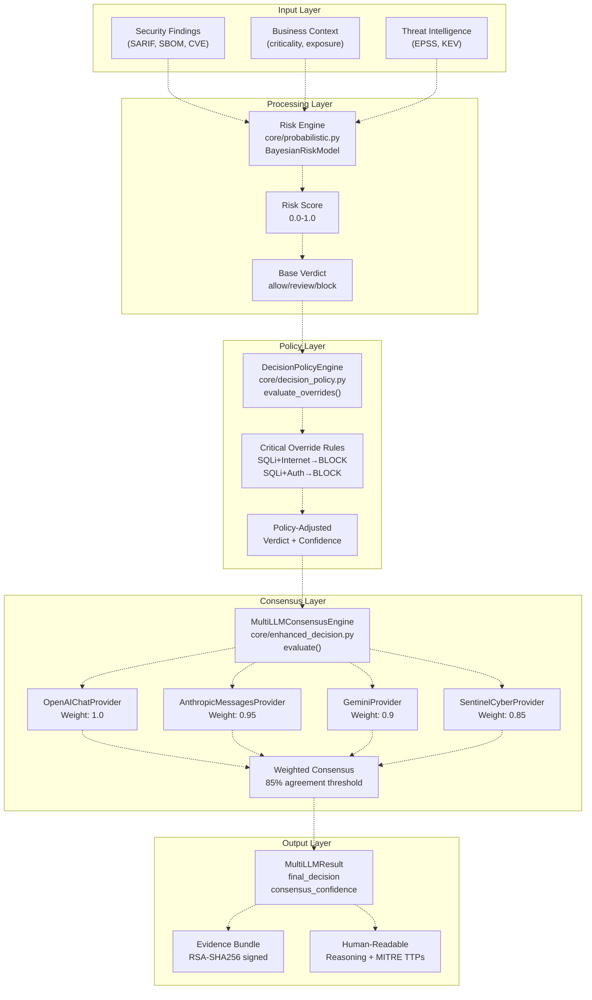
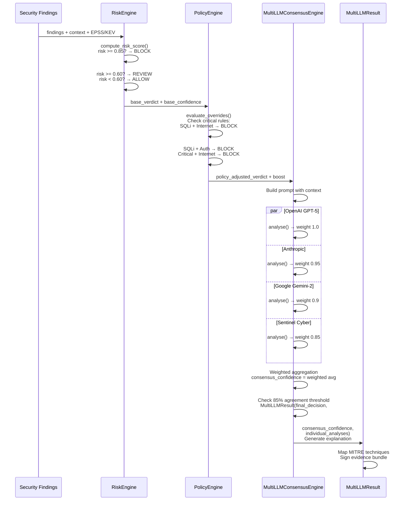
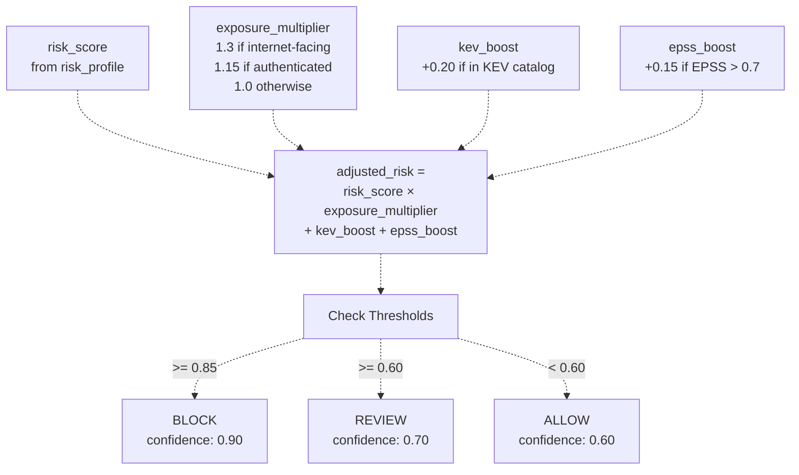

# Decision Engine

> **Relevant source files**
> * [README.md](https://github.com/DevOpsMadDog/Fixops/blob/ce6eb1e9/README.md)
> * [apps/api/micro_pentest_router.py](https://github.com/DevOpsMadDog/Fixops/blob/ce6eb1e9/apps/api/micro_pentest_router.py)
> * [backend_test.py](https://github.com/DevOpsMadDog/Fixops/blob/ce6eb1e9/backend_test.py)
> * [core/analytics.py](https://github.com/DevOpsMadDog/Fixops/blob/ce6eb1e9/core/analytics.py)
> * [core/compliance.py](https://github.com/DevOpsMadDog/Fixops/blob/ce6eb1e9/core/compliance.py)
> * [core/configuration.py](https://github.com/DevOpsMadDog/Fixops/blob/ce6eb1e9/core/configuration.py)
> * [core/decision_policy.py](https://github.com/DevOpsMadDog/Fixops/blob/ce6eb1e9/core/decision_policy.py)
> * [core/enhanced_decision.py](https://github.com/DevOpsMadDog/Fixops/blob/ce6eb1e9/core/enhanced_decision.py)
> * [core/llm_providers.py](https://github.com/DevOpsMadDog/Fixops/blob/ce6eb1e9/core/llm_providers.py)
> * [core/playbook_runner.py](https://github.com/DevOpsMadDog/Fixops/blob/ce6eb1e9/core/playbook_runner.py)
> * [demo_ssdlc_stages/03_code_development.json](https://github.com/DevOpsMadDog/Fixops/blob/ce6eb1e9/demo_ssdlc_stages/03_code_development.json)
> * [demo_ssdlc_stages/04_build_ci.yaml](https://github.com/DevOpsMadDog/Fixops/blob/ce6eb1e9/demo_ssdlc_stages/04_build_ci.yaml)
> * [demo_ssdlc_stages/06_deploy_production.yaml](https://github.com/DevOpsMadDog/Fixops/blob/ce6eb1e9/demo_ssdlc_stages/06_deploy_production.yaml)
> * [docs/API_CLI_REFERENCE.md](https://github.com/DevOpsMadDog/Fixops/blob/ce6eb1e9/docs/API_CLI_REFERENCE.md)
> * [docs/DOCKER_SHOWCASE_GUIDE.md](https://github.com/DevOpsMadDog/Fixops/blob/ce6eb1e9/docs/DOCKER_SHOWCASE_GUIDE.md)
> * [docs/ENTERPRISE_FEATURES.md](https://github.com/DevOpsMadDog/Fixops/blob/ce6eb1e9/docs/ENTERPRISE_FEATURES.md)
> * [docs/FEATURE_CODE_MAPPING.md](https://github.com/DevOpsMadDog/Fixops/blob/ce6eb1e9/docs/FEATURE_CODE_MAPPING.md)
> * [docs/PLAYBOOK_LANGUAGE_REFERENCE.md](https://github.com/DevOpsMadDog/Fixops/blob/ce6eb1e9/docs/PLAYBOOK_LANGUAGE_REFERENCE.md)
> * [fixops-enterprise/src/api/v1/micro_pentest.py](https://github.com/DevOpsMadDog/Fixops/blob/ce6eb1e9/fixops-enterprise/src/api/v1/micro_pentest.py)
> * [fixops-enterprise/src/services/micro_pentest_engine.py](https://github.com/DevOpsMadDog/Fixops/blob/ce6eb1e9/fixops-enterprise/src/services/micro_pentest_engine.py)
> * [tests/e2e/test_critical_decision_policy.py](https://github.com/DevOpsMadDog/Fixops/blob/ce6eb1e9/tests/e2e/test_critical_decision_policy.py)
> * [tests/test_comprehensive_e2e.py](https://github.com/DevOpsMadDog/Fixops/blob/ce6eb1e9/tests/test_comprehensive_e2e.py)
> * [tests/test_data_generator.py](https://github.com/DevOpsMadDog/Fixops/blob/ce6eb1e9/tests/test_data_generator.py)
> * [tests/test_enhanced_api.py](https://github.com/DevOpsMadDog/Fixops/blob/ce6eb1e9/tests/test_enhanced_api.py)
> * [tests/test_micro_pentest_engine.py](https://github.com/DevOpsMadDog/Fixops/blob/ce6eb1e9/tests/test_micro_pentest_engine.py)

## Purpose and Scope

The Decision Engine is the core system responsible for producing automated remediation decisions (Allow/Block/Review verdicts) with confidence scores for security findings. It combines multi-LLM consensus, policy-based overrides, risk scoring, and business context to generate actionable, explainable verdicts that can be used as automated release gates or manual triage guidance.

This page covers the overall decision-making architecture, verdict generation flow, and integration points. For details on specific subsystems:

* Multi-LLM consensus mechanics: see [Multi-LLM Consensus Engine](/DevOpsMadDog/Fixops/4.1-multi-llm-consensus-engine)
* Policy override rules: see [Decision Policy Engine](/DevOpsMadDog/Fixops/4.2-decision-policy-engine)
* Risk score computation: see [Risk-Based Profiling](/DevOpsMadDog/Fixops/4.3-risk-based-profiling)
* API endpoint details: see [Enhanced Decision Service](/DevOpsMadDog/Fixops/4.4-enhanced-decision-service)
* Non-LLM fallback logic: see [Deterministic Fallback Mode](/DevOpsMadDog/Fixops/4.5-deterministic-fallback-mode)

**Sources:** [README.md L1-L50](https://github.com/DevOpsMadDog/Fixops/blob/ce6eb1e9/README.md#L1-L50)

 [docs/FEATURE_CODE_MAPPING.md L570-L619](https://github.com/DevOpsMadDog/Fixops/blob/ce6eb1e9/docs/FEATURE_CODE_MAPPING.md#L570-L619)

---

## System Overview

The Decision Engine operates as a coordinated pipeline that processes security findings through multiple analysis layers before producing a final verdict. The system is designed to be transparent, auditable, and fail-closed by default.



**Architecture Notes:**

* **Risk Engine** computes a 0.0-1.0 risk score using Bayesian priors from EPSS data, Markov chain severity forecasting, and exposure multipliers
* **Policy Engine** enforces critical overrides before LLM consensus, ensuring high-risk combinations (e.g., internet-facing SQL injection) are always blocked
* **Consensus Layer** queries 4 LLM providers with weighted voting and requires 85% agreement threshold
* **Fail-Closed Design**: If all LLM providers fail, the system falls back to deterministic risk-based heuristics that default to blocking high-severity findings

**Sources:** [core/enhanced_decision.py L1-L50](https://github.com/DevOpsMadDog/Fixops/blob/ce6eb1e9/core/enhanced_decision.py#L1-L50)

 [README.md L122-L151](https://github.com/DevOpsMadDog/Fixops/blob/ce6eb1e9/README.md#L122-L151)

 [docs/FEATURE_CODE_MAPPING.md L570-L588](https://github.com/DevOpsMadDog/Fixops/blob/ce6eb1e9/docs/FEATURE_CODE_MAPPING.md#L570-L588)

---

## Decision Flow

### Stage-by-Stage Processing



**Key Decision Points:**

1. **Risk Threshold Logic** [core/enhanced_decision.py L278-L293](https://github.com/DevOpsMadDog/Fixops/blob/ce6eb1e9/core/enhanced_decision.py#L278-L293) : * Risk ≥ 0.85 → Base verdict: BLOCK * Risk ≥ 0.60 → Base verdict: REVIEW * Risk < 0.60 → Base verdict: ALLOW
2. **Policy Override Trigger** [core/decision_policy.py L67-L152](https://github.com/DevOpsMadDog/Fixops/blob/ce6eb1e9/core/decision_policy.py#L67-L152) : * Evaluated before LLM consensus * Can force BLOCK verdict regardless of risk score * Adds confidence boost (up to +0.99)
3. **Consensus Aggregation** [core/enhanced_decision.py L317-L395](https://github.com/DevOpsMadDog/Fixops/blob/ce6eb1e9/core/enhanced_decision.py#L317-L395) : * Weighted average of provider responses * Requires 85% agreement for high confidence * Falls back to policy verdict on split decisions

**Sources:** [core/enhanced_decision.py L242-L395](https://github.com/DevOpsMadDog/Fixops/blob/ce6eb1e9/core/enhanced_decision.py#L242-L395)

 [core/decision_policy.py L67-L152](https://github.com/DevOpsMadDog/Fixops/blob/ce6eb1e9/core/decision_policy.py#L67-L152)

---

## Core Components

### 1. MultiLLMConsensusEngine

**Class:** `MultiLLMConsensusEngine` [core/enhanced_decision.py L127-L622](https://github.com/DevOpsMadDog/Fixops/blob/ce6eb1e9/core/enhanced_decision.py#L127-L622)

**Responsibilities:**

* Orchestrates queries to 4 LLM providers with weighted voting
* Implements 85% consensus threshold validation
* Generates structured `MultiLLMResult` with confidence scores
* Provides MITRE ATT&CK technique mapping
* Falls back to deterministic mode when providers unavailable

**Key Methods:**

| Method | Purpose | File Location |
| --- | --- | --- |
| `evaluate()` | Main entry point for decision generation | [core/enhanced_decision.py L242-L395](https://github.com/DevOpsMadDog/Fixops/blob/ce6eb1e9/core/enhanced_decision.py#L242-L395) |
| `compare_providers()` | Returns individual provider analyses without aggregation | [core/enhanced_decision.py L397-L510](https://github.com/DevOpsMadDog/Fixops/blob/ce6eb1e9/core/enhanced_decision.py#L397-L510) |
| `_risk_based_profile()` | Computes risk score with exposure multipliers | [core/enhanced_decision.py L624-L746](https://github.com/DevOpsMadDog/Fixops/blob/ce6eb1e9/core/enhanced_decision.py#L624-L746) |
| `_base_profile()` | Heuristic fallback when risk engine disabled | [core/enhanced_decision.py L748-L804](https://github.com/DevOpsMadDog/Fixops/blob/ce6eb1e9/core/enhanced_decision.py#L748-L804) |
| `_aggregate_responses()` | Weighted consensus calculation | [core/enhanced_decision.py L806-L940](https://github.com/DevOpsMadDog/Fixops/blob/ce6eb1e9/core/enhanced_decision.py#L806-L940) |

**Provider Configuration:**

```
DEFAULT_PROVIDERS = (
    ProviderSpec("gpt-5", weight=1.0, style="strategist", focus=["mitre", "context"]),
    ProviderSpec("claude-3", weight=0.95, style="analyst", focus=["compliance", "guardrails"]),
    ProviderSpec("gemini-2", weight=0.9, style="signals", focus=["exploit", "cnapp"]),
    ProviderSpec("sentinel-cyber", weight=0.85, style="threat", focus=["marketplace", "agents"]),
)
```

Providers are enabled via environment variables:

* `FIXOPS_ENABLE_OPENAI` (default: true)
* `FIXOPS_ENABLE_ANTHROPIC` (default: true)
* `FIXOPS_ENABLE_GEMINI` (default: true)
* `FIXOPS_ENABLE_SENTINEL` (default: true)

If all providers are disabled, falls back to `DeterministicLLMProvider`.

**Sources:** [core/enhanced_decision.py L127-L210](https://github.com/DevOpsMadDog/Fixops/blob/ce6eb1e9/core/enhanced_decision.py#L127-L210)

 [core/enhanced_decision.py L242-L510](https://github.com/DevOpsMadDog/Fixops/blob/ce6eb1e9/core/enhanced_decision.py#L242-L510)

---

### 2. Decision Policy Engine

**Class:** `DecisionPolicyEngine` [core/decision_policy.py L23-L328](https://github.com/DevOpsMadDog/Fixops/blob/ce6eb1e9/core/decision_policy.py#L23-L328)

**Responsibilities:**

* Enforces critical override rules before LLM consensus
* Detects high-risk vulnerability combinations (SQL injection in internet-facing/auth services)
* Provides confidence boost for policy-triggered verdicts
* Generates structured `PolicyOverride` results with reasoning

**Critical Override Rules** [core/decision_policy.py L67-L152](https://github.com/DevOpsMadDog/Fixops/blob/ce6eb1e9/core/decision_policy.py#L67-L152)

:

| Condition | Action | Confidence Boost | Reasoning |
| --- | --- | --- | --- |
| SQL Injection + Internet-Facing | BLOCK | +0.15 | "SQL injection in internet-facing service creates immediate remote exploitation risk" |
| SQL Injection + Authentication Service | BLOCK | +0.15 | "SQL injection in authentication path can bypass access controls" |
| Critical Severity + Internet-Facing | BLOCK | +0.10 | "Critical severity vulnerability in internet-facing service requires immediate remediation" |
| Authentication Bypass + Internet-Facing | BLOCK | +0.12 | "Authentication bypass in internet-facing service enables unauthorized access" |

**Key Method:**

```python
def evaluate_overrides(
    self,
    *,
    base_verdict: str,
    base_confidence: float,
    severity: str,
    exposures: Sequence[str],
    context_summary: Mapping[str, Any],
    finding_metadata: Mapping[str, Any]
) -> PolicyOverride:
    """
    Evaluate policy rules and return override if triggered.
    
    Returns PolicyOverride with:
    - triggered: bool (whether any rule matched)
    - new_verdict: Optional[str] (override verdict if triggered)
    - confidence_boost: float (added to base_confidence)
    - reasoning: str (explanation of override)
    """
```

**Detection Logic:**

1. Extract CWE IDs from `finding_metadata` [core/decision_policy.py L92-L95](https://github.com/DevOpsMadDog/Fixops/blob/ce6eb1e9/core/decision_policy.py#L92-L95)
2. Check for SQL injection indicators: CWE-89, rule IDs containing "sql", "sqli", "injection" [core/decision_policy.py L97-L110](https://github.com/DevOpsMadDog/Fixops/blob/ce6eb1e9/core/decision_policy.py#L97-L110)
3. Check exposure traits: "internet", "public", "external" in `exposures` list [core/decision_policy.py L112-L115](https://github.com/DevOpsMadDog/Fixops/blob/ce6eb1e9/core/decision_policy.py#L112-L115)
4. Check service type: "auth", "authentication", "login" in context [core/decision_policy.py L117-L120](https://github.com/DevOpsMadDog/Fixops/blob/ce6eb1e9/core/decision_policy.py#L117-L120)
5. Apply highest-priority matching rule [core/decision_policy.py L122-L152](https://github.com/DevOpsMadDog/Fixops/blob/ce6eb1e9/core/decision_policy.py#L122-L152)

**Sources:** [core/decision_policy.py L23-L152](https://github.com/DevOpsMadDog/Fixops/blob/ce6eb1e9/core/decision_policy.py#L23-L152)

 [tests/e2e/test_critical_decision_policy.py L1-L50](https://github.com/DevOpsMadDog/Fixops/blob/ce6eb1e9/tests/e2e/test_critical_decision_policy.py#L1-L50)

---

### 3. LLM Provider Adapters

**Base Class:** `BaseLLMProvider` [core/llm_providers.py L27-L67](https://github.com/DevOpsMadDog/Fixops/blob/ce6eb1e9/core/llm_providers.py#L27-L67)

**Provider Implementations:**

| Provider | Class | Model | API Key Env | File Location |
| --- | --- | --- | --- | --- |
| OpenAI GPT | `OpenAIChatProvider` | gpt-4o-mini | OPENAI_API_KEY | [core/llm_providers.py L73-L212](https://github.com/DevOpsMadDog/Fixops/blob/ce6eb1e9/core/llm_providers.py#L73-L212) |
| Anthropic Claude | `AnthropicMessagesProvider` | claude-3-5-sonnet-20241022 | ANTHROPIC_API_KEY | [core/llm_providers.py L215-L352](https://github.com/DevOpsMadDog/Fixops/blob/ce6eb1e9/core/llm_providers.py#L215-L352) |
| Google Gemini | `GeminiProvider` | gemini-2.0-flash-exp | GOOGLE_API_KEY | [core/llm_providers.py L355-L468](https://github.com/DevOpsMadDog/Fixops/blob/ce6eb1e9/core/llm_providers.py#L355-L468) |
| Sentinel Cyber | `SentinelCyberProvider` | sentinel-model | SENTINEL_API_KEY | [core/llm_providers.py L471-L552](https://github.com/DevOpsMadDog/Fixops/blob/ce6eb1e9/core/llm_providers.py#L471-L552) |
| Deterministic | `DeterministicLLMProvider` | N/A | None | [core/llm_providers.py L69-L70](https://github.com/DevOpsMadDog/Fixops/blob/ce6eb1e9/core/llm_providers.py#L69-L70) |

**Provider Interface:**

```python
def analyse(
    self,
    *,
    prompt: str,                          # Decision context prompt
    context: Mapping[str, Any],           # Finding metadata
    default_action: str,                  # Fallback verdict
    default_confidence: float,            # Fallback confidence
    default_reasoning: str,               # Fallback explanation
    mitigation_hints: Mapping[str, Any]   # MITRE/compliance suggestions
) -> LLMResponse:
    """
    Query LLM provider and return structured response.
    
    Returns LLMResponse with:
    - recommended_action: str (allow/review/block)
    - confidence: float (0.0-1.0)
    - reasoning: str (natural language explanation)
    - mitre_techniques: List[str] (MITRE ATT&CK IDs)
    - compliance_concerns: List[str] (framework violations)
    - attack_vectors: List[str] (exploitation methods)
    - metadata: Dict[str, Any] (provider-specific info)
    """
```

**Response Parsing** [core/llm_providers.py L147-L185](https://github.com/DevOpsMadDog/Fixops/blob/ce6eb1e9/core/llm_providers.py#L147-L185)

:

Each provider implementation extracts structured JSON from LLM responses and maps to the unified `LLMResponse` format. Parsing handles:

* JSON extraction from markdown code blocks
* Validation of required fields (recommended_action, confidence, reasoning)
* Normalization of action names (accept→allow, reject→block, delegate→review)
* Confidence clamping to [0.0, 1.0] range

**Sources:** [core/llm_providers.py L1-L552](https://github.com/DevOpsMadDog/Fixops/blob/ce6eb1e9/core/llm_providers.py#L1-L552)

 [core/enhanced_decision.py L1-L29](https://github.com/DevOpsMadDog/Fixops/blob/ce6eb1e9/core/enhanced_decision.py#L1-L29)

---

### 4. Risk-Based Profiling

**Method:** `_risk_based_profile()` [core/enhanced_decision.py L624-L746](https://github.com/DevOpsMadDog/Fixops/blob/ce6eb1e9/core/enhanced_decision.py#L624-L746)

The risk-based profiling system computes a base verdict using a combination of:

* Raw risk score (0.0-1.0) from Bayesian/Markov models
* Exposure multipliers for internet-facing services
* KEV (Known Exploited Vulnerabilities) status
* Severity escalation based on EPSS scores

**Risk Score Calculation:**



**Exposure Multiplier Logic** [core/enhanced_decision.py L672-L692](https://github.com/DevOpsMadDog/Fixops/blob/ce6eb1e9/core/enhanced_decision.py#L672-L692)

:

| Exposure Type | Multiplier | Detection Logic |
| --- | --- | --- |
| Internet-Facing | 1.3 | "internet" or "public" in exposures list |
| Authenticated Services | 1.15 | "authenticated" or "requires_auth" in exposures |
| Internal/Isolated | 1.0 | Default (no exposure traits detected) |

**MITRE Technique Mapping** [core/enhanced_decision.py L32-L58](https://github.com/DevOpsMadDog/Fixops/blob/ce6eb1e9/core/enhanced_decision.py#L32-L58)

:

The risk profiler suggests MITRE ATT&CK techniques based on context:

```css
_MITRE_LIBRARY = {
    "T1190": {
        "name": "Exploit Public-Facing Application",
        "tactic": "initial_access",
        "description": "Adversaries exploit internet exposed surfaces"
    },
    "T1059": {
        "name": "Command and Scripting Interpreter",
        "tactic": "execution",
        "description": "Remote code execution via SQLi/RCE defects"
    },
    # ... additional techniques
}
```

**Sources:** [core/enhanced_decision.py L624-L746](https://github.com/DevOpsMadDog/Fixops/blob/ce6eb1e9/core/enhanced_decision.py#L624-L746)

 [core/enhanced_decision.py L32-L58](https://github.com/DevOpsMadDog/Fixops/blob/ce6eb1e9/core/enhanced_decision.py#L32-L58)

 [core/probabilistic.py L1-L50](https://github.com/DevOpsMadDog/Fixops/blob/ce6eb1e9/core/probabilistic.py#L1-L50)

---

## Decision Verdicts

### Verdict Types

| Verdict | Exit Code | Confidence Range | Use Case |
| --- | --- | --- | --- |
| `allow` | 0 | 0.60-0.84 | Finding deemed not exploitable in current context; safe to deploy |
| `review` | 0 | 0.50-0.59 | Mixed signals or borderline risk; manual review recommended |
| `block` | 1 | 0.85-1.00 | Critical risk or policy violation; deployment should be blocked |

**Exit Code Mapping** [core/cli.py L448-L470](https://github.com/DevOpsMadDog/Fixops/blob/ce6eb1e9/core/cli.py#L448-L470)

:

When using CLI mode (`python -m core.cli run` or `make-decision`), the exit code reflects the verdict:

* Exit 0: ALLOW or REVIEW verdicts (deployment proceeds)
* Exit 1: BLOCK verdict (deployment halted)
* Exit 2: Pipeline execution error

### MultiLLMResult Structure

**Class:** `MultiLLMResult` [core/enhanced_decision.py L99-L125](https://github.com/DevOpsMadDog/Fixops/blob/ce6eb1e9/core/enhanced_decision.py#L99-L125)

```python
@dataclass
class MultiLLMResult:
    final_decision: str                      # "allow" | "review" | "block"
    consensus_confidence: float              # 0.0-1.0, weighted average
    method: str                              # "multi_llm" | "deterministic"
    individual_analyses: List[ModelAnalysis] # Per-provider results
    disagreement_areas: List[str]            # Conflicting recommendations
    expert_validation_required: bool         # True if confidence < 0.7
    summary: str                             # Natural language explanation
    telemetry: Dict[str, Any]                # Execution metrics
    signals: Dict[str, Any]                  # EPSS, KEV, exposure data
```

**Individual Provider Analysis:**

Each `ModelAnalysis` contains [core/enhanced_decision.py L70-L97](https://github.com/DevOpsMadDog/Fixops/blob/ce6eb1e9/core/enhanced_decision.py#L70-L97)

:

* `provider`: Provider name (e.g., "gpt-5")
* `recommended_action`: Provider's verdict
* `confidence`: Provider's confidence score
* `reasoning`: Natural language explanation
* `mitre_techniques`: List of MITRE ATT&CK IDs
* `attack_vectors`: List of exploitation methods
* `compliance_concerns`: List of framework violations
* `processing_time_ms`: Provider response latency
* `cost_usd`: Estimated API cost

**Sources:** [core/enhanced_decision.py L70-L125](https://github.com/DevOpsMadDog/Fixops/blob/ce6eb1e9/core/enhanced_decision.py#L70-L125)

 [core/cli.py L448-L470](https://github.com/DevOpsMadDog/Fixops/blob/ce6eb1e9/core/cli.py#L448-L470)

---

## Configuration

### Overlay Configuration

Decision Engine behavior is controlled via `config/fixops.overlay.yml` [core/configuration.py L1-L50](https://github.com/DevOpsMadDog/Fixops/blob/ce6eb1e9/core/configuration.py#L1-L50)

:

```yaml
decision:
  # Risk engine toggle
  use_risk_engine: true
  
  # Policy pre-consensus toggle
  policy_pre_consensus: true
  
  # Risk thresholds
  risk_block_threshold: 0.85
  risk_review_threshold: 0.60
  
  # Consensus threshold
  consensus_threshold: 0.85

enhanced_decision:
  baseline_confidence: 0.78
  
  providers:
    - name: "gpt-5"
      weight: 1.0
      style: "strategist"
      focus: ["mitre", "context"]
    
    - name: "claude-3"
      weight: 0.95
      style: "analyst"
      focus: ["compliance", "guardrails"]
    
    - name: "gemini-2"
      weight: 0.9
      style: "signals"
      focus: ["exploit", "cnapp"]
    
    - name: "sentinel-cyber"
      weight: 0.85
      style: "threat"
      focus: ["marketplace", "agents"]
```

**Configuration Parameters:**

| Parameter | Type | Default | Purpose |
| --- | --- | --- | --- |
| `use_risk_engine` | bool | true | Enable Bayesian/Markov risk scoring |
| `policy_pre_consensus` | bool | true | Apply policy overrides before LLM consensus |
| `risk_block_threshold` | float | 0.85 | Risk score threshold for BLOCK verdict |
| `risk_review_threshold` | float | 0.60 | Risk score threshold for REVIEW verdict |
| `consensus_threshold` | float | 0.85 | Required agreement percentage for high confidence |
| `baseline_confidence` | float | 0.78 | Default confidence when providers unavailable |

**Environment Variables:**

| Variable | Default | Purpose |
| --- | --- | --- |
| `FIXOPS_ENABLE_OPENAI` | true | Enable OpenAI GPT provider |
| `FIXOPS_ENABLE_ANTHROPIC` | true | Enable Anthropic Claude provider |
| `FIXOPS_ENABLE_GEMINI` | true | Enable Google Gemini provider |
| `FIXOPS_ENABLE_SENTINEL` | true | Enable Sentinel Cyber provider |
| `OPENAI_API_KEY` | None | OpenAI API key |
| `ANTHROPIC_API_KEY` | None | Anthropic API key |
| `GOOGLE_API_KEY` | None | Google API key |
| `SENTINEL_API_KEY` | None | Sentinel API key |

**Sources:** [core/configuration.py L1-L136](https://github.com/DevOpsMadDog/Fixops/blob/ce6eb1e9/core/configuration.py#L1-L136)

 [core/enhanced_decision.py L148-L210](https://github.com/DevOpsMadDog/Fixops/blob/ce6eb1e9/core/enhanced_decision.py#L148-L210)

---

## API Endpoints

### Enhanced Decision Router

**Router:** [apps/api/routes/enhanced.py L1-L110](https://github.com/DevOpsMadDog/Fixops/blob/ce6eb1e9/apps/api/routes/enhanced.py#L1-L110)

| Endpoint | Method | Purpose | Request | Response |
| --- | --- | --- | --- | --- |
| `/api/v1/enhanced/analysis` | POST | Run full decision analysis | `{ "service_name", "security_findings", "business_context" }` | `MultiLLMResult` |
| `/api/v1/enhanced/compare-llms` | POST | Compare individual provider responses | Same as above | `{ "providers": [ModelAnalysis], "disagreements": [...] }` |
| `/api/v1/enhanced/capabilities` | GET | List enabled providers and features | None | `{ "providers": [...], "features": {...} }` |
| `/api/v1/enhanced/signals` | GET | Get EPSS/KEV/exploit signals | `?cve_id=CVE-2024-1234` | `{ "epss_score", "in_kev", "exploit_db_entries" }` |

**Example Request** (POST `/api/v1/enhanced/compare-llms`):

```json
{
  "service_name": "payment-service",
  "environment": "production",
  "business_context": {
    "criticality": "high",
    "data_classification": "pci",
    "exposure": "internet-facing"
  },
  "security_findings": [
    {
      "rule_id": "SQL_INJECTION_001",
      "title": "SQL Injection in authentication handler",
      "severity": "high",
      "category": "injection",
      "file_path": "/src/auth/login.py",
      "line_number": 42,
      "cwe": ["CWE-89"]
    }
  ]
}
```

**Example Response:**

```
{
  "final_decision": "block",
  "consensus_confidence": 0.93,
  "method": "multi_llm",
  "summary": "BLOCK verdict triggered by policy override: SQL injection in internet-facing authentication service creates immediate remote exploitation risk. All providers agree on blocking.",
  "individual_analyses": [
    {
      "provider": "gpt-5",
      "recommended_action": "block",
      "confidence": 0.95,
      "reasoning": "SQL injection in authentication path with internet exposure represents critical security risk",
      "mitre_techniques": ["T1190", "T1059"],
      "attack_vectors": ["sql_injection", "authentication_bypass"],
      "compliance_concerns": ["PCI-DSS 6.5.1", "OWASP A03:2021"]
    },
    {
      "provider": "claude-3",
      "recommended_action": "block",
      "confidence": 0.92,
      "reasoning": "High severity finding in critical authentication service requires immediate remediation",
      "mitre_techniques": ["T1078", "T1003"],
      "compliance_concerns": ["SOC2 CC6.1", "ISO27001 A.14.2.5"]
    }
    // ... other providers
  ],
  "disagreement_areas": ["policy_override: forced block despite low EPSS score"],
  "expert_validation_required": false,
  "telemetry": {
    "total_processing_time_ms": 3247,
    "providers_queried": 4,
    "providers_succeeded": 4
  }
}
```

**Sources:** [apps/api/routes/enhanced.py L1-L110](https://github.com/DevOpsMadDog/Fixops/blob/ce6eb1e9/apps/api/routes/enhanced.py#L1-L110)

 [docs/API_CLI_REFERENCE.md L63-L83](https://github.com/DevOpsMadDog/Fixops/blob/ce6eb1e9/docs/API_CLI_REFERENCE.md#L63-L83)

---

## CLI Commands

### Decision Generation

**Command:** `python -m core.cli run` [core/cli.py L448-L620](https://github.com/DevOpsMadDog/Fixops/blob/ce6eb1e9/core/cli.py#L448-L620)

Executes the full pipeline with decision generation:

```markdown
# Full pipeline with overlay configuration
python -m core.cli run \
  --overlay config/fixops.overlay.yml \
  --design samples/design.csv \
  --sbom samples/sbom.json \
  --sarif samples/scan.sarif \
  --output results.json

# Exit code indicates verdict:
# 0 = allow/review
# 1 = block
# 2 = error
```

**Command:** `python -m core.cli make-decision` [core/cli.py L448-L470](https://github.com/DevOpsMadDog/Fixops/blob/ce6eb1e9/core/cli.py#L448-L470)

Generate decision from existing findings:

```markdown
python -m core.cli make-decision \
  --input findings.json \
  --policy critical-only

# Returns exit code based on verdict
```

**Command:** `python -m core.cli analyze` [core/cli.py L471-L547](https://github.com/DevOpsMadDog/Fixops/blob/ce6eb1e9/core/cli.py#L471-L547)

Quick analysis with verdict output:

```
python -m core.cli analyze \
  --input findings.json \
  --format json
```

**Output Structure:**

All decision commands produce JSON output with:

* `verdict`: Final decision (allow/review/block)
* `confidence`: Consensus confidence score
* `evidence_id`: Reference to signed evidence bundle
* `enhanced_decision`: Full `MultiLLMResult` object
* `reasoning`: Natural language explanation
* `mitre_techniques`: List of relevant MITRE ATT&CK IDs
* `compliance_concerns`: List of framework violations

**Sources:** [core/cli.py L448-L620](https://github.com/DevOpsMadDog/Fixops/blob/ce6eb1e9/core/cli.py#L448-L620)

 [docs/DOCKER_SHOWCASE_GUIDE.md L189-L215](https://github.com/DevOpsMadDog/Fixops/blob/ce6eb1e9/docs/DOCKER_SHOWCASE_GUIDE.md#L189-L215)

---

## Key Code References

### Primary Files

| File | LOC | Key Classes/Functions | Purpose |
| --- | --- | --- | --- |
| [core/enhanced_decision.py](https://github.com/DevOpsMadDog/Fixops/blob/ce6eb1e9/core/enhanced_decision.py) | 1,279 | `MultiLLMConsensusEngine`, `MultiLLMResult`, `ModelAnalysis` | Main decision orchestration |
| [core/decision_policy.py](https://github.com/DevOpsMadDog/Fixops/blob/ce6eb1e9/core/decision_policy.py) | 328 | `DecisionPolicyEngine`, `PolicyOverride` | Critical override rules |
| [core/llm_providers.py](https://github.com/DevOpsMadDog/Fixops/blob/ce6eb1e9/core/llm_providers.py) | 659 | `OpenAIChatProvider`, `AnthropicMessagesProvider`, `GeminiProvider`, `SentinelCyberProvider` | LLM provider adapters |
| [core/configuration.py](https://github.com/DevOpsMadDog/Fixops/blob/ce6eb1e9/core/configuration.py) | 1,200+ | `OverlayConfig`, overlay parsing | Configuration loading and validation |
| [apps/api/routes/enhanced.py](https://github.com/DevOpsMadDog/Fixops/blob/ce6eb1e9/apps/api/routes/enhanced.py) | 110 | Enhanced decision API endpoints | HTTP API for decision generation |

### Decision Flow Methods

| Method | File | Line Range | Purpose |
| --- | --- | --- | --- |
| `evaluate()` | core/enhanced_decision.py | 242-395 | Main decision entry point |
| `evaluate_overrides()` | core/decision_policy.py | 67-152 | Policy rule evaluation |
| `_risk_based_profile()` | core/enhanced_decision.py | 624-746 | Risk-based verdict computation |
| `_aggregate_responses()` | core/enhanced_decision.py | 806-940 | Consensus calculation |
| `compare_providers()` | core/enhanced_decision.py | 397-510 | Individual provider comparison |

### Test Coverage

| Test File | LOC | Coverage Area |
| --- | --- | --- |
| [tests/e2e/test_critical_decision_policy.py](https://github.com/DevOpsMadDog/Fixops/blob/ce6eb1e9/tests/e2e/test_critical_decision_policy.py) | 500+ | Policy override E2E tests |
| [tests/test_enhanced_api.py](https://github.com/DevOpsMadDog/Fixops/blob/ce6eb1e9/tests/test_enhanced_api.py) | 150+ | Enhanced decision API tests |
| [tests/test_comprehensive_e2e.py](https://github.com/DevOpsMadDog/Fixops/blob/ce6eb1e9/tests/test_comprehensive_e2e.py) | 300+ | Full pipeline decision tests |
| [backend_test.py](https://github.com/DevOpsMadDog/Fixops/blob/ce6eb1e9/backend_test.py) | 600+ | Decision engine integration tests |

**Sources:** [core/enhanced_decision.py L1-L50](https://github.com/DevOpsMadDog/Fixops/blob/ce6eb1e9/core/enhanced_decision.py#L1-L50)

 [core/decision_policy.py L1-L50](https://github.com/DevOpsMadDog/Fixops/blob/ce6eb1e9/core/decision_policy.py#L1-L50)

 [core/llm_providers.py L1-L50](https://github.com/DevOpsMadDog/Fixops/blob/ce6eb1e9/core/llm_providers.py#L1-L50)

 [apps/api/routes/enhanced.py L1-L50](https://github.com/DevOpsMadDog/Fixops/blob/ce6eb1e9/apps/api/routes/enhanced.py#L1-L50)