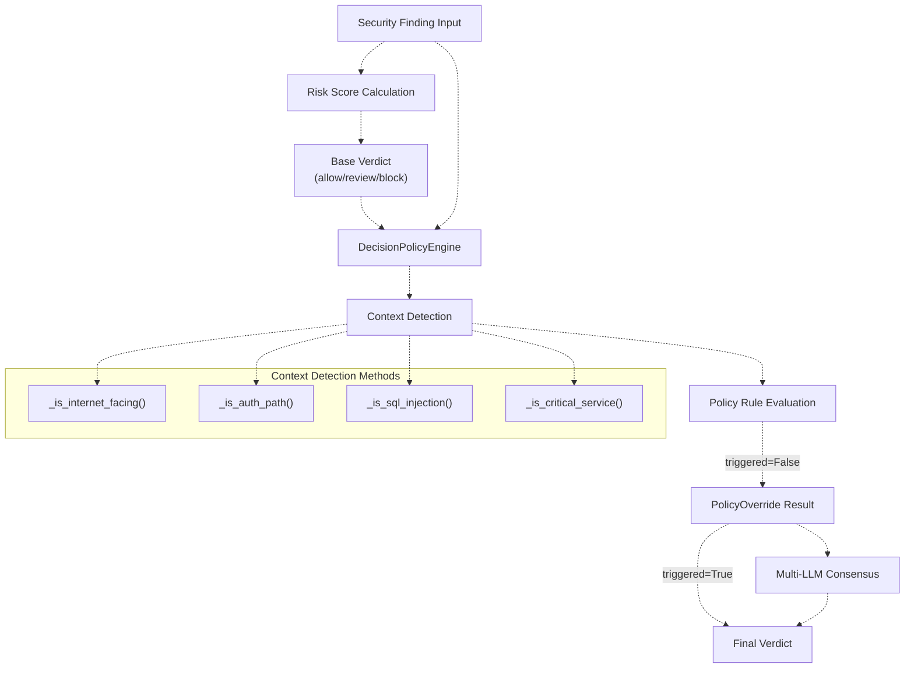
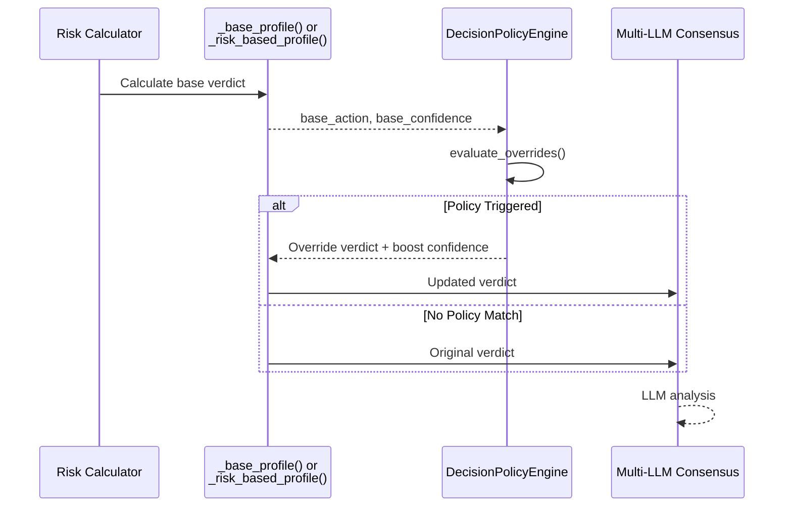
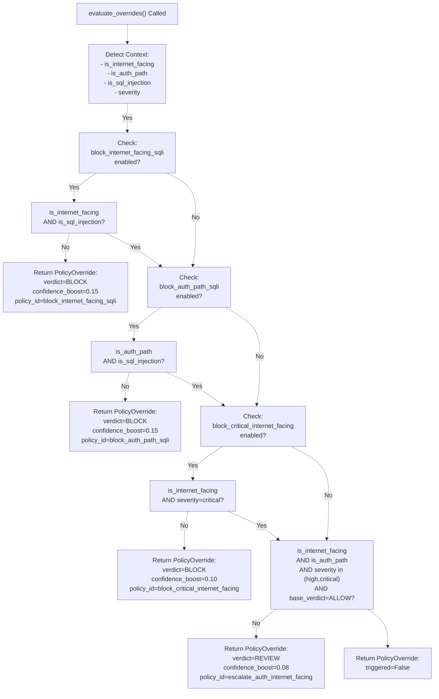

# Decision Policy Engine

> **Relevant source files**
> * [backend_test.py](https://github.com/DevOpsMadDog/Fixops/blob/ce6eb1e9/backend_test.py)
> * [core/analytics.py](https://github.com/DevOpsMadDog/Fixops/blob/ce6eb1e9/core/analytics.py)
> * [core/compliance.py](https://github.com/DevOpsMadDog/Fixops/blob/ce6eb1e9/core/compliance.py)
> * [core/configuration.py](https://github.com/DevOpsMadDog/Fixops/blob/ce6eb1e9/core/configuration.py)
> * [core/decision_policy.py](https://github.com/DevOpsMadDog/Fixops/blob/ce6eb1e9/core/decision_policy.py)
> * [core/enhanced_decision.py](https://github.com/DevOpsMadDog/Fixops/blob/ce6eb1e9/core/enhanced_decision.py)
> * [core/llm_providers.py](https://github.com/DevOpsMadDog/Fixops/blob/ce6eb1e9/core/llm_providers.py)
> * [demo_ssdlc_stages/03_code_development.json](https://github.com/DevOpsMadDog/Fixops/blob/ce6eb1e9/demo_ssdlc_stages/03_code_development.json)
> * [demo_ssdlc_stages/04_build_ci.yaml](https://github.com/DevOpsMadDog/Fixops/blob/ce6eb1e9/demo_ssdlc_stages/04_build_ci.yaml)
> * [demo_ssdlc_stages/06_deploy_production.yaml](https://github.com/DevOpsMadDog/Fixops/blob/ce6eb1e9/demo_ssdlc_stages/06_deploy_production.yaml)
> * [tests/e2e/test_critical_decision_policy.py](https://github.com/DevOpsMadDog/Fixops/blob/ce6eb1e9/tests/e2e/test_critical_decision_policy.py)
> * [tests/test_comprehensive_e2e.py](https://github.com/DevOpsMadDog/Fixops/blob/ce6eb1e9/tests/test_comprehensive_e2e.py)
> * [tests/test_data_generator.py](https://github.com/DevOpsMadDog/Fixops/blob/ce6eb1e9/tests/test_data_generator.py)
> * [tests/test_enhanced_api.py](https://github.com/DevOpsMadDog/Fixops/blob/ce6eb1e9/tests/test_enhanced_api.py)

## Purpose and Scope

The Decision Policy Engine provides rule-based overrides for security decisions to ensure that critical vulnerability combinations receive appropriate verdicts regardless of probabilistic risk scores or LLM consensus. This module enforces deterministic security policies for high-risk scenarios such as internet-facing SQL injection in authentication services.

For information about the broader decision-making system, see [Decision Engine](/DevOpsMadDog/Fixops/4-decision-engine). For risk-based scoring that feeds into policy evaluation, see [Risk-Based Profiling](/DevOpsMadDog/Fixops/4.3-risk-based-profiling). For multi-LLM consensus that occurs after policy checks, see [Multi-LLM Consensus Engine](/DevOpsMadDog/Fixops/4.1-multi-llm-consensus-engine).

**Sources:** [core/decision_policy.py L1-L8](https://github.com/DevOpsMadDog/Fixops/blob/ce6eb1e9/core/decision_policy.py#L1-L8)

---

## Architecture Overview

The Decision Policy Engine operates as a gatekeeper within the decision pipeline, applying hard-coded security rules before multi-LLM consensus or after initial risk scoring. It can override base verdicts (ALLOW → REVIEW, REVIEW → BLOCK) when critical vulnerability-context combinations are detected.



**Sources:** [core/decision_policy.py L29-L68](https://github.com/DevOpsMadDog/Fixops/blob/ce6eb1e9/core/decision_policy.py#L29-L68)

 [core/enhanced_decision.py L227-L228](https://github.com/DevOpsMadDog/Fixops/blob/ce6eb1e9/core/enhanced_decision.py#L227-L228)

 [core/enhanced_decision.py L294-L315](https://github.com/DevOpsMadDog/Fixops/blob/ce6eb1e9/core/enhanced_decision.py#L294-L315)

---

## Policy Override Rules

The engine implements three primary override policies, each with configurable enable/disable flags:

### 1. Block Internet-Facing SQL Injection

**Rule ID:** `block_internet_facing_sqli`
**Trigger Conditions:**

* Vulnerability type: SQL Injection (CWE-89, CWE-564)
* Exposure: Internet-facing service
* Current verdict: Not already BLOCK

**Action:** Override verdict to BLOCK with +0.15 confidence boost

**Sources:** [core/decision_policy.py L107-L119](https://github.com/DevOpsMadDog/Fixops/blob/ce6eb1e9/core/decision_policy.py#L107-L119)

---

### 2. Block Authentication Path SQL Injection

**Rule ID:** `block_auth_path_sqli`
**Trigger Conditions:**

* Vulnerability type: SQL Injection
* Service type: Authentication path (detected via keywords: auth, login, signin, password, credential, token)
* Current verdict: Not already BLOCK

**Action:** Override verdict to BLOCK with +0.15 confidence boost

**Sources:** [core/decision_policy.py L121-L133](https://github.com/DevOpsMadDog/Fixops/blob/ce6eb1e9/core/decision_policy.py#L121-L133)

---

### 3. Block Critical Internet-Facing Vulnerabilities

**Rule ID:** `block_critical_internet_facing`
**Trigger Conditions:**

* Severity: Critical
* Exposure: Internet-facing
* Current verdict: Not already BLOCK

**Action:** Override verdict to BLOCK with +0.10 confidence boost

**Sources:** [core/decision_policy.py L135-L147](https://github.com/DevOpsMadDog/Fixops/blob/ce6eb1e9/core/decision_policy.py#L135-L147)

---

### 4. Escalate High-Severity Auth + Internet

**Rule ID:** `escalate_auth_internet_facing`
**Trigger Conditions:**

* Severity: High or Critical
* Exposure: Internet-facing AND authentication path
* Current verdict: ALLOW

**Action:** Escalate verdict to REVIEW with +0.08 confidence boost

**Sources:** [core/decision_policy.py L149-L161](https://github.com/DevOpsMadDog/Fixops/blob/ce6eb1e9/core/decision_policy.py#L149-L161)

---

## Context Detection Logic

The policy engine employs multiple detection strategies to identify critical service contexts:

### Internet-Facing Detection

The `_is_internet_facing()` method checks multiple data sources:

| Source | Detection Method |
| --- | --- |
| CNAPP Exposures | Checks `type` field for "internet" or "public" keywords |
| Exposure Traits | Scans `traits` array for "internet" or "public" strings |
| Context Summary | Examines `exposure` field in service metadata |
| Service Metadata | Checks nested `service.exposure` property |

**Sources:** [core/decision_policy.py L203-L233](https://github.com/DevOpsMadDog/Fixops/blob/ce6eb1e9/core/decision_policy.py#L203-L233)

---

### Authentication Path Detection

The `_is_auth_path()` method scans finding metadata and context for authentication-related keywords:

**Keywords:** auth, login, signin, password, credential, token

**Scanned Fields:**

* `finding_metadata.location`
* `finding_metadata.file`
* `finding_metadata.service`
* `context_summary.service_name`
* `context_summary.service_type`

**Sources:** [core/decision_policy.py L235-L282](https://github.com/DevOpsMadDog/Fixops/blob/ce6eb1e9/core/decision_policy.py#L235-L282)

---

### SQL Injection Detection

The `_is_sql_injection()` method identifies SQL injection vulnerabilities via:

| Detection Method | Examples |
| --- | --- |
| CWE IDs | CWE-89, CWE-564 |
| Vulnerability Type | "sql injection", "sqli" |
| Rule IDs | "sql-injection", "sqli-*" pattern |
| Message Content | Keyword matching in vulnerability description |

**Sources:** [core/decision_policy.py L284-L308](https://github.com/DevOpsMadDog/Fixops/blob/ce6eb1e9/core/decision_policy.py#L284-L308)

---

### Critical Service Detection

The `_is_critical_service()` method examines context metadata:

**Scanned Fields:**

* `context_summary.criticality` → "critical"
* `context_summary.service.criticality` → "critical"
* `context_summary.tier` → "tier1", "tier-1"

**Sources:** [core/decision_policy.py L310-L335](https://github.com/DevOpsMadDog/Fixops/blob/ce6eb1e9/core/decision_policy.py#L310-L335)

---

## Risk Multipliers

The policy engine calculates exposure multipliers that amplify base risk scores. These multipliers are applied in the risk-based decision flow when `use_risk_engine=True`.

### Multiplier Table

| Context | Default Multiplier | Configuration Key |
| --- | --- | --- |
| Internet-Facing | 3.0x | `internet_facing_multiplier` |
| Authentication Path | 2.0x | `auth_path_multiplier` |
| Critical Service | 1.5x | `critical_service_multiplier` |

**Calculation Method:**

```
final_multiplier = 1.0
if internet_facing: final_multiplier *= 3.0
if auth_path: final_multiplier *= 2.0
if critical_service: final_multiplier *= 1.5

adjusted_risk = base_risk * final_multiplier
```

**Example:** A vulnerability with base risk 0.60 in an internet-facing authentication service:

```
adjusted_risk = 0.60 × 3.0 × 2.0 = 3.60 (capped at risk thresholds)
```

**Sources:** [core/decision_policy.py L165-L201](https://github.com/DevOpsMadDog/Fixops/blob/ce6eb1e9/core/decision_policy.py#L165-L201)

 [core/decision_policy.py L51-L59](https://github.com/DevOpsMadDog/Fixops/blob/ce6eb1e9/core/decision_policy.py#L51-L59)

---

## Integration with Decision Pipeline

The policy engine integrates at two stages in the decision pipeline:

### Pre-Consensus Policy Evaluation



**Control Flag:** `policy_pre_consensus` (default: `True`)

When enabled, policy evaluation occurs before LLM providers are consulted, ensuring deterministic overrides for critical scenarios.

**Sources:** [core/enhanced_decision.py L229-L232](https://github.com/DevOpsMadDog/Fixops/blob/ce6eb1e9/core/enhanced_decision.py#L229-L232)

 [core/enhanced_decision.py L294-L315](https://github.com/DevOpsMadDog/Fixops/blob/ce6eb1e9/core/enhanced_decision.py#L294-L315)

---

### Post-Override Consensus Flow

After a policy override:

1. **Verdict Update:** Base action is replaced with policy-mandated verdict
2. **Confidence Boost:** Base confidence increased by policy-specific boost value
3. **Disagreement Tracking:** Policy override ID added to `disagreement_areas`
4. **Summary Annotation:** Policy reason appended to decision summary

**Example Disagreement Entry:**

```yaml
disagreement_areas: ["policy_override:block_internet_facing_sqli"]
```

**Sources:** [core/enhanced_decision.py L452-L454](https://github.com/DevOpsMadDog/Fixops/blob/ce6eb1e9/core/enhanced_decision.py#L452-L454)

 [core/enhanced_decision.py L464-L469](https://github.com/DevOpsMadDog/Fixops/blob/ce6eb1e9/core/enhanced_decision.py#L464-L469)

---

## Configuration Options

The policy engine accepts configuration via the `decision_policy` key in overlay configuration:

### Configuration Schema

```yaml
decision_policy:
  # Policy toggle flags
  block_internet_facing_sqli: true
  block_auth_path_sqli: true
  block_critical_internet_facing: true
  
  # Risk multipliers
  internet_facing_multiplier: 3.0
  auth_path_multiplier: 2.0
  critical_service_multiplier: 1.5
```

### Default Values

| Parameter | Default | Description |
| --- | --- | --- |
| `block_internet_facing_sqli` | `true` | Enable internet-facing SQLi policy |
| `block_auth_path_sqli` | `true` | Enable auth path SQLi policy |
| `block_critical_internet_facing` | `true` | Enable critical + internet policy |
| `internet_facing_multiplier` | `3.0` | Risk amplification for internet-facing |
| `auth_path_multiplier` | `2.0` | Risk amplification for auth paths |
| `critical_service_multiplier` | `1.5` | Risk amplification for critical services |

**Sources:** [core/decision_policy.py L32-L68](https://github.com/DevOpsMadDog/Fixops/blob/ce6eb1e9/core/decision_policy.py#L32-L68)

---

## Policy Evaluation Flow

The complete evaluation logic follows this decision tree:



**Sources:** [core/decision_policy.py L70-L163](https://github.com/DevOpsMadDog/Fixops/blob/ce6eb1e9/core/decision_policy.py#L70-L163)

---

## PolicyOverride Data Structure

The `PolicyOverride` dataclass encapsulates policy evaluation results:

| Field | Type | Description |
| --- | --- | --- |
| `triggered` | `bool` | Whether any policy rule matched |
| `new_verdict` | `Optional[str]` | Override verdict ("block", "review", or `None`) |
| `reason` | `str` | Human-readable explanation of policy decision |
| `policy_id` | `str` | Unique identifier for triggered policy rule |
| `confidence_boost` | `float` | Confidence score increment (0.0 to 0.15) |

**Example:**

```
PolicyOverride(
    triggered=True,
    new_verdict="block",
    reason="Policy: block internet-facing SQL injection",
    policy_id="block_internet_facing_sqli",
    confidence_boost=0.15
)
```

**Sources:** [core/decision_policy.py L18-L26](https://github.com/DevOpsMadDog/Fixops/blob/ce6eb1e9/core/decision_policy.py#L18-L26)

---

## End-to-End Test Scenarios

The test suite validates critical policy override scenarios:

### Test Case: Internet-Facing SQL Injection

**Input:**

* SARIF finding: SQL injection (CWE-89) in `src/auth/login.py`
* CNAPP exposure: `type="internet-facing"`, `traits=["public", "internet"]`
* Context: `service_name="authentication-service"`

**Expected Behavior:**

* Verdict: `BLOCK`
* Confidence: ≥ 0.85
* Disagreement areas includes `policy_override:block_internet_facing_sqli`

**Sources:** [tests/e2e/test_critical_decision_policy.py L24-L113](https://github.com/DevOpsMadDog/Fixops/blob/ce6eb1e9/tests/e2e/test_critical_decision_policy.py#L24-L113)

---

### Test Case: Non-Internet-Facing SQL Injection

**Input:**

* SARIF finding: SQL injection in `src/internal/query.py`
* CNAPP exposure: `type="internal"`, `traits=["private", "intranet"]`

**Expected Behavior:**

* Verdict: `REVIEW` or `ALLOW` (not auto-blocked by policy)
* Policy override not triggered

**Sources:** [tests/e2e/test_critical_decision_policy.py L166-L227](https://github.com/DevOpsMadDog/Fixops/blob/ce6eb1e9/tests/e2e/test_critical_decision_policy.py#L166-L227)

---

### Test Case: High Severity Non-SQL Injection

**Input:**

* SARIF finding: XSS vulnerability (CWE-79)
* CNAPP exposure: `type="internet-facing"`

**Expected Behavior:**

* Verdict: `REVIEW` or `ALLOW`
* SQL injection policy does not apply to XSS

**Sources:** [tests/e2e/test_critical_decision_policy.py L292-L353](https://github.com/DevOpsMadDog/Fixops/blob/ce6eb1e9/tests/e2e/test_critical_decision_policy.py#L292-L353)

---

## Logging and Observability

The policy engine emits structured log entries at initialization and during evaluation:

**Initialization Log:**

```yaml
INFO: Initialized DecisionPolicyEngine: 
      block_internet_facing_sqli=True, block_auth_path_sqli=True, 
      internet_facing_multiplier=3.0
```

**Multiplier Application Logs:**

```yaml
DEBUG: Applied internet-facing multiplier: 3.0
DEBUG: Applied auth-path multiplier: 6.0
DEBUG: Applied critical-service multiplier: 9.0
```

**Sources:** [core/decision_policy.py L61-L68](https://github.com/DevOpsMadDog/Fixops/blob/ce6eb1e9/core/decision_policy.py#L61-L68)

 [core/decision_policy.py L189-L199](https://github.com/DevOpsMadDog/Fixops/blob/ce6eb1e9/core/decision_policy.py#L189-L199)

---

## Integration Points

### Called By

* **MultiLLMConsensusEngine.evaluate()** - Pre-consensus policy enforcement * [core/enhanced_decision.py L294-L315](https://github.com/DevOpsMadDog/Fixops/blob/ce6eb1e9/core/enhanced_decision.py#L294-L315)
* **Risk-based decision flow** - Exposure multiplier calculation * [core/enhanced_decision.py L277-L289](https://github.com/DevOpsMadDog/Fixops/blob/ce6eb1e9/core/enhanced_decision.py#L277-L289)

### Dependencies

* **Context Summary** - Service metadata from pipeline orchestrator
* **CNAPP Exposures** - Cloud security posture findings
* **Finding Metadata** - Vulnerability type, CWE IDs, file paths from normalizers
* **Severity Classification** - From risk scoring or CVSS mappings

**Sources:** [core/decision_policy.py L70-L100](https://github.com/DevOpsMadDog/Fixops/blob/ce6eb1e9/core/decision_policy.py#L70-L100)