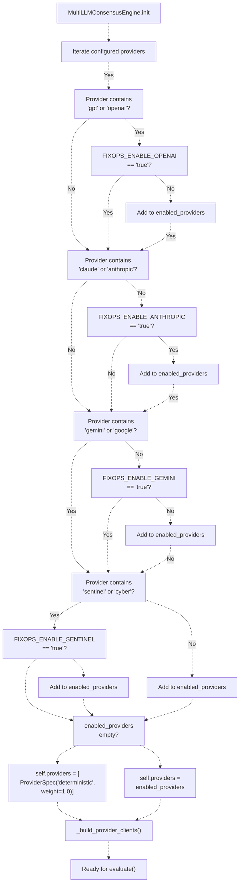
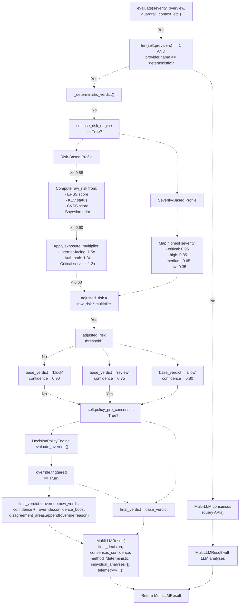
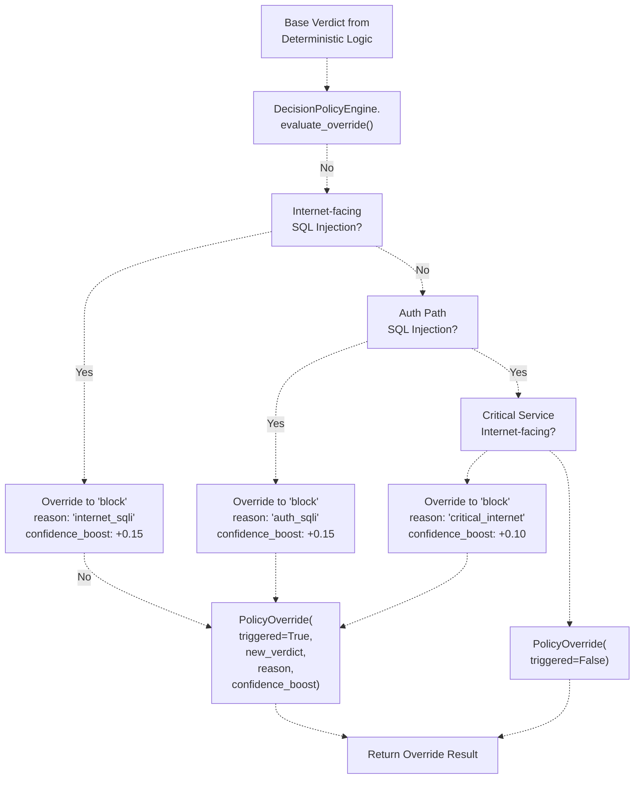
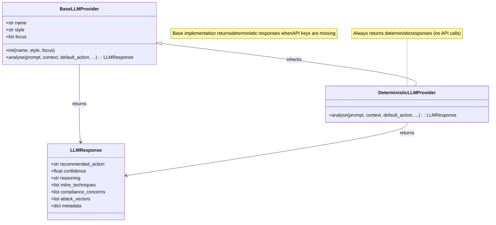
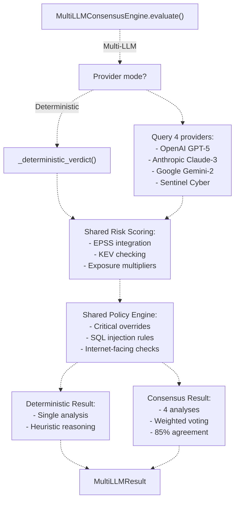

# Deterministic Fallback Mode

> **Relevant source files**
> * [apps/api/app.py](https://github.com/DevOpsMadDog/Fixops/blob/ce6eb1e9/apps/api/app.py)
> * [apps/api/ingestion.py](https://github.com/DevOpsMadDog/Fixops/blob/ce6eb1e9/apps/api/ingestion.py)
> * [backend_test.py](https://github.com/DevOpsMadDog/Fixops/blob/ce6eb1e9/backend_test.py)
> * [config/normalizers/registry.yaml](https://github.com/DevOpsMadDog/Fixops/blob/ce6eb1e9/config/normalizers/registry.yaml)
> * [core/analytics.py](https://github.com/DevOpsMadDog/Fixops/blob/ce6eb1e9/core/analytics.py)
> * [core/cli.py](https://github.com/DevOpsMadDog/Fixops/blob/ce6eb1e9/core/cli.py)
> * [core/compliance.py](https://github.com/DevOpsMadDog/Fixops/blob/ce6eb1e9/core/compliance.py)
> * [core/configuration.py](https://github.com/DevOpsMadDog/Fixops/blob/ce6eb1e9/core/configuration.py)
> * [core/decision_policy.py](https://github.com/DevOpsMadDog/Fixops/blob/ce6eb1e9/core/decision_policy.py)
> * [core/enhanced_decision.py](https://github.com/DevOpsMadDog/Fixops/blob/ce6eb1e9/core/enhanced_decision.py)
> * [core/llm_providers.py](https://github.com/DevOpsMadDog/Fixops/blob/ce6eb1e9/core/llm_providers.py)
> * [core/micro_pentest.py](https://github.com/DevOpsMadDog/Fixops/blob/ce6eb1e9/core/micro_pentest.py)
> * [demo_ssdlc_stages/03_code_development.json](https://github.com/DevOpsMadDog/Fixops/blob/ce6eb1e9/demo_ssdlc_stages/03_code_development.json)
> * [demo_ssdlc_stages/04_build_ci.yaml](https://github.com/DevOpsMadDog/Fixops/blob/ce6eb1e9/demo_ssdlc_stages/04_build_ci.yaml)
> * [demo_ssdlc_stages/06_deploy_production.yaml](https://github.com/DevOpsMadDog/Fixops/blob/ce6eb1e9/demo_ssdlc_stages/06_deploy_production.yaml)
> * [tests/e2e/test_critical_decision_policy.py](https://github.com/DevOpsMadDog/Fixops/blob/ce6eb1e9/tests/e2e/test_critical_decision_policy.py)
> * [tests/test_comprehensive_e2e.py](https://github.com/DevOpsMadDog/Fixops/blob/ce6eb1e9/tests/test_comprehensive_e2e.py)
> * [tests/test_data_generator.py](https://github.com/DevOpsMadDog/Fixops/blob/ce6eb1e9/tests/test_data_generator.py)
> * [tests/test_enhanced_api.py](https://github.com/DevOpsMadDog/Fixops/blob/ce6eb1e9/tests/test_enhanced_api.py)
> * [tests/test_enterprise_services.py](https://github.com/DevOpsMadDog/Fixops/blob/ce6eb1e9/tests/test_enterprise_services.py)
> * [tests/test_ingestion.py](https://github.com/DevOpsMadDog/Fixops/blob/ce6eb1e9/tests/test_ingestion.py)
> * [tests/test_micro_pentest_cli.py](https://github.com/DevOpsMadDog/Fixops/blob/ce6eb1e9/tests/test_micro_pentest_cli.py)
> * [tests/test_micro_pentest_core.py](https://github.com/DevOpsMadDog/Fixops/blob/ce6eb1e9/tests/test_micro_pentest_core.py)
> * [tests/test_micro_pentest_router.py](https://github.com/DevOpsMadDog/Fixops/blob/ce6eb1e9/tests/test_micro_pentest_router.py)

## Purpose and Scope

Deterministic Fallback Mode enables FixOps to continue making security decisions when LLM providers are unavailable or disabled. This mode uses risk-based heuristics, policy overrides, and exploit signal data to produce verdicts without external API calls. The system automatically detects when LLM providers cannot be reached and seamlessly transitions to deterministic logic.

This page covers the activation conditions, decision algorithms, and configuration for fallback mode. For information about LLM-based consensus when providers are available, see [Multi-LLM Consensus Engine](/DevOpsMadDog/Fixops/4.1-multi-llm-consensus-engine). For policy override rules that apply in both modes, see [Decision Policy Engine](/DevOpsMadDog/Fixops/4.2-decision-policy-engine). For the risk scoring methodology used in fallback mode, see [Risk-Based Profiling](/DevOpsMadDog/Fixops/4.3-risk-based-profiling).

## Fallback Activation Conditions

The system activates deterministic mode when:

1. **No LLM providers are enabled** - All provider environment variables (`FIXOPS_ENABLE_OPENAI`, `FIXOPS_ENABLE_ANTHROPIC`, `FIXOPS_ENABLE_GEMINI`, `FIXOPS_ENABLE_SENTINEL`) are set to `false` or `0`
2. **API keys are missing** - Required credentials for enabled providers are not present in the environment
3. **LLM API calls fail** - Providers timeout or return errors, triggering automatic fallback per request

### Provider Initialization Logic

The `MultiLLMConsensusEngine` determines which providers are available during initialization:



**Sources:** [core/enhanced_decision.py L169-L209](https://github.com/DevOpsMadDog/Fixops/blob/ce6eb1e9/core/enhanced_decision.py#L169-L209)

The engine checks environment variables to determine which providers are enabled. If none are available, it falls back to a single deterministic provider with 100% weight.

## Deterministic Decision Algorithm

### Core Logic Flow

When fallback mode is active, the `MultiLLMConsensusEngine.evaluate()` method delegates to `_deterministic_verdict()` instead of querying LLM APIs:



**Sources:** [core/enhanced_decision.py L242-L366](https://github.com/DevOpsMadDog/Fixops/blob/ce6eb1e9/core/enhanced_decision.py#L242-L366)

 [core/enhanced_decision.py L282-L366](https://github.com/DevOpsMadDog/Fixops/blob/ce6eb1e9/core/enhanced_decision.py#L282-L366)

### Risk Score Computation in Deterministic Mode

The risk-based profile (when `use_risk_engine=True`) computes risk scores using multiple factors:

| Factor | Source | Weight | Description |
| --- | --- | --- | --- |
| **EPSS Score** | `exploitability.epss_score` | Direct | Exploit prediction probability (0.0-1.0) |
| **KEV Status** | `exploitability.in_kev` | Boost to 0.95 | CISA Known Exploited Vulnerabilities |
| **CVSS Score** | `exploitability.highest_cvss` | Normalized /10 | Base vulnerability severity |
| **Bayesian Prior** | `processingLayer.prior_probability` | Direct | Historical exploitation likelihood |

#### Exposure Multipliers

When risk scoring is enabled, the system applies multiplicative factors based on deployment context:

| Exposure Type | Multiplier | Trigger Condition |
| --- | --- | --- |
| **Internet-facing** | 1.5x | `context_summary.internet_facing == True` OR `cnapp_summary.exposure_type == "internet"` |
| **Authentication path** | 1.3x | `context_summary.on_auth_path == True` OR file path contains `/auth/` |
| **Critical service** | 1.2x | `context_summary.criticality == "critical"` OR `severity_overview.highest == "critical"` |

Multipliers stack multiplicatively. For example, an internet-facing authentication service with a critical vulnerability applies: `1.5 × 1.3 × 1.2 = 2.34x` boost.

**Sources:** [core/enhanced_decision.py L309-L342](https://github.com/DevOpsMadDog/Fixops/blob/ce6eb1e9/core/enhanced_decision.py#L309-L342)

### Severity-Based Fallback

When risk scoring is disabled (`use_risk_engine=False`), the system uses a simplified heuristic mapping:

```css
# Severity to risk score mapping
severity_scores = {
    "critical": 0.95,
    "high": 0.85,
    "medium": 0.65,
    "low": 0.35,
    "info": 0.10
}
```

The highest severity finding determines the base risk score, which is then compared against the same thresholds (0.85 for block, 0.60 for review).

**Sources:** [core/enhanced_decision.py L343-L352](https://github.com/DevOpsMadDog/Fixops/blob/ce6eb1e9/core/enhanced_decision.py#L343-L352)

## Policy Override Integration

Both deterministic and LLM-based modes enforce the same policy overrides through the `DecisionPolicyEngine`. Critical vulnerability combinations always trigger overrides regardless of risk scores:



**Sources:** [core/decision_policy.py L29-L150](https://github.com/DevOpsMadDog/Fixops/blob/ce6eb1e9/core/decision_policy.py#L29-L150)

 [core/enhanced_decision.py L354-L362](https://github.com/DevOpsMadDog/Fixops/blob/ce6eb1e9/core/enhanced_decision.py#L354-L362)

The policy engine is evaluated **after** base risk scoring but **before** final verdict assignment. This ensures that critical combinations always receive appropriate verdicts even when EPSS scores are low.

## DeterministicLLMProvider Implementation

The `DeterministicLLMProvider` class provides a consistent interface for fallback mode:



**Sources:** [core/llm_providers.py L27-L71](https://github.com/DevOpsMadDog/Fixops/blob/ce6eb1e9/core/llm_providers.py#L27-L71)

The `BaseLLMProvider.analyse()` method serves as the fallback implementation for all providers. When API keys are missing or calls fail, providers inherit this deterministic behavior:

### Response Structure

```css
# Example deterministic response
LLMResponse(
    recommended_action="block",  # From default_action parameter
    confidence=0.85,              # From default_confidence parameter
    reasoning="Deterministic decision based on risk score and policy rules",
    mitre_techniques=["T1190", "T1059"],  # From mitigation_hints
    compliance_concerns=["PCI-DSS", "SOC2"],
    attack_vectors=["SQL Injection", "Internet-facing"],
    metadata={
        "mode": "deterministic",
        "reason": "provider_disabled",
        "style": "consensus"
    }
)
```

**Sources:** [core/llm_providers.py L46-L66](https://github.com/DevOpsMadDog/Fixops/blob/ce6eb1e9/core/llm_providers.py#L46-L66)

## Configuration Options

### Enhanced Decision Settings

The `enhanced_decision` section in `fixops.overlay.yml` controls fallback behavior:

```yaml
enhanced_decision:
  decision:
    # Enable risk-based scoring (vs severity-based)
    use_risk_engine: true
    
    # Apply policy overrides before LLM consensus
    policy_pre_consensus: true
    
    # Risk score thresholds for verdicts
    risk_block_threshold: 0.85
    risk_review_threshold: 0.60
  
  # Provider configurations
  providers:
    - name: gpt-5
      weight: 1.0
      style: strategist
      focus: [mitre, context]
  
  # Baseline confidence for deterministic mode
  baseline_confidence: 0.78
```

**Sources:** [core/configuration.py L128-L134](https://github.com/DevOpsMadDog/Fixops/blob/ce6eb1e9/core/configuration.py#L128-L134)

 [core/enhanced_decision.py L228-L237](https://github.com/DevOpsMadDog/Fixops/blob/ce6eb1e9/core/enhanced_decision.py#L228-L237)

### Feature Flag Control

Environment variables enable/disable individual providers:

| Environment Variable | Effect When Set to `false` |
| --- | --- |
| `FIXOPS_ENABLE_OPENAI` | Disables GPT-based providers |
| `FIXOPS_ENABLE_ANTHROPIC` | Disables Claude-based providers |
| `FIXOPS_ENABLE_GEMINI` | Disables Gemini-based providers |
| `FIXOPS_ENABLE_SENTINEL` | Disables Sentinel Cyber provider |

When all are disabled, the system automatically uses deterministic mode.

**Sources:** [core/enhanced_decision.py L169-L209](https://github.com/DevOpsMadDog/Fixops/blob/ce6eb1e9/core/enhanced_decision.py#L169-L209)

## Example Scenarios

### Scenario 1: Internet-Facing SQL Injection (No LLMs)

**Input:**

* Severity: `high`
* CWE: `CWE-89` (SQL Injection)
* EPSS: `0.42`
* KEV: `false`
* Context: `internet_facing = true`

**Deterministic Flow:**

1. **Risk Calculation:** ``` raw_risk = max(0.42 EPSS, 0.85 high_severity) = 0.85 exposure_multiplier = 1.5 (internet-facing) adjusted_risk = 0.85 × 1.5 = 1.275 (capped at 1.0) ```
2. **Threshold Check:** ``` adjusted_risk = 1.0 >= 0.85 → base_verdict = "block" ```
3. **Policy Override:** ``` DecisionPolicyEngine detects: SQL Injection + Internet-facing Override triggered: new_verdict = "block", reason = "internet_sqli" Confidence boost: +0.15 ```
4. **Final Decision:** ```yaml verdict: "block" confidence: 0.90 + 0.15 = 1.0 (capped) method: "deterministic" disagreement_areas: ["policy_override: internet_sqli"] ```

**Sources:** [core/enhanced_decision.py L282-L366](https://github.com/DevOpsMadDog/Fixops/blob/ce6eb1e9/core/enhanced_decision.py#L282-L366)

 [core/decision_policy.py L52-L86](https://github.com/DevOpsMadDog/Fixops/blob/ce6eb1e9/core/decision_policy.py#L52-L86)

### Scenario 2: Low Severity with No Exposure

**Input:**

* Severity: `low`
* EPSS: `0.05`
* KEV: `false`
* Context: `internet_facing = false`

**Deterministic Flow:**

1. **Risk Calculation:** ``` raw_risk = max(0.05 EPSS, 0.35 low_severity) = 0.35 exposure_multiplier = 1.0 (no special exposure) adjusted_risk = 0.35 × 1.0 = 0.35 ```
2. **Threshold Check:** ``` adjusted_risk = 0.35 < 0.60 → base_verdict = "allow" ```
3. **Policy Override:** ``` No critical combinations detected Override not triggered ```
4. **Final Decision:** ```yaml verdict: "allow" confidence: 0.80 method: "deterministic" ```

**Sources:** [core/enhanced_decision.py L282-L366](https://github.com/DevOpsMadDog/Fixops/blob/ce6eb1e9/core/enhanced_decision.py#L282-L366)

### Scenario 3: Severity-Based Fallback (Risk Engine Disabled)

**Configuration:**

```yaml
enhanced_decision:
  decision:
    use_risk_engine: false  # Disable risk scoring
```

**Input:**

* Severity: `critical`

**Deterministic Flow:**

1. **Severity Mapping:** ``` severity_scores["critical"] = 0.95 adjusted_risk = 0.95 ```
2. **Threshold Check:** ``` adjusted_risk = 0.95 >= 0.85 → base_verdict = "block" ```
3. **Final Decision:** ```yaml verdict: "block" confidence: 0.90 method: "deterministic" telemetry.decision_strategy: "severity_based" ```

**Sources:** [core/enhanced_decision.py L343-L352](https://github.com/DevOpsMadDog/Fixops/blob/ce6eb1e9/core/enhanced_decision.py#L343-L352)

## Integration with Other Subsystems

### Relationship to Multi-LLM Consensus

When LLM providers are available, the system uses consensus logic instead of deterministic mode. Both modes share the same policy engine and risk scoring infrastructure, ensuring consistent behavior:



**Sources:** [core/enhanced_decision.py L242-L459](https://github.com/DevOpsMadDog/Fixops/blob/ce6eb1e9/core/enhanced_decision.py#L242-L459)

### CLI and API Access

Deterministic mode is transparent to API clients and CLI users. The `/api/v1/decisions/enhanced` endpoint and `fixops make-decision` command automatically use fallback mode when providers are unavailable:

**API Endpoint:**

```
POST /api/v1/decisions/enhanced
```

Returns the same `MultiLLMResult` structure regardless of mode, with `method` field indicating `"deterministic"` or `"consensus"`.

**CLI Command:**

```markdown
# Falls back to deterministic mode if LLMs unavailable
fixops make-decision \
  --sbom path/to/sbom.json \
  --sarif path/to/sarif.json \
  --cve path/to/cve.json
```

**Sources:** [apps/api/routes/enhanced.py L1-L200](https://github.com/DevOpsMadDog/Fixops/blob/ce6eb1e9/apps/api/routes/enhanced.py#L1-L200)

 [core/cli.py L565-L584](https://github.com/DevOpsMadDog/Fixops/blob/ce6eb1e9/core/cli.py#L565-L584)

## Performance Characteristics

Deterministic mode offers significant performance advantages:

| Metric | Deterministic Mode | LLM Consensus Mode |
| --- | --- | --- |
| **Latency** | 5-50ms | 2-10 seconds |
| **Cost** | $0 | $0.01-0.05 per decision |
| **Reliability** | 100% (no external deps) | 95-99% (API dependent) |
| **Throughput** | 1000+ decisions/sec | 10-50 decisions/sec |
| **Offline Support** | Full support | Requires connectivity |

The risk-based computation is purely mathematical and completes in microseconds. Policy evaluation adds minimal overhead (< 1ms per rule).

**Sources:** [core/enhanced_decision.py L282-L366](https://github.com/DevOpsMadDog/Fixops/blob/ce6eb1e9/core/enhanced_decision.py#L282-L366)

## Monitoring and Telemetry

Deterministic decisions include telemetry metadata for observability:

```
telemetry = {
    "decision_strategy": "risk_based" or "severity_based",
    "raw_risk": 0.85,
    "adjusted_risk": 1.0,
    "exposure_multiplier": 1.5,
    "policy_override_triggered": True,
    "policy_override_reason": "internet_sqli",
    "provider_fallback": True,
    "mode": "deterministic"
}
```

This telemetry appears in the `MultiLLMResult.telemetry` field and is logged to the analytics store for auditing.

**Sources:** [core/enhanced_decision.py L357-L366](https://github.com/DevOpsMadDog/Fixops/blob/ce6eb1e9/core/enhanced_decision.py#L357-L366)

 [core/analytics.py L1-L200](https://github.com/DevOpsMadDog/Fixops/blob/ce6eb1e9/core/analytics.py#L1-L200)