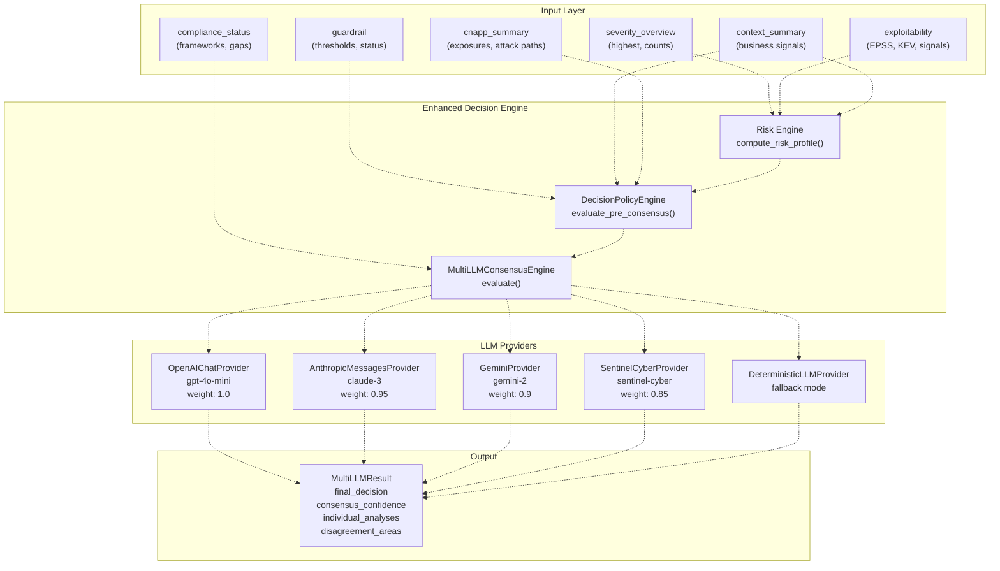
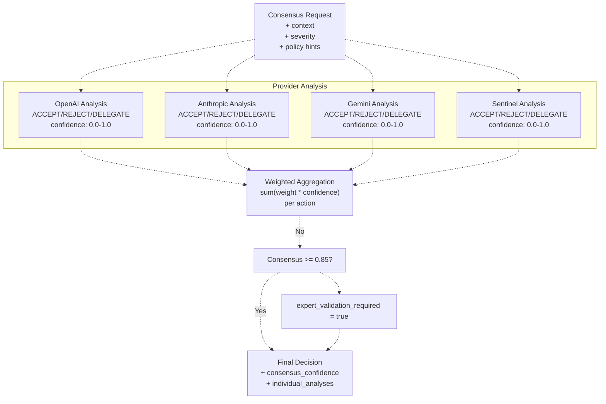
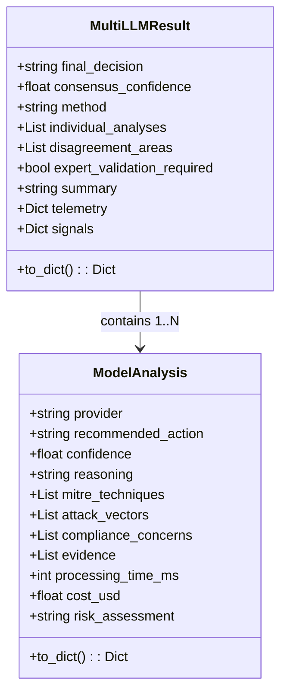
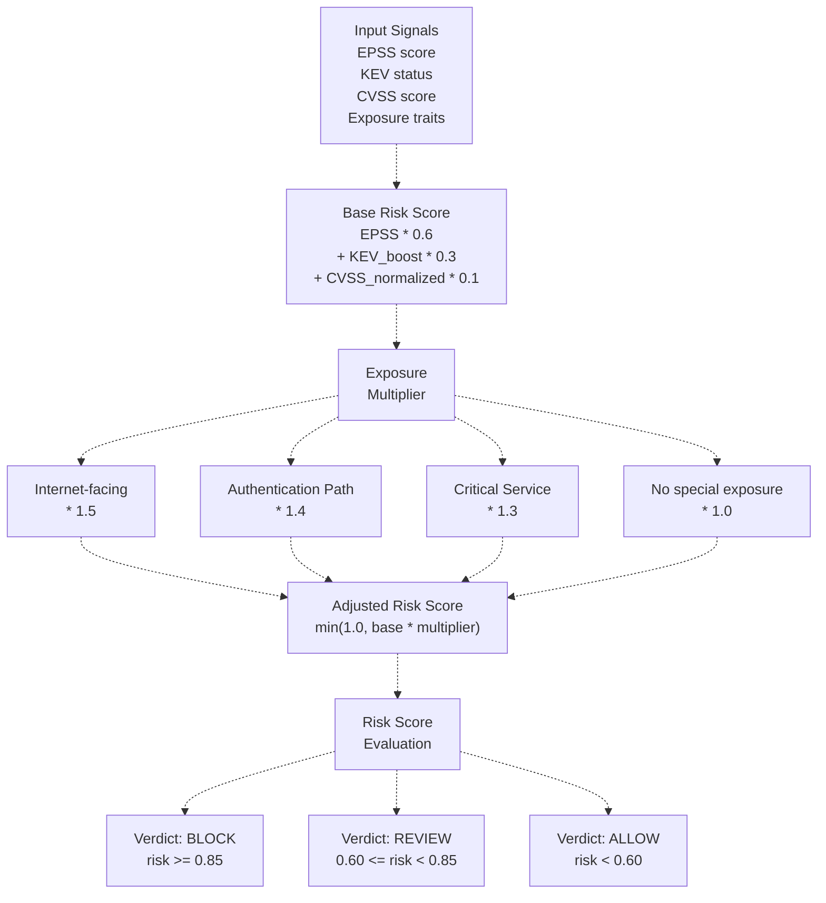
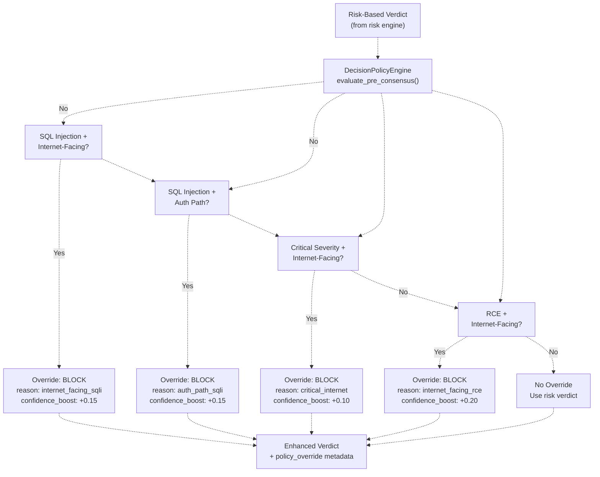
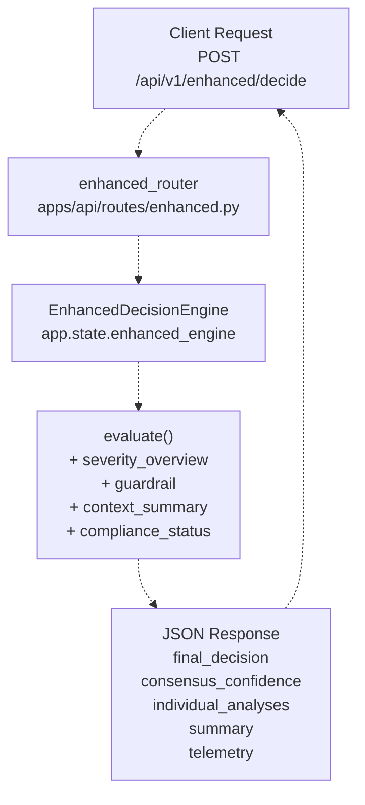
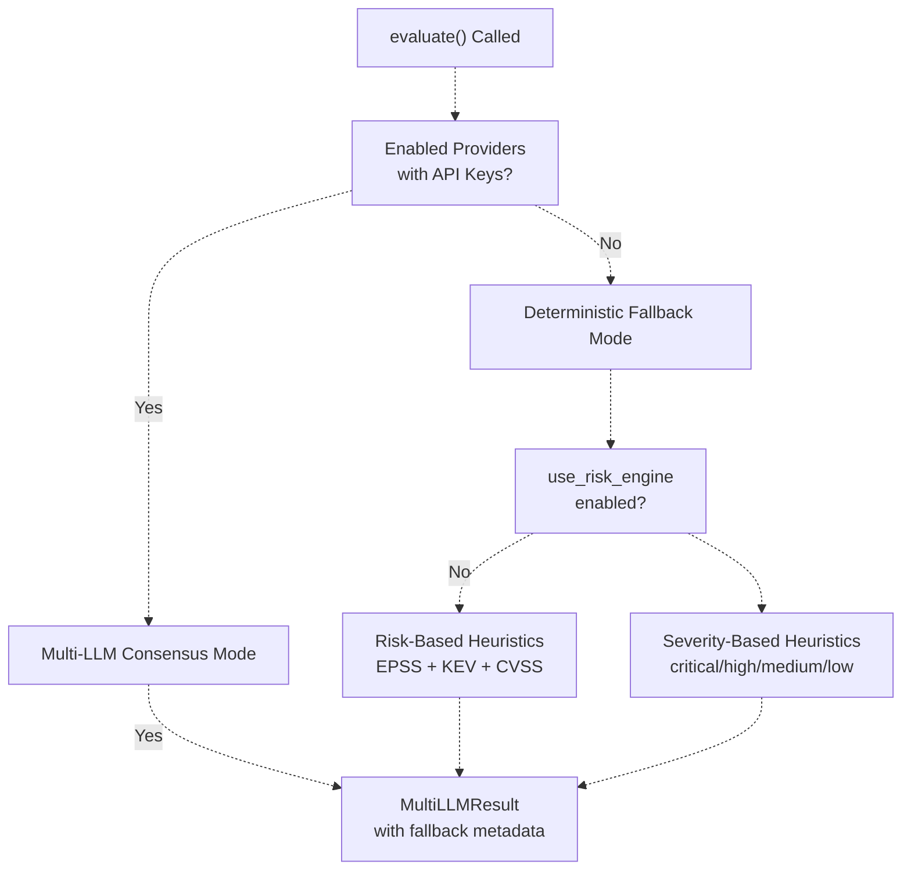
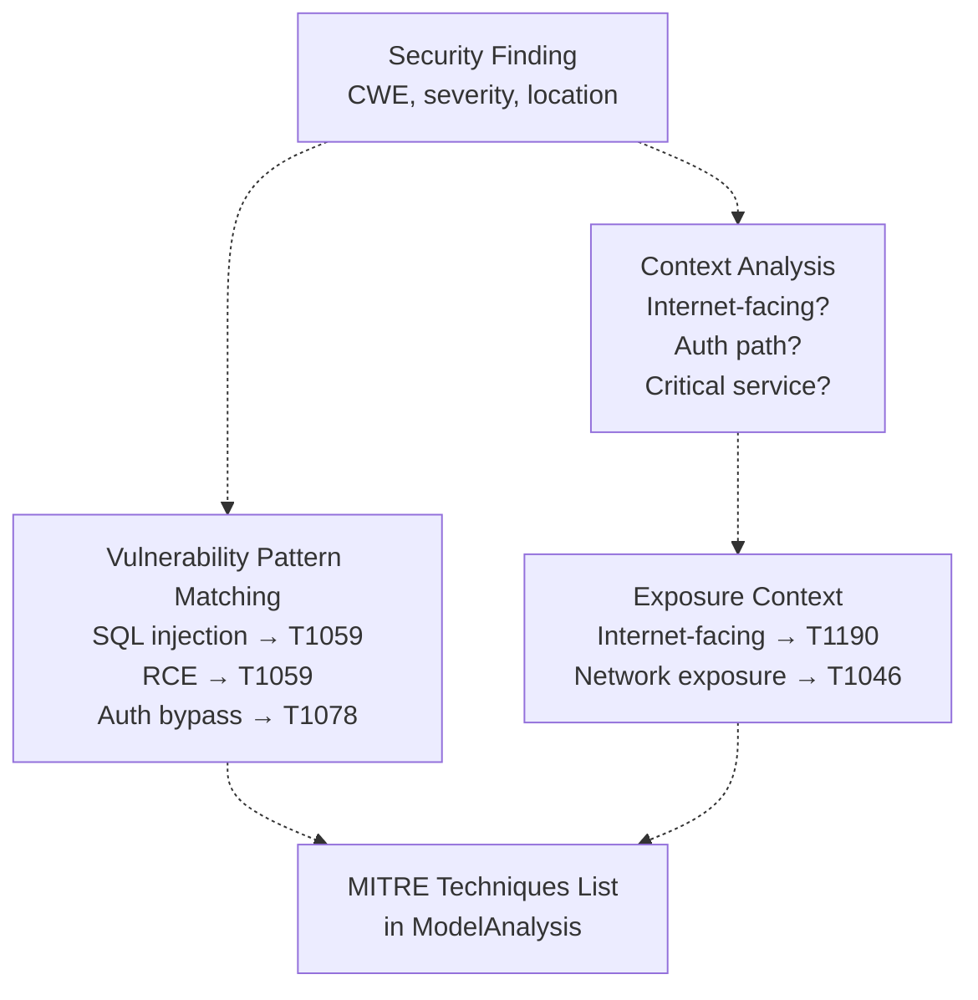
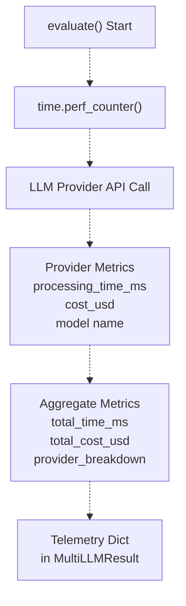
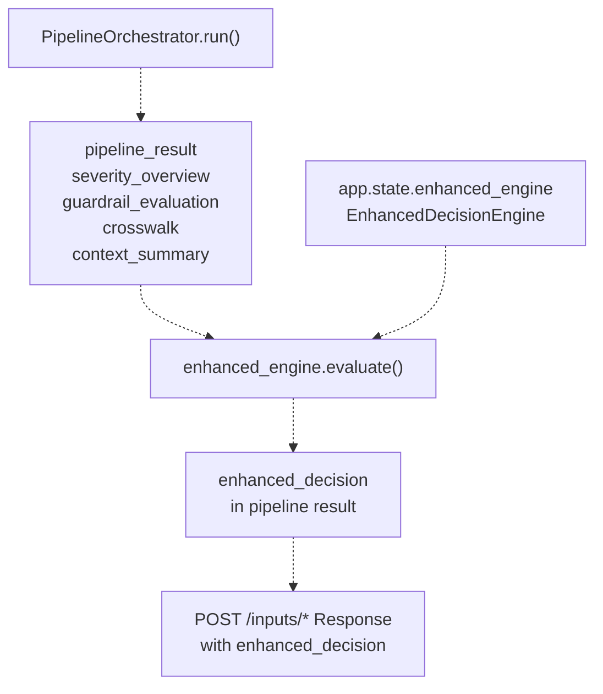

# Enhanced Decision Service

> **Relevant source files**
> * [apps/api/app.py](https://github.com/DevOpsMadDog/Fixops/blob/ce6eb1e9/apps/api/app.py)
> * [apps/api/ingestion.py](https://github.com/DevOpsMadDog/Fixops/blob/ce6eb1e9/apps/api/ingestion.py)
> * [backend_test.py](https://github.com/DevOpsMadDog/Fixops/blob/ce6eb1e9/backend_test.py)
> * [config/normalizers/registry.yaml](https://github.com/DevOpsMadDog/Fixops/blob/ce6eb1e9/config/normalizers/registry.yaml)
> * [core/analytics.py](https://github.com/DevOpsMadDog/Fixops/blob/ce6eb1e9/core/analytics.py)
> * [core/cli.py](https://github.com/DevOpsMadDog/Fixops/blob/ce6eb1e9/core/cli.py)
> * [core/compliance.py](https://github.com/DevOpsMadDog/Fixops/blob/ce6eb1e9/core/compliance.py)
> * [core/configuration.py](https://github.com/DevOpsMadDog/Fixops/blob/ce6eb1e9/core/configuration.py)
> * [core/decision_policy.py](https://github.com/DevOpsMadDog/Fixops/blob/ce6eb1e9/core/decision_policy.py)
> * [core/enhanced_decision.py](https://github.com/DevOpsMadDog/Fixops/blob/ce6eb1e9/core/enhanced_decision.py)
> * [core/llm_providers.py](https://github.com/DevOpsMadDog/Fixops/blob/ce6eb1e9/core/llm_providers.py)
> * [core/micro_pentest.py](https://github.com/DevOpsMadDog/Fixops/blob/ce6eb1e9/core/micro_pentest.py)
> * [demo_ssdlc_stages/03_code_development.json](https://github.com/DevOpsMadDog/Fixops/blob/ce6eb1e9/demo_ssdlc_stages/03_code_development.json)
> * [demo_ssdlc_stages/04_build_ci.yaml](https://github.com/DevOpsMadDog/Fixops/blob/ce6eb1e9/demo_ssdlc_stages/04_build_ci.yaml)
> * [demo_ssdlc_stages/06_deploy_production.yaml](https://github.com/DevOpsMadDog/Fixops/blob/ce6eb1e9/demo_ssdlc_stages/06_deploy_production.yaml)
> * [tests/e2e/test_critical_decision_policy.py](https://github.com/DevOpsMadDog/Fixops/blob/ce6eb1e9/tests/e2e/test_critical_decision_policy.py)
> * [tests/test_comprehensive_e2e.py](https://github.com/DevOpsMadDog/Fixops/blob/ce6eb1e9/tests/test_comprehensive_e2e.py)
> * [tests/test_data_generator.py](https://github.com/DevOpsMadDog/Fixops/blob/ce6eb1e9/tests/test_data_generator.py)
> * [tests/test_enhanced_api.py](https://github.com/DevOpsMadDog/Fixops/blob/ce6eb1e9/tests/test_enhanced_api.py)
> * [tests/test_enterprise_services.py](https://github.com/DevOpsMadDog/Fixops/blob/ce6eb1e9/tests/test_enterprise_services.py)
> * [tests/test_ingestion.py](https://github.com/DevOpsMadDog/Fixops/blob/ce6eb1e9/tests/test_ingestion.py)
> * [tests/test_micro_pentest_cli.py](https://github.com/DevOpsMadDog/Fixops/blob/ce6eb1e9/tests/test_micro_pentest_cli.py)
> * [tests/test_micro_pentest_core.py](https://github.com/DevOpsMadDog/Fixops/blob/ce6eb1e9/tests/test_micro_pentest_core.py)
> * [tests/test_micro_pentest_router.py](https://github.com/DevOpsMadDog/Fixops/blob/ce6eb1e9/tests/test_micro_pentest_router.py)

## Purpose and Scope

The Enhanced Decision Service provides AI-assisted security verdict generation through multi-LLM consensus, risk-based profiling, and policy-driven overrides. This service produces structured decisions (ACCEPT/REJECT/DELEGATE) with confidence scores, MITRE TTP mappings, and human-readable explanations for vulnerability triage and remediation prioritization.

For basic pipeline orchestration without LLM analysis, see [Pipeline Orchestration](/DevOpsMadDog/Fixops/6-pipeline-orchestration). For policy configuration and critical vulnerability overrides, see [Decision Policy Engine](/DevOpsMadDog/Fixops/4.2-decision-policy-engine). For risk scoring methodology, see [Risk-Based Profiling](/DevOpsMadDog/Fixops/4.3-risk-based-profiling).

**Sources:** [core/enhanced_decision.py L1-L10](https://github.com/DevOpsMadDog/Fixops/blob/ce6eb1e9/core/enhanced_decision.py#L1-L10)

 [apps/api/app.py L420-L422](https://github.com/DevOpsMadDog/Fixops/blob/ce6eb1e9/apps/api/app.py#L420-L422)

---

## Architecture Overview



**Enhanced Decision Flow**

The service processes security findings through three stages: (1) Risk profiling computes exploitation probability using EPSS, KEV status, and exposure multipliers; (2) Policy engine evaluates critical override rules (e.g., internet-facing SQL injection always blocks); (3) Multi-LLM consensus aggregates weighted analyses from four providers with 85% agreement threshold. Deterministic fallback activates when API keys are unavailable.

**Sources:** [core/enhanced_decision.py L127-L237](https://github.com/DevOpsMadDog/Fixops/blob/ce6eb1e9/core/enhanced_decision.py#L127-L237)

 [core/enhanced_decision.py L242-L286](https://github.com/DevOpsMadDog/Fixops/blob/ce6eb1e9/core/enhanced_decision.py#L242-L286)

---

## Multi-LLM Consensus Engine

### Provider Configuration

The `MultiLLMConsensusEngine` orchestrates multiple LLM providers with weighted voting and specialized focus areas:

| Provider | Model | Weight | Style | Focus Areas |
| --- | --- | --- | --- | --- |
| gpt-5 | gpt-4o-mini | 1.0 | strategist | mitre, context |
| claude-3 | claude-3-5-sonnet | 0.95 | analyst | compliance, guardrails |
| gemini-2 | gemini-1.5-flash | 0.9 | signals | exploit, cnapp |
| sentinel-cyber | sentinel-cyber | 0.85 | threat | marketplace, agents |

**Sources:** [core/enhanced_decision.py L130-L146](https://github.com/DevOpsMadDog/Fixops/blob/ce6eb1e9/core/enhanced_decision.py#L130-L146)

### Consensus Mechanism



**Consensus Aggregation Logic**

The engine queries each provider in parallel, collecting `ModelAnalysis` objects with recommended actions (ACCEPT/REJECT/DELEGATE), confidence scores, reasoning, MITRE techniques, and compliance concerns. Weighted aggregation sums `weight * confidence` for each action across all providers. If the winning action's aggregated confidence exceeds the 0.85 threshold, consensus is achieved. Otherwise, `expert_validation_required` is flagged and disagreement areas are documented.

**Sources:** [core/enhanced_decision.py L288-L392](https://github.com/DevOpsMadDog/Fixops/blob/ce6eb1e9/core/enhanced_decision.py#L288-L392)

 [core/enhanced_decision.py L394-L467](https://github.com/DevOpsMadDog/Fixops/blob/ce6eb1e9/core/enhanced_decision.py#L394-L467)

### Provider Analysis Structure

Each LLM provider returns an `LLMResponse` (converted to `ModelAnalysis`) with structured fields:



**Model Analysis Data Structure**

Each provider's analysis includes: (1) Recommended action with confidence score; (2) Reasoning text explaining the decision; (3) MITRE techniques mapped from vulnerability patterns (e.g., T1190 for internet-facing exploits); (4) Attack vectors and compliance concerns; (5) Evidence references with processing time and cost metrics.

**Sources:** [core/enhanced_decision.py L61-L97](https://github.com/DevOpsMadDog/Fixops/blob/ce6eb1e9/core/enhanced_decision.py#L61-L97)

 [core/enhanced_decision.py L99-L124](https://github.com/DevOpsMadDog/Fixops/blob/ce6eb1e9/core/enhanced_decision.py#L99-L124)

---

## Risk-Based Profiling Integration

### Risk Score Computation

When `use_risk_engine` is enabled, the engine computes a risk profile before LLM consensus:



**Risk Profiling Algorithm**

The risk engine combines: (1) EPSS probability (60% weight); (2) KEV presence (30% weight with 0.5 boost if listed); (3) CVSS score normalized to 0-1 (10% weight). Exposure multipliers amplify risk: internet-facing services (1.5x), authentication paths (1.4x), critical services (1.3x). The adjusted score determines verdicts: ≥0.85 blocks, 0.60-0.85 requires review, <0.60 allows.

**Sources:** [core/enhanced_decision.py L469-L543](https://github.com/DevOpsMadDog/Fixops/blob/ce6eb1e9/core/enhanced_decision.py#L469-L543)

 [core/enhanced_decision.py L229-L237](https://github.com/DevOpsMadDog/Fixops/blob/ce6eb1e9/core/enhanced_decision.py#L229-L237)

### Configuration Flags

The risk engine behavior is controlled via `enhanced_decision` settings:

| Setting | Type | Default | Description |
| --- | --- | --- | --- |
| `use_risk_engine` | bool | true | Enable risk-based profiling |
| `policy_pre_consensus` | bool | true | Apply policy overrides before LLM consensus |
| `risk_block_threshold` | float | 0.85 | Risk score that triggers automatic BLOCK |
| `risk_review_threshold` | float | 0.60 | Risk score that triggers REVIEW |
| `baseline_confidence` | float | 0.78 | Baseline confidence when LLMs unavailable |

**Sources:** [core/enhanced_decision.py L229-L237](https://github.com/DevOpsMadDog/Fixops/blob/ce6eb1e9/core/enhanced_decision.py#L229-L237)

 [core/configuration.py L127](https://github.com/DevOpsMadDog/Fixops/blob/ce6eb1e9/core/configuration.py#L127-L127)

---

## Decision Policy Engine Integration

### Pre-Consensus Policy Evaluation

When `policy_pre_consensus` is enabled, the `DecisionPolicyEngine` evaluates critical overrides before LLM consensus:



**Critical Policy Override Rules**

The policy engine enforces four critical rules that supersede risk scores: (1) SQL injection in internet-facing services → BLOCK (CWE-89 + internet exposure); (2) SQL injection in authentication paths → BLOCK (CWE-89 + auth service); (3) Critical severity in internet-facing services → BLOCK (CVSS ≥9.0 + internet exposure); (4) Remote code execution in internet-facing services → BLOCK (CWE-78/94 + internet exposure). Each override boosts confidence by 0.10-0.20 and adds policy metadata to the decision.

**Sources:** [core/decision_policy.py L29-L138](https://github.com/DevOpsMadDog/Fixops/blob/ce6eb1e9/core/decision_policy.py#L29-L138)

 [core/enhanced_decision.py L545-L627](https://github.com/DevOpsMadDog/Fixops/blob/ce6eb1e9/core/enhanced_decision.py#L545-L627)

### Policy Override Detection

The engine uses pattern matching to identify critical vulnerability combinations:

```markdown
# SQL Injection Detection (CWE-89)
# File: core/decision_policy.py:58-68
- Checks for "sql" OR "injection" in finding title/description
- Checks for CWE-89 in finding metadata
- Checks for "sqli" tag in finding tags

# Internet-Facing Detection
# File: core/decision_policy.py:70-79
- CNAPP exposures with "internet" trait
- Context with "internet-facing" exposure
- Service traits including "public" or "internet"

# Authentication Path Detection
# File: core/decision_policy.py:81-90
- Service type == "auth" or "authentication"
- File path contains "/auth/" or "/login/"
- Component name contains "auth" keyword
```

**Sources:** [core/decision_policy.py L58-L90](https://github.com/DevOpsMadDog/Fixops/blob/ce6eb1e9/core/decision_policy.py#L58-L90)

---

## API Endpoints

### Enhanced Decision Evaluation

The service exposes enhanced decision capabilities through the `/api/v1/enhanced/*` router:



**Enhanced Decision API Flow**

Clients submit security findings with context to `POST /api/v1/enhanced/decide`. The router extracts `app.state.enhanced_engine` (initialized at app startup) and invokes `evaluate()` with severity data, guardrails, business context, compliance status, CNAPP exposures, and exploitability signals. The engine returns a `MultiLLMResult` serialized to JSON with final decision, consensus confidence, individual LLM analyses, disagreement areas, and telemetry.

**Sources:** [apps/api/app.py L420-L422](https://github.com/DevOpsMadDog/Fixops/blob/ce6eb1e9/apps/api/app.py#L420-L422)

 [apps/api/app.py L482](https://github.com/DevOpsMadDog/Fixops/blob/ce6eb1e9/apps/api/app.py#L482-L482)

 [apps/api/routes/enhanced.py L1](https://github.com/DevOpsMadDog/Fixops/blob/ce6eb1e9/apps/api/routes/enhanced.py#L1-L1)

### Request/Response Schema

**Request Body:**

```json
{
  "severity_overview": {
    "highest": "high",
    "critical_count": 0,
    "high_count": 2,
    "medium_count": 5
  },
  "guardrail": {
    "status": "fail",
    "threshold": "high"
  },
  "context_summary": {
    "internet_facing": true,
    "authentication_path": false,
    "criticality": "high"
  },
  "compliance_status": {
    "frameworks": ["PCI-DSS", "SOC2"],
    "gaps": ["control-1.2.3"]
  },
  "cnapp_summary": {
    "exposures": [{"type": "internet-facing", "traits": ["public"]}]
  },
  "exploitability": {
    "epss_score": 0.0234,
    "kev_listed": false
  }
}
```

**Response Body:**

```json
{
  "final_decision": "REJECT",
  "consensus_confidence": 0.923,
  "method": "weighted_consensus",
  "summary": "Critical SQL injection in internet-facing service. Policy override triggered.",
  "individual_analyses": [
    {
      "provider": "gpt-5",
      "recommended_action": "REJECT",
      "confidence": 0.95,
      "reasoning": "SQL injection with internet exposure requires blocking",
      "mitre_techniques": ["T1190", "T1059"],
      "attack_vectors": ["web", "api"],
      "compliance_concerns": ["PCI-DSS 6.5.1"]
    }
  ],
  "disagreement_areas": [],
  "expert_validation_required": false,
  "telemetry": {
    "decision_strategy": "risk_with_policy",
    "raw_risk": 0.78,
    "adjusted_risk": 1.17,
    "exposure_multiplier": 1.5,
    "policy_override": "internet_facing_sqli"
  }
}
```

**Sources:** [core/enhanced_decision.py L99-L124](https://github.com/DevOpsMadDog/Fixops/blob/ce6eb1e9/core/enhanced_decision.py#L99-L124)

 [core/enhanced_decision.py L242-L286](https://github.com/DevOpsMadDog/Fixops/blob/ce6eb1e9/core/enhanced_decision.py#L242-L286)

---

## Configuration

### Overlay Configuration Structure

The enhanced decision engine is configured via `fixops.overlay.yml` under the `enhanced_decision` section:

```yaml
enhanced_decision:
  # Provider configuration
  providers:
    - name: "gpt-5"
      weight: 1.0
      style: "strategist"
      focus: ["mitre", "context"]
    - name: "claude-3"
      weight: 0.95
      style: "analyst"
      focus: ["compliance", "guardrails"]
    - name: "gemini-2"
      weight: 0.9
      style: "signals"
      focus: ["exploit", "cnapp"]
    - name: "sentinel-cyber"
      weight: 0.85
      style: "threat"
      focus: ["marketplace", "agents"]
  
  # Baseline confidence for deterministic mode
  baseline_confidence: 0.78
  
  # Knowledge graph for context enrichment
  knowledge_graph:
    nodes:
      - id: "service"
        type: "asset"
      - id: "finding"
        type: "vulnerability"
    edges:
      - source: "service"
        target: "finding"
        type: "impacted_by"
  
  # Decision engine configuration
  decision:
    use_risk_engine: true
    policy_pre_consensus: true
    risk_block_threshold: 0.85
    risk_review_threshold: 0.60
```

**Sources:** [core/enhanced_decision.py L148-L227](https://github.com/DevOpsMadDog/Fixops/blob/ce6eb1e9/core/enhanced_decision.py#L148-L227)

 [core/configuration.py L127](https://github.com/DevOpsMadDog/Fixops/blob/ce6eb1e9/core/configuration.py#L127-L127)

### Environment Variables

LLM provider enablement is controlled via environment variables:

| Variable | Type | Default | Description |
| --- | --- | --- | --- |
| `FIXOPS_ENABLE_OPENAI` | bool | true | Enable OpenAI GPT provider |
| `FIXOPS_ENABLE_ANTHROPIC` | bool | true | Enable Anthropic Claude provider |
| `FIXOPS_ENABLE_GEMINI` | bool | true | Enable Google Gemini provider |
| `FIXOPS_ENABLE_SENTINEL` | bool | true | Enable Sentinel Cyber provider |
| `OPENAI_API_KEY` | string | - | OpenAI API key for authentication |
| `ANTHROPIC_API_KEY` | string | - | Anthropic API key for authentication |
| `GOOGLE_API_KEY` | string | - | Google API key for Gemini |
| `SENTINEL_API_KEY` | string | - | Sentinel Cyber API key |

When all providers are disabled or API keys are missing, the engine automatically falls back to `DeterministicLLMProvider`.

**Sources:** [core/enhanced_decision.py L169-L209](https://github.com/DevOpsMadDog/Fixops/blob/ce6eb1e9/core/enhanced_decision.py#L169-L209)

 [core/llm_providers.py L86-L93](https://github.com/DevOpsMadDog/Fixops/blob/ce6eb1e9/core/llm_providers.py#L86-L93)

---

## Deterministic Fallback Mode

### Fallback Activation

The engine activates deterministic mode when:

1. All LLM providers are disabled via environment variables
2. No API keys are configured for any provider
3. Individual provider API calls fail (per-provider fallback)



**Fallback Decision Logic**

In deterministic mode, the engine uses: (1) Risk-based profiling if `use_risk_engine` is true (EPSS + KEV + exposure multipliers); (2) Severity-based heuristics otherwise (critical→REJECT, high→REVIEW, medium/low→ACCEPT). The result includes `method: "deterministic"` and `telemetry.decision_strategy: "fallback"` to indicate non-LLM processing.

**Sources:** [core/enhanced_decision.py L169-L209](https://github.com/DevOpsMadDog/Fixops/blob/ce6eb1e9/core/enhanced_decision.py#L169-L209)

 [core/enhanced_decision.py L629-L724](https://github.com/DevOpsMadDog/Fixops/blob/ce6eb1e9/core/enhanced_decision.py#L629-L724)

 [core/llm_providers.py L27-L67](https://github.com/DevOpsMadDog/Fixops/blob/ce6eb1e9/core/llm_providers.py#L27-L67)

### Deterministic Response Structure

When fallback mode activates, the engine generates responses using mitigation hints:

```css
# Deterministic LLM Response
# File: core/llm_providers.py:47-66

metadata = {
    "mode": "deterministic",
    "reason": "provider_disabled",
    "style": self.style
}

return LLMResponse(
    recommended_action=default_action,      # From risk/severity heuristics
    confidence=default_confidence,          # baseline_confidence (0.78)
    reasoning=default_reasoning,            # Template-based explanation
    mitre_techniques=mitre_candidates,      # From mitigation_hints
    compliance_concerns=compliance,         # From mitigation_hints
    attack_vectors=attack_vectors,          # From mitigation_hints
    metadata=metadata
)
```

The `mitigation_hints` parameter provides pre-computed MITRE techniques, compliance mappings, and attack vectors that would otherwise be generated by LLMs. This ensures structured output even in fallback mode.

**Sources:** [core/llm_providers.py L27-L66](https://github.com/DevOpsMadDog/Fixops/blob/ce6eb1e9/core/llm_providers.py#L27-L66)

 [core/enhanced_decision.py L726-L765](https://github.com/DevOpsMadDog/Fixops/blob/ce6eb1e9/core/enhanced_decision.py#L726-L765)

---

## MITRE ATT&CK Integration

### Technique Mapping Library

The engine maintains a curated library of MITRE techniques for vulnerability classification:

| Technique ID | Name | Tactic | Trigger Conditions |
| --- | --- | --- | --- |
| T1190 | Exploit Public-Facing Application | initial_access | Internet-facing + exploitable vulnerability |
| T1059 | Command and Scripting Interpreter | execution | SQL injection, RCE, command injection |
| T1078 | Valid Accounts | defense_evasion | Authentication bypass, credential issues |
| T1003 | OS Credential Dumping | credential_access | Privilege escalation, sensitive data access |
| T1046 | Network Service Discovery | discovery | Network reconnaissance, scanning |

**Sources:** [core/enhanced_decision.py L32-L58](https://github.com/DevOpsMadDog/Fixops/blob/ce6eb1e9/core/enhanced_decision.py#L32-L58)

### Technique Attribution Flow



**MITRE Technique Attribution**

Each LLM provider analyzes findings and assigns MITRE techniques based on: (1) Vulnerability type patterns (SQL injection→T1059, RCE→T1059, auth bypass→T1078); (2) Exposure context (internet-facing→T1190, network discovery→T1046); (3) Exploitation characteristics (credential dumping→T1003). Techniques appear in `ModelAnalysis.mitre_techniques` and are aggregated across providers in the final result.

**Sources:** [core/enhanced_decision.py L32-L58](https://github.com/DevOpsMadDog/Fixops/blob/ce6eb1e9/core/enhanced_decision.py#L32-L58)

 [core/enhanced_decision.py L394-L467](https://github.com/DevOpsMadDog/Fixops/blob/ce6eb1e9/core/enhanced_decision.py#L394-L467)

---

## Performance and Cost Tracking

### Telemetry Collection

The engine collects performance metrics and cost data for each decision:



**Cost and Performance Tracking**

Each `ModelAnalysis` includes `processing_time_ms` and `cost_usd` fields populated by provider-specific cost estimation (e.g., OpenAI token usage × pricing tier). The aggregated telemetry in `MultiLLMResult.telemetry` provides: (1) Total processing time across all providers; (2) Total cost in USD; (3) Per-provider breakdown; (4) Decision strategy used (risk_only, policy_override, full_consensus).

**Sources:** [core/enhanced_decision.py L61-L97](https://github.com/DevOpsMadDog/Fixops/blob/ce6eb1e9/core/enhanced_decision.py#L61-L97)

 [core/enhanced_decision.py L394-L467](https://github.com/DevOpsMadDog/Fixops/blob/ce6eb1e9/core/enhanced_decision.py#L394-L467)

---

## Signal Enrichment

### Exploit and Context Signals

The engine enriches decisions with structured signals for downstream systems:

```json
{
  "signals": {
    "exploit_signals": {
      "epss_score": 0.0234,
      "epss_percentile": 0.12,
      "kev_listed": false,
      "exploit_available": false,
      "exploit_maturity": "unproven"
    },
    "context_signals": {
      "internet_facing": true,
      "authentication_path": false,
      "critical_service": true,
      "data_classification": "pci",
      "business_impact": "high"
    },
    "compliance_signals": {
      "frameworks_violated": ["PCI-DSS 6.5.1", "SOC2 CC6.1"],
      "control_gaps": ["access-control", "input-validation"],
      "attestation_required": true
    },
    "threat_intelligence": {
      "active_campaigns": [],
      "threat_actors": [],
      "iocs_detected": false
    }
  }
}
```

**Signal Structure**

The `MultiLLMResult.signals` dictionary aggregates: (1) Exploit signals from EPSS/KEV integration; (2) Context signals from business context and CNAPP data; (3) Compliance signals from framework evaluation; (4) Threat intelligence from external feeds. These signals enable automated remediation workflows, SLA prioritization, and compliance reporting.

**Sources:** [core/enhanced_decision.py L99-L124](https://github.com/DevOpsMadDog/Fixops/blob/ce6eb1e9/core/enhanced_decision.py#L99-L124)

 [core/enhanced_decision.py L726-L865](https://github.com/DevOpsMadDog/Fixops/blob/ce6eb1e9/core/enhanced_decision.py#L726-L865)

---

## Integration with Pipeline Orchestrator

### Pipeline Integration Points



**Pipeline Integration**

The `PipelineOrchestrator` (see [Pipeline Orchestration](/DevOpsMadDog/Fixops/6.2-pipeline-orchestrator)) invokes the enhanced decision engine after completing all processing stages. The orchestrator extracts `severity_overview`, `guardrail_evaluation`, `context_summary`, `compliance_status`, and `cnapp_summary` from intermediate results, then calls `enhanced_engine.evaluate()`. The resulting `MultiLLMResult` is serialized and included in the pipeline's final JSON response under the `enhanced_decision` key.

**Sources:** [apps/api/app.py L420-L422](https://github.com/DevOpsMadDog/Fixops/blob/ce6eb1e9/apps/api/app.py#L420-L422)

 [apps/api/app.py L343](https://github.com/DevOpsMadDog/Fixops/blob/ce6eb1e9/apps/api/app.py#L343-L343)