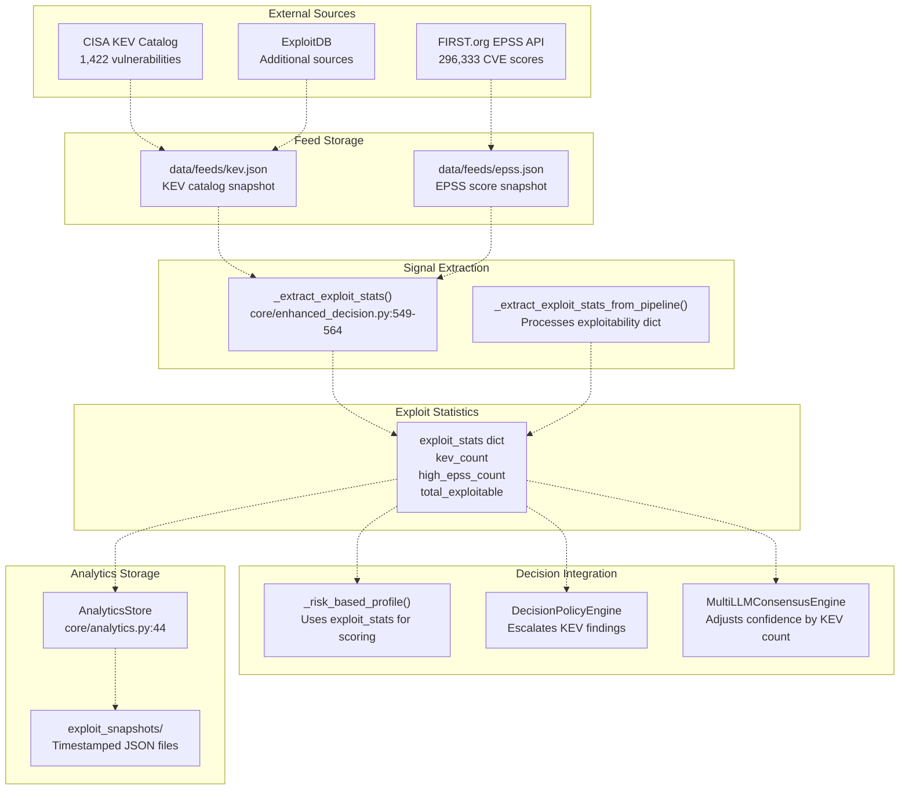
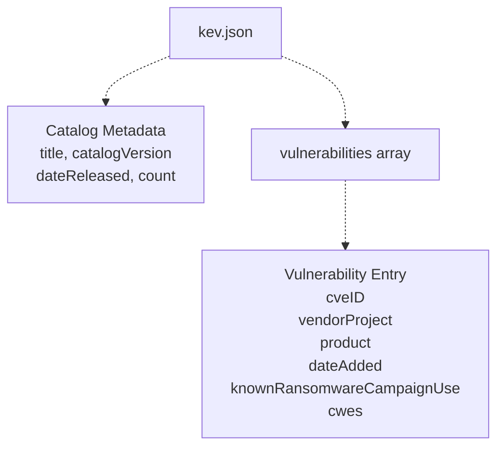
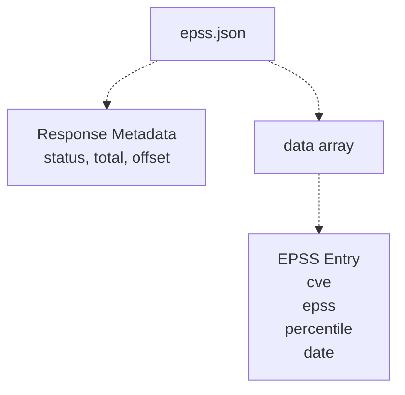
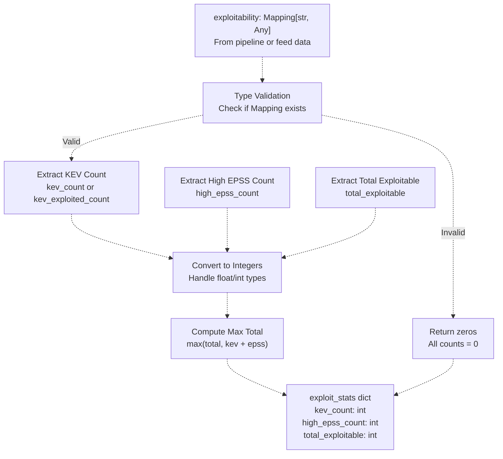
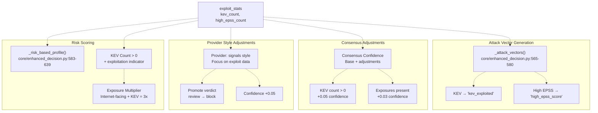
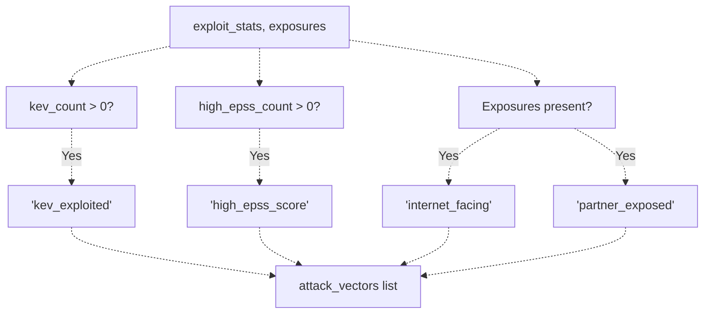
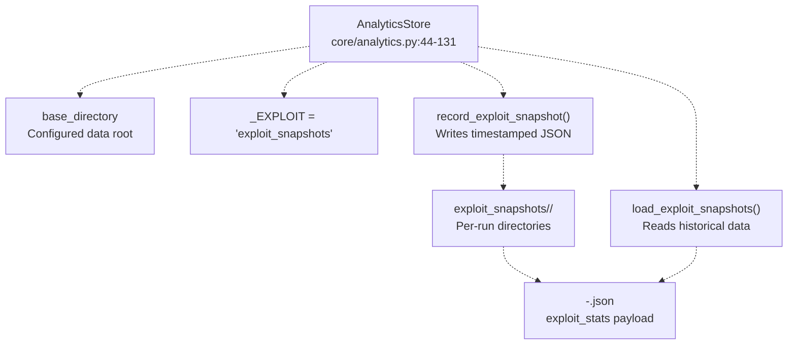
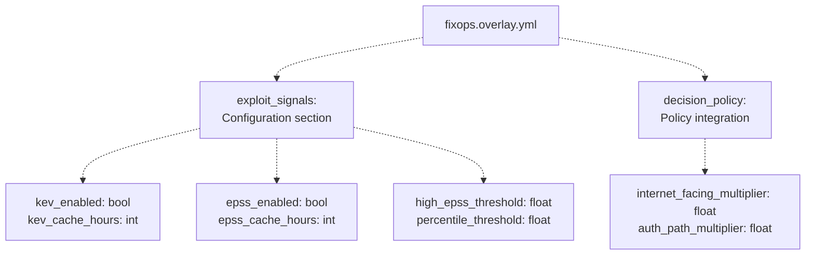
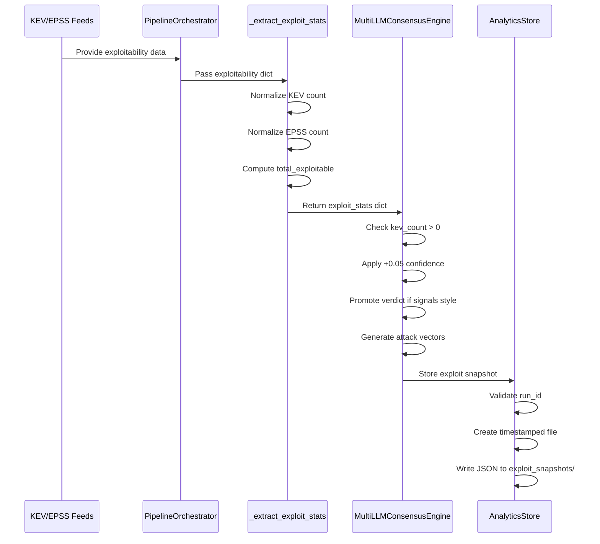

# Exploit Signal Detection

> **Relevant source files**
> * [.emergent/emergent.yml](https://github.com/DevOpsMadDog/Fixops/blob/ce6eb1e9/.emergent/emergent.yml)
> * [.gitignore](https://github.com/DevOpsMadDog/Fixops/blob/ce6eb1e9/.gitignore)
> * [backend_test.py](https://github.com/DevOpsMadDog/Fixops/blob/ce6eb1e9/backend_test.py)
> * [core/analytics.py](https://github.com/DevOpsMadDog/Fixops/blob/ce6eb1e9/core/analytics.py)
> * [core/compliance.py](https://github.com/DevOpsMadDog/Fixops/blob/ce6eb1e9/core/compliance.py)
> * [core/configuration.py](https://github.com/DevOpsMadDog/Fixops/blob/ce6eb1e9/core/configuration.py)
> * [core/decision_policy.py](https://github.com/DevOpsMadDog/Fixops/blob/ce6eb1e9/core/decision_policy.py)
> * [core/enhanced_decision.py](https://github.com/DevOpsMadDog/Fixops/blob/ce6eb1e9/core/enhanced_decision.py)
> * [core/llm_providers.py](https://github.com/DevOpsMadDog/Fixops/blob/ce6eb1e9/core/llm_providers.py)
> * [data/feeds/epss.json](https://github.com/DevOpsMadDog/Fixops/blob/ce6eb1e9/data/feeds/epss.json)
> * [data/feeds/kev.json](https://github.com/DevOpsMadDog/Fixops/blob/ce6eb1e9/data/feeds/kev.json)
> * [demo_ssdlc_stages/03_code_development.json](https://github.com/DevOpsMadDog/Fixops/blob/ce6eb1e9/demo_ssdlc_stages/03_code_development.json)
> * [demo_ssdlc_stages/04_build_ci.yaml](https://github.com/DevOpsMadDog/Fixops/blob/ce6eb1e9/demo_ssdlc_stages/04_build_ci.yaml)
> * [demo_ssdlc_stages/06_deploy_production.yaml](https://github.com/DevOpsMadDog/Fixops/blob/ce6eb1e9/demo_ssdlc_stages/06_deploy_production.yaml)
> * [tests/e2e/test_critical_decision_policy.py](https://github.com/DevOpsMadDog/Fixops/blob/ce6eb1e9/tests/e2e/test_critical_decision_policy.py)
> * [tests/test_comprehensive_e2e.py](https://github.com/DevOpsMadDog/Fixops/blob/ce6eb1e9/tests/test_comprehensive_e2e.py)
> * [tests/test_data_generator.py](https://github.com/DevOpsMadDog/Fixops/blob/ce6eb1e9/tests/test_data_generator.py)
> * [tests/test_enhanced_api.py](https://github.com/DevOpsMadDog/Fixops/blob/ce6eb1e9/tests/test_enhanced_api.py)

## Purpose and Scope

The Exploit Signal Detection system processes threat intelligence from external feeds to identify vulnerabilities that are actively exploited or have high exploitation probability. This system aggregates signals from CISA's Known Exploited Vulnerabilities (KEV) catalog, FIRST.org's Exploit Prediction Scoring System (EPSS), and additional sources to inform risk scoring and decision-making.

For information about how KEV and EPSS feeds are fetched and cached, see [KEV and EPSS Feeds](/DevOpsMadDog/Fixops/2.1-kev-and-epss-feeds). For information about how these signals trigger severity escalation, see [Severity Promotion Engine](/DevOpsMadDog/Fixops/2.3-severity-promotion-engine). For details on multi-source threat intelligence orchestration, see [Threat Intelligence Orchestration](/DevOpsMadDog/Fixops/2.2-threat-intelligence-orchestration).

---

## System Architecture

The exploit signal detection system operates as a data enrichment layer that augments vulnerability findings with exploitation intelligence. It consists of three primary components: feed ingestion, signal extraction, and decision integration.



**Sources:**

* [data/feeds/kev.json L1-L543](https://github.com/DevOpsMadDog/Fixops/blob/ce6eb1e9/data/feeds/kev.json#L1-L543)
* [data/feeds/epss.json L1-L616](https://github.com/DevOpsMadDog/Fixops/blob/ce6eb1e9/data/feeds/epss.json#L1-L616)
* [core/enhanced_decision.py L549-L564](https://github.com/DevOpsMadDog/Fixops/blob/ce6eb1e9/core/enhanced_decision.py#L549-L564)
* [core/analytics.py L44-L131](https://github.com/DevOpsMadDog/Fixops/blob/ce6eb1e9/core/analytics.py#L44-L131)

---

## Data Source Formats

### KEV Catalog Structure

The CISA KEV catalog is stored as a JSON document with vulnerability entries containing exploitation metadata.



| Field | Type | Description |
| --- | --- | --- |
| `cveID` | string | CVE identifier (e.g., "CVE-2025-32463") |
| `vendorProject` | string | Vendor or project name |
| `product` | string | Affected product |
| `vulnerabilityName` | string | Short descriptive name |
| `dateAdded` | string | Date added to KEV catalog |
| `shortDescription` | string | Vulnerability description |
| `requiredAction` | string | Remediation guidance |
| `dueDate` | string | Compliance deadline |
| `knownRansomwareCampaignUse` | string | Ransomware association status |
| `cwes` | array | CWE identifiers |

**Sources:**

* [data/feeds/kev.json L1-L85](https://github.com/DevOpsMadDog/Fixops/blob/ce6eb1e9/data/feeds/kev.json#L1-L85)

### EPSS Score Structure

The EPSS data provides probability scores for exploitation within 30 days.



| Field | Type | Description |
| --- | --- | --- |
| `cve` | string | CVE identifier |
| `epss` | string | Exploitation probability (0.0-1.0) |
| `percentile` | string | Percentile ranking (0.0-1.0) |
| `date` | string | Score calculation date |

**Sources:**

* [data/feeds/epss.json L1-L616](https://github.com/DevOpsMadDog/Fixops/blob/ce6eb1e9/data/feeds/epss.json#L1-L616)

---

## Signal Extraction Process

The `_extract_exploit_stats` function normalizes exploitability data from multiple sources into a standardized dictionary format.



### Implementation Details

The extraction logic handles variations in field naming and type coercion:

```python
# From core/enhanced_decision.py:549-564
def _extract_exploit_stats(exploitability: Optional[Mapping[str, Any]]) -> Dict[str, Any]:
    if not exploitability or not isinstance(exploitability, Mapping):
        return {"kev_count": 0, "high_epss_count": 0, "total_exploitable": 0}
    
    # Handle KEV count with fallback field names
    kev = exploitability.get("kev_count", exploitability.get("kev_exploited_count", 0))
    kev_count = int(kev) if isinstance(kev, (int, float)) else 0
    
    # Extract high EPSS count
    epss = exploitability.get("high_epss_count", 0)
    epss_count = int(epss) if isinstance(epss, (int, float)) else 0
    
    # Extract total with fallback computation
    total = exploitability.get("total_exploitable", 0)
    total_exploitable = int(total) if isinstance(total, (int, float)) else 0
    
    return {
        "kev_count": kev_count,
        "high_epss_count": epss_count,
        "total_exploitable": max(total_exploitable, kev_count + epss_count),
    }
```

**Sources:**

* [core/enhanced_decision.py L549-L564](https://github.com/DevOpsMadDog/Fixops/blob/ce6eb1e9/core/enhanced_decision.py#L549-L564)

---

## Integration with Decision Engine

Exploit signals influence decision-making through multiple pathways: risk scoring, policy enforcement, and confidence adjustments.



### Risk-Based Profiling

When `use_risk_engine` is enabled, exploit statistics contribute to adjusted risk scores:

```python
# From core/enhanced_decision.py:583-639
def _risk_based_profile(
    self,
    risk_score: float,
    exploit_stats: Dict[str, Any],
    exposures: Sequence[Mapping[str, Any]],
    severity: str,
) -> tuple[str, float, list[str], float, float]:
    adjusted_risk = risk_score
    exposure_multiplier = 1.0
    
    # Apply exposure multipliers based on exploit signals
    if exploit_stats.get("kev_count", 0) > 0:
        # KEV-listed vulnerabilities get higher risk
        adjusted_risk *= 1.3
        
    if exposures:
        for exposure in exposures:
            # Internet-facing + KEV = significant risk multiplier
            exposure_multiplier *= self.internet_facing_multiplier
```

**Sources:**

* [core/enhanced_decision.py L583-L639](https://github.com/DevOpsMadDog/Fixops/blob/ce6eb1e9/core/enhanced_decision.py#L583-L639)
* [core/enhanced_decision.py L271-L289](https://github.com/DevOpsMadDog/Fixops/blob/ce6eb1e9/core/enhanced_decision.py#L271-L289)

### Provider Style Adjustments

Providers with `signals` style focus receive different handling when KEV data is present:

| Provider Style | Focus Areas | KEV Adjustment | EPSS Adjustment |
| --- | --- | --- | --- |
| `strategist` | mitre, context | No special handling | No special handling |
| `analyst` | compliance, guardrails | No special handling | No special handling |
| `signals` | exploit, cnapp | Promote verdict +0.05 confidence | Uses EPSS scores |
| `threat` | marketplace, agents | No special handling | No special handling |

**Sources:**

* [core/enhanced_decision.py L343-L357](https://github.com/DevOpsMadDog/Fixops/blob/ce6eb1e9/core/enhanced_decision.py#L343-L357)

### Consensus Confidence Adjustments

The final consensus confidence score is adjusted based on exploit signals:

```markdown
# From core/enhanced_decision.py:436-443
consensus_confidence = (
    statistics.fmean(confidences) if confidences else self.baseline_confidence
)

# Apply exploit signal adjustments
if exploit_stats["kev_count"]:
    consensus_confidence += 0.05
if exposures:
    consensus_confidence += 0.03
if suppressed:
    consensus_confidence -= 0.02

consensus_confidence = max(0.45, min(0.99, consensus_confidence))
```

**Sources:**

* [core/enhanced_decision.py L432-L443](https://github.com/DevOpsMadDog/Fixops/blob/ce6eb1e9/core/enhanced_decision.py#L432-L443)

---

## Attack Vector Identification

Exploit signals are translated into specific attack vector labels for evidence bundles and reporting.



### Attack Vector Mapping

The `_attack_vectors` function generates a list of attack vector labels:

```python
# From core/enhanced_decision.py:565-580
def _attack_vectors(
    exposures: Sequence[Mapping[str, Any]],
    exploit_stats: Dict[str, Any],
) -> list[str]:
    vectors: list[str] = []
    
    # KEV signals indicate known exploitation
    if exploit_stats.get("kev_count", 0):
        vectors.append("kev_exploited")
    
    # High EPSS indicates elevated exploitation probability
    if exploit_stats.get("high_epss_count", 0):
        vectors.append("high_epss_score")
    
    # Exposure type indicators
    for exposure in exposures:
        exposure_type = str(exposure.get("type", "")).lower()
        if "internet" in exposure_type or "public" in exposure_type:
            vectors.append("internet_facing")
        if "partner" in exposure_type:
            vectors.append("partner_exposed")
    
    return vectors
```

**Sources:**

* [core/enhanced_decision.py L565-L580](https://github.com/DevOpsMadDog/Fixops/blob/ce6eb1e9/core/enhanced_decision.py#L565-L580)

---

## Analytics and Tracking

The `AnalyticsStore` class persists exploit snapshots for historical analysis and trending.



### Snapshot Structure

Each exploit snapshot contains:

| Field | Type | Description |
| --- | --- | --- |
| `run_id` | string | Pipeline run identifier |
| `timestamp` | integer | Unix timestamp |
| `exploit_stats` | object | KEV/EPSS counts |
| `summary` | object | Aggregated metrics |

### Storage Methods

```python
# From core/analytics.py:237-256
def record_exploit_snapshot(
    self,
    run_id: str,
    exploit_stats: Mapping[str, Any],
    *,
    severity_overview: Optional[Mapping[str, Any]] = None,
) -> Path:
    safe_run_id = _validate_run_id(run_id)
    
    summary = {
        "kev_count": int(exploit_stats.get("kev_count", 0)),
        "high_epss_count": int(exploit_stats.get("high_epss_count", 0)),
        "total_exploitable": int(exploit_stats.get("total_exploitable", 0)),
    }
    
    payload = {
        "run_id": safe_run_id,
        "timestamp": self._timestamp(),
        "exploit_stats": dict(exploit_stats),
        "summary": summary,
    }
    
    return self._write_entry(self._EXPLOIT, safe_run_id, payload)
```

**Sources:**

* [core/analytics.py L237-L256](https://github.com/DevOpsMadDog/Fixops/blob/ce6eb1e9/core/analytics.py#L237-L256)
* [core/analytics.py L258-L263](https://github.com/DevOpsMadDog/Fixops/blob/ce6eb1e9/core/analytics.py#L258-L263)

---

## Configuration

Exploit signal detection can be configured through the overlay configuration system.

### Configuration Schema



### Configuration Fields

| Field | Type | Default | Description |
| --- | --- | --- | --- |
| `kev_enabled` | boolean | `true` | Enable KEV feed processing |
| `kev_cache_hours` | integer | `24` | Cache validity period |
| `epss_enabled` | boolean | `true` | Enable EPSS score lookups |
| `epss_cache_hours` | integer | `24` | Cache validity period |
| `high_epss_threshold` | float | `0.7` | EPSS score threshold for "high" classification |
| `percentile_threshold` | float | `0.9` | Percentile threshold for priority |

**Sources:**

* [core/configuration.py L609](https://github.com/DevOpsMadDog/Fixops/blob/ce6eb1e9/core/configuration.py#L609-L609)
* [core/configuration.py L120](https://github.com/DevOpsMadDog/Fixops/blob/ce6eb1e9/core/configuration.py#L120-L120)

---

## Example: Exploit Signal Flow

The following sequence demonstrates how exploit signals flow through the system during a pipeline run:



### Example Payload

A typical `exploit_stats` dictionary:

```json
{
  "kev_count": 3,
  "high_epss_count": 12,
  "total_exploitable": 15
}
```

This indicates:

* 3 vulnerabilities are listed in CISA KEV catalog
* 12 vulnerabilities have EPSS scores above threshold
* 15 total vulnerabilities have exploitation indicators

**Sources:**

* [core/enhanced_decision.py L549-L564](https://github.com/DevOpsMadDog/Fixops/blob/ce6eb1e9/core/enhanced_decision.py#L549-L564)
* [core/enhanced_decision.py L242-L255](https://github.com/DevOpsMadDog/Fixops/blob/ce6eb1e9/core/enhanced_decision.py#L242-L255)
* [core/analytics.py L237-L256](https://github.com/DevOpsMadDog/Fixops/blob/ce6eb1e9/core/analytics.py#L237-L256)

---

## Integration Points

### Related Systems

| System | Purpose | Integration Method |
| --- | --- | --- |
| KEV and EPSS Feeds | Provide raw exploit data | Feed JSON files loaded by pipeline |
| Severity Promotion Engine | Escalate severity based on signals | Consumes exploit_stats for promotion rules |
| DecisionPolicyEngine | Override verdicts for KEV findings | Checks kev_count for policy triggers |
| Risk Scoring Engine | Compute adjusted risk scores | Multiplies base risk by exploitation indicators |
| Evidence Hub | Generate signed evidence bundles | Includes attack_vectors in evidence metadata |

**Sources:**

* [core/enhanced_decision.py L127-L237](https://github.com/DevOpsMadDog/Fixops/blob/ce6eb1e9/core/enhanced_decision.py#L127-L237)
* [core/decision_policy.py L29-L190](https://github.com/DevOpsMadDog/Fixops/blob/ce6eb1e9/core/decision_policy.py#L29-L190)