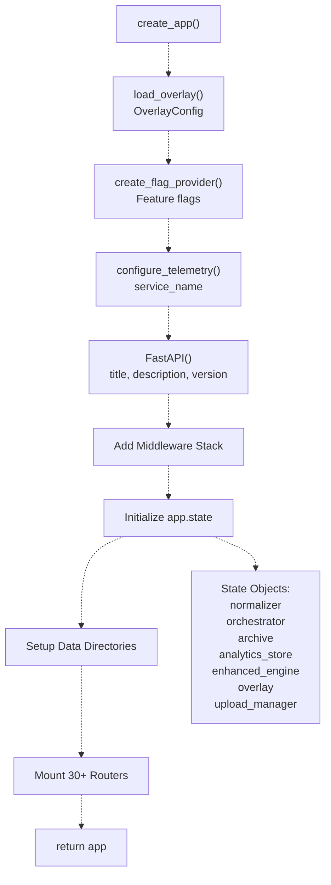
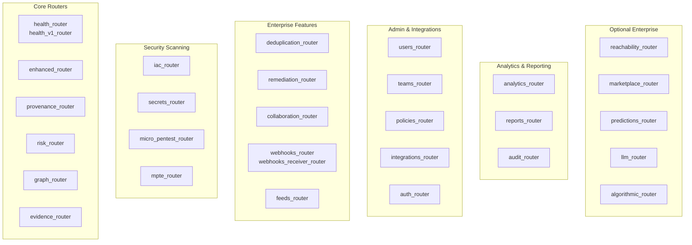
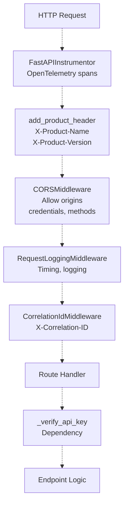
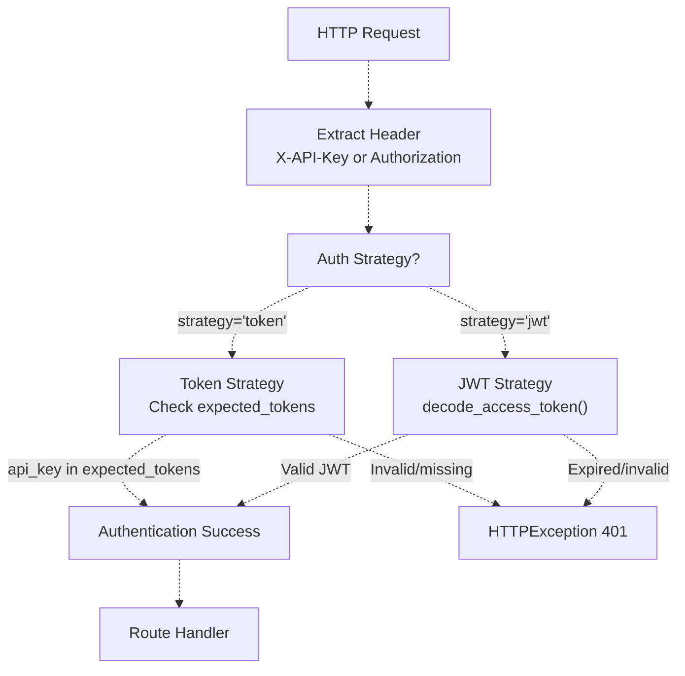
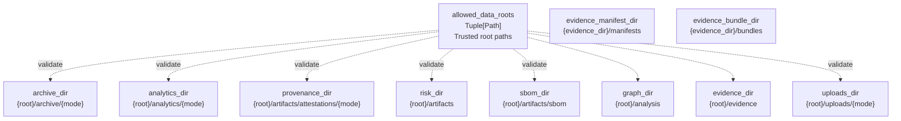
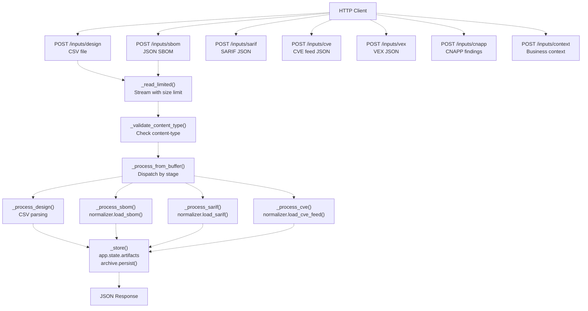
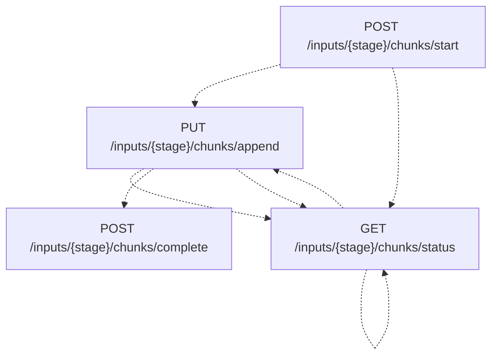

# FastAPI Application Structure

> **Relevant source files**
> * [.github/workflows/docker-build.yml](https://github.com/DevOpsMadDog/Fixops/blob/ce6eb1e9/.github/workflows/docker-build.yml)
> * [Dockerfile](https://github.com/DevOpsMadDog/Fixops/blob/ce6eb1e9/Dockerfile)
> * [apps/api/app.py](https://github.com/DevOpsMadDog/Fixops/blob/ce6eb1e9/apps/api/app.py)
> * [apps/api/ingestion.py](https://github.com/DevOpsMadDog/Fixops/blob/ce6eb1e9/apps/api/ingestion.py)
> * [config/normalizers/registry.yaml](https://github.com/DevOpsMadDog/Fixops/blob/ce6eb1e9/config/normalizers/registry.yaml)
> * [core/cli.py](https://github.com/DevOpsMadDog/Fixops/blob/ce6eb1e9/core/cli.py)
> * [core/micro_pentest.py](https://github.com/DevOpsMadDog/Fixops/blob/ce6eb1e9/core/micro_pentest.py)
> * [docs/COMPLETE_API_CLI_MAPPING.md](https://github.com/DevOpsMadDog/Fixops/blob/ce6eb1e9/docs/COMPLETE_API_CLI_MAPPING.md)
> * [docs/FIXOPS_PRODUCT_STATUS.md](https://github.com/DevOpsMadDog/Fixops/blob/ce6eb1e9/docs/FIXOPS_PRODUCT_STATUS.md)
> * [scripts/docker-entrypoint.sh](https://github.com/DevOpsMadDog/Fixops/blob/ce6eb1e9/scripts/docker-entrypoint.sh)
> * [tests/test_enterprise_services.py](https://github.com/DevOpsMadDog/Fixops/blob/ce6eb1e9/tests/test_enterprise_services.py)
> * [tests/test_ingestion.py](https://github.com/DevOpsMadDog/Fixops/blob/ce6eb1e9/tests/test_ingestion.py)
> * [tests/test_micro_pentest_cli.py](https://github.com/DevOpsMadDog/Fixops/blob/ce6eb1e9/tests/test_micro_pentest_cli.py)
> * [tests/test_micro_pentest_core.py](https://github.com/DevOpsMadDog/Fixops/blob/ce6eb1e9/tests/test_micro_pentest_core.py)
> * [tests/test_micro_pentest_router.py](https://github.com/DevOpsMadDog/Fixops/blob/ce6eb1e9/tests/test_micro_pentest_router.py)
> * [web/apps/micro-pentest/app/components/EnterpriseShell.tsx](https://github.com/DevOpsMadDog/Fixops/blob/ce6eb1e9/web/apps/micro-pentest/app/components/EnterpriseShell.tsx)
> * [web/apps/micro-pentest/app/globals.css](https://github.com/DevOpsMadDog/Fixops/blob/ce6eb1e9/web/apps/micro-pentest/app/globals.css)
> * [web/apps/micro-pentest/app/layout.tsx](https://github.com/DevOpsMadDog/Fixops/blob/ce6eb1e9/web/apps/micro-pentest/app/layout.tsx)
> * [web/apps/reachability/app/components/EnterpriseShell.tsx](https://github.com/DevOpsMadDog/Fixops/blob/ce6eb1e9/web/apps/reachability/app/components/EnterpriseShell.tsx)
> * [web/apps/reachability/app/globals.css](https://github.com/DevOpsMadDog/Fixops/blob/ce6eb1e9/web/apps/reachability/app/globals.css)
> * [web/apps/reachability/app/layout.tsx](https://github.com/DevOpsMadDog/Fixops/blob/ce6eb1e9/web/apps/reachability/app/layout.tsx)

## Purpose and Scope

This document describes the FastAPI application architecture in FixOps, including the application factory pattern, router organization, middleware stack, state management, and authentication mechanisms. The application serves 303 endpoints across 30+ routers and provides both API ingestion and CLI interfaces.

For information about the data ingestion and normalization layer, see [Input Normalization](/DevOpsMadDog/Fixops/3.4-input-normalization). For pipeline orchestration details, see [Pipeline Orchestrator](/DevOpsMadDog/Fixops/6.2-pipeline-orchestrator).

---

## Application Factory Pattern

The FastAPI application uses a factory pattern implemented in the `create_app()` function, which creates and configures a fully initialized application instance with all dependencies.

### Factory Function Flow



**Sources:** [apps/api/app.py L266-L467](https://github.com/DevOpsMadDog/Fixops/blob/ce6eb1e9/apps/api/app.py#L266-L467)

### Key Initialization Steps

| Step | Code Location | Purpose |
| --- | --- | --- |
| Load Configuration | [apps/api/app.py L271-L275](https://github.com/DevOpsMadDog/Fixops/blob/ce6eb1e9/apps/api/app.py#L271-L275) | Load overlay configuration with demo token fallback |
| Feature Flags | [apps/api/app.py L275](https://github.com/DevOpsMadDog/Fixops/blob/ce6eb1e9/apps/api/app.py#L275-L275) | Initialize feature flag provider from config |
| Branding | [apps/api/app.py L277-L285](https://github.com/DevOpsMadDog/Fixops/blob/ce6eb1e9/apps/api/app.py#L277-L285) | Extract product branding (product_name, org_name, telemetry_namespace) |
| Telemetry | [apps/api/app.py L287](https://github.com/DevOpsMadDog/Fixops/blob/ce6eb1e9/apps/api/app.py#L287-L287) | Configure OpenTelemetry with service name |
| FastAPI Instance | [apps/api/app.py L293-L297](https://github.com/DevOpsMadDog/Fixops/blob/ce6eb1e9/apps/api/app.py#L293-L297) | Create FastAPI app with dynamic title from branding |
| State Namespace | [apps/api/app.py L299-L300](https://github.com/DevOpsMadDog/Fixops/blob/ce6eb1e9/apps/api/app.py#L299-L300) | Initialize `app.state` as SimpleNamespace |
| Middleware | [apps/api/app.py L305-L340](https://github.com/DevOpsMadDog/Fixops/blob/ce6eb1e9/apps/api/app.py#L305-L340) | Add CORS, correlation ID, request logging middleware |
| Data Directories | [apps/api/app.py L370-L467](https://github.com/DevOpsMadDog/Fixops/blob/ce6eb1e9/apps/api/app.py#L370-L467) | Setup secure paths for archive, analytics, evidence, etc. |
| Service Initialization | [apps/api/app.py L407-L422](https://github.com/DevOpsMadDog/Fixops/blob/ce6eb1e9/apps/api/app.py#L407-L422) | Initialize normalizer, orchestrator, archive, analytics_store, enhanced_engine |

**Sources:** [apps/api/app.py L266-L467](https://github.com/DevOpsMadDog/Fixops/blob/ce6eb1e9/apps/api/app.py#L266-L467)

---

## Router Organization and Registration

The application includes 30+ routers organized by functional domain. Routers are conditionally loaded based on availability (enterprise features may not be present in all deployments).

### Router Categories



**Sources:** [apps/api/app.py L24-L167](https://github.com/DevOpsMadDog/Fixops/blob/ce6eb1e9/apps/api/app.py#L24-L167)

### Router Import Pattern

Routers are imported using two patterns:

**1. Direct Import (Always Available)**

```javascript
from apps.api.analytics_router import router as analytics_router
from apps.api.audit_router import router as audit_router
from apps.api.deduplication_router import router as deduplication_router
```

**2. Conditional Import (Enterprise/Optional)**

```javascript
feeds_router: Optional[APIRouter] = None
try:
    from apps.api.feeds_router import router as feeds_router
except ImportError:
    logging.getLogger(__name__).warning("Feeds router not available")
```

**Sources:** [apps/api/app.py L24-L167](https://github.com/DevOpsMadDog/Fixops/blob/ce6eb1e9/apps/api/app.py#L24-L167)

### Router Registration

All routers are registered with the `_verify_api_key` dependency except webhook receivers (which use signature verification instead):

```markdown
# Standard router registration
app.include_router(analytics_router, dependencies=[Depends(_verify_api_key)])
app.include_router(remediation_router, dependencies=[Depends(_verify_api_key)])

# Webhook receivers - NO API key required (signature verification instead)
app.include_router(webhooks_receiver_router)

# Optional routers - registered only if imported successfully
if feeds_router:
    app.include_router(feeds_router, dependencies=[Depends(_verify_api_key)])
```

**Sources:** [apps/api/app.py L469-L591](https://github.com/DevOpsMadDog/Fixops/blob/ce6eb1e9/apps/api/app.py#L469-L591)

### Complete Router List

| Router | File | Prefix | Endpoints | Conditional |
| --- | --- | --- | --- | --- |
| health_router | apps/api/health_router.py | /api/v1/health | 4 | No |
| enhanced_router | apps/api/routes/enhanced.py | /api/v1/enhanced | 4 | No |
| provenance_router | backend/api/provenance/router.py | /api/v1/provenance | 2 | No |
| risk_router | backend/api/risk/router.py | /api/v1/risk | 3 | No |
| graph_router | backend/api/graph/router.py | /api/v1/graph | 4 | No |
| evidence_router | backend/api/evidence/router.py | /api/v1/evidence | 4 | No |
| micro_pentest_router | apps/api/micro_pentest_router.py | /api/v1/micro-pentest | 13 | No |
| mpte_router | apps/api/mpte_router.py | /api/v1/mpte | 19 | No |
| reachability_router | risk/reachability/api.py | /api/v1/reachability | ~10 | Yes |
| inventory_router | apps/api/inventory_router.py | /api/v1/inventory | 15 | No |
| users_router | apps/api/users_router.py | /api/v1/users | 6 | No |
| teams_router | apps/api/teams_router.py | /api/v1/teams | 8 | No |
| policies_router | apps/api/policies_router.py | /api/v1/policies | 8 | No |
| analytics_router | apps/api/analytics_router.py | /api/v1/analytics | 16 | No |
| integrations_router | apps/api/integrations_router.py | /api/v1/integrations | 8 | No |
| reports_router | apps/api/reports_router.py | /api/v1/reports | 10 | No |
| audit_router | apps/api/audit_router.py | /api/v1/audit | 10 | No |
| workflows_router | apps/api/workflows_router.py | /api/v1/workflows | 7 | No |
| auth_router | apps/api/auth_router.py | /api/v1/auth | 4 | No |
| secrets_router | apps/api/secrets_router.py | /api/v1/secrets | 6 | No |
| iac_router | apps/api/iac_router.py | /api/v1/iac | 6 | No |
| bulk_router | apps/api/bulk_router.py | /api/v1/bulk | 12 | No |
| ide_router | apps/api/ide_router.py | /api/v1/ide | 3 | No |
| deduplication_router | apps/api/deduplication_router.py | /api/v1/deduplication | 17 | No |
| remediation_router | apps/api/remediation_router.py | /api/v1/remediation | 13 | No |
| collaboration_router | apps/api/collaboration_router.py | /api/v1/collaboration | 21 | No |
| webhooks_router | apps/api/webhooks_router.py | /api/v1/webhooks | 17 | No |
| feeds_router | apps/api/feeds_router.py | /api/v1/feeds | 20 | Yes |
| marketplace_router | apps/api/marketplace_router.py | /api/v1/marketplace | 12 | Yes |
| predictions_router | apps/api/predictions_router.py | /api/v1/predictions | ~10 | Yes |
| llm_router | apps/api/llm_router.py | /api/v1/llm | ~8 | Yes |

**Sources:** [apps/api/app.py L469-L591](https://github.com/DevOpsMadDog/Fixops/blob/ce6eb1e9/apps/api/app.py#L469-L591)

 [docs/FIXOPS_PRODUCT_STATUS.md L280-L316](https://github.com/DevOpsMadDog/Fixops/blob/ce6eb1e9/docs/FIXOPS_PRODUCT_STATUS.md#L280-L316)

---

## Middleware Stack

The application uses a layered middleware stack for cross-cutting concerns.

### Middleware Execution Order



**Sources:** [apps/api/app.py L298-L340](https://github.com/DevOpsMadDog/Fixops/blob/ce6eb1e9/apps/api/app.py#L298-L340)

 [apps/api/middleware.py](https://github.com/DevOpsMadDog/Fixops/blob/ce6eb1e9/apps/api/middleware.py)

### Middleware Details

| Middleware | Type | Purpose | Configuration |
| --- | --- | --- | --- |
| `FastAPIInstrumentor` | Instrumentation | OpenTelemetry tracing spans | [apps/api/app.py L298](https://github.com/DevOpsMadDog/Fixops/blob/ce6eb1e9/apps/api/app.py#L298-L298) |
| `CorrelationIdMiddleware` | Custom | Generate/propagate X-Correlation-ID header | [apps/api/app.py L305](https://github.com/DevOpsMadDog/Fixops/blob/ce6eb1e9/apps/api/app.py#L305-L305) |
| `RequestLoggingMiddleware` | Custom | Log request timing and details | [apps/api/app.py L307](https://github.com/DevOpsMadDog/Fixops/blob/ce6eb1e9/apps/api/app.py#L307-L307) |
| `add_product_header` | Custom HTTP | Add X-Product-Name and X-Product-Version | [apps/api/app.py L309-L315](https://github.com/DevOpsMadDog/Fixops/blob/ce6eb1e9/apps/api/app.py#L309-L315) |
| `CORSMiddleware` | CORS | Handle cross-origin requests | [apps/api/app.py L334-L340](https://github.com/DevOpsMadDog/Fixops/blob/ce6eb1e9/apps/api/app.py#L334-L340) |

**Sources:** [apps/api/app.py L298-L340](https://github.com/DevOpsMadDog/Fixops/blob/ce6eb1e9/apps/api/app.py#L298-L340)

 [apps/api/middleware.py](https://github.com/DevOpsMadDog/Fixops/blob/ce6eb1e9/apps/api/middleware.py)

### CORS Configuration

CORS origins are configured via `FIXOPS_ALLOWED_ORIGINS` environment variable or default to localhost:

```
origins_env = os.getenv("FIXOPS_ALLOWED_ORIGINS", "")
origins = [origin.strip() for origin in origins_env.split(",") if origin.strip()]
if not origins:
    origins = [
        "http://localhost:3000",
        "http://localhost:8000",
        "http://127.0.0.1:3000",
        "http://127.0.0.1:8000",
        "https://*.devinapps.com",
    ]
```

**Sources:** [apps/api/app.py L317-L333](https://github.com/DevOpsMadDog/Fixops/blob/ce6eb1e9/apps/api/app.py#L317-L333)

---

## State Management

The application stores shared state in `app.state`, a SimpleNamespace object accessible to all route handlers.

### State Object Architecture

```mermaid
flowchart TD

AppState["app.state<br>SimpleNamespace"]
Config["overlay<br>OverlayConfig"]
FlagProv["flag_provider<br>Feature flags"]
Brand["branding<br>Dict"]
Processing["normalizer<br>InputNormalizer"]
Orch["orchestrator<br>PipelineOrchestrator"]
Enhanced["enhanced_engine<br>EnhancedDecisionEngine"]
Storage["archive<br>ArtefactArchive"]
Analytics["analytics_store<br>AnalyticsStore"]
ArchiveRec["archive_records<br>Dict[str, Dict]"]
Upload["upload_manager<br>ChunkUploadManager"]
Artifacts["artifacts<br>Dict[str, Any]"]
Paths["provenance_dir<br>risk_dir<br>sbom_dir<br>graph_config<br>evidence_manifest_dir<br>evidence_bundle_dir"]
Feedback["feedback<br>FeedbackRecorder"]
Pipeline["last_pipeline_result<br>Optional[Dict]"]

AppState -.-> Config
AppState -.-> FlagProv
AppState -.-> Brand
AppState -.-> Processing
AppState -.-> Orch
AppState -.-> Enhanced
AppState -.-> Storage
AppState -.-> Analytics
AppState -.-> ArchiveRec
AppState -.-> Upload
AppState -.-> Artifacts
AppState -.-> Paths
AppState -.-> Feedback
AppState -.-> Pipeline
```



**Sources:** [apps/api/app.py L302-L467](https://github.com/DevOpsMadDog/Fixops/blob/ce6eb1e9/apps/api/app.py#L302-L467)

### State Properties

| Property | Type | Purpose | Initialization |
| --- | --- | --- | --- |
| `branding` | `Dict[str, str]` | Product name, org name, telemetry namespace | [apps/api/app.py L302](https://github.com/DevOpsMadDog/Fixops/blob/ce6eb1e9/apps/api/app.py#L302-L302) |
| `flag_provider` | Feature flag provider | Feature flag queries | [apps/api/app.py L303](https://github.com/DevOpsMadDog/Fixops/blob/ce6eb1e9/apps/api/app.py#L303-L303) |
| `normalizer` | `InputNormalizer` | Parse SBOM/SARIF/CVE/VEX inputs | [apps/api/app.py L407](https://github.com/DevOpsMadDog/Fixops/blob/ce6eb1e9/apps/api/app.py#L407-L407) |
| `orchestrator` | `PipelineOrchestrator` | Coordinate pipeline stages | [apps/api/app.py L408](https://github.com/DevOpsMadDog/Fixops/blob/ce6eb1e9/apps/api/app.py#L408-L408) |
| `artifacts` | `Dict[str, Any]` | Store uploaded artifacts by stage | [apps/api/app.py L409](https://github.com/DevOpsMadDog/Fixops/blob/ce6eb1e9/apps/api/app.py#L409-L409) |
| `overlay` | `OverlayConfig` | Configuration overlay | [apps/api/app.py L410](https://github.com/DevOpsMadDog/Fixops/blob/ce6eb1e9/apps/api/app.py#L410-L410) |
| `archive` | `ArtefactArchive` | Persist artifacts to disk/S3 | [apps/api/app.py L411](https://github.com/DevOpsMadDog/Fixops/blob/ce6eb1e9/apps/api/app.py#L411-L411) |
| `archive_records` | `Dict[str, Dict[str, Any]]` | Archive persistence metadata | [apps/api/app.py L412](https://github.com/DevOpsMadDog/Fixops/blob/ce6eb1e9/apps/api/app.py#L412-L412) |
| `analytics_store` | `AnalyticsStore` | Store analytics data | [apps/api/app.py L413](https://github.com/DevOpsMadDog/Fixops/blob/ce6eb1e9/apps/api/app.py#L413-L413) |
| `last_pipeline_result` | `Optional[Dict[str, Any]]` | Cache last pipeline execution | [apps/api/app.py L414](https://github.com/DevOpsMadDog/Fixops/blob/ce6eb1e9/apps/api/app.py#L414-L414) |
| `feedback` | `Optional[FeedbackRecorder]` | Capture user feedback | [apps/api/app.py L415-L419](https://github.com/DevOpsMadDog/Fixops/blob/ce6eb1e9/apps/api/app.py#L415-L419) |
| `enhanced_engine` | `EnhancedDecisionEngine` | LLM consensus decision engine | [apps/api/app.py L420-L422](https://github.com/DevOpsMadDog/Fixops/blob/ce6eb1e9/apps/api/app.py#L420-L422) |
| `upload_manager` | `ChunkUploadManager` | Handle chunked file uploads | [apps/api/app.py L467](https://github.com/DevOpsMadDog/Fixops/blob/ce6eb1e9/apps/api/app.py#L467-L467) |
| `provenance_dir` | `Path` | SLSA provenance attestations | [apps/api/app.py L449](https://github.com/DevOpsMadDog/Fixops/blob/ce6eb1e9/apps/api/app.py#L449-L449) |
| `risk_dir` | `Path` | Risk analysis artifacts | [apps/api/app.py L450](https://github.com/DevOpsMadDog/Fixops/blob/ce6eb1e9/apps/api/app.py#L450-L450) |
| `sbom_dir` | `Path` | SBOM storage | [apps/api/app.py L451](https://github.com/DevOpsMadDog/Fixops/blob/ce6eb1e9/apps/api/app.py#L451-L451) |
| `graph_config` | `Dict` | Knowledge graph configuration | [apps/api/app.py L452-L458](https://github.com/DevOpsMadDog/Fixops/blob/ce6eb1e9/apps/api/app.py#L452-L458) |
| `evidence_manifest_dir` | `Path` | Evidence manifests | [apps/api/app.py L459](https://github.com/DevOpsMadDog/Fixops/blob/ce6eb1e9/apps/api/app.py#L459-L459) |
| `evidence_bundle_dir` | `Path` | Signed evidence bundles | [apps/api/app.py L460](https://github.com/DevOpsMadDog/Fixops/blob/ce6eb1e9/apps/api/app.py#L460-L460) |

**Sources:** [apps/api/app.py L302-L467](https://github.com/DevOpsMadDog/Fixops/blob/ce6eb1e9/apps/api/app.py#L302-L467)

---

## Authentication and Authorization

The application supports two authentication strategies: API tokens and JWT tokens, configured via the overlay.

### Authentication Flow



**Sources:** [apps/api/app.py L346-L369](https://github.com/DevOpsMadDog/Fixops/blob/ce6eb1e9/apps/api/app.py#L346-L369)

### Authentication Strategy Configuration

The authentication strategy is configured in the overlay:

```
auth_strategy = overlay.auth.get("strategy", "").lower()
header_name = overlay.auth.get(
    "header", "X-API-Key" if auth_strategy != "jwt" else "Authorization"
)
api_key_header = APIKeyHeader(name=header_name, auto_error=False)
expected_tokens = overlay.auth_tokens if auth_strategy == "token" else tuple()
```

**Sources:** [apps/api/app.py L346-L351](https://github.com/DevOpsMadDog/Fixops/blob/ce6eb1e9/apps/api/app.py#L346-L351)

### _verify_api_key Dependency

This dependency function is injected into all protected routes:

```python
async def _verify_api_key(api_key: Optional[str] = Depends(api_key_header)) -> None:
    if auth_strategy == "token":
        if not api_key or api_key not in expected_tokens:
            raise HTTPException(
                status_code=401, detail="Invalid or missing API token"
            )
        return
    if auth_strategy == "jwt":
        if not api_key:
            raise HTTPException(
                status_code=401, detail="Missing Authorization header"
            )
        token = api_key
        if token.lower().startswith("bearer "):
            token = token[7:].strip()
        decode_access_token(token)
```

**Sources:** [apps/api/app.py L353-L369](https://github.com/DevOpsMadDog/Fixops/blob/ce6eb1e9/apps/api/app.py#L353-L369)

### JWT Token Management

JWT tokens are generated and validated using a secret key:

| Function | Purpose | Location |
| --- | --- | --- |
| `_load_or_generate_jwt_secret()` | Load from `FIXOPS_JWT_SECRET` or generate ephemeral secret for demo mode | [apps/api/app.py L204-L239](https://github.com/DevOpsMadDog/Fixops/blob/ce6eb1e9/apps/api/app.py#L204-L239) |
| `generate_access_token(data)` | Create signed JWT with expiry (default 120 minutes) | [apps/api/app.py L245-L251](https://github.com/DevOpsMadDog/Fixops/blob/ce6eb1e9/apps/api/app.py#L245-L251) |
| `decode_access_token(token)` | Validate and decode JWT | [apps/api/app.py L254-L263](https://github.com/DevOpsMadDog/Fixops/blob/ce6eb1e9/apps/api/app.py#L254-L263) |

**Sources:** [apps/api/app.py L199-L263](https://github.com/DevOpsMadDog/Fixops/blob/ce6eb1e9/apps/api/app.py#L199-L263)

---

## Data Directory Management

The application manages multiple data directories with path validation and security controls.

### Directory Structure



**Sources:** [apps/api/app.py L370-L467](https://github.com/DevOpsMadDog/Fixops/blob/ce6eb1e9/apps/api/app.py#L370-L467)

### Path Validation Process

All data directories are validated against the allowlist to prevent path traversal attacks:

```
allowlist = overlay.allowed_data_roots or (Path("data").resolve(),)
for directory in overlay.data_directories.values():
    secure_path = verify_allowlisted_path(directory, allowlist)
    ensure_secure_directory(secure_path)
```

**Sources:** [apps/api/app.py L370-L373](https://github.com/DevOpsMadDog/Fixops/blob/ce6eb1e9/apps/api/app.py#L370-L373)

### Directory Initialization

Each directory follows the same initialization pattern:

1. Check if configured in overlay `data_directories`
2. If not configured, construct path from allowlist root
3. Validate against allowlist
4. Ensure directory exists with secure permissions

Example for archive directory:

```
archive_dir = overlay.data_directories.get("archive_dir")
if archive_dir is None:
    root = allowlist[0]
    root = verify_allowlisted_path(root, allowlist)
    archive_dir = (root / "archive" / overlay.mode).resolve()
archive_dir = verify_allowlisted_path(archive_dir, allowlist)
archive = ArtefactArchive(archive_dir, allowlist=allowlist)
```

**Sources:** [apps/api/app.py L375-L381](https://github.com/DevOpsMadDog/Fixops/blob/ce6eb1e9/apps/api/app.py#L375-L381)

---

## File Upload and Ingestion Endpoints

The application provides direct endpoints in `app.py` for uploading security artifacts. These are not in a separate router but defined inline.

### Ingestion Endpoint Architecture



**Sources:** [apps/api/app.py L596-L1033](https://github.com/DevOpsMadDog/Fixops/blob/ce6eb1e9/apps/api/app.py#L596-L1033)

### Upload Size Limits

Upload size limits are configured per stage in the overlay:

```python
def _read_limited(
    file: UploadFile, stage: str
) -> Tuple[SpooledTemporaryFile, int]:
    """Stream an upload into a spooled file respecting the configured limit."""
    
    limit = overlay.upload_limit(stage)
    total = 0
    buffer = SpooledTemporaryFile(max_size=_CHUNK_SIZE, mode="w+b")
    while total < limit:
        remaining = limit - total
        chunk = await file.read(min(_CHUNK_SIZE, remaining))
        if not chunk:
            break
        if total + len(chunk) > limit:
            buffer.close()
            raise HTTPException(
                status_code=413,
                detail={
                    "message": f"Upload for stage '{stage}' exceeded limit",
                    "max_bytes": limit,
                    "received_bytes": total + len(chunk),
                },
            )
        buffer.write(chunk)
        total += len(chunk)
    buffer.seek(0)
    return buffer, total
```

**Sources:** [apps/api/app.py L596-L628](https://github.com/DevOpsMadDog/Fixops/blob/ce6eb1e9/apps/api/app.py#L596-L628)

### Supported Stages

| Stage | Endpoint | Parser | Validation |
| --- | --- | --- | --- |
| `design` | `/inputs/design` | CSV reader | Required columns check (strict mode) |
| `sbom` | `/inputs/sbom` | `normalizer.load_sbom()` | bomFormat check (CycloneDX/SPDX) |
| `sarif` | `/inputs/sarif` | `normalizer.load_sarif()` | SARIF 2.1.0 schema |
| `cve` | `/inputs/cve` | `normalizer.load_cve_feed()` | CVE JSON format |
| `vex` | `/inputs/vex` | `normalizer.load_vex()` | VEX document format |
| `cnapp` | `/inputs/cnapp` | `normalizer.load_cnapp()` | CNAPP findings format |
| `context` | `/inputs/context` | `normalizer.load_business_context()` | SSVC factors |

**Sources:** [apps/api/app.py L677-L961](https://github.com/DevOpsMadDog/Fixops/blob/ce6eb1e9/apps/api/app.py#L677-L961)

### Chunked Upload System

For large files, the application supports chunked uploads via the `ChunkUploadManager`:



**Sources:** [apps/api/app.py L1034-L1200](https://github.com/DevOpsMadDog/Fixops/blob/ce6eb1e9/apps/api/app.py#L1034-L1200)

 [apps/api/upload_manager.py](https://github.com/DevOpsMadDog/Fixops/blob/ce6eb1e9/apps/api/upload_manager.py)

---

## Health and Metrics Endpoints

The application provides health check and metrics endpoints for monitoring.

### Health Check Endpoints

| Endpoint | Purpose | Authentication | Source |
| --- | --- | --- | --- |
| `/health` | Simple health check | None | [apps/api/health.py](https://github.com/DevOpsMadDog/Fixops/blob/ce6eb1e9/apps/api/health.py) |
| `/api/v1/health/health` | Detailed health status | None | [apps/api/health_router.py](https://github.com/DevOpsMadDog/Fixops/blob/ce6eb1e9/apps/api/health_router.py) |
| `/api/v1/health/ready` | Readiness probe | None | [apps/api/health_router.py](https://github.com/DevOpsMadDog/Fixops/blob/ce6eb1e9/apps/api/health_router.py) |
| `/api/v1/health/version` | Version information | None | [apps/api/health_router.py](https://github.com/DevOpsMadDog/Fixops/blob/ce6eb1e9/apps/api/health_router.py) |
| `/api/v1/health/metrics` | Prometheus metrics | None | [apps/api/health_router.py](https://github.com/DevOpsMadDog/Fixops/blob/ce6eb1e9/apps/api/health_router.py) |
| `/api/v1/status` | Authenticated status | API Key | [apps/api/app.py L472-L480](https://github.com/DevOpsMadDog/Fixops/blob/ce6eb1e9/apps/api/app.py#L472-L480) |

**Sources:** [apps/api/app.py L469-L470](https://github.com/DevOpsMadDog/Fixops/blob/ce6eb1e9/apps/api/app.py#L469-L470)

 [apps/api/health.py](https://github.com/DevOpsMadDog/Fixops/blob/ce6eb1e9/apps/api/health.py)

 [apps/api/health_router.py](https://github.com/DevOpsMadDog/Fixops/blob/ce6eb1e9/apps/api/health_router.py)

### Authenticated Status Endpoint

The `/api/v1/status` endpoint requires API key authentication and returns basic service information:

```python
@app.get("/api/v1/status", dependencies=[Depends(_verify_api_key)])
async def authenticated_status() -> Dict[str, Any]:
    """Authenticated status endpoint."""
    return {
        "status": "ok",
        "timestamp": datetime.utcnow().isoformat() + "Z",
        "service": "fixops-api",
        "version": os.getenv("FIXOPS_VERSION", "0.1.0"),
    }
```

**Sources:** [apps/api/app.py L472-L480](https://github.com/DevOpsMadDog/Fixops/blob/ce6eb1e9/apps/api/app.py#L472-L480)

---

## Summary

The FastAPI application structure follows enterprise-grade patterns:

* **Factory Pattern**: `create_app()` encapsulates all initialization logic
* **Router Modularity**: 30+ routers organized by domain, conditionally loaded
* **Middleware Layering**: OpenTelemetry, CORS, logging, correlation IDs
* **Centralized State**: `app.state` provides shared access to services and configuration
* **Flexible Authentication**: Supports both API tokens and JWT with configurable strategies
* **Path Security**: All data directories validated against allowlist
* **File Upload**: Direct ingestion endpoints with size limits and chunked upload support
* **Observability**: Health checks and metrics for monitoring

This architecture supports both the 303 API endpoints and the CLI interface documented in [API/CLI Coverage Summary](/DevOpsMadDog/Fixops/1-overview).

**Sources:** [apps/api/app.py](https://github.com/DevOpsMadDog/Fixops/blob/ce6eb1e9/apps/api/app.py)

 [docs/FIXOPS_PRODUCT_STATUS.md](https://github.com/DevOpsMadDog/Fixops/blob/ce6eb1e9/docs/FIXOPS_PRODUCT_STATUS.md)