# Input Normalization

> **Relevant source files**
> * [.github/workflows/ci.yml](https://github.com/DevOpsMadDog/Fixops/blob/ce6eb1e9/.github/workflows/ci.yml)
> * [.github/workflows/fixops-ci.yml](https://github.com/DevOpsMadDog/Fixops/blob/ce6eb1e9/.github/workflows/fixops-ci.yml)
> * [.github/workflows/qa.yml](https://github.com/DevOpsMadDog/Fixops/blob/ce6eb1e9/.github/workflows/qa.yml)
> * [apps/api/app.py](https://github.com/DevOpsMadDog/Fixops/blob/ce6eb1e9/apps/api/app.py)
> * [apps/api/ingestion.py](https://github.com/DevOpsMadDog/Fixops/blob/ce6eb1e9/apps/api/ingestion.py)
> * [apps/api/normalizers.py](https://github.com/DevOpsMadDog/Fixops/blob/ce6eb1e9/apps/api/normalizers.py)
> * [backend/app.py](https://github.com/DevOpsMadDog/Fixops/blob/ce6eb1e9/backend/app.py)
> * [backend/normalizers.py](https://github.com/DevOpsMadDog/Fixops/blob/ce6eb1e9/backend/normalizers.py)
> * [config/normalizers/registry.yaml](https://github.com/DevOpsMadDog/Fixops/blob/ce6eb1e9/config/normalizers/registry.yaml)
> * [core/cli.py](https://github.com/DevOpsMadDog/Fixops/blob/ce6eb1e9/core/cli.py)
> * [core/micro_pentest.py](https://github.com/DevOpsMadDog/Fixops/blob/ce6eb1e9/core/micro_pentest.py)
> * [core/paths.py](https://github.com/DevOpsMadDog/Fixops/blob/ce6eb1e9/core/paths.py)
> * [core/policy.py](https://github.com/DevOpsMadDog/Fixops/blob/ce6eb1e9/core/policy.py)
> * [core/processing_layer.py](https://github.com/DevOpsMadDog/Fixops/blob/ce6eb1e9/core/processing_layer.py)
> * [core/storage.py](https://github.com/DevOpsMadDog/Fixops/blob/ce6eb1e9/core/storage.py)
> * [fixops/utils/__init__.py](https://github.com/DevOpsMadDog/Fixops/blob/ce6eb1e9/fixops/utils/__init__.py)
> * [fixops/utils/paths.py](https://github.com/DevOpsMadDog/Fixops/blob/ce6eb1e9/fixops/utils/paths.py)
> * [tests/fixtures/github_dependency_snapshot.json](https://github.com/DevOpsMadDog/Fixops/blob/ce6eb1e9/tests/fixtures/github_dependency_snapshot.json)
> * [tests/fixtures/syft_sample_sbom.json](https://github.com/DevOpsMadDog/Fixops/blob/ce6eb1e9/tests/fixtures/syft_sample_sbom.json)
> * [tests/test_analytics_store.py](https://github.com/DevOpsMadDog/Fixops/blob/ce6eb1e9/tests/test_analytics_store.py)
> * [tests/test_api_auth.py](https://github.com/DevOpsMadDog/Fixops/blob/ce6eb1e9/tests/test_api_auth.py)
> * [tests/test_enterprise_services.py](https://github.com/DevOpsMadDog/Fixops/blob/ce6eb1e9/tests/test_enterprise_services.py)
> * [tests/test_feedback.py](https://github.com/DevOpsMadDog/Fixops/blob/ce6eb1e9/tests/test_feedback.py)
> * [tests/test_file_size_limits.py](https://github.com/DevOpsMadDog/Fixops/blob/ce6eb1e9/tests/test_file_size_limits.py)
> * [tests/test_ingestion.py](https://github.com/DevOpsMadDog/Fixops/blob/ce6eb1e9/tests/test_ingestion.py)
> * [tests/test_micro_pentest_cli.py](https://github.com/DevOpsMadDog/Fixops/blob/ce6eb1e9/tests/test_micro_pentest_cli.py)
> * [tests/test_micro_pentest_core.py](https://github.com/DevOpsMadDog/Fixops/blob/ce6eb1e9/tests/test_micro_pentest_core.py)
> * [tests/test_micro_pentest_router.py](https://github.com/DevOpsMadDog/Fixops/blob/ce6eb1e9/tests/test_micro_pentest_router.py)
> * [tests/test_normalizers.py](https://github.com/DevOpsMadDog/Fixops/blob/ce6eb1e9/tests/test_normalizers.py)
> * [tests/test_pipeline_integration.py](https://github.com/DevOpsMadDog/Fixops/blob/ce6eb1e9/tests/test_pipeline_integration.py)
> * [tests/test_round2_fresh_apps.py](https://github.com/DevOpsMadDog/Fixops/blob/ce6eb1e9/tests/test_round2_fresh_apps.py)

## Purpose and Scope

Input Normalization is the data ingestion layer that converts diverse security artifact formats into standardized internal representations for processing by the FixOps pipeline. This module handles format detection, schema validation, and structural transformation of security data from multiple sources including SBOM documents, SARIF reports, CVE feeds, VEX documents, CNAPP findings, and business context files.

For information about how normalized data flows through the pipeline stages, see [Pipeline Orchestration](/DevOpsMadDog/Fixops/6-pipeline-orchestration). For details on the crosswalk correlation that occurs after normalization, see [Crosswalk Correlation Engine](/DevOpsMadDog/Fixops/3.5-crosswalk-correlation-engine).

---

## Architecture Overview

The normalization layer operates in two modes: the core `InputNormalizer` class for direct API and CLI usage, and the advanced `IngestionService` with `NormalizerRegistry` for plugin-based format handling.

```mermaid
flowchart TD

SBOM["SBOM Files<br>(CycloneDX/SPDX/Syft/GitHub)"]
SARIF["SARIF Reports<br>(Semgrep/Snyk/Trivy)"]
CVE["CVE Feeds<br>(NVD/KEV)"]
VEX["VEX Documents<br>(CycloneDX VEX)"]
CNAPP["CNAPP Findings<br>(Cloud security)"]
Context["Business Context<br>(YAML/JSON/CSV)"]
InputNormalizer["InputNormalizer<br>apps/api/normalizers.py"]
load_sbom["load_sbom()"]
load_sarif["load_sarif()"]
load_cve_feed["load_cve_feed()"]
load_vex["load_vex()"]
load_cnapp["load_cnapp()"]
load_business_context["load_business_context()"]
NormalizerRegistry["NormalizerRegistry<br>apps/api/ingestion.py"]
SARIFNormalizer["SARIFNormalizer"]
CycloneDXNormalizer["CycloneDXNormalizer"]
CNAPPNormalizer["CNAPPNormalizer"]
DarkWebIntelNormalizer["DarkWebIntelNormalizer"]
NormalizedSBOM["NormalizedSBOM<br>components, relationships"]
NormalizedSARIF["NormalizedSARIF<br>findings, tool_names"]
NormalizedCVEFeed["NormalizedCVEFeed<br>records, errors"]
NormalizedVEX["NormalizedVEX<br>assertions, suppressed_refs"]
NormalizedCNAPP["NormalizedCNAPP<br>assets, findings"]
NormalizedBusinessContext["NormalizedBusinessContext<br>components, ssvc"]
UnifiedFinding["UnifiedFinding<br>unified model"]

SBOM -.-> load_sbom
SARIF -.-> load_sarif
CVE -.-> load_cve_feed
VEX -.-> load_vex
CNAPP -.-> load_cnapp
Context -.-> load_business_context
SARIFNormalizer -.-> UnifiedFinding
CycloneDXNormalizer -.-> UnifiedFinding
CNAPPNormalizer -.-> UnifiedFinding
DarkWebIntelNormalizer -.-> UnifiedFinding

subgraph subGraph3 ["Normalized Output Models"]
    NormalizedSBOM
    NormalizedSARIF
    NormalizedCVEFeed
    NormalizedVEX
    NormalizedCNAPP
    NormalizedBusinessContext
    UnifiedFinding
end

subgraph subGraph2 ["Advanced Ingestion"]
    NormalizerRegistry
    SARIFNormalizer
    CycloneDXNormalizer
    CNAPPNormalizer
    DarkWebIntelNormalizer
    NormalizerRegistry -.-> SARIFNormalizer
    NormalizerRegistry -.-> CycloneDXNormalizer
    NormalizerRegistry -.-> CNAPPNormalizer
    NormalizerRegistry -.-> DarkWebIntelNormalizer
end

subgraph subGraph1 ["Core Normalization"]
    InputNormalizer
    load_sbom
    load_sarif
    load_cve_feed
    load_vex
    load_cnapp
    load_business_context
    InputNormalizer -.-> load_sbom
    InputNormalizer -.-> load_sarif
    InputNormalizer -.-> load_cve_feed
    InputNormalizer -.-> load_vex
    InputNormalizer -.-> load_cnapp
    InputNormalizer -.-> load_business_context
end

subgraph subGraph0 ["Input Sources"]
    SBOM
    SARIF
    CVE
    VEX
    CNAPP
    Context
end
```

**Sources:** [apps/api/normalizers.py L1-L1400](https://github.com/DevOpsMadDog/Fixops/blob/ce6eb1e9/apps/api/normalizers.py#L1-L1400)

 [apps/api/ingestion.py L1-L1200](https://github.com/DevOpsMadDog/Fixops/blob/ce6eb1e9/apps/api/ingestion.py#L1-L1200)

---

## The InputNormalizer Class

The `InputNormalizer` class provides the primary normalization interface used by the FastAPI application and CLI. It implements format-specific parsers with fallback mechanisms and strict validation controls.

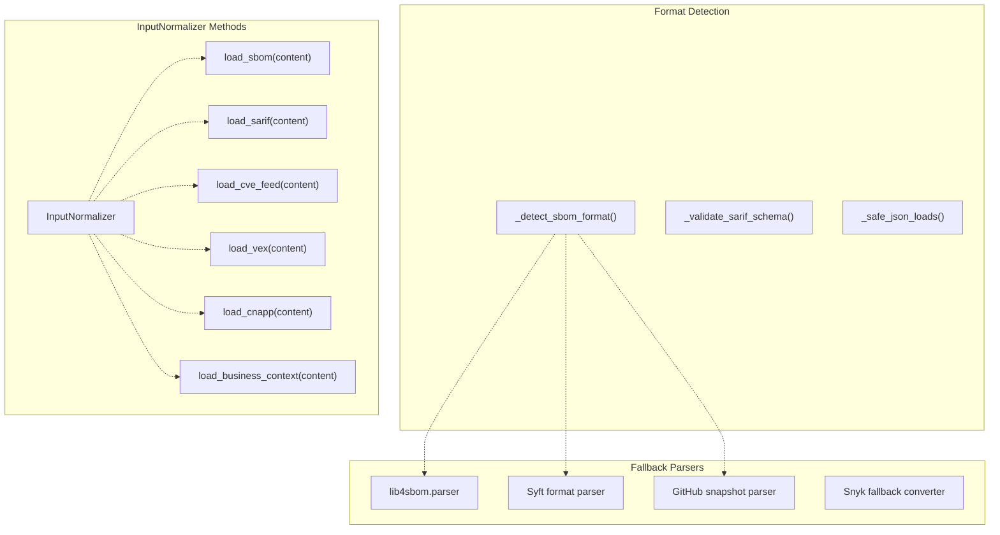

**Sources:** [apps/api/normalizers.py L543-L900](https://github.com/DevOpsMadDog/Fixops/blob/ce6eb1e9/apps/api/normalizers.py#L543-L900)

### Key Methods

| Method | Input Format | Output Type | Primary Use Case |
| --- | --- | --- | --- |
| `load_sbom` | JSON/bytes | `NormalizedSBOM` | CycloneDX, SPDX, Syft, GitHub dependency snapshots |
| `load_sarif` | JSON/bytes | `NormalizedSARIF` | SARIF 2.1.0 static analysis results |
| `load_cve_feed` | JSON/bytes | `NormalizedCVEFeed` | CVE JSON 5.1.1 feeds, KEV catalogs |
| `load_vex` | JSON/bytes | `NormalizedVEX` | CycloneDX VEX vulnerability exploitability exchange |
| `load_cnapp` | JSON/bytes | `NormalizedCNAPP` | Cloud-native application protection findings |
| `load_business_context` | bytes | `NormalizedBusinessContext` | FixOps.yaml, OTM.json, SSVC YAML |

**Sources:** [apps/api/normalizers.py L543-L900](https://github.com/DevOpsMadDog/Fixops/blob/ce6eb1e9/apps/api/normalizers.py#L543-L900)

---

## Normalized Data Structures

Each normalizer produces a strongly-typed data structure with consistent field semantics across formats.

### NormalizedSBOM

The `NormalizedSBOM` dataclass represents a unified view of Software Bill of Materials documents regardless of source format.

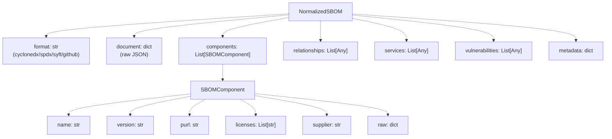

**Sources:** [apps/api/normalizers.py L329-L369](https://github.com/DevOpsMadDog/Fixops/blob/ce6eb1e9/apps/api/normalizers.py#L329-L369)

### NormalizedSARIF

The `NormalizedSARIF` dataclass consolidates SARIF 2.1.0 static analysis results with quick-access statistics.

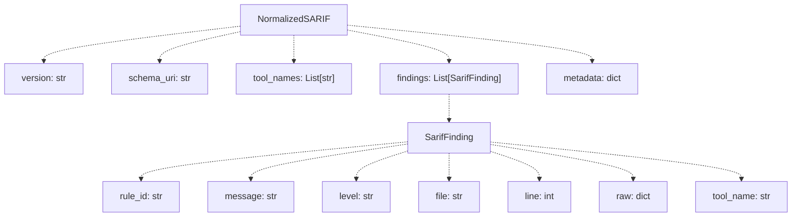

**Sources:** [apps/api/normalizers.py L507-L541](https://github.com/DevOpsMadDog/Fixops/blob/ce6eb1e9/apps/api/normalizers.py#L507-L541)

### NormalizedCVEFeed

The `NormalizedCVEFeed` dataclass represents validated CVE records with error tracking.

| Field | Type | Description |
| --- | --- | --- |
| `records` | `List[CVERecordSummary]` | Validated CVE entries |
| `errors` | `List[str]` | Validation error messages |
| `metadata` | `dict` | Record count, source info |

**CVERecordSummary Structure:**

* `cve_id`: CVE identifier (e.g., "CVE-2024-1234")
* `title`: Brief vulnerability description
* `severity`: Severity level string
* `exploited`: Boolean KEV status
* `raw`: Original record dict

**Sources:** [apps/api/normalizers.py L371-L399](https://github.com/DevOpsMadDog/Fixops/blob/ce6eb1e9/apps/api/normalizers.py#L371-L399)

### NormalizedVEX

The `NormalizedVEX` dataclass captures vulnerability exploitability assertions for noise reduction.

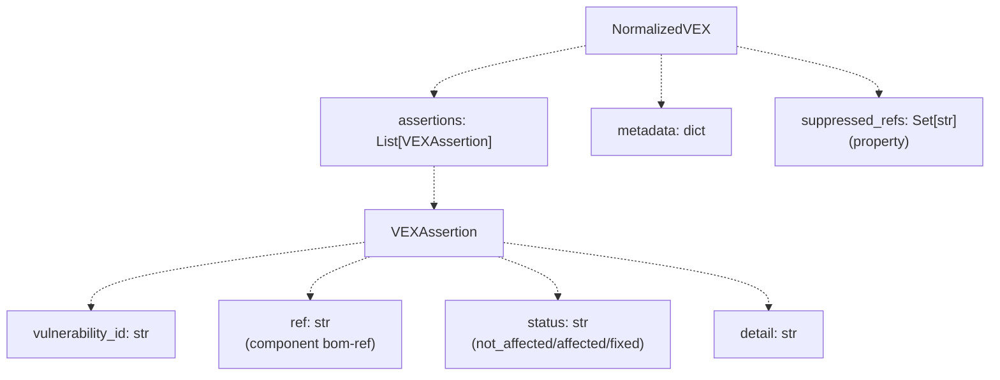

The `suppressed_refs` property returns component references with `status="not_affected"` for noise filtering.

**Sources:** [apps/api/normalizers.py L401-L441](https://github.com/DevOpsMadDog/Fixops/blob/ce6eb1e9/apps/api/normalizers.py#L401-L441)

### NormalizedCNAPP

The `NormalizedCNAPP` dataclass structures cloud-native application protection findings with asset context.

| Component | Fields | Purpose |
| --- | --- | --- |
| `CNAPPAsset` | `asset_id`, `attributes` | Cloud asset inventory |
| `CNAPPFinding` | `asset`, `finding_type`, `severity`, `raw` | Security findings linked to assets |
| `NormalizedCNAPP` | `assets`, `findings`, `metadata` | Complete CNAPP payload |

**Sources:** [apps/api/normalizers.py L443-L486](https://github.com/DevOpsMadDog/Fixops/blob/ce6eb1e9/apps/api/normalizers.py#L443-L486)

### NormalizedBusinessContext

The `NormalizedBusinessContext` dataclass supports multiple business context formats (FixOps.yaml, OTM, SSVC).

```yaml
format: str                    # "fixops" | "otm" | "ssvc" | "unknown"
components: List[Dict]         # Component-level context
ssvc: Dict                     # SSVC decision factors (exploitation, exposure, utility, etc.)
metadata: Dict                 # Source information
raw: Dict                      # Original payload
```

**Sources:** [apps/api/normalizers.py L488-L505](https://github.com/DevOpsMadDog/Fixops/blob/ce6eb1e9/apps/api/normalizers.py#L488-L505)

---

## Format-Specific Normalization

### SBOM Normalization

SBOM normalization employs a three-tier fallback strategy for maximum compatibility:

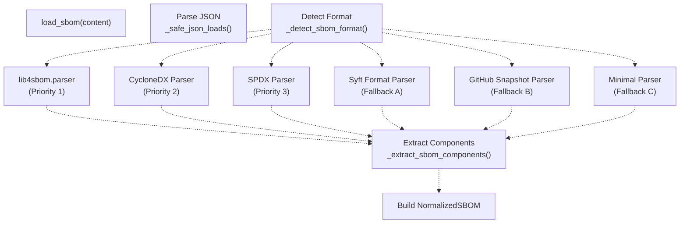

**Format Detection Logic:**

The `_detect_sbom_format` function [apps/api/normalizers.py L920-L980](https://github.com/DevOpsMadDog/Fixops/blob/ce6eb1e9/apps/api/normalizers.py#L920-L980)

 inspects JSON structure to identify:

1. **CycloneDX**: `bomFormat="CycloneDX"`, `specVersion` present
2. **SPDX**: `spdxVersion` field present
3. **Syft**: `descriptor.name="syft"`, `artifacts` array present
4. **GitHub**: `detectedManifests` object present

**Component Extraction:**

The `_extract_sbom_components` function [apps/api/normalizers.py L982-L1050](https://github.com/DevOpsMadDog/Fixops/blob/ce6eb1e9/apps/api/normalizers.py#L982-L1050)

 normalizes component representations:

| Format | Name Source | Version Source | PURL Source |
| --- | --- | --- | --- |
| CycloneDX | `component.name` | `component.version` | `component.purl` |
| SPDX | `package.name` | `package.versionInfo` | Computed from name+version |
| Syft | `artifact.name` | `artifact.version` | `artifact.purl` |
| GitHub | `resolved[key].name` | `resolved[key].version` | `resolved[key].packageUrl` |

**Sources:** [apps/api/normalizers.py L713-L1050](https://github.com/DevOpsMadDog/Fixops/blob/ce6eb1e9/apps/api/normalizers.py#L713-L1050)

 [lib4sbom integration](https://github.com/DevOpsMadDog/Fixops/blob/ce6eb1e9/lib4sbom integration)

### SARIF Normalization

SARIF normalization handles SARIF 2.1.0 schema with optional Snyk fallback conversion.

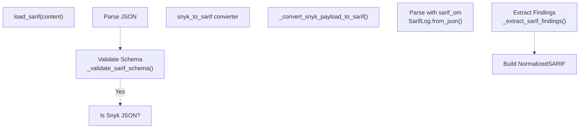

**SARIF Schema Validation:**

The `_validate_sarif_schema` function [apps/api/normalizers.py L1150-L1180](https://github.com/DevOpsMadDog/Fixops/blob/ce6eb1e9/apps/api/normalizers.py#L1150-L1180)

 checks for supported schema URIs:

* `https://json.schemastore.org/sarif-2.1.0.json`
* `http://json.schemastore.org/sarif-2.1.0.json`
* `https://schemastore.azurewebsites.net/schemas/json/sarif-2.1.0-rtm.5.json`

**Snyk Fallback Conversion:**

When the `snyk-to-sarif` package is unavailable, the `_convert_snyk_payload_to_sarif` function [apps/api/normalizers.py L226-L327](https://github.com/DevOpsMadDog/Fixops/blob/ce6eb1e9/apps/api/normalizers.py#L226-L327)

 provides built-in conversion:

1. Collects issues from `issues`, `vulnerabilities`, `licenses`, `securityIssues`, `codeIssues`, `infrastructureAsCodeIssues`
2. Maps Snyk severity to SARIF levels using `_SNYK_SEVERITY_TO_LEVEL` [apps/api/normalizers.py L82-L90](https://github.com/DevOpsMadDog/Fixops/blob/ce6eb1e9/apps/api/normalizers.py#L82-L90)
3. Derives locations from `from`, `file`, `packageName` fields
4. Extracts identifiers from CVE, GHSA, CWE, OSV arrays

**Findings Extraction:**

The `_extract_sarif_findings` function [apps/api/normalizers.py L1182-L1250](https://github.com/DevOpsMadDog/Fixops/blob/ce6eb1e9/apps/api/normalizers.py#L1182-L1250)

 builds `SarifFinding` objects with:

* `rule_id` from result.ruleId
* `level` from result.level (error/warning/note/none)
* `file` from locations[0].physicalLocation.artifactLocation.uri
* `line` from locations[0].physicalLocation.region.startLine
* `tool_name` from run.tool.driver.name

**Sources:** [apps/api/normalizers.py L55-L1250](https://github.com/DevOpsMadDog/Fixops/blob/ce6eb1e9/apps/api/normalizers.py#L55-L1250)

### CVE Feed Normalization

CVE feed normalization uses the `cvelib` library for schema validation with graceful degradation.

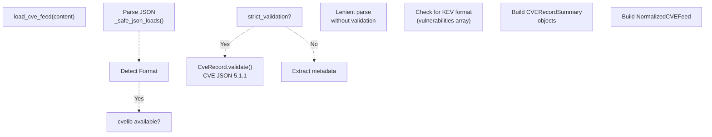

**KEV Format Detection:**

The function checks for CISA KEV catalog structure [apps/api/normalizers.py L835-L870](https://github.com/DevOpsMadDog/Fixops/blob/ce6eb1e9/apps/api/normalizers.py#L835-L870)

:

* `catalogs[0].vulnerabilities` array present
* Each entry has `cveID`, `vulnerabilityName`, `dateAdded`
* Sets `exploited=True` for KEV entries

**Error Tracking:**

Validation errors are accumulated in the `errors` list for observability while allowing partial ingestion.

**Sources:** [apps/api/normalizers.py L814-L870](https://github.com/DevOpsMadDog/Fixops/blob/ce6eb1e9/apps/api/normalizers.py#L814-L870)

### VEX Normalization

VEX normalization extracts vulnerability exploitability assertions from CycloneDX VEX documents.

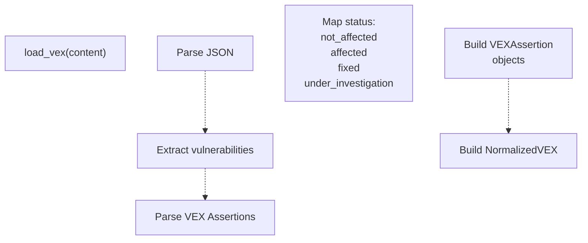

**VEX Assertion Structure:**

Each VEX assertion [apps/api/normalizers.py L402-L419](https://github.com/DevOpsMadDog/Fixops/blob/ce6eb1e9/apps/api/normalizers.py#L402-L419)

 maps a vulnerability to affected components:

* `vulnerability_id`: CVE or other vulnerability identifier
* `ref`: Component bom-ref from SBOM
* `status`: Exploitability status (not_affected, affected, fixed, under_investigation)
* `detail`: Optional justification or analysis

The `suppressed_refs` property provides a set of component references with `status="not_affected"` for downstream filtering.

**Sources:** [apps/api/normalizers.py L850-L880](https://github.com/DevOpsMadDog/Fixops/blob/ce6eb1e9/apps/api/normalizers.py#L850-L880)

### CNAPP Normalization

CNAPP normalization structures cloud security findings with asset linkage.

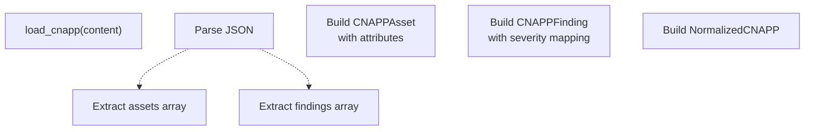

**Asset Extraction:**

Assets are extracted from `assets` or `resources` arrays [apps/api/normalizers.py L873-L900](https://github.com/DevOpsMadDog/Fixops/blob/ce6eb1e9/apps/api/normalizers.py#L873-L900)

 with:

* `asset_id`: Cloud resource identifier (ARN, resource ID)
* `attributes`: Cloud provider, region, account, resource type, tags

**Finding Extraction:**

Findings link to assets via `asset` or `resource` references with standardized severity levels.

**Sources:** [apps/api/normalizers.py L871-L910](https://github.com/DevOpsMadDog/Fixops/blob/ce6eb1e9/apps/api/normalizers.py#L871-L910)

### Business Context Normalization

Business context normalization supports three formats: FixOps.yaml, OTM (Open Threat Model), and SSVC (Stakeholder-Specific Vulnerability Categorization).

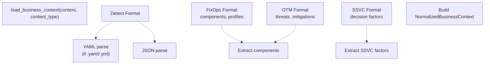

**FixOps Format:**

Detects presence of `components` array with `name`, `criticality`, `internet_facing`, `authentication_required` fields.

**OTM Format:**

Detects presence of `otmVersion`, `project`, `representations` fields from Open Threat Model specification.

**SSVC Format:**

Detects presence of SSVC decision factors: `exploitation`, `exposure`, `automatable`, `technical_impact`, `mission_impact`, `safety_impact`.

**Sources:** [apps/api/normalizers.py L914-L980](https://github.com/DevOpsMadDog/Fixops/blob/ce6eb1e9/apps/api/normalizers.py#L914-L980)

---

## Advanced Ingestion System

The advanced ingestion system provides a plugin-based architecture with the `NormalizerRegistry` and `UnifiedFinding` model for scanner-agnostic processing.

### NormalizerRegistry Architecture

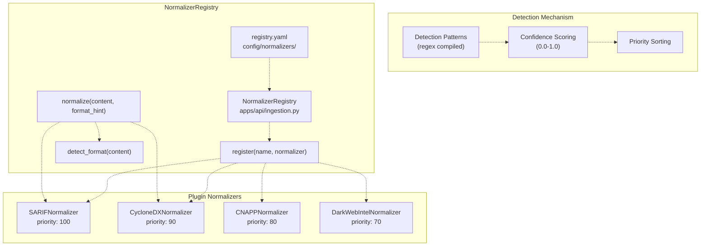

**Configuration Structure:**

The `registry.yaml` [config/normalizers/registry.yaml L1-L200](https://github.com/DevOpsMadDog/Fixops/blob/ce6eb1e9/config/normalizers/registry.yaml#L1-L200)

 defines:

* Global settings: max_document_bytes, worker_threads, schema_evolution_mode
* Format detection: auto_detect, confidence_threshold, extension_mappings
* Normalizer plugins: enabled, priority, detection_patterns, supported_versions

**Format Detection:**

The `detect_format` method [apps/api/ingestion.py L650-L720](https://github.com/DevOpsMadDog/Fixops/blob/ce6eb1e9/apps/api/ingestion.py#L650-L720)

:

1. Reads first 10KB of content for pattern matching
2. Applies compiled regex patterns for each enabled normalizer
3. Calculates confidence score (matches / total_patterns)
4. Returns highest-confidence normalizer above threshold

**Sources:** [apps/api/ingestion.py L464-L550](https://github.com/DevOpsMadDog/Fixops/blob/ce6eb1e9/apps/api/ingestion.py#L464-L550)

 [config/normalizers/registry.yaml L1-L200](https://github.com/DevOpsMadDog/Fixops/blob/ce6eb1e9/config/normalizers/registry.yaml#L1-L200)

### UnifiedFinding Model

The `UnifiedFinding` Pydantic model provides a comprehensive schema for all security finding types.

```mermaid
flowchart TD

UnifiedFinding["UnifiedFinding<br>(Pydantic BaseModel)"]
id["id: str<br>(UUID)"]
source_id["source_id: str"]
source_format["source_format: SourceFormat"]
source_tool["source_tool: str"]
finding_type["finding_type: FindingType"]
severity["severity: FindingSeverity"]
status["status: FindingStatus"]
cve_id["cve_id: str"]
cwe_id["cwe_id: str"]
cvss_score["cvss_score: float"]
epss_score["epss_score: float"]
exploit_available["exploit_available: bool"]
in_kev["in_kev: bool"]
asset_id["asset_id: str"]
asset_type["asset_type: AssetType"]
file_path["file_path: str"]
line_number["line_number: int"]
package_name["package_name: str"]
package_version["package_version: str"]
purl["purl: str"]
cloud_provider["cloud_provider: str"]
cloud_region["cloud_region: str"]
cloud_resource_id["cloud_resource_id: str"]

UnifiedFinding -.-> id
UnifiedFinding -.-> source_id
UnifiedFinding -.-> source_format
UnifiedFinding -.-> source_tool
UnifiedFinding -.-> finding_type
UnifiedFinding -.-> severity
UnifiedFinding -.-> status
UnifiedFinding -.-> cve_id
UnifiedFinding -.-> cwe_id
UnifiedFinding -.-> cvss_score
UnifiedFinding -.-> epss_score
UnifiedFinding -.-> asset_id
UnifiedFinding -.-> file_path
UnifiedFinding -.-> package_name
UnifiedFinding -.-> cloud_provider

subgraph subGraph5 ["Cloud Context"]
    cloud_provider
    cloud_region
    cloud_resource_id
end

subgraph subGraph4 ["Package Context"]
    package_name
    package_version
    purl
end

subgraph subGraph3 ["Asset Context"]
    asset_id
    asset_type
    file_path
    line_number
end

subgraph subGraph2 ["Vulnerability Context"]
    cve_id
    cwe_id
    cvss_score
    epss_score
    exploit_available
    in_kev
end

subgraph Classification ["Classification"]
    finding_type
    severity
    status
end

subgraph Identity ["Identity"]
    id
    source_id
    source_format
    source_tool
end
```

**Severity Normalization:**

The `normalize_severity` validator [apps/api/ingestion.py L276-L297](https://github.com/DevOpsMadDog/Fixops/blob/ce6eb1e9/apps/api/ingestion.py#L276-L297)

 maps diverse severity representations:

| Input Value | Normalized Severity |
| --- | --- |
| "critical", "CRITICAL" | `FindingSeverity.CRITICAL` |
| "high", "HIGH", "error" | `FindingSeverity.HIGH` |
| "medium", "moderate", "warning" | `FindingSeverity.MEDIUM` |
| "low", "LOW", "note" | `FindingSeverity.LOW` |
| "info", "informational", "none" | `FindingSeverity.INFO` |
| 9.0-10.0 (CVSS) | `FindingSeverity.CRITICAL` |
| 7.0-8.9 (CVSS) | `FindingSeverity.HIGH` |
| 4.0-6.9 (CVSS) | `FindingSeverity.MEDIUM` |
| 0.1-3.9 (CVSS) | `FindingSeverity.LOW` |

**Fingerprint Computation:**

The `compute_fingerprint` method [apps/api/ingestion.py L299-L315](https://github.com/DevOpsMadDog/Fixops/blob/ce6eb1e9/apps/api/ingestion.py#L299-L315)

 generates a SHA256 hash from:

* source_format, finding_type, title
* cve_id, file_path, line_number
* package_name, package_version, rule_id, cloud_resource_id

This enables deduplication across scanner runs.

**Sources:** [apps/api/ingestion.py L126-L316](https://github.com/DevOpsMadDog/Fixops/blob/ce6eb1e9/apps/api/ingestion.py#L126-L316)

### Plugin Normalizer Implementations

Each normalizer implements the `NormalizerPlugin` protocol [apps/api/ingestion.py L351-L367](https://github.com/DevOpsMadDog/Fixops/blob/ce6eb1e9/apps/api/ingestion.py#L351-L367)

:

**SARIFNormalizer:**

* Detection patterns: `"version".*"2\.1\."`, `"runs"`, `"results"`
* Schema evolution support for SARIF 2.1.0 and 2.2.0
* Extracts CWE from taxonomies or rule properties
* Handles web request/response info (SARIF 2.2)

**CycloneDXNormalizer:**

* Detection patterns: `"bomFormat".*"CycloneDX"`, `"vulnerabilities"`
* Extracts component-vulnerability relationships via affects array
* Maps CVSS scores to severity
* Supports package URL (purl) resolution

**CNAPPNormalizer:**

* Detection patterns: `"cloudProvider"`, `"resourceType"`, `"findings"`
* Links findings to cloud assets
* Extracts compliance frameworks
* Maps cloud resource metadata

**DarkWebIntelNormalizer:**

* Detection patterns: `"darkWebSource"`, `"threatIntelligence"`, `"items"`
* Categorizes finding types: credential_leak, data_breach, malware
* Includes confidence scores from intelligence sources
* Tracks discovery timestamps

**Sources:** [apps/api/ingestion.py L474-L750](https://github.com/DevOpsMadDog/Fixops/blob/ce6eb1e9/apps/api/ingestion.py#L474-L750)

### IngestionService

The `IngestionService` class provides async ingestion with performance metrics.

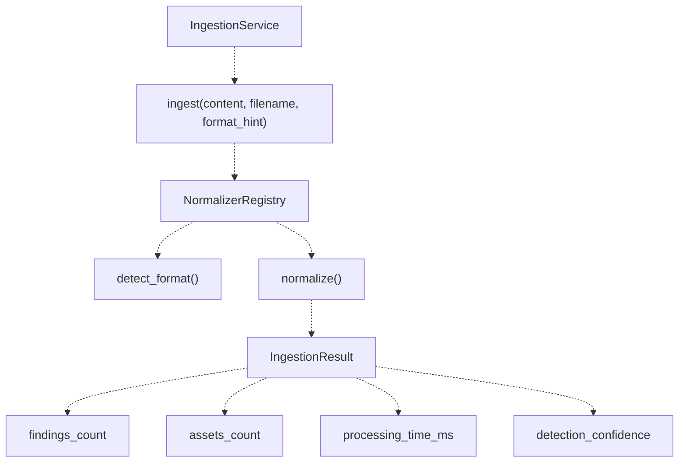

**Performance Tracking:**

The `ingest` method [apps/api/ingestion.py L850-L950](https://github.com/DevOpsMadDog/Fixops/blob/ce6eb1e9/apps/api/ingestion.py#L850-L950)

 measures:

* `processing_time_ms`: Total normalization time
* `detection_confidence`: Format detection confidence (0.0-1.0)
* `findings_count`: Number of findings extracted
* `assets_count`: Number of assets discovered

**Sources:** [apps/api/ingestion.py L800-L950](https://github.com/DevOpsMadDog/Fixops/blob/ce6eb1e9/apps/api/ingestion.py#L800-L950)

---

## API Integration

The FastAPI application integrates normalization through upload endpoints and processing functions.

### Upload Endpoint Flow

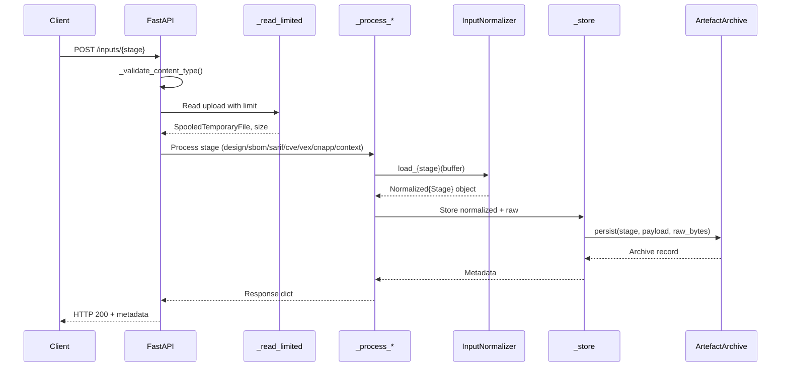

**Upload Limit Enforcement:**

The `_read_limited` function [apps/api/app.py L596-L628](https://github.com/DevOpsMadDog/Fixops/blob/ce6eb1e9/apps/api/app.py#L596-L628)

 enforces per-stage upload limits:

1. Reads file in 1MB chunks
2. Checks `total + chunk_size <= limit` **before** writing
3. Raises HTTP 413 if limit exceeded
4. Returns `SpooledTemporaryFile` for further processing

**Content Type Validation:**

The `_validate_content_type` function [apps/api/app.py L643-L652](https://github.com/DevOpsMadDog/Fixops/blob/ce6eb1e9/apps/api/app.py#L643-L652)

 checks MIME types:

* Design: `text/csv`
* SBOM, SARIF, CVE, VEX, CNAPP: `application/json`
* Context: `application/json`, `application/x-yaml`, `text/yaml`

**Storage Flow:**

The `_store` function [apps/api/app.py L654-L676](https://github.com/DevOpsMadDog/Fixops/blob/ce6eb1e9/apps/api/app.py#L654-L676)

:

1. Stores normalized payload in `app.state.artifacts[stage]`
2. Calls `ArtefactArchive.persist()` with raw bytes and normalized data
3. Records manifest in `app.state.archive_records[stage]`
4. Continues pipeline execution even if persistence fails (logged as warning)

**Sources:** [apps/api/app.py L596-L1050](https://github.com/DevOpsMadDog/Fixops/blob/ce6eb1e9/apps/api/app.py#L596-L1050)

### Processing Functions

Each stage has a dedicated processing function that calls the appropriate normalizer method:

| Function | Normalizer Method | Input Validation | Error Handling |
| --- | --- | --- | --- |
| `_process_design` | CSV parsing | Row count, column presence | HTTP 400/422 |
| `_process_sbom` | `load_sbom()` | bomFormat check | HTTP 400/422 |
| `_process_sarif` | `load_sarif()` | Schema validation | HTTP 400 |
| `_process_cve` | `load_cve_feed()` | Record validation | HTTP 400/422 |
| `_process_vex` | `load_vex()` | Assertion format | HTTP 400 |
| `_process_cnapp` | `load_cnapp()` | Asset/finding structure | HTTP 400 |
| `_process_context` | `load_business_context()` | Format detection | HTTP 400 |

**Strict Validation Mode:**

When `overlay.toggles.get("strict_validation")` is enabled:

* Design CSV: Validates required columns (component, subcomponent, owner, data_class, description, control_scope)
* SBOM: Rejects unsupported bomFormat values
* CVE: Rejects feeds with validation errors

In lenient mode (default), warnings are logged but processing continues.

**Sources:** [apps/api/app.py L687-L940](https://github.com/DevOpsMadDog/Fixops/blob/ce6eb1e9/apps/api/app.py#L687-L940)

---

## CLI Integration

The CLI uses the `InputNormalizer` through the `_load_inputs` helper function.

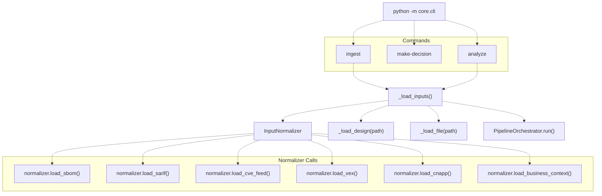

**File Loading:**

The `_load_file` function [core/cli.py L77-L84](https://github.com/DevOpsMadDog/Fixops/blob/ce6eb1e9/core/cli.py#L77-L84)

 performs basic validation:

* Checks file exists with `path.exists()`
* Checks is regular file with `path.is_file()`
* Returns raw bytes with `path.read_bytes()`

**Design CSV Loading:**

The `_load_design` function [core/cli.py L64-L74](https://github.com/DevOpsMadDog/Fixops/blob/ce6eb1e9/core/cli.py#L64-L74)

 parses CSV with:

* UTF-8 encoding
* `csv.DictReader` for column headers
* Filters empty rows (all values stripped are empty)
* Returns dict with `columns` and `rows` keys

**Normalizer Usage:**

The `_load_inputs` function [core/cli.py L87-L123](https://github.com/DevOpsMadDog/Fixops/blob/ce6eb1e9/core/cli.py#L87-L123)

 conditionally loads each artifact:

```
if sbom_path is not None:
    payload["sbom"] = normalizer.load_sbom(_load_file(sbom_path) or b"")

if sarif_path is not None:
    payload["sarif"] = normalizer.load_sarif(_load_file(sarif_path) or b"")

if cve_path is not None:
    payload["cve"] = normalizer.load_cve_feed(_load_file(cve_path) or b"")
```

**Sources:** [core/cli.py L64-L392](https://github.com/DevOpsMadDog/Fixops/blob/ce6eb1e9/core/cli.py#L64-L392)

---

## Validation & Error Handling

### Input Validation

The normalization layer implements defense-in-depth validation:

**Size Limits:**

[apps/api/normalizers.py L76-L81](https://github.com/DevOpsMadDog/Fixops/blob/ce6eb1e9/apps/api/normalizers.py#L76-L81)

```markdown
DEFAULT_MAX_DOCUMENT_BYTES = 8 * 1024 * 1024  # 8 MB
MAX_JSON_DEPTH = 20
MAX_JSON_ITEMS = 1000000  # 1M items for large CVE feeds
```

The `_safe_json_loads` function [apps/api/normalizers.py L92-L138](https://github.com/DevOpsMadDog/Fixops/blob/ce6eb1e9/apps/api/normalizers.py#L92-L138)

 enforces:

* Maximum nesting depth to prevent stack overflow
* Maximum item count (dict keys + list items) to prevent memory exhaustion
* Recursive traversal with counter to detect excessive structures

**CVE ID Validation:**

[core/micro_pentest.py L24-L34](https://github.com/DevOpsMadDog/Fixops/blob/ce6eb1e9/core/micro_pentest.py#L24-L34)

```python
CVE_PATTERN = re.compile(r"^CVE-\d{4}-\d{4,}$", re.IGNORECASE)

def _validate_cve_id(cve_id: str) -> bool:
    """Validate CVE ID format to prevent prompt injection."""
    return bool(CVE_PATTERN.match(cve_id))
```

**URL Validation:**

[core/micro_pentest.py L36-L78](https://github.com/DevOpsMadDog/Fixops/blob/ce6eb1e9/core/micro_pentest.py#L36-L78)

```python
ALLOWED_URL_SCHEMES = {"http", "https"}

def _validate_target_url(url: str) -> bool:
    """Validate target URL to prevent SSRF attacks."""
    # Blocks localhost, 127.0.0.1, ::1, private IP ranges
```

**Filename Sanitization:**

[core/storage.py L16-L39](https://github.com/DevOpsMadDog/Fixops/blob/ce6eb1e9/core/storage.py#L16-L39)

```python
def _sanitize_filename(filename: str) -> str:
    """Sanitize filename to prevent path traversal."""
    filename = os.path.basename(filename)  # Remove directory components
    filename = filename.replace("\x00", "")  # Remove null bytes
    filename = re.sub(r'[<>:"|?*]', "_", filename)  # Replace special chars
    filename = filename.strip(". ")  # Remove leading/trailing dots/spaces
```

**Sources:** [apps/api/normalizers.py L76-L138](https://github.com/DevOpsMadDog/Fixops/blob/ce6eb1e9/apps/api/normalizers.py#L76-L138)

 [core/micro_pentest.py L24-L78](https://github.com/DevOpsMadDog/Fixops/blob/ce6eb1e9/core/micro_pentest.py#L24-L78)

 [core/storage.py L16-L39](https://github.com/DevOpsMadDog/Fixops/blob/ce6eb1e9/core/storage.py#L16-L39)

### Error Handling Strategy

**Graceful Degradation:**

Normalizers implement multi-tier fallback to maximize ingestion success:

1. **SBOM:** lib4sbom → CycloneDX parser → SPDX parser → Syft parser → GitHub parser → minimal parser
2. **SARIF:** snyk-to-sarif converter → built-in Snyk converter → SARIF schema validation
3. **CVE:** cvelib validation → lenient parsing without validation

**Error Accumulation:**

The `NormalizedCVEFeed.errors` field [apps/api/normalizers.py L389-L398](https://github.com/DevOpsMadDog/Fixops/blob/ce6eb1e9/apps/api/normalizers.py#L389-L398)

 accumulates validation errors without blocking ingestion:

```yaml
errors: List[str]  # Validation error messages
metadata: dict     # Includes record_count, source_info
```

This allows observability of data quality issues while maintaining pipeline throughput.

**Exception Handling:**

API processing functions [apps/api/app.py L687-L940](https://github.com/DevOpsMadDog/Fixops/blob/ce6eb1e9/apps/api/app.py#L687-L940)

 wrap normalizer calls in try/except blocks:

```python
try:
    sbom: NormalizedSBOM = normalizer.load_sbom(buffer)
except Exception as exc:
    logger.exception("SBOM normalisation failed")
    raise HTTPException(
        status_code=400, 
        detail=f"Failed to parse SBOM: {exc}"
    ) from exc
```

**Persistence Failure Isolation:**

The `_store` function [apps/api/app.py L654-L676](https://github.com/DevOpsMadDog/Fixops/blob/ce6eb1e9/apps/api/app.py#L654-L676)

 isolates persistence errors:

```yaml
try:
    record = app.state.archive.persist(stage, payload, ...)
except Exception as exc:
    logger.exception("Failed to persist artefact stage %s", stage)
    record = {"stage": stage, "error": str(exc)}
```

Pipeline execution continues even if archival fails, ensuring ingestion is not blocked by storage issues.

**Sources:** [apps/api/app.py L654-L940](https://github.com/DevOpsMadDog/Fixops/blob/ce6eb1e9/apps/api/app.py#L654-L940)

 [apps/api/normalizers.py L389-L1250](https://github.com/DevOpsMadDog/Fixops/blob/ce6eb1e9/apps/api/normalizers.py#L389-L1250)