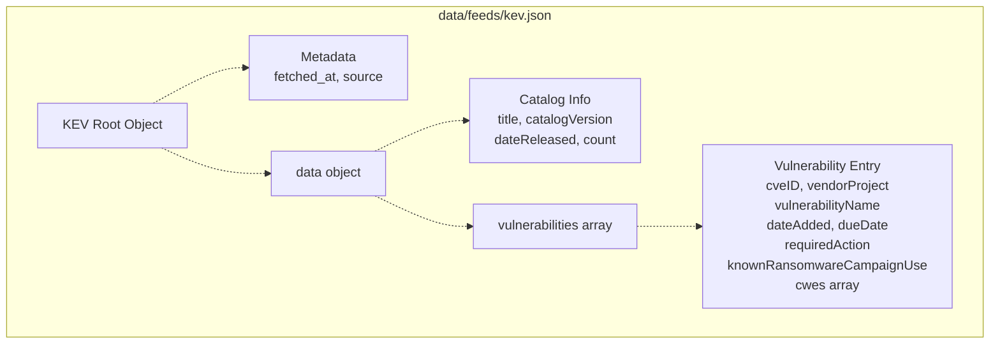
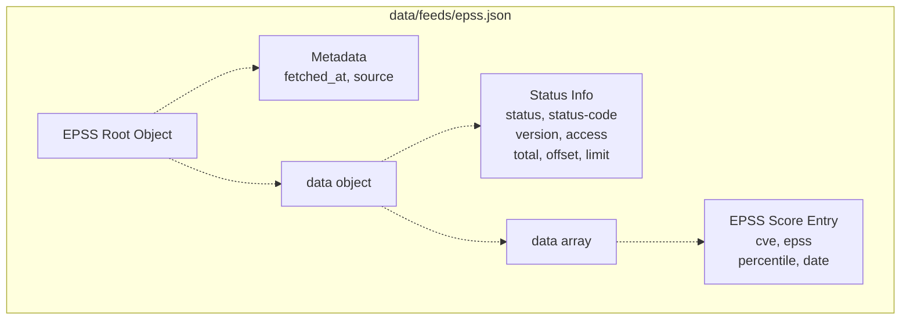
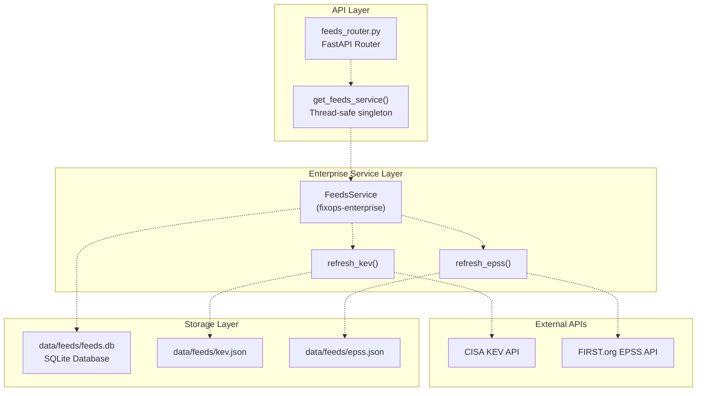
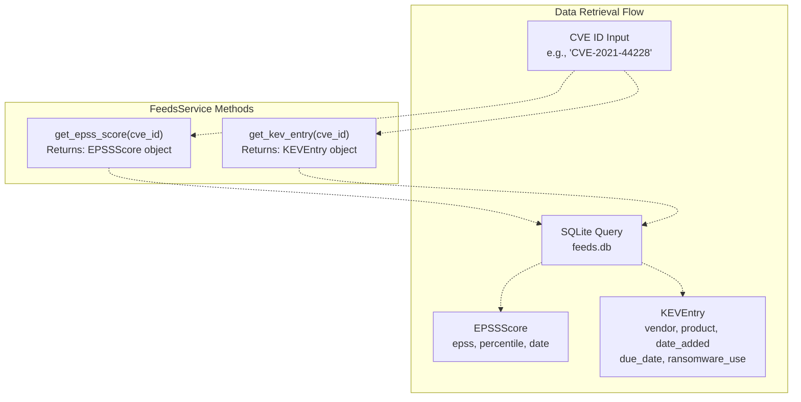
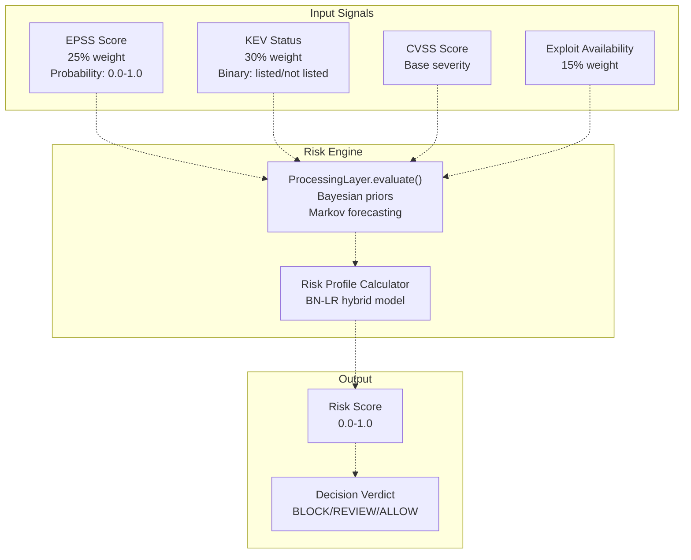
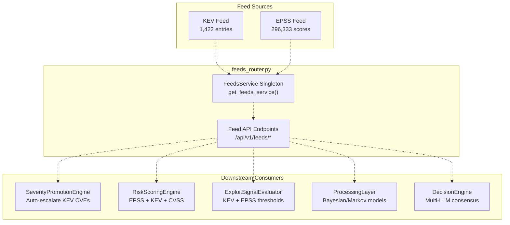

# KEV and EPSS Feeds

> **Relevant source files**
> * [.emergent/emergent.yml](https://github.com/DevOpsMadDog/Fixops/blob/ce6eb1e9/.emergent/emergent.yml)
> * [.gitignore](https://github.com/DevOpsMadDog/Fixops/blob/ce6eb1e9/.gitignore)
> * [apps/api/analytics_router.py](https://github.com/DevOpsMadDog/Fixops/blob/ce6eb1e9/apps/api/analytics_router.py)
> * [apps/api/audit_router.py](https://github.com/DevOpsMadDog/Fixops/blob/ce6eb1e9/apps/api/audit_router.py)
> * [apps/api/dependencies.py](https://github.com/DevOpsMadDog/Fixops/blob/ce6eb1e9/apps/api/dependencies.py)
> * [apps/api/feeds_router.py](https://github.com/DevOpsMadDog/Fixops/blob/ce6eb1e9/apps/api/feeds_router.py)
> * [apps/api/inventory_router.py](https://github.com/DevOpsMadDog/Fixops/blob/ce6eb1e9/apps/api/inventory_router.py)
> * [apps/api/marketplace_router.py](https://github.com/DevOpsMadDog/Fixops/blob/ce6eb1e9/apps/api/marketplace_router.py)
> * [apps/api/mpte_router.py](https://github.com/DevOpsMadDog/Fixops/blob/ce6eb1e9/apps/api/mpte_router.py)
> * [apps/api/policies_router.py](https://github.com/DevOpsMadDog/Fixops/blob/ce6eb1e9/apps/api/policies_router.py)
> * [apps/api/teams_router.py](https://github.com/DevOpsMadDog/Fixops/blob/ce6eb1e9/apps/api/teams_router.py)
> * [apps/api/workflows_router.py](https://github.com/DevOpsMadDog/Fixops/blob/ce6eb1e9/apps/api/workflows_router.py)
> * [data/feeds/epss.json](https://github.com/DevOpsMadDog/Fixops/blob/ce6eb1e9/data/feeds/epss.json)
> * [data/feeds/kev.json](https://github.com/DevOpsMadDog/Fixops/blob/ce6eb1e9/data/feeds/kev.json)
> * [tests/test_api_smoke.py](https://github.com/DevOpsMadDog/Fixops/blob/ce6eb1e9/tests/test_api_smoke.py)

## Purpose and Scope

This document describes the Known Exploited Vulnerabilities (KEV) and Exploit Prediction Scoring System (EPSS) feed subsystem within FixOps. These feeds provide authoritative threat intelligence data that powers risk-based decision making throughout the platform.

The KEV and EPSS feeds serve as foundational data sources for:

* Severity escalation in the vulnerability processing pipeline (see [Severity Promotion Engine](/DevOpsMadDog/Fixops/2.3-severity-promotion-engine))
* Risk score calculation in the decision engine (see [Risk-Based Profiling](/DevOpsMadDog/Fixops/4.3-risk-based-profiling))
* Exploit signal detection (see [Exploit Signal Detection](/DevOpsMadDog/Fixops/2.4-exploit-signal-detection))

For broader vulnerability intelligence orchestration across 166+ sources, see [Threat Intelligence Orchestration](/DevOpsMadDog/Fixops/2.2-threat-intelligence-orchestration).

**Sources:** [apps/api/feeds_router.py L1-L13](https://github.com/DevOpsMadDog/Fixops/blob/ce6eb1e9/apps/api/feeds_router.py#L1-L13)

---

## Data Sources

FixOps fetches vulnerability intelligence from two authoritative public feeds:

| Feed | Source | URL | Records | Update Frequency |
| --- | --- | --- | --- | --- |
| **KEV** | CISA (Cybersecurity and Infrastructure Security Agency) | `https://www.cisa.gov/sites/default/files/feeds/known_exploited_vulnerabilities.json` | 1,422 vulnerabilities | Daily |
| **EPSS** | FIRST.org (Forum of Incident Response and Security Teams) | `https://api.first.org/data/v1/epss?pretty=true` | 296,333 CVEs | Daily |

### KEV (Known Exploited Vulnerabilities)

CISA maintains a catalog of CVEs with confirmed active exploitation in the wild. Each KEV entry includes:

* CVE ID
* Vendor/product information
* Vulnerability name and description
* Date added to KEV catalog
* Required action for remediation
* Due date for federal agencies
* Ransomware campaign usage indicator
* Associated CWE (Common Weakness Enumeration) IDs

### EPSS (Exploit Prediction Scoring System)

FIRST.org provides machine learning-based probability scores (0.0-1.0) predicting the likelihood of exploitation within 30 days. Each EPSS entry includes:

* CVE ID
* EPSS score (probability of exploitation)
* Percentile ranking
* Date of score calculation

**Sources:** [data/feeds/kev.json L1-L10](https://github.com/DevOpsMadDog/Fixops/blob/ce6eb1e9/data/feeds/kev.json#L1-L10)

 [data/feeds/epss.json L1-L10](https://github.com/DevOpsMadDog/Fixops/blob/ce6eb1e9/data/feeds/epss.json#L1-L10)

 [apps/api/feeds_router.py L142-L169](https://github.com/DevOpsMadDog/Fixops/blob/ce6eb1e9/apps/api/feeds_router.py#L142-L169)

---

## Feed Storage Format

Both feeds are cached locally as JSON files with a wrapper structure containing metadata and the raw feed data.

### KEV Storage Structure



**Example KEV Entry:**

```python
{
  "cveID": "CVE-2025-32463",
  "vendorProject": "Sudo",
  "product": "Sudo",
  "vulnerabilityName": "Sudo Inclusion of Functionality from Untrusted Control Sphere Vulnerability",
  "dateAdded": "2025-09-29",
  "shortDescription": "...",
  "requiredAction": "Apply mitigations per vendor instructions...",
  "dueDate": "2025-10-20",
  "knownRansomwareCampaignUse": "Unknown",
  "cwes": ["CWE-829"]
}
```

**Sources:** [data/feeds/kev.json L1-L24](https://github.com/DevOpsMadDog/Fixops/blob/ce6eb1e9/data/feeds/kev.json#L1-L24)

### EPSS Storage Structure



**Example EPSS Entry:**

```json
{
  "cve": "CVE-2025-9999",
  "epss": "0.000400000",
  "percentile": "0.116420000",
  "date": "2025-10-01"
}
```

**Sources:** [data/feeds/epss.json L1-L18](https://github.com/DevOpsMadDog/Fixops/blob/ce6eb1e9/data/feeds/epss.json#L1-L18)

---

## Feed Refresh Mechanism

### FeedsService Architecture



### Singleton Pattern

The `get_feeds_service()` function implements a thread-safe singleton pattern using double-checked locking to ensure only one `FeedsService` instance exists across the application:

```python
_feeds_service: Optional[FeedsService] = None
_feeds_service_lock = threading.Lock()

def get_feeds_service() -> FeedsService:
    global _feeds_service
    if _feeds_service is None:
        with _feeds_service_lock:
            if _feeds_service is None:
                _feeds_service = FeedsService(_DATA_DIR / "feeds.db")
    return _feeds_service
```

**Sources:** [apps/api/feeds_router.py L53-L66](https://github.com/DevOpsMadDog/Fixops/blob/ce6eb1e9/apps/api/feeds_router.py#L53-L66)

### Refresh Results

Both `refresh_epss()` and `refresh_kev()` methods return a result object containing:

* `success` - Boolean indicating refresh success
* `records_updated` - Number of records updated
* `feed_name` - Source feed identifier
* `refreshed_at` - Timestamp of refresh operation
* `error` - Error message if refresh failed

**Sources:** [apps/api/feeds_router.py L172-L185](https://github.com/DevOpsMadDog/Fixops/blob/ce6eb1e9/apps/api/feeds_router.py#L172-L185)

 [apps/api/feeds_router.py L224-L237](https://github.com/DevOpsMadDog/Fixops/blob/ce6eb1e9/apps/api/feeds_router.py#L224-L237)

---

## API Endpoints

### EPSS Endpoints

#### GET /api/v1/feeds/epss

Retrieve EPSS scores for specific CVEs or high-risk vulnerabilities.

**Query Parameters:**

* `cve_ids` (optional) - Comma-separated CVE IDs
* `min_score` (optional, default: 0.0) - Minimum EPSS score (0.0-1.0)
* `limit` (optional, default: 100, max: 1000) - Maximum results

**Response:**

```json
{
  "scores": [
    {
      "cve": "CVE-2025-9999",
      "epss": 0.0004,
      "percentile": 0.11642,
      "date": "2025-10-01"
    }
  ],
  "count": 1
}
```

#### POST /api/v1/feeds/epss/refresh

Trigger manual refresh of EPSS feed from FIRST.org.

**Request Body:**

```json
{
  "force": false
}
```

**Response:**

```json
{
  "status": "refreshed",
  "records_updated": 296333,
  "source": "EPSS",
  "timestamp": "2025-10-02T07:31:35.751410+00:00",
  "error": null
}
```

**Sources:** [apps/api/feeds_router.py L142-L186](https://github.com/DevOpsMadDog/Fixops/blob/ce6eb1e9/apps/api/feeds_router.py#L142-L186)

### KEV Endpoints

#### GET /api/v1/feeds/kev

Retrieve KEV catalog entries for specific CVEs.

**Query Parameters:**

* `cve_ids` (optional) - Comma-separated CVE IDs
* `limit` (optional, default: 100, max: 1000) - Maximum results

**Response:**

```json
{
  "entries": [
    {
      "cve_id": "CVE-2025-32463",
      "vendor_project": "Sudo",
      "product": "Sudo",
      "vulnerability_name": "Sudo Inclusion of Functionality...",
      "date_added": "2025-09-29",
      "due_date": "2025-10-20",
      "known_ransomware": false
    }
  ],
  "count": 1
}
```

#### POST /api/v1/feeds/kev/refresh

Trigger manual refresh of KEV catalog from CISA.

**Request Body:**

```json
{
  "force": false
}
```

**Response:**

```json
{
  "status": "refreshed",
  "records_updated": 1422,
  "source": "KEV",
  "timestamp": "2025-10-02T07:31:35.927360+00:00",
  "error": null
}
```

**Sources:** [apps/api/feeds_router.py L193-L237](https://github.com/DevOpsMadDog/Fixops/blob/ce6eb1e9/apps/api/feeds_router.py#L193-L237)

### Bulk Refresh

#### POST /api/v1/feeds/refresh/all

Refresh both EPSS and KEV feeds in a single operation.

**Response:**

```json
{
  "status": "completed",
  "results": {
    "epss": {
      "success": true,
      "records_updated": 296333,
      "error": null
    },
    "kev": {
      "success": true,
      "records_updated": 1422,
      "error": null
    }
  }
}
```

**Sources:** [apps/api/feeds_router.py L706-L737](https://github.com/DevOpsMadDog/Fixops/blob/ce6eb1e9/apps/api/feeds_router.py#L706-L737)

---

## Feed Lookup and Enrichment

### Individual CVE Lookups

The `FeedsService` provides methods to lookup individual CVE data:



### High-Risk CVE Queries

The service provides a convenience method to find high-risk CVEs based on EPSS thresholds:

```markdown
# Retrieves CVEs with EPSS >= threshold, ordered by score descending
high_risk = service.get_high_risk_cves(epss_threshold=0.7, limit=100)
```

**Sources:** [apps/api/feeds_router.py L142-L169](https://github.com/DevOpsMadDog/Fixops/blob/ce6eb1e9/apps/api/feeds_router.py#L142-L169)

### Comprehensive Enrichment

#### POST /api/v1/feeds/enrich

Enriches a batch of findings with KEV status, EPSS scores, and geo-weighted risk calculations.

**Request:**

```json
{
  "findings": [
    {
      "cve_id": "CVE-2021-44228",
      "title": "Log4Shell",
      "severity": "CRITICAL"
    }
  ],
  "target_region": "north_america"
}
```

**Response:**

```json
{
  "enriched_findings": [
    {
      "cve_id": "CVE-2021-44228",
      "title": "Log4Shell",
      "severity": "CRITICAL",
      "epss_score": 0.975,
      "epss_percentile": 0.999,
      "kev_listed": true,
      "kev_date_added": "2021-12-10",
      "geo_risk_score": 0.982
    }
  ],
  "count": 1,
  "target_region": "north_america"
}
```

**Sources:** [apps/api/feeds_router.py L534-L559](https://github.com/DevOpsMadDog/Fixops/blob/ce6eb1e9/apps/api/feeds_router.py#L534-L559)

---

## Integration with Risk Scoring

The KEV and EPSS feeds are critical inputs to the FixOps risk scoring engine, which combines multiple signals to calculate exploitation probability.

### Risk Score Components



### Severity Escalation Rules

When a CVE is found in the KEV catalog, the system automatically escalates severity:

| Original Severity | KEV Listed | Escalated Severity |
| --- | --- | --- |
| LOW | Yes | HIGH |
| MEDIUM | Yes | CRITICAL |
| HIGH | Yes | CRITICAL |
| CRITICAL | Yes | CRITICAL |

Similarly, high EPSS scores (≥ 0.7) trigger severity escalation for vulnerabilities not already at CRITICAL level.

**Sources:** Based on high-level architecture diagrams showing Risk Scoring Engine

### Exploit Confidence Calculation

#### GET /api/v1/feeds/exploit-confidence/{cve_id}

Calculates a composite exploit confidence score using weighted factors:

| Factor | Weight | Source |
| --- | --- | --- |
| EPSS Score | 25% | FIRST.org EPSS feed |
| KEV Listing | 30% | CISA KEV catalog |
| Exploit Availability | 15% | ExploitDB, GitHub |
| Metasploit Module | 10% | Metasploit framework |
| Nuclei Template | 5% | Project Discovery Nuclei |
| Verified Exploit | 5% | Manual verification |
| Threat Actor Use | 10% | Threat intelligence feeds |

**Response:**

```json
{
  "cve_id": "CVE-2021-44228",
  "confidence_score": 0.92,
  "factors": {
    "epss_score": 0.975,
    "kev_listed": true,
    "exploit_available": true,
    "metasploit_module": true,
    "threat_actor_use": true
  }
}
```

**Sources:** [apps/api/feeds_router.py L455-L488](https://github.com/DevOpsMadDog/Fixops/blob/ce6eb1e9/apps/api/feeds_router.py#L455-L488)

---

## Geo-Weighted Risk Scoring

The feeds service supports regional risk assessment by analyzing national CERT advisories and regional exploitation patterns.

### Supported Regions

```python
class GeoRegion(Enum):
    GLOBAL = "global"
    NORTH_AMERICA = "north_america"
    EUROPE = "europe"
    ASIA_PACIFIC = "asia_pacific"
    MIDDLE_EAST = "middle_east"
    LATIN_AMERICA = "latin_america"
```

### GET /api/v1/feeds/geo-risk/{cve_id}

Calculates geo-weighted risk scores based on regional CERT mentions and exploitation patterns.

**Query Parameters:**

* `region` (default: "global") - Target geographic region

**Response:**

```json
{
  "cve_id": "CVE-2021-44228",
  "base_score": 0.85,
  "geo_scores": {
    "north_america": 0.92,
    "europe": 0.88,
    "asia_pacific": 0.90,
    "global": 0.85
  },
  "cert_mentions": [
    {
      "cert": "US-CERT",
      "region": "north_america",
      "alert_date": "2021-12-10"
    }
  ]
}
```

**Sources:** [apps/api/feeds_router.py L491-L526](https://github.com/DevOpsMadDog/Fixops/blob/ce6eb1e9/apps/api/feeds_router.py#L491-L526)

---

## Feed Statistics and Health

### GET /api/v1/feeds/stats

Returns comprehensive statistics across all feed categories.

**Response:**

```json
{
  "epss_count": 296333,
  "epss_last_updated": "2025-10-02T07:31:35.751410+00:00",
  "kev_count": 1422,
  "kev_last_updated": "2025-10-02T07:31:35.927360+00:00",
  "exploit_intelligence_count": 8473,
  "threat_actor_mappings_count": 523,
  "supply_chain_vulns_count": 15234
}
```

### GET /api/v1/feeds/health

Returns feed health and freshness status.

**Response:**

```json
{
  "status": "healthy",
  "epss": {
    "count": 296333,
    "last_updated": "2025-10-02T07:31:35.751410+00:00"
  },
  "kev": {
    "count": 1422,
    "last_updated": "2025-10-02T07:31:35.927360+00:00"
  },
  "exploit_intelligence": {
    "count": 8473
  },
  "threat_actors": {
    "count": 523
  },
  "supply_chain": {
    "count": 15234
  }
}
```

**Sources:** [apps/api/feeds_router.py L567-L686](https://github.com/DevOpsMadDog/Fixops/blob/ce6eb1e9/apps/api/feeds_router.py#L567-L686)

---

## Feed Categories and Sources

The KEV and EPSS feeds are part of a broader vulnerability intelligence infrastructure comprising 8 categories:

### GET /api/v1/feeds/categories

Returns all feed categories and their constituent sources.

**Feed Categories:**

| Category | Description | Source Count |
| --- | --- | --- |
| AUTHORITATIVE | Ground truth CVE sources (NVD, CISA KEV, MITRE) | 4 |
| NATIONAL_CERT | Geo-specific exploit intelligence | 12 |
| EXPLOIT | Real-world exploit availability | 8 |
| THREAT_ACTOR | APT groups and campaign tracking | 6 |
| SUPPLY_CHAIN | Open source dependency vulnerabilities | 7 |
| CLOUD_RUNTIME | Cloud provider security bulletins | 5 |
| EARLY_SIGNAL | Pre-CVE and emerging threats | 9 |
| ENTERPRISE | Internal SAST/DAST/SCA signals | 6 |

KEV and EPSS belong to the **AUTHORITATIVE** category, providing the foundational data layer for all other intelligence feeds.

**Sources:** [apps/api/feeds_router.py L574-L628](https://github.com/DevOpsMadDog/Fixops/blob/ce6eb1e9/apps/api/feeds_router.py#L574-L628)

 [apps/api/feeds_router.py L1-L12](https://github.com/DevOpsMadDog/Fixops/blob/ce6eb1e9/apps/api/feeds_router.py#L1-L12)

---

## Database Schema

The `FeedsService` stores processed feed data in a SQLite database at `data/feeds/feeds.db`. While the raw JSON files serve as backup/cache, the database enables efficient querying and indexing.

### Key Tables

```css
#mermaid-ffir8l0g8a{font-family:ui-sans-serif,-apple-system,system-ui,Segoe UI,Helvetica;font-size:16px;fill:#333;}@keyframes edge-animation-frame{from{stroke-dashoffset:0;}}@keyframes dash{to{stroke-dashoffset:0;}}#mermaid-ffir8l0g8a .edge-animation-slow{stroke-dasharray:9,5!important;stroke-dashoffset:900;animation:dash 50s linear infinite;stroke-linecap:round;}#mermaid-ffir8l0g8a .edge-animation-fast{stroke-dasharray:9,5!important;stroke-dashoffset:900;animation:dash 20s linear infinite;stroke-linecap:round;}#mermaid-ffir8l0g8a .error-icon{fill:#dddddd;}#mermaid-ffir8l0g8a .error-text{fill:#222222;stroke:#222222;}#mermaid-ffir8l0g8a .edge-thickness-normal{stroke-width:1px;}#mermaid-ffir8l0g8a .edge-thickness-thick{stroke-width:3.5px;}#mermaid-ffir8l0g8a .edge-pattern-solid{stroke-dasharray:0;}#mermaid-ffir8l0g8a .edge-thickness-invisible{stroke-width:0;fill:none;}#mermaid-ffir8l0g8a .edge-pattern-dashed{stroke-dasharray:3;}#mermaid-ffir8l0g8a .edge-pattern-dotted{stroke-dasharray:2;}#mermaid-ffir8l0g8a .marker{fill:#999;stroke:#999;}#mermaid-ffir8l0g8a .marker.cross{stroke:#999;}#mermaid-ffir8l0g8a svg{font-family:ui-sans-serif,-apple-system,system-ui,Segoe UI,Helvetica;font-size:16px;}#mermaid-ffir8l0g8a p{margin:0;}#mermaid-ffir8l0g8a .entityBox{fill:#ffffff;stroke:#dddddd;}#mermaid-ffir8l0g8a .relationshipLabelBox{fill:#dddddd;opacity:0.7;background-color:#dddddd;}#mermaid-ffir8l0g8a .relationshipLabelBox rect{opacity:0.5;}#mermaid-ffir8l0g8a .labelBkg{background-color:rgba(221, 221, 221, 0.5);}#mermaid-ffir8l0g8a .edgeLabel .label{fill:#dddddd;font-size:14px;}#mermaid-ffir8l0g8a .label{font-family:ui-sans-serif,-apple-system,system-ui,Segoe UI,Helvetica;color:#333;}#mermaid-ffir8l0g8a .edge-pattern-dashed{stroke-dasharray:8,8;}#mermaid-ffir8l0g8a .node rect,#mermaid-ffir8l0g8a .node circle,#mermaid-ffir8l0g8a .node ellipse,#mermaid-ffir8l0g8a .node polygon{fill:#ffffff;stroke:#dddddd;stroke-width:1px;}#mermaid-ffir8l0g8a .relationshipLine{stroke:#999;stroke-width:1;fill:none;}#mermaid-ffir8l0g8a .marker{fill:none!important;stroke:#999!important;stroke-width:1;}#mermaid-ffir8l0g8a :root{--mermaid-font-family:"trebuchet ms",verdana,arial,sans-serif;}enrichesenrichestracksEPSS_SCORESstringcve_idPKfloatepssfloatpercentiledatescore_datedatetimefetched_atKEV_ENTRIESstringcve_idPKstringvendor_projectstringproductstringvulnerability_namedatedate_addeddatedue_datebooleanransomware_usejsoncwesdatetimefetched_atEXPLOIT_INTELLIGENCEstringidPKstringcve_idFKstringexploit_sourcestringexploit_typestringexploit_urldateexploit_datebooleanverifiedTHREAT_ACTOR_MAPPINGSstringidPKstringcve_idFKstringthreat_actorstringcampaignjsonttpsstringconfidence
```

**Sources:** Inferred from [apps/api/feeds_router.py L58-L66](https://github.com/DevOpsMadDog/Fixops/blob/ce6eb1e9/apps/api/feeds_router.py#L58-L66)

 and feed service architecture

---

## Usage Examples

### Checking if a CVE is in KEV

```
curl -X GET "http://localhost:8000/api/v1/feeds/kev?cve_ids=CVE-2021-44228" \
  -H "X-API-Key: demo-token"
```

### Getting EPSS Score for Multiple CVEs

```
curl -X GET "http://localhost:8000/api/v1/feeds/epss?cve_ids=CVE-2021-44228,CVE-2022-1234" \
  -H "X-API-Key: demo-token"
```

### Finding High-Risk CVEs

```
curl -X GET "http://localhost:8000/api/v1/feeds/epss?min_score=0.7&limit=50" \
  -H "X-API-Key: demo-token"
```

### Manual Feed Refresh

```css
# Refresh both feeds
curl -X POST "http://localhost:8000/api/v1/feeds/refresh/all" \
  -H "X-API-Key: demo-token"

# Refresh only EPSS
curl -X POST "http://localhost:8000/api/v1/feeds/epss/refresh" \
  -H "X-API-Key: demo-token" \
  -H "Content-Type: application/json" \
  -d '{"force": true}'
```

### Enriching Findings

```
curl -X POST "http://localhost:8000/api/v1/feeds/enrich" \
  -H "X-API-Key: demo-token" \
  -H "Content-Type: application/json" \
  -d '{
    "findings": [
      {"cve_id": "CVE-2021-44228", "severity": "CRITICAL"},
      {"cve_id": "CVE-2022-5678", "severity": "HIGH"}
    ],
    "target_region": "north_america"
  }'
```

**Sources:** [apps/api/feeds_router.py L142-L559](https://github.com/DevOpsMadDog/Fixops/blob/ce6eb1e9/apps/api/feeds_router.py#L142-L559)

---

## Authentication and Multi-Tenancy

All feed endpoints require API key authentication via the `X-API-Key` header. The feeds router uses the standard `get_org_id` dependency for multi-tenancy support:

```python
@router.get("/stats")
def get_feed_stats(org_id: str = Depends(get_org_id)) -> Dict[str, Any]:
    service = get_feeds_service()
    return service.get_comprehensive_stats()
```

Organization ID can be provided via:

* Query parameter: `?org_id=acme-corp`
* HTTP header: `X-Org-ID: acme-corp`
* Defaults to `"default"` if not provided

**Sources:** [apps/api/feeds_router.py L567-L571](https://github.com/DevOpsMadDog/Fixops/blob/ce6eb1e9/apps/api/feeds_router.py#L567-L571)

 [apps/api/dependencies.py L13-L33](https://github.com/DevOpsMadDog/Fixops/blob/ce6eb1e9/apps/api/dependencies.py#L13-L33)

---

## Integration Points

The KEV and EPSS feeds integrate with multiple FixOps subsystems:



**Sources:** Based on high-level architecture diagrams and [apps/api/feeds_router.py L1-L13](https://github.com/DevOpsMadDog/Fixops/blob/ce6eb1e9/apps/api/feeds_router.py#L1-L13)