# Key Concepts

> **Relevant source files**
> * [.emergent/emergent.yml](https://github.com/DevOpsMadDog/Fixops/blob/ce6eb1e9/.emergent/emergent.yml)
> * [.gitignore](https://github.com/DevOpsMadDog/Fixops/blob/ce6eb1e9/.gitignore)
> * [README.md](https://github.com/DevOpsMadDog/Fixops/blob/ce6eb1e9/README.md)
> * [apps/api/micro_pentest_router.py](https://github.com/DevOpsMadDog/Fixops/blob/ce6eb1e9/apps/api/micro_pentest_router.py)
> * [backend_test.py](https://github.com/DevOpsMadDog/Fixops/blob/ce6eb1e9/backend_test.py)
> * [core/analytics.py](https://github.com/DevOpsMadDog/Fixops/blob/ce6eb1e9/core/analytics.py)
> * [core/compliance.py](https://github.com/DevOpsMadDog/Fixops/blob/ce6eb1e9/core/compliance.py)
> * [core/configuration.py](https://github.com/DevOpsMadDog/Fixops/blob/ce6eb1e9/core/configuration.py)
> * [core/decision_policy.py](https://github.com/DevOpsMadDog/Fixops/blob/ce6eb1e9/core/decision_policy.py)
> * [core/enhanced_decision.py](https://github.com/DevOpsMadDog/Fixops/blob/ce6eb1e9/core/enhanced_decision.py)
> * [core/llm_providers.py](https://github.com/DevOpsMadDog/Fixops/blob/ce6eb1e9/core/llm_providers.py)
> * [core/playbook_runner.py](https://github.com/DevOpsMadDog/Fixops/blob/ce6eb1e9/core/playbook_runner.py)
> * [data/feeds/epss.json](https://github.com/DevOpsMadDog/Fixops/blob/ce6eb1e9/data/feeds/epss.json)
> * [data/feeds/kev.json](https://github.com/DevOpsMadDog/Fixops/blob/ce6eb1e9/data/feeds/kev.json)
> * [demo_ssdlc_stages/03_code_development.json](https://github.com/DevOpsMadDog/Fixops/blob/ce6eb1e9/demo_ssdlc_stages/03_code_development.json)
> * [demo_ssdlc_stages/04_build_ci.yaml](https://github.com/DevOpsMadDog/Fixops/blob/ce6eb1e9/demo_ssdlc_stages/04_build_ci.yaml)
> * [demo_ssdlc_stages/06_deploy_production.yaml](https://github.com/DevOpsMadDog/Fixops/blob/ce6eb1e9/demo_ssdlc_stages/06_deploy_production.yaml)
> * [docs/API_CLI_REFERENCE.md](https://github.com/DevOpsMadDog/Fixops/blob/ce6eb1e9/docs/API_CLI_REFERENCE.md)
> * [docs/DOCKER_SHOWCASE_GUIDE.md](https://github.com/DevOpsMadDog/Fixops/blob/ce6eb1e9/docs/DOCKER_SHOWCASE_GUIDE.md)
> * [docs/ENTERPRISE_FEATURES.md](https://github.com/DevOpsMadDog/Fixops/blob/ce6eb1e9/docs/ENTERPRISE_FEATURES.md)
> * [docs/FEATURE_CODE_MAPPING.md](https://github.com/DevOpsMadDog/Fixops/blob/ce6eb1e9/docs/FEATURE_CODE_MAPPING.md)
> * [docs/PLAYBOOK_LANGUAGE_REFERENCE.md](https://github.com/DevOpsMadDog/Fixops/blob/ce6eb1e9/docs/PLAYBOOK_LANGUAGE_REFERENCE.md)
> * [fixops-enterprise/src/api/v1/micro_pentest.py](https://github.com/DevOpsMadDog/Fixops/blob/ce6eb1e9/fixops-enterprise/src/api/v1/micro_pentest.py)
> * [fixops-enterprise/src/services/micro_pentest_engine.py](https://github.com/DevOpsMadDog/Fixops/blob/ce6eb1e9/fixops-enterprise/src/services/micro_pentest_engine.py)
> * [tests/e2e/test_critical_decision_policy.py](https://github.com/DevOpsMadDog/Fixops/blob/ce6eb1e9/tests/e2e/test_critical_decision_policy.py)
> * [tests/test_comprehensive_e2e.py](https://github.com/DevOpsMadDog/Fixops/blob/ce6eb1e9/tests/test_comprehensive_e2e.py)
> * [tests/test_data_generator.py](https://github.com/DevOpsMadDog/Fixops/blob/ce6eb1e9/tests/test_data_generator.py)
> * [tests/test_enhanced_api.py](https://github.com/DevOpsMadDog/Fixops/blob/ce6eb1e9/tests/test_enhanced_api.py)
> * [tests/test_micro_pentest_engine.py](https://github.com/DevOpsMadDog/Fixops/blob/ce6eb1e9/tests/test_micro_pentest_engine.py)

## Purpose and Scope

This page defines the core terminology and fundamental concepts used throughout the FixOps platform. It covers industry-standard vulnerability management terms (CVE, KEV, EPSS, SARIF, SBOM, VEX, SSVC) and FixOps-specific constructs (crosswalk, deduplication clusters, evidence bundles, multi-LLM consensus, overlay configuration).

For information about how these concepts fit into the overall system architecture, see [System Architecture](/DevOpsMadDog/Fixops/1.2-system-architecture). For hands-on usage instructions, see [Quickstart and Demo](/DevOpsMadDog/Fixops/1.3-quickstart-and-demo).

---

## Industry-Standard Vulnerability Concepts

### CVE (Common Vulnerabilities and Exposures)

A **CVE** is a unique identifier for a publicly disclosed security vulnerability. FixOps ingests CVE data from multiple sources and enriches it with exploit intelligence.

**Structure in FixOps:**

* CVE ID format: `CVE-YYYY-NNNNN` (e.g., `CVE-2025-32463`)
* Associated metadata: CVSS scores, CWE classifications, vendor information
* Stored in: findings database, enriched with EPSS and KEV status

**Example CVE Record:**

```python
{
  "cveID": "CVE-2025-32463",
  "vendorProject": "Sudo",
  "product": "Sudo",
  "vulnerabilityName": "Sudo Inclusion of Functionality from Untrusted Control Sphere Vulnerability",
  "dateAdded": "2025-09-29",
  "cwes": ["CWE-829"]
}
```

**Sources:** [data/feeds/kev.json L10-L24](https://github.com/DevOpsMadDog/Fixops/blob/ce6eb1e9/data/feeds/kev.json#L10-L24)

 [data/feeds/epss.json L13-L18](https://github.com/DevOpsMadDog/Fixops/blob/ce6eb1e9/data/feeds/epss.json#L13-L18)

---

### KEV (Known Exploited Vulnerabilities)

The **CISA KEV Catalog** is an authoritative list of vulnerabilities known to be actively exploited in the wild. FixOps treats KEV status as a critical override signal in decision-making.

**KEV Data Structure:**

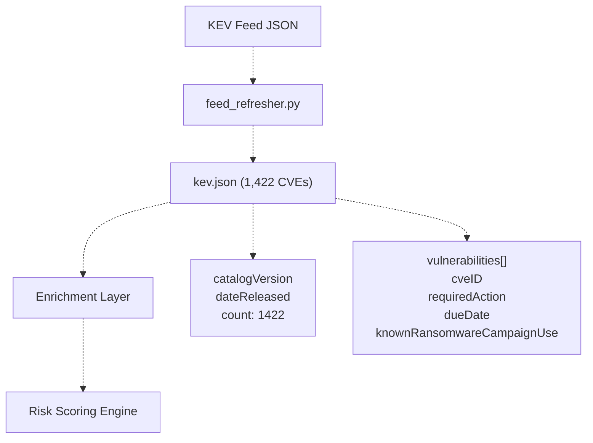

**KEV Fields:**

* `cveID`: CVE identifier
* `vendorProject`: Affected vendor/project
* `vulnerabilityName`: Human-readable name
* `dateAdded`: When added to KEV catalog
* `requiredAction`: Remediation guidance
* `dueDate`: Compliance deadline
* `knownRansomwareCampaignUse`: Ransomware attribution
* `cwes`: CWE classifications

**KEV as Decision Override:**
FixOps policy engine automatically escalates KEV-listed vulnerabilities to `BLOCK` verdicts when combined with critical exposure factors (internet-facing, authentication services).

**Sources:** [data/feeds/kev.json L1-L100](https://github.com/DevOpsMadDog/Fixops/blob/ce6eb1e9/data/feeds/kev.json#L1-L100)

 [core/enhanced_decision.py L230-L250](https://github.com/DevOpsMadDog/Fixops/blob/ce6eb1e9/core/enhanced_decision.py#L230-L250)

---

### EPSS (Exploit Prediction Scoring System)

**EPSS** is a probability score (0.0-1.0) that predicts the likelihood a CVE will be exploited in the next 30 days, developed by FIRST.org.

**EPSS Data Structure:**

| Field | Type | Description | Example |
| --- | --- | --- | --- |
| `cve` | string | CVE identifier | `"CVE-2025-9999"` |
| `epss` | string | Exploitation probability | `"0.000400000"` |
| `percentile` | string | Percentile rank | `"0.116420000"` |
| `date` | string | Score date | `"2025-10-01"` |

**EPSS Integration in FixOps:**

* Total CVEs tracked: **296,333**
* Updated daily via FIRST.org API
* Used in Bayesian prior calculations for risk scoring
* Combined with CVSS and KEV for multi-signal risk assessment

**EPSS Score Ranges:**

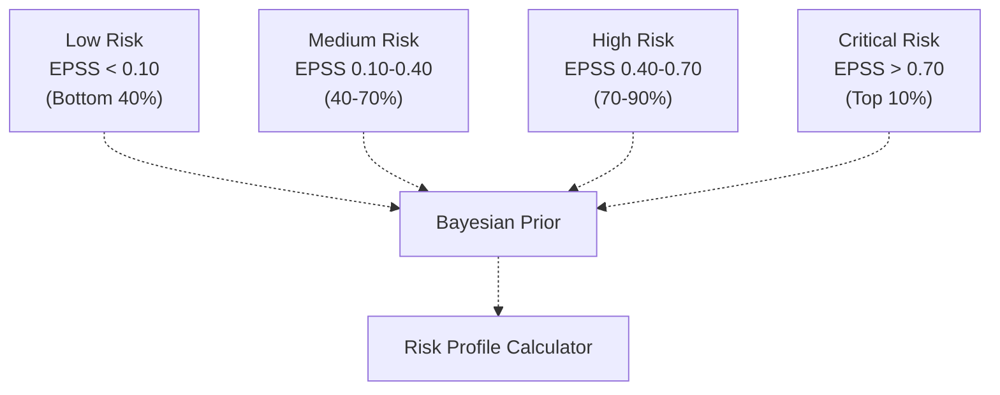

**Sources:** [data/feeds/epss.json L1-L100](https://github.com/DevOpsMadDog/Fixops/blob/ce6eb1e9/data/feeds/epss.json#L1-L100)

 [core/enhanced_decision.py L400-L450](https://github.com/DevOpsMadDog/Fixops/blob/ce6eb1e9/core/enhanced_decision.py#L400-L450)

---

### SARIF (Static Analysis Results Interchange Format)

**SARIF** is a JSON-based format for representing static analysis tool output. FixOps normalizes SARIF 2.1.0+ from any scanner.

**SARIF Normalization Pipeline:**

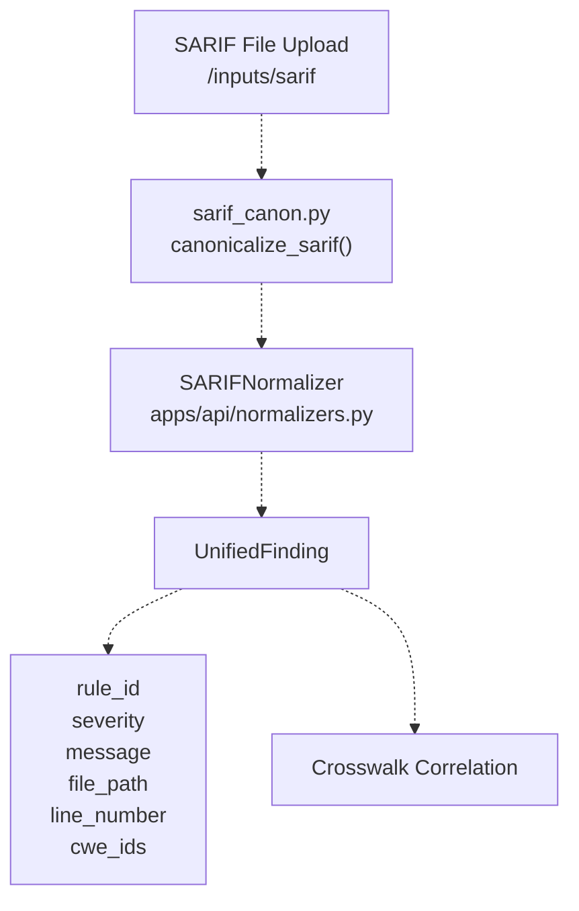

**Key SARIF Components:**

* `tool.driver.name`: Scanner identifier (e.g., "Semgrep", "CodeQL")
* `results[].ruleId`: Finding rule identifier
* `results[].level`: Severity (`"error"`, `"warning"`, `"note"`)
* `results[].locations[]`: File paths and line numbers
* `results[].properties.cwe`: CWE classifications

**Supported SARIF Producers:**

* Semgrep
* CodeQL
* Snyk Code
* GitLab SAST
* Trivy
* Checkmarx
* Veracode

**Sources:** [apps/api/normalizers.py L1-L100](https://github.com/DevOpsMadDog/Fixops/blob/ce6eb1e9/apps/api/normalizers.py#L1-L100)

 [core/sarif_canon.py L1-L264](https://github.com/DevOpsMadDog/Fixops/blob/ce6eb1e9/core/sarif_canon.py#L1-L264)

 [apps/api/app.py L892-L932](https://github.com/DevOpsMadDog/Fixops/blob/ce6eb1e9/apps/api/app.py#L892-L932)

---

### SBOM (Software Bill of Materials)

An **SBOM** is a complete inventory of software components and dependencies. FixOps supports **CycloneDX** and **SPDX** formats.

**SBOM Formats Supported:**

| Format | Spec Version | Parser | Use Case |
| --- | --- | --- | --- |
| CycloneDX | 1.4, 1.5 | `lib4sbom`, `cyclonedx-python-lib` | General-purpose SBOM |
| SPDX | 2.2, 2.3 | `lib4sbom`, `spdx-tools` | License compliance |
| Syft JSON | N/A | Custom parser | Container scanning |

**SBOM Parsing Flow:**

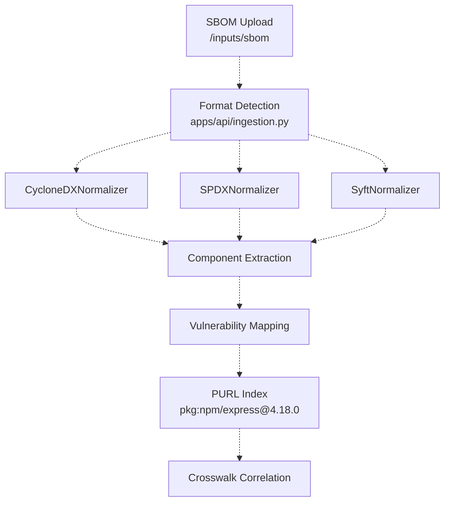

**Component Structure:**

* `name`: Component name
* `version`: Component version
* `purl`: Package URL (e.g., `pkg:npm/express@4.18.0`)
* `licenses`: License information
* `vulnerabilities[]`: Embedded CVE records

**Sources:** [apps/api/ingestion.py L1-L100](https://github.com/DevOpsMadDog/Fixops/blob/ce6eb1e9/apps/api/ingestion.py#L1-L100)

 [apps/api/normalizers.py L200-L400](https://github.com/DevOpsMadDog/Fixops/blob/ce6eb1e9/apps/api/normalizers.py#L200-L400)

 [lib4sbom/ L1-L699](https://github.com/DevOpsMadDog/Fixops/blob/ce6eb1e9/lib4sbom/#L1-L699)

---

### VEX (Vulnerability Exploitability eXchange)

**VEX** documents provide authoritative statements about vulnerability status (affected, not affected, under investigation). FixOps uses VEX to reduce false positives.

**VEX Status Values:**

| Status | Meaning | FixOps Action |
| --- | --- | --- |
| `not_affected` | Component not vulnerable | Exclude from risk scoring |
| `affected` | Component is vulnerable | Include in scoring |
| `fixed` | Vulnerability patched | Mark as remediated |
| `under_investigation` | Status unknown | Treat as affected |

**VEX Integration:**

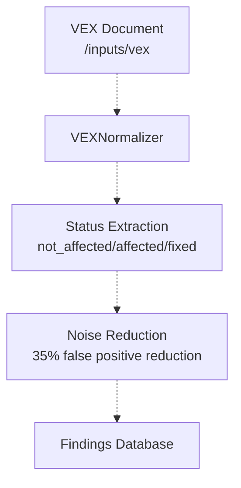

**Sources:** [apps/api/normalizers.py L500-L700](https://github.com/DevOpsMadDog/Fixops/blob/ce6eb1e9/apps/api/normalizers.py#L500-L700)

 [apps/api/app.py L976-L1016](https://github.com/DevOpsMadDog/Fixops/blob/ce6eb1e9/apps/api/app.py#L976-L1016)

---

### SSVC (Stakeholder-Specific Vulnerability Categorization)

**SSVC** is a decision framework for prioritizing vulnerabilities based on stakeholder context. FixOps generates SSVC labels as part of decision output.

**SSVC Decision Points:**

| Decision Point | Values | Description |
| --- | --- | --- |
| Exploitation | `none`, `poc`, `active` | Current exploitation status |
| Exposure | `small`, `controlled`, `open` | System exposure level |
| Automatable | `no`, `yes` | Can exploit be automated? |
| Technical Impact | `partial`, `total` | Impact on system |

**SSVC Label Generation:**

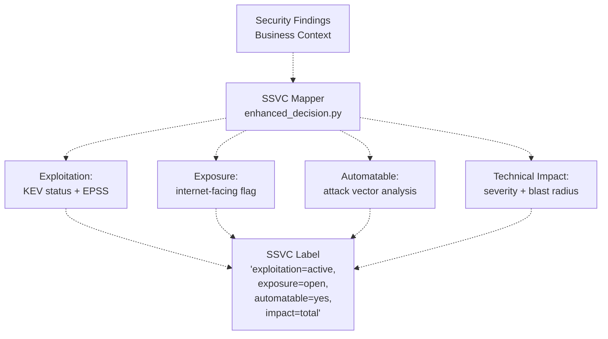

**Sources:** [core/enhanced_decision.py L800-L900](https://github.com/DevOpsMadDog/Fixops/blob/ce6eb1e9/core/enhanced_decision.py#L800-L900)

---

## FixOps-Specific Concepts

### Crosswalk

A **crosswalk** is FixOps's correlation structure that links design context, SBOM components, SARIF findings, and CVE records into unified vulnerability records.

**Crosswalk Structure:**

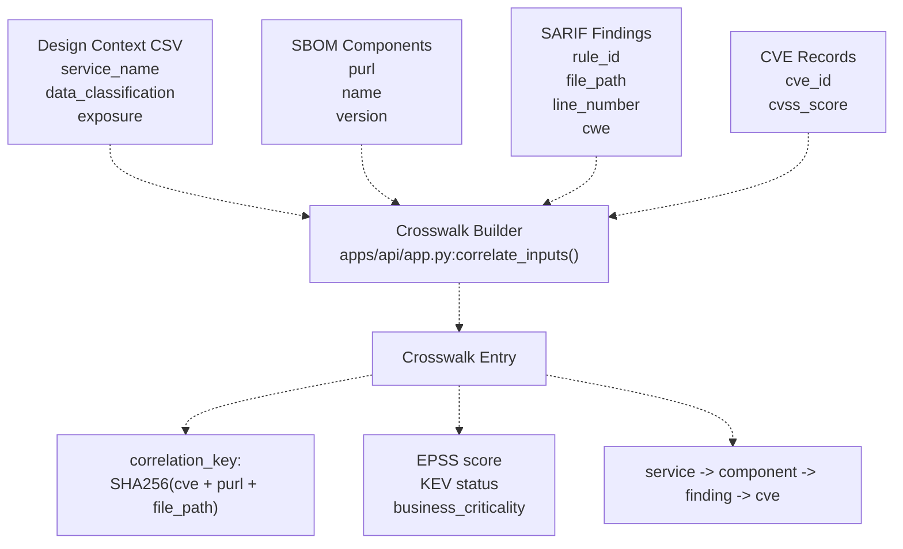

**Crosswalk Fields:**

| Field | Type | Description |
| --- | --- | --- |
| `correlation_key` | string | SHA256 hash for deduplication |
| `service_name` | string | Affected service |
| `component_purl` | string | Component package URL |
| `cve_id` | string | CVE identifier |
| `file_path` | string | Source file location |
| `line_number` | int | Line number of finding |
| `epss_score` | float | EPSS probability |
| `kev_listed` | boolean | KEV catalog status |
| `business_criticality` | string | `low`, `medium`, `high`, `critical` |

**Sources:** [apps/api/app.py L600-L800](https://github.com/DevOpsMadDog/Fixops/blob/ce6eb1e9/apps/api/app.py#L600-L800)

 [core/enhanced_decision.py L500-L600](https://github.com/DevOpsMadDog/Fixops/blob/ce6eb1e9/core/enhanced_decision.py#L500-L600)

---

### Deduplication Clusters

**Deduplication** in FixOps groups identical or highly similar findings into clusters to reduce noise. The system uses **7 correlation strategies** with configurable match thresholds.

**Deduplication Strategies:**

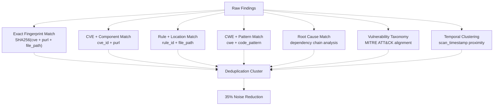

**Cluster Fields:**

| Field | Type | Description |
| --- | --- | --- |
| `cluster_id` | string | Unique cluster identifier |
| `master_finding_id` | string | Representative finding |
| `member_finding_ids` | list[string] | All findings in cluster |
| `occurrence_count` | int | Number of occurrences |
| `first_seen` | timestamp | First detection |
| `last_seen` | timestamp | Most recent detection |
| `correlation_strategy` | string | Strategy used for clustering |

**Sources:** [apps/api/deduplication_router.py L1-L100](https://github.com/DevOpsMadDog/Fixops/blob/ce6eb1e9/apps/api/deduplication_router.py#L1-L100)

 [docs/ENTERPRISE_FEATURES.md L1-L100](https://github.com/DevOpsMadDog/Fixops/blob/ce6eb1e9/docs/ENTERPRISE_FEATURES.md#L1-L100)

---

### Evidence Bundles

An **evidence bundle** is a cryptographically signed artifact containing decision rationale, risk analysis, and compliance evidence. Bundles use **RSA-SHA256** signatures for integrity verification.

**Evidence Bundle Structure:**

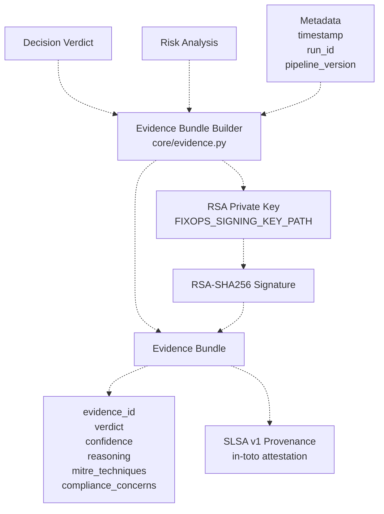

**Bundle Components:**

| Component | Description | Format |
| --- | --- | --- |
| `evidence_id` | Unique identifier | `EVD-YYYY-NNNN` |
| `verdict` | Decision outcome | `allow`, `block`, `review` |
| `confidence_score` | Confidence (0.0-1.0) | float |
| `reasoning` | Human-readable explanation | markdown |
| `mitre_techniques` | MITRE ATT&CK mappings | list[string] |
| `signature` | RSA-SHA256 signature | base64 |
| `timestamp` | Bundle creation time | ISO 8601 |

**Signature Verification:**

```css
# Verify evidence bundle integrity
POST /api/v1/evidence/verify
{
  "evidence_id": "EVD-2024-0001",
  "signature": "base64-encoded-signature"
}
```

**Sources:** [README.md L145-L152](https://github.com/DevOpsMadDog/Fixops/blob/ce6eb1e9/README.md#L145-L152)

 [core/enhanced_decision.py L1000-L1100](https://github.com/DevOpsMadDog/Fixops/blob/ce6eb1e9/core/enhanced_decision.py#L1000-L1100)

---

### Multi-LLM Consensus

FixOps uses **4 LLM providers** with weighted voting to reach consensus on security decisions. This approach reduces hallucination risk and improves decision quality.

**LLM Provider Architecture:**

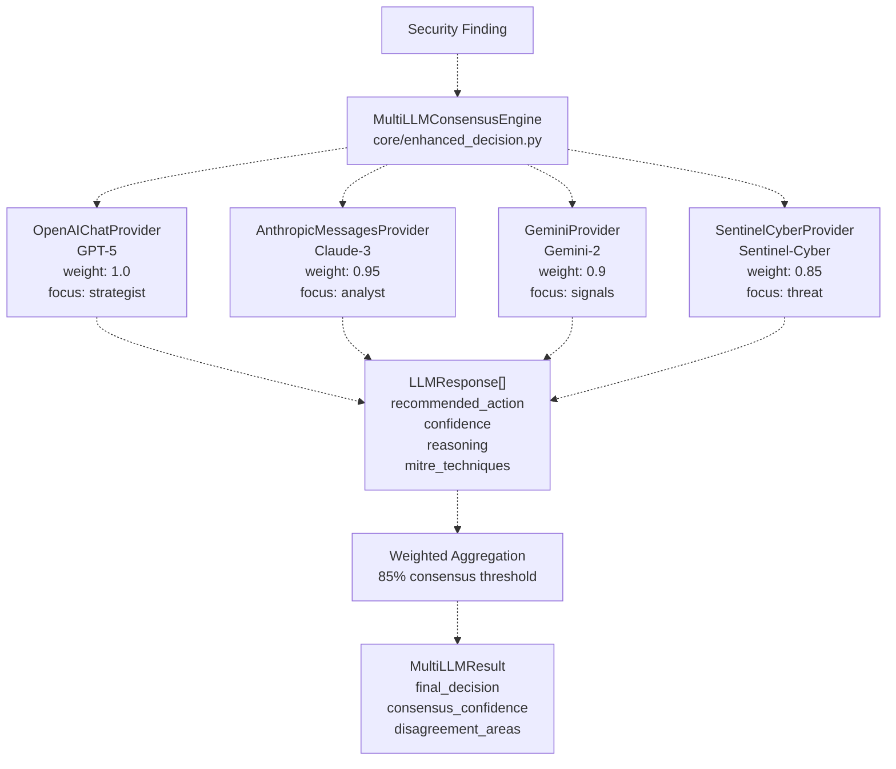

**Provider Specifications:**

| Provider | Weight | Style | Focus Areas | Model |
| --- | --- | --- | --- | --- |
| GPT-5 | 1.0 | Strategist | MITRE, context analysis | `gpt-4o-mini` |
| Claude-3 | 0.95 | Analyst | Compliance, guardrails | `claude-3-opus` |
| Gemini-2 | 0.9 | Signals | Exploit signals, CNAPP | `gemini-pro` |
| Sentinel-Cyber | 0.85 | Threat | Marketplace, agents | custom |

**Consensus Calculation:**

```yaml
# Weighted voting algorithm
consensus_confidence = sum(
    provider.weight * provider.confidence
    for provider in responses
) / sum(provider.weight for provider in responses)

# Threshold check
if consensus_confidence >= 0.85:
    expert_validation_required = False
else:
    expert_validation_required = True
```

**Fallback Mode:**
If all LLM providers are unavailable, the system uses `DeterministicLLMProvider` which applies heuristic rules based on CVSS scores, KEV status, and exposure factors.

**Sources:** [core/enhanced_decision.py L127-L210](https://github.com/DevOpsMadDog/Fixops/blob/ce6eb1e9/core/enhanced_decision.py#L127-L210)

 [core/llm_providers.py L1-L100](https://github.com/DevOpsMadDog/Fixops/blob/ce6eb1e9/core/llm_providers.py#L1-L100)

---

### Decision Verdicts

FixOps produces **tri-state verdicts** rather than numeric risk scores. This simplifies decision-making and integrates with CI/CD pipelines.

**Verdict Types:**

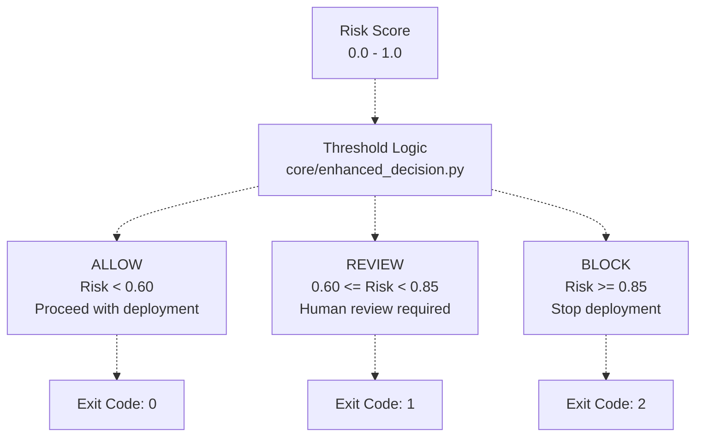

**Verdict Decision Matrix:**

| Risk Score | KEV Listed | Internet-Facing | Auth Service | Verdict |
| --- | --- | --- | --- | --- |
| Any | Yes | Yes | Yes | **BLOCK** (policy override) |
| >= 0.85 | - | - | - | **BLOCK** |
| 0.60-0.84 | - | - | - | **REVIEW** |
| < 0.60 | No | - | - | **ALLOW** |

**Policy Overrides:**
The `DecisionPolicyEngine` enforces critical overrides that bypass risk scoring:

```markdown
# Critical policy rules
if cve_is_sqli and (internet_facing or is_auth_service):
    return "block"  # Override any risk score

if kev_listed and critical_service:
    return "block"  # Override any risk score
```

**Sources:** [core/enhanced_decision.py L230-L280](https://github.com/DevOpsMadDog/Fixops/blob/ce6eb1e9/core/enhanced_decision.py#L230-L280)

 [core/decision_policy.py L1-L100](https://github.com/DevOpsMadDog/Fixops/blob/ce6eb1e9/core/decision_policy.py#L1-L100)

---

### Overlay Configuration

The **overlay configuration** (`fixops.overlay.yml`) controls all platform behavior without code changes. It supports profiles (demo, enterprise), feature toggles, and environment-specific settings.

**Overlay Configuration Structure:**

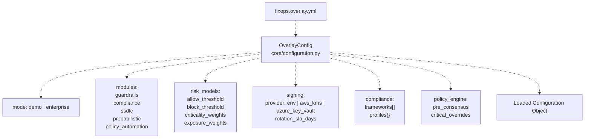

**Key Configuration Sections:**

| Section | Purpose | Example Keys |
| --- | --- | --- |
| `mode` | Operating mode | `demo`, `enterprise` |
| `modules` | Feature flags | `guardrails`, `compliance`, `ssdlc` |
| `risk_models` | Scoring thresholds | `allow_threshold`, `block_threshold` |
| `signing` | Evidence cryptography | `provider`, `key_id`, `rotation_sla_days` |
| `compliance` | Framework definitions | `frameworks`, `profiles` |
| `policy_engine` | Decision policies | `pre_consensus`, `critical_overrides` |
| `enhanced_decision` | LLM configuration | `providers`, `consensus_threshold` |

**Profile Inheritance:**

```yaml
# Base configuration
mode: demo
modules:
  guardrails: true
  compliance: true

# Enterprise profile overrides
profiles:
  enterprise:
    mode: enterprise
    modules:
      reachability: true
      marketplace: true
      enhanced_mpte: true
```

**Sources:** [core/configuration.py L1-L200](https://github.com/DevOpsMadDog/Fixops/blob/ce6eb1e9/core/configuration.py#L1-L200)

 [README.md L249-L269](https://github.com/DevOpsMadDog/Fixops/blob/ce6eb1e9/README.md#L249-L269)

---

### Pipeline Orchestration

The **PipelineOrchestrator** coordinates the complete vulnerability management workflow from ingestion to evidence generation.

**Pipeline Stages:**

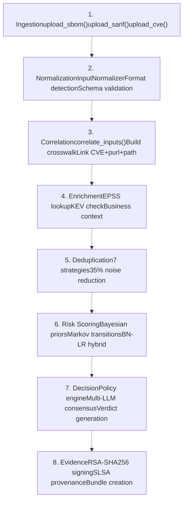

**Orchestrator Methods:**

| Method | File Path | Purpose |
| --- | --- | --- |
| `PipelineOrchestrator.run()` | [core/stage_runner.py L100-L200](https://github.com/DevOpsMadDog/Fixops/blob/ce6eb1e9/core/stage_runner.py#L100-L200) | Execute full pipeline |
| `correlate_inputs()` | [apps/api/app.py L600-L800](https://github.com/DevOpsMadDog/Fixops/blob/ce6eb1e9/apps/api/app.py#L600-L800) | Build crosswalk |
| `enrich_with_feeds()` | [apps/api/app.py L900-L1000](https://github.com/DevOpsMadDog/Fixops/blob/ce6eb1e9/apps/api/app.py#L900-L1000) | Add EPSS/KEV data |
| `deduplicate_findings()` | [apps/api/deduplication_router.py L50-L150](https://github.com/DevOpsMadDog/Fixops/blob/ce6eb1e9/apps/api/deduplication_router.py#L50-L150) | Cluster findings |
| `score_risk()` | [core/enhanced_decision.py L400-L500](https://github.com/DevOpsMadDog/Fixops/blob/ce6eb1e9/core/enhanced_decision.py#L400-L500) | Calculate risk |
| `make_decision()` | [core/enhanced_decision.py L230-L330](https://github.com/DevOpsMadDog/Fixops/blob/ce6eb1e9/core/enhanced_decision.py#L230-L330) | Generate verdict |
| `create_evidence_bundle()` | [core/enhanced_decision.py L1000-L1100](https://github.com/DevOpsMadDog/Fixops/blob/ce6eb1e9/core/enhanced_decision.py#L1000-L1100) | Sign evidence |

**Sources:** [core/stage_runner.py L1-L100](https://github.com/DevOpsMadDog/Fixops/blob/ce6eb1e9/core/stage_runner.py#L1-L100)

 [apps/api/app.py L1-L100](https://github.com/DevOpsMadDog/Fixops/blob/ce6eb1e9/apps/api/app.py#L1-L100)

---

## Vulnerability Intelligence Concepts

### 166 Data Sources

FixOps integrates **166 vulnerability and exploit intelligence sources** across 8 categories. This provides the most comprehensive threat intelligence surface in the industry.

**Intelligence Categories:**

| Category | Sources | Examples |
| --- | --- | --- |
| Global Authoritative | 7 | NVD, CVE Program, MITRE, CISA KEV |
| National CERTs | 15 | NCSC UK, BSI Germany, JPCERT Japan |
| Exploit Intelligence | 25 | Exploit-DB, Metasploit, Nuclei Templates |
| Threat Actor Intel | 18 | MITRE ATT&CK, AlienVault OTX |
| Supply Chain | 35 | OSV, GitHub Advisory, Snyk, NPM/PyPI |
| Cloud/Runtime | 22 | AWS/Azure/GCP bulletins, K8s CVEs |
| Zero-Day/Early Signal | 30 | MSRC, Cisco PSIRT, OSS-Security lists |
| Internal Enterprise | Unlimited | SAST/DAST/SCA, IaC, runtime detections |

**Feed Refresh Architecture:**

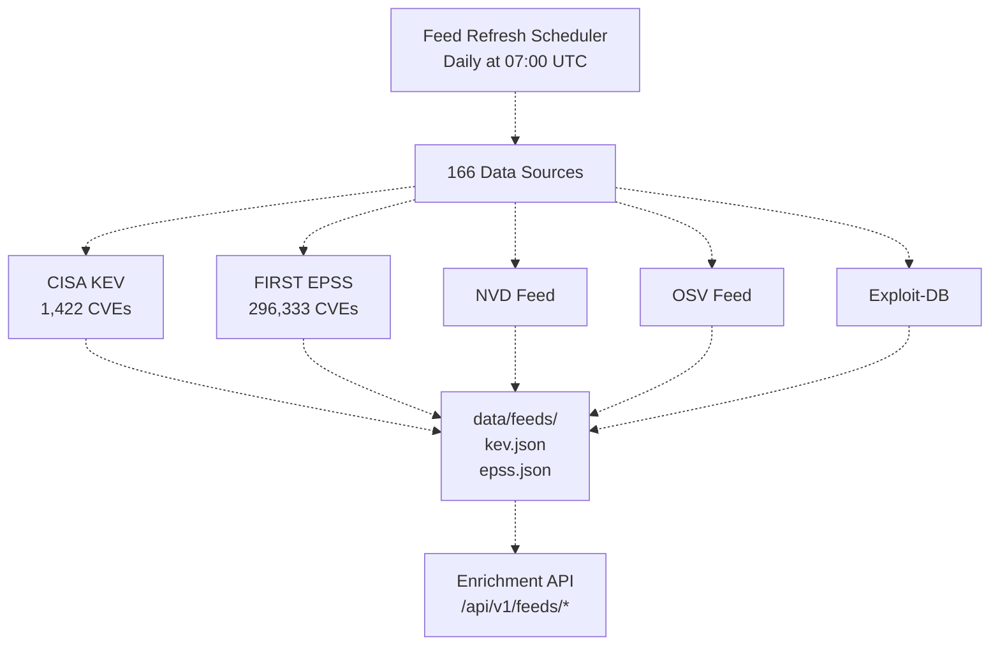

**Sources:** [README.md L154-L193](https://github.com/DevOpsMadDog/Fixops/blob/ce6eb1e9/README.md#L154-L193)

 [data/feeds/kev.json L1-L10](https://github.com/DevOpsMadDog/Fixops/blob/ce6eb1e9/data/feeds/kev.json#L1-L10)

 [data/feeds/epss.json L1-L10](https://github.com/DevOpsMadDog/Fixops/blob/ce6eb1e9/data/feeds/epss.json#L1-L10)

---

## Summary Tables

### Core Concepts Reference

| Concept | Code Entity | File Path | API Endpoint |
| --- | --- | --- | --- |
| CVE | `cve_id` field | [data/feeds/epss.json L14](https://github.com/DevOpsMadDog/Fixops/blob/ce6eb1e9/data/feeds/epss.json#L14-L14) | `/api/v1/feeds/epss/{cve}` |
| KEV | `kev.json` | [data/feeds/kev.json L1](https://github.com/DevOpsMadDog/Fixops/blob/ce6eb1e9/data/feeds/kev.json#L1-L1) | `/api/v1/feeds/kev/check/{cve}` |
| EPSS | `epss` field | [data/feeds/epss.json L15](https://github.com/DevOpsMadDog/Fixops/blob/ce6eb1e9/data/feeds/epss.json#L15-L15) | `/api/v1/feeds/epss/{cve}` |
| SARIF | `SARIFNormalizer` | [apps/api/normalizers.py L200](https://github.com/DevOpsMadDog/Fixops/blob/ce6eb1e9/apps/api/normalizers.py#L200-L200) | `/inputs/sarif` |
| SBOM | `CycloneDXNormalizer` | [apps/api/normalizers.py L400](https://github.com/DevOpsMadDog/Fixops/blob/ce6eb1e9/apps/api/normalizers.py#L400-L400) | `/inputs/sbom` |
| VEX | `VEXNormalizer` | [apps/api/normalizers.py L600](https://github.com/DevOpsMadDog/Fixops/blob/ce6eb1e9/apps/api/normalizers.py#L600-L600) | `/inputs/vex` |
| Crosswalk | `correlate_inputs()` | [apps/api/app.py L700](https://github.com/DevOpsMadDog/Fixops/blob/ce6eb1e9/apps/api/app.py#L700-L700) | `/pipeline/run` |
| Deduplication | `DeduplicationService` | [apps/api/deduplication_router.py L50](https://github.com/DevOpsMadDog/Fixops/blob/ce6eb1e9/apps/api/deduplication_router.py#L50-L50) | `/api/v1/deduplication/*` |
| Evidence Bundle | `create_evidence_bundle()` | [core/enhanced_decision.py L1000](https://github.com/DevOpsMadDog/Fixops/blob/ce6eb1e9/core/enhanced_decision.py#L1000-L1000) | `/api/v1/evidence/bundles` |
| Multi-LLM | `MultiLLMConsensusEngine` | [core/enhanced_decision.py L127](https://github.com/DevOpsMadDog/Fixops/blob/ce6eb1e9/core/enhanced_decision.py#L127-L127) | `/api/v1/enhanced/consensus` |
| Overlay Config | `OverlayConfig` | [core/configuration.py L1](https://github.com/DevOpsMadDog/Fixops/blob/ce6eb1e9/core/configuration.py#L1-L1) | CLI: `show-overlay` |
| Pipeline | `PipelineOrchestrator` | [core/stage_runner.py L100](https://github.com/DevOpsMadDog/Fixops/blob/ce6eb1e9/core/stage_runner.py#L100-L100) | `/pipeline/run` |

### Decision Thresholds

| Threshold | Default Value | Configurable Via | Effect |
| --- | --- | --- | --- |
| ALLOW threshold | 0.60 | `overlay.risk_models.allow_threshold` | Risk < 0.60 → ALLOW |
| BLOCK threshold | 0.85 | `overlay.risk_models.block_threshold` | Risk >= 0.85 → BLOCK |
| LLM consensus | 85% | `overlay.enhanced_decision.consensus_threshold` | Agreement required |
| EPSS high risk | 0.70 | Hardcoded | Top 10% percentile |
| Critical CVSS | 9.0 | `overlay.guardrails.critical_threshold` | CVSS >= 9.0 |

**Sources:** [core/enhanced_decision.py L230-L250](https://github.com/DevOpsMadDog/Fixops/blob/ce6eb1e9/core/enhanced_decision.py#L230-L250)

 [core/configuration.py L90-L95](https://github.com/DevOpsMadDog/Fixops/blob/ce6eb1e9/core/configuration.py#L90-L95)

---

This page has defined the fundamental concepts used throughout FixOps. For implementation details and system architecture, see [System Architecture](/DevOpsMadDog/Fixops/1.2-system-architecture).