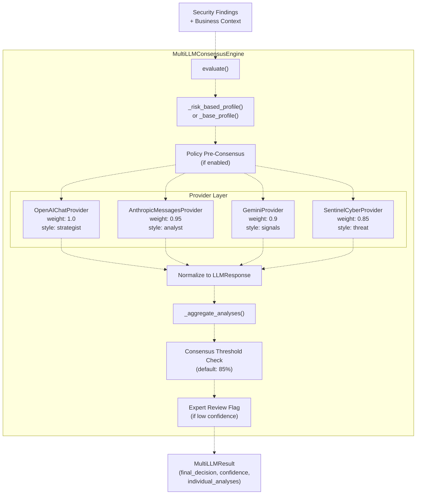
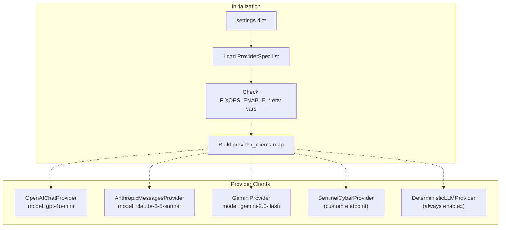
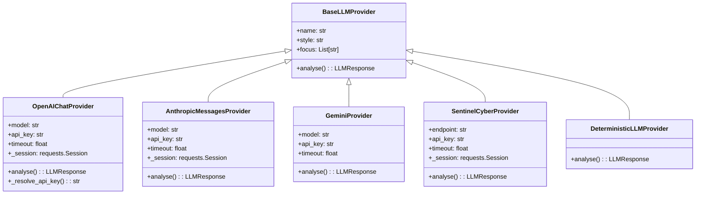
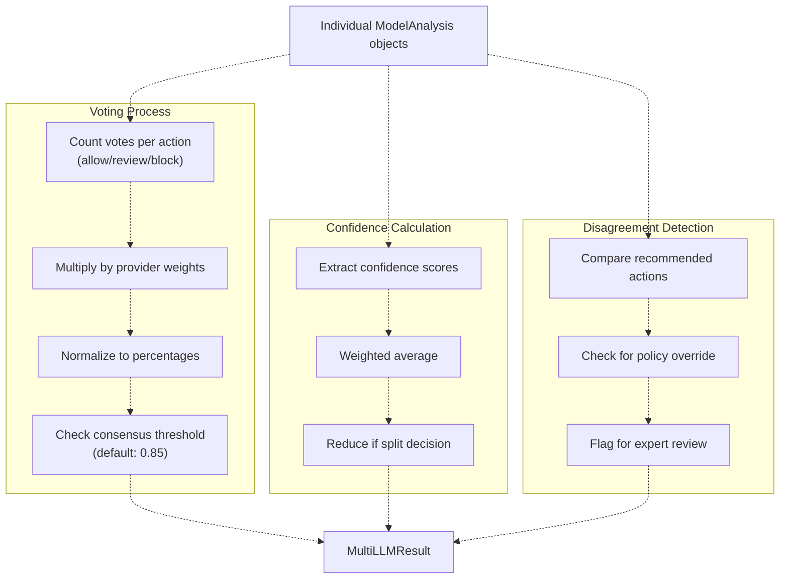
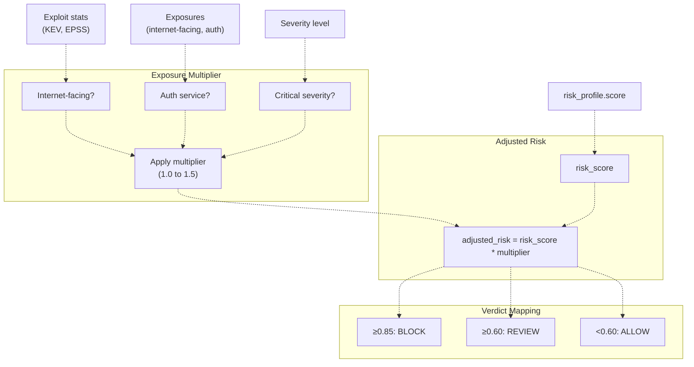
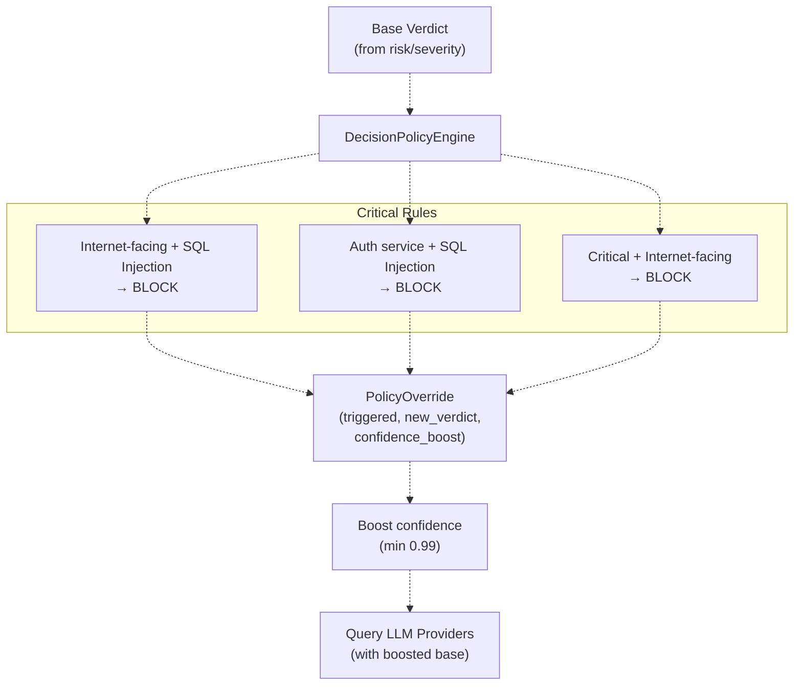
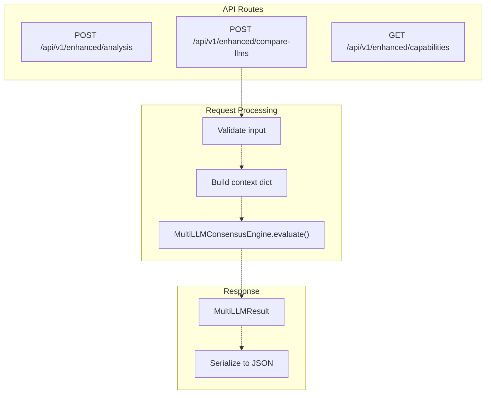
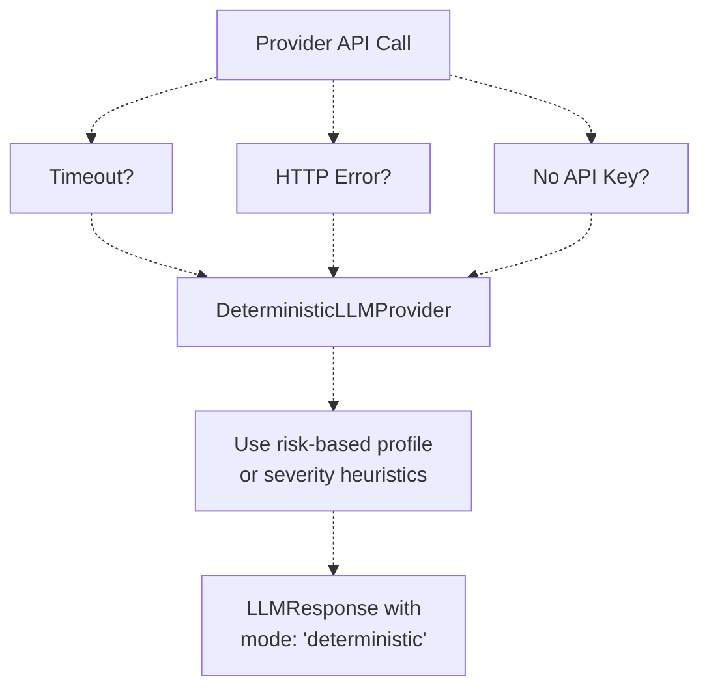
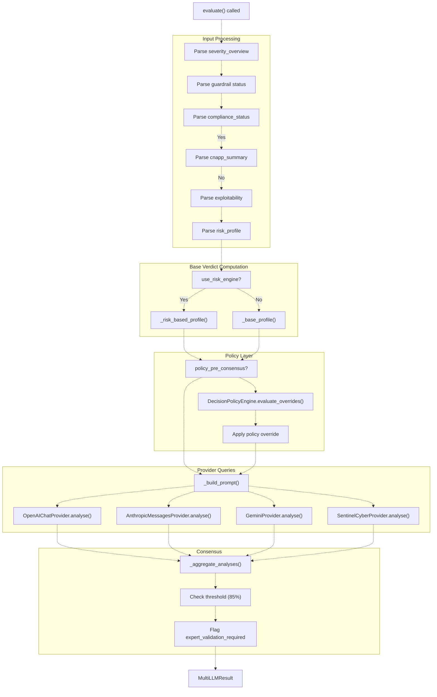

# Multi-LLM Consensus Engine

> **Relevant source files**
> * [README.md](https://github.com/DevOpsMadDog/Fixops/blob/ce6eb1e9/README.md)
> * [apps/api/micro_pentest_router.py](https://github.com/DevOpsMadDog/Fixops/blob/ce6eb1e9/apps/api/micro_pentest_router.py)
> * [backend_test.py](https://github.com/DevOpsMadDog/Fixops/blob/ce6eb1e9/backend_test.py)
> * [core/analytics.py](https://github.com/DevOpsMadDog/Fixops/blob/ce6eb1e9/core/analytics.py)
> * [core/compliance.py](https://github.com/DevOpsMadDog/Fixops/blob/ce6eb1e9/core/compliance.py)
> * [core/configuration.py](https://github.com/DevOpsMadDog/Fixops/blob/ce6eb1e9/core/configuration.py)
> * [core/decision_policy.py](https://github.com/DevOpsMadDog/Fixops/blob/ce6eb1e9/core/decision_policy.py)
> * [core/enhanced_decision.py](https://github.com/DevOpsMadDog/Fixops/blob/ce6eb1e9/core/enhanced_decision.py)
> * [core/llm_providers.py](https://github.com/DevOpsMadDog/Fixops/blob/ce6eb1e9/core/llm_providers.py)
> * [core/playbook_runner.py](https://github.com/DevOpsMadDog/Fixops/blob/ce6eb1e9/core/playbook_runner.py)
> * [demo_ssdlc_stages/03_code_development.json](https://github.com/DevOpsMadDog/Fixops/blob/ce6eb1e9/demo_ssdlc_stages/03_code_development.json)
> * [demo_ssdlc_stages/04_build_ci.yaml](https://github.com/DevOpsMadDog/Fixops/blob/ce6eb1e9/demo_ssdlc_stages/04_build_ci.yaml)
> * [demo_ssdlc_stages/06_deploy_production.yaml](https://github.com/DevOpsMadDog/Fixops/blob/ce6eb1e9/demo_ssdlc_stages/06_deploy_production.yaml)
> * [docs/API_CLI_REFERENCE.md](https://github.com/DevOpsMadDog/Fixops/blob/ce6eb1e9/docs/API_CLI_REFERENCE.md)
> * [docs/DOCKER_SHOWCASE_GUIDE.md](https://github.com/DevOpsMadDog/Fixops/blob/ce6eb1e9/docs/DOCKER_SHOWCASE_GUIDE.md)
> * [docs/ENTERPRISE_FEATURES.md](https://github.com/DevOpsMadDog/Fixops/blob/ce6eb1e9/docs/ENTERPRISE_FEATURES.md)
> * [docs/FEATURE_CODE_MAPPING.md](https://github.com/DevOpsMadDog/Fixops/blob/ce6eb1e9/docs/FEATURE_CODE_MAPPING.md)
> * [docs/PLAYBOOK_LANGUAGE_REFERENCE.md](https://github.com/DevOpsMadDog/Fixops/blob/ce6eb1e9/docs/PLAYBOOK_LANGUAGE_REFERENCE.md)
> * [fixops-enterprise/src/api/v1/micro_pentest.py](https://github.com/DevOpsMadDog/Fixops/blob/ce6eb1e9/fixops-enterprise/src/api/v1/micro_pentest.py)
> * [fixops-enterprise/src/services/micro_pentest_engine.py](https://github.com/DevOpsMadDog/Fixops/blob/ce6eb1e9/fixops-enterprise/src/services/micro_pentest_engine.py)
> * [tests/e2e/test_critical_decision_policy.py](https://github.com/DevOpsMadDog/Fixops/blob/ce6eb1e9/tests/e2e/test_critical_decision_policy.py)
> * [tests/test_comprehensive_e2e.py](https://github.com/DevOpsMadDog/Fixops/blob/ce6eb1e9/tests/test_comprehensive_e2e.py)
> * [tests/test_data_generator.py](https://github.com/DevOpsMadDog/Fixops/blob/ce6eb1e9/tests/test_data_generator.py)
> * [tests/test_enhanced_api.py](https://github.com/DevOpsMadDog/Fixops/blob/ce6eb1e9/tests/test_enhanced_api.py)
> * [tests/test_micro_pentest_engine.py](https://github.com/DevOpsMadDog/Fixops/blob/ce6eb1e9/tests/test_micro_pentest_engine.py)

## Purpose and Scope

The Multi-LLM Consensus Engine orchestrates decision-making across multiple AI providers to produce high-confidence security verdicts. This system queries GPT, Claude, Gemini, and Sentinel providers in parallel, aggregates their responses using weighted voting, and applies policy-based overrides to produce final Allow/Review/Block verdicts.

This page covers the consensus engine architecture, provider adapters, voting mechanisms, and configuration. For the broader decision pipeline that uses this engine, see [Decision Engine](/DevOpsMadDog/Fixops/4-decision-engine). For policy override rules, see [Decision Policy Engine](/DevOpsMadDog/Fixops/4.2-decision-policy-engine). For risk-based profiling that feeds into consensus, see [Risk-Based Profiling](/DevOpsMadDog/Fixops/4.3-risk-based-profiling).

---

## Architecture Overview

The consensus engine implements a three-layer architecture: provider invocation, response normalization, and weighted aggregation.



**Sources:** [core/enhanced_decision.py L127-L318](https://github.com/DevOpsMadDog/Fixops/blob/ce6eb1e9/core/enhanced_decision.py#L127-L318)

---

## Core Components

### MultiLLMConsensusEngine Class

The `MultiLLMConsensusEngine` class in [core/enhanced_decision.py L127-L318](https://github.com/DevOpsMadDog/Fixops/blob/ce6eb1e9/core/enhanced_decision.py#L127-L318)

 orchestrates the entire consensus process. Key responsibilities:

* **Provider management**: Initializes and manages 4 LLM providers with configurable weights
* **Risk assessment**: Computes base verdicts using risk scores or heuristics
* **Policy integration**: Applies pre-consensus policy overrides via `DecisionPolicyEngine`
* **Parallel invocation**: Queries all enabled providers concurrently
* **Weighted aggregation**: Combines responses using provider-specific weights
* **Consensus validation**: Ensures responses meet the configured threshold (default 85%)



**Key Methods:**

| Method | Purpose | Returns |
| --- | --- | --- |
| `evaluate()` | Main entry point for consensus decision | `MultiLLMResult` |
| `_risk_based_profile()` | Compute base verdict using risk scoring | tuple of (action, confidence, mitre, adjusted_risk, multiplier) |
| `_base_profile()` | Compute base verdict using severity heuristics | tuple of (action, confidence, mitre) |
| `_aggregate_analyses()` | Combine provider responses with weights | `MultiLLMResult` |
| `_build_prompt()` | Construct LLM prompt from context | str |

**Sources:** [core/enhanced_decision.py L127-L318](https://github.com/DevOpsMadDog/Fixops/blob/ce6eb1e9/core/enhanced_decision.py#L127-L318)

 [core/enhanced_decision.py L319-L582](https://github.com/DevOpsMadDog/Fixops/blob/ce6eb1e9/core/enhanced_decision.py#L319-L582)

---

## Provider System

### Provider Specifications

Each provider is defined by a `ProviderSpec` dataclass [core/enhanced_decision.py L62-L67](https://github.com/DevOpsMadDog/Fixops/blob/ce6eb1e9/core/enhanced_decision.py#L62-L67)

:

```python
@dataclass
class ProviderSpec:
    name: str
    weight: float = 1.0
    style: str = "consensus"
    focus: List[str] = field(default_factory=list)
```

**Default Provider Configuration:**

| Provider | Weight | Style | Focus Areas | Model |
| --- | --- | --- | --- | --- |
| GPT-5 | 1.0 | strategist | mitre, context | gpt-4o-mini |
| Claude-3 | 0.95 | analyst | compliance, guardrails | claude-3-5-sonnet |
| Gemini-2 | 0.9 | signals | exploit, cnapp | gemini-2.0-flash |
| Sentinel | 0.85 | threat | marketplace, agents | custom endpoint |

**Sources:** [core/enhanced_decision.py L130-L146](https://github.com/DevOpsMadDog/Fixops/blob/ce6eb1e9/core/enhanced_decision.py#L130-L146)

### Provider Adapters

All providers implement the `BaseLLMProvider` interface [core/llm_providers.py L27-L67](https://github.com/DevOpsMadDog/Fixops/blob/ce6eb1e9/core/llm_providers.py#L27-L67)

:



**Sources:** [core/llm_providers.py L27-L67](https://github.com/DevOpsMadDog/Fixops/blob/ce6eb1e9/core/llm_providers.py#L27-L67)

 [core/llm_providers.py L73-L131](https://github.com/DevOpsMadDog/Fixops/blob/ce6eb1e9/core/llm_providers.py#L73-L131)

 [core/llm_providers.py L134-L208](https://github.com/DevOpsMadDog/Fixops/blob/ce6eb1e9/core/llm_providers.py#L134-L208)

 [core/llm_providers.py L211-L285](https://github.com/DevOpsMadDog/Fixops/blob/ce6eb1e9/core/llm_providers.py#L211-L285)

 [core/llm_providers.py L288-L373](https://github.com/DevOpsMadDog/Fixops/blob/ce6eb1e9/core/llm_providers.py#L288-L373)

 [core/llm_providers.py L69-L71](https://github.com/DevOpsMadDog/Fixops/blob/ce6eb1e9/core/llm_providers.py#L69-L71)

### LLMResponse Schema

All providers normalize their outputs to the `LLMResponse` dataclass [core/llm_providers.py L14-L25](https://github.com/DevOpsMadDog/Fixops/blob/ce6eb1e9/core/llm_providers.py#L14-L25)

:

```python
@dataclass
class LLMResponse:
    recommended_action: str          # "allow", "review", "block"
    confidence: float                # 0.0 to 1.0
    reasoning: str                   # Natural language explanation
    mitre_techniques: Sequence[str]  # MITRE ATT&CK technique IDs
    compliance_concerns: Sequence[str]
    attack_vectors: Sequence[str]
    metadata: Dict[str, Any]         # Provider-specific data
```

**Sources:** [core/llm_providers.py L14-L25](https://github.com/DevOpsMadDog/Fixops/blob/ce6eb1e9/core/llm_providers.py#L14-L25)

---

## Consensus Mechanism

### Weighted Aggregation

The `_aggregate_analyses()` method [core/enhanced_decision.py L583-L753](https://github.com/DevOpsMadDog/Fixops/blob/ce6eb1e9/core/enhanced_decision.py#L583-L753)

 implements weighted voting:



**Algorithm:**

1. **Vote Collection**: Each provider's `recommended_action` is recorded with its weight
2. **Vote Aggregation**: Sum weights for each action (allow/review/block)
3. **Winner Selection**: Action with highest weighted sum becomes `final_decision`
4. **Consensus Check**: Winner must have ≥85% of total weight (configurable)
5. **Confidence Calculation**: Weighted average of individual confidence scores
6. **Disagreement Flagging**: If providers split significantly, flag for expert review

**Sources:** [core/enhanced_decision.py L583-L753](https://github.com/DevOpsMadDog/Fixops/blob/ce6eb1e9/core/enhanced_decision.py#L583-L753)

### Expert Review Triggers

The system flags decisions for human review when:

* Consensus percentage < threshold (default 85%)
* Weighted confidence < 0.65
* Policy override occurred (documented in `disagreement_areas`)
* Split decision (e.g., 2 providers say "block", 2 say "allow")

**Sources:** [core/enhanced_decision.py L700-L753](https://github.com/DevOpsMadDog/Fixops/blob/ce6eb1e9/core/enhanced_decision.py#L700-L753)

---

## Risk Integration

### Risk-Based Profiling

When `use_risk_engine=True` (default), the engine computes base verdicts using risk scores [core/enhanced_decision.py L397-L476](https://github.com/DevOpsMadDog/Fixops/blob/ce6eb1e9/core/enhanced_decision.py#L397-L476)

:



**Exposure Multipliers:**

| Condition | Multiplier |
| --- | --- |
| Internet-facing + Critical | 1.5 |
| Internet-facing OR Auth service + High | 1.3 |
| Internal + Low KEV activity | 1.0 |

**Sources:** [core/enhanced_decision.py L397-L476](https://github.com/DevOpsMadDog/Fixops/blob/ce6eb1e9/core/enhanced_decision.py#L397-L476)

### Severity-Based Heuristics

When `use_risk_engine=False`, the engine falls back to severity heuristics [core/enhanced_decision.py L478-L582](https://github.com/DevOpsMadDog/Fixops/blob/ce6eb1e9/core/enhanced_decision.py#L478-L582)

:

| Severity | Total Findings | Action | Confidence |
| --- | --- | --- | --- |
| Critical | Any | BLOCK | 0.92 |
| High | ≥5 | BLOCK | 0.85 |
| High | 1-4 | REVIEW | 0.78 |
| Medium | ≥10 | REVIEW | 0.72 |
| Medium | <10 | ALLOW | 0.65 |
| Low | Any | ALLOW | 0.88 |

**Sources:** [core/enhanced_decision.py L478-L582](https://github.com/DevOpsMadDog/Fixops/blob/ce6eb1e9/core/enhanced_decision.py#L478-L582)

---

## Policy Pre-Consensus

When `policy_pre_consensus=True` (default), critical policy rules override base verdicts before LLM queries [core/enhanced_decision.py L295-L315](https://github.com/DevOpsMadDog/Fixops/blob/ce6eb1e9/core/enhanced_decision.py#L295-L315)

:



**Sources:** [core/enhanced_decision.py L295-L315](https://github.com/DevOpsMadDog/Fixops/blob/ce6eb1e9/core/enhanced_decision.py#L295-L315)

 [core/decision_policy.py L1-L328](https://github.com/DevOpsMadDog/Fixops/blob/ce6eb1e9/core/decision_policy.py#L1-L328)

---

## Configuration

### Environment Variables

Provider enablement is controlled via environment variables [core/enhanced_decision.py L169-L209](https://github.com/DevOpsMadDog/Fixops/blob/ce6eb1e9/core/enhanced_decision.py#L169-L209)

:

| Variable | Default | Purpose |
| --- | --- | --- |
| `FIXOPS_ENABLE_OPENAI` | true | Enable GPT provider |
| `FIXOPS_ENABLE_ANTHROPIC` | true | Enable Claude provider |
| `FIXOPS_ENABLE_GEMINI` | true | Enable Gemini provider |
| `FIXOPS_ENABLE_SENTINEL` | true | Enable Sentinel provider |
| `OPENAI_API_KEY` | - | OpenAI API key |
| `ANTHROPIC_API_KEY` | - | Anthropic API key |
| `GOOGLE_API_KEY` | - | Google API key |
| `FIXOPS_CONSENSUS_THRESHOLD` | 0.85 | Consensus percentage threshold |

### Overlay Configuration

The consensus engine accepts configuration via the `enhanced_decision` overlay section [core/configuration.py L1-L1355](https://github.com/DevOpsMadDog/Fixops/blob/ce6eb1e9/core/configuration.py#L1-L1355)

:

```yaml
enhanced_decision:
  providers:
    - name: "gpt-5"
      weight: 1.0
      style: "strategist"
      focus: ["mitre", "context"]
    - name: "claude-3"
      weight: 0.95
      style: "analyst"
      focus: ["compliance", "guardrails"]
  baseline_confidence: 0.78
  consensus_threshold: 0.85
  
decision:
  use_risk_engine: true
  policy_pre_consensus: true
  risk_block_threshold: 0.85
  risk_review_threshold: 0.60
```

**Sources:** [core/configuration.py L1-L1355](https://github.com/DevOpsMadDog/Fixops/blob/ce6eb1e9/core/configuration.py#L1-L1355)

 [core/enhanced_decision.py L148-L238](https://github.com/DevOpsMadDog/Fixops/blob/ce6eb1e9/core/enhanced_decision.py#L148-L238)

---

## API Integration

### Enhanced Decision Endpoints

The consensus engine is exposed via three API endpoints [apps/api/routes/enhanced.py L1-L110](https://github.com/DevOpsMadDog/Fixops/blob/ce6eb1e9/apps/api/routes/enhanced.py#L1-L110)

:



**Endpoint Details:**

| Endpoint | Method | Purpose | Response |
| --- | --- | --- | --- |
| `/api/v1/enhanced/compare-llms` | POST | Compare recommendations from all providers | `MultiLLMResult` with individual analyses |
| `/api/v1/enhanced/analysis` | POST | Get single consensus decision | `MultiLLMResult` |
| `/api/v1/enhanced/capabilities` | GET | List enabled providers and features | Provider metadata |

**Request Payload:**

```json
{
  "service_name": "payment-api",
  "security_findings": [
    {
      "rule_id": "SQL_INJECTION_001",
      "severity": "high",
      "description": "SQL injection in login handler"
    }
  ],
  "business_context": {
    "environment": "production",
    "criticality": "high",
    "data_classification": "pci",
    "exposure": "internet-facing"
  }
}
```

**Sources:** [apps/api/routes/enhanced.py L40-L102](https://github.com/DevOpsMadDog/Fixops/blob/ce6eb1e9/apps/api/routes/enhanced.py#L40-L102)

 [docs/FEATURE_CODE_MAPPING.md L572-L597](https://github.com/DevOpsMadDog/Fixops/blob/ce6eb1e9/docs/FEATURE_CODE_MAPPING.md#L572-L597)

---

## Fallback Mechanisms

### Deterministic Fallback

When no LLM providers are available or all API calls fail, the system falls back to the `DeterministicLLMProvider` [core/llm_providers.py L69-L71](https://github.com/DevOpsMadDog/Fixops/blob/ce6eb1e9/core/llm_providers.py#L69-L71)

:



The deterministic provider returns the base verdict computed before LLM queries, ensuring the system always produces a decision even without external API access.

**Sources:** [core/llm_providers.py L69-L71](https://github.com/DevOpsMadDog/Fixops/blob/ce6eb1e9/core/llm_providers.py#L69-L71)

 [core/llm_providers.py L27-L67](https://github.com/DevOpsMadDog/Fixops/blob/ce6eb1e9/core/llm_providers.py#L27-L67)

### Retry Logic

Each provider implements exponential backoff retry [core/llm_providers.py L73-L131](https://github.com/DevOpsMadDog/Fixops/blob/ce6eb1e9/core/llm_providers.py#L73-L131)

 [core/llm_providers.py L134-L208](https://github.com/DevOpsMadDog/Fixops/blob/ce6eb1e9/core/llm_providers.py#L134-L208)

:

1. **Initial attempt**: Timeout = 30s (configurable)
2. **Retry 1**: Wait 1s, timeout = 30s
3. **Retry 2**: Wait 2s, timeout = 30s
4. **Retry 3**: Wait 4s, timeout = 30s
5. **Fallback**: Return deterministic response

**Sources:** [core/llm_providers.py L73-L131](https://github.com/DevOpsMadDog/Fixops/blob/ce6eb1e9/core/llm_providers.py#L73-L131)

 [core/llm_providers.py L134-L208](https://github.com/DevOpsMadDog/Fixops/blob/ce6eb1e9/core/llm_providers.py#L134-L208)

 [core/llm_providers.py L211-L285](https://github.com/DevOpsMadDog/Fixops/blob/ce6eb1e9/core/llm_providers.py#L211-L285)

 [core/llm_providers.py L288-L373](https://github.com/DevOpsMadDog/Fixops/blob/ce6eb1e9/core/llm_providers.py#L288-L373)

---

## Data Flow

### Complete Evaluation Flow



**Sources:** [core/enhanced_decision.py L242-L318](https://github.com/DevOpsMadDog/Fixops/blob/ce6eb1e9/core/enhanced_decision.py#L242-L318)

 [core/enhanced_decision.py L319-L582](https://github.com/DevOpsMadDog/Fixops/blob/ce6eb1e9/core/enhanced_decision.py#L319-L582)

 [core/enhanced_decision.py L583-L753](https://github.com/DevOpsMadDog/Fixops/blob/ce6eb1e9/core/enhanced_decision.py#L583-L753)

---

## Output Schema

### MultiLLMResult

The consensus engine returns a `MultiLLMResult` dataclass [core/enhanced_decision.py L100-L124](https://github.com/DevOpsMadDog/Fixops/blob/ce6eb1e9/core/enhanced_decision.py#L100-L124)

:

```python
@dataclass
class MultiLLMResult:
    final_decision: str                      # "allow", "review", "block"
    consensus_confidence: float              # Weighted average confidence
    method: str                              # "multi_llm_consensus"
    individual_analyses: List[ModelAnalysis] # Per-provider results
    disagreement_areas: List[str]            # Split decisions, policy overrides
    expert_validation_required: bool         # True if flagged for review
    summary: str                             # Natural language explanation
    telemetry: Dict[str, Any]                # Execution metrics
    signals: Dict[str, Any]                  # Risk/exploit signals
```

### ModelAnalysis

Each provider's response is stored as a `ModelAnalysis` [core/enhanced_decision.py L70-L96](https://github.com/DevOpsMadDog/Fixops/blob/ce6eb1e9/core/enhanced_decision.py#L70-L96)

:

```python
@dataclass
class ModelAnalysis:
    provider: str                      # Provider name
    recommended_action: str            # "allow", "review", "block"
    confidence: float                  # Provider confidence
    reasoning: str                     # Natural language explanation
    mitre_techniques: List[str]        # MITRE ATT&CK technique IDs
    attack_vectors: List[str]          # Attack vector classifications
    compliance_concerns: List[str]     # Compliance framework gaps
    evidence: List[Dict[str, Any]]     # Supporting evidence
    processing_time_ms: int            # API call duration
    cost_usd: float                    # Estimated API cost
    risk_assessment: str               # "low", "moderate", "high", "critical"
```

**Sources:** [core/enhanced_decision.py L70-L96](https://github.com/DevOpsMadDog/Fixops/blob/ce6eb1e9/core/enhanced_decision.py#L70-L96)

 [core/enhanced_decision.py L100-L124](https://github.com/DevOpsMadDog/Fixops/blob/ce6eb1e9/core/enhanced_decision.py#L100-L124)

---

## CLI Integration

The consensus engine is invoked automatically by the `run` command [core/cli.py L1-L5000](https://github.com/DevOpsMadDog/Fixops/blob/ce6eb1e9/core/cli.py#L1-L5000)

 when processing security findings. Users can also query provider capabilities:

```css
# Run full pipeline with multi-LLM consensus
python -m core.cli run --overlay config/fixops.overlay.yml

# Get LLM provider capabilities
curl -H "X-API-Key: $TOKEN" http://localhost:8000/api/v1/enhanced/capabilities

# Compare LLM recommendations (direct API call)
curl -H "X-API-Key: $TOKEN" -X POST \
  -H 'Content-Type: application/json' \
  -d '{"service_name":"app","security_findings":[...]}' \
  http://localhost:8000/api/v1/enhanced/compare-llms
```

**Sources:** [core/cli.py L403-L417](https://github.com/DevOpsMadDog/Fixops/blob/ce6eb1e9/core/cli.py#L403-L417)

 [docs/DOCKER_SHOWCASE_GUIDE.md L1-L1000](https://github.com/DevOpsMadDog/Fixops/blob/ce6eb1e9/docs/DOCKER_SHOWCASE_GUIDE.md#L1-L1000)

 [docs/API_CLI_REFERENCE.md L62-L83](https://github.com/DevOpsMadDog/Fixops/blob/ce6eb1e9/docs/API_CLI_REFERENCE.md#L62-L83)

---

## Testing

The consensus engine is tested via:

* **Unit tests**: [tests/test_enhanced_api.py L1-L150](https://github.com/DevOpsMadDog/Fixops/blob/ce6eb1e9/tests/test_enhanced_api.py#L1-L150)  - API endpoint regression tests
* **E2E tests**: [tests/e2e/test_critical_decision_policy.py L1-L400](https://github.com/DevOpsMadDog/Fixops/blob/ce6eb1e9/tests/e2e/test_critical_decision_policy.py#L1-L400)  - Policy override validation
* **Integration tests**: [backend_test.py L23-L782](https://github.com/DevOpsMadDog/Fixops/blob/ce6eb1e9/backend_test.py#L23-L782)  - Full pipeline execution

**Sources:** [tests/test_enhanced_api.py L1-L150](https://github.com/DevOpsMadDog/Fixops/blob/ce6eb1e9/tests/test_enhanced_api.py#L1-L150)

 [tests/e2e/test_critical_decision_policy.py L1-L400](https://github.com/DevOpsMadDog/Fixops/blob/ce6eb1e9/tests/e2e/test_critical_decision_policy.py#L1-L400)

 [backend_test.py L23-L782](https://github.com/DevOpsMadDog/Fixops/blob/ce6eb1e9/backend_test.py#L23-L782)