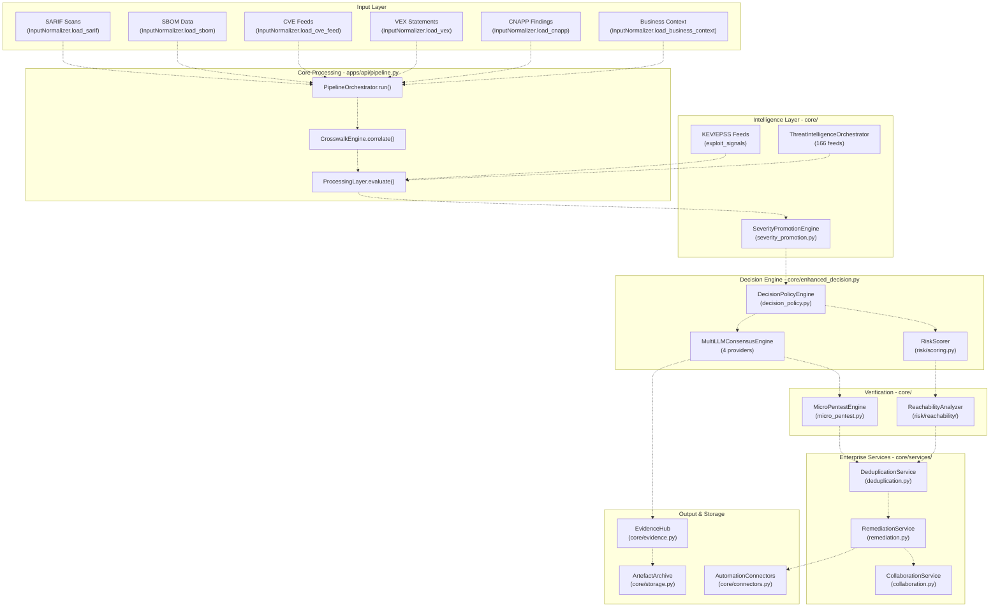
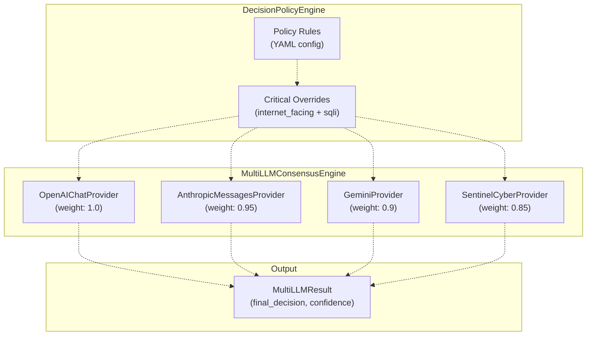
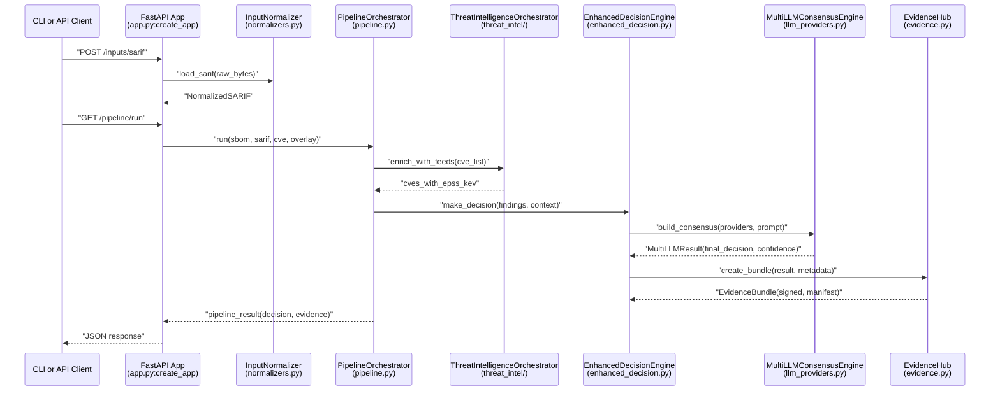

# Overview:

> **Relevant source files**
> * [.emergent/summary.txt](https://github.com/DevOpsMadDog/Fixops/blob/ce6eb1e9/.emergent/summary.txt)
> * [.github/workflows/docker-build.yml](https://github.com/DevOpsMadDog/Fixops/blob/ce6eb1e9/.github/workflows/docker-build.yml)
> * [Dockerfile](https://github.com/DevOpsMadDog/Fixops/blob/ce6eb1e9/Dockerfile)
> * [README.md](https://github.com/DevOpsMadDog/Fixops/blob/ce6eb1e9/README.md)
> * [apps/api/micro_pentest_router.py](https://github.com/DevOpsMadDog/Fixops/blob/ce6eb1e9/apps/api/micro_pentest_router.py)
> * [core/playbook_runner.py](https://github.com/DevOpsMadDog/Fixops/blob/ce6eb1e9/core/playbook_runner.py)
> * [docs/API_CLI_REFERENCE.md](https://github.com/DevOpsMadDog/Fixops/blob/ce6eb1e9/docs/API_CLI_REFERENCE.md)
> * [docs/COMPLETE_API_CLI_MAPPING.md](https://github.com/DevOpsMadDog/Fixops/blob/ce6eb1e9/docs/COMPLETE_API_CLI_MAPPING.md)
> * [docs/DOCKER_SHOWCASE_GUIDE.md](https://github.com/DevOpsMadDog/Fixops/blob/ce6eb1e9/docs/DOCKER_SHOWCASE_GUIDE.md)
> * [docs/ENTERPRISE_FEATURES.md](https://github.com/DevOpsMadDog/Fixops/blob/ce6eb1e9/docs/ENTERPRISE_FEATURES.md)
> * [docs/FEATURE_CODE_MAPPING.md](https://github.com/DevOpsMadDog/Fixops/blob/ce6eb1e9/docs/FEATURE_CODE_MAPPING.md)
> * [docs/FIXOPS_PRODUCT_STATUS.md](https://github.com/DevOpsMadDog/Fixops/blob/ce6eb1e9/docs/FIXOPS_PRODUCT_STATUS.md)
> * [docs/PLAYBOOK_LANGUAGE_REFERENCE.md](https://github.com/DevOpsMadDog/Fixops/blob/ce6eb1e9/docs/PLAYBOOK_LANGUAGE_REFERENCE.md)
> * [fixops-enterprise/src/api/v1/micro_pentest.py](https://github.com/DevOpsMadDog/Fixops/blob/ce6eb1e9/fixops-enterprise/src/api/v1/micro_pentest.py)
> * [fixops-enterprise/src/services/micro_pentest_engine.py](https://github.com/DevOpsMadDog/Fixops/blob/ce6eb1e9/fixops-enterprise/src/services/micro_pentest_engine.py)
> * [scripts/docker-entrypoint.sh](https://github.com/DevOpsMadDog/Fixops/blob/ce6eb1e9/scripts/docker-entrypoint.sh)
> * [tests/test_micro_pentest_engine.py](https://github.com/DevOpsMadDog/Fixops/blob/ce6eb1e9/tests/test_micro_pentest_engine.py)
> * [web/apps/micro-pentest/app/components/EnterpriseShell.tsx](https://github.com/DevOpsMadDog/Fixops/blob/ce6eb1e9/web/apps/micro-pentest/app/components/EnterpriseShell.tsx)
> * [web/apps/micro-pentest/app/globals.css](https://github.com/DevOpsMadDog/Fixops/blob/ce6eb1e9/web/apps/micro-pentest/app/globals.css)
> * [web/apps/micro-pentest/app/layout.tsx](https://github.com/DevOpsMadDog/Fixops/blob/ce6eb1e9/web/apps/micro-pentest/app/layout.tsx)
> * [web/apps/reachability/app/components/EnterpriseShell.tsx](https://github.com/DevOpsMadDog/Fixops/blob/ce6eb1e9/web/apps/reachability/app/components/EnterpriseShell.tsx)
> * [web/apps/reachability/app/globals.css](https://github.com/DevOpsMadDog/Fixops/blob/ce6eb1e9/web/apps/reachability/app/globals.css)
> * [web/apps/reachability/app/layout.tsx](https://github.com/DevOpsMadDog/Fixops/blob/ce6eb1e9/web/apps/reachability/app/layout.tsx)

## Purpose and Scope

This document provides a high-level introduction to the FixOps platform, its architecture, and core components. FixOps is an Enterprise DevSecOps Decision & Verification Engine that transforms security scan outputs into actionable, auditable release decisions with cryptographic proof.

This overview covers:

* The platform's purpose and design philosophy
* High-level system architecture and major components
* Data flow from input ingestion to decision output
* Deployment models and operational modes

For detailed information about specific subsystems, see:

* **Key Concepts** ([1.1](/DevOpsMadDog/Fixops/1.1-key-concepts)) - Core terminology and domain concepts
* **System Architecture** ([1.2](/DevOpsMadDog/Fixops/1.2-system-architecture)) - Detailed architectural diagrams
* **Quickstart and Demo** ([1.3](/DevOpsMadDog/Fixops/1.3-quickstart-and-demo)) - Initial setup and demo execution

**Sources**: [README.md L1-L97](https://github.com/DevOpsMadDog/Fixops/blob/ce6eb1e9/README.md#L1-L97)

 [docs/FIXOPS_PRODUCT_STATUS.md L1-L66](https://github.com/DevOpsMadDog/Fixops/blob/ce6eb1e9/docs/FIXOPS_PRODUCT_STATUS.md#L1-L66)

---

## What is FixOps?

FixOps operationalizes vulnerability management end-to-end by ingesting security artifacts (SBOM, SARIF, CVE feeds, VEX, CNAPP) and business context, then producing tri-state release-gate verdicts (Allow/Block/Needs Review) through:

1. **Multi-LLM Consensus** - Four AI providers with weighted voting (OpenAI GPT, Anthropic Claude, Google Gemini, Sentinel Cyber)
2. **Probabilistic Forecasting** - Bayesian networks and Markov chains for risk prediction
3. **Policy Evaluation** - Configurable rules that can override AI decisions for critical combinations
4. **Exploit Verification** - Micro-penetration testing via MPTE integration
5. **Evidence Generation** - RSA-SHA256 signed bundles with SLSA v1 provenance for audit trails

The platform addresses enterprise-scale challenges:

* **1 Security Architect : 159 Developers** - Automated triage at modern development velocity
* **60% False Positive Rate** - Intelligent deduplication and correlation reduces noise
* **No Design-to-Runtime Link** - Correlates architecture decisions with vulnerabilities and runtime controls
* **40-60% Wasted Team Time** - Automated evidence collection eliminates manual audit prep

**Sources**: [README.md L29-L59](https://github.com/DevOpsMadDog/Fixops/blob/ce6eb1e9/README.md#L29-L59)

 [docs/FIXOPS_PRODUCT_STATUS.md L399-L413](https://github.com/DevOpsMadDog/Fixops/blob/ce6eb1e9/docs/FIXOPS_PRODUCT_STATUS.md#L399-L413)

---

## Platform Entry Points

FixOps provides three primary interfaces for interaction:

| Interface | Entry Point | Endpoints/Commands | Description |
| --- | --- | --- | --- |
| **REST API** | `apps/api/app.py:create_app()` | 303 endpoints | FastAPI application with 32 router modules |
| **CLI** | `core/cli.py` | 111 commands | Command-line interface with 31 command groups |
| **Web UI** | `web/apps/*/` | 16 pages | React/Next.js micro-frontend applications |

### API Application Structure

The FastAPI application is created via a factory pattern at [apps/api/app.py L188-L465](https://github.com/DevOpsMadDog/Fixops/blob/ce6eb1e9/apps/api/app.py#L188-L465)

:

```
create_app()
├── Load overlay config (OverlayConfig)
├── Configure telemetry (OpenTelemetry)
├── Initialize state
│   ├── InputNormalizer
│   ├── PipelineOrchestrator
│   ├── EnhancedDecisionEngine
│   └── EvidenceHub
├── Mount 32 routers
│   ├── enhanced_router (Multi-LLM decisions)
│   ├── mpte_router (MPTE integration)
│   ├── micro_pentest_router (Micro-pentests)
│   ├── deduplication_router (Finding clustering)
│   ├── remediation_router (Task lifecycle)
│   └── ... (27 more routers)
└── Define ingestion endpoints (/inputs/*)
```

The CLI provides equivalent functionality through subcommands defined in [core/cli.py L47-L3200](https://github.com/DevOpsMadDog/Fixops/blob/ce6eb1e9/core/cli.py#L47-L3200)

 with major command handlers including:

* `_handle_run()` - Execute full pipeline
* `_handle_make_decision()` - Pipeline with exit code based on verdict
* `_handle_analyze()` - Analyze artifacts with flexible input requirements
* `_handle_demo()` - Run bundled demo scenarios

**Sources**: [apps/api/app.py L188-L465](https://github.com/DevOpsMadDog/Fixops/blob/ce6eb1e9/apps/api/app.py#L188-L465)

 [core/cli.py L1-L3200](https://github.com/DevOpsMadDog/Fixops/blob/ce6eb1e9/core/cli.py#L1-L3200)

 [docs/FIXOPS_PRODUCT_STATUS.md L153-L279](https://github.com/DevOpsMadDog/Fixops/blob/ce6eb1e9/docs/FIXOPS_PRODUCT_STATUS.md#L153-L279)

---

## High-Level System Architecture

The following diagram shows how major subsystems interact, using code entity names from the codebase:



**Sources**: [apps/api/app.py L264-L389](https://github.com/DevOpsMadDog/Fixops/blob/ce6eb1e9/apps/api/app.py#L264-L389)

 [apps/api/pipeline.py L1-L800](https://github.com/DevOpsMadDog/Fixops/blob/ce6eb1e9/apps/api/pipeline.py#L1-L800)

 [core/enhanced_decision.py L1-L800](https://github.com/DevOpsMadDog/Fixops/blob/ce6eb1e9/core/enhanced_decision.py#L1-L800)

 [docs/FIXOPS_PRODUCT_STATUS.md L66-L120](https://github.com/DevOpsMadDog/Fixops/blob/ce6eb1e9/docs/FIXOPS_PRODUCT_STATUS.md#L66-L120)

---

## Core Components and Their Responsibilities

### Input Normalization Layer

The `InputNormalizer` class at [apps/api/normalizers.py L1-L1200](https://github.com/DevOpsMadDog/Fixops/blob/ce6eb1e9/apps/api/normalizers.py#L1-L1200)

 provides parsers for all supported input formats:

| Method | Format | Standards Supported |
| --- | --- | --- |
| `load_sbom()` | SBOM | CycloneDX 1.4-1.6, SPDX 2.3, Syft JSON |
| `load_sarif()` | SARIF | SARIF 2.1.0 (OASIS standard) |
| `load_cve_feed()` | CVE | NVD JSON 5.1.1, CISA KEV |
| `load_vex()` | VEX | CycloneDX VEX, OpenVEX, CSAF VEX |
| `load_cnapp()` | CNAPP | Wiz, Prisma Cloud, custom JSON |
| `load_business_context()` | Context | JSON/YAML with criticality metadata |

Normalized outputs are stored in `app.state.artifacts` as dataclass instances (`NormalizedSBOM`, `NormalizedSARIF`, etc.) at [apps/api/normalizers.py L50-L200](https://github.com/DevOpsMadDog/Fixops/blob/ce6eb1e9/apps/api/normalizers.py#L50-L200)

### Pipeline Orchestration

The `PipelineOrchestrator` at [apps/api/pipeline.py L1-L800](https://github.com/DevOpsMadDog/Fixops/blob/ce6eb1e9/apps/api/pipeline.py#L1-L800)

 coordinates all processing stages:

1. **Crosswalk Correlation** - Links design context, SBOM components, SARIF findings, and CVE records
2. **Processing Layer** - Applies Bayesian/Markov models via [core/processing_layer.py L1-L600](https://github.com/DevOpsMadDog/Fixops/blob/ce6eb1e9/core/processing_layer.py#L1-L600)
3. **Risk Scoring** - Computes EPSS + KEV + CVSS scores via [risk/scoring.py L1-L2637](https://github.com/DevOpsMadDog/Fixops/blob/ce6eb1e9/risk/scoring.py#L1-L2637)
4. **Decision Engine** - Invokes multi-LLM consensus via [core/enhanced_decision.py L1-L800](https://github.com/DevOpsMadDog/Fixops/blob/ce6eb1e9/core/enhanced_decision.py#L1-L800)
5. **Evidence Generation** - Creates signed bundles via [core/evidence.py L1-L437](https://github.com/DevOpsMadDog/Fixops/blob/ce6eb1e9/core/evidence.py#L1-L437)

### Decision Engine

The `EnhancedDecisionEngine` at [core/enhanced_decision.py L1-L800](https://github.com/DevOpsMadDog/Fixops/blob/ce6eb1e9/core/enhanced_decision.py#L1-L800)

 orchestrates decision-making:



Default consensus threshold is 85% (configurable via `FIXOPS_CONSENSUS_THRESHOLD`). If LLM providers are unavailable, the system falls back to deterministic risk-based decisions via [core/enhanced_decision.py L450-L550](https://github.com/DevOpsMadDog/Fixops/blob/ce6eb1e9/core/enhanced_decision.py#L450-L550)

**Sources**: [core/enhanced_decision.py L1-L800](https://github.com/DevOpsMadDog/Fixops/blob/ce6eb1e9/core/enhanced_decision.py#L1-L800)

 [core/decision_policy.py L1-L400](https://github.com/DevOpsMadDog/Fixops/blob/ce6eb1e9/core/decision_policy.py#L1-L400)

 [core/llm_providers.py L1-L660](https://github.com/DevOpsMadDog/Fixops/blob/ce6eb1e9/core/llm_providers.py#L1-L660)

### Enterprise Services

Three major services handle post-decision operations:

| Service | Database | Primary Functions |
| --- | --- | --- |
| `DeduplicationService` | `data/integrations/deduplication.db` | Cluster findings, correlate cross-stage, track baseline drift |
| `RemediationService` | `data/integrations/remediation.db` | Task lifecycle, SLA tracking, bulk operations |
| `CollaborationService` | `data/integrations/collaboration.db` | Comments, watchers, activity feeds, notifications |

These services are defined in [core/services/deduplication.py L1-L1157](https://github.com/DevOpsMadDog/Fixops/blob/ce6eb1e9/core/services/deduplication.py#L1-L1157)

 [core/services/remediation.py L1-L1112](https://github.com/DevOpsMadDog/Fixops/blob/ce6eb1e9/core/services/remediation.py#L1-L1112)

 and [core/services/collaboration.py L1-L800](https://github.com/DevOpsMadDog/Fixops/blob/ce6eb1e9/core/services/collaboration.py#L1-L800)

**Sources**: [core/services/deduplication.py L1-L1157](https://github.com/DevOpsMadDog/Fixops/blob/ce6eb1e9/core/services/deduplication.py#L1-L1157)

 [core/services/remediation.py L1-L1112](https://github.com/DevOpsMadDog/Fixops/blob/ce6eb1e9/core/services/remediation.py#L1-L1112)

 [core/services/collaboration.py L1-L800](https://github.com/DevOpsMadDog/Fixops/blob/ce6eb1e9/core/services/collaboration.py#L1-L800)

---

## Data Flow Through the System

The following diagram traces a single request from input to signed evidence bundle:



Key data transformations:

1. **Raw bytes** → `NormalizedSARIF` (via `InputNormalizer`)
2. **Normalized findings** → **Crosswalk entries** (via `CrosswalkEngine`)
3. **Crosswalk + CVE** → **Risk profiles** (via `ProcessingLayer`)
4. **Risk profiles + context** → **LLM prompts** (via `EnhancedDecisionEngine`)
5. **LLM responses** → **Consensus verdict** (via `MultiLLMConsensusEngine`)
6. **Pipeline result** → **Signed bundle** (via `EvidenceHub`)

**Sources**: [apps/api/app.py L850-L1050](https://github.com/DevOpsMadDog/Fixops/blob/ce6eb1e9/apps/api/app.py#L850-L1050)

 [apps/api/pipeline.py L100-L500](https://github.com/DevOpsMadDog/Fixops/blob/ce6eb1e9/apps/api/pipeline.py#L100-L500)

 [core/enhanced_decision.py L400-L700](https://github.com/DevOpsMadDog/Fixops/blob/ce6eb1e9/core/enhanced_decision.py#L400-L700)

---

## Configuration and Operating Modes

FixOps behavior is controlled via the overlay configuration at [config/fixops.overlay.yml L1-L500](https://github.com/DevOpsMadDog/Fixops/blob/ce6eb1e9/config/fixops.overlay.yml#L1-L500)

 loaded by `OverlayConfig` at [core/configuration.py L1-L1530](https://github.com/DevOpsMadDog/Fixops/blob/ce6eb1e9/core/configuration.py#L1-L1530)

### Operating Modes

| Mode | Description | Configuration |
| --- | --- | --- |
| **demo** | Simplified settings, no external integrations | `mode: demo` |
| **enterprise** | Full features with compliance and governance | `mode: enterprise` |

Modes are selected via:

* Environment variable: `FIXOPS_MODE=demo`
* CLI flag: `--overlay config/custom.yml`
* API: Loaded at [apps/api/app.py L193](https://github.com/DevOpsMadDog/Fixops/blob/ce6eb1e9/apps/api/app.py#L193-L193)

### LLM Provider Configuration

LLM providers can be enabled/disabled individually via environment variables:

```javascript
export FIXOPS_ENABLE_OPENAI=true
export FIXOPS_ENABLE_ANTHROPIC=true
export FIXOPS_ENABLE_GEMINI=true
export FIXOPS_ENABLE_SENTINEL=true
```

When all providers are disabled, the system falls back to deterministic risk-based decisions via [core/enhanced_decision.py L450-L550](https://github.com/DevOpsMadDog/Fixops/blob/ce6eb1e9/core/enhanced_decision.py#L450-L550)

### Overlay Configuration Structure

The overlay YAML defines:

* **Risk models** - Thresholds and weights for scoring
* **Modules** - Feature flags (guardrails, compliance, ssdlc, probabilistic)
* **Exploit signals** - KEV/EPSS feed refresh settings
* **Evidence hub** - Retention policies and signing configuration
* **Policy automation** - Rule definitions for decision overrides

Example structure at [config/fixops.overlay.yml L1-L100](https://github.com/DevOpsMadDog/Fixops/blob/ce6eb1e9/config/fixops.overlay.yml#L1-L100)

:

```yaml
risk_models:
  weighted_scoring_v1:
    allow_threshold: 0.6
    block_threshold: 0.85
    criticality_weights:
      critical: 1.0
      high: 0.8
modules:
  guardrails: true
  compliance: true
  probabilistic: true
```

**Sources**: [core/configuration.py L1-L1530](https://github.com/DevOpsMadDog/Fixops/blob/ce6eb1e9/core/configuration.py#L1-L1530)

 [config/fixops.overlay.yml L1-L500](https://github.com/DevOpsMadDog/Fixops/blob/ce6eb1e9/config/fixops.overlay.yml#L1-L500)

 [README.md L250-L291](https://github.com/DevOpsMadDog/Fixops/blob/ce6eb1e9/README.md#L250-L291)

---

## Deployment Models

FixOps supports three deployment configurations:

### 1. Local Development

```markdown
# Virtual environment setup
python -m venv .venv
source .venv/bin/activate
pip install -r requirements.txt

# Start API server
uvicorn apps.api.app:create_app --factory --reload --port 8000
```

State is stored in local SQLite databases under `data/` directory.

### 2. Docker Compose

Four compose files provide different configurations:

| File | Purpose | Services |
| --- | --- | --- |
| `docker-compose.yml` | Main dev stack | fixops-api, postgres, redis |
| `docker-compose.enterprise.yml` | Enterprise features | + chromadb, mpte |
| `docker-compose.demo.yml` | Demo with telemetry | + jaeger, prometheus |
| `deployment-packs/docker/docker-compose.yml` | Production template | Full stack with HA |

Example startup at [README.md L527-L552](https://github.com/DevOpsMadDog/Fixops/blob/ce6eb1e9/README.md#L527-L552)

:

```
docker compose up -d
curl http://localhost:8000/health
```

### 3. Air-Gapped Deployment

For classified environments, FixOps operates fully offline:

1. Pre-pull images and save to tar files
2. Transfer to air-gapped environment
3. Load images and start services
4. Run with `--offline` flag to disable feed refresh

Documented at [README.md L868-L920](https://github.com/DevOpsMadDog/Fixops/blob/ce6eb1e9/README.md#L868-L920)

**Sources**: [README.md L467-L552](https://github.com/DevOpsMadDog/Fixops/blob/ce6eb1e9/README.md#L467-L552)

 [docker-compose.yml L1-L100](https://github.com/DevOpsMadDog/Fixops/blob/ce6eb1e9/docker-compose.yml#L1-L100)

 [docker-compose.enterprise.yml L1-L150](https://github.com/DevOpsMadDog/Fixops/blob/ce6eb1e9/docker-compose.enterprise.yml#L1-L150)

---

## Integration Points

FixOps integrates with external systems via connectors at [core/connectors.py L1-L2400](https://github.com/DevOpsMadDog/Fixops/blob/ce6eb1e9/core/connectors.py#L1-L2400)

:

### Outbound Connectors

| Connector | Operations | Code Reference |
| --- | --- | --- |
| **JiraConnector** | create_issue, update_issue, transition_issue, add_comment | [core/connectors.py L330-L840](https://github.com/DevOpsMadDog/Fixops/blob/ce6eb1e9/core/connectors.py#L330-L840) |
| **ConfluenceConnector** | create_page, update_page, get_page, search_pages | [core/connectors.py L843-L1159](https://github.com/DevOpsMadDog/Fixops/blob/ce6eb1e9/core/connectors.py#L843-L1159) |
| **ServiceNowConnector** | create_incident, update_incident, add_work_note | [core/connectors.py L1239-L1600](https://github.com/DevOpsMadDog/Fixops/blob/ce6eb1e9/core/connectors.py#L1239-L1600) |
| **GitLabConnector** | create_issue, update_issue, add_comment | [core/connectors.py L1604-L1960](https://github.com/DevOpsMadDog/Fixops/blob/ce6eb1e9/core/connectors.py#L1604-L1960) |
| **AzureDevOpsConnector** | create_work_item, update_work_item, add_comment | [core/connectors.py L1963-L2320](https://github.com/DevOpsMadDog/Fixops/blob/ce6eb1e9/core/connectors.py#L1963-L2320) |
| **GitHubConnector** | create_issue, update_issue, add_comment | [core/connectors.py L1205-L1423](https://github.com/DevOpsMadDog/Fixops/blob/ce6eb1e9/core/connectors.py#L1205-L1423) |
| **SlackConnector** | post_message | [core/connectors.py L442-L479](https://github.com/DevOpsMadDog/Fixops/blob/ce6eb1e9/core/connectors.py#L442-L479) |

All connectors implement:

* Circuit breaker pattern (5 failures → open)
* Rate limiting (10 req/sec with burst capacity)
* Exponential backoff retry (max 3 retries)
* Health checks for connectivity validation

### Inbound Webhooks

Webhook receivers at [apps/api/webhooks_router.py L239-L700](https://github.com/DevOpsMadDog/Fixops/blob/ce6eb1e9/apps/api/webhooks_router.py#L239-L700)

 handle bidirectional sync:

* `POST /api/v1/webhooks/jira` - Jira issue updates with HMAC signature verification
* `POST /api/v1/webhooks/servicenow` - ServiceNow incident updates
* `POST /api/v1/webhooks/gitlab` - GitLab issue/MR events
* `POST /api/v1/webhooks/azure-devops` - Azure DevOps work item updates

These endpoints store events in `data/integrations/webhooks.db` and trigger drift detection when external status differs from FixOps status.

**Sources**: [core/connectors.py L1-L2400](https://github.com/DevOpsMadDog/Fixops/blob/ce6eb1e9/core/connectors.py#L1-L2400)

 [apps/api/webhooks_router.py L1-L1300](https://github.com/DevOpsMadDog/Fixops/blob/ce6eb1e9/apps/api/webhooks_router.py#L1-L1300)

 [docs/FIXOPS_PRODUCT_STATUS.md L424-L436](https://github.com/DevOpsMadDog/Fixops/blob/ce6eb1e9/docs/FIXOPS_PRODUCT_STATUS.md#L424-L436)

---

## Storage Architecture

FixOps uses a hybrid storage approach:

### SQLite Databases

Located under `data/` directory, each service maintains its own database:

| Database | Service | Key Tables |
| --- | --- | --- |
| `deduplication.db` | DeduplicationService | clusters, cluster_findings, cross_stage_correlation |
| `remediation.db` | RemediationService | tasks, sla_tracking, verification_evidence |
| `collaboration.db` | CollaborationService | comments, watchers, activity_feed, notifications |
| `webhooks.db` | Webhook receivers | integration_mappings, webhook_events, sync_drift, outbox |
| `mpte.db` | MPTE integration | requests, results, configs |

Database initialization occurs at service instantiation, e.g., [apps/api/webhooks_router.py L48-L140](https://github.com/DevOpsMadDog/Fixops/blob/ce6eb1e9/apps/api/webhooks_router.py#L48-L140)

### File-Based Artifacts

Structured artifacts are stored in the file system:

* **Evidence bundles** - `data/evidence/bundles/` - RSA-signed .tar.gz files
* **Evidence manifests** - `data/evidence/manifests/` - JSON metadata with signatures
* **SBOM artifacts** - `data/artifacts/sbom/` - Normalized SBOM files
* **Provenance attestations** - `data/artifacts/attestations/` - SLSA v1 bundles
* **Archived inputs** - `data/archive/{mode}/` - Original uploaded files

The `ArtefactArchive` at [core/storage.py L1-L500](https://github.com/DevOpsMadDog/Fixops/blob/ce6eb1e9/core/storage.py#L1-L500)

 manages file persistence with compression and path validation.

**Sources**: [apps/api/webhooks_router.py L36-L140](https://github.com/DevOpsMadDog/Fixops/blob/ce6eb1e9/apps/api/webhooks_router.py#L36-L140)

 [core/storage.py L1-L500](https://github.com/DevOpsMadDog/Fixops/blob/ce6eb1e9/core/storage.py#L1-L500)

 [apps/api/app.py L292-L389](https://github.com/DevOpsMadDog/Fixops/blob/ce6eb1e9/apps/api/app.py#L292-L389)

---

## Monitoring and Observability

### OpenTelemetry Integration

Telemetry is configured at [telemetry/__init__.py L1-L200](https://github.com/DevOpsMadDog/Fixops/blob/ce6eb1e9/telemetry/__init__.py#L1-L200)

 and enabled unless `FIXOPS_DISABLE_TELEMETRY=1`:

* **Tracing** - Automatic instrumentation via `FastAPIInstrumentor` at [apps/api/app.py L220](https://github.com/DevOpsMadDog/Fixops/blob/ce6eb1e9/apps/api/app.py#L220-L220)
* **Metrics** - Counter, histogram, and gauge metrics for API endpoints
* **Logging** - Structured logging with correlation IDs via `CorrelationIdMiddleware` at [apps/api/middleware.py L1-L100](https://github.com/DevOpsMadDog/Fixops/blob/ce6eb1e9/apps/api/middleware.py#L1-L100)

Correlation IDs are propagated through:

1. HTTP request headers (`X-Correlation-ID`)
2. Log context (structlog)
3. Database records (as metadata)

### Health Checks

Health endpoints defined at [apps/api/health_router.py L1-L200](https://github.com/DevOpsMadDog/Fixops/blob/ce6eb1e9/apps/api/health_router.py#L1-L200)

:

| Endpoint | Authentication | Response |
| --- | --- | --- |
| `/health` | None | `{"status":"ok"}` |
| `/api/v1/health` | API key | Detailed health with component status |
| `/api/v1/health/dependencies` | API key | External dependency health |

CLI health check available via:

```
python -m core.cli health --pretty
```

Returns status of:

* Overlay mode
* pgmpy/pomegranate/mchmm availability
* Evidence hub readiness
* OPA configuration

**Sources**: [apps/api/health_router.py L1-L200](https://github.com/DevOpsMadDog/Fixops/blob/ce6eb1e9/apps/api/health_router.py#L1-L200)

 [core/cli.py L552-L583](https://github.com/DevOpsMadDog/Fixops/blob/ce6eb1e9/core/cli.py#L552-L583)

 [telemetry/__init__.py L1-L200](https://github.com/DevOpsMadDog/Fixops/blob/ce6eb1e9/telemetry/__init__.py#L1-L200)

---

## Summary

FixOps is a comprehensive DevSecOps platform built with a modular architecture:

1. **Input Layer** - Normalizes security artifacts from any scanner via `InputNormalizer`
2. **Processing Engine** - Orchestrates analysis via `PipelineOrchestrator` with probabilistic models
3. **Decision Engine** - Produces verdicts via multi-LLM consensus with policy overrides
4. **Enterprise Services** - Deduplicates findings, tracks remediation, enables collaboration
5. **Evidence System** - Generates cryptographically signed bundles for audit compliance
6. **Integration Layer** - Bidirectional sync with ticketing systems via enterprise connectors

The platform provides three interfaces (REST API, CLI, Web UI) and supports multiple deployment models (local, Docker, air-gapped). All behavior is controlled via the overlay configuration system, enabling flexible feature toggling and risk model customization.

For detailed information about specific subsystems, continue to:

* **Key Concepts** ([1.1](/DevOpsMadDog/Fixops/1.1-key-concepts)) - Terminology and domain concepts
* **System Architecture** ([1.2](/DevOpsMadDog/Fixops/1.2-system-architecture)) - Detailed architectural patterns
* **Quickstart and Demo** ([1.3](/DevOpsMadDog/Fixops/1.3-quickstart-and-demo)) - Hands-on setup guide

**Sources**: [README.md L1-L97](https://github.com/DevOpsMadDog/Fixops/blob/ce6eb1e9/README.md#L1-L97)

 [apps/api/app.py L188-L465](https://github.com/DevOpsMadDog/Fixops/blob/ce6eb1e9/apps/api/app.py#L188-L465)

 [core/cli.py L1-L3200](https://github.com/DevOpsMadDog/Fixops/blob/ce6eb1e9/core/cli.py#L1-L3200)

 [docs/FIXOPS_PRODUCT_STATUS.md L1-L600](https://github.com/DevOpsMadDog/Fixops/blob/ce6eb1e9/docs/FIXOPS_PRODUCT_STATUS.md#L1-L600)