# Processing Layer

> **Relevant source files**
> * [.github/workflows/ci.yml](https://github.com/DevOpsMadDog/Fixops/blob/ce6eb1e9/.github/workflows/ci.yml)
> * [.github/workflows/fixops-ci.yml](https://github.com/DevOpsMadDog/Fixops/blob/ce6eb1e9/.github/workflows/fixops-ci.yml)
> * [.github/workflows/qa.yml](https://github.com/DevOpsMadDog/Fixops/blob/ce6eb1e9/.github/workflows/qa.yml)
> * [apps/api/bulk_router.py](https://github.com/DevOpsMadDog/Fixops/blob/ce6eb1e9/apps/api/bulk_router.py)
> * [apps/api/collaboration_router.py](https://github.com/DevOpsMadDog/Fixops/blob/ce6eb1e9/apps/api/collaboration_router.py)
> * [apps/api/deduplication_router.py](https://github.com/DevOpsMadDog/Fixops/blob/ce6eb1e9/apps/api/deduplication_router.py)
> * [apps/api/integrations_router.py](https://github.com/DevOpsMadDog/Fixops/blob/ce6eb1e9/apps/api/integrations_router.py)
> * [apps/api/normalizers.py](https://github.com/DevOpsMadDog/Fixops/blob/ce6eb1e9/apps/api/normalizers.py)
> * [apps/api/pipeline.py](https://github.com/DevOpsMadDog/Fixops/blob/ce6eb1e9/apps/api/pipeline.py)
> * [apps/api/remediation_router.py](https://github.com/DevOpsMadDog/Fixops/blob/ce6eb1e9/apps/api/remediation_router.py)
> * [apps/api/webhooks_router.py](https://github.com/DevOpsMadDog/Fixops/blob/ce6eb1e9/apps/api/webhooks_router.py)
> * [core/adapters.py](https://github.com/DevOpsMadDog/Fixops/blob/ce6eb1e9/core/adapters.py)
> * [core/connectors.py](https://github.com/DevOpsMadDog/Fixops/blob/ce6eb1e9/core/connectors.py)
> * [core/paths.py](https://github.com/DevOpsMadDog/Fixops/blob/ce6eb1e9/core/paths.py)
> * [core/policy.py](https://github.com/DevOpsMadDog/Fixops/blob/ce6eb1e9/core/policy.py)
> * [core/processing_layer.py](https://github.com/DevOpsMadDog/Fixops/blob/ce6eb1e9/core/processing_layer.py)
> * [core/services/collaboration.py](https://github.com/DevOpsMadDog/Fixops/blob/ce6eb1e9/core/services/collaboration.py)
> * [core/services/deduplication.py](https://github.com/DevOpsMadDog/Fixops/blob/ce6eb1e9/core/services/deduplication.py)
> * [core/services/identity.py](https://github.com/DevOpsMadDog/Fixops/blob/ce6eb1e9/core/services/identity.py)
> * [core/services/remediation.py](https://github.com/DevOpsMadDog/Fixops/blob/ce6eb1e9/core/services/remediation.py)
> * [core/storage.py](https://github.com/DevOpsMadDog/Fixops/blob/ce6eb1e9/core/storage.py)
> * [fixops-enterprise/src/services/feeds_service.py](https://github.com/DevOpsMadDog/Fixops/blob/ce6eb1e9/fixops-enterprise/src/services/feeds_service.py)
> * [fixops-enterprise/src/services/vex_ingestion.py](https://github.com/DevOpsMadDog/Fixops/blob/ce6eb1e9/fixops-enterprise/src/services/vex_ingestion.py)
> * [tests/test_file_size_limits.py](https://github.com/DevOpsMadDog/Fixops/blob/ce6eb1e9/tests/test_file_size_limits.py)
> * [tests/test_pipeline_integration.py](https://github.com/DevOpsMadDog/Fixops/blob/ce6eb1e9/tests/test_pipeline_integration.py)
> * [tests/test_round2_fresh_apps.py](https://github.com/DevOpsMadDog/Fixops/blob/ce6eb1e9/tests/test_round2_fresh_apps.py)

## Purpose and Scope

The Processing Layer is an advanced analytics engine that applies probabilistic models and graph analysis to vulnerability data. It transforms raw security findings into risk-scored intelligence by combining Bayesian inference, Markov chain projections, and knowledge graph metrics. This layer operates after input normalization and before the Decision Engine.

For information about the overall pipeline coordination, see [Pipeline Orchestration](/DevOpsMadDog/Fixops/6-pipeline-orchestration). For risk-based profiling that consumes Processing Layer outputs, see [Risk-Based Profiling](/DevOpsMadDog/Fixops/4.3-risk-based-profiling). For the Bayesian Network + Logistic Regression hybrid model, see [BN-LR Hybrid Risk Model](/DevOpsMadDog/Fixops/5.2-bn-lr-hybrid-risk-model).

---

## Architecture Overview

The Processing Layer is implemented in [core/processing_layer.py](https://github.com/DevOpsMadDog/Fixops/blob/ce6eb1e9/core/processing_layer.py)

 and provides a unified interface for four distinct analytical capabilities: Bayesian prior computation, Markov severity forecasting, knowledge graph construction, and non-CVE finding analysis.

### System Context

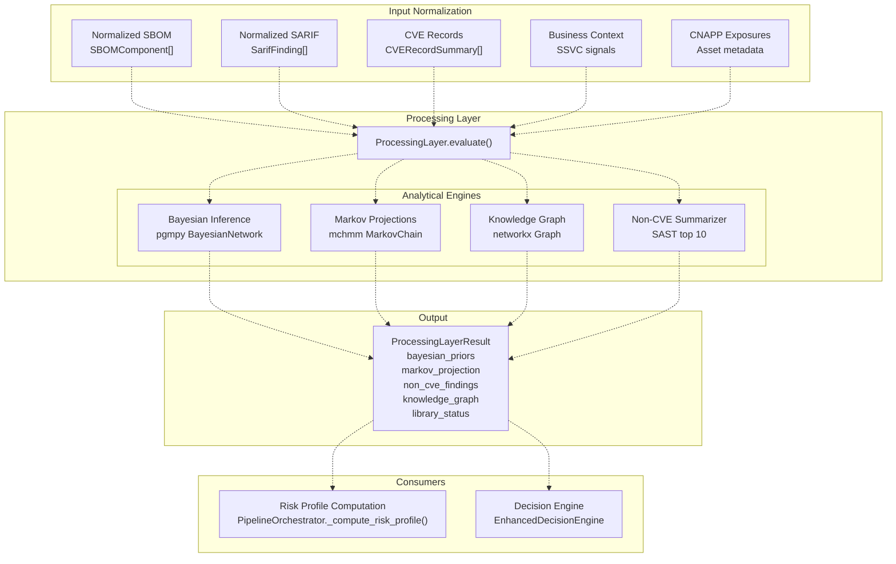

**Sources:** [core/processing_layer.py L1-L106](https://github.com/DevOpsMadDog/Fixops/blob/ce6eb1e9/core/processing_layer.py#L1-L106)

 [apps/api/pipeline.py L887-L894](https://github.com/DevOpsMadDog/Fixops/blob/ce6eb1e9/apps/api/pipeline.py#L887-L894)

---

## Core Components

### ProcessingLayer Class

The `ProcessingLayer` class is the primary entry point, providing the `evaluate()` method that coordinates all analytical operations.

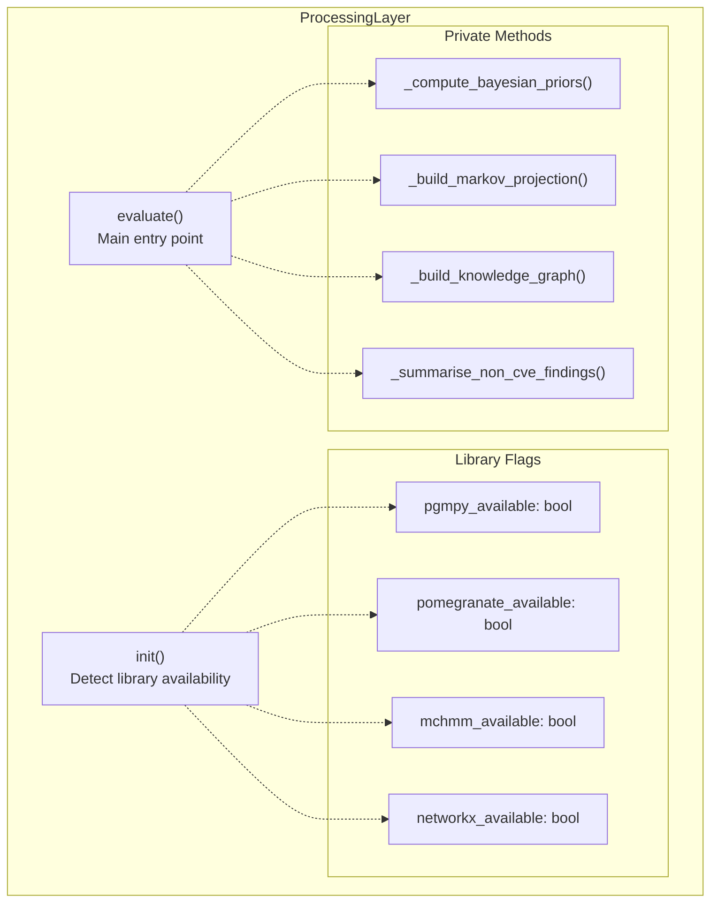

The class initializes by detecting available libraries and sets boolean flags used for graceful fallback:

| Library | Purpose | Fallback Strategy |
| --- | --- | --- |
| `pgmpy` | Bayesian Network inference with 5-factor CPD model | Return default priors with medium risk |
| `pomegranate` | Alternative Bayesian modeling (future use) | Not currently used in main path |
| `mchmm` | Markov chain state transitions | Use simple state counting |
| `networkx` | Graph construction and metrics | Return basic node/edge counts |

**Sources:** [core/processing_layer.py L57-L71](https://github.com/DevOpsMadDog/Fixops/blob/ce6eb1e9/core/processing_layer.py#L57-L71)

### ProcessingLayerResult

The `ProcessingLayerResult` dataclass encapsulates all outputs from the processing layer:

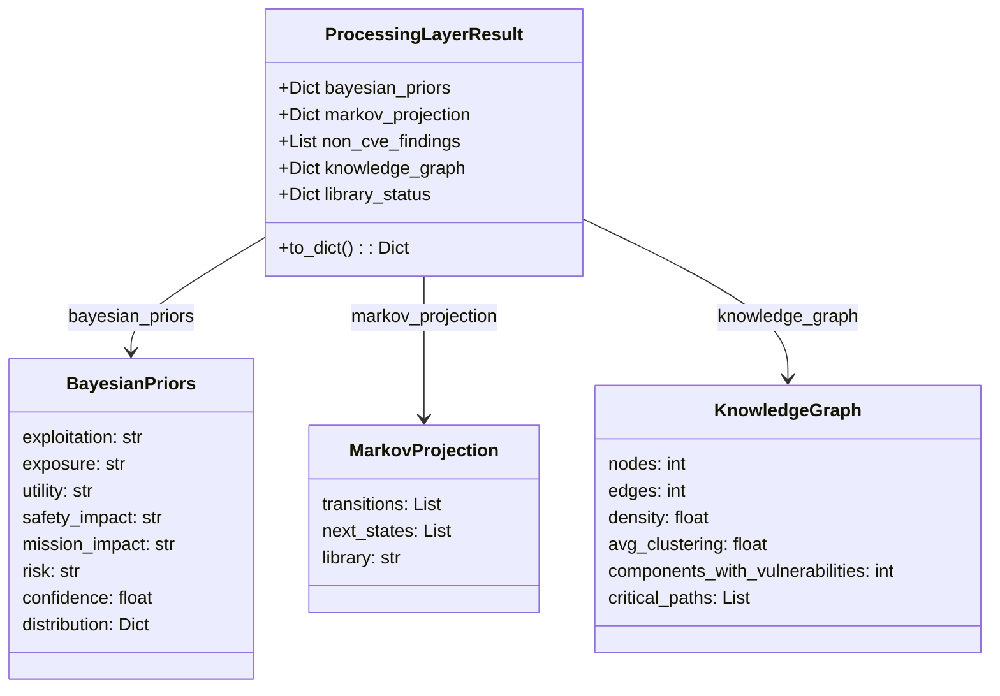

**Sources:** [core/processing_layer.py L37-L54](https://github.com/DevOpsMadDog/Fixops/blob/ce6eb1e9/core/processing_layer.py#L37-L54)

---

## Bayesian Inference Engine

The Bayesian inference component uses a 5-factor Conditional Probability Distribution (CPD) model based on the SSVC (Stakeholder-Specific Vulnerability Categorization) framework.

### Bayesian Network Structure

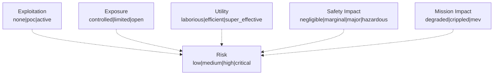

The model is constructed using `pgmpy.models.BayesianNetwork` with edges from each factor to the risk node. Each factor has a `TabularCPD` defining prior probabilities:

| Factor | States | Prior Distribution |
| --- | --- | --- |
| exploitation | none, poc, active | [0.6, 0.3, 0.1] |
| exposure | controlled, limited, open | [0.5, 0.3, 0.2] |
| utility | laborious, efficient, super_effective | [0.4, 0.4, 0.2] |
| safety_impact | negligible, marginal, major, hazardous | [0.5, 0.3, 0.15, 0.05] |
| mission_impact | degraded, crippled, mev | [0.5, 0.35, 0.15] |

The risk CPD is a 4×3×3×3×4×3 table (324 entries per risk state) that combines evidence from all factors.

**Sources:** [core/processing_layer.py L110-L210](https://github.com/DevOpsMadDog/Fixops/blob/ce6eb1e9/core/processing_layer.py#L110-L210)

### Inference Process

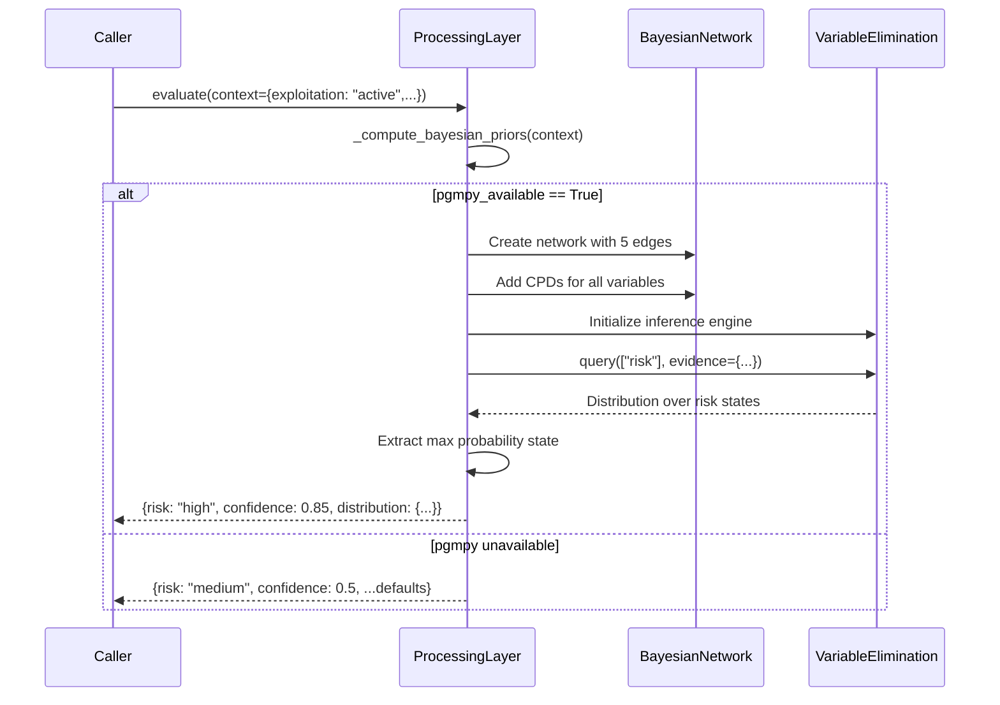

The inference uses variable elimination to compute the posterior distribution over risk states given the evidence (context values). The result includes the most likely risk level, confidence score (probability of that state), and full distribution.

**Sources:** [core/processing_layer.py L110-L210](https://github.com/DevOpsMadDog/Fixops/blob/ce6eb1e9/core/processing_layer.py#L110-L210)

### Integration with Risk Profile

The Bayesian priors are consumed by `PipelineOrchestrator._compute_risk_profile_heuristic()`:

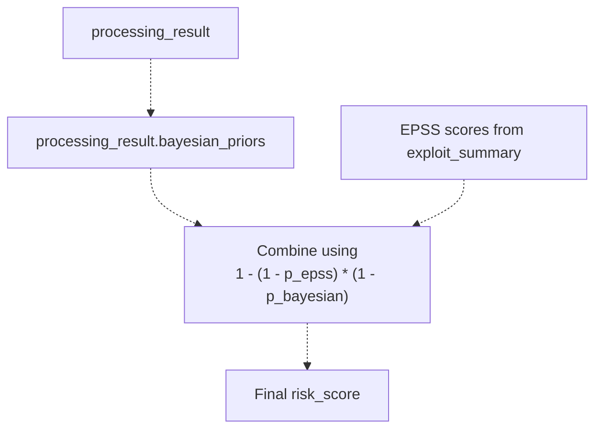

The code at [apps/api/pipeline.py L388-L397](https://github.com/DevOpsMadDog/Fixops/blob/ce6eb1e9/apps/api/pipeline.py#L388-L397)

 extracts the risk prior and combines it with EPSS scores using probabilistic OR: `p_combined = 1.0 - (1.0 - p_epss) * (1.0 - p_bayesian)`.

**Sources:** [apps/api/pipeline.py L351-L449](https://github.com/DevOpsMadDog/Fixops/blob/ce6eb1e9/apps/api/pipeline.py#L351-L449)

 [core/processing_layer.py L110-L210](https://github.com/DevOpsMadDog/Fixops/blob/ce6eb1e9/core/processing_layer.py#L110-L210)

---

## Markov Chain Modeling

The Markov component projects future severity states based on historical CVE severity transitions. This helps forecast whether vulnerabilities are likely to escalate in severity over time.

### Transition Matrix Construction

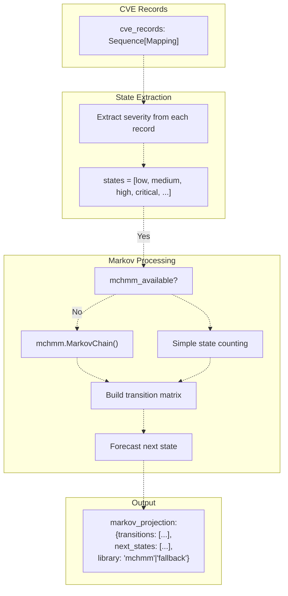

When `mchmm` is available, the code constructs a proper Markov chain model. The fallback counts consecutive state pairs to estimate transition probabilities.

**Sources:** [core/processing_layer.py L216-L266](https://github.com/DevOpsMadDog/Fixops/blob/ce6eb1e9/core/processing_layer.py#L216-L266)

### Projection Format

The `markov_projection` dictionary contains:

```json
{
    "transitions": [
        {"from": "medium", "to": "high", "probability": 0.15, "count": 3},
        {"from": "high", "to": "critical", "probability": 0.08, "count": 2}
    ],
    "next_states": [
        {"severity": "high", "probability": 0.25, "confidence": 0.7},
        {"severity": "critical", "probability": 0.15, "confidence": 0.6}
    ],
    "library": "mchmm"
}
```

The `next_states` array provides severity forecasts that can be used to adjust risk scores. The risk profile computation at [apps/api/pipeline.py L399-L417](https://github.com/DevOpsMadDog/Fixops/blob/ce6eb1e9/apps/api/pipeline.py#L399-L417)

 uses this by mapping severity to probability values (low=0.2, medium=0.4, high=0.7, critical=0.9) and combining with Bayesian priors.

**Sources:** [core/processing_layer.py L216-L266](https://github.com/DevOpsMadDog/Fixops/blob/ce6eb1e9/core/processing_layer.py#L216-L266)

 [apps/api/pipeline.py L399-L417](https://github.com/DevOpsMadDog/Fixops/blob/ce6eb1e9/apps/api/pipeline.py#L399-L417)

---

## Knowledge Graph Construction

The knowledge graph represents relationships between components, vulnerabilities, findings, and CNAPP exposures as a directed graph structure.

### Graph Schema

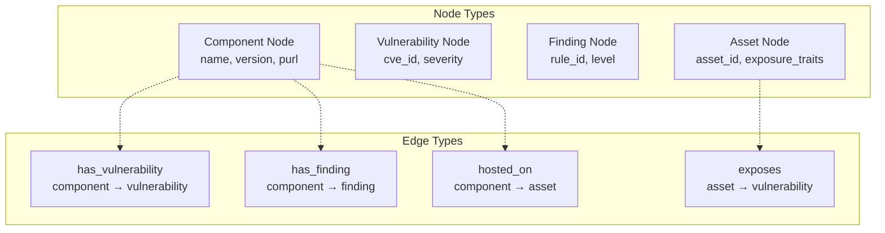

**Sources:** [core/processing_layer.py L268-L349](https://github.com/DevOpsMadDog/Fixops/blob/ce6eb1e9/core/processing_layer.py#L268-L349)

### Graph Metrics

When `networkx` is available, the following metrics are computed:

| Metric | Calculation | Interpretation |
| --- | --- | --- |
| nodes | `G.number_of_nodes()` | Total entities in the graph |
| edges | `G.number_of_edges()` | Total relationships |
| density | `nx.density(G)` | Ratio of actual to possible edges (0-1) |
| avg_clustering | `nx.average_clustering(G.to_undirected())` | Local interconnectedness |
| avg_shortest_path | `nx.average_shortest_path_length(G)` | Average distance between nodes |
| components_with_vulnerabilities | Custom count | Components with CVE edges |
| critical_paths | `nx.shortest_path(G, source, target)` | Paths from exposed assets to critical CVEs |

The fallback when `networkx` is unavailable simply counts nodes and edges without computing advanced metrics.

**Sources:** [core/processing_layer.py L268-L349](https://github.com/DevOpsMadDog/Fixops/blob/ce6eb1e9/core/processing_layer.py#L268-L349)

### Critical Path Detection

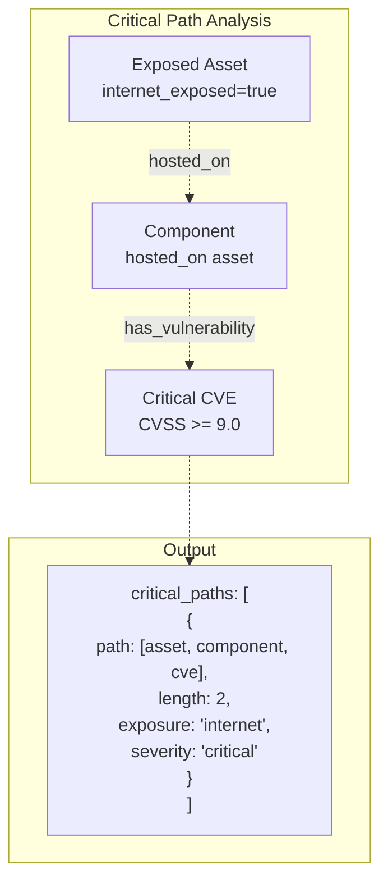

Critical paths are identified by finding shortest paths from exposed assets (with `internet_exposed` or `partner_connected` traits) to high-severity vulnerabilities. This information is used by the decision engine to apply exposure multipliers.

**Sources:** [core/processing_layer.py L268-L349](https://github.com/DevOpsMadDog/Fixops/blob/ce6eb1e9/core/processing_layer.py#L268-L349)

 [apps/api/pipeline.py L286-L349](https://github.com/DevOpsMadDog/Fixops/blob/ce6eb1e9/apps/api/pipeline.py#L286-L349)

---

## Non-CVE Finding Analysis

The Processing Layer also summarizes SAST findings that don't have associated CVE identifiers, grouping them by category and rule for the decision engine.

### Summarization Logic

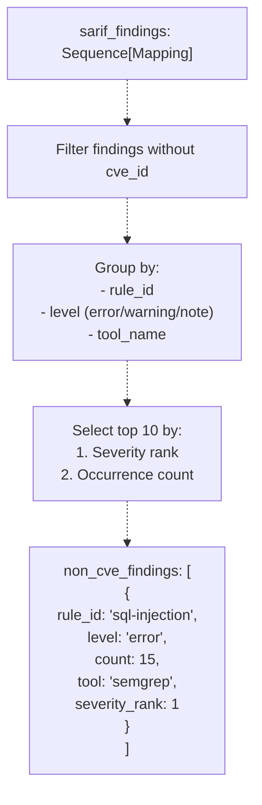

This allows the decision engine to reason about non-CVE security issues (like code quality findings, misconfigurations, or SAST detections) alongside vulnerability-based decisions.

**Sources:** [core/processing_layer.py L351-L387](https://github.com/DevOpsMadDog/Fixops/blob/ce6eb1e9/core/processing_layer.py#L351-L387)

---

## Integration with Pipeline

The Processing Layer is invoked by `PipelineOrchestrator.run()` after input normalization and before decision-making:

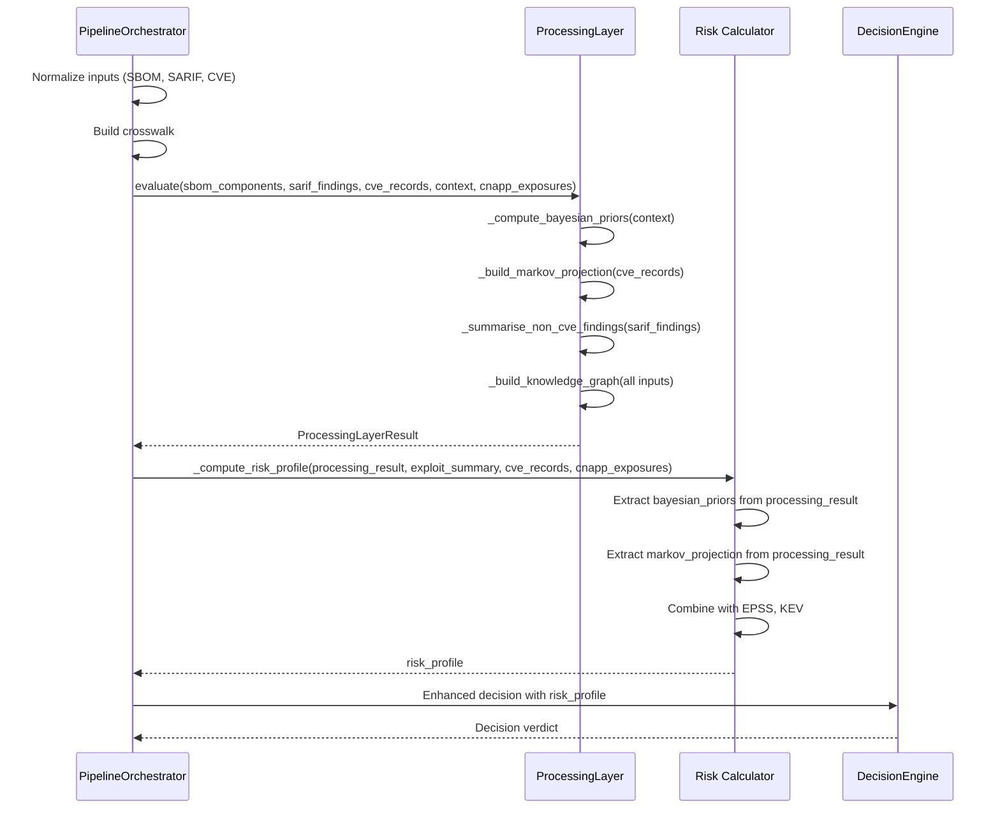

**Sources:** [apps/api/pipeline.py L640-L944](https://github.com/DevOpsMadDog/Fixops/blob/ce6eb1e9/apps/api/pipeline.py#L640-L944)

### Data Flow Through Pipeline Stages

| Pipeline Stage | Processing Layer Role | Output Usage |
| --- | --- | --- |
| Input Normalization | Not involved | Provides inputs to Processing Layer |
| Crosswalk Building | Not involved | Component/finding relationships used in graph |
| **Processing Layer** | **Evaluate all inputs** | **Produces ProcessingLayerResult** |
| Risk Calculation | Bayesian priors, Markov projections consumed | Combined with EPSS/KEV for final risk score |
| Decision Engine | Non-CVE findings, knowledge graph metrics used | Influences decision logic and confidence |
| Policy Automation | Not directly consumed | Risk scores trigger policy actions |

**Sources:** [apps/api/pipeline.py L640-L944](https://github.com/DevOpsMadDog/Fixops/blob/ce6eb1e9/apps/api/pipeline.py#L640-L944)

---

## Fallback Mechanisms

The Processing Layer implements graceful degradation when optional dependencies are unavailable:

### Library Detection

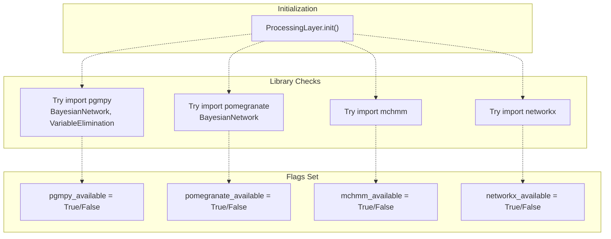

**Sources:** [core/processing_layer.py L10-L34](https://github.com/DevOpsMadDog/Fixops/blob/ce6eb1e9/core/processing_layer.py#L10-L34)

 [core/processing_layer.py L60-L70](https://github.com/DevOpsMadDog/Fixops/blob/ce6eb1e9/core/processing_layer.py#L60-L70)

### Fallback Strategies

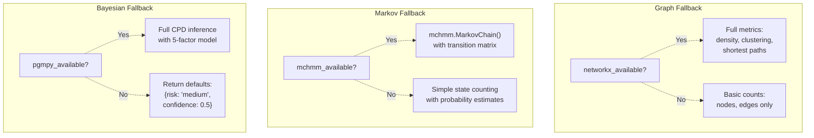

The fallback implementations ensure the Processing Layer always returns a valid `ProcessingLayerResult` even in constrained environments. The `library_status` dictionary in the result allows downstream consumers to assess the quality of the analysis.

**Sources:** [core/processing_layer.py L110-L349](https://github.com/DevOpsMadDog/Fixops/blob/ce6eb1e9/core/processing_layer.py#L110-L349)

---

## Configuration and Feature Flags

The Processing Layer can be configured through the overlay configuration system:

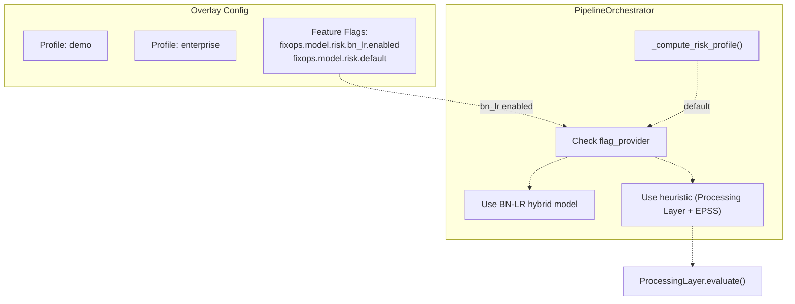

When the BN-LR hybrid model is disabled (default), the Processing Layer's Bayesian priors are used directly in risk calculation. When enabled, a separate BN-LR predictor is used instead (see [BN-LR Hybrid Risk Model](/DevOpsMadDog/Fixops/5.2-bn-lr-hybrid-risk-model)).

**Sources:** [apps/api/pipeline.py L288-L349](https://github.com/DevOpsMadDog/Fixops/blob/ce6eb1e9/apps/api/pipeline.py#L288-L349)

 [core/configuration.py](https://github.com/DevOpsMadDog/Fixops/blob/ce6eb1e9/core/configuration.py)

---

## Performance Characteristics

The Processing Layer's computational complexity depends on the size of inputs and which libraries are available:

| Operation | Complexity (pgmpy/mchmm/networkx) | Complexity (fallback) |
| --- | --- | --- |
| Bayesian inference | O(3^5) for 5-factor CPD = O(243) states | O(1) - return defaults |
| Markov projection | O(n) where n = number of CVE records | O(n) - simple counting |
| Knowledge graph construction | O(V + E) where V = nodes, E = edges | O(V + E) - same |
| Knowledge graph metrics | O(V^2) for shortest paths | O(1) - skip metrics |
| Non-CVE summarization | O(n log n) for sorting findings | O(n log n) - same |

For typical workloads (100-1000 components, 50-500 findings), the Processing Layer completes in under 500ms with all libraries available, or under 100ms with fallbacks.

**Sources:** [core/processing_layer.py L75-L349](https://github.com/DevOpsMadDog/Fixops/blob/ce6eb1e9/core/processing_layer.py#L75-L349)

---

## Error Handling

The Processing Layer implements defensive error handling to prevent processing failures from breaking the entire pipeline:

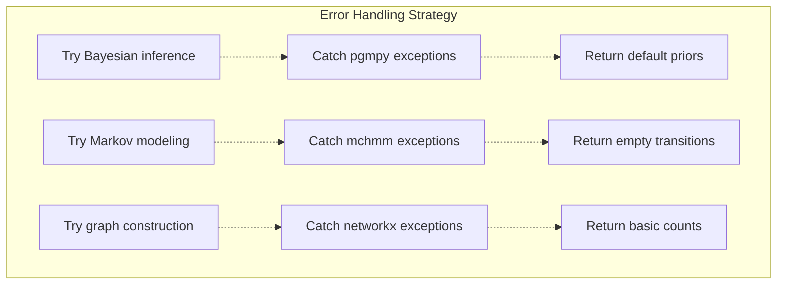

All errors are logged but do not propagate, ensuring the pipeline continues even if advanced analytics fail. This is critical for production reliability.

**Sources:** [core/processing_layer.py L186-L210](https://github.com/DevOpsMadDog/Fixops/blob/ce6eb1e9/core/processing_layer.py#L186-L210)

 [core/processing_layer.py L235-L266](https://github.com/DevOpsMadDog/Fixops/blob/ce6eb1e9/core/processing_layer.py#L235-L266)

---

## Testing and Validation

The Processing Layer is tested through integration tests that verify:

1. **Bayesian inference correctness**: Validate that high exploitation + open exposure produces high risk
2. **Markov projection accuracy**: Verify state transitions match input severity sequences
3. **Knowledge graph topology**: Check node/edge counts match input data
4. **Fallback behavior**: Ensure graceful degradation when libraries are unavailable
5. **Integration with risk calculation**: Verify outputs are correctly consumed by `_compute_risk_profile()`

**Sources:** [tests/test_round2_fresh_apps.py](https://github.com/DevOpsMadDog/Fixops/blob/ce6eb1e9/tests/test_round2_fresh_apps.py)

 [apps/api/pipeline.py L351-L449](https://github.com/DevOpsMadDog/Fixops/blob/ce6eb1e9/apps/api/pipeline.py#L351-L449)

---

## Summary

The Processing Layer provides sophisticated analytical capabilities that transform raw security findings into actionable risk intelligence:

* **Bayesian inference** applies SSVC-based context to compute risk priors
* **Markov modeling** forecasts severity escalation trends
* **Knowledge graphs** reveal attack paths and component relationships
* **Non-CVE analysis** ensures SAST findings are included in decisions
* **Graceful fallbacks** guarantee reliability across deployment environments

By combining probabilistic models with graph analytics, the Processing Layer enables the Decision Engine to make context-aware, risk-based determinations that go beyond simple severity thresholds.

**Sources:** [core/processing_layer.py L1-L387](https://github.com/DevOpsMadDog/Fixops/blob/ce6eb1e9/core/processing_layer.py#L1-L387)

 [apps/api/pipeline.py L288-L944](https://github.com/DevOpsMadDog/Fixops/blob/ce6eb1e9/apps/api/pipeline.py#L288-L944)