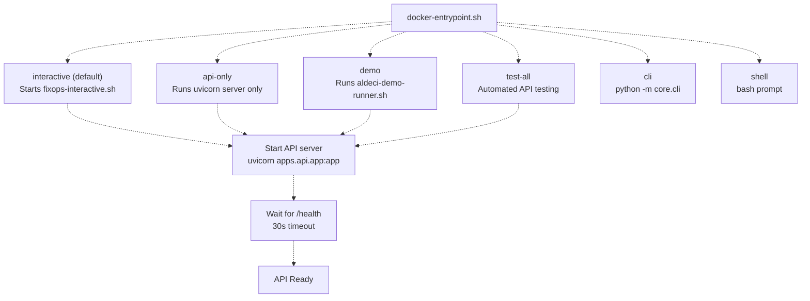
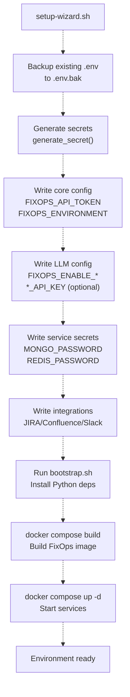
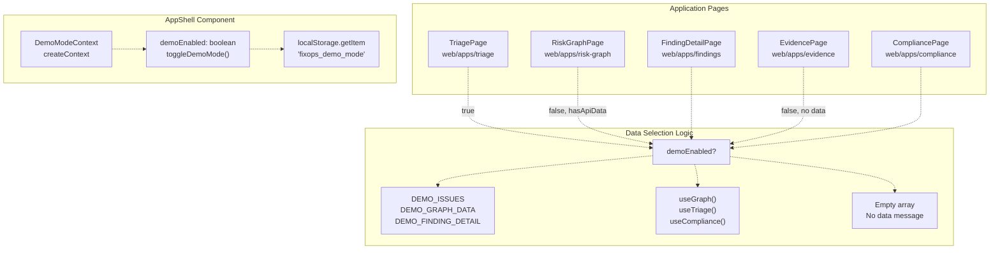
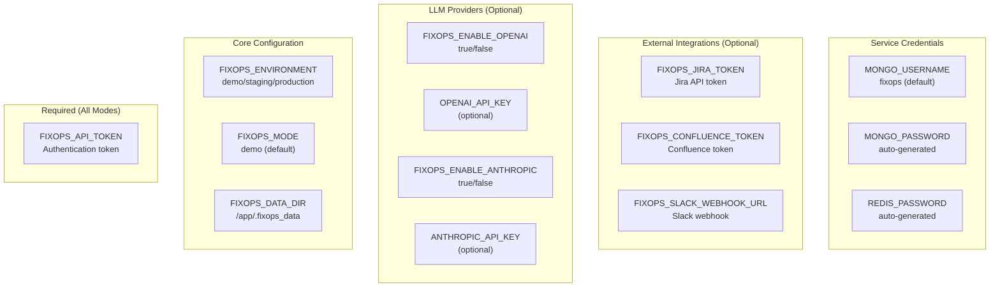
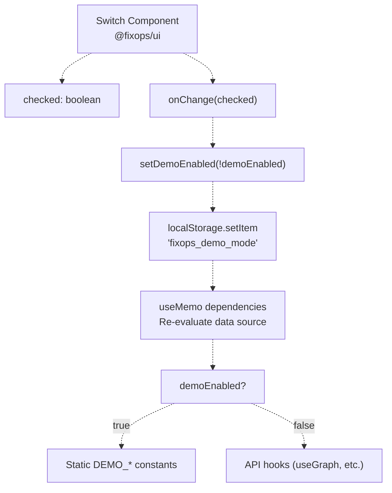
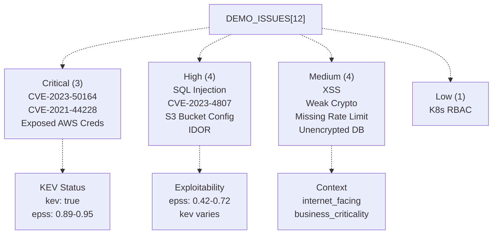

# Quickstart and Demo

> **Relevant source files**
> * [.env.example](https://github.com/DevOpsMadDog/Fixops/blob/ce6eb1e9/.env.example)
> * [.github/workflows/docker-build.yml](https://github.com/DevOpsMadDog/Fixops/blob/ce6eb1e9/.github/workflows/docker-build.yml)
> * [Dockerfile](https://github.com/DevOpsMadDog/Fixops/blob/ce6eb1e9/Dockerfile)
> * [deployment-packs/gcp/terraform/main.tf](https://github.com/DevOpsMadDog/Fixops/blob/ce6eb1e9/deployment-packs/gcp/terraform/main.tf)
> * [docs/COMPLETE_API_CLI_MAPPING.md](https://github.com/DevOpsMadDog/Fixops/blob/ce6eb1e9/docs/COMPLETE_API_CLI_MAPPING.md)
> * [docs/FIXOPS_PRODUCT_STATUS.md](https://github.com/DevOpsMadDog/Fixops/blob/ce6eb1e9/docs/FIXOPS_PRODUCT_STATUS.md)
> * [scripts/deploy-aws.sh](https://github.com/DevOpsMadDog/Fixops/blob/ce6eb1e9/scripts/deploy-aws.sh)
> * [scripts/deploy-gcp.sh](https://github.com/DevOpsMadDog/Fixops/blob/ce6eb1e9/scripts/deploy-gcp.sh)
> * [scripts/docker-entrypoint.sh](https://github.com/DevOpsMadDog/Fixops/blob/ce6eb1e9/scripts/docker-entrypoint.sh)
> * [scripts/setup-wizard.sh](https://github.com/DevOpsMadDog/Fixops/blob/ce6eb1e9/scripts/setup-wizard.sh)
> * [web/app-urls.json](https://github.com/DevOpsMadDog/Fixops/blob/ce6eb1e9/web/app-urls.json)
> * [web/apps/compliance/app/page.tsx](https://github.com/DevOpsMadDog/Fixops/blob/ce6eb1e9/web/apps/compliance/app/page.tsx)
> * [web/apps/evidence/app/page.tsx](https://github.com/DevOpsMadDog/Fixops/blob/ce6eb1e9/web/apps/evidence/app/page.tsx)
> * [web/apps/findings/app/page.tsx](https://github.com/DevOpsMadDog/Fixops/blob/ce6eb1e9/web/apps/findings/app/page.tsx)
> * [web/apps/micro-pentest/app/components/EnterpriseShell.tsx](https://github.com/DevOpsMadDog/Fixops/blob/ce6eb1e9/web/apps/micro-pentest/app/components/EnterpriseShell.tsx)
> * [web/apps/micro-pentest/app/globals.css](https://github.com/DevOpsMadDog/Fixops/blob/ce6eb1e9/web/apps/micro-pentest/app/globals.css)
> * [web/apps/micro-pentest/app/layout.tsx](https://github.com/DevOpsMadDog/Fixops/blob/ce6eb1e9/web/apps/micro-pentest/app/layout.tsx)
> * [web/apps/reachability/app/components/EnterpriseShell.tsx](https://github.com/DevOpsMadDog/Fixops/blob/ce6eb1e9/web/apps/reachability/app/components/EnterpriseShell.tsx)
> * [web/apps/reachability/app/globals.css](https://github.com/DevOpsMadDog/Fixops/blob/ce6eb1e9/web/apps/reachability/app/globals.css)
> * [web/apps/reachability/app/layout.tsx](https://github.com/DevOpsMadDog/Fixops/blob/ce6eb1e9/web/apps/reachability/app/layout.tsx)
> * [web/apps/reports/app/page.tsx](https://github.com/DevOpsMadDog/Fixops/blob/ce6eb1e9/web/apps/reports/app/page.tsx)
> * [web/apps/risk-graph/app/page.tsx](https://github.com/DevOpsMadDog/Fixops/blob/ce6eb1e9/web/apps/risk-graph/app/page.tsx)
> * [web/apps/shell/next.config.ts](https://github.com/DevOpsMadDog/Fixops/blob/ce6eb1e9/web/apps/shell/next.config.ts)
> * [web/apps/triage/app/globals.css](https://github.com/DevOpsMadDog/Fixops/blob/ce6eb1e9/web/apps/triage/app/globals.css)
> * [web/apps/triage/app/page.tsx](https://github.com/DevOpsMadDog/Fixops/blob/ce6eb1e9/web/apps/triage/app/page.tsx)
> * [web/packages/api-client/package.json](https://github.com/DevOpsMadDog/Fixops/blob/ce6eb1e9/web/packages/api-client/package.json)
> * [web/packages/api-client/src/client.ts](https://github.com/DevOpsMadDog/Fixops/blob/ce6eb1e9/web/packages/api-client/src/client.ts)
> * [web/packages/ui/src/components/AppShell.tsx](https://github.com/DevOpsMadDog/Fixops/blob/ce6eb1e9/web/packages/ui/src/components/AppShell.tsx)
> * [web/packages/ui/src/components/Surface.tsx](https://github.com/DevOpsMadDog/Fixops/blob/ce6eb1e9/web/packages/ui/src/components/Surface.tsx)
> * [web/packages/ui/src/components/Switch.tsx](https://github.com/DevOpsMadDog/Fixops/blob/ce6eb1e9/web/packages/ui/src/components/Switch.tsx)
> * [web/packages/ui/src/components/index.ts](https://github.com/DevOpsMadDog/Fixops/blob/ce6eb1e9/web/packages/ui/src/components/index.ts)

## Purpose and Scope

This document provides instructions for getting FixOps running quickly using Docker and demo mode. It covers the setup wizard, Docker deployment, demo mode architecture, and switching between demo and live data. For detailed system architecture, see [System Architecture](/DevOpsMadDog/Fixops/1.2-system-architecture). For production deployment, see deployment-specific documentation in `deployment-packs/`.

---

## Quick Start with Docker (30 seconds)

The fastest way to run FixOps is using the pre-built Docker image in demo mode:

```markdown
# Pull and run the latest image
docker run -d -p 8000:8000 \
  -e FIXOPS_MODE=demo \
  -e FIXOPS_API_TOKEN=demo-token \
  ghcr.io/devopsmaddog/fixops:latest

# Access the API
curl http://localhost:8000/health
```

The API server starts automatically with demo data populated. Web applications detect demo mode and display static example data without requiring backend connections.

**Sources:** [Dockerfile L88-L109](https://github.com/DevOpsMadDog/Fixops/blob/ce6eb1e9/Dockerfile#L88-L109)

 [scripts/docker-entrypoint.sh L24-L50](https://github.com/DevOpsMadDog/Fixops/blob/ce6eb1e9/scripts/docker-entrypoint.sh#L24-L50)

---

## Docker Entrypoint Modes

### Supported Execution Modes

The Docker image supports multiple execution modes through `docker-entrypoint.sh`:



**Mode Details:**

| Mode | Command | Description | Use Case |
| --- | --- | --- | --- |
| `interactive` | `docker run -it fixops` | Launches interactive tester menu | Manual testing, exploration |
| `api-only` | `docker run fixops api-only` | API server only, no tester | Production-like deployment |
| `demo` | `docker run fixops demo` | Animated demo runner | Presentations, demos |
| `test-all` | `docker run fixops test-all` | Runs all API tests | CI/CD validation |
| `cli <args>` | `docker run fixops cli health` | Execute CLI command | Scripted operations |
| `shell` | `docker run -it fixops shell` | Bash shell | Debugging, inspection |

**Sources:** [scripts/docker-entrypoint.sh L52-L139](https://github.com/DevOpsMadDog/Fixops/blob/ce6eb1e9/scripts/docker-entrypoint.sh#L52-L139)

---

## Setup Wizard

### One-Command Environment Bootstrap

The `setup-wizard.sh` script creates a complete, self-contained `.env` file with safe defaults:

```markdown
# Run setup wizard (no prompts required)
./scripts/setup-wizard.sh

# Or customize via environment variables
DEPLOYMENT_MODE=production \
FIXOPS_API_TOKEN=my-secure-token \
./scripts/setup-wizard.sh
```

### Setup Wizard Flow



**Key Functions:**

* `generate_secret()`: Creates cryptographically secure tokens using Python's `secrets.token_urlsafe(32)`
* Defaults to `docker-compose.demo.yml` for deployment
* Writes `.env` with 600 permissions (read/write owner only)

**Sources:** [scripts/setup-wizard.sh L1-L91](https://github.com/DevOpsMadDog/Fixops/blob/ce6eb1e9/scripts/setup-wizard.sh#L1-L91)

 [.env.example L1-L115](https://github.com/DevOpsMadDog/Fixops/blob/ce6eb1e9/.env.example#L1-L115)

---

## Demo Mode Architecture

### Frontend Demo Mode Implementation

Web applications use a shared `DemoModeContext` to toggle between demo and live data:



### Demo Mode State Persistence

The demo mode toggle persists across page refreshes:

```javascript
// AppShell component initialization
useEffect(() => {
  if (typeof window !== 'undefined') {
    try {
      const stored = localStorage.getItem('fixops_demo_mode')
      if (stored !== null) {
        setDemoEnabled(stored === 'true')
      }
    } catch {
      // Safari private browsing may block localStorage
    }
  }
}, [])
```

**Sources:** [web/packages/ui/src/components/AppShell.tsx L214-L241](https://github.com/DevOpsMadDog/Fixops/blob/ce6eb1e9/web/packages/ui/src/components/AppShell.tsx#L214-L241)

 [web/apps/triage/app/page.tsx L233-L273](https://github.com/DevOpsMadDog/Fixops/blob/ce6eb1e9/web/apps/triage/app/page.tsx#L233-L273)

### Demo Data Constants

Each application defines static demo data constants:

| Application | Demo Constant | Location | Data Type |
| --- | --- | --- | --- |
| Triage | `DEMO_ISSUES` | [web/apps/triage/app/page.tsx L26-L231](https://github.com/DevOpsMadDog/Fixops/blob/ce6eb1e9/web/apps/triage/app/page.tsx#L26-L231) | `Issue[]` (12 items) |
| Risk Graph | `DEMO_GRAPH_DATA` | [web/apps/risk-graph/app/page.tsx L30-L67](https://github.com/DevOpsMadDog/Fixops/blob/ce6eb1e9/web/apps/risk-graph/app/page.tsx#L30-L67) | `{nodes, edges}` |
| Findings | `DEMO_FINDING_DETAIL` | [web/apps/findings/app/page.tsx L90-L167](https://github.com/DevOpsMadDog/Fixops/blob/ce6eb1e9/web/apps/findings/app/page.tsx#L90-L167) | `FindingData` |
| Evidence | `DEMO_EVIDENCE_BUNDLES` | [web/apps/evidence/app/page.tsx L37-L173](https://github.com/DevOpsMadDog/Fixops/blob/ce6eb1e9/web/apps/evidence/app/page.tsx#L37-L173) | `EvidenceBundle[]` |
| Compliance | `DEMO_FRAMEWORKS` | [web/apps/compliance/app/page.tsx L33-L135](https://github.com/DevOpsMadDog/Fixops/blob/ce6eb1e9/web/apps/compliance/app/page.tsx#L33-L135) | `Framework[]`, `ControlGap[]` |

**Sources:** [web/apps/triage/app/page.tsx L26-L231](https://github.com/DevOpsMadDog/Fixops/blob/ce6eb1e9/web/apps/triage/app/page.tsx#L26-L231)

 [web/apps/risk-graph/app/page.tsx L30-L67](https://github.com/DevOpsMadDog/Fixops/blob/ce6eb1e9/web/apps/risk-graph/app/page.tsx#L30-L67)

 [web/apps/findings/app/page.tsx L90-L167](https://github.com/DevOpsMadDog/Fixops/blob/ce6eb1e9/web/apps/findings/app/page.tsx#L90-L167)

 [web/apps/evidence/app/page.tsx L37-L173](https://github.com/DevOpsMadDog/Fixops/blob/ce6eb1e9/web/apps/evidence/app/page.tsx#L37-L173)

 [web/apps/compliance/app/page.tsx L33-L135](https://github.com/DevOpsMadDog/Fixops/blob/ce6eb1e9/web/apps/compliance/app/page.tsx#L33-L135)

---

## Running Demo Scenarios

### CLI Demo Mode

The CLI includes a `demo` command that runs a full pipeline with demo data:

```markdown
# Run demo pipeline with pretty output
python -m core.cli demo --mode demo --output out/pipeline-demo.json --pretty

# Analyze demo SARIF file
python -m core.cli analyze --sarif simulations/demo_pack/scanner.sarif

# Run demo micro pentest
python -m core.cli micro-pentest run --cve-ids CVE-2024-1234 --target-urls http://example.com
```

**Sources:** [docs/FIXOPS_PRODUCT_STATUS.md L247-L269](https://github.com/DevOpsMadDog/Fixops/blob/ce6eb1e9/docs/FIXOPS_PRODUCT_STATUS.md#L247-L269)

### Interactive Demo Runner

The Docker image includes an animated demo runner for presentations:

```markdown
# Run animated demo
docker run -it fixops demo

# Or execute directly
docker exec -it <container> /app/scripts/aldeci-demo-runner.sh
```

This launches a scripted demonstration of core FixOps capabilities with simulated API calls and decision-making.

**Sources:** [scripts/docker-entrypoint.sh L101-L105](https://github.com/DevOpsMadDog/Fixops/blob/ce6eb1e9/scripts/docker-entrypoint.sh#L101-L105)

 [Dockerfile L82-L85](https://github.com/DevOpsMadDog/Fixops/blob/ce6eb1e9/Dockerfile#L82-L85)

### CI/CD Testing with Demo Data

The GitHub Actions workflow tests all 111 CLI commands using a shared data directory:

```sql
# Create shared data directory for database persistence
mkdir -p ${{ runner.temp }}/fixops-data
chmod 777 ${{ runner.temp }}/fixops-data

# Run commands with shared volume
DOCKER_OPTS="--rm -v ${{ runner.temp }}/fixops-data:/app/.fixops_data \
             -e FIXOPS_DISABLE_TELEMETRY=1 \
             -e FIXOPS_API_TOKEN=test-token"

docker run $DOCKER_OPTS fixops-test:${{ github.sha }} \
  python -m core.cli compliance frameworks --format json
```

**Sources:** [.github/workflows/docker-build.yml L103-L206](https://github.com/DevOpsMadDog/Fixops/blob/ce6eb1e9/.github/workflows/docker-build.yml#L103-L206)

---

## Environment Configuration

### Required vs Optional Variables



### Minimal Configuration

For demo mode, only one variable is strictly required:

```markdown
# Minimal .env for demo mode
FIXOPS_API_TOKEN=demo-token-12345
```

All other variables have sensible defaults in the Docker image.

**Sources:** [Dockerfile L88-L99](https://github.com/DevOpsMadDog/Fixops/blob/ce6eb1e9/Dockerfile#L88-L99)

 [.env.example L1-L115](https://github.com/DevOpsMadDog/Fixops/blob/ce6eb1e9/.env.example#L1-L115)

### LLM Fallback Behavior

When LLM API keys are not provided:

1. **Deterministic Mode**: If all providers disabled or no keys, falls back to risk-based heuristics
2. **Single-LLM Mode**: If one provider has a key, uses only that provider
3. **Multi-LLM Consensus**: If 2+ providers have keys, uses weighted consensus

```markdown
# Decision engine checks for API keys
if not any([openai_key, anthropic_key, gemini_key, sentinel_key]):
    logger.warning("No LLM keys configured, using deterministic fallback")
    return deterministic_decision(finding)
```

**Sources:** [.env.example L20-L36](https://github.com/DevOpsMadDog/Fixops/blob/ce6eb1e9/.env.example#L20-L36)

 [docs/FIXOPS_PRODUCT_STATUS.md L404-L413](https://github.com/DevOpsMadDog/Fixops/blob/ce6eb1e9/docs/FIXOPS_PRODUCT_STATUS.md#L404-L413)

---

## Switching Between Demo and Live Mode

### UI Toggle Component

The `Switch` component provides an Apple-style toggle:



### Data Selection Pattern

All applications follow this pattern:

```javascript
const { demoEnabled } = useDemoModeContext()
const { data: apiData, loading, error } = useApiHook()

const currentData = useMemo(() => {
  if (demoEnabled) {
    return DEMO_DATA_CONSTANT
  }
  if (apiData?.items?.length > 0) {
    return transformApiData(apiData)
  }
  return [] // Empty state
}, [apiData, demoEnabled])
```

### Status Badge Display

The `StatusBadge` component shows current mode:

| Condition | Badge | Color |
| --- | --- | --- |
| `demoEnabled === true` | "Demo Data" | Amber |
| `!demoEnabled && loading` | "Loading..." | Blue |
| `!demoEnabled && error` | "API Error" | Red |
| `!demoEnabled && !hasData` | "No Data" | Yellow |
| `!demoEnabled && hasData` | "Live (mode)" | Green |

**Sources:** [web/apps/triage/app/page.tsx L233-L273](https://github.com/DevOpsMadDog/Fixops/blob/ce6eb1e9/web/apps/triage/app/page.tsx#L233-L273)

 [web/packages/ui/src/components/Switch.tsx L1-L78](https://github.com/DevOpsMadDog/Fixops/blob/ce6eb1e9/web/packages/ui/src/components/Switch.tsx#L1-L78)

 [web/packages/ui/src/components/AppShell.tsx L214-L240](https://github.com/DevOpsMadDog/Fixops/blob/ce6eb1e9/web/packages/ui/src/components/AppShell.tsx#L214-L240)

---

## Health Checks and Readiness

### API Health Endpoint

The Docker image includes a health check that polls `/health`:

```
HEALTHCHECK --interval=30s --timeout=10s --start-period=5s --retries=3 \
    CMD curl -f http://localhost:8000/health || exit 1
```

### Startup Wait Logic

The entrypoint script waits for the API to be ready before proceeding:

```php
API_READY=false
for i in {1..30}; do
    if curl -s http://localhost:8000/health > /dev/null 2>&1; then
        echo "API server is ready!"
        API_READY=true
        break
    fi
    sleep 1
done

if [[ "$API_READY" != "true" ]]; then
    echo "ERROR: API server failed to start within 30 seconds"
    exit 1
fi
```

This ensures that API-dependent operations (like CLI commands) don't execute before the server is available.

**Sources:** [Dockerfile L102-L103](https://github.com/DevOpsMadDog/Fixops/blob/ce6eb1e9/Dockerfile#L102-L103)

 [scripts/docker-entrypoint.sh L32-L49](https://github.com/DevOpsMadDog/Fixops/blob/ce6eb1e9/scripts/docker-entrypoint.sh#L32-L49)

---

## Demo Data Structure

### Triage Demo Issues

The triage page includes 12 representative security issues:



Each demo issue includes:

* `id`, `title`, `severity`, `source`, `repo`, `location`
* `exploitability: {kev, epss}`
* `internet_facing`, `age_days`, `business_criticality`
* `description`, `remediation`

**Sources:** [web/apps/triage/app/page.tsx L26-L231](https://github.com/DevOpsMadDog/Fixops/blob/ce6eb1e9/web/apps/triage/app/page.tsx#L26-L231)

### Risk Graph Demo Data

The risk graph includes 14 nodes (4 services, 5 components, 4 CVEs, 1 SAST) and 12 edges:

```
Services → Components → Vulnerabilities
payment-api → struts-core → CVE-2023-50164
user-service → express → CVE-2023-26136
user-service → SQL Injection (SAST)
logging-service → log4j → CVE-2021-44228
```

Node types use different colors in the legend:

* Service: Purple (`#6B5AED`)
* Component: Green (`#10b981`)
* Critical CVE: Red (`#dc2626`)
* KEV vulnerabilities: Gold border

**Sources:** [web/apps/risk-graph/app/page.tsx L30-L67](https://github.com/DevOpsMadDog/Fixops/blob/ce6eb1e9/web/apps/risk-graph/app/page.tsx#L30-L67)

 [web/apps/risk-graph/app/page.tsx L154-L203](https://github.com/DevOpsMadDog/Fixops/blob/ce6eb1e9/web/apps/risk-graph/app/page.tsx#L154-L203)

---

## Next Steps

* For API architecture details, see [FastAPI Application Structure](/DevOpsMadDog/Fixops/3.1-fastapi-application-structure)
* For CLI command reference, see [docs/FIXOPS_PRODUCT_STATUS.md L192-L476](https://github.com/DevOpsMadDog/Fixops/blob/ce6eb1e9/docs/FIXOPS_PRODUCT_STATUS.md#L192-L476)
* For production deployment, see `deployment-packs/{aws,gcp,azure}/`
* For evidence bundle structure, see [Evidence](#2.5)