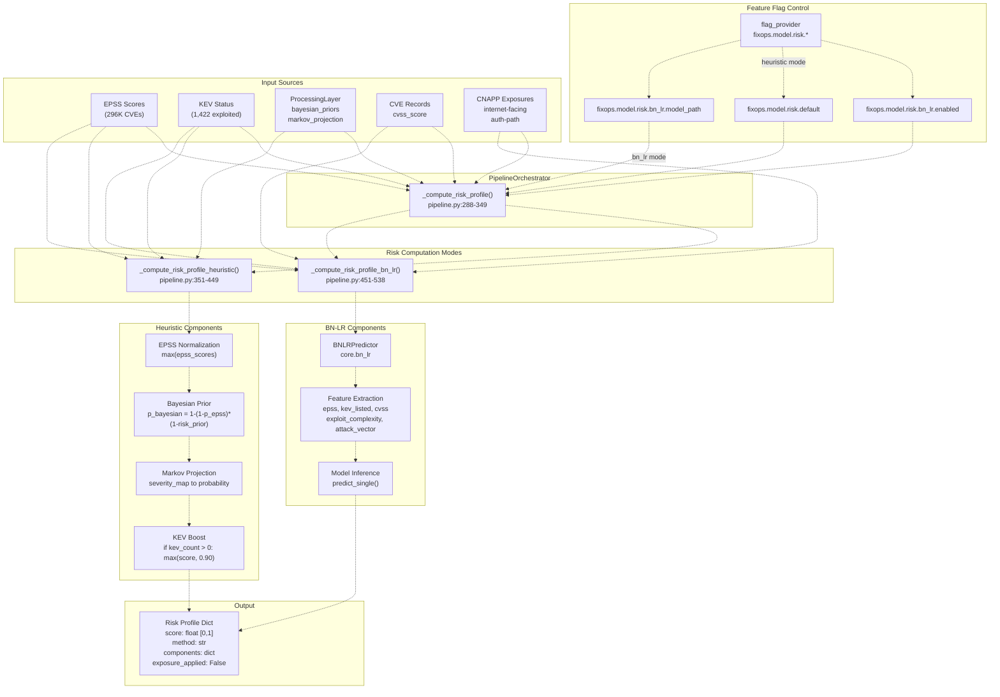
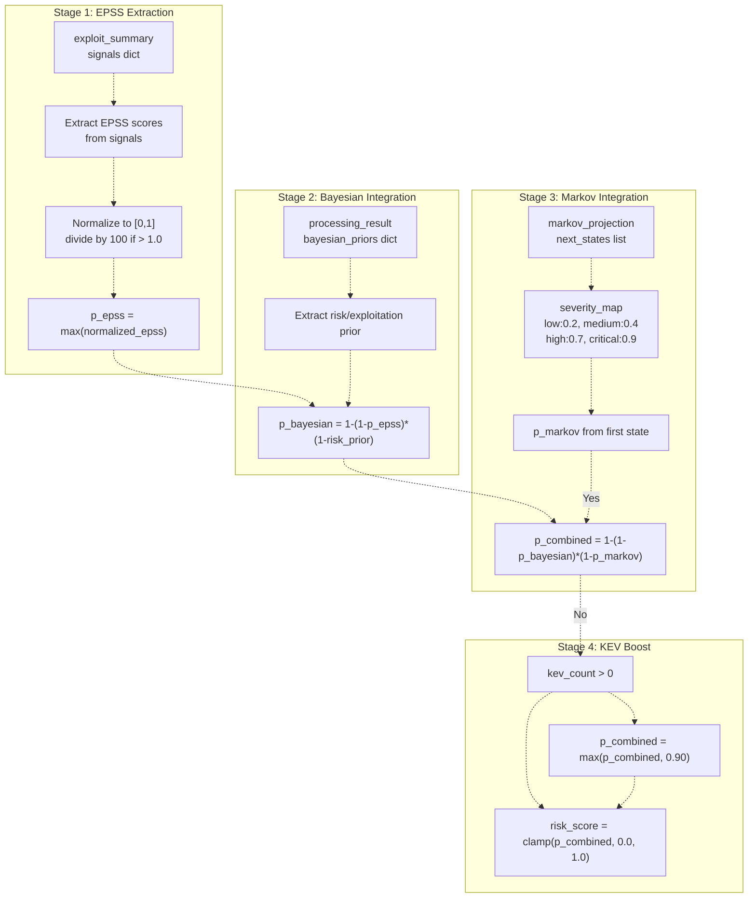
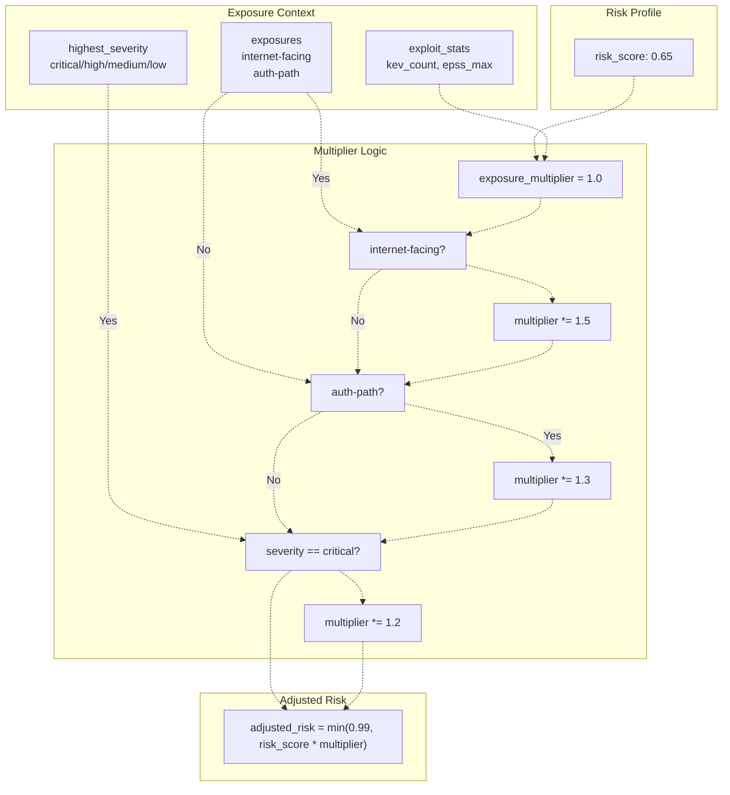
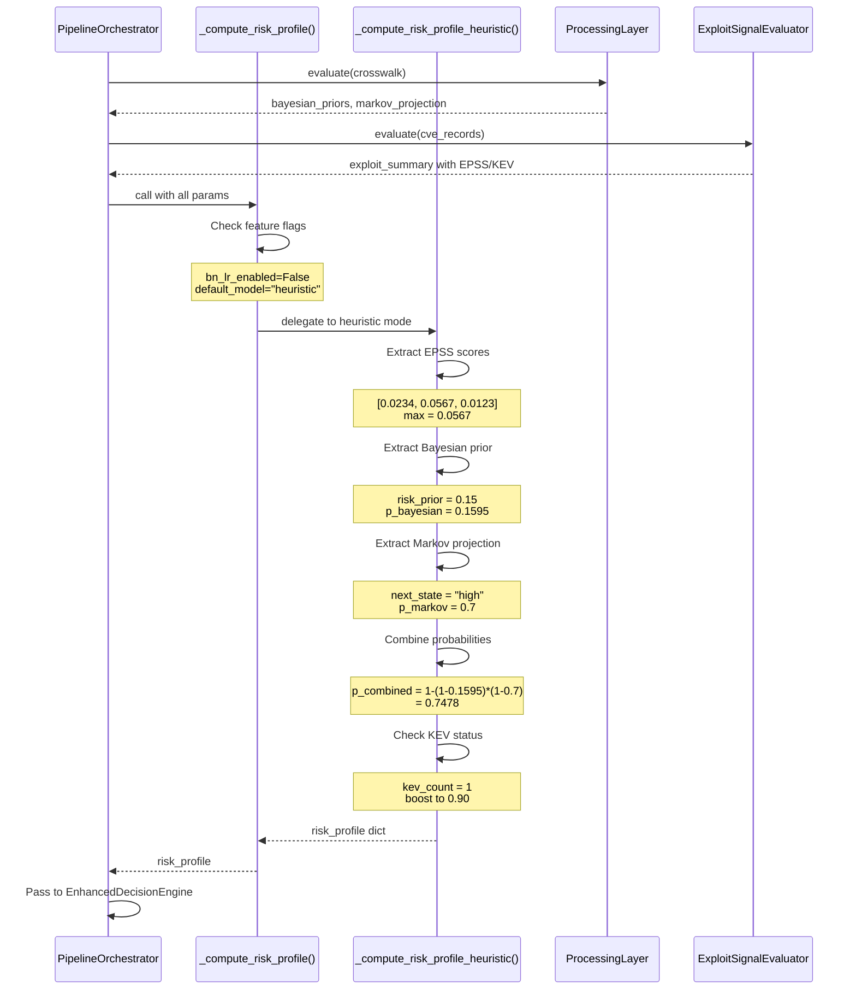

# Risk-Based Profiling

> **Relevant source files**
> * [apps/api/bulk_router.py](https://github.com/DevOpsMadDog/Fixops/blob/ce6eb1e9/apps/api/bulk_router.py)
> * [apps/api/collaboration_router.py](https://github.com/DevOpsMadDog/Fixops/blob/ce6eb1e9/apps/api/collaboration_router.py)
> * [apps/api/deduplication_router.py](https://github.com/DevOpsMadDog/Fixops/blob/ce6eb1e9/apps/api/deduplication_router.py)
> * [apps/api/integrations_router.py](https://github.com/DevOpsMadDog/Fixops/blob/ce6eb1e9/apps/api/integrations_router.py)
> * [apps/api/pipeline.py](https://github.com/DevOpsMadDog/Fixops/blob/ce6eb1e9/apps/api/pipeline.py)
> * [apps/api/remediation_router.py](https://github.com/DevOpsMadDog/Fixops/blob/ce6eb1e9/apps/api/remediation_router.py)
> * [apps/api/webhooks_router.py](https://github.com/DevOpsMadDog/Fixops/blob/ce6eb1e9/apps/api/webhooks_router.py)
> * [backend_test.py](https://github.com/DevOpsMadDog/Fixops/blob/ce6eb1e9/backend_test.py)
> * [core/adapters.py](https://github.com/DevOpsMadDog/Fixops/blob/ce6eb1e9/core/adapters.py)
> * [core/analytics.py](https://github.com/DevOpsMadDog/Fixops/blob/ce6eb1e9/core/analytics.py)
> * [core/compliance.py](https://github.com/DevOpsMadDog/Fixops/blob/ce6eb1e9/core/compliance.py)
> * [core/configuration.py](https://github.com/DevOpsMadDog/Fixops/blob/ce6eb1e9/core/configuration.py)
> * [core/connectors.py](https://github.com/DevOpsMadDog/Fixops/blob/ce6eb1e9/core/connectors.py)
> * [core/decision_policy.py](https://github.com/DevOpsMadDog/Fixops/blob/ce6eb1e9/core/decision_policy.py)
> * [core/enhanced_decision.py](https://github.com/DevOpsMadDog/Fixops/blob/ce6eb1e9/core/enhanced_decision.py)
> * [core/llm_providers.py](https://github.com/DevOpsMadDog/Fixops/blob/ce6eb1e9/core/llm_providers.py)
> * [core/services/collaboration.py](https://github.com/DevOpsMadDog/Fixops/blob/ce6eb1e9/core/services/collaboration.py)
> * [core/services/deduplication.py](https://github.com/DevOpsMadDog/Fixops/blob/ce6eb1e9/core/services/deduplication.py)
> * [core/services/identity.py](https://github.com/DevOpsMadDog/Fixops/blob/ce6eb1e9/core/services/identity.py)
> * [core/services/remediation.py](https://github.com/DevOpsMadDog/Fixops/blob/ce6eb1e9/core/services/remediation.py)
> * [demo_ssdlc_stages/03_code_development.json](https://github.com/DevOpsMadDog/Fixops/blob/ce6eb1e9/demo_ssdlc_stages/03_code_development.json)
> * [demo_ssdlc_stages/04_build_ci.yaml](https://github.com/DevOpsMadDog/Fixops/blob/ce6eb1e9/demo_ssdlc_stages/04_build_ci.yaml)
> * [demo_ssdlc_stages/06_deploy_production.yaml](https://github.com/DevOpsMadDog/Fixops/blob/ce6eb1e9/demo_ssdlc_stages/06_deploy_production.yaml)
> * [fixops-enterprise/src/services/feeds_service.py](https://github.com/DevOpsMadDog/Fixops/blob/ce6eb1e9/fixops-enterprise/src/services/feeds_service.py)
> * [fixops-enterprise/src/services/vex_ingestion.py](https://github.com/DevOpsMadDog/Fixops/blob/ce6eb1e9/fixops-enterprise/src/services/vex_ingestion.py)
> * [tests/e2e/test_critical_decision_policy.py](https://github.com/DevOpsMadDog/Fixops/blob/ce6eb1e9/tests/e2e/test_critical_decision_policy.py)
> * [tests/test_comprehensive_e2e.py](https://github.com/DevOpsMadDog/Fixops/blob/ce6eb1e9/tests/test_comprehensive_e2e.py)
> * [tests/test_data_generator.py](https://github.com/DevOpsMadDog/Fixops/blob/ce6eb1e9/tests/test_data_generator.py)
> * [tests/test_enhanced_api.py](https://github.com/DevOpsMadDog/Fixops/blob/ce6eb1e9/tests/test_enhanced_api.py)

## Purpose and Scope

Risk-Based Profiling is the quantitative risk scoring system that computes normalized exploitation probability scores for security findings. This system combines threat intelligence (EPSS, KEV), probabilistic models (Bayesian networks, Markov chains), and exposure context (internet-facing, authentication paths) to produce risk scores in the range [0,1]. These scores feed into the decision engine to determine whether findings should be blocked, reviewed, or allowed.

For information about how these risk scores are used to make final decisions, see [Enhanced Decision Service](/DevOpsMadDog/Fixops/4.4-enhanced-decision-service). For the underlying probabilistic models, see [Bayesian and Markov Models](/DevOpsMadDog/Fixops/5.1-bayesian-and-markov-models) and [BN-LR Hybrid Risk Model](/DevOpsMadDog/Fixops/5.2-bn-lr-hybrid-risk-model).

## System Overview

The Risk-Based Profiling system operates in two modes: **heuristic** (combining multiple intelligence sources with statistical weighting) and **bn_lr** (using trained Bayesian Network + Logistic Regression models). Both modes produce risk scores that represent the probability of exploitation before exposure multipliers are applied.

### Risk Score Computation Flow



**Sources:** [apps/api/pipeline.py L288-L349](https://github.com/DevOpsMadDog/Fixops/blob/ce6eb1e9/apps/api/pipeline.py#L288-L349)

 [apps/api/pipeline.py L351-L449](https://github.com/DevOpsMadDog/Fixops/blob/ce6eb1e9/apps/api/pipeline.py#L351-L449)

 [apps/api/pipeline.py L451-L538](https://github.com/DevOpsMadDog/Fixops/blob/ce6eb1e9/apps/api/pipeline.py#L451-L538)

## Risk Computation Modes

The system supports two computation modes controlled by feature flags in `OverlayConfig`.

### Heuristic Mode

Heuristic mode combines multiple intelligence sources using probabilistic independence assumptions. It operates in four stages:



The method signature is:

```python
def _compute_risk_profile_heuristic(
    self,
    processing_result: Any,
    exploit_summary: Optional[Dict[str, Any]],
    cve_records: Sequence[Any],
    cnapp_exposures: Sequence[Mapping[str, Any]],
) -> Dict[str, Any]
```

**Key algorithmic details:**

1. **EPSS scores** are extracted from `exploit_summary["signals"]` by matching signal IDs containing "epss" or "probability"
2. **Bayesian priors** are extracted from `processing_result.bayesian_priors["risk"]` or `["exploitation"]`
3. **Markov projections** use the first state from `processing_result.markov_projection["next_states"]`
4. **Probabilistic combination** uses the formula: `P(A or B) = 1 - P(not A) * P(not B)`
5. **KEV boost** sets a floor of 0.90 for any finding with KEV status

**Sources:** [apps/api/pipeline.py L351-L449](https://github.com/DevOpsMadDog/Fixops/blob/ce6eb1e9/apps/api/pipeline.py#L351-L449)

### BN-LR Mode

BN-LR mode uses a trained Bayesian Network + Logistic Regression hybrid model to predict exploitation probability based on feature vectors:

| Feature | Source | Type | Description |
| --- | --- | --- | --- |
| `epss` | exploit_summary signals | float [0,1] | EPSS exploitation probability |
| `kev_listed` | exploit_summary signals | int {0,1} | Whether CVE is in CISA KEV catalog |
| `cvss` | cve_records | float [0,10] | Maximum CVSS score from records |
| `exploit_complexity` | default | float [0,1] | Hardcoded to 0.5 (median) |
| `attack_vector` | default | float [0,1] | Hardcoded to 0.5 (median) |
| `patch_available` | default | int {0,1} | Hardcoded to 0 (no patch) |
| `user_interaction` | default | int {0,1} | Hardcoded to 1 (required) |
| `asset_criticality` | default | float [0,1] | Hardcoded to 0.5 (medium) |

The BN-LR predictor is loaded from `model_path` and invoked via:

```
predictor = BNLRPredictor(model_path)
result = predictor.predict_single(
    epss=epss,
    kev_listed=kev_listed,
    cvss=cvss,
    exploit_complexity=exploit_complexity,
    attack_vector=attack_vector,
    patch_available=patch_available,
    user_interaction=user_interaction,
    asset_criticality=asset_criticality,
)
```

**Output includes:**

* `probability`: Risk score [0,1]
* `bn_posteriors`: Posterior probabilities from Bayesian network
* `bn_cpd_hash`: Hash of CPD parameters for audit trail

**Sources:** [apps/api/pipeline.py L451-L538](https://github.com/DevOpsMadDog/Fixops/blob/ce6eb1e9/apps/api/pipeline.py#L451-L538)

## Feature Flag Configuration

Risk profiling behavior is controlled by three feature flags in `fixops.overlay.yml`:

```yaml
feature_flags:
  fixops.model.risk.bn_lr.enabled: false    # Enable BN-LR model
  fixops.model.risk.default: "heuristic"    # "heuristic" or "bn_lr"
  fixops.model.risk.bn_lr.model_path: ""    # Path to trained model
```

The decision logic is:

```yaml
if bn_lr_enabled and default_model == "bn_lr" and model_path:
    return self._compute_risk_profile_bn_lr(...)
else:
    return self._compute_risk_profile_heuristic(...)
```

**Sources:** [apps/api/pipeline.py L317-L349](https://github.com/DevOpsMadDog/Fixops/blob/ce6eb1e9/apps/api/pipeline.py#L317-L349)

 [core/configuration.py L1-L681](https://github.com/DevOpsMadDog/Fixops/blob/ce6eb1e9/core/configuration.py#L1-L681)

## Data Source Integration

### Threat Intelligence Sources

```mermaid
flowchart TD

EPSSFeed["EPSS Feed<br>296,333 CVEs<br>data/exploit_signals/epss_scores.json"]
KEVFeed["KEV Feed<br>1,422 exploited CVEs<br>data/exploit_signals/kev_catalog.json"]
ExploitSignals["evaluate()<br>exploit_signals.py"]
BayesianEngine["Bayesian Network<br>pgmpy CPDs<br>5-factor model"]
MarkovEngine["Markov Chain<br>hmmlearn<br>state transitions"]
ProcessingEvaluate["evaluate()<br>processing_layer.py"]
CVENormalizer["CVE Feed Normalizer<br>NormalizedCVEFeed"]
CVERecordSummary["CVERecordSummary<br>cve_id, severity, cvss_score"]
CNAPPNormalizer["CNAPP Normalizer<br>NormalizedCNAPP"]
ExposureFindings["exposure findings<br>internet-facing, auth-path"]
ExploitabilityParam["exploitability param"]
ProcessingResultParam["processing_result param"]
CVERecordsParam["cve_records param"]
CNAPPParam["cnapp param"]
ComputeRiskProfile["_compute_risk_profile()"]

ExploitSignals -.-> ExploitabilityParam
ProcessingEvaluate -.-> ProcessingResultParam
CVERecordSummary -.-> CVERecordsParam
ExposureFindings -.-> CNAPPParam
ExploitabilityParam -.-> ComputeRiskProfile
ProcessingResultParam -.-> ComputeRiskProfile
CVERecordsParam -.-> ComputeRiskProfile
CNAPPParam -.-> ComputeRiskProfile

subgraph PipelineOrchestrator.run() ["PipelineOrchestrator.run()"]
    ExploitabilityParam
    ProcessingResultParam
    CVERecordsParam
    CNAPPParam
end

subgraph subGraph3 ["CNAPP Exposures"]
    CNAPPNormalizer
    ExposureFindings
    CNAPPNormalizer -.-> ExposureFindings
end

subgraph subGraph2 ["CVE Records"]
    CVENormalizer
    CVERecordSummary
    CVENormalizer -.-> CVERecordSummary
end

subgraph ProcessingLayer ["ProcessingLayer"]
    BayesianEngine
    MarkovEngine
    ProcessingEvaluate
    BayesianEngine -.-> ProcessingEvaluate
    MarkovEngine -.-> ProcessingEvaluate
end

subgraph ExploitSignalEvaluator ["ExploitSignalEvaluator"]
    EPSSFeed
    KEVFeed
    ExploitSignals
    EPSSFeed -.-> ExploitSignals
    KEVFeed -.-> ExploitSignals
end
```

### EPSS Score Extraction

EPSS scores are embedded in the `exploit_summary` dictionary returned by `ExploitSignalEvaluator`. The extraction logic:

```markdown
epss_scores = []
for signal_id, signal_data in signals.items():
    if 'epss' in signal_id.lower() or 'probability' in signal_id.lower():
        matches = signal_data.get('matches', [])
        for match in matches:
            value = match.get('value')
            if isinstance(value, (int, float)):
                epss_scores.append(float(value))

# Normalize: EPSS API returns percentages (0-100) or probabilities (0-1)
normalized_epss = [e / 100.0 if e > 1.0 else e for e in epss_scores]
p_epss = max(normalized_epss) if normalized_epss else 0.02  # baseline prior
```

### KEV Status Extraction

KEV status is determined by counting matches with "kev" or "exploited" in signal IDs:

```markdown
kev_count = 0
for signal_id, signal_data in signals.items():
    if 'kev' in signal_id.lower() or 'exploited' in signal_id.lower():
        kev_count += len(signal_data.get('matches', []))

# KEV boost: Any KEV-listed finding gets minimum 0.90 risk score
if kev_count > 0:
    p_combined = max(p_combined, 0.90)
```

**Sources:** [apps/api/pipeline.py L359-L388](https://github.com/DevOpsMadDog/Fixops/blob/ce6eb1e9/apps/api/pipeline.py#L359-L388)

 [core/exploit_signals.py L1-L500](https://github.com/DevOpsMadDog/Fixops/blob/ce6eb1e9/core/exploit_signals.py#L1-L500)

## Risk Profile Output Format

The risk profile is returned as a dictionary with the following structure:

```css
{
    "score": 0.7234,                    # float [0,1] - exploitation probability
    "method": "epss+kev+bayesian+markov",  # computation method used
    "components": {
        "epss": 0.6541,                # EPSS contribution
        "kev_count": 1,                # Number of KEV matches
        "bayesian_used": True,         # Whether Bayesian prior was applied
        "markov_used": True,           # Whether Markov projection was applied
        "baseline_prior": 0.02,        # Baseline probability for unknowns
        "cvss": 8.5,                   # (BN-LR only) CVSS score
        "bn_posteriors": {...},        # (BN-LR only) Posterior probabilities
    },
    "exposure_applied": False,          # Exposure multipliers NOT yet applied
    "model_used": "heuristic",         # "heuristic" or "bn_lr"
    "bn_cpd_hash": "a3f7b2c1...",      # (BN-LR only) Model audit hash
}
```

**Key design decision:** The `exposure_applied` field is always `False` because exposure multipliers (internet-facing, authentication paths) are applied later in `EnhancedDecisionEngine._risk_based_profile()`. This separation allows the raw risk score to be independent of deployment context.

**Sources:** [apps/api/pipeline.py L437-L449](https://github.com/DevOpsMadDog/Fixops/blob/ce6eb1e9/apps/api/pipeline.py#L437-L449)

 [apps/api/pipeline.py L518-L538](https://github.com/DevOpsMadDog/Fixops/blob/ce6eb1e9/apps/api/pipeline.py#L518-L538)

## Exposure Multipliers (Applied Downstream)

While the risk profile computes base exploitation probability, the `EnhancedDecisionEngine` applies exposure multipliers based on CNAPP findings:



**Example calculation:**

* Base risk score: 0.65
* Internet-facing: Yes → multiply by 1.5 → 0.975
* Auth-path: Yes → multiply by 1.3 → 1.2675
* Clamped to 0.99 → final adjusted risk: 0.99

**Sources:** [core/enhanced_decision.py L277-L290](https://github.com/DevOpsMadDog/Fixops/blob/ce6eb1e9/core/enhanced_decision.py#L277-L290)

## Integration with Decision Thresholds

The risk score is compared against configurable thresholds to determine base actions:

```markdown
# Default thresholds in EnhancedDecisionEngine
self.risk_block_threshold = 0.85    # >= 0.85 → BLOCK
self.risk_review_threshold = 0.60   # >= 0.60 → REVIEW
                                     # < 0.60 → ALLOW
```

**Decision flow:**

| Risk Score | Base Action | Confidence |
| --- | --- | --- |
| >= 0.85 | BLOCK | 0.95 |
| >= 0.60 | REVIEW | 0.80 |
| < 0.60 | ALLOW | 0.70 |

These base actions can still be overridden by `DecisionPolicyEngine` rules (e.g., SQL injection in internet-facing authentication services always blocks).

**Sources:** [core/enhanced_decision.py L230-L237](https://github.com/DevOpsMadDog/Fixops/blob/ce6eb1e9/core/enhanced_decision.py#L230-L237)

 [core/decision_policy.py L1-L300](https://github.com/DevOpsMadDog/Fixops/blob/ce6eb1e9/core/decision_policy.py#L1-L300)

## Error Handling and Fallbacks

### BN-LR Model Failure

If the BN-LR model fails to load or predict, the system falls back to heuristic mode:

```javascript
try:
    from core.bn_lr import BNLRPredictor
    predictor = BNLRPredictor(model_path)
    result = predictor.predict_single(...)
    return {
        "score": round(result["probability"], 4),
        "method": "bn_lr",
        "model_used": "bn_lr",
        # ...
    }
except Exception as e:
    return {
        "score": 0.5,
        "method": "bn_lr_fallback",
        "components": {"error": str(e)},
        "model_used": "heuristic",
    }
```

### Missing Intelligence Sources

When intelligence sources are unavailable, the system uses conservative defaults:

| Missing Source | Fallback Behavior |
| --- | --- |
| EPSS scores | Use baseline prior (0.02) |
| KEV status | No boost applied |
| Bayesian priors | Use EPSS score only |
| Markov projection | Skip Markov combination |
| CVE records | Default CVSS to 0.0 |

**Sources:** [apps/api/pipeline.py L531-L538](https://github.com/DevOpsMadDog/Fixops/blob/ce6eb1e9/apps/api/pipeline.py#L531-L538)

 [apps/api/pipeline.py L383-L385](https://github.com/DevOpsMadDog/Fixops/blob/ce6eb1e9/apps/api/pipeline.py#L383-L385)

## Performance Considerations

### Caching Strategies

The `OverlayConfig` is cached at the instance level to avoid repeated feature flag lookups:

```
overlay = getattr(self, "overlay", None)
flag_provider = overlay.flag_provider if overlay else None
```

### Computational Complexity

| Mode | Time Complexity | Notes |
| --- | --- | --- |
| Heuristic | O(n) | n = number of EPSS signals |
| BN-LR | O(1) | Fixed feature vector size (8 features) |

### Database Access Patterns

Risk profiling does NOT directly query databases. All intelligence is passed as parameters from `PipelineOrchestrator.run()`, which handles data fetching and caching.

**Sources:** [apps/api/pipeline.py L317-L327](https://github.com/DevOpsMadDog/Fixops/blob/ce6eb1e9/apps/api/pipeline.py#L317-L327)

## Example: Complete Risk Profile Computation



**Sources:** [apps/api/pipeline.py L640-L850](https://github.com/DevOpsMadDog/Fixops/blob/ce6eb1e9/apps/api/pipeline.py#L640-L850)

 [apps/api/pipeline.py L288-L449](https://github.com/DevOpsMadDog/Fixops/blob/ce6eb1e9/apps/api/pipeline.py#L288-L449)